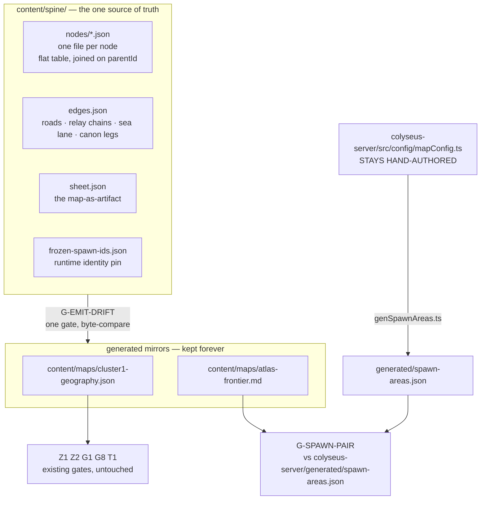

# Tier Spine

<div class="callout danger">
<strong>The measured problem.</strong> Four spatial artifacts in this repo describe the same world and
none of them agrees with any other. The word <code>region</code> means three different things across
them, and the running server reads none of them.
</div>

## 1. The problem, in numbers

<div class="metric-grid">
<div class="metric-tile alarm"><strong>4</strong><span>spatial artifacts</span></div>
<div class="metric-tile alarm"><strong>3</strong><span>meanings of "region"</span></div>
<div class="metric-tile alarm"><strong>5</strong><span>id keyspaces for the same places</span></div>
<div class="metric-tile alarm"><strong>3</strong><span>coordinate systems, 0 conversions</span></div>
<div class="metric-tile alarm"><strong>49.5%</strong><span>of the fiction sheet claimed by no polygon</span></div>
<div class="metric-tile alarm"><strong>2.85%</strong><span>of the sheet claimed by two polygons at once</span></div>
<div class="metric-tile alarm"><strong>0</strong><span>files under content/ the game server reads</span></div>
</div>

### 1.1 The four artifacts

| # | File | What it claims | Units | Geometry |
|---|---|---|---|---|
| 1 | `content/maps/atlas-frontier.md` | RUNTIME map: world 1000×1000, 3 "regions", 6 spawn areas, 3 zone hazards, `playerSpawn 500,500` | world units (`u`) | axis-aligned rects |
| 2 | `content/story/regions.json` | 10 "regions", `dangerTier`, prose | none | **none at all** |
| 3 | `content/maps/cluster1-geography.json` | FICTION sheet: 150×190 km, 10 zone polygons, 6 towns, 1 camp, 8 roads, 27 relay towers, 1 terrain patch, saltmire, coastline, river, ice edge, sea lane, distances, sheet block | km | polygons + polylines + points |
| 4 | `content/towns/town-millcross.json` + `docs/worldbuilding/A3-town-plans.md` | TOWN plan: 220×160 local, 17 footprints, 7 roads, 2 water, 1 plaza, 3 landmarks; gates T1–T7 | world units (`u`), **local** | rects + polylines + polygons |

### 1.2 "Region" means three things

`content/story/regions.json` holds 10 records, all `kind: "region"`, at **three different tiers**:

| Story id | Actually a | Evidence |
|---|---|---|
| `region-icefield`, `region-thornveil`, `region-ashvale-front` | **zone** (a fiction region) | `cluster1-geography.json#zones` has `northern-icefield`, `thornveil`, `ashvale-front` |
| `region-millcross`, `region-embervale`, `region-norhollow`, `region-gildmark`, `region-rooktide`, `region-cindervast` | **town** | `cluster1-geography.json#towns` has all six as settlements with an `at` point |
| `region-spawn-meadow` | **runtime playspace** | exists only in `atlas-frontier.md`; absent from the fiction geography entirely |

Millcross alone is currently **five** strings: `region-millcross` (story), `millcross` (geography town),
`millcross-ford` (geography zone), `zone-millcross-ford.json#zone` (zone content), `town-millcross.json#town`
(the plan). Two of those are different tiers of one place.

### 1.3 The arithmetic that does not close

| Fact | Measured | Source |
|---|---|---|
| Zone polygons cover | **43.28%** of the 150×190 km sheet (12,335.5 of 28,500 km²) | shoelace over `zones[].polygon` |
| With saltmire + eastern-hills | **53.34%** | + `saltmire.polygon`, `terrainPatches[0]` |
| Ground claimed by **no** polygon | **46.66%** | 0.5 km grid sample, 114,000 points |
| Ground claimed by **two** polygons | **~2.85%**, 8 pairs (largest: ashvale-front ∩ hollowmarch 1.27%) | pairwise clip |
| Polygon area ÷ bounding-box area, all 10 zones | **69.9% – 83.7%** | shoelace ÷ bbox |
| km → world-unit conversion factor anywhere in the repo | **does not exist** | grep `unitsPerKm|kmPerUnit|worldUnits` → 0 hits |

<div class="callout warn">
<strong>The runtime reads nothing.</strong> <code>colyseus-server/src</code> has exactly one non-test
<code>fs</code> import and it is build-time codegen (<code>src/codegen/isolate-schemas.ts</code>). World
size is the hardcoded constant <code>GAME_CONFIG.worldWidth = 1000</code>. Every one of the four
artifacts is a <em>gate-only</em> artifact. That is why this design is cheap: nothing here can break
the running game, and the whole enforcement surface is <code>scripts/check_content.mjs</code>.
</div>

---

## 2. The shape of the fix



Two structural decisions carry the whole design:

1. **Every existing consumer file becomes a generated mirror of the spine, under a drift gate** —
   exactly the pattern `docs/story/story-graph.md` already uses. That is why most migration phases
   redden nothing: the four artifacts keep existing byte-identically, they just stop being hand-authored.
2. **The spine never emits both sides of a cross-check.** `colyseus-server/src/config/mapConfig.ts`
   stays hand-authored, so `generated/spawn-areas.json` stays independently sourced and
   `G-SPAWN-PAIR` keeps meaning something. (The adversarial review caught the earlier draft
   destroying its own gate here.)

---

## 3. The node schema — ONE shape, every tier

One JSON file per node at `content/spine/nodes/<id>.json`, filename stem === `id`. The gate loads
them with a **sorted** `readdirSync` and joins on `parentId`.

```jsonc
{
  // ══════════ IDENTITY ══════════
  "id": "n-millcross-ford",
  //  ^n-[a-z0-9]+(-[a-z0-9]+)*$ — a NEW keyspace, disjoint from the five that exist.
  //  MUST equal the filename stem (case-sensitive). Nothing outside the spine is renamed;
  //  everything points INTO the spine by foreign key.

  "tier": "region",
  //  enum. TIER_DEPTH is the single source of truth for what nesting is legal:
  //    world 0 · playroot 0
  //    continent 1 · ocean 1 · playspace 1 · fixture 1
  //    region 2 · sea 2
  //    town 3 · site 3
  //  Two labels may share a depth, so an Ocean sits BESIDE a Continent with no second schema.
  //  This is the entire fix for "region means three things": `region` is a DEPTH, not a vibe.
  //  A town can never again be a region because a town is depth 3.

  "parentId": "n-cluster1",
  //  string | null. null iff TIER_DEPTH[tier] === 0, and the set of depth-0 ids must equal the
  //  committed list in content/spine/roots.json. TWO roots ship: n-atlas (fiction) and
  //  n-playroot (runtime). The runtime tree is NOT hung off the fiction continent — see §7.

  "title": "Millcross Ford",     // human label. Never an identifier, never parsed.

  // ══════════ PROVENANCE & FREEZE ══════════
  "provenance": {
    "authored": "hand",          // hand | generated | derived
    "generator": null,           // {name, version} — required iff authored === "generated"
    "source": "docs/worldbuilding/A1-geography-cluster1.md#4.1"
  },
  //  A node with authored === "generated" MUST be byte-reproducible by re-running its named
  //  generator at the pinned version against streamSeed(node, ...). This is what stops a future
  //  reroll silently eating a hand-edit made inside generated output.

  "frozen": true,
  //  true = canon-pinned placement. A reroll must not touch this node's seed, placement or anchor.
  //  TRANSITIVE: frozen === true implies every ANCESTOR is frozen (G-FROZEN, §8). Without that,
  //  rerolling an unfrozen continent moves its frozen towns and the canon distance table breaks.

  "absoluteAnchor": [86.0, 118.0],
  //  required iff frozen === true. The node's anchor resolved to ROOT units (km for the fiction
  //  tree). Codegen recomputes it through the parent chain and the gate byte-compares. This is the
  //  belt to frozen's braces: a transform change anywhere above the node fails loudly.

  // ══════════ SEED ══════════
  "seed": {
    "value": "9f2c4a1b77de0351",  // ^[0-9a-f]{16}$ . LITERAL, stored here, NOT derived from parent.
    "epoch": 3,                   // int ≥ 0, bumped on every reroll. Never decreases.
    "why": "reroll after the ford moved north in the A1 rewrite"
    //  string, REQUIRED non-empty whenever epoch > 0. Turns "was this reroll deliberate?" from
    //  archaeology into a read of the diff.
  },

  // ══════════ PLACEMENT — where this node sits in its PARENT's frame ══════════
  "placement": {
    "shape": "polygon",            // polygon | rect | point
    "points": [[72,106],[100,106],[100,132],[84,138],[72,136]],
    //  polygon only. Closed ring, last point NOT repeated, ≥ 3 points, no self-intersection,
    //  strictly positive signed shoelace area under the pinned formula (G-POLY). Coordinates are
    //  in the PARENT's units — never absolute, never local. This is what makes a subtree relocatable.
    // "rect": {"x":0,"y":0,"w":1000,"h":250},   // rect only, axis-aligned. Survives as a rect.
    // "at": [86,118],                            // point only. AREA ZERO — see §5.3.
    "anchor": [86.0, 118.0]
    //  REQUIRED on every node. The node's single representative point, in PARENT units.
    //  Defaults to the placement centroid; overridable by hand; gated to lie inside the placement
    //  polygon. This is what "the absolute position of a node" MEANS — G-CANON-LEG and G-NET both
    //  resolve to it. The geography's towns[].at and zones[].labelAt migrate into this field.
  },

  // ══════════ INTERIOR — the frame this node's CHILDREN are authored in ══════════
  "interior": {
    "units": "km",                 // km | u
    "perParentUnit": 1.0,
    //  how many of THIS node's units equal one PARENT unit. 1.0 when units match.
    //  G-SCALE FAILS any node whose units differ from its parent's while perParentUnit === 1.
    //  Only ONE tier edge changes units: region → town, where perParentUnit = 100 (1 km = 100 u).
    "size": [28.0, 32.0],          // DERIVED, never hand-authored — see the callout below.
    "originInParent": [72.0, 106.0]// DERIVED, never hand-authored.
  },
```

<div class="callout danger">
<strong>`interior.size` and `interior.originInParent` are DERIVED, and the gate byte-checks them.</strong>
The adversarial review found that authoring them independently of <code>placement</code> lets a subtree be
laid out 100 km from its own declared extent with every gate green. They are now computed by codegen:
<br/><code>originInParent = min-corner( bbox(placement) )</code>
<br/><code>size = [ bbox.w, bbox.h ] × perParentUnit</code>
<br/>They are written into the file (so a reviewer can read them) and <code>G-DERIVED-DRIFT</code>
fails if recomputation does not reproduce the committed bytes. There is exactly one exception:
a <strong>town</strong> node's <code>interior.size</code> comes from its town plan's
<code>extent</code>, and its <code>placement</code> is derived FROM that — see §3.2.
</div>

```jsonc
  // ══════════ COMPOSITION ══════════
  "composition": { "river": 46, "meadow": 32, "built": 12, "marsh": 10 },
  //  biome → percent OF THIS NODE'S PLACEMENT POLYGON AREA. Closed 12-value BIOMES enum.
  //  Integers or one decimal. Sum 100 ± 0.5. A 0 value is illegal — omit the key.
  //  Authored BY HAND at EVERY tier. This is the field the design exists to make diff-reviewable.

  "interstitial": { "meadow": 70, "marsh": 30 },
  //  biome → percent describing the part of this node's placement that NO CHILD claims.
  //  Required iff unclaimed fraction U > 0.005; forbidden otherwise.
  "interstitialUnsurveyed": false,
  //  true = "nobody has surveyed this ground yet". Codegen copies `composition` into `interstitial`
  //  and the gate reports the node's rollup as UNCHECKED rather than PASS. Counted against a
  //  committed budget so a half-built world cannot look finished.

  "compositionTolerance": null,  // number | null, per-key pp. Default 3.0, HARD CEILING 5.0.
  "toleranceWhy": null,          // string, REQUIRED non-null whenever compositionTolerance is set.

  "terrainKind": "river-country",
  //  AUTHORED, closed 7-value enum (ice · upland · alkali-flat · rim · bramble · headland ·
  //  river-country). The map legend label. NOT derived from `composition` — the review proved that
  //  derivation is not a function (five biomes map to no terrainKind, `rock` maps to two).
  //  Gated forward-only: the biomes terrainKind implies must appear in composition above a floor.

  // ══════════ NON-AREAL GEOMETRY ══════════
  "features": [
    { "id": "f-meltwash-reach-3", "kind": "line",
      "points": [[4,88],[9,91]], "attrs": {"name":"The Meltwash","character":"…"} },
    { "id": "f-the-ford",  "kind": "point", "at": [14,12], "attrs": {"label":"the ford"} },
    { "id": "f-junction-east-rim", "kind": "point", "at": [36,112], "attrs": {"role":"junction"} }
  ],
  //  kind: line | point. CARRY NO AREA and NEVER enter any composition sum.
  //  Home for: coastline, river reaches, ice-shelf lip, ford, tidal limit, relay towers, north
  //  mark, label anchors, playerSpawn, zone-hazard emitters, road-to-road junctions.
  //  Feature ids share ONE global namespace with node ids (G-ID). Coordinates are in THIS node's
  //  interior units; every distance gate resolves them to root units through the parent chain first.
  //  Optional per-feature "offSheet": true exempts a point from containment (the sea lane's [-6,148]).

  "bands": [
    { "id": "b-ashvale-outer", "label": "Outer Ash", "levelBand": [10,30],
      "axis": "y", "fromKm": 84, "toKm": 102, "attrs": {"graveRows": false} }
  ],
  //  NON-AREAL difficulty gradient inside this node. Ashvale Front's three gradientSegments live
  //  here. Bands are EXCLUDED from every area sum — the review measured that modelling them as
  //  child rects gives children totalling 119.4% of the parent, which disables the composition
  //  gate on the one zone the corpus calls a gradient.

  // ══════════ RUNTIME (only on nodes that are actually joinable) ══════════
  "runtime": {
    "mapIds": ["map-01-sector-a", "map-for-play"],
    //  ARRAY, not a single id. The server maps THREE mapIds onto ONE spawn table
    //  (mapConfig.ts:193-225 special-cases only the two test maps), so a mapId↔node bijection is
    //  unrepresentable. One node, many selectors — no duplicated spawn-area ids, no suffixing,
    //  no break to mob.spawnAreaId population accounting.
    "originU": [0, 0],
    //  the node's local (0,0) in ABSOLUTE WORLD UNITS. Gated as
    //  originInParent × perParentUnit (composed to root). This is the number
    //  buildTownStatics.ts:86-94 needs; it must never be handed a kilometre pair.
    "spawnAreas": [
      { "id": "thornveil_interior", "x": 890, "y": 400, "width": 100, "height": 160,
        "mobType": "bramble_drake", "count": 1 }
    ],
    //  verbatim runtime shape, in THIS node's interior units. Ids preserved byte-for-byte.
    "mobSettings": { "autoSpawn": true, "spawnIntervalMs": 6000, "respawnDelayMs": 15000 },
    //  EXACTLY the three keys MobLifeCycleManager actually reads (:58, :72, :96).
    //  desiredCount and maxMobs from mobSpawnConfig.ts are DEAD CODE and are deliberately absent.
    "seedDemoNPCs": true,   // the GameState.ts:190 per-map special case, as data.
    "collision": "footprints"  // none | footprints. Opt-in, never derived from geometry.
  },

  // ══════════ CROSS-TREE LINK ══════════
  "representsNodeId": null,
  //  string | null. A runtime playspace/site declaring which fiction node it stands in for
  //  (n-site-icefield-march → n-northern-icefield). Gated to resolve; printed by the gate so the
  //  duplication is NAMED DATA rather than a naming coincidence. Contributes no area anywhere.

  // ══════════ CANON / PROSE (opaque — the gate never reads inside) ══════════
  "lore": {
    "summary": "…", "emblem": "…", "reason": "The only cart-crossing of the river that splits the land",
    "order": 2, "note": "A1 §4.1", "withheld": ["Cindervast's interior"]
  },

  "tags": ["camp"],
  //  free kebab-case set: ruin · walls-only · camp · unnamed · schematic · runtime-only · fixture.
  //  Settlement RANK is a tag, not "which array you are in" — the expedition camp stops needing
  //  its own top-level array.

  "levelBand": [1, 15],
  //  [min,max] | null. Progression, not space. Kept ONLY because gate G8 already requires a
  //  cross-file element-for-element equality against it. Never decomposed, never rolled up.

  // ══════════ DERIVED — written by codegen, byte-checked, NEVER hand-edited ══════════
  "derived": {
    "areaParentUnits2": 664.0,
    "childAreaParentUnits2": 3.52,
    "coveragePct": 0.53,
    "unclaimedPct": 99.47,
    "computedComposition": { "river": 46.0, "meadow": 31.9, "built": 12.1, "marsh": 10.0 },
    "rollupVerdict": "ASSERTED",     // CHECKED | ASSERTED | UNCHECKED — see §5.5
    "absoluteAnchorRoot": [86.0, 118.0],
    "resolvedSeedStreams": { "terrain": "3a1f…", "settlements": "b70c…" },
    "digest": "sha256:…"
  }
}
```

### 3.1 Two sibling tables — because a tree genuinely cannot hold them

**`content/spine/edges.json`**

```jsonc
[{ "id": "e-trade-road-trunk", "kind": "road",
   "from": {"node": "n-gildmark"}, "to": {"node": "n-rooktide"},
   "via": [{"node":"n-embervale"},{"node":"n-millcross"}],
   "weight": "trunk", "dashed": false, "points": [[11,157],[26,150]],
   "attrs": {"days": 9, "roadKm": 210} },
 { "id": "e-east-rim-track", "kind": "road",
   "from": {"node": "n-norhollow"}, "to": {"edge": "e-coastal-spur", "atIndex": 4},
   "points": [[74,94],[36,112]] },
 { "id": "e-leg-millcross-gildmark", "kind": "leg",
   "from": {"node":"n-millcross"}, "to": {"node":"n-gildmark"},
   "attrs": {"canonDays": "6-7 days", "roadKm": 150, "straightKm": 85} }]
```

Endpoint resolution is **explicitly three-valued**: `{node}` | `{feature}` | `{edge, atIndex}`.
The third form is what legalises `east-rim-track` ending on another road — today three of eight
roads name a non-town and nothing catches it. `kind`: `road` | `relay` | `sealane` | `leg`.
An endpoint may carry `"offSheet": true` with a coordinate outside the root frame (the sea lane's `[-6,148]`).

**`content/spine/sheet.json`** — the map-as-artifact: `title`, `subtitle`, `hand`, `noScaleBar`,
`scaleBarNote`, `northMark`, the rendered `withheld` list. Properties of the DOCUMENT, not of any
place. They cannot recurse and they do not try.

**`content/spine/roots.json`** — the committed list of legal depth-0 ids.

**`content/spine/frozen-spawn-ids.json`** — the committed runtime-identity pin (§8, `G-SPAWN-ID-STABLE`).

### 3.2 The one exception: the town tier derives placement FROM interior

Everywhere else, `interior` is derived from `placement`. At a **town** node the town plan is the
authority on size, so the arrow reverses:

```
interior.size          = plan.extent                                  [220, 160] u
interior.perParentUnit = 100                                          (1 km = 100 u)
placement.shape        = "rect"
placement.rect.w/h     = interior.size / perParentUnit                [2.2, 1.6] km
placement.anchor       = plan.anchor.geographyAt                      [86, 118] km
placement.rect.x/y     = anchor − (anchorInInterior / perParentUnit)
interior.anchorInInterior = [110, 80]  ← the plan's local point the km anchor names
```

<div class="callout danger">
<strong>Corner ≠ centre. The earlier draft asserted <code>originInParent === plan.anchor.geographyAt</code>
and was green while wrong.</strong> Proof from shipped files: <code>town-millcross.json:3</code> extent
220×160; landmark <code>the-ford</code> at local <code>[110,80]</code> = exactly
<code>[220/2, 160/2]</code>; <code>anchor.geographyAt [86,118]</code> is identically
<code>cluster1-geography.json</code> <code>towns[0].at</code> AND <code>river.ford.at</code>. The km
anchor names the position of the interior point <code>(110,80)</code> — the CENTRE. Equating it with
the local <code>(0,0)</code> corner displaces every town by half its extent: <strong>+1.10 km east,
+0.80 km south, a 1.36 km shift</strong>. The tightest canon leg has only 2.8 points of slack against
±8%, so authoring the second town plan would have reddened <code>G-CANON-LEG</code> on a change that
added no geometry.
<br/><br/>
<strong>Fix, now in the schema:</strong> an explicit <code>interior.anchorInInterior</code> field, and
the gate asserts <code>originInParent + anchorInInterior / perParentUnit === plan.anchor.geographyAt</code>.
This also survives towns whose anchor is not the centre — Cindervast's <code>gateAt</code> is at
<code>[46.2,15.2]</code> while its <code>at</code> is <code>[46,12]</code>.
</div>

---

## 4. Worked example — all four depths

```mermaid
flowchart TD
  R1["n-atlas · world · km<br/>2000 × 2000 km"]
  R2["n-playroot · playroot · u<br/>synthetic runtime frame"]
  R1 --> C1["n-cluster1 · continent<br/>polygon, 25 746 km²"]
  R1 --> O1["n-westsea · ocean<br/>polygon, 2 754 km²"]
  C1 --> Z1["n-millcross-ford · region<br/>polygon, 664 km²"]
  C1 --> Z2["n-thornveil · region<br/>1 662 km²"]
  C1 --> Z3["n-northern-icefield · region"]
  C1 --> Z4["… 9 more regions"]
  Z1 --> T1["n-millcross · town<br/>rect 2.2 × 1.6 km"]
  Z1 --> S1["n-site-millcross-water-meadows · site"]
  R2 --> P1["n-frontier-shelf · playspace<br/>1000 × 1000 u"]
  R2 --> X1["n-fixture-deflect · fixture<br/>100 × 100 u"]
  P1 --> P2["n-site-icefield-march · site<br/>representsNodeId: n-northern-icefield"]
  style R2 fill:#3a2a1a,stroke:#c08040
  style P1 fill:#3a2a1a,stroke:#c08040
  style P2 fill:#3a2a1a,stroke:#c08040
  style X1 fill:#3a2a1a,stroke:#c08040
```



| Depth | Node | tier | units | placement | area | composition (hand) | coverage by children |
|---|---|---|---|---|---|---|---|
| 0 | `n-atlas` | `world` | km | rect 2000×2000 | 4,000,000 km² | ocean 96 / rock 2 / ice 2 | 0.7% → `interstitialUnsurveyed: true` |
| 1 | `n-cluster1` | `continent` | km | polygon | 25,746 km² | meadow 31 / bramble 12 / ice 11 / rock 11 / river 9 / upland 9 / alkali 7 / marsh 6 / built 4 | 53.3% → **ASSERTED** |
| 2 | `n-millcross-ford` | `region` | km | polygon | 664 km² | river 46 / meadow 32 / built 12 / marsh 10 | 0.53% → **ASSERTED** |
| 3 | `n-millcross` | `town` | u | rect 2.2×1.6 km | 3.52 km² | built 28 / river 9 / meadow 63 | leaf → **CHECKED** by `G-TOWN-COMP` |

`n-millcross` in full (abbreviated to the load-bearing fields):

```jsonc
{
  "id": "n-millcross", "tier": "town", "parentId": "n-millcross-ford", "title": "Millcross",
  "provenance": { "authored": "hand", "generator": null,
                  "source": "docs/worldbuilding/A3-town-plans.md" },
  "frozen": true, "absoluteAnchor": [86.0, 118.0],
  "seed": { "value": "c31d9ee4f0a27b58", "epoch": 0, "why": null },
  "placement": { "shape": "rect", "rect": {"x":84.9,"y":117.2,"w":2.2,"h":1.6},
                 "anchor": [86.0, 118.0] },
  "interior": { "units": "u", "perParentUnit": 100,
                "size": [220,160], "originInParent": [84.9,117.2],
                "anchorInInterior": [110,80] },
  "composition": { "built": 28, "river": 9, "meadow": 63 },
  "interstitial": null, "interstitialUnsurveyed": false,
  "terrainKind": "river-country",
  "features": [ {"id":"f-the-ford","kind":"point","at":[110,80],"attrs":{"label":"the ford"}} ],
  "runtime": { "mapIds": [], "originU": null, "spawnAreas": [], "mobSettings": null,
               "seedDemoNPCs": false, "collision": "footprints" },
  "lore": { "emblem": "a cart wheel over water",
            "reason": "The only cart-crossing of the river that splits the land" },
  "tags": [], "levelBand": [1,15],
  "derived": { "areaParentUnits2": 3.52, "childAreaParentUnits2": 0, "coveragePct": 0,
               "rollupVerdict": "CHECKED", "digest": "sha256:…" }
}
```

The town plan `content/towns/town-millcross.json` stays exactly where it is, keeps its own schema
and its T1–T7 gates, and gains **one** field: `"spineId": "n-millcross"`.

---

## 5. The biome composition model

### 5.1 Units and enum

| Property | Value |
|---|---|
| Enum | 12 closed values: `ocean · ice · marsh · river · meadow · forest · bramble · rock · upland · alkali · ash · built` |
| Value type | integer or one decimal, strictly > 0 (a 0 key is a FAIL — omit it, so diffs stay honest) |
| **Denominator** | **`area(placement)` — the drawn polygon, in the PARENT's units²** |
| Sum rule | `\|Σ composition[b] − 100\| ≤ 0.5`, same for `interstitial` |
| terrainKind mapping | ice→ice · upland→upland · alkali-flat→alkali · rim→rock · bramble→bramble · headland→rock+meadow · river-country→river+meadow. **Forward-only**: `terrainKind` is authored; the gate asserts each biome it implies appears in `composition` at ≥ 15%. |

<div class="callout danger">
<strong>The denominator was wrong in the earlier draft and it double-counted ground.</strong> That draft
declared <code>composition</code> over the <em>interior rectangle</em> but weighted a child's contribution
by <code>area(placement)</code>, the <em>polygon</em>. Measured, the polygon is 69.9–83.7% of its bbox on
all ten shipped zones — so ~23% of every node's ground was described twice, once by the child's own
composition and again by a sibling or by <code>interstitial</code>. And because
<code>Σ share + U = 1</code> holds algebraically, <code>derived[]</code> always renormalised to exactly
100 and the error was structurally invisible. <strong>Composition is now defined over the placement
polygon only. <code>interior</code> is a coordinate frame with zero compositional meaning.</strong>
</div>

### 5.2 The rollup

For a node `p` with children `C`:

```
A        = area(p.placement)                       # parent units²
share_c  = area(c.placement) / A                   # 0 for point-placement children
U        = 1 − Σ share_c                           # unclaimed fraction
derived[b] = Σ_c ( share_c · c.composition[b] )  +  U · p.interstitial[b]
```

Gate asserts **both**:

| Assertion | Bound |
|---|---|
| per-key | `\|composition[b] − derived[b]\| ≤ compositionTolerance` (default **3.0 pp**, ceiling **5.0 pp**, override requires `toleranceWhy`) |
| L1 budget | `Σ_b \|composition[b] − derived[b]\| ≤ 8.0 pp` |

The L1 budget exists because a per-key-only bound lets an author spread 2.9 pp across twelve keys
and stay green while the node is ~35 pp wrong in aggregate.

### 5.3 Gaps, overlaps, ocean, points, unauthored children — closed explicitly

| Case | Rule |
|---|---|
| **Gaps** (`U > 0.005`) | `interstitial` is **required**. It is a positive claim about unsurveyed ground and is weighted by `U` in the rollup. Forbidden when `U ≤ 0.005`. |
| **Unsurveyed gaps** | `interstitialUnsurveyed: true` means "nobody has looked". Codegen copies `composition` into `interstitial`, and the node's `rollupVerdict` becomes **UNCHECKED** — reported, never silently PASS. `content/spine/coverage-budget.json` caps how many nodes may be UNCHECKED; raising it is a reviewed commit. |
| **Overlaps** | Threshold is scaled to the **smaller child**, not the parent: `inter(a,b) ≤ 0.005 · min(area_a, area_b)`. **Plus** a coverage identity: `Σ area(c) − area(⋃ c) ≤ 0.005 · A`. The earlier draft's "0.5% of the parent" threshold passed six of its own eight cited overlaps and its `Σ share ≤ 1.005` clause never fired (cluster-1's Σ share is 0.56). |
| **Ocean vs land** | The ocean is a **sibling node** (`n-westsea`, tier `ocean`, depth 1) under `n-atlas`, not a bucket inside the continent. `n-cluster1`'s placement polygon is land only, so sea never enters its denominator. `ocean` remains a legal biome key for inland/coastal mixes. |
| **Point-placement children** | **Area zero. Excluded from the rollup entirely.** Their ground belongs to the parent's `interstitial`. This deletes the earlier `areaOverride` field, which the review correctly called "an unchecked hole punched through the middle of the model". A town that wants area authors a town plan; the plan's `extent` derives a real rect (§3.2). |
| **Unauthored children** | `G-SPINE-COMPLETE` (under `--require-complete`, mirroring the existing bidirectional Z2) asserts every node whose tier is not a leaf tier has ≥ 1 child. Without it, an empty world is fully green and the commit that *adds* the first town is the one that turns red. |
| **Bands** | Non-areal. Excluded from every sum. |
| **Features** | Non-areal. Excluded from every sum. |
| **Cross-tree** | The runtime tree (`n-playroot`) and the fiction tree (`n-atlas`) never roll up into each other. |

### 5.4 Polygon arithmetic is specified, not implied

`scripts/package.json` has three dependencies (`ajv`, `js-yaml`, `sharp`) and no polygon clipper.
`scripts/lib/town-geometry.mjs` is rect/segment/flood-fill only. Six of ten shipped zone polygons are
non-convex, so a hand-rolled Sutherland–Hodgman would silently under-report exactly the largest real
overlap. Therefore:

- **Intersection and union area are computed by deterministic grid sampling** at a pinned
  `SPINE_CELL_KM = 0.25` (fiction tree) / `SPINE_CELL_U = 1.0` (runtime tree) — the same technique
  `town-geometry.mjs` already uses at `CELL_SIZE 1.0`. No new dependency, no platform variance.
- **Shoelace area is used for single polygons only**, with `abs()` used **nowhere**: a negative signed
  area is a `G-POLY` failure, not a magnitude.

### 5.5 Honest reporting: CHECKED vs ASSERTED vs UNCHECKED

<div class="callout warn">
<strong>Where the rollup actually bites — measured, and the opposite of the earlier draft's claim.</strong>
That draft said the rollup "bites at region→town". Measured, region→town is the <em>least</em> dense
edge in the corpus: Millcross is 3.52 km² inside a 664 km² zone = <strong>0.53%</strong>; the other five
towns are 0.28–0.39%. At those shares an author can declare a town <code>built 100</code> and move the
parent by 0.53 pp — inside every tolerance.
</div>

Every node's `derived.rollupVerdict` is one of:

| Verdict | Condition | Meaning |
|---|---|---|
| **CHECKED** | coverage ≥ 60%, **or** the node is a town with a plan (`G-TOWN-COMP`) | the declared mix was tested against an independent source |
| **ASSERTED** | `interstitial` authored, coverage < 60% | arithmetically consistent; both sides written by the same hand |
| **UNCHECKED** | `interstitialUnsurveyed: true` | not tested at all; counted against the coverage budget |

The gate **prints the coverage percentage and the verdict for every node on every run**, and prints
totals. Today's honest numbers: world→continent **CHECKED** (children cover ~100% by construction),
continent→region **ASSERTED** (53.3%), region→town **ASSERTED** (0.28–0.53%), town **CHECKED**.

Raising region-tier coverage means authoring `site` children that tile a region — real work, out of
scope for release 1.8, and the reason the 60% floor is a *reporting* threshold now and a *gate*
later (§11, open question 2).

### 5.6 The one falsifiable composition check: `G-TOWN-COMP`

Millcross, recomputed from `content/towns/town-millcross.json` (extent area 35,200 u²):

| Component | Area u² | % of extent |
|---|---|---|
| 17 footprints | 3,668 | 10.42% |
| 7 roads (swept) | ~5,557 | 15.79% |
| 1 plaza | 728 | 2.07% |
| 2 water polygons | 3,300 | 9.38% |

The buckets are defined as a **partition, using union not sum**, because `mill-house` is *required*
to overlap `the-race` by `scripts/tests/town-millcross.test.mjs:254-270`:

```
built     = area( footprints ∪ roads ∪ plazas ) / extentArea
river     = area( water \ built ) / extentArea
remainder = 1 − built − river     → the author declares its biome mix
```

Gate: declared `composition.built` and `composition.river` must be within ±3 pp of those derived
values. (Naïve summation would double-count the mill-house/race overlap; the earlier draft's
"footprints only = 10.4% built" would also force an author to call a market town's streets *not*
built ground and roll it up as majority meadow.)

---

## 6. The seed model

### 6.1 Literal, per node, never derived from the parent

`seed.value` is a 16-hex-char literal stored in the node's own file.

The obvious alternative — `childSeed = H(parentSeed ‖ childId)` — is wrong for this requirement:
changing the world seed silently reshuffles every descendant, and **re-parenting a node changes its
seed and therefore its generated content**, so a pure bookkeeping edit would reroll a town.
Re-parenting is the operation this flat model exists to make cheap (one line, one file).

Storing the seed makes subtree independence **structural** rather than a property the generator has
to be careful about: the bytes that determine a subtree live only inside that subtree's files.

### 6.2 Sub-seeds within one node

A node's generators must not share one stream, or adding a rivers pass reshuffles the settlements
pass. Derivation is namespaced and pure — this is I-089's construction, retained verbatim:

```
streamSeed(node, name) = first 8 bytes of sha256( node.seed.value + ":" + name )
```

Named streams: `:terrain`, `:settlements`, `:vegetation`, `:names`. `derived.resolvedSeedStreams`
records them so a reviewer can see them without running anything.

### 6.3 Reroll semantics

```
spine.mjs reroll <id> [--subtree] --why "<reason>"
```

For every node in the target set where `frozen === false`: mint a fresh 16-hex value, bump
`seed.epoch`, write `seed.why`. Nodes with `frozen === true` are skipped. `seed.why` is
gate-required non-null whenever `epoch > 0`, so a reroll cannot be a silent one-token diff.

### 6.4 Independence guarantee, stated precisely

> For any two nodes `a` and `b` where neither is an ancestor of the other, `generate(subtree(a))` is a
> pure function of the files under `subtree(a)` plus `a`'s inherited frame (`perParentUnit`,
> `originInParent`). Changing anything under `subtree(b)` cannot change a byte of `a`'s output.

The caveat is named and now **gated**: `a`'s output is in `a`'s local units, so an ancestor's frame
change moves `a`'s absolute placement. That is why `frozen` is **transitive** (a frozen node implies
all ancestors frozen) and why frozen nodes carry `absoluteAnchor`, byte-checked against the composed
transform. Without both, `spine.mjs reroll n-cluster1` would move every canon town underneath it.

---

## 7. Runtime: a separate root, and the spine does not emit both sides of any check

<div class="callout danger">
<strong>Blocker, from the review: the earlier draft had the spine emit
<code>colyseus-server/generated/spawn-areas.json</code>.</strong> That file is today produced from the
LIVE server config (<code>src/config/genSpawnAreas.ts:41-44</code> reads <code>MAP_CONFIG</code>) and is
the repo's <em>only</em> authored↔runtime binding. Emitting both sides would make
<code>G-SPAWN-PAIR</code> compare content to content — it could never fail again, silently un-gating
<code>mapConfig.ts</code> and undoing F-031. <strong>The spine emits the authored side only.</strong>
</div>

| Concern | Decision |
|---|---|
| `generated/spawn-areas.json` | **Not emitted by the spine.** `mapConfig.ts` stays hand-authored; `genSpawnAreas.ts` keeps producing it. `G-SPAWN-PAIR` keeps two independent sources. |
| `atlas-frontier.md` | Emitted by the spine, under `G-EMIT-DRIFT`. |
| World bounds | Emitted as a **generated TypeScript module** (`colyseus-server/src/config/generated/mapDimensions.ts`), imported at build time — mirroring the `genSpawnAreas.ts` rationale. **Never** a JSON file read at room create: `GameState`'s constructor is synchronous and feeds `PlanckPhysicsManager` immediately (`GameState.ts:43-45` → `GameRoom.ts:103`), and `GameRoom.onCreate` has no try/catch. |
| The runtime tree's parent | **`n-playroot`, a second root.** Hanging the 1000×1000 u playspace off the fiction continent would mean a combat engineer moving `east_dunes` 100 units east reddens the *continent's* composition rollup at Gate 2. It would also put `n-site-icefield-march` ~100 km from `n-northern-icefield` with nothing noticing. `spawn-pairing.mjs:1-16` already states the two files "describe different worlds"; the spine honours that instead of overriding it. |
| Duplicated places | `representsNodeId` — gated, printed, non-areal. `n-site-icefield-march.representsNodeId = "n-northern-icefield"` is named data, not folklore. |
| Debug fixture maps | tier `fixture` (depth 1 under `n-playroot`). No composition, no overlap participation, placement optional. Adding a fifth fixture map stays a ~12-line change plus one small node file — it must not require inventing biome percentages on the fiction continent to debug a projectile. |
| `map-01-sector-a` + `map-for-play` | ONE node, `runtime.mapIds: [...]`. Bijection was unrepresentable — the server returns the same array object for both, and every workaround either breaks `mob.spawnAreaId` population accounting (`MobLifeCycleManager.ts:77-81`, `:154`) or grows the byte-pinned `LEGACY_UNPAIRED` list. |
| Unknown mapId at runtime | `G-RUNTIME` does **not** claim a guarantee the server does not implement. `mapId` is a client-supplied unvalidated string (`GameRoom.ts:99`, `GameRoomOptions.mapId` optional) and `getMapDimensions` silently falls back to 1000×1000 for anything unknown. The gate asserts *the spine's* map ids are complete and unique; hardening the server is a separate, budgeted change (§11, open question 4). |
| km → u factor | `perParentUnit = 100` on town nodes only. **No runtime ever instantiates a km tier** — playspaces are their own root, so the "19,000-unit continent crossable in 16 minutes" contradiction never arises. The canon walking table describes the fiction sheet; nothing walks it. |
| `terrainZones` friction | Recorded as **dead code**: `getFrictionAtPosition` / `getTerrainAtPosition` (`mapConfig.ts:168-186`) have zero call sites in `colyseus-server/src`. `BIOMES` is explicitly **non-authoritative** for friction. |
| `playerSpawn` | Stays **inert** in this release. It becomes a `point` feature with `attrs.role = "playerSpawn"`; `GameState.addPlayer` continues to use `width/2, height/2`. Wiring it would move players 420 u from the demo NPC ring — outside `AOI_RADIUS 150` — and no server test covers that. |

---

## 8. Gates

Every rule below is mechanically assertable against files on disk with no server import
(`check_content.mjs` is plain `.mjs` and cannot import TypeScript). All pure logic lives in
`scripts/lib/spine.mjs` so tests can reach it — `check_content.mjs` ends with a bare `main()` +
`process.exit()` and is not importable.

### 8.1 Structure

| Gate | Asserts | Catches |
|---|---|---|
| **G-ID** | `id` === filename stem, matches `^n-[a-z0-9]+(-[a-z0-9]+)*$`; ids **and feature ids** form ONE globally unique set (case-sensitive); `readdir` result is explicitly sorted | an id edited but not renamed; a case-only collision that case-insensitive macOS merges while git tracks two; two `f-the-meltwash` reaches on different nodes resolving platform-dependently |
| **G-PARENT** | `parentId === null` iff `TIER_DEPTH[tier] === 0`; the set of depth-0 ids equals `content/spine/roots.json` | dangling parents; a second world authored by a parallel session; a root demoted to `region` |
| **G-TREE** | walking parents from every node terminates at a declared root with no repeated id; `\|reachable\| === \|loaded\|` | cycles and orphan islands — the entire price of the relational bias, paid in one traversal |
| **G-DEPTH** | `TIER_DEPTH[child] === TIER_DEPTH[parent] + 1` | **the bug the four artifacts have today**: town-as-region, zone-as-region, playspace-as-region; also tier-skipping |
| **G-POLY** | ≥ 3 points; first ≠ last; no repeated consecutive points; **strictly positive** signed shoelace under the pinned formula; no self-intersection (O(n²), n ≤ 8) | a clockwise ring giving a negative `share_c`, over-weighting `interstitial` while `derived[]` still sums to exactly 100 and every gate passes |
| **G-DERIVED-DRIFT** | recomputing `interior.size`, `interior.originInParent` and the whole `derived` block reproduces the committed bytes | a hand-edit inside generated output; a polygon nudge whose composition consequence never appears in the diff |

### 8.2 Geometry

| Gate | Asserts | Catches |
|---|---|---|
| **G-CONTAIN** | every child's **placement polygon** lies inside the parent's **placement polygon** (point-in-polygon per vertex + edge-crossing test), and every feature point likewise | subsumes `render-map.mjs:234-244`'s town/camp point-in-polygon check **at every tier**. The bbox version in the earlier draft was strictly weaker and would have let Gildmark move outside its own zone while green |
| **G-FRAME** | `originInParent === min-corner(bbox(placement))` and `size === bbox dims × perParentUnit` — except at town nodes, where the reverse derivation of §3.2 applies | the earlier draft had **nothing** tying `originInParent` to `placement`; a subtree could be laid out 100 km from its declared extent with all gates green |
| **G-SCALE** | if `child.interior.units !== parent.interior.units` then `perParentUnit !== 1`; `perParentUnit` is drawn from one shared pinned constant per unit-pair | the repo's live unit bug: `buildTownStatics.ts` adds a km origin to world-unit footprints with no conversion, and no file contains the factor. **The earlier draft's "±5% area identity" is DELETED** — it is unsatisfiable for every node in the corpus (polygon/bbox is 69.9–83.7% on all ten zones, 89.3% at world→continent) because `placement` is a polygon and `interior` is rectangular. Those are different quantities. |
| **G-OVERLAP** | `inter(a,b) ≤ 0.005 · min(area_a, area_b)` for every sibling pair; **and** `Σ area(c) − area(⋃ c) ≤ 0.005 · A` | double-counted ground. Fires today on all eight cluster-1 pairs (the parent-relative threshold in the earlier draft passed six of them) |
| **G-ANCHOR** | every node has `placement.anchor`; it lies inside the placement polygon | "the absolute position of a node" now has a referent — three gates depend on it |

### 8.3 Composition

| Gate | Asserts | Catches |
|---|---|---|
| **G-COMP-SUM** | sum 100 ± 0.5; keys ∈ BIOMES; no 0 values | the typo class — a 65 that should be 6.5, a key dropped after an edit |
| **G-COMP-ROLLUP** | per-key ≤ tolerance **and** L1 ≤ 8.0 pp, over the placement-polygon denominator; `interstitial` present iff `U > 0.005`; `compositionTolerance ≤ 5.0` and requires `toleranceWhy` | a child's mix drifting from what its parent claims; a global tolerance quietly loosened in one line of `spine.mjs` |
| **G-COMP-REPORT** | prints `coverage%` + `rollupVerdict` for every node and the CHECKED/ASSERTED/UNCHECKED totals; `UNCHECKED` count ≤ `coverage-budget.json` | a green rollup that was 99.5% self-referential being read as proof of anything |
| **G-TOWN-COMP** | `built` within ±3 pp of `area(footprints ∪ roads ∪ plazas)/extent`; `river` within ±3 pp of `area(water \ built)/extent` | a composition number that is pure opinion. **The only tier with an independent geometric source.** |
| **G-TERRAINKIND** | `terrainKind` ∈ the closed 7-value enum; each biome it implies appears in `composition` at ≥ 15% | the map legend and the spine silently diverging. **Forward-only** — the earlier "derive terrainKind from the plurality biome" graft is deleted: five biomes map to no terrainKind, `rock` maps to two (rim *and* headland), and three zones share `river-country`, which would force them to have identical plurality biomes |
| **G-SPINE-COMPLETE** | under `--require-complete`: every non-leaf-tier node has ≥ 1 child | a half-built world going green, and the commit that *adds* content being the one that goes red |

### 8.4 Seeds and canon

| Gate | Asserts | Catches |
|---|---|---|
| **G-SEED** | `^[0-9a-f]{16}$`, globally unique; `epoch` ≥ 0 int; `why` non-empty iff `epoch > 0` | copy-paste node creation keeping the source seed — two places generating identically forever with a completely reasonable-looking diff |
| **G-FROZEN** | `frozen === true` ⇒ **every ancestor is frozen**; `absoluteAnchor` present and byte-equal to the anchor composed through the parent chain to root units | the earlier draft's `frozen` was documentation. Rerolling an unfrozen `n-cluster1` would have moved its frozen towns by different vectors and broken the walking table |
| **G-CANON-LEG** | for each `leg` edge, straight-line distance between endpoint **anchors resolved to root units** is within ±8% of `straightKm`; both endpoints `frozen === true`; every `relay` chain hop ≤ 10 km in root units | re-implements `render-map.mjs`'s two hard checks **inside the gate**, where today they live in a renderer no CI step runs. All distance operands are resolved to root units first — the earlier draft would have subtracted a km coordinate from a world-unit one |
| **G-PROVENANCE** | `authored === "generated"` ⇒ `generator {name, version}` present and the node is byte-reproducible from `streamSeed` at that version | a future reroll silently eating a hand-edit made inside generated output |

### 8.5 References and runtime

| Gate | Asserts | Catches |
|---|---|---|
| **G-NET** | every `edges.json` endpoint resolves as `{node}` \| `{feature}` \| `{edge, atIndex}`; edge ids unique; a `road`'s first/last point within 1 parent-unit of its endpoint's **anchor** (skipped for `{edge,atIndex}` and `offSheet` ends) | today's completely unvalidated four-namespace endpoints — `east-rim-track` ends at a ROAD id, `terrace-track` at a CAMP id, `terrace-track-north` at a ZONE id, and nothing catches it. The `{edge,atIndex}` form is what makes the road-to-road junction expressible without inventing a proper noun |
| **G-ALIAS** | **every** external spatial reference resolves to a spine node: `content/story/regions.json#spineId` (unique per node), `content/zones/*.json#zone`, `content/bestiary/placement-*.json#zone` and `#bestiaryRegion`, `content/bestiary/bestiary.json[].region`, `content/towns/*.json#spineId`, `content/characters/*.md#links.story`, and every `art:town-*` manifest key. **Prints each record's resolved tier.** | the bestiary-region↔geography-zone mapping is ungated today and coincides only because one placement file exists. Printing `region-millcross → n-millcross (town)` makes the tier contradiction visible in gate output rather than in someone's memory |
| **G-RUNTIME** | every `mapIds` entry unique across the table; the four live ids each resolve; a mapId node's `interior.units === "u"`; every subtree spawn area flattens to an **absolute** rect; every `mobType` resolves in `colyseus-server/generated/mob-types.json`; `runtime.originU === originInParent × perParentUnit` composed to root | a room that cannot size itself; a mobType typo producing a silently empty zone (`getMobTypeById` returns undefined and `MobLifeCycleManager` only `console.warn`s) |
| **G-SPAWN-FIT** | every flattened spawn rect sits inside `[0,w]×[0,h]` with margin ≥ `boundaryThickness(5) + radius(area.mobType)` on every side | unclamped uniform-random placement (`MobLifeCycleManager.ts:265-266`) spawning mobs inside or outside the Planck walls with no runtime error. **Per-area, not the global max 9** — the global rule reddens the shipped `thornveil_interior` (margin 10) in a phase labelled "RED: none". `bramble_drake` is radius 5 ⇒ required margin 10, which the shipped rect meets with zero slack (widened anyway, see §9 Phase 4) |
| **G-SPAWN-ID-STABLE** | the emitted spawn-area id set **equals** `content/spine/frozen-spawn-ids.json` (the 8 `LEGACY_UNPAIRED` + the 3 F-031 ids + any explicitly added) | a rename silently resetting population accounting. **Equality, not superset, and not "set equality against the previous emit"** — a clean-checkout gate has no previous emit, so that clause compared a file to itself |
| **G-EMIT-DRIFT** | ONE gate regenerates **every** mirror (`cluster1-geography.json`, `atlas-frontier.md` frontmatter, `mapDimensions.ts`) and byte-compares all of them in one pass | per-file emitters each needing their own CI wiring, one of which is eventually forgotten |
| **G-LOAD-BUDGET** | node count and total spine bytes ≤ `content/spine/load-budget.json`; printed every run | the O(n²)-per-parent overlap check and the whole-table rollup degrading silently; growth becomes a reviewed commit |

### 8.6 Deleted from the earlier draft, and why

| Deleted | Reason |
|---|---|
| `placement.areaOverride` | unchecked by construction — five of six towns are points, and a wrong override corrupts the parent rollup in exactly the way the rollup exists to prevent. Points now contribute zero area. |
| G-SCALE's ±5% area identity | arithmetically unsatisfiable for every node in the corpus (16–28 pp out on all ten zones). Replaced by G-FRAME + the pinned unit constant. |
| G-TERRAINKIND as a *derivation* | "plurality biome → terrainKind" is not a function on the stated enums, and `render-map.mjs:446-459` hard-fails on an unknown label. Replaced by an authored field + a forward-only consistency check. |
| G-RUNTIME's "set equality against the previous emit" | not a stateless assertion. Replaced by `G-SPAWN-ID-STABLE` against a committed file. |
| gradientSegments as child rect nodes | produces children totalling **119.4%** of the parent (three 36×18 km slabs = 1,944 km² over a 1,628 km² polygon), disabling the composition gate on the one zone the corpus calls a gradient. Replaced by non-areal `bands`. |
| the spine emitting `generated/spawn-areas.json` | destroys `G-SPAWN-PAIR`, the repo's only authored↔runtime binding. |
| `mobSettings.desiredCount` / `.maxMobs` | `MobLifeCycleManager` never reads them (`:71` sizes populations from `area.count`). Shipping them would present dead knobs as controls. |

---

## 9. Migration

Seven phases. Reds are concentrated in phases 3, 5 and 6, each a deliberate red-then-edit.

```mermaid
flowchart LR
  P0["Phase 0<br/>table exists<br/>RED: none"] --> P1["Phase 1<br/>transcribe geography<br/>RED: none*"]
  P1 --> P2["Phase 2<br/>geography generated<br/>RED: none"]
  P2 --> P3["Phase 3<br/>town frame<br/>RED: 2 pins"]
  P3 --> P4["Phase 4<br/>runtime root<br/>RED: none"]
  P4 --> P5["Phase 5<br/>story foreign key<br/>RED: 5 fixtures"]
  P5 --> P6["Phase 6<br/>gate counter<br/>RED: ~12 regexes"]
  P6 -.->|NOT recommended| P7["Phase 7<br/>retire mirrors"]
  style P3 fill:#4a2020,stroke:#c05050
  style P5 fill:#4a2020,stroke:#c05050
  style P6 fill:#4a2020,stroke:#c05050
  style P7 fill:#2a2a2a,stroke:#666
```



### Phase 0 — the table exists, nothing consumes it. **RED: none.**

- `scripts/lib/spine.mjs` (pure: load, join, traverse, shoelace, grid-sample intersection, rollup, transform composition). It **must** live in `lib/` or no test can reach it.
- `content/spine/nodes/` with 4 files: `n-atlas`, `n-cluster1`, `n-westsea`, `n-playroot`. Plus `roots.json`, `load-budget.json`, `coverage-budget.json`.
- `content/schemas/spine-node.schema.json`, **shape-only** — no `minimum`/`maximum`/`exclusiveMinimum`/`exclusiveMaximum` anywhere. The gate `continue`s past a schema-invalid doc, so a duplicated floor makes its matching gate rule unreachable dead code (`town-plan.test.mjs:105-118` pins exactly this discipline for towns).
- `checkSpine()` in `check_content.mjs` wiring G-ID, G-PARENT, G-TREE, G-DEPTH, G-POLY, G-SEED. **Soft-skip a content root with no `spine/` directory BEFORE compiling the schema** — every pre-existing gate fixture depends on that pattern.
- **`scripts/spine-tree.mjs`** — the ASCII tree/coverage printer, with a snapshot test. **Hard deliverable, not a nice-to-have.** A flat table has no file you can open to see the shape of the world; if this rots, authors drift back to editing whatever generated mirror renders nicely, which is the four-way disagreement this design exists to end.
- **Add `node tools/mapforge/render-map.mjs --check` to `scripts/integration.sh` NOW**, not in Phase 1. It is the only existing enforcement of town-in-zone and it must not go dark during the migration.

### Phase 1 — transcribe the geography; geography still authoritative. **RED: none\*.**

Write the ~24 remaining fiction nodes (12 regions incl. `n-saltmire` and `n-eastern-hills`, 6 towns
+ 1 camp as tier `town` tagged `camp`), the features, the bands, and `edges.json`.
`cluster1-geography.json` is not edited. Add G-CONTAIN, G-FRAME, G-SCALE, G-ANCHOR, G-NET,
G-CANON-LEG, G-DERIVED-DRIFT, G-PROVENANCE as FAIL; G-OVERLAP and G-COMP-ROLLUP as **WARN**.
Add the spine→geography emitter behind G-EMIT-DRIFT (`--check` only, not yet in CI).

**\*** The two known authoring debts surface here as warnings and are paid inside the phase:

| Debt | Measured | Work |
|---|---|---|
| Sibling overlap | 8 pairs, ~2.85% of the sheet | re-author to disjoint (the owner's rewrite licence covers this) |
| Unclaimed ground | 46.66% of the sheet | split between `n-westsea`'s polygon and `n-cluster1`'s `interstitial` |

Flip G-OVERLAP and G-COMP-ROLLUP to FAIL at the end of the phase. Expect real iteration on JSON key
order in the emitter — that is the phase's actual cost.

### Phase 2 — geography becomes generated. **RED: none**, if Phase 1's emitter is byte-exact.

Add `node scripts/check_spine_emit.mjs --check` (G-EMIT-DRIFT) to `scripts/integration.sh` and
`.github/workflows/ci.yml`, next to the story-graph drift check. Mark the file generated in its own
`about`.

### Phase 3 — the town frame. **First deliberate red.**

Add `spineId` to `town-plan.schema.json` and `zone-content.schema.json`. Add G-TOWN-FRAME,
G-TOWN-COMP, G-TERRAINKIND. Write `perParentUnit = 100` and `anchorInInterior` on the 7 town nodes —
the km→u factor entering the repo for the first time.

| Test that goes RED | Line | Why | Fix |
|---|---|---|---|
| `scripts/tests/town-plan.test.mjs` | `:86-97` | pins "exactly eight object levels" + `additionalProperties:false` everywhere; adding a root property is precisely the red-then-edit this pin exists to force | one line |
| `scripts/tests/town-plan.test.mjs` | `:105-118` | pins "no numeric bounds anywhere in the schema" — **only** fires if `spineId` is given one. **Do not give it one.** | avoid |

**Stays green:** `town-millcross.test.mjs:236-241` (the anchor deep-equal) — G-TOWN-FRAME asserts the
same equality from the other side. `tools/art-forge/tests/townplan.test.mjs` is path-bound to an
unmoved file.

### Phase 4 — the runtime root. **RED: none.**

Author `n-playroot`, `n-frontier-shelf` (playspace) + its 3 sites with the 6 spawn areas (ids
byte-identical), the 3 hazard features, the playerSpawn feature, and the two `fixture` nodes.
Add the spine→`atlas-frontier.md` emitter to G-EMIT-DRIFT, plus the spine→`mapDimensions.ts`
TypeScript emitter with a jest test that the generated constant equals the committed artifact.
Add G-RUNTIME, G-SPAWN-FIT, G-SPAWN-ID-STABLE, G-ALIAS (playspace half).

- `scripts/tests/spawn-pairing.test.mjs:53-66` stays green — the 8 `LEGACY_UNPAIRED` ids are
  preserved verbatim and the list does not grow.
- `checkMaps` stays green — `map.schema.json`'s closed contract is unchanged.
- **One authored value moves:** `thornveil_interior` at `atlas-frontier.md:33` is `(890,400) 100×160`,
  east margin **10**. With the per-area rule (`bramble_drake` radius 5 ⇒ margin 10) it passes with
  zero slack. Widen it to `x:890 width:95` in this phase so it has real slack, and say so in the
  commit. The runtime table's own `thornveil_interior` is `(820,420) 150×150` — the two tables have
  described different worlds since F-031 and continue to; `G-SPAWN-PAIR` compares identity only.

### Phase 5 — the story foreign key. **Second deliberate red.**

Add `spineId` to `region.schema.json` as optional, populate all 10, add G-STORY half of G-ALIAS as
WARN, then flip both to required/FAIL.

| Test that goes RED | Line | Why |
|---|---|---|
| `scripts/tests/story-refs.test.mjs` | `:84`, `:87` | synthetic `{id:"region-town", kind:"region", …}` fixture with no `spineId`; `region.schema.json` is `additionalProperties:false` + required-list driven |
| `scripts/tests/story-acts.test.mjs` | `:76-78` | same fixture |
| `scripts/tests/story-unlocks.test.mjs` | `:75-77`, `:144` | same fixture |
| `scripts/tests/story-fates-lore.test.mjs` | `:75-77` | same fixture |
| `tools/story-explorer/tests/smoke.test.mjs` | `:62` | `region-x` fixture |

Fix is one field per fixture, five files. **Notably NOT red:** `story-graph-drift.test.mjs` and
`docs/story/story-graph.md` — no region node is added, removed or re-tiered; only a field is added,
and `gen_story_graph.mjs` emits edges, not fields.

### Phase 6 — the gate counter. **Third deliberate red, shipped alone.**

Add `N nodes` to `finish()`'s contract line
`content-gate: N sheets, N maps, N story, N placements, N zones, N towns, N failures, N warnings`.
**RED: ~12 assertions across the gate suite that regex this line** (`/, 1 towns,/`, `/10 zones/`,
`/0 zones/` and siblings, in `zone-content.test.mjs`, `town-plan.test.mjs`, `season1.test.mjs` and
the story tests). Ship as its own commit so the diff is unambiguously "counter added".

### Phase 7 — retire the mirrors. **NOT recommended in release 1.8.**

Deleting `cluster1-geography.json` and `atlas-frontier.md` would redden Z1/Z2 (10 zone records × 2
rules), G1/G8, T1, all three literal tables in `scripts/tests/zone-content.test.mjs:22/28/64` (~52 id
references — and `FIXTURE_KINDS_BY_ZONE`'s **values must not** be synced to shipped content, per the
explicit warning at `:52-63`), `town-millcross.test.mjs:77-78`, and the seven checked-in fixtures
under `scripts/tests/fixtures/season1/content/zones/`.

**Keeping the mirrors indefinitely costs one drift check per CI run and buys the entire existing gate
surface unchanged. Take that trade.**

<div class="callout warn">
<strong>Cross-cutting: none of the content gates run in Gate 1.</strong>
<code>scripts/precheck.sh</code> runs neither <code>check_content.mjs</code> nor the
<code>scripts/</code> test suite, so every spine failure above surfaces only at Gate 2 (promote) or in
CI — including a cyclic or orphaned spine, which is the most expensive possible moment to find one.
Adding <code>node scripts/check_content.mjs</code> to <code>precheck.sh</code> is a separate,
deliberate change that slows every ship. <strong>Recommendation: add it, scoped to
<code>checkSpine()</code> only</strong> (a `--only=spine` flag), so per-feature ships pay for the
structural gates but not the whole content sweep.
</div>

---

## 10. Blast radius

| Surface | Today | After | Cost |
|---|---|---|---|
| `colyseus-server/src/**` runtime behaviour | reads nothing from `content/` | reads nothing from `content/` | **zero** — world size arrives as a generated `.ts`, same as `genSpawnAreas.ts` today |
| React client | reads `GameState.width/height` only | unchanged | **zero** |
| Generated C# models | mirror server schemas | unchanged | **zero** |
| `content/maps/cluster1-geography.json` | hand-authored | **generated mirror**, byte-identical | Z1, Z2, G1, T1, mapforge all keep working untouched |
| `content/maps/atlas-frontier.md` | hand-authored | **generated mirror**, byte-identical except `thornveil_interior` width 100→95 | `checkMaps`, `map.schema.json`, `G-SPAWN-PAIR` unaffected |
| `colyseus-server/src/config/mapConfig.ts` | hand-authored | **stays hand-authored** | `G-SPAWN-PAIR` keeps two independent sources |
| `content/story/regions.json` | 10 records, `additionalProperties:false` | **+1 field** `spineId` | 5 test fixtures, 1 schema (Phase 5) |
| `content/towns/town-*.json` | 8 object levels pinned | **+1 field** `spineId` | 2 pins in `town-plan.test.mjs` (Phase 3) |
| `content/zones/zone-*.json` | 10 records, Z1–Z7 | **+1 optional field** `spineId` | none if optional |
| `content/schemas/` | 14 schemas | **+1** `spine-node.schema.json` | new file |
| `scripts/check_content.mjs` | 6 sub-checks | **+1** `checkSpine()`, +1 counter | ~12 output-line regexes (Phase 6) |
| `scripts/lib/` | story, season1, spawn-pairing, town-geometry | **+1** `spine.mjs` | new file |
| `tools/mapforge/render-map.mjs` | not run by any gate | **added to `integration.sh` in Phase 0** | its 2 informational over-length roads stay informational |
| `docs/story/story-graph.md` | drift-gated | unchanged | Phase 5 adds a field, not a node — no regeneration |
| `content/season-1-budget.json` measures | zones 10/10, town-art 6/6 | unchanged | `season1.mjs` reads the geography mirror, which is byte-identical |
| Gate 1 (`precheck.sh`) | no content gates | **+`--only=spine`** (recommended) | +~1 s per ship |
| Gate 2 + CI | 3 content steps | **+1** (G-EMIT-DRIFT, one pass over all mirrors) | one gate, one message |

---

## 11. Non-goals

<div class="callout info">
This is a <strong>data model and a gate set</strong>. Nothing below is in scope for release 1.8.
</div>

| Not in scope | Note |
|---|---|
| **Rendering changes** | `tools/mapforge/render-map.mjs` is *added to CI* but not modified. The committed SVG/PNG at `game-client/assets/art/maps/cluster1-world.*` is unchanged. |
| **Generation algorithms** | No terrain synthesis, no settlement placement, no name generation. `seed` + `streamSeed()` define the *contract* a future generator must honour; no generator ships. Every node in release 1.8 is `provenance.authored === "hand"`. |
| **Art** | No new assets, no manifest keys, no `art-forge` / `asset-forge` work. |
| **Server behaviour** | No change to spawning, physics, AOI, zone effects, or room creation. `buildTownStatics` stays uncalled in production. `playerSpawn` stays inert. |
| **Story re-tiering** | `region-millcross` is not renamed. A `spineId` foreign key + a printed tier is the whole intervention (rename cost: 1 quest ref, 3 character refs, 1 lore anchor, a story-graph regeneration, 3 schema pattern edits, all in one commit). |
| **Retiring the mirrors** | Phase 7 is documented and explicitly deferred. |
| **Raising region-tier coverage** | Authoring `site` children that tile a region is real content work; the 60% coverage threshold is a *reporting* line in 1.8. |

### Open questions for the owner

1. **km → u factor = 100?** Makes Millcross 2.2 × 1.6 km — a plausible market town — and the sheet
   15,000 × 19,000 u. Since no runtime instantiates a km tier, the "crossable in 16 minutes"
   contradiction never arises, but the number is a one-way door for every future town plan.
2. **Should the 60% coverage floor become a FAIL gate in 1.9?** That is the only way the
   continent→region rollup stops being self-referential, and it means authoring site children that
   tile each region.
3. **Is `n-atlas` sized 2000 × 2000 km acceptable?** Sizing the world tier to the first sheet
   (150 × 190) makes adding cluster 2 the single most expensive edit in the model — every
   descendant's frame rebases and every `derived` digest invalidates in one commit.
4. **Harden `mapId` in `GameRoom.onCreate`?** Today any client string silently yields a
   1000 × 1000 room with the default spawn table. Rejecting unknown ids is a real server change with
   its own tests.

---

## 12. Known weaknesses, and what the adversarial review found

Three reviewers ran against the shipped files and recomputed every number. **Nothing below is hidden.**

### 12.1 Blockers — all closed

| # | Blocker | Where it came from | How the design now handles it |
|---|---|---|---|
| B1 | **G-TOWN-FRAME equated a corner with a centre.** `the-ford` is at local `[110,80]` = exactly `[220/2,160/2]`; `anchor.geographyAt [86,118]` names *that* point, not local (0,0). The gate compared two identical arrays and was green while displacing every town **+1.10 km E, +0.80 km S**. | reconciliation lens | New required field `interior.anchorInInterior`. Gate asserts `originInParent + anchorInInterior/perParentUnit === plan.anchor.geographyAt` (§3.2). Survives non-centre anchors (Cindervast). |
| B2 | **G-SCALE's ±5% area identity is unsatisfiable for every node in the corpus.** Polygon ÷ bbox measured 69.9–83.7% on all ten zones, 89.3% at world→continent. Phase 1's "RED: none" was false — all 12 nodes red on the first run. | reconciliation + gates lenses | **Deleted.** Replaced by G-FRAME (`interior` derived from `bbox(placement)`, byte-checked) plus a unit-only G-SCALE with `perParentUnit` drawn from one pinned constant (§8.2). |
| B3 | **Two extents, no gate tying them.** `placement` (polygon) and `interior` (rect) were independently authored, so 17–28% of every node's interior was ground the node did not own — and children could be authored into it, counted in the wrong parent's rollup, invisible to G-OVERLAP. A subtree could sit 100 km from its own declared extent with all 15 gates green. | reconciliation + gates lenses | `interior.size` and `originInParent` are **derived and byte-checked** (G-FRAME/G-DERIVED-DRIFT). **G-CONTAIN is polygon-aware** — child placement inside parent *placement*, not bbox. Composition denominator is the polygon (§5.1). |
| B4 | **Composition declared over the rect but weighted by the polygon** ⇒ ~23% of every node's ground described twice, and `Σ share + U = 1` made the error structurally invisible (`derived[]` always summed to exactly 100). | gates lens | Composition is defined over `area(placement)`. `interior` has zero compositional meaning. Stated in one sentence in the schema. |
| B5 | **Nothing tied `originInParent` to `placement`** — a plausible copy-paste of `[0,0]` from the world node would lay Thornveil's entire subtree inside Cindervast's ruin, 100 km away, with every gate green. | gates lens | Same fix as B3: derived, not authored. |
| B6 | **The spine emitting `generated/spawn-areas.json` destroys `G-SPAWN-PAIR`** — the repo's only authored↔runtime binding would compare content to content and never fail, silently un-gating `mapConfig.ts` and undoing F-031. | runtime lens | The spine emits the authored side **only**. `mapConfig.ts` stays hand-authored; `genSpawnAreas.ts` keeps producing the runtime mirror (§7). |
| B7 | **"Exactly one node per mapId" is unrepresentable.** `map-01-sector-a` and `map-for-play` share one spawn-area array object; every workaround breaks `mob.spawnAreaId` population accounting or grows the byte-pinned `LEGACY_UNPAIRED` list. | runtime lens | `runtime.mapIds` is an **array**. One node, many selectors. |

### 12.2 High-severity findings — all closed

| # | Finding | How it is handled |
|---|---|---|
| H1 | **"The rollup bites at region→town" is measurably backwards.** Towns are 0.28–0.53% of their parent zone; every zone is ≥ 99.5% interstitial, so the rollup degenerates to "the author must type the same numbers into two adjacent fields". A town declared `built 100` moves the parent 0.53 pp. | `derived.rollupVerdict` (CHECKED / ASSERTED / UNCHECKED) is computed and **printed for every node every run**, with coverage %. The design no longer claims the rollup is a correctness gate where it is not (§5.5). |
| H2 | **G-OVERLAP's parent-relative threshold passed six of its own eight cited overlaps**, and `Σ share ≤ 1.005` never fires (cluster-1's Σ share is 0.56). | Threshold scaled to `min(area_a, area_b)`; **plus** the union-vs-sum coverage identity (§5.3). |
| H3 | **gradientSegments as child rects total 119.4% of the parent** (3 × 648 km² over a 1,628 km² polygon), disabling the composition gate on the one zone the corpus calls a gradient — while `interstitial` is simultaneously *forbidden*. | Non-areal `bands` array. Excluded from every sum (§3). |
| H4 | **`n-frontier-shelf` is unplaceable.** Its three sites are named for places 65+ km apart in the fiction; no 10 × 10 km rect can be near both. Forcing it into the fiction tree also means a combat-tuning commit can redden the *continent's* rollup. | **Separate root** `n-playroot`, plus a gated, printed `representsNodeId` cross-link. Playspaces contribute zero area to the fiction tree (§7). |
| H5 | **G-CONTAIN was strictly weaker than the check it claimed to generalise** — bbox containment vs `render-map.mjs:234-244`'s point-in-polygon hard failure. Adopting the spine would have *lost* enforcement. | G-CONTAIN is polygon-aware at every tier, and `render-map.mjs --check` is added to `integration.sh` in **Phase 0**, not Phase 1, so the existing check never goes dark. |
| H6 | **`frozen` protected nothing.** No gate required a frozen node's ancestors to be frozen, so rerolling `n-cluster1` would move its frozen towns by different vectors — breaking the walking table, or worse, silently relocating canon while staying inside ±8%. | `frozen` is **transitive** (G-FROZEN), and frozen nodes carry `absoluteAnchor`, byte-checked against the composed transform. |
| H7 | **"Absolute position of a node" was never defined**, yet G-FROZEN-CANON and G-EDGE both depended on it. For a hexagonal zone, centroid vs bbox-centre vs `labelAt` differ by kilometres, and three of eight roads terminate at polygon nodes. | Required `placement.anchor` on every node (G-ANCHOR), gated inside the polygon. `towns[].at` and `zones[].labelAt` migrate into it. |
| H8 | **G-SPAWN-PAIR would become a tautology** — both sides derived from the same `runtime.spawnAreas`, so `count: 4 → 40` passes. | Same fix as B6. |
| H9 | **G-TERRAINKIND is not a function.** Five biomes map to no `terrainKind`, `rock` maps to both `rim` and `headland`, three zones share `river-country`. `render-map.mjs:446-459` hard-fails on an unknown label, and the mirror stops being byte-reproducible. | `terrainKind` is **authored**; the gate is forward-only (implied biomes must appear at ≥ 15%). |
| H10 | **G-TOWN-FRAME canonised a 100× unit error** — asserting the origin is a km pair while asserting the scale is 100, with `buildTownStatics` adding that number straight into world-unit physics and no bounds check anywhere. | `runtime.originU` is an explicit **world-unit** field, gated as `originInParent × perParentUnit`. The emitter, not a human, hands it to `buildTownStatics`. |
| H11 | **The `mobSettings` graft imported two fields the server never reads** (`desiredCount`, `maxMobs`), presenting dead knobs as controls. | Only the three keys `MobLifeCycleManager` reads are modelled. |
| H12 | **G-SPAWN-FIT's global margin (14) reddens shipped content** in a phase labelled "RED: none" — `thornveil_interior`'s east margin is 10. | Margin is **per-area**: `boundaryThickness + radius(area.mobType)`. `bramble_drake` is radius 5 ⇒ 10, which passes. The rect is widened anyway in Phase 4 and the commit says so. |

### 12.3 Medium and low findings — closed

| Finding | Resolution |
|---|---|
| Polygon validity (winding, self-intersection) ungated; a clockwise ring gives a negative `share_c` that `Σ share + U = 1` hides | **G-POLY**; `abs()` used nowhere in the rollup |
| Feature-id uniqueness never gated; `f-the-meltwash` on four nodes resolves by `readdir` order, differing macOS vs Linux CI | G-ID spans nodes **and** features; `readdir` explicitly sorted |
| Polygon intersection area has no dependency and no specified algorithm; naïve Sutherland–Hodgman under-reports on concave clips — i.e. exactly the largest real overlap | Deterministic grid sampling at a pinned cell size (§5.4) |
| G-RUNTIME's "set equality against the previous emit" is not a stateless assertion | `G-SPAWN-ID-STABLE` against a committed file, **equality** not superset |
| `east-rim-track` ends on another road; road-endpoint proximity undefined for polygon nodes | Endpoints are `{node}` \| `{feature}` \| `{edge, atIndex}`; proximity resolves to `placement.anchor` and is skipped for edge-index and off-sheet ends |
| Relay towers straddle the km/u seam; a 10 km hop check would subtract coordinates from different frames | Every distance gate resolves both operands to **root units** through the parent chain first; feature ownership is deterministic (deepest containing placement, ties by tier depth) |
| `seaLane.to = [-6, 148]` is off-sheet (negative x) | per-endpoint / per-feature `offSheet: true`, exempt from containment |
| `iceEdge` is "a sheet boundary, not a coastline" — closing it invents the denominator every percentage divides by | The denominator is the **drawn** polygon, period. `openSides` is a `lore`/render annotation with no arithmetic effect, and the owner's rewrite licence covers declaring the boundary. |
| Fixture maps would need invented biome percentages and a non-overlapping spot on the fiction continent to debug a projectile | tier `fixture` under `n-playroot`: no composition, no overlap, placement optional, `runtime.seedDemoNPCs` as data |
| `map-dimensions.json` had no stated consumer; either it rots or it adds a parse-error failure mode inside a Schema constructor | Emitted as a **generated `.ts` module** imported at build time, pinned by a jest test |
| `playerSpawn` as a feature is either inert or a silent behaviour change (players 420 u from the demo NPC ring, outside AOI radius 150) | Declared **inert** for this release, explicitly |
| `terrainZones` friction collides by name with BIOMES | Recorded as **dead code** (zero call sites); BIOMES declared non-authoritative for friction |
| `G-TOWN-COMP`'s buckets were neither disjoint nor exhaustive — `mill-house` is *required* to overlap `the-race`, and roads + plazas (17.9%) fell in no bucket | Buckets defined as a **union-based partition** (§5.6) |
| Unauthored subtrees: leaves are rollup-exempt and nothing required a non-leaf tier to have children, so an empty world is green and *adding* a town is what goes red | **G-SPINE-COMPLETE** under `--require-complete`, mirroring Z2 |
| The world tier sized to one sheet makes adding cluster 2 the most expensive possible edit | `n-atlas` sized 2000 × 2000 km with slack; raised as open question 3 |
| The `n-` keyspace is a sixth namespace; `links.story` in 7 character sheets was missed by the blast-radius survey | **G-ALIAS** sweeps *every* external spatial reference including `content/characters/*.md#links.story`, and **prints the resolved tier** for each |

### 12.4 Weaknesses that remain, unfixed and named

<div class="callout warn">
These are real costs of the design, not oversights. They are the price of the choices above.
</div>

| Weakness | Why it stays |
|---|---|
| **The tree is an assertion, not a structure.** Cycles and orphan islands are *representable*; a nested format cannot express them at all. G-TREE catches both, but content gates run only at Gate 2 and CI. | Mitigated by the recommended `precheck.sh --only=spine`. Not eliminated. |
| **Human authoring of a flat table is worse than one file.** There is no file you can open to see the shape of the world; "what changed in cluster 1" is a directory diff, not one file's history. | Bought queryability and one-line re-parenting. Mitigated by the Phase-0 `spine-tree` printer with a snapshot test, and by the committed `derived` block, which makes a polygon nudge show its composition consequence in the same diff. |
| **Composition is close to ceremonial at tiers 0–2.** The continent's `interstitial` carries 46.7% of the derived weight; every region's carries ≥ 99.5%. Exactly one composition assertion in the world is falsifiable against a second source, and it governs 3.52 of 28,500 km². | Now **reported as ASSERTED rather than PASS**, with coverage printed. Raising it means authoring site children — open question 2. |
| **Per-node literal seeds defeat what people expect from a seeded world.** There is no one number that rerolls the world; "what seed made this?" has no answer. G-SEED's uniqueness rule fires on legitimate copy-paste and the human fix is to mash the keyboard, so the table will accumulate low-entropy seeds nothing checks. | Derivation from the parent would make re-parenting silently reroll a subtree — the operation this model exists to make cheap. |
| **"One recursive shape at every tier" is true for four tiers and false below the fourth.** A town's interior is five flat peer arrays governed by a second geometry language (swept road polygons, a 1.0-unit walkable grid, 1.3-unit player inflation, T6 flood-fill, T7 reachability). Absorbing it would redden the structural pins that `town-plan.schema.json` has exactly 8 object levels. | The recursion stops at `town` by fiat. The headline claim needs the asterisk and gets one. |
| **The story keyspace stays misleading.** `region-millcross` will remain a string containing `region-` that resolves to a node of tier `town`. | A `spineId` foreign key costs one schema edit; re-tiering costs 5 broken refs, a drift regeneration and 3 schema pattern edits in one commit. G-ALIAS prints the tier so the contradiction is visible in gate output. |
| **`water` has no decided physical semantics** (block / slow / drown), inherited unresolved from A3 §6 q1, and the narrowest cart road is pinned to an exact mob-roster verdict table — so a future spine-driven regeneration of road widths would redden `town-millcross.test.mjs:423-450`. | Out of scope; no generation ships in 1.8. |
