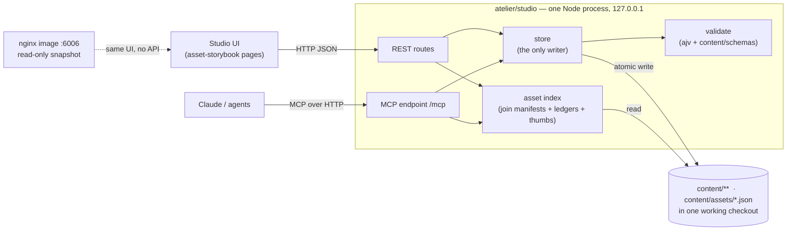

# Asset Studio: settings per domain and asset, explore, generate art, MCP CRUD

## Orientation

- **What this is.** The asset storybook (`atelier/asset-storybook/`) becomes the **Asset Studio**: one local tool where the owner (the art director) keeps the game's design settings, browses every asset, and later generates art from an asset. Agents do the same things through MCP tools.
- **Decision 1: settings stay as files in git.** Nothing moves into a database. The studio is an editing surface over the JSON/Markdown files that already live under `content/`, the pattern git-backed CMSs (Decap, TinaCMS), CastleDB, LDtk and Godot all use (research, §A).
- **Decision 2: one local studio service.** A Node service on the owner's Mac serves the UI, a JSON API, the MCP endpoint and (slice 2) the art job queue. It grows out of the F-052 map-builder server (`atelier/map-builder/server.mjs`), which becomes one module of it.
- **Decision 3: build in three slices.** Slice 1: explore + settings + MCP. Slice 2: generate art from an asset. Slice 3: import hand-made assets, fold the map builder in, give combat a settings home. **This spec designs slice 1 in full and slices 2 and 3 in outline only.**
- **What it replaces.** F-053 (storybook redesign) forbids a server and write endpoints (F-053 spec L16, L48, AC 25). This spec retires those three lines. F-053's information architecture (dashboard, `sections.json` registry, list view, detail view) stays and becomes the studio's UI plan.
- **Assumed without asking.** The studio never commits on its own and writes only into its own worktree. MCP cannot delete asset binaries in slice 1. Only files that a schema covers are editable. Generated-vs-hand-made is derived from data that already exists, with no manifest schema change. Details in §9.

## 1. Problem

- **Settings are scattered and only editable by hand.** Story lives in `content/story/` (13 files, 9 JSON + 4 MD), world in `content/world/` (452 JSON), plus `content/zones` (40), `content/dungeons` (63), `content/spine` (49). Combat has no settings home: its numbers are constants inside `scripts/gen_combat_model.mjs`. 27 JSON Schemas in `content/schemas/` validate them, but only at gate time (`scripts/check_content.mjs`), never while editing.
- **Assets are hard to find.** 634 catalog entries plus 19 runtime manifest entries, audio, music, 106 concept-art items and 44 env renders, spread over a sidebar of 26 look-alike buttons (F-053 §1 C1.1).
- **"Generated or hand-made?" has no answer on screen.** Manifest entries carry `source` (market 637, hand 6, authored 4, internal 2, URL 4), `license` and `tier`; AI renders carry seed/control/strength in art-forge run ledgers (`atelier/art-forge/runs/*.json`). Nothing joins them into one label.
- **There is no per-asset place for generation inputs.** Only the 4 env briefs in `atelier/art-forge/briefs/` exist. A character or weapon has nowhere to store "what it should look like" for a later render.
- **Agents cannot edit through a safe path.** No MCP server exists (`.mcp.json` lists only `graft`). Agents hand-edit JSON and learn about schema errors at gate time.

## 2. Goals and non-goals

**Goals (slice 1).**
1. Browse every asset in one list with search and filters, including an **origin** filter (generated, hand-made, marketplace, unknown).
2. View every **domain setting** (story, world, zones, dungeons, spine, combat) and edit the ones a schema covers, plus **asset settings**, with schema validation before anything is written (§5.1 lists what is editable).
3. Expose the same create/read/update/delete operations as **MCP tools**, going through the same code path as the UI.
4. Show pending file changes so the owner can review and commit them.

**Non-goals (slice 1).** Generating art (slice 2). Importing or deleting asset binaries (slice 3). Editing combat numbers (slice 3; shown read-only from `atelier/combat-lab/combat-model.json`). A database. Multi-user editing. Running inside k8s. Automatic commits.

## 3. Approaches considered

| | A. Grow the F-052 server into the studio **(chosen)** | B. Git-backed CMS (Decap/Tina) + separate MCP | C. New SvelteKit app |
|---|---|---|---|
| How | Zero-dependency `node:http` server already built (142-line `server.mjs`, job queue, SSE, static handler); add a store, API routes and an MCP endpoint | CMS config over `content/`; forms come free | API routes + MCP in a framework app |
| For | Reuses a working pattern the storybook already talks to; no build step; the job queue is exactly what slice 2 needs | Fastest settings forms | Best UI ergonomics |
| Against | Hand-built forms | A second UI with no asset browsing or generation; React stack; commits straight to git on save | Build step; rewrites the storybook; departs from every atelier tool |

**Why A:** the studio's hard parts are asset browsing and generation jobs, not forms. A solves those with code that already runs. B only solves forms, and C throws away the working storybook.

## 4. Architecture



**Units (each one job, testable alone):**

| Unit | File | Does | Depends on |
|---|---|---|---|
| server | `atelier/studio/server.mjs` | HTTP routing, static files, MCP mount, Host/Origin + token check (§7); skeleton adopted from F-052 | node:http |
| config | `atelier/studio/config.json` | port, allowed settings roots, excluded generator outputs | — |
| checkout guard | `lib/checkout.mjs` | the studio writes only into **its own worktree** `.claude/worktrees/studio` on branch `studio/edits` (created on first start). It refuses to start if that worktree is on `main` or a detached HEAD, or carries a `working-feature.json` claim marker | git CLI (argv only) |
| store | `lib/store.mjs` | list/get/create/update/delete a settings document; path allowlist; validate; atomic write (temp file + rename) | schema map, checkout |
| schema map | `lib/schema-map.mjs` **(new table)** | explicit list: path pattern → schema file. Built by reading each hardcoded check in `scripts/check_content.mjs` (e.g. `:856` character, `:1268` zone-content, `:2080-2085` world) and `scripts/lib/story.mjs:31`; runs ajv | `ajv` |
| asset index | `lib/asset-index.mjs` | builds the joined asset records (§5.2), in memory, rebuilt on file change | manifests, ledgers, `.thumbs/index.json` |
| changes | `lib/changes.mjs` | `git status --porcelain` + `git diff` for allowed roots; commit on explicit request | git CLI (argv only) |
| mcp | `lib/mcp.mjs` | registers the MCP tools (§6) on top of store + asset index | `@modelcontextprotocol/sdk` |
| UI | `atelier/asset-storybook/js/studio/*.mjs` | edit panel, changes panel, origin filter; hides edit controls when `/api/health` is unreachable | the API |

**Dependency rule.** The studio gets its own `atelier/studio/package.json` with two direct dependencies: `ajv` (already used by the content gate) and `@modelcontextprotocol/sdk` plus its required peer `zod`. Be clear about the cost: SDK 1.30.0 needs Node ≥18 (fits the `nodeMajor` 18 pin) and pulls in express, hono, jose and about 13 more transitive direct deps. That is accepted over hand-rolling the protocol. The dependency stays inside `atelier/studio/` and never enters the nginx image.

**F-052 prerequisite.** The map-builder server exists only on `feat/F-052` (1,570 lines with `lib/`), not on `release/1.10`. Slice 1 starts after F-052 merges into the release branch. If it has not merged when slice 1 is claimed, slice 1 copies only the 142-line `server.mjs` skeleton and the static handler, and slice 3 does the fold-in.

## 5. Data model

### 5.1 Settings documents

A **settings document** is one existing file under an allowed root, addressed by `domain` + `id` (the path relative to the domain root, without extension).

| Domain | Root | Format | Editable in slice 1 |
|---|---|---|---|
| `story` | `content/story/` | JSON + `canon.md`, `style.md`, `bible.md` | JSON with a mapped schema (map in `scripts/lib/story.mjs:31`); the Markdown files as whole-file text |
| `world` | `content/world/` | JSON | only files the schema map covers (`manifest.json`, `premises/`, …). **Never** `fabric/`, `handles/`, `resolved/`: `mapforge/promote-world.mjs` replaces those wholesale, so an edit would be wiped |
| `spine` | `content/spine/` | JSON | read-only (generator output, same reason) |
| `zones` | `content/zones/` | JSON | yes (`zone-content.schema.json`, `check_content.mjs:1268`) |
| `dungeons` | `content/dungeons/` | JSON | **read-only**: `dungeon.schema.json` and `dungeon-family.schema.json` exist but no code loads them |
| `assets` | `content/assets/` **(new)** | JSON, one file per asset key | yes (`asset-settings.schema.json`, new) |
| `combat` | `atelier/combat-lab/combat-model.json` | JSON | read-only (generated by `scripts/gen_combat_model.mjs`) |

**There is no reusable path-to-schema map today.** `check_content.mjs` hardcodes one schema per check. The studio therefore adds `lib/schema-map.mjs`, an explicit table. **Rule:** a document is editable only if the table maps it to a schema *and* it is not a generator output. Everything else is visible but read-only, with a reason badge ("no schema", "generated by promote-world"). The dashboard shows editable/total per domain. Expect roughly 400 of the 452 world files to be read-only (civil records, relations, names, lexicon, budgets have no loaded schema). **That is accepted for slice 1.** Wiring schemas for them is filed as follow-up work, not done here.

### 5.2 Asset record (read model, never stored)

```json
{
  "key": "mob:aggressive",
  "kind": "creature",
  "title": "…",
  "origin": "generated | handmade | marketplace | unknown",
  "originEvidence": "manifest.source=market",
  "license": "CC0",
  "tier": "bespoke",
  "files": [{ "path": "game-client/assets/…glb", "thumb": ".thumbs/…png" }],
  "settings": "content/assets/mob--aggressive.json | null",
  "renders": [{ "ledger": "atelier/art-forge/runs/A1-ART-02.json", "seed": 12345, "localFile": true }]
}
```

**Origin is derived per registry, first matching rule wins.** `originEvidence` names the rule that fired, so a wrong label is traceable. No manifest schema changes in slice 1.

| Registry | Rule → origin |
|---|---|
| `art/art-manifest.json` (106) | `gen.generated === true` → `generated`; `gen.generated === false` → `handmade`; no `gen` block → `unknown` |
| `env-index.json` (44 env renders) | always `generated`. Entries have no `briefId` field: the brief id is the prefix of the entry `id` (e.g. `A1-ART-02-none-seed12345`), matched against `forge-briefs-index.json` ids, and the ledger row is found by `briefHash` + `seed` in `atelier/art-forge/runs/<briefId>.json` (ledgers are keyed by brief, not asset key) |
| `catalog-manifest.json` + `manifest.json` | `source` equals `hand`, `authored` or `internal` → `handmade`; `source` equals `market`, or contains `http`, `OpenGameArt` or `Kenney` → `marketplace` |
| `audio-manifest.json`, `music-manifest.json` | same text rules on `source` |
| anything else | `unknown` |

**Measured before implementation, not guessed.** Slice 1's first task is a script that applies these rules and prints counts per registry and origin. Those counts go into the plan and become test fixtures. At spec time only 23 of 106 concept-art entries carry a `gen` block (17 `generated:false`), so about 83 concept-art items will read `unknown`. That is a data gap the studio will show, not hide.

### 5.3 Asset settings file (new, stored)

`content/assets/<key-with-colons-as-double-dash>.json`, validated by `content/schemas/asset-settings.schema.json`:

```json
{
  "key": "mob:aggressive",
  "description": "what it is, in world terms",
  "look": { "subject": "…", "palette": ["ash-grey"], "mustShow": ["…"], "mustNotShow": ["…"] },
  "references": ["content/story/canon.md#…", "art/…png"],
  "generation": { "briefId": "A1-ART-02" }
}
```

`generation.briefId` links to an existing art-forge brief. Slice 2 decides whether briefs are generated from asset settings or stay separate. Slice 1 does not merge them.

## 6. Interfaces

### 6.1 REST (all JSON, 127.0.0.1 only)

| Method + path | Does |
|---|---|
| `GET /api/health` | `{ ok, checkout, branch }` |
| `GET /api/settings?domain=` | list documents |
| `GET /api/settings/:domain/:id` | `{ content, schema, readOnly, etag }` |
| `PUT /api/settings/:domain/:id` | replace; body `{ content, etag }`; 409 on stale etag, 422 with ajv errors on invalid |
| `POST /api/settings/:domain` | create; 409 if it exists |
| `DELETE /api/settings/:domain/:id` | delete; `assets` domain only in slice 1 |
| `GET /api/assets?q=&kind=&origin=` | asset records (§5.2) |
| `GET /api/assets/:key` | one record |
| `GET /api/changes` | changed files under allowed roots + diffs |
| `POST /api/changes/commit` | body `{ message, paths[] }`; commits only those paths |

`etag` is the sha-256 of the file content read. It stops the UI and an agent from overwriting each other's edits silently.

### 6.2 MCP tools (Streamable HTTP at `/mcp`, registered in the repo `.mcp.json`)

`studio_list_settings`, `studio_get_setting`, `studio_create_setting`, `studio_update_setting`, `studio_delete_setting`, `studio_list_assets`, `studio_get_asset`, `studio_list_changes`. Each tool calls the same store and index functions as the REST route. **No commit tool:** agents already commit with git, and the owner commits from the UI.

## 7. Error handling and safety

- **Bind 127.0.0.1, and do not trust that alone.** A web page in the owner's browser can still send requests to localhost (cross-site requests, DNS rebinding), and the MCP spec requires Origin checks for Streamable HTTP. So every request must carry `Host` 127.0.0.1/localhost with the configured port, or it gets 403. Write routes and `/mcp` also require an `Origin` that is absent or equal to the studio's own, **and** a bearer token generated at start. The token is written to `atelier/studio/.token` (gitignored, mode 0600) for `.mcp.json`, and embedded in the same-origin HTML the studio serves.
- **Does not stomp claimed work.** The ps-release-workflow guard only watches Claude's Edit/Write tools, not a Node process, so the studio enforces ownership itself. It writes only in its own `studio/edits` worktree and refuses any worktree with a `working-feature.json` marker (§4 checkout guard).
- **Path allowlist.** `id` is resolved against the domain root. Anything that normalises outside it (`..`, absolute paths, symlinks out) is rejected with 400.
- **Validate before write.** An invalid document never touches disk. The 422 response returns ajv errors with JSON pointers, which the UI shows beside the field.
- **Atomic writes.** Temp file in the same directory, then rename. A crash never leaves a half-written file.
- **No shell interpolation.** Every git call is `execFile` with an argv array.
- **Two writers on one file.** The etag stops the UI and an agent from overwriting each other's edits in the studio. A later F-052 publish into `content/world` is not an overlapping writer, because the studio never writes the families publish replaces.
- **Read-only fallback.** The nginx image at :6006 has no API. The UI detects that and shows view-only mode (the F-052 map-builder tab does the same, `js/map-builder.mjs:140` on `feat/F-052`). `Dockerfile.dockerignore` currently allowlists nothing under `content/zones`, `content/dungeons` or `content/assets`, so slice 1 adds those lines and extends `dockerfile-forge.test.mjs` to check them; otherwise the image silently shows no settings.

## 8. Testing

- **Unit (`node --test atelier/studio/tests/*.test.mjs`):** path allowlist (traversal refused), generator-output roots refused, validation rejects and does not write, atomic write, etag conflict, origin derivation (one test per registry rule plus `unknown`, pinned to the measured counts), checkout guard refuses `main`, detached HEAD and a claimed worktree, requests with a foreign `Host`/`Origin` or no token get 403.
- **Schema map is honest:** every committed file the map marks editable passes its schema today, and the map's schema for `zones` and `world/manifest.json` is the same file `check_content.mjs` loads at `:1268` and `:2080`. A mapped file that fails means the map is wrong.
- **MCP contract:** an in-process SDK client lists the tools, runs create, update, get and delete on a temp checkout, and gets the same result as the REST route.
- **Mutation proof:** delete the allowlist check and the validate call in turn; the matching tests must go red.
- **Smoke:** extend the F-053 headless Chrome harness (`atelier/asset-storybook/tests/smoke/`) with one scenario: open an asset, edit its settings, see the change listed in the changes panel.
- **Gate 1:** add the studio unit tests to `scripts/precheck.sh`.

## 9. Decisions (batch-grill, 2026-09-17)

- Settings storage → **files in git** — the dominant pattern for small teams (research §A); keeps the 27 schemas and the gates.
- Shape → **one local studio service** (owner) — map builder becomes a module; storybook no-server rule retired.
- Images → **one shared local folder + commit accepted** (owner) — used from slice 2.
- First slice → **explore + settings + MCP** (owner).
- Auto-commit → **never** (default, not asked) — git history stays deliberate; the changes panel makes committing one click.
- MCP deleting binaries → **not in slice 1** (default) — the one hard-to-undo operation waits for slice 3's import design.
- Origin label → **derived per registry, no schema change** (default) — about 83 concept-art items stay `unknown` until their `gen` blocks are filled; `originEvidence` makes each label traceable.
- Editable scope → **only schema-mapped, non-generated files** (default) — most world files and all dungeons are read-only in slice 1.
- Where the studio writes → **its own `studio/edits` worktree** (default) — never main, never a claimed feature worktree.
- Combat → **read-only in slice 1** (default) — its numbers live in script constants; moving them to `content/combat/` is its own change.
- Dependencies → **ajv + MCP SDK only** (default).

## 10. Later slices (outline, designed in their own specs)

- **Slice 2: generate art from an asset.** A "Generate" action on an asset with settings: builds or reuses an art-forge brief, queues a job that runs the existing CLI (`node atelier/art-forge/generate/env.mjs --brief … --seed …`) through the F-052 job queue, streams progress over SSE, writes drafts to one shared folder outside the worktrees (path in config), and "Accept" runs the existing intake (`intake-art.mjs`) so the accepted image is committed. Needs: a ComfyUI tunnel health check (127.0.0.1:8188; never 8189), and a decision on briefs vs asset settings.
- **Slice 3: import + fold-in.** Import hand-made files (license required, via `scripts/lib/license-policy.mjs`), soft-delete assets, mount the map builder routes (after F-052 merges), and extract combat numbers into `content/combat/` with a schema.

## 11. Changes to other specs

- **F-053 spec:** L16 and L48 ("no server, no write endpoint") and AC 25 (the read-only grep gate) are superseded when this idea is refined. The gate's exemption widens from `map-builder*.mjs` to `js/studio/**`. The rest of F-053 (registry, dashboard, list and detail views) is unchanged and is the studio's UI.
- **F-052 spec:** unchanged for now. Slice 3 moves its server into `atelier/studio/`.

## Appendix A. Research: how other tools store settings (2026-09-17)

| Tool | Storage | In git |
|---|---|---|
| Godot | `.tres` text resources | yes |
| Unity | YAML `.asset` + `.meta` | yes (text mode) |
| Unreal | binary `.uasset`; DataTables import CSV/JSON | no |
| CastleDB | one JSON file, one row per line, local web editor | yes, by design |
| LDtk / Tiled | JSON (or XML) project files | yes |
| Ink / Yarn Spinner | plain text scripts | yes |
| articy:draft | proprietary project; JSON export; server for multi-user | no |
| Decap CMS / TinaCMS | Markdown/JSON in your repo; web UI commits on save | yes, by design |
| Strapi / Directus / Contentful | database or hosted (not doc-checked) | no |
| Scenario.gg / Leonardo | cloud-hosted models and asset library | no |
| ComfyUI | workflow JSON embedded in the PNG | in the image file |

**Takeaway:** small teams converge on text files in git (diffable, no server). A database wins only with concurrent multi-user editing, heavy cross-record queries, or opaque binary data. None of these apply here. No surveyed tool combines settings, browsing, generation and MCP; ComfyUI's embedded workflow and C2PA are the nearest provenance precedents.

## Appendix B. Audit trail

- 2026-09-17 self-grill-audit: verdict safe-with-fixes. Corrected: (C) no reusable schema map exists, so added `lib/schema-map.mjs` + editable-only-if-mapped rule and marked dungeons/most world read-only; (C) origin rule rewritten per registry (ledgers are keyed by briefId; concept art uses `gen.generated`; source text contains "OpenGameArt"/"Kenney", not bare URLs), counts to be measured first; (H) checkout guard was misattributed to F-052 (which checks branch name, only on publish), so the studio now writes only into its own worktree; (H) the psrw guard does not see Node writes, so the studio refuses claimed worktrees; (H) localhost is not a security boundary, so added Host/Origin checks + bearer token; (H) excluded `promote-world` outputs (`world/fabric|handles|resolved`, `spine`) from writable roots; (M) F-052 exists only on its feature branch, so it is now a stated prerequisite; (M) MCP SDK transitive deps stated; (M) dockerignore allowlist gap added. Verified on disk before editing: ledger header line, art-manifest gen counts (23 of 106), hardcoded schema loads, `REPLACED_FAMILIES`, F-052 `world.mjs:43-44`. Open: none needing the owner.
