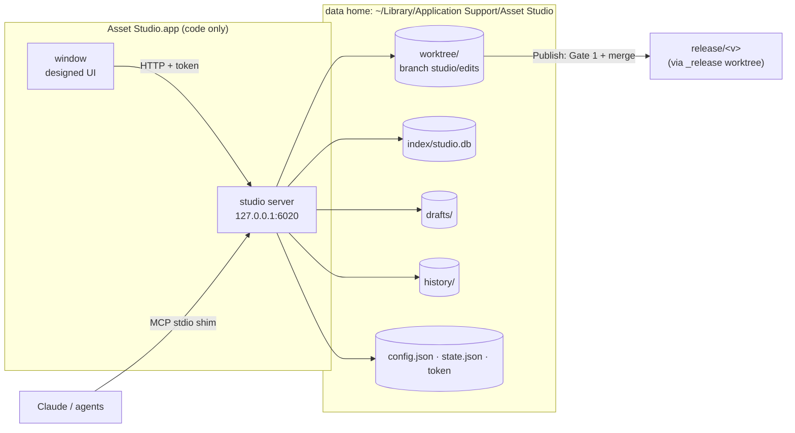
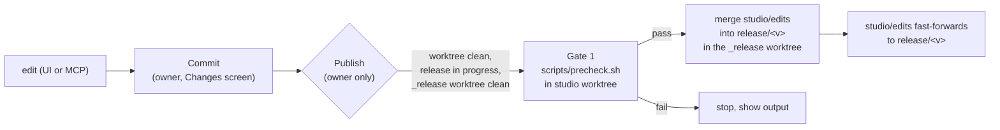

# Asset Studio: settings per domain and asset, explore, generate art, MCP CRUD

## Orientation

- **What this is.** The asset storybook (`atelier/asset-storybook/`) becomes **Asset Studio**, a Mac app. The owner (the art director) double-clicks it to keep the game's design settings, browse every asset, and later generate art from an asset. Agents do the same through MCP tools.
- **Decision 1: files in git are the record.** Settings stay as JSON/Markdown under `content/`, the pattern Godot, LDtk, CastleDB and git-backed CMSs use (Appendix A).
- **Decision 2: SQLite is only an index.** Built-in `node:sqlite` with FTS5 gives fast search and filters. It is rebuilt from files, so deleting it loses nothing.
- **Decision 3: one local studio service.** A Node server provides the API, MCP and (slice 2) the art job queue. It grows out of the F-052 map-builder server.
- **Decision 4: a Mac app that rebuilds without losing data.** An Electron app holds only code. All studio data lives in **one data home**, `~/Library/Application Support/Asset Studio/`, outside the app bundle and outside every folder the release workflow creates or deletes. The app is rebuilt and installed automatically each time a feature ships (§12).
- **Decision 5: edits reach a release through one named step.** The studio edits in its own worktree inside the data home, on branch `studio/edits`, which is based on the in-progress `release/<v>`. **Publish** runs Gate 1 (the pre-ship build/test check) and merges into the release, the same way `ship` does (§5).
- **Decision 6: screens are designed in Claude Design first.** The UI is built only from approved screens.
- **Order:** design (D) runs alongside slice 1 (a headless server: API, MCP, index, publish, tests; no UI). Slice 1b is the Mac app with the designed screens. **Slices 1 and 1b ship in the same release**, so nothing ships without a place to see it. Slice 2: generate art, following the existing art pipeline. Slice 3: import, fold in the map builder, give combat a settings home.
- **What it replaces.** The storybook redesign (F-053) shipped only its Forge-tab phase. Its remaining phases (registry, dashboard, list and detail views) are **absorbed into this idea's slice 1b**. Its "no server, no writes, no new dependency, no search index, no browser-triggered generation" rules are retired (§14).

## 1. Problem

- **Settings are scattered and only editable by hand.** Story lives in `content/story/` (13 files: 9 JSON + 4 MD), world in `content/world/` (452 JSON), plus `content/zones` (40), `content/dungeons` (63) and `content/spine` (49). Combat has no settings home: its numbers are constants inside `scripts/gen_combat_model.mjs`. 27 JSON Schemas in `content/schemas/` validate them, but only at gate time (`scripts/check_content.mjs`), never while editing.
- **Assets are hard to find.** There are 634 catalog entries plus 19 runtime manifest entries, audio, music, 106 concept-art items and 44 env renders, behind 26 look-alike sidebar buttons.
- **"Generated or hand-made?" has no answer on screen.** Manifest entries carry `source`, `license` and `tier`. Concept art sometimes has a `gen` block. AI renders carry their parameters in art-forge run ledgers. Nothing joins these into one label.
- **No per-asset place for generation inputs.** Only 4 env briefs exist, in `atelier/art-forge/briefs/`.
- **Agents cannot edit through a safe path.** No MCP server exists (`.mcp.json` lists only `graft`).
- **Local work is fragile across releases.** Renders live in gitignored `out/` folders inside worktrees, and release cleanup deletes worktrees. Today that is why most Forge cards say "png missing".

## 2. Goals and non-goals

**Goals.**
1. **(1b)** Browse every asset in one list, with search, **section** filter (the taxonomy's classes) and **origin** filter (generated, hand-made, marketplace, unknown).
2. **(1, 1b)** View every domain setting and edit the ones a schema covers, plus per-asset settings, with schema validation before any write.
3. **(1)** The same create/read/update/delete operations over MCP and REST, through one code path (the parity table is in §7.3).
4. **(1, 1b)** See pending changes, commit them, and **Publish** them into the in-progress release.
5. **(1b)** Double-click to start or continue, with all data surviving an app rebuild, an app update and a release turnover.

**Non-goals (slices 1 and 1b).**
- Generating art (slice 2).
- Importing assets or retiring them (slice 3).
- Editing combat numbers (slice 3).
- A database as the record.
- Multi-user editing.
- Automatic commits.
- Code signing and notarisation.
- A cloud build of the app.

## 3. Approaches considered

| | A. Grow the F-052 server into the studio **(chosen)** | B. Git-backed CMS (Decap/Tina) + separate MCP | C. New SvelteKit app |
|---|---|---|---|
| How | `node:http` server skeleton from F-052 (job queue, SSE, static handler) + store, index, MCP; Electron wraps it | CMS config over `content/`; forms come free | API routes + MCP in a framework app |
| For | Reuses a working pattern; the job queue is what slice 2 needs; server and UI need no build step | Fastest settings forms | Best UI ergonomics |
| Against | Hand-built forms; three direct dependencies (§4); the Mac app adds one packaging step | A second UI with no asset browsing or generation; React stack | Build step for everything; rewrites the storybook |

**Why A:** the hard parts are asset browsing, data safety and generation jobs, not forms. A solves them with code that already runs.

## 4. Architecture



**Units (each one job, testable alone):**

| Unit | File | Does | Depends on |
|---|---|---|---|
| server | `atelier/studio/server.mjs` | HTTP routing, MCP mount, Host/Origin/token check (§8); skeleton adopted from F-052 | node:http |
| data home | `lib/home.mjs` | resolves the data home (`ATLAS_STUDIO_HOME` overrides it for tests), creates its layout, versions it | fs |
| checkout | `lib/checkout.mjs` | creates or repairs `worktree/` as a linked worktree of the chosen repo on `studio/edits`; installs the deps Gate 1 needs; refuses `main`, detached HEAD and folders with a `working-feature.json` marker | git CLI (argv only) |
| schema map | `lib/schema-map.mjs` | explicit table, path pattern → schema, built from the hardcoded checks in `scripts/check_content.mjs` (e.g. `:856`, `:1268`, `:2080-2085`) and `scripts/lib/story.mjs:31` | `ajv` |
| store | `lib/store.mjs` | the only writer: allowlist, validate, atomic write, copy to `history/`, update index | schema map, index |
| index | `lib/index-db.mjs` | SQLite index (§6.4) | `node:sqlite` |
| changes | `lib/changes.mjs` | list and diff changes, commit chosen paths | git CLI |
| publish | `lib/publish.mjs` | the release step (§5.2) | git CLI, `scripts/precheck.sh` |
| mcp | `lib/mcp.mjs` + `mcp-stdio.mjs` | MCP tools (§7.2); the stdio shim that `.mcp.json` runs | `@modelcontextprotocol/sdk`, `zod` |
| UI (1b) | `atelier/studio/ui/` | designed screens (§11); read-only mode without the API | the API |
| app (1b) | `atelier/studio/app/` | Electron shell (§12) | electron (dev) |

**Dependencies.** The server has three direct dependencies: `ajv` (already used by the content gate), `@modelcontextprotocol/sdk` and its peer `zod`. SDK 1.30.0 needs Node ≥18 and pulls in about 16 packages, including express, hono and jose. The app adds `electron`, `electron-builder` and `playwright` as dev dependencies. SQLite adds nothing, because it is built in.

**Node versions.**
- **Headless studio:** Node ≥22.5, recorded as `studioNodeMajor: 22` in `.release.json` and joined to its consumer in `scripts/tests/node-pin.test.mjs`.
- **App:** runs on Electron's Node. Verified 2026-09-17: Electron 44.4.1 ships Node 24.21.0, and `node:sqlite` with an FTS5 table works there.
- **Map tooling:** the `nodeMajor: 18` determinism pin is unchanged.

**F-052 prerequisite.** The map-builder server exists only on `feat/F-052`. If it has not merged when slice 1 is claimed, slice 1 copies only the 142-line `server.mjs` skeleton and its static handler, and slice 3 does the fold-in.

## 5. The data home and the release path

### 5.1 One data home, and what survives what

`~/Library/Application Support/Asset Studio/` holds everything the studio owns that is not already in git history. **Nothing else stores studio state.** Headless runs use the same path; tests set `ATLAS_STUDIO_HOME` to a temp folder.

| Item | Where | Is it the record? | App rebuild or update | Release turnover (promote + cleanup) | Lost if deleted? |
|---|---|---|---|---|---|
| Settings, asset settings (committed) | `worktree/` + git history | **yes** | kept | kept; merged into the release by Publish | no, it's in git |
| Uncommitted edits | `worktree/` + `history/` copy | yes, until committed | kept | kept: the worktree is outside `.claude/worktrees/` | no, `history/` has a copy |
| Drafts (slice 2) | `drafts/` | yes for unadopted drafts | kept | kept | their parameters stay in the committed run ledger |
| Run ledgers, adopted art (slice 2) | `worktree/` → git | **yes** | kept | merged by Publish | no |
| SQLite index | `index/studio.db` | no, cache | kept | rebuilt on start | no, rebuilt |
| Window state, last screen, filters | `state.json` | no, convenience | kept | kept | only convenience |
| Repo path, port, drafts path | `config.json` (never in the repo) | no | kept | kept | re-asked on first run |
| MCP/API token | `token` (0600, created once) | no | kept | kept | regenerated; agents reconnect |

**Rules that make the table true:**
- The app bundle contains code only. Rebuilding or replacing it touches nothing in the data home.
- `config.json` stores the **main repo folder** (the one whose `.git` is a directory). The studio refuses any worktree path as the repo, so it can never point at `_release` or a feature worktree that promote deletes.
- `worktree/` lives inside the data home, **not** under the repo's `.claude/worktrees/`. Promote cleanup only removes `<F-NNN>-*` worktrees and `_release` (`promote_release.py:440-442,464-467`), so it never touches this one.
- **Cleanup-legacy hazard, handled twice.** `cleanup-legacy` lists every marker-less worktree and runs `git worktree remove --force` when the owner answers yes (`cleanup_legacy_worktrees.py:22-45,85`). Two defences:
  1. The worktree carries a `.studio-worktree` marker file.
  2. Every store write also copies the file to `history/<timestamp>/<path>`, keeping the last 200 writes, so even a forced removal loses no edit.
  A follow-up for the release workflow is filed: skip worktrees with `.studio-worktree`.
- **Art-forge drafts have one home.** In the studio worktree, `atelier/art-forge/out` is a symlink to `drafts/`, so existing `env-index.json` paths (`atelier/art-forge/out/env/*.png`) resolve with no path migration. Other checkouts may point their `out/` at the same folder.
- **Data home layout changes** carry a `version` in `config.json`. The app migrates forward and refuses to open a newer layout with an older app. It never deletes.

### 5.2 How edits reach a release



- **Base.** `studio/edits` starts from the in-progress `release/<v>` (read from `.release.json`). With no release in progress, Publish is disabled with "start a release first (`psrw new-release`)". The studio never starts or promotes releases.
- **Publish is the owner's action.** It exists in REST and the UI, not in MCP. It is R1: it merges into a shared branch, undone by reverting the merge commit.
- **Mechanics match `ship`:** Gate 1 in the source worktree, then a `--no-ff` merge in the `_release` worktree, with the commit subject `studio: publish <n> commits`. No catalog entry, because the catalog tracks features and studio edits are content. A follow-up for the release workflow is filed: name a "studio" lane in the release report.
- **After a turnover.** On start, if `studio/edits`'s base release no longer exists, the studio moves it onto the new in-progress release, or onto `main` if none is in progress:
  - no unpublished commits → reset onto the new base;
  - unpublished commits → rebase onto the new base;
  - a conflict → stop, show the files, keep everything. Nothing is ever discarded automatically.
- **Promote gate.** The release report should show unpublished studio commits so the release manager can Publish before promoting. Until the follow-up lands, the studio's Home shows "N commits not yet in release/<v>".

## 6. Data model

### 6.1 Settings documents

A **settings document** is one file under an allowed root, addressed by `domain` + `id` (path relative to the domain root, without extension).

| Domain | Root | Editable in slice 1 |
|---|---|---|
| `story` | `content/story/` | JSON with a mapped schema; `canon.md`, `style.md`, `bible.md` as whole-file text |
| `world` | `content/world/` | only files the schema map covers. **Never** `fabric/`, `handles/`, `resolved/`: `mapforge/promote-world.mjs` replaces them wholesale |
| `spine` | `content/spine/` | read-only (generator output) |
| `zones` | `content/zones/` | yes (`zone-content.schema.json`, `check_content.mjs:1268`) |
| `dungeons` | `content/dungeons/` | read-only: their schemas exist, but no code loads them |
| `assets` | `content/assets/` **(new)** | yes (`asset-settings.schema.json`, new) |
| `combat` | `atelier/combat-lab/combat-model.json` | read-only (generated by `scripts/gen_combat_model.mjs`) |

**Rule:** a document is editable only if the schema map covers it **and** it is not a generator output. Everything else shows a read-only reason badge. About 400 of the 452 world files are read-only in slice 1. Wiring their schemas is filed as follow-up work.

### 6.2 Asset record (read model, never stored)

```json
{
  "key": "mob:aggressive",
  "section": "character",
  "kind": "character",
  "title": "…",
  "origin": "generated | handmade | marketplace | unknown",
  "originEvidence": "catalog source=market",
  "license": "CC0",
  "tier": "seed",
  "files": [{ "path": "game-client/assets/characters/orc_brute.glb", "thumb": ".thumbs/…png" }],
  "settings": "content/assets/mob--aggressive.json | null",
  "renders": []
}
```

**Classes.** The class filter is **`section`**, taken from the 8 sections in `content/asset-taxonomy.json` (character, creature, vfx, weapon, loot, dungeon, environment, prop). Records outside those sections get a fixed section: concept art → `concept-art` (subgrouped by `group`), audio → `sfx`, music → `music`, env renders → `environment-render`, map sheets → `map`. `kind` is shown only where the registry has one; it is never a filter.

**Origin is derived per registry; the first matching rule wins.** No manifest schema change.

| Registry | Rule → origin |
|---|---|
| `art/art-manifest.json` (106) | `gen.generated === true` → generated; `=== false` → handmade; no `gen` → unknown |
| `env-index.json` (44) | always generated. The brief id is the prefix of the entry `id`, matched against `forge-briefs-index.json`. The ledger row is found by `briefHash` + `seed` in `atelier/art-forge/runs/<briefId>.json` |
| catalog + runtime manifests | `source` is `hand`, `authored` or `internal` → handmade; `source` is `market`, or contains `http`, `OpenGameArt` or `Kenney` → marketplace |
| audio, music manifests | same text rules |
| anything else | unknown |

Slice 1's first task is a script that applies these rules and prints counts per registry and origin. The counts become test fixtures. At spec time, only 23 of 106 concept-art entries have a `gen` block, so about 83 will read `unknown`, and the studio shows that gap.

### 6.3 Asset settings file (new, stored)

`content/assets/<key with ":" as "--">.json`, validated by `content/schemas/asset-settings.schema.json`:

```json
{
  "key": "mob:aggressive",
  "description": "what it is, in world terms",
  "look": { "subject": "…", "palette": ["ash-grey"], "mustShow": ["…"], "mustNotShow": ["…"] },
  "references": ["content/story/canon.md#…"],
  "generation": { "briefId": "A1-ART-02" },
  "retired": false
}
```

`generation.briefId` links to an existing art-forge brief. `retired` is the soft-delete flag slice 3 uses. Slice 1 ships the field in the schema and does not act on it.

### 6.4 The SQLite index

- **File:** `<data home>/index/studio.db`.
- **Tables:** `assets`, `files`, `settings_docs` (domain, id, path, schema, editable, reason, etag), `renders` (slice 2), and `search` (FTS5 over title, key, description, look and settings text).
- **Truth rule:** every row derives from files in the studio worktree, run ledgers or `drafts/`. A write goes: validate → atomic file write → history copy → index update. If the index update fails, the next start rebuilds it.
- **Rebuild:** full on start (about 1,500 records), then per file on change. A `schemaVersion` row forces a full rebuild when the layout changes.

## 7. Interfaces

### 7.1 REST (127.0.0.1:6020, JSON)

| Method + path | Does |
|---|---|
| `GET /api/health` | `{ ok, repo, worktree, branch, release, unpublished }` |
| `GET /api/settings?domain=` · `GET /api/settings/:domain/:id` | list · one `{ content, schema, readOnly, reason, etag }` |
| `POST /api/settings/:domain` · `PUT …/:id` · `DELETE …/:id` | create (409 if exists) · replace with `etag` (409 stale, 422 invalid) · delete |
| `GET /api/assets?q=&section=&origin=` · `GET /api/assets/:key` | list · one record |
| `GET /api/changes` | changed files + diffs |
| `POST /api/changes/commit` | `{ message, paths[] }` (owner) |
| `POST /api/publish` | §5.2 (owner) |

### 7.2 MCP

- **Transport:** `.mcp.json` registers a stdio shim, `node atelier/studio/mcp-stdio.mjs`. The shim reads the port and `token` from the data home and forwards to `http://127.0.0.1:6020/mcp`. **No secret goes in the committed `.mcp.json`.**
- **If the studio is not running,** the shim returns "Asset Studio is not running. Open the app, or run `node atelier/studio/server.mjs`."
- **Tools:** `studio_list_settings`, `studio_get_setting`, `studio_create_setting`, `studio_update_setting`, `studio_delete_setting`, `studio_list_assets`, `studio_get_asset`, `studio_list_changes`, `studio_health`.

### 7.3 CRUD by resource and slice

**One delete rule:**
- Text documents are really deleted, and git plus `history/` undo it.
- Assets and committed art are only ever retired (soft).
- Drafts are hard-deleted; their parameters stay in the committed ledger.

| Resource | Slice 1 (REST = MCP) | Slice 2 | Slice 3 |
|---|---|---|---|
| Domain settings | C R U D (editable docs only) | — | combat gets C R U |
| Asset settings | C R U D | — | — |
| Assets | R | — | C (import, license-checked), U (manifest metadata), D = retire |
| Art: renders, drafts | R (existing renders + ledgers) | C = generate, U = review verdict, **Adopt**, D = discard draft | — |
| Changes | R | — | — |

**REST-only on purpose:** commit and publish (owner actions, R1). **MCP-only:** none.

## 8. Error handling and safety

- **Localhost is not a boundary by itself.**
  - Requests whose `Host` isn't `127.0.0.1:6020` or `localhost:6020` get 403.
  - Write routes and `/mcp` also need an `Origin` that is absent or equal to the studio's own, **and** the bearer token from `<data home>/token`.
  - The app injects the token into its own window through the preload script.
- **Port:** fixed at 6020 by default, changeable in `config.json`. 6006, 6007 and 6016 are already used locally.
- **Doesn't stomp claimed work.** The release-workflow guard only watches Claude's edit tools, not a Node process. The studio writes only in its own worktree, and the checkout rules in §4 refuse claimed folders.
- **Path allowlist.** Any `id` that resolves outside its domain root (`..`, absolute paths, symlinks out) gets 400.
- **Validate before write.** An invalid document never touches disk. The 422 response returns ajv errors with JSON pointers.
- **Writes and git.** Writes are atomic: temp file, then rename. Git always runs through `execFile` with an argv array.
- **Conflicts.** The `etag` stops the UI and an agent from overwriting each other's edits. The studio never writes the folders F-052's publish replaces.
- **Read-only fallback.** The nginx storybook image (:6006) has no API, and the UI shows view-only mode there. `Dockerfile.dockerignore` gains `content/zones`, `content/dungeons`, `content/spine` and `content/assets`, and `dockerfile-forge.test.mjs` checks them.

## 9. Testing

- **Unit** (`node --test atelier/studio/tests/*.test.mjs`, data home in a temp dir):
  - allowlist and generator-output refusal
  - validation rejects without writing; atomic write; history copy; etag conflict
  - origin rules pinned to the measured counts; section assignment for every registry
  - checkout refuses `main`, detached HEAD, claimed folders, and worktree paths as the repo
  - foreign `Host`/`Origin` or a missing token gets 403
- **Schema map is honest:** every file the map marks editable passes its schema today, and the zones/world-manifest schemas match `check_content.mjs:1268` and `:2080`.
- **Index is rebuildable:** build, delete `studio.db`, rebuild, and compare row for row. Mutation proof: a write that skips the file must turn this test red.
- **MCP contract:** an in-process SDK client runs create, update, get and delete through the shim, with the same results as REST.
- **Release path** (in a temp repo with a fake `release/<v>` and `_release` worktree):
  - Publish fails on a red precheck and merges on a green one
  - after deleting the release branch, restart moves `studio/edits` to the new base with and without unpublished commits
  - a rebase conflict stops and keeps the files
- **Survives cleanup:** run the real `cleanup_legacy_worktrees.py` removal on the studio worktree, then restart. Every edit is recovered from `history/`.
- **Mutation proof:** remove the allowlist check, the validate call and the history copy in turn. The matching test must go red.
- **Gate 1 and CI:** `scripts/precheck.sh` runs the studio tests when Node ≥22.5 and prints a skip line otherwise. `.github/workflows/ci.yml` gets a `studio` job on Node 22, and the Node 18 jobs are untouched.

## 10. Decisions (batch-grill and owner, 2026-09-17)

- Storage → **files in git** (owner asked for market practice; research Appendix A).
- Database → **SQLite, index only** (owner).
- Shape → **one local studio service** (owner).
- Images → **one shared drafts folder, adopted art committed** (owner). The folder is `<data home>/drafts/`, reached through the `out/` symlink.
- First slice → **explore + settings + MCP** (owner). Slice 1 is headless, and the UI arrives in 1b in the same release.
- Mac app → **Electron, right after slice 1** (owner).
- Design → **Claude Design first** (owner).
- Data persistence → **one data home outside the app and outside workflow folders; auto-built app** (owner).
- Auto-commit → **never**. Commit and Publish are owner actions (default).
- Release path → **Publish = Gate 1 + merge into release/<v>, like `ship`** (default; audit C1).
- Studio worktree → **inside the data home, with a marker and write history** (default; audit C2).
- MCP auth → **stdio shim reads the token from the data home** (default; audit H4).
- App build → **local, from the ship/promote deploy hook** (default; audit H5). No cloud build: the repo is public, and CI would publish the app.
- F-053 remaining phases → **absorbed into slice 1b** (default; audit H6).
- Class filter → **taxonomy `section`** (default; audit M15).
- Delete → **one rule, §7.3** (default; audit M16).
- "Accept" vocabulary → **"verdict"** is the review mark (accept/reject/rebuild, F-053 §6.5); **"Adopt"** brings a draft into the repo (default; audit M17).
- Port → **6020** (default).
- Editable scope → **schema-mapped, non-generated files only** (default).
- Origin → **derived per registry** (default).
- Combat → **read-only until slice 3** (default).

## 11. Design phase D: screens in Claude Design

- **Where:** claude.ai/design, project "Atlas Asset Storybook". It already has tokens from the storybook CSS and 11 component previews. The in-repo mockup canvas from I-122 is reference only.
- **Brief:** a calm, clean tool for one art director. Every screen answers "what am I looking at, and what can I do next". Pipeline jargon (seeds, hashes, strengths) sits behind a "details" disclosure.
- **Screens:**
  1. **Home**: uncommitted and unpublished edits, assets missing settings, what changed since last time.
  2. **Assets**: list and grid with search, section and origin filters, and empty states.
  3. **Asset detail**: preview, origin with its evidence, files, and the settings form with inline schema errors.
  4. **Settings**: browse by domain, with read-only reason badges.
  5. **Changes**: diff, commit box, and Publish, with Gate 1 progress and results.
  6. **App states**: first run (choose the repo folder), server problem, read-only mode, "moved to new release" notice, rebase conflict.
  7. **Generate** (slice 2 sketch): brief check, up to 5 renders, reviewer verdict, owner verdict, Adopt.
- **Structure:** start from the F-053 information architecture (registry-driven sidebar, list, detail), but it doesn't constrain the visuals.
- **Done when:** the owner approves the screens. Slice 1b builds only from them, and a reviewer compares a screenshot of each built screen to its design.
- **Timing:** D runs alongside slice 1, which has no UI, so neither blocks the other.

## 12. Slice 1b: the Mac app

- **Runtime:** Electron 44 (Node 24.21, `node:sqlite` + FTS5 verified). The server from slice 1 runs inside the app unchanged.
- **Double-click to start or continue:**
  - First run asks for the main repo folder once and writes `config.json`.
  - Every run: single-instance lock; create or repair `worktree/`; rebase onto the current release if needed (§5.2); rebuild the index; restore the last screen, filters and asset; show uncommitted and unpublished counts on Home.
  - Quitting with uncommitted edits warns but discards nothing.
- **Headless still works:** `node atelier/studio/server.mjs` uses the same data home, for agents without the app. Only one server runs at a time, enforced by a lock file in the data home.
- **Electron safety:** `contextIsolation: true`, `nodeIntegration: false`, `sandbox: true`. The window loads only `http://127.0.0.1:6020`, and other origins open in the default browser.
- **Auto-build on every ship and promote:**
  - `scripts/deploy-local.sh` (the `deploy_local` hook that `ship` and `promote --deploy` already run, per the release lifecycle doc) gains a macOS-only step.
  - That step runs `atelier/studio/app/build-and-install.sh` from the `_release` worktree after the merge.
  - It builds with `electron-builder --dir`, quits the running app, and replaces `/Applications/Asset Studio.app`.
  - Build output goes to a temp folder, never into a worktree. On non-macOS or a build failure it prints a skip or error line and the deploy continues. The app is a convenience, not a release gate.
- **Unsigned:** the first launch needs right-click, then Open, once.
- **Tests:**
  - A Playwright-for-Electron smoke run: first run, open an asset, edit, see it in Changes, quit, relaunch, land on the same asset.
  - **Rebuild persistence:** install build A, create a committed edit, an uncommitted edit and a draft file, then install build B over it. All three are present, and the index rebuilds.

## 13. Later slices (outline; each gets its own spec)

- **Slice 2: generate art from an asset.** It **follows the existing art pipeline** (`atelier/ABP-town-concept-workflow.md`): brief check, then map-derive for towns, up to 5 renders, reviewer verdict, owner verdict, then **Adopt** or stop.
  - **Generator per asset type:**
    - environments and towns → `generate/env.mjs`, `generate/townplan.mjs`
    - characters and creatures → concept sheets via `generate/charsheet.mjs` (+ `i2i.mjs`)
    - 3D models (`.glb`) are **not** generated. They come from asset-forge (Blender) or marketplace packs, and generation for them means concept or reference art only.
    - audio: none.
  - **Adopt per output type:** concept art → `intake-art.mjs` (art-manifest); env renders → an `env-index.json` row plus a verdict sheet. Adopt writes files into the studio worktree, and the owner commits. Nothing auto-commits.
  - **Other pieces:** jobs run the CLI through the F-052 queue with SSE progress; a ComfyUI tunnel health check (127.0.0.1:8188, never 8189); verdicts written to `content/review-queue.json` once the schema map covers it. The slice 2 spec decides how briefs relate to asset settings.
- **Slice 3: import and fold-in.** Import hand-made files (license required, `scripts/lib/license-policy.mjs`), retire assets (`retired: true`), mount the map-builder routes, and move combat numbers into `content/combat/` with a schema.

## 14. Changes to other specs and backlog

- **F-053 spec** (on refine of this idea):
  - It is marked shipped, but only its Forge-tab phase landed. Phases P0-remainder to P4 (grid geometry, `sections.json` registry, dashboard, list and detail views, verdict accept, status index) move into I-123 slice 1b.
  - Retired rules from F-053 L16 and L48: no server, no write endpoint, no new npm dependency, no search index, no browser-triggered generation, no sections for content records.
  - AC 25's read-only grep gate is not wired into precheck, CI or tests (verified), so retiring it removes no enforcement.
- **F-052 spec:** unchanged. Slice 3 moves its server into `atelier/studio/`.
- **Follow-ups filed for the release workflow:** cleanup-legacy skips `.studio-worktree`; the release report shows unpublished studio commits.
- **Follow-up filed for content:** load schemas for dungeons, civil records, relations, names, lexicon and budgets so they become editable.

## Appendix A. Research: how other tools store settings (2026-09-17)

| Tool | Storage | In git |
|---|---|---|
| Godot | `.tres` text resources | yes |
| Unity | YAML `.asset` + `.meta`; `Library/` is a rebuildable cache | yes (text mode) |
| Unreal | binary `.uasset`; DataTables import CSV/JSON | no |
| CastleDB | one JSON file, one row per line, local web editor | yes, by design |
| LDtk / Tiled | JSON (or XML) project files | yes |
| Ink / Yarn Spinner | plain text scripts | yes |
| articy:draft | proprietary project; JSON export; server for multi-user | no |
| Decap CMS / TinaCMS | Markdown/JSON in your repo; web UI commits | yes, by design |
| Strapi / Directus / Contentful | database or hosted (not doc-checked) | no |
| Scenario.gg / Leonardo | cloud-hosted models and library | no |
| ComfyUI | workflow JSON embedded in the PNG | in the image |

**Takeaway:** small teams keep text files in git and treat any database as a rebuildable index. A database as the record pays off only with concurrent multi-user editing, heavy cross-record queries, or opaque binaries.

## Appendix B. Audit trail

- 2026-09-17 self-grill-audit #1: safe-with-fixes. Corrected:
  - no reusable schema map → `lib/schema-map.mjs` and the editable-only-if-mapped rule
  - origin rules per registry
  - checkout guard misattributed to F-052
  - psrw guard blind to Node writes
  - localhost not a boundary → Host/Origin + token
  - `promote-world` outputs excluded
  - F-052 prerequisite; SDK deps; dockerignore gap
- 2026-09-17 owner follow-ups: SQLite index; Electron Mac app; Claude Design phase; data must persist across rebuilds and releases, and the app is auto-built.
- 2026-09-17 decision-conflict audit (9 axes + release workflow): 20 conflicts (3 critical). Resolved in this rewrite:
  - C1 no release path → §5.2 Publish
  - C2 worktree removable by cleanup → data-home worktree + marker + `history/`
  - C3 no single data home → §5.1 table
  - H4 token in committed `.mcp.json` → stdio shim
  - H5 no app build step → `deploy_local` hook
  - H6 F-053 phases orphaned → absorbed into 1b
  - H7 partial retirement → full list in §14
  - H8 UI in "headless" slice 1 → UI moved to 1b, same release
  - H9/H10 slice 2 skipped the pipeline and used the wrong generator/intake → §13
  - M11 port → 6020
  - M12 approach table → corrected
  - M13 drafts vs env-index paths → `out/` symlink
  - M14 auto-commit wording → Adopt writes, owner commits
  - M15 kind → taxonomy section
  - M16 CRUD/delete → §7.3
  - M17 two "accepts" → verdict vs Adopt
  - L18 example record → corrected
  - L19 REST/MCP parity → stated
  - L20 spine in dockerignore → added
  - Verified on disk before editing: `mob:aggressive` = character/seed, `intake-art.mjs` scope, `charsheet.mjs` exists, taxonomy `sections` (8), `hooks.deploy_local` runs in ship and `promote --deploy`, repo is public, release branches are not on origin.
  - Open: none needing the owner.
