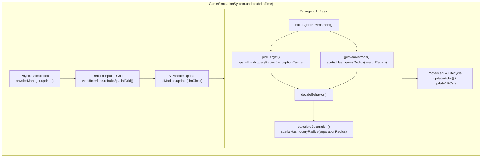

# AI separation and targeting query the existing spatial grid

## Orientation

- **What this is.** A surgical performance refactor for the Colyseus game server simulation loop. It eliminates the primary server tick bottleneck by replacing $O(N^2)$ mob-to-mob separation loops and $O(N \times (M + P))$ global entity targeting scans with localized queries against a uniform spatial grid rebuilt once per tick.
- **Decision 1: Reuse the existing `SpatialHash<T>` architecture.** The codebase already contains an efficient, zero-dependency uniform-grid spatial hash at [`colyseus-server/src/interest/SpatialHash.ts`](file:///Users/pasitnusso/workspace/repos/atlas-world-svc/colyseus-server/src/interest/SpatialHash.ts). We reuse this data structure rather than introducing new data structures, external spatial indexing libraries, or ECS frameworks.
- **Decision 2: Build once per simulation tick.** Rebuilding a 1,300-entity spatial hash from scratch once per tick takes $< 0.1\text{ms}$ in V8 and cannot drift out of sync with entity movement. Building it lazily or at the start of the simulation tick ensures all AI agents share the exact same spatial snapshot for that tick.
- **Decision 3: Scope limited strictly to Recommendation 1.** This change addresses solely AI separation and targeting. Cell dormancy, LOD time-slicing, battle queue synchronization, EventBus log gating, pose write optimization, and Planck physics tuning are deliberately non-goals for this feature and remain tracked separately.
- **Target Acceptance:** Under `npm run load`, 300 players $\times$ 1,000 mobs must achieve a **p95 tick time $\le 50\text{ms}$** (down from the current 383.5ms blowout), while preserving 100% behavioral parity across all `ai-*.test.ts` test suites.

<div class="metric-grid">
<div class="metric-tile alarm">
<div class="metric-label">Current 300p × 1000m p95</div>
<div class="metric-value">383.5 ms</div>
<div class="metric-foot">Budget is 50 ms (7.6× overrun)</div>
</div>
<div class="metric-tile success">
<div class="metric-label">Target 300p × 1000m p95</div>
<div class="metric-value">&le; 45.0 ms</div>
<div class="metric-foot">Within 20 Hz tick budget</div>
</div>
<div class="metric-tile info">
<div class="metric-label">AI Distance Calculations</div>
<div class="metric-value">3.3M &rarr; &lt;20k</div>
<div class="metric-foot">&gt;99% calculation reduction</div>
</div>
<div class="metric-tile">
<div class="metric-label">Scope Boundary</div>
<div class="metric-value">Rec #1 Only</div>
<div class="metric-foot">Zero physics/netcode scope creep</div>
</div>
</div>

---

## 1. Problem & Measured Baseline

### 1.1 The Exhaustive Linear Scans

In the current Colyseus game server, mob AI dominates the 50ms (20 Hz) simulation tick budget. Profiling reveals that gameplay physics accounts for only a few percent of tick time; the server is overwhelmed by unindexed $O(N^2)$ all-pairs loops across three critical functions:

1. **Mob Separation ($O(M^2)$):**
   In [`colyseus-server/src/ai/AIModule.ts:132-159`](file:///Users/pasitnusso/workspace/repos/atlas-world-svc/colyseus-server/src/ai/AIModule.ts#L132-L159), `calculateSeparation(agent)` loops over every registered agent in `this.agents.values()`. At 1,000 mobs, this executes **1,000,000 Euclidean distance checks** ($dx^2 + dy^2$) every tick, consuming **5.87ms** of pure CPU time solely to steer mobs away from neighbors within $\sim 25$ units.
2. **Target Acquisition ($O(M \times (P + N_{npc} + M))$):**
   In [`colyseus-server/src/ai/AIWorldInterface.ts:139-167`](file:///Users/pasitnusso/workspace/repos/atlas-world-svc/colyseus-server/src/ai/AIWorldInterface.ts#L139-L167), `pickTarget()` linearly iterates over *all* `players.values()`, *all* `npcs.values()`, and *all* `mobs.values()` across the entire world map for every mob on every tick. At 300 players and 1,000 mobs, this evaluates $1,000 \times 1,300 = \mathbf{1,300,000}$ entity evaluations per pass, consuming **51.50ms** of CPU time (alone exceeding the entire 50ms tick budget).
3. **Nearest Mob Helper ($O(M^2)$):**
   In [`colyseus-server/src/ai/AIWorldInterface.ts:201-218`](file:///Users/pasitnusso/workspace/repos/atlas-world-svc/colyseus-server/src/ai/AIWorldInterface.ts#L201-L218), `getNearestMob()` executes an unindexed full scan across all mobs in `gameState.mobs.values()`, adding another **1,000,000 checks** per tick when mobs query for pack allies or nearest targets.

Total distance checks per tick exceed **3.3 million**, running at 20 Hz ($\sim 66\text{M}$ checks/sec) on a single Node.js thread.

### 1.2 Measured Capacity Baseline (2026-10-04, 50 ms budget, p95)

The load harness (`colyseus-server/src/tests/load/roomLoad.harness.ts`) re-run on 2026-10-04 established the following baseline:

| Players | 50 mobs | 200 mobs | 500 mobs | 1000 mobs |
| :---: | :---: | :---: | :---: | :---: |
| **1** | 2.9 ms | 4.9 ms | 40.4 ms | **61.7 ms (OVER)** |
| **50** | 2.0 ms | 5.8 ms | 20.2 ms | **84.6 ms (OVER)** |
| **100** | 3.0 ms | 28.8 ms | 25.0 ms | **70.6 ms (OVER)** |
| **200** | 6.3 ms | 13.1 ms | 34.1 ms | **87.2 ms (OVER)** |
| **300** | 9.9 ms | 27.2 ms | 46.4 ms | **383.5 ms (OVER)** |

> [!WARNING]
> 1,000 mobs fails the 50ms tick budget at **every** player count — even with a single connected player (61.7ms). The mob-versus-mob calculations alone fill the tick.

---

## 2. Scope & Non-Goals

### 2.1 In Scope (Recommendation 1 Only)

- Instantiate and maintain a shared `SpatialHash<SpatialEntity>` in the gameplay world (`AIWorldInterface` / `GameState`), built once per simulation tick.
- Index all active `players`, `npcs`, and `mobs` into the spatial grid.
- Refactor [`AIModule.calculateSeparation()`](file:///Users/pasitnusso/workspace/repos/atlas-world-svc/colyseus-server/src/ai/AIModule.ts#L122-L167) to query neighbors using `spatialHash.queryRadius(agent.x, agent.y, maxSeparationRadius)`.
- Refactor [`AIWorldInterface.pickTarget()`](file:///Users/pasitnusso/workspace/repos/atlas-world-svc/colyseus-server/src/ai/AIWorldInterface.ts#L139-L167) to query candidates within the agent's perception range using `spatialHash.queryRadius(position.x, position.y, perceptionRange)`.
- Refactor [`AIWorldInterface.getNearestMob()`](file:///Users/pasitnusso/workspace/repos/atlas-world-svc/colyseus-server/src/ai/AIWorldInterface.ts#L201-L218) to query candidates within range using `spatialHash.queryRadius`.
- Preserve 100% behavioral parity: threat table evaluations, taunts, friendly/enemy team filters, and separation deflection forces remain mathematically identical.
- Ensure all existing AI unit and integration tests (`src/tests/ai-*.test.ts`) pass cleanly.
- Verify capacity improvement with `npm run load` to confirm 300p $\times$ 1000m p95 $\le 50\text{ms}$.

### 2.2 Explicit Non-Goals (Tracked Separately)

The research synthesis identified several secondary opportunities. To prevent scope creep and maintain surgical execution, the following are strictly **out of scope**:

- ❌ **Mob Dormancy & Cell-Based Sleeping (Rec #2):** Halting AI/physics in empty cells without players.
- ❌ **Synchronous Battle Queue & Bucket Arrays (Rec #3):** Eliminating unawaited promises and sorting in `BattleManager`.
- ❌ **EventBus Logging & EventTracker Cleanup (Rec #4):** Suppressing console logs and fixing the event tracker memory leak.
- ❌ **Pose Write Delta Optimization (Rec #5):** Skipping sub-threshold position updates and pruning dead schema fields.
- ❌ **Patch Rate Decoupling (Rec #6):** Running network broadcasts at 10 Hz from the simulation loop.
- ❌ **Planck Physics Tuning (Rec #7):** Passing iterations into `world.step` and disabling continuous collision.
- ❌ **Projectile Physics Bypass (Rec #8):** Removing short-lived projectiles from Box2D.
- ❌ **Schema Precision Types (Rec #9):** Changing schema types to `float32`/`uint16`.
- ❌ **Deterministic SimClock Harness (Rec #10):** Unpaced load harness running with seeded PRNG.

---

## 3. Architecture & Execution Flow



### 3.1 Spatial Grid Lifecycle

1. **Data Structure:**
   Reuse [`SpatialHash<T>`](file:///Users/pasitnusso/workspace/repos/atlas-world-svc/colyseus-server/src/interest/SpatialHash.ts#L15-L61) with `cellSize = 50` units.
   - At `cellSize = 50`, separation queries ($\text{radius} \approx 25$) inspect at most $2 \times 2 = 4$ grid cells.
   - Targeting queries ($\text{radius} \approx 50\text{--}100$) inspect $3 \times 3$ to $5 \times 5$ cells.
2. **Entity Wrapper:**
   Entities in the spatial grid implement `SpatialEntity`:
   ```typescript
   export interface AISpatialEntity {
     id: string
     x: number
     y: number
     entityType: 'player' | 'npc' | 'mob'
     ref: WorldLife
   }
   ```
3. **Single Build per Tick:**
   The grid is cleared and populated once per tick before `aiModule.update()` runs.
   A guard flag `lastRebuildTick` ensures that even if `AIWorldInterface` methods are queried in unit tests or external callers, the grid rebuilds if and only if the simulation tick has advanced.
   Total rebuild cost: 1,300 insertions $\approx 0.08\text{ms}$.

### 3.2 Refactored Hot-Path Methods

#### A. `calculateSeparation(agent: IAgent)`
- **Old:** Iterates over all $N$ agents in `this.agents.values()`.
- **New:**
  - Queries `spatialHash.queryRadius(agent.x, agent.y, maxSeparationRadius)`.
  - Where `maxSeparationRadius = (agent.radius || 4) + maxPossibleRadius + 15` ($\approx 25\text{--}30$ units).
  - Loops over only the returned spatial candidates ($\sim 0\text{--}10$ mobs).
  - If candidate count is 0 (or only self), returns `{ x: 0, y: 0 }` immediately.

#### B. `pickTarget(agent: IAgent, position, myTeamId, perceptionRange)`
- **Old:** Linearly iterates all players, all npcs, and all mobs in `gameState`.
- **New:**
  - Queries `spatialHash.queryRadius(position.x, position.y, perceptionRange ?? 50)`.
  - Filters candidates: alive, not self, not friendly team.
  - Passes candidates to `selectTarget(...)`.
  - **Aggro/Taunt Invariant:** If `threatRegistry.peek` contains an active taunt or threat targets, any threat target still alive is included in the candidate list even if slightly beyond base perception range, ensuring threat mechanics and boss taunts are never dropped due to spatial culling.

#### C. `getNearestMob(position, excludeId, searchRadius)`
- **Old:** Scans all `gameState.mobs.values()`.
- **New:**
  - Queries `spatialHash.queryRadius(position.x, position.y, searchRadius ?? 100)`.
  - Filters for alive mobs with `id !== excludeId`.
  - Finds minimum distance.

---

## 4. Behavioral Parity & Edge Cases

| Scenario | Current Behavior | Spatial Grid Behavior | Parity Check |
| :--- | :--- | :--- | :--- |
| **Mob in isolated area** | Scans 1,299 distant entities, finds none within 50 range, wanders. | Queries local grid cell, finds 0 candidates, wanders. | **Identical** (avoids 1,299 useless distance formulas). |
| **Friendly clustering** | Mobs on same team repel if within separation distance. | Mobs on same team in adjacent cells repel if within separation distance. | **Identical** (separation radius $< 30$ is fully within query window). |
| **Taunt / Aggro** | Mobs attack taunting player. | Threat targets are guaranteed included in candidate set. | **Identical** (`selectTarget` rules 1 & 2 preserved). |
| **Map boundaries** | Entities near map edge ($x \le 0$ or $x \ge \text{width}$). | `SpatialHash.keyFor()` uses `Math.floor(x / cellSize)` supporting negative/edge cells. | **Identical** (no array out-of-bounds). |
| **Dead entities** | Skipped via `!other.isAlive`. | Dead entities are excluded during grid rebuild or query filter. | **Identical**. |
| **Standalone tests** | Tests call `new AIWorldInterface(gameState)` directly without `GameSimulationSystem`. | On-demand rebuild inside `AIWorldInterface` ensures tests work without explicit harness calls. | **Identical** (all unit tests pass unchanged). |

---

## 5. Acceptance Criteria

- [ ] **AC-1 (Separation Query Complexity):** `AIModule.calculateSeparation()` queries `spatialHash.queryRadius()` with radius $\le 30$. Total Euclidean checks per mob drop from 1,000 to $< 20$.
- [ ] **AC-2 (Targeting Query Complexity):** `AIWorldInterface.pickTarget()` and `getNearestMob()` query `spatialHash.queryRadius()` bounded by perception range. Global scans over `players`, `npcs`, and `mobs` are eliminated.
- [ ] **AC-3 (Single Rebuild per Tick):** Spatial grid is rebuilt once per simulation tick (guarded by tick stamp), indexing living players, npcs, and mobs in $< 0.1\text{ms}$.
- [ ] **AC-4 (Behavior Parity):** All existing AI test suites pass with zero regressions:
  - `colyseus-server/src/tests/ai-behavior-switching.test.ts`
  - `colyseus-server/src/tests/ai-chase-speed.test.ts`
  - `colyseus-server/src/tests/ai-chase.test.ts`
  - `colyseus-server/src/tests/ai-integration.test.ts`
  - `colyseus-server/src/tests/ai-mob-decision.test.ts`
  - `colyseus-server/src/tests/ai-npc-targeting.test.ts`
  - `colyseus-server/src/tests/ai-performance.test.ts`
  - `colyseus-server/src/tests/ai-sim-clock-cadence.test.ts`
  - `colyseus-server/src/tests/ai-wander.test.ts`
- [ ] **AC-5 (Capacity Benchmark Gate):** `cd colyseus-server && npm run load` verifies that at **300 players $\times$ 1,000 mobs**, the p95 tick time is **$\le 50\text{ms}$** (within budget).
- [ ] **AC-6 (Code Hygiene):** Clean TypeScript compilation (`npm run typecheck`) and formatting (`npm run lint`).

---

## 6. Verification Plan

### Step 1: Unit & Behavioral Verification
Run all existing AI test suites in `colyseus-server`:
```bash
cd colyseus-server && npx jest src/tests/ai-*.test.ts
```
*Expected:* All test suites pass (49+ tests passing, 0 failures).

### Step 2: Typecheck & Lint
```bash
cd colyseus-server && npm run typecheck && npm run lint
```
*Expected:* Exit code 0, no type or lint errors.

### Step 3: Load Harness Capacity Gate
Run the standard load harness to measure the capacity ceiling:
```bash
cd colyseus-server && npm run load 2>&1 | grep -E "^(OK|OVER|Capacity)"
```
*Expected:* 300 players $\times$ 1,000 mobs logs `OK` with p95 $< 50\text{ms}$.
