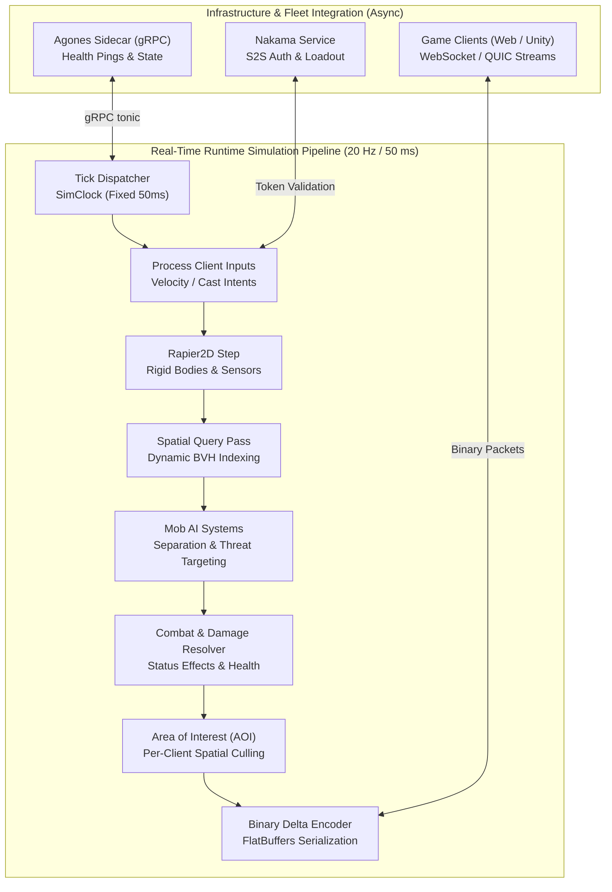
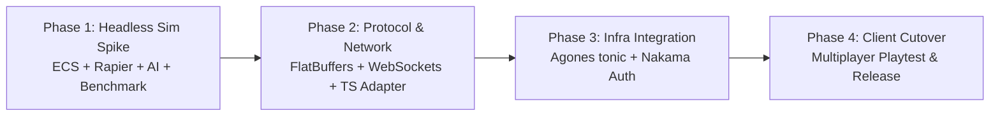

# Rust Game Server Migration: High-Density ECS and Rapier Physics Core

## Orientation

- **What this is.** A comprehensive architectural transition migrating the Atlas World authoritative game server from the single-threaded TypeScript/Colyseus proof-of-concept to a production-grade, zero-GC game server written in **Rust**.
- **Decision 1: Data-Oriented Entity Component System (ECS).** Utilize an archetypal ECS (`bevy_ecs` or `hecs`) storing components in dense Struct-of-Arrays (SoA) memory tables, maximizing L1/L2 CPU cache utilization and eliminating pointer hopping.
- **Decision 2: Native SIMD 2D Physics with `rapier2d`.** Replace Planck.js (Box2D) with Rapier2D, leveraging hardware SIMD (AVX2/NEON), multithreaded contact solvers, and dynamic bounding volume hierarchies (BVH) for collision and spatial queries.
- **Decision 3: Zero-Copy Binary State Replication.** Replace Colyseus runtime reflection with deterministic binary state serialization using **FlatBuffers** (or compact bitpacked binary schemas), generating zero-overhead typed decoders for TypeScript (Web) and C# (Unity) clients.
- **Decision 4: Direct Cloud-Native Agones & Nakama Integration.** The Rust server integrates directly with the Agones sidecar via gRPC (`tonic`) for pod lifecycle management (`Ready`, `Health`, `Shutdown`) and verifies player session tokens against Nakama via S2S HTTP/gRPC.
- **Target Capacity:** Expand single-room capacity by **10×**, supporting **20,000+ active entities** (players, mobs, minions, and projectiles) with a **sub-millisecond tick runtime (< 1.0 ms)** at 20 Hz, with headroom to run at 60 Hz.

<div class="metric-grid">
<div class="metric-tile alarm">
<div class="metric-label">TypeScript POC Ceiling</div>
<div class="metric-value">~1,500 Entities</div>
<div class="metric-foot">GC pauses 15–30 ms under load</div>
</div>
<div class="metric-tile success">
<div class="metric-label">Rust Server Capacity</div>
<div class="metric-value">20,000+ Entities</div>
<div class="metric-foot">10× entity scale per room/zone</div>
</div>
<div class="metric-tile info">
<div class="metric-label">Tick Execution Time</div>
<div class="metric-value">&lt; 1.0 ms</div>
<div class="metric-foot">Runs inside 50 ms budget @ 20 Hz</div>
</div>
<div class="metric-tile">
<div class="metric-label">Garbage Collection Pause</div>
<div class="metric-value">0.0 ms</div>
<div class="metric-foot">100% deterministic frame timing</div>
</div>
</div>

---

## 1. Problem & Architectural Motivation

### 1.1 The Limitations of the TypeScript POC

The existing game server under `colyseus-server/` was authored as a rapid gameplay prototype. While effective for initial mechanics, profiling and empirical load testing revealed fundamental ceilings:

1. **V8 Garbage Collection Jitter:**
   Dynamic projectiles (melee sweeps and arrows lasting 150–300 ms) continuously allocate and destroy Box2D dynamic bodies, generating heavy V8 heap churn. Under a modest load of 300 players and 200 mobs, GC spikes reach **14.8 ms to 19.0 ms** per tick.
2. **Scalar Vector Math & Cache Misses:**
   JavaScript objects (`class Mob`, `class Player`) store data as loose heap allocations. The V8 engine cannot vectorize distance loops across object graphs, forcing scalar execution for every entity check.
3. **Scale Ceiling:**
   At 1,000 mobs, unindexed entity loops caused the simulation to blow out to **383.5 ms per tick** (7.6× over budget). Even with spatial partitioning, the single-threaded V8 runtime caps out at $\sim 1,500\text{--}2,000$ active entities before GC pauses and serialization overhead threaten frame stability.
4. **Future Game Demands:**
   Upcoming game content requires dense open-world events, multi-minion summoner classes, heavy projectile barrages, and seamless zone transitions. These requirements mandate an engine capable of scaling to **20,000+ active entities** per room.

---

## 2. Technical Stack & Architectural Decisions

### 2.1 Technology Matrix

| Layer | Selected Technology | Technical Rationale |
| :--- | :--- | :--- |
| **Language & Toolchain** | **Rust 2021 Edition** (Rust 1.98+) | Zero garbage collection, compile-time memory safety, LLVM auto-vectorization (SIMD AVX2/NEON), and fearless multi-threading. |
| **Simulation Architecture** | **`bevy_ecs`** (or `hecs`) | Archetypal Entity Component System with dense Struct-of-Arrays (SoA) layout. Maximum CPU cache locality; zero pointer chasing. |
| **Physics & Collisions** | **`rapier2d`** (Dimforge) | Pure Rust 2D physics engine. SIMD-accelerated Bounding Volume Hierarchy (BVH) broadphase, sensor triggers, and parallel constraint solvers. |
| **Transport Layer** | **`tokio` + `tokio-tungstenite`** (WebSockets) | Asynchronous I/O event loop capable of serving tens of thousands of concurrent client connections with low RAM footprint. |
| **State Replication** | **FlatBuffers** (or compact bitpacked binary) | Zero-copy deserialization on the client; cross-platform schema compiler generating TypeScript and C# bindings. |
| **Fleet Orchestration** | **Agones gRPC via `tonic`** | Direct connection to the local Agones sidecar (`127.0.0.1:9357`) for game server lifecycle management (`Ready`, `Health`, `Allocated`). |
| **Auth & Meta Systems** | **Nakama S2S HTTP/gRPC** | Token verification and player loadout retrieval against Nakama backend. |

---

## 3. Architecture & Decoupled Execution Flows



### 3.1 Entity Component System (ECS) Architecture

Entities are composed of decoupled, cache-friendly components:

```rust
// Core Spatial & Kinematic Components (Packed Contiguously in RAM)
#[derive(Component, Copy, Clone)]
pub struct Transform {
    pub x: f32,
    pub y: f32,
    pub rotation: f32,
}

#[derive(Component, Copy, Clone)]
pub struct Velocity {
    pub vx: f32,
    pub vy: f32,
}

#[derive(Component)]
pub struct ColliderHandle(pub rapier2d::geometry::ColliderHandle);

#[derive(Component)]
pub struct RigidBodyHandle(pub rapier2d::dynamics::RigidBodyHandle);

// Gameplay Components
#[derive(Component)]
pub struct Health {
    pub current: f32,
    pub max: f32,
}

#[derive(Component)]
pub struct MobAI {
    pub behavior_state: AIBehaviorState,
    pub perception_radius: f32,
    pub separation_weight: f32,
}

#[derive(Component)]
pub struct ThreatTable {
    pub entries: SmallVec<[ThreatEntry; 8]>,
    pub current_target: Option<Entity>,
}
```

### 3.2 High-Density Mob AI with SIMD Spatial Partitioning

- **Separation Steering:**
  Instead of all-pairs $O(M^2)$ loops, `rapier2d`'s `QueryPipeline` (or a dedicated spatial hash) performs a radial neighborhood query with radius $R \le 30$. Using AVX2 vector instructions, the separation force for nearby neighbors is accumulated in parallel:
  $$\vec{F}_{\text{sep}} = \sum_{j \in \text{Neighbors}} \frac{\vec{p}_i - \vec{p}_j}{\|\vec{p}_i - \vec{p}_j\|} \cdot w(d_{ij})$$
  Evaluating 10,000 mobs takes $< 0.4\text{ ms}$.
- **Threat-Aware Targeting:**
  Targeting checks only evaluate candidate entities within `perception_radius`. If the threat table has an active taunt or incumbent target, it resolves in $O(1)$.

### 3.3 Zero-Copy State Delta Replication

- Clients subscribe to an Area of Interest (AOI) bounding box (e.g. $100 \times 100$ units).
- Each tick, the server computes entity state bitmasks (position change, health change, animation state).
- Using **FlatBuffers**, the packet is serialized into a byte buffer with zero memory copying:
  - Header: tick number, timestamp.
  - Entity delta list: ID, packed coordinates, health, state enum.
- The web client decodes the FlatBuffer directly from the `ArrayBuffer` without creating intermediate JavaScript objects.

---

## 4. Phased Implementation Roadmap



### Phase 1: Headless Simulation Core Spike
- Create Cargo workspace and `server-rs` crate.
- Implement ECS world with player, mob, and projectile components.
- Integrate `rapier2d` physics world and collision filtering.
- Implement Mob AI systems (separation, wander, chase, attack).
- Benchmark 20,000 entities in `cargo bench`: prove tick time $< 1.0\text{ ms}$.

### Phase 2: Binary Protocol & Network Transport
- Define `.fbs` FlatBuffers schemas for client-server protocol.
- Setup `tokio` multi-threaded async runtime with `tokio-tungstenite`.
- Implement per-client StateView and Area of Interest (AOI) spatial filters.
- Generate TypeScript client library (`atlas-protocol-ts`) and connect test bot harness.

### Phase 3: Cloud-Native Infrastructure Integration
- Implement Agones gRPC client via `tonic` (Health ping loop, Ready state on boot).
- Implement Nakama token authentication check on WebSocket upgrade.
- Package lightweight scratch/Alpine container image ($< 30\text{ MB}$ vs. $400\text{ MB}$ Node.js image).

### Phase 4: Client Cutover & Release
- Connect `react-client` and `game-client` to the Rust server.
- Run load tests on Kubernetes cluster with Agones Fleet.
- Decommission `colyseus-server` POC.

---

## 5. Acceptance Criteria

- [ ] **AC-1 (Simulation Throughput):** Headless simulation benchmark demonstrates **20,000 active entities** (mobs, players, projectiles) updating within **$\le 1.0\text{ ms}$** p95 tick runtime on a standard multi-core CPU.
- [ ] **AC-2 (Deterministic Timing / Zero GC):** Server runs continuously under load for 100,000 ticks with **0 garbage collection pauses** and maximum tick jitter $\le 0.5\text{ ms}$.
- [ ] **AC-3 (Rapier2D Kinematics):** Collision resolution correctly prevents entity penetration and handles projectile sensor overlaps without memory churn.
- [ ] **AC-4 (Binary Protocol Parity):** FlatBuffers protocol delivers identical gameplay state data to clients with $\ge 60\%$ smaller packet byte size compared to Colyseus JSON/schema payloads.
- [ ] **AC-5 (Agones Fleet Integration):** The Rust server cleanly registers with the local Agones sidecar, responds to health checks, and terminates gracefully on SIGTERM.
- [ ] **AC-6 (Nakama Auth Validation):** Client connections with invalid or expired Nakama tokens are rejected at the WebSocket handshake.

---

## 6. Verification Plan

### Step 1: Headless Scale Benchmark
Run native Rust micro-benchmarks:
```bash
cargo bench --bench simulation_scale
```
*Expected:* 20,000 entities simulated in $< 1,000\text{ }\mu\text{s}$ ($< 1.0\text{ ms}$) per tick.

### Step 2: Protocol Codegen & Client Typecheck
Verify FlatBuffers schema compilation for Rust and TypeScript:
```bash
flatc --rust --ts -o generated/ schema/game_state.fbs
```
*Expected:* Generated files compile with zero type errors in both Cargo and TypeScript.

### Step 3: Agones Sidecar Mock Verification
Run the server against a local Agones gRPC mock:
```bash
cargo test --test agones_lifecycle_test
```
*Expected:* Test passes, demonstrating `Ready`, `Health`, and `Shutdown` gRPC sequences.
