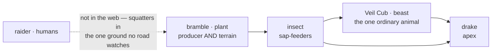

# L2 ecology — Thornveil

**Level:** L2 · **Role:** Naturalist (joins at L2 per the roles charter §2.2) · **Date:** 2026-08-03
**Parents (not reopened):** `A1-geography-cluster1.md` §3, §4.2, §4.3 · `content/bestiary/README.md` · `DR-003-season-1-budget.md`
**Wave:** 4 of the L2→L4 sequence — the vertical slice that proves the chain before it is run nine more times.

<div class="callout info">
<strong>Scope ruled before design.</strong> The superseded title promised ecology for <em>all</em>
cluster-1 zones and placement of <em>all 116</em> designs. The owner cut it to <strong>one zone at
full depth</strong> (2026-08-03) so that wave 4 stays a vertical slice. The other nine zones are
out of scope and named as such under <em>Out of scope</em>.
</div>

## Problem

### The bestiary describes a 1–70 ecosystem; A1 assigns the zone band 15–28

`content/bestiary/bestiary.json` holds 14 designs whose `region` is `thornveil`. Sorted by band they
are not a scatter — they are four deliberate growth lines:

| line | ascent |
|---|---|
| **plant** | Bramble Shoot (1-10) → Bramble Stalker (11-20) → Bramble Warden (21-30) → Bramble Mother (41-50) → **Heartwood Tyrant** (61-70) |
| **insect** | Thicket Hopper (1-10) → Thornhusk Weaver (11-20) → Sapdrinker Swarm (21-30) |
| **raider** | Veil Spearling (11-20) → Thornveil Spearhand (21-30) → Briar-Caller (31-40) |
| **drake** | Bramble Drake (31-40) → **Thorncrown Drake** (51-60) |
| *(orphan)* | Veil Cub (1-10, the zone's one `beast`) |

`content/maps/cluster1-geography.json#zones[thornveil]` carries `levelBand: [15, 28]`, matching
A1 §4.2. **Eight of the fourteen fall outside it.**

<div class="callout warn">
<strong>The received framing is wrong and this spec rejects it.</strong> I-048 §5.1 calls these
"stranded designs" needing "a re-band/re-region pass — data editing, not creature design." They are
not stranded. Someone wrote Thornveil as a complete vertical ecosystem, and a later zone-band
assignment narrowed the ground under it. Re-banding would flatten four intentional ladders; relocating
would scatter <em>bramble</em>-bound species into terrain their own lore contradicts.
</div>

### The zone's ecology has never been derived, so nothing downstream can place anything

`docs/worldbuilding/` holds A0 (the world as it stands) and A1 (geography). **There is no A2.** L2 is
recorded as "❌ not started" in `docs/worldbuilding/idea-map.md`. The consequence is concrete: I-062
must invent a boss with no habitat to put it in, and I-064 must mint spawn entries with nothing
saying *where in a zone* anything lives.

### `region` is origin, not placement — and nothing reads it

`content/bestiary/README.md` defines `region` inside a set of fields that answer *"what kind of thing
is this and where does it come from."* It is ecological origin, not a spawn location. The same README
states plainly: **"The gate does not read `content/bestiary/`. Adding or editing this file cannot
change gate output."** So today there is no artifact, and no gate, that can say where in Thornveil a
Sapdrinker Swarm is found.

## Why now

Wave 4 is the vertical slice. I-062 (one boss) and I-064 (monsters made playable) both consume L2
output that does not exist. Running this once, properly, on one zone establishes the artifact shape,
the schema and the gate that the remaining nine zones reuse — and surfaces the cost before it is paid
ten times.

Two facts make the ordering favourable right now:

- **F-024 merged** (`a8b82b3`), so `bestiary.json` and `cluster1-geography.json` are both on
  `release/1.6`. Every input this spec needs is on one branch for the first time.
- **I-056 landed 11 of its 15 contradictions** (`da31ccf`, `49c468e`, `812beb7`, `3290be8`,
  `0396222`). The canon this builds on is materially cleaner than the wave plan assumed.

## Decisions taken

Four rulings, made with the owner on 2026-08-03, before any design:

| # | Question | Ruling |
|---|---|---|
| **D1** | One zone or all ten? | **One zone, full depth.** Structural work scoped to what that zone needs. |
| **D2** | Which zone? | **Thornveil.** Clean zone id (no town/zone keyspace conflation), no town, a real food chain, 14 designs — large enough to be a genuine test, small enough to finish. |
| **D3** | Band conflict? | **Route band vs interior depth.** The zone band describes the through-route; the roadless interior escalates. Precedent: A1 §4.3 already did this for Ashvale Front (southern lip 10–25 / middle 25–50 / northern deep 55–80). |
| **D4** | Data binding? | **A separate placement file**, not new fields on the roster. Keeps the bestiary's fourteen-field and no-gate contracts intact, and lets the gate be strict instead of permissive. |

## The derivation

### Water, and why it decides everything

A1 §4.2 calls Thornveil *"the interfluve between the river and the eastern hills — the ground every
road went **around**, so it stayed nobody's."*

**An interfluve is by definition the dry land between two drainages.** That one fact derives the zone:

<div class="metric-grid">
<div class="metric-tile"><strong>no through-stream</strong><br/>water is dew, stone-hollow catch, and sap</div>
<div class="metric-tile"><strong>bramble</strong><br/><code>terrainKind: "bramble"</code> — drought-tolerant thorn on stony ground</div>
<div class="metric-tile"><strong>no farm, no road</strong><br/>the consequence, not a coincidence</div>
<div class="metric-tile alarm"><strong>sap = water</strong><br/>the scarce resource the whole food web turns on</div>
</div>

Because there is no standing water, **sap is the only reliable water in the zone**. That is not
decoration — it directly explains the insect layer the bestiary already contains: **Thornhusk Weaver**
and **Sapdrinker Swarm** are sap-feeders, and they exist here and almost nowhere else.

It also gives the apex its meaning. **The bramble is the water table.** The oldest, deepest-rooted
growth holds the most water, which is why **Heartwood Tyrant** sits at the centre and at 61-70 — it is
not merely the strongest thing in Thornveil, it is the reason the interior can support anything at all.

### The food chain



Two readings come from `content/bestiary/README.md` rather than invention: `plant` is documented as
*"almost entirely Thornveil; holds ground rather than chasing"*, and `drake` as *"scaled things …
that sit at the top of a region's food chain."* The three `raider` designs are deliberately **outside**
the web — they are people who moved into the interfluve precisely because no road overlooks it.

### The roads skirt it — confirmed in geometry, not just prose

`cluster1-geography.json#roads[terrace-track-north]` ("up the terrace") carries the note *"the
north-east fork runs up the river terrace to the camp, **Thornveil's edge** and the ice."* Its points
run x≈96→110 against Thornveil's polygon at x≈104–142 — it **grazes the western edge and never
enters**. The `east-rim-track` does not come near the zone at all (`norhollow → coastal-spur`, x≈36–74).

<div class="callout success">
<strong>This is what makes the depth model true rather than convenient.</strong> A1 says every road
went around Thornveil; the map data agrees. You do not pass <em>through</em> this zone — you pass
<em>along</em> it. Going in is a choice, and the further in you go the less anyone has ever been there.
</div>

## The depth model

Four concentric tiers. **A1 §4.2's 15–28 is not amended** — this states what that number describes:
the skirting route, not a ceiling on what lives inside.

| tier | bands | what it is | designs |
|---|---|---|---|
| **Verge** | 1–14 | the track margin, cut back by passing traffic | Bramble Shoot · Thicket Hopper · Veil Cub |
| **Route** | **15–28** | the skirting track — A1's binding band | Bramble Stalker · Veil Spearling · Thornhusk Weaver · Bramble Warden · Thornveil Spearhand · Sapdrinker Swarm |
| **Interior** | 29–50 | the off-track bramble body | Bramble Drake · Briar-Caller · Bramble Mother |
| **Heart** | 51–70 | the roadless centre | Thorncrown Drake · **Heartwood Tyrant** |

All fourteen placed; none stranded; all four growth lines preserved.

<div class="callout idea">
<strong>Tiers are deliberately not derivable from <code>levelBand</code>.</strong> Band 11-20 straddles
the verge/route edge at 14/15, and band 21-30 straddles route/interior at 28/29. A computed mapping
would have to break one of them. That is exactly why placement must be <em>authored</em> data — and
why it earns a file rather than a formula.
</div>

## Artifacts

| file | status | what |
|---|---|---|
| `docs/worldbuilding/A2-ecology-thornveil.md` | new | the Naturalist document — water derivation, vegetation, food chain, depth model, per-design placement rationale |
| `content/bestiary/placement-thornveil.json` | new | `{ version, zone, bestiaryRegion, routeBand, depthTiers[], placements[] }` |
| `content/schemas/bestiary-placement.schema.json` | new | `additionalProperties: false`, following the eleven existing schemas' conventions |
| `scripts/check_content.mjs` | edit | new `checkBestiaryPlacement()` beside `checkMaps()`; path overridable via `parseArgs` like every other input |
| `scripts/tests/bestiary-placement.test.mjs` + fixtures | new | one test per gate rule, red before green |
| `content/bestiary/README.md` | edit | **one pointer line only** — the roster's fourteen-field contract and its "the gate does not read this file" posture both stay true, because placement is a sibling file, not the roster |

### Placement file shape

```json
{
  "version": 1,
  "zone": "thornveil",
  "bestiaryRegion": "thornveil",
  "routeBand": [15, 28],
  "depthTiers": [
    { "id": "verge",    "label": "The Verge",    "bandFloor": 1,  "bandCeil": 14, "summary": "…" },
    { "id": "route",    "label": "The Route",    "bandFloor": 15, "bandCeil": 28, "summary": "…" },
    { "id": "interior", "label": "The Interior", "bandFloor": 29, "bandCeil": 50, "summary": "…" },
    { "id": "heart",    "label": "The Heart",    "bandFloor": 51, "bandCeil": 70, "summary": "…" }
  ],
  "placements": [
    { "design": "mob-bramble-shoot", "tier": "verge", "locale": "cart-cut margins", "note": "…" }
  ]
}
```

## Gate rules

Strict, because the file is **complete for its scope** — unlike an optional field on a 116-entry
roster where 102 entries would carry nothing.

| # | Rule | Level |
|---|---|---|
| **G1** | `zone` resolves to an id in `cluster1-geography.json#zones` | FAIL |
| **G2** | `bestiaryRegion` is a region key actually present in `bestiary.json` | FAIL |
| **G3** | every `placements[].design` exists in `bestiary.json` | FAIL |
| **G4** | every design with `region === bestiaryRegion` appears **exactly once** in `placements` | FAIL on missing *or* duplicate |
| **G5** | every `placements[].tier` is a declared `depthTiers[].id` | FAIL |
| **G6** | a design's `levelBand` **overlaps** its tier's range | FAIL only when fully disjoint — straddling is legitimate |
| **G7** | `depthTiers` bands ascend, are contiguous, and do not overlap | FAIL |
| **G8** | `routeBand` equals `cluster1-geography.json#zones[<zone>].levelBand` | FAIL |

**G4 is the rule that makes this worth building** — it is what turns "some monsters have a location"
into "this zone is fully placed, and the gate knows it."

**G8** exists because the zone record is already machine-readable
(`{"id":"thornveil","order":4,"levelBand":[15,28],"terrainKind":"bramble","town":null}`), so the route
band is a cross-file assertion rather than a number retyped from prose.

`readJson` returning falsy must follow the FAIL-vs-parsed-falsy pattern already at
`scripts/check_content.mjs:46-51` — a parsed-but-falsy document and a recorded FAIL are not the
same thing.

## Out of scope

Named explicitly so the slice does not drift:

- **The other nine zones.** This spec is the template; running it is separate work.
- **The X12 keyspace rename.** Stays with [[I-056]] — whose stated blocker (`bestiary.json` living only
  on `feat/F-024`) is now cleared by `a8b82b3`. `canon.md` §6.1's "Open, not resolved — cannot happen
  on this branch" paragraph is **stale as of that merge** and should be corrected there, not here.
- **The `zones` budget measure.** `scripts/lib/season1.mjs` exports no `zones` function and
  `buildRows` returns early on `blockedBy`. Unblocking that line needs the rename *plus* a new
  measure *plus* all ten zones — none of which is one zone's work.
- **Minting mobTypes and assetKeys** — that is [[I-064]], whose chain `content/bestiary/README.md`
  already specifies (a mob type in `config/mobs/definitions/` regenerated into `mob-types.json`, plus
  an `assetKey` in `asset-keys.json` matching an art-manifest entry at the declared tier).
- **Boss identity, lore and `art:boss`** — that is [[I-062]]. This hands it two candidates and one
  live tension: **Heartwood Tyrant** (`plant`, 61-70) sits at the top of Thornveil's web, but the
  bestiary README defines `drake` as the family that "sit[s] at the top of a region's food chain",
  which argues for **Thorncrown Drake** (`drake`, 51-60). I-062 rules.
- **Bestiary art.** `art-bestiary` measures 0 of 30 and the art manifest holds zero `mob` or `boss`
  entries. Generating any needs the `bodyPlan` silhouette anchors described in the bestiary README —
  separate work with its own cost.

## Verification

Evidence required before this is called done:

1. `node scripts/check_content.mjs` exits 0, with the placement file present and its counts printed.
2. Each of G1–G8 has a test that is shown **failing before the rule exists** and passing after —
   the gate's value is entirely in what it rejects.
3. `node --test scripts/tests/` passes.
4. `node scripts/report_season1.mjs` output is pasted **before and after**, and is **identical**.
   This feature deliberately moves no budget line; a changed number means something was done that
   this spec did not authorise.
5. All fourteen `thornveil` designs appear in `placements`, verified by G4 rather than by eye.
6. `A2-ecology-thornveil.md` renders through `~/.claude/scripts/render-spec-md.sh` and is reviewed
   in the browser.
7. Every claim in `A2-ecology-thornveil.md` that attributes a fact to A1, the bestiary README or the
   geography JSON cites it with `file` and section — this spec's own east-rim-track error was caught
   exactly that way, and the Naturalist document is where that failure would be most expensive.
