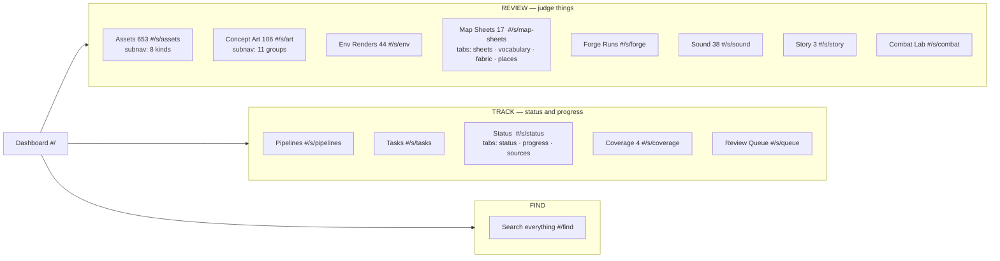
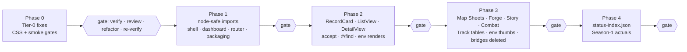

# asset-storybook UI/UX redesign — dashboard, list view, detail view

## Orientation

- **What this is.** The asset storybook (`atelier/asset-storybook/`, written `sb/` below) is the one page where the owner, who is the art director, looks at everything the project produces. Today it is visibly broken and hard to find your way around. This spec turns it into a tidy page with a **dashboard** as the landing view, one **list view** that works for every kind of artifact, and one **detail view**.
- **Decision 1: one registry file drives the page.** A committed `sb/sections.json` lists every section. The menu, the dashboard rows, the lists and the details are all generated from it, and so are the tests. Adding a new artifact type becomes a data row plus a test run, not six edits in five files.
- **Decision 2: fix what is broken first, and add the gates that would have caught it.** Phase 0 fixes the four defects that break the page today. It also adds a CSS brace check and a headless-Chrome smoke test, so the same class of break cannot ship silently again.
- **Decision 3: review can finish.** An additive "accept" mark joins the existing reject and rebuild marks, in the same `content/review-queue.json`. "Unreviewed" can finally reach zero.
- **Standing decisions kept.** Static HTML, vanilla ES modules, no framework, no build step, no server, no write endpoint. Agents and CI touch only JSON registries.
- **What was assumed.** The 12 open questions from the analysis are answered with the defaults given to this lane (§11). The biggest assumptions: environment renders get a screen; the task list reads the ps-release-workflow backlog catalogs as recorded; the Map Builder live section is split into a follow-up spec.
- **How it was checked.** Three adversarial reviews raised 44 findings. All 44 were accepted, some with a modified fix. Appendix A says what changed for each one.

## 1. Problem (today)

Evidence and the problem ids (C0.1 and so on) come from `analysis/07-critic-and-synthesis.md` §C, on `main` at `bb8fe645`.

**Tier 0: the page is broken.**
- **C0.1 unclosed CSS rule.** `.maps-overlay-img {` at `index.html:1025` never closes, which nests the next 91 rules. The detail overlay CSS and every Forge style are dead on `main` and `release/1.10`. Brace count is 229 open, 228 close.
- **C0.2 detail view renders as an unstyled fragment.** Page scroll locks, and the 3D viewer is 0 px tall. This follows from C0.1.
- **C0.3 Forge tab silently empty.** `atelier/art-forge/runs/A1-ART-02.json` line 186 is blank, so `parseLedgerText` throws. `forge.mjs:366-369` swallows the error and shows nothing.
- **C0.4 hidden grids collapse.** `VirtualGrid._measure()` reads width 0 while a section is hidden, falls to 1 column, and stacks 1190 px cards 340 px apart. Separately, row height is fixed while card height follows card width. Fixing C0.1 alone therefore clips each card's key, filename and verdict buttons, which the scale review measured as 81 px and 117 px below the card edge.

**Tier 1: structural.** C1.1: 26 look-alike sidebar entries, organised by source file. Tools, kinds, sub-tabs and filters all look the same; C1.2: no dashboard; C1.3: no URL state and no global search; C1.4: three different overlays, and five artifact types have no detail view; C1.5: adding a section costs at least 9 touches (§8); C1.6: no responsive layout (0 `@media` rules); C1.7: the "All" entry is an 81-screen wall.

**Tier 2: data gaps.** C2.1: tasks, status and progress data never reach the page; C2.3: pipeline data is one ledger; C2.4: use cases exist only as prose; C2.5: the review loop has never been used, and it cannot finish because there is no accept; C2.6: reviewer sheets and the UI use two verdict vocabularies; C2.7: the 44 environment renders have no screen; C2.8: Forge data is not in the deployed image; C2.9: work orders live only in memory.

**Tier 3: code health.** C3.1: one 1,698-line stylesheet with 33 stray hex colours; C3.2: a 323-line `init()`; C3.3: empty filters show a blank page; C3.7: no UI or smoke tests. That is why C0.1 and C0.3 shipped through releases 1.8 and 1.9.

## 2. Goals / Non-goals

**Goals**
1. **Phase 0:** the page loads with a working detail overlay, a Forge tab and correct grids. Two new gates keep it that way.
2. **Dashboard at `#/`** covering six nouns (assets, progress, pipelines, status, tasks, use cases) plus a "Needs me today" strip. Review content comes first, per constraint 1 (07 §D: the page is an art-direction review surface).
3. **One generic list and one generic detail** over an `ArtifactRecord`. They cover assets, concept art, environment renders, map sheets, Forge cells, sound, story views, tools, tasks, pipelines, status lines, coverage gaps and queue items.
4. **Every produced artifact observable** (owner rule, 2026-08-15). A registry JSON that no section shows turns CI red.
5. **Review that can finish:** accept, reject, rebuild, keyboard loop, one export path.
6. **URL state:** every view is linkable and survives a refresh.
7. **Budgets:** landing view at most 25 JSON requests, 0 images and 1.5 MB. Bounded DOM. Exactly one live `<model-viewer>`.
8. **Scale:** a new row-shaped artifact type costs 2 touches and 0 lines of JS.

**Non-goals.** No framework, bundler, TypeScript, CSS split or new npm dependency; no server, no write endpoint, and no browser-triggered generation; no search index; no light theme or density toggle; no gate-stdout parsing and no generated tasks index; no Map Builder live section in this spec. It becomes a follow-up after F-052 (the Map Builder service feature) merges; see §11 Q8; no sections for content records (zones, dungeons, story JSON); no rewrite of the tested data layer: `forge/{gallery,staleness,pipeline}.mjs`, `maps-fabric.mjs`, `maps-vocabulary.mjs` and `data/*`.

## 3. Information architecture

### 3.1 Navigation tree

There are 15 sidebar entries, grouped by what the owner is doing. Today there are 26.



The sidebar foot carries a one-line legend: `● loaded · ● n missing · ○ not loaded yet`. Health is no longer explained only in a tooltip. The 14-line header paragraph is removed. Its render-type prose moves behind a `?` popover on the dashboard. Subnav disclosure state is kept per viewer in `localStorage`, inside try/catch.

### 3.2 Where today's 26 entries go

Nothing vanishes: every old id is a key in `sections.json.legacyIds`, and registry check (9) enforces it.

| Today (`main.mjs:212-284`, `filters.mjs:82-91`) | Old id(s) | Goes to |
|---|---|---|
| All (797) | `all` | Dashboard `#/`. The flat list lives at `#/find`. |
| Combat | `combat` | Combat Lab `#/s/combat` (inline, no double scrollbar) |
| Story | `story` | Story `#/s/story` |
| Map Sheets (17) | `map-sheets` | Map Sheets `#/s/map-sheets`. The id is kept because art group `map` exists (constraint 22). The three stacked panels become tabs. |
| Forge | `forge` | Forge Runs `#/s/forge`, plus one row per brief in Pipelines |
| Characters · Creatures · VFX · Weapons · Loot & Items · Dungeon Kit · Environment · Props & UI | `character` `creature` `vfx` `weapon` `loot` `dungeon` `environment` `prop` | `#/s/assets?f.kind=<id>` (subnav, taxonomy order) |
| SFX (31) · Music (7) | `sfx` `music` | `#/s/sound?f.kind=sfx` · `…=music` |
| Concept Art (106) | `art` | `#/s/art` |
| Cast · Races · Classes · Mobs · Maps · Towns | `art:cast` `art:race` `art:class` `art:mob` `art:map` `art:town` | `#/s/art?f.group=<id>` |
| Coverage (4) | `coverage` | Coverage `#/s/coverage`. It stays a page because of I-066 (the idea about unmapped-key coverage cards). |
| Rejected · Needs rebuild · Unreviewed (653) | `verdict:reject` `verdict:rebuild` `verdict:unreviewed` | Phase 1: `#/s/assets?f.verdict=<v>`. Phase 2 onward: `#/find?f.verdict=<v>`. |

### 3.3 Hash scheme and router contract

```
#/                                            dashboard
#/s/<sectionId>?q=&f.<key>=<v>[,<v>]&sort=&dir=asc|desc&view=grid|table&tab=
#/s/<sectionId>/<localId>?<same list query>   detail overlay above that list
#/find?q=&f.type=&f.verdict=                  cross-section list
#/<legacyId>                                  redirect via legacyIds (replaceState)
```

1. `localId` is URL-encoded once. Examples: `weapon:axe`, `A1-ART-02-dev-seed12345-s0.30`.
2. `js/shell/router.mjs` is the only module that writes `location.hash` or calls `history.*State`. Views call `router.go(partial, {replace})`.
3. **Route diff.** On every navigation, from `hashchange` or from `router.go`, the router computes `{sectionChanged, queryChanged, recordChanged, tabChanged}` and dispatches only what changed: section changed: unmount the old list, mount the new one; query changed: `grid.setItems(filtered)` in place, keeping scroll and focus; `q` and `sort` writes use `replaceState`; record changed: overlay only, and the list is untouched; tab changed: panel swap; `router.go` renders directly, because `replaceState` does not fire `hashchange`.
4. Opening a detail pushes one history entry. Prev/next inside detail uses `replaceState`. Back closes the detail.
5. An unknown query key is ignored. An unknown section falls back to the dashboard with a notice naming the id.
6. While phase-1 bridges exist, the router also emits `storybook:class-change` (`sidebar.mjs:58`).

## 4. Dashboard

### 4.1 Wireframe (desktop ≥1024 px; values are `main` at `bb8fe645` after phase 2)

```
┌ sidebar 240 ────┐┌─────────────────────────── content max 1280px ─────────────────────────────────────────┐
│ atlas-world-svc ││ Storybook · release 1.9 · not in progress (as recorded)          [ / search everything ]│
│ ▣ Dashboard     ││ NEEDS ME TODAY                                                                          │
│ REVIEW          ││ ┌───────────┐ ┌──────────────┐ ┌────────────┐ ┌────────────┐ ┌───────────────────────┐ │
│ ▸ Assets    653 ││ │ 803       │ │ 23           │ │ 4          │ │ 0 (dim)    │ │ 0 (dim)               │ │
│ ▸ Concept   106 ││ │ unreviewed│ │ env renders  │ │ missing    │ │ unsaved    │ │ sources failed        │ │
│   Env Renders 44││ │ 3 types   │ │ no reviewer  │ │ manifest   │ │ marks      │ │ 23/23 loaded          │ │
│   Map Sheets  17││ │ → Search  │ │ sheet → Env  │ │ → Coverage │ │ → Queue    │ │ → Status › Sources    │ │
│   Forge Runs    ││ └───────────┘ └──────────────┘ └────────────┘ └────────────┘ └───────────────────────┘ │
│   Sound      38 ││ ┌ ASSETS ────────────────────────┐ ┌ PROGRESS ─────────────────┐ ┌ PIPELINES ─────────┐ │
│   Story       3 ││ │ Assets      653 ● ░░░░ 0/653   │ │ review     0 / 803 judged │ │ art-forge          │ │
│   Combat Lab    ││ │ Concept Art 106 ● ░░░░ 0/106   │ │ races+classes 72/72 ▮▮▮▮  │ │  4 briefs·1 ledger │ │
│ TRACK           ││ │ Env Renders  44 ◐ ░░░░ 0/44    │ │ features per release      │ │ mapforge  17/17 🔒 │ │
│   Pipelines     ││ │   judged · 44 not in image     │ │  1.1 … 1.9 ▁▂▃▅▆▇█        │ │ thumbs baked n/759 │ │
│   Tasks         ││ │ Map Sheets   17 ● verdicts P3  │ │ season 1   8 targets ·    │ │ audio index 31     │ │
│   Status        ││ │ Sound        38 ●              │ │            not measured   │ │ → Pipelines        │ │
│   Coverage    4 ││ │ Forge Runs      ◐ 4 briefs     │ │ → Status › Progress       │ └────────────────────┘ │
│   Review Queue  ││ │ thumbnails 748 indexed         │ └───────────────────────────┘                        │
│ FIND            ││ └────────────────────────────────┘                                                      │
│   Search        ││ ┌ STATUS ────────────────────────┐ ┌ TASKS ────────────────────┐ ┌ USE CASES ─────────┐ │
│                 ││ │ ✗ coverage 4 missing           │ │ release 1.9 · not in prog │ │ REVIEW             │ │
│ ● ok ● missing  ││ │ ◐ env renders 44 local only    │ │ 49 promoted · 2 open      │ │  Judge assets    ● │ │
│ ○ not loaded    ││ │ ✓ map locks 17/17              │ │  F-002 open · F-015 open  │ │  Env vs sheets   ◐ │ │
│ ◐ partial/local ││ │ ✓ sources 23/23 loaded         │ │ ideas 120 · 69 unpromoted │ │ TRACK Forge/brief◐ │ │
│                 ││ │ → Status                       │ │ work orders 0 pending ·   │ │ FIND Not seen    ● │ │
│                 ││ │                                │ │  0 done · 0 possibly done │ │                    │ │
│                 ││ └────────────────────────────────┘ │ as recorded in catalogs   │ └────────────────────┘ │
└─────────────────┘└────────────────────────────────────┴───────────────────────────┴────────────────────────┘
```

**Panel order** (constraint 1, review first): the strip comes first, then ASSETS · PROGRESS · PIPELINES, then STATUS · TASKS · USE CASES. At widths below 1024 px they stack in that order. At ≤720 px the layout is one column, the strip tiles wrap two per row, and the sidebar becomes a top drawer. **Catalog caveat.** F-002 (asset build pipeline, actually shipped in release 1.2) and F-015 (CI scripts test step, decided won't-do) read "open" because that is what the catalog records. The panel shows catalog status verbatim and labels it "as recorded". Fixing the catalog is a filed follow-up (§12). **Required screen states.** The Claude Design screen designs (the design work now lives in Claude Design) must include two dashboard states besides the one drawn above: "one source failed" (a single panel line in `--err`, every other panel still rendering, strip tile 5 naming the source) and "after release/1.10 merges" (TASKS and PROGRESS values as recorded once release/1.10 is on `main`). A screen set without both is incomplete. **Wireframe legend.** ● ok (`--ok`), ● missing (`--err`), ◐ partial or local only (amber `--tier-seed`), ○ not loaded (`--text-faint`).

### 4.2 "Needs me today" strip

Tiles are pure functions in `js/shell/strip.mjs`, node-tested. The order is fixed. A tile at 0 dims to `--text-faint` rather than disappearing. The strip recomputes on the review store's `change` event, an O(records) count.

| # | Tile | Rule | Click (P1 → P2+) | At 0 | Source failed |
|---|---|---|---|---|---|
| 1 | Unreviewed | reviewable records (§5.1) with a `verdictKey` in neither effective verdicts nor effective accepts. P1 counts manifest keys only (653). | `#/s/assets?f.verdict=unreviewed` → `#/find?f.verdict=unreviewed` | "queue clear" `--ok` | n/a |
| 2 | Env renders without a reviewer sheet | `sb/env-index.json` rows with `reviews.length === 0` (23 today) | `#/s/env` (placeholder in P1) → `#/s/env?f.reviewed=no` | "all have a sheet" | "env-index.json unavailable" |
| 3 | Missing manifest entries | `colyseus-server/generated/asset-keys.json` `keys[].id` absent from both manifests (4 today) | `#/s/coverage` | "0 missing" `--ok` | "asset-keys.json unavailable" |
| 4 | Unsaved marks | `store.unsavedCount() + store.unsavedAcceptCount()` (accepts from P2) | `#/s/queue` (placeholder in P1, which shows the export bar) | "nothing to export" | n/a |
| 5 | Sources failed | loader table rows with `status:"failed"` (§7.4); the tile names the first one | `#/s/status?tab=sources` | "n/n loaded" | n/a |

### 4.3 The six nouns

Each panel lists every `sections.json` row whose `dashboard` field names that panel, so a new type appears with no JS. The dashboard only reads boot-loaded sources (§7.4).

| Noun | Source path | Widget | Empty / failed state | Click target |
|---|---|---|---|---|
| **ASSETS** | `game-client/assets/manifest.json` + `catalog-manifest.json` (653, grouped by `content/asset-taxonomy.json`); `game-client/assets/art/art-manifest.json` + `art-groups.json` (106); `sb/env-index.json` (44); `sb/maps-index.json` (17) + `content/world/render-lock.json`; `sb/audio-index.json` + `music-manifest.json`; `sb/forge-briefs-index.json`; `game-client/assets/.thumbs/index.json` (748) | One row per `dashboard:"assets"` section: label · count · health dot · judged bar `(verdicts ∪ accepts)/reviewable` (only for rows reviewable in this phase, §5.1; from P2 the Env Renders row carries it as `0/44 judged`, because the 44 env renders are reviewable and count toward the Unreviewed total of 803) · static note (`44 not in image` from `packaged`, `17/17 locked`) · footer `thumbnails n indexed` | Empty row: "0 — registry empty". Failed source: that row reads "`<path>` failed: `<status>`". Other rows still render (constraint 21). | row → `#/s/<id>`; bar → `#/s/<id>?f.verdict=unreviewed` (P2+) |
| **PROGRESS** | review store + reviewable counts; `art-groups.json` `expectedCounts` (`race:8`, `class:64`); `.claude/refined_backlog/_catalog.json` grouped by `release_version`; `content/season-1-budget.json` `lines[]` (8) | Bars `label · actual/target`. "races + classes 72/72" is the only art bar; the other 9 groups show a count with no bar. A features-per-release sparkline. Season-1 lines show the target and "not measured" until phase 4. | Line with no actual: dim "not measured". Budget file failed: "season-1-budget.json unavailable"; the other bars still render. | panel → `#/s/status?tab=progress` (placeholder in P1–P2) |
| **PIPELINES** | `atelier/art-forge/runs/_index.json` + `sb/forge-briefs-index.json`; `content/world/render-lock.json` vs `sb/maps-index.json`; `.thumbs/index.json`; `sb/audio-index.json`. Ledgers are **not** read at boot. | One line per pipeline, rules in §4.4 | Per-source error line in `--err`, never silence (07 B1): "runs/_index.json not found" | line → `#/s/pipelines/<id>` (P3); placeholder before that |
| **STATUS** | Already-structured data only (Q5): locks vs sheets; coverage; env `packaged` counts; review totals; the loader source table | `glyph · label · value`, worst first: `✗ --err`, `◐ --tier-seed`, `✓ --ok`, `○ --text-faint` | All green: subtitle "all green". Nothing loaded: "status: nothing loaded — see Sources". | line → the list it summarises (e.g. NOT LOCKED → `#/s/map-sheets?f.locked=no`, P3) |
| **TASKS** | `.claude/refined_backlog/_catalog.json` (array of `{id,title,status,release_version,…}`), `.claude/idea_backlog/_catalog.json` (`{id,title,promoted_to}`), `.release.json` (`version`, `in_progress`), `content/review-queue.json` `workOrders` | Line 1: `release <version> · in progress\|not in progress`. Line 2: count per distinct `status` value, verbatim, sorted by count. Then non-`promoted` rows (id · status · title). Ideas: total · `promoted_to == null` count. Work orders: pending · done · possibly done (gate orders, `forge.mjs` comment). Footer: "as recorded in catalogs of the checkout this page is served from" (`scripts/deploy-local.sh:118` builds the image from the repo working tree). | Empty: "no non-promoted features". Failed: "`<path>` not in this image". Registry check (4) prevents that state. | panel → `#/s/tasks`; row → `#/s/tasks/<id>` (P3) |
| **USE CASES** | `sb/use-cases.json` (hand-written, 12 cases seeded from 06 U1–U12) | Three short link lists (Review/Track/Find) with a computed readiness dot: ● route registered and every boot source loaded (route-loaded sources count as ● unless they failed this session); ◐ (amber `--tier-seed`, never green) a source failed or its records are `packaged:false`, so "Env renders vs verdict sheets" reads ◐ today (all 44 env renders are local only); ○ route not registered | File absent: list the sidebar groups instead. Bad route: row disabled "section X not registered". Registry check (10) catches it in CI. | row → its `route` |

### 4.4 Pipeline line rules

| Pipeline | Time source | Stage cells (dashboard / Pipelines page) | warn (◐) | err (✗) |
|---|---|---|---|---|
| art-forge | dashboard "—". Page: max ledger `ts` per brief. | dashboard `n briefs · m ledgered`. Page, per brief: `blockin · render · gate · intake` counts via `forge/pipeline.mjs` pills (`is-done/is-flag/is-stale/is-notrun`). | brief listed but not ledgered | ledger unreadable: `<file>:<line>: <message>` |
| mapforge | "—" | `locked n/17` (`render-lock.artifacts[sheet.svg]`) | n < 17 | `render-lock.json` failed |
| thumbnails | "—" | `baked n/759`, where 759 = manifest records + art records and n = the records among those 759 that have a thumbnail (`hasThumb` true); not the raw 748 entries of `.thumbs/index.json`, which also holds map-sheet thumbs | n < 759 | `.thumbs/index.json` failed |
| audio index | `audio-index.json.generatedAt` | `files n` | — | `audio-index.json` failed |

## 5. List view

### 5.1 The artifact record

Adapters in `js/adapters/` are pure: `(sources, ctx) → ArtifactRecord[]`. They are DOM-free, safe to import in node (§9 phase 1a), and never fetch.

```jsonc
{
  "id": "env/A1-ART-02-dev-seed12345-s0.30",   // "<sectionId>/<localId>", unique page-wide
  "localId": "A1-ART-02-dev-seed12345-s0.30",
  "section": "env",
  "type": "env-render",   // asset|art|audio|env-render|sheet|forge-cell|story-view|tool|task|idea|pipeline|status-line|coverage-gap|queue-item
  "title": "dev-0.30", "subtitle": "A1-ART-02-dev-seed12345-s0.30",
  "verdictKey": "render:env/A1-ART-02-dev-seed12345-s0.30",  // null → no verdict UI
  "thumb": null,          // {url,w,h} from a .thumbs index; null → card rules §5.4
  "media": { "render": "image", "src": "../../atelier/art-forge/out/env/A1-ART-02-dev-seed12345-s0.30.png" },
  "facets": { "roll": "dev-0.30", "control": "depth", "strength": "0.30" },  // strings; null → "—"
  "status": { "state": "ok", "label": "" },       // ok|warn|err|unknown
  "packaged": false,      // static: media path resolves under a packagedRoots entry
  "present": "unprobed",  // loaded|errored|unprobed — set only by /<audio> events on mounted cards
  "provenance": { "path": "atelier/art-forge/out/env/…png", "seed": 12345, "control": "depth", "strength": 0.3, "briefHash": "3703d78a…", "hash": null },
  "reviews": [ { "path": "docs/worldbuilding/reviews/2026-08-30-millcross-dev-roll-verdict.md", "sheetVerdict": "REJECT" } ],
  "links": [ { "rel": "brief", "label": "A1-ART-02", "to": "#/s/forge?f.brief=A1-ART-02" } ],
  "raw": {}               // the untouched source row, shown under "All fields"
}
```

- **Verdict keys.** Manifest records use the manifest key (`weapon:axe`); art records use the art-manifest key (`art:cast-…`); every other type uses `render:<type>/<localId>`: `render:env/…`, `render:sheet/…`, `render:forge/<brief>/<stage>/<n>`; `env:` is taken: 13 catalog keys already use it (`env:tree`, `env:house`, …). Registry check (11) enforces the rule.
- **Reviewable, per phase.** Records in rows with `verdicts:true` whose list is mounted with controls in that phase: P1: 653 (manifest assets, today's cards); P2: 803 (+ 106 art + 44 env); P3: 820 + Forge render cells.

**Adapter registry (`js/adapters/index.mjs`, 12 names)**

| adapter | reads | produces | reuses |
|---|---|---|---|
| `manifest` | manifest + catalog-manifest + render-spec + taxonomy + thumbs | 653 `asset`, facet `kind` via `groupEntries` | `data/taxonomy.mjs`, `data/thumbs.mjs`, `renderers.mjs resolveRender/primaryPath` (mirror block unmoved) |
| `art` | art-manifest + art-groups + thumbs | 106 `art`, facet `group` | `data/thumbs.mjs` |
| `audio` | audio-index + audio-manifest + music-manifest | 38 `audio`, facet `kind: sfx\|music` | constraint 6 |
| `index-rows` | any `{version,note,<rows>[]}` or top-level array, via capped `adapterOptions` | env renders, story views, future row registries | — |
| `maps` | maps-index + render-lock | 17 `sheet`, facet `locked: yes\|no` | `js/maps-records.mjs` (new, DOM-free; `maps.mjs` imports it and keeps the pinned literals) |
| `forge-ledger` | runs/_index + ledgers + briefs + forge-briefs-index (route-loaded) | `forge-cell` records + per-brief `pipeline` records + `source-error` records `{file,line,message}` | `forge/gallery.mjs`, `forge/staleness.mjs`, `forge/pipeline.mjs` (now also home of `isOrderDone`) |
| `pipelines` | runs/_index + forge-briefs-index + render-lock + maps-index + thumbs + audio-index | 4 `pipeline` records (§4.4) | — |
| `tasks` | 2 catalogs + `.release.json` + `workOrders` | `task`, `idea` | `forge/pipeline.mjs isOrderDone` |
| `status` | derived lines (P1–P3); `status-index.json` (P4) | `status-line` | — |
| `queue` | store effective view | `queue-item` | `review/store.mjs` |
| `coverage` | asset-keys − manifest keys | `coverage-gap` | `coverage.mjs` rule |
| `tool` | the row itself | one `tool` (`media.render:"iframe"`) | — |

**`index-rows` options, capped.** The allowed keys are `rows` (a key, or `$root`), `localId`, `title`, `subtitle`, `thumb`, `media{render,src}`, `pathBase` (`"repo"` prefixes `../../`; `"page"` is used as-is), `facets[]`, `provenance[]`, `reviews` (a row field of repo-path strings, as in `env-index.json`; the adapter maps each path to `{path, sheetVerdict: row.sheetVerdict}`, which is sound because no env row has more than one review today), `key` and `keyPrefix`. Any other key throws at load, and the section shows a LOUD error. Examples: `env-index.json` `file` uses `pathBase:"repo"`; `story-views.json` `src` uses `pathBase:"page"`.

### 5.2 The `sections.json` row

```jsonc
{ "id": "env", "label": "Env Renders", "group": "review", "order": 30,
  "source": [ { "url": "./env-index.json", "load": "boot" } ],
  "adapter": "index-rows",
  "adapterOptions": { "rows": "renders", "localId": "id", "title": "roll", "subtitle": "id",
    "media": { "render": "image", "src": "file" }, "pathBase": "repo",
    "facets": ["roll","control","strength"], "provenance": ["seed","control","strength","briefHash","provenance"],
    "reviews": "reviews", "key": "id", "keyPrefix": "render:env/" },
  "list": { "mode": "grid", "cardAspect": "8/5" },
  "facets": ["roll","control","strength","verdict","reviewed","availability"],
  "sort": ["title","seed"], "verdicts": true, "detail": "overlay", "dashboard": "assets",
  "subnav": null, "parity": { "dir": "atelier/art-forge/out/env", "ext": ".png", "field": "file", "optional": true, "test": "tests/env-index.test.mjs" },
  "bridge": { "builtin": "placeholder", "phase": 2 } }
```

**Defaults** when a field is omitted: `list {mode:"grid", cardAspect:"1/1"}`; `facets ["verdict"]` when `verdicts` is true, else `[]`; `sort ["title"]`, `verdicts false`, `detail "overlay"`; `dashboard null`, `subnav null`, `parity null`, `panels []`, `bridge null`; per source: `load "route"`, `critical false`, `optional false`.

**Source flags.**

| `critical` | `optional` | on 404 or parse error |
|---|---|---|
| false | false | the rows that list the source show a red error panel with URL and message. Strip tile 5 counts it. |
| true | false | as above, plus a LOUD shell banner `[data-shell-error]`. Rows that do not list the source still mount (constraint 21). |
| false | true | "not generated — run `<generator>`" (dim). `generator` is required, and registry check (3) fails without it. |
| true | true | invalid. Registry check (1) fails. |

**Other fields.** `panels[]` = `{id, label, module, mount}`, used by Map Sheets and Status. Modules load with `import()` when their tab opens.
- `bridge` (phases 1–2 only) is one of: `{module, mount}`; `{builtin: "taxonomy"|"art"|"audio"|"coverage"|"sources"}`; `{builtin:"placeholder", phase:N}`, which renders "arrives in phase N" plus the row's dashboard summary.

**Top-level keys.** `version`, `note`, `sections[]`; `packagedRoots[]` — equals the Dockerfile COPY sources (§7.3); `legacyIds{}` — all 26 old ids; `dashboardSources[]` — sources read directly by dashboard panels: `./use-cases.json`.

### 5.3 Toolbar: search, facets, sort, view

```
┌ Assets · 653 ──────────────────────────────────────────────────────────────────────────────────────────┐
│ [ / search key, file, tag ]  kind ▾  tier ▾  render ▾  license ▾  verdict ▾    sort kind ▾ ↑   ▦ ▤      │
│ kind: Characters 55 · Creatures 15 · VFX 16 · Weapons 60 · Loot & Items 8 · Dungeon Kit 283 · …  (sticky)│
│ active: kind:weapon ×  verdict:unreviewed ×                                     58 of 653 · clear all  │
└─────────────────────────────────────────────────────────────────────────────────────────────────────────┘
```

- **Search.** Case-insensitive substring match over `title`, `subtitle`, facet values, `provenance.path` and `raw.tags`. Debounced 120 ms and written with `replaceState` (`?q=`), so the input keeps focus. `#/find` uses the same matcher across all mounted-or-boot records.
- **Facets.** Values within one key combine with OR; different keys combine with AND; a `null` value buckets as `—`; the virtual facets have fixed values: `verdict`: `unreviewed | accept | reject | rebuild`; `reviewed`: `yes | no`; `availability`: `packaged | local-only`; `locked`: `yes | no`; `type`: `#/find` only; the subnav facet renders as a sticky chip row in registry order. The chip for the first visible record's kind is highlighted, which replaces group headers inside the virtual grid.
- **Sort.** Default for Assets: `kind` in taxonomy order, then `title` (constraint 12); `#/find?f.verdict=…` and the `n` key use verdict order: unreviewed → rebuild → reject → accept, then title; written as `?sort=&dir=`.
- **View.** `grid` or `table` (`?view=`). Track rows default to `list.mode:"table"`. `#/find` is table-only (PERF-S2).

### 5.4 Virtualization, geometry and card spec

**Geometry rule** (fixes C0.4 and the clipping):
`VirtualGrid` takes `cardAspect` and `metaHeight` instead of a fixed `rowHeight`. `_measure()` computes `columns = max(1, floor(w / minColumnWidth))` and `colInner = w / columns − gap`. Row height is `rowHeight = round(colInner / aspect) + metaHeight + gap`, written to `--row-h` on the container. Card height is `calc(var(--row-h) - var(--grid-gap))`. It measures on a `ResizeObserver` that reacts only to `contentBoxSize[0].inlineSize` changes larger than 16 px (hysteresis wider than a scrollbar). It keeps the previous `columns` when width is 0, and measures before rendering in `setItems()`. `html { scrollbar-gutter: stable }`.

**Overscan and DOM budgets:** Overscan is pixel-based: one extra row above and below when `rowHeight ≥ 300 px`, otherwise two.
Budgets (acceptance 20): list window ≤ 450 nodes inside `.vgrid`; shell ≤ 250 nodes outside `main`; dashboard ≤ 600 nodes total. Only the active route builds list DOM (from P2). In P1, bridges mount on the first visit to their route.

| mode | min column | height | used by |
|---|---|---|---|
| `grid` | 260 px | derived: aspect + `--card-meta-h` (7.5rem) | Assets 1/1, Concept Art 4/5, Env 8/5, Map Sheets 4/3, Forge 8/5 |
| `tiles` | 170 px | derived: 1/1 + 3rem | Sound, Story |
| `table` | full width | 44 px (56 px for Pipelines) | Track rows, `#/find` |
| `single` | full width | fills the slot | Combat Lab |

Card spec. Tokens are from `index.html:12-30`; the state tokens are new and take their values from today's Forge palette.

```
.record-card     bg var(--bg-card #171b26); border 1px solid var(--border #262c3a); radius 14px; overflow hidden; height calc(var(--row-h) - var(--grid-gap))
                 :hover border var(--border-hover #3a4256) translateY(-2px); :focus-visible outline 2px solid var(--accent #7c9eff)
                 [aria-selected=true] border var(--accent); bg color-mix(in srgb, var(--accent-dim #3a4a7a) 25%, var(--bg-card))
.record-thumb    aspect-ratio var(--card-aspect); bg radial-gradient(circle at 50% 30%, #1e2434 0%, #0f121a 75%) (tokenised as --thumb-bg); img contain 90% (sheet/env: cover); loading=lazy decoding=async
.record-meta     height var(--card-meta-h 7.5rem); padding .9rem 1rem 1rem; border-top 1px solid var(--border); overflow hidden
.record-title    var(--mono) .86rem/600 var(--text #e7e9ee); 2-line clamp; overflow-wrap anywhere
.record-subtitle var(--mono) .72rem var(--text-faint #656d80); 1 line, ellipsis
.badge           .68rem/600; padding .18rem .55rem; radius 5px; border 1px solid var(--border); one line, overflow hidden; .tier-seed var(--tier-seed #f2b84b)
.verdict-pill    absolute top-right of thumb; radius 999px; var(--mono) .7rem; padding .22rem .6rem
                 --state-ok #2f6b46/#8fe3b0 · --state-warn #8a6d1f/#ffd76a · --state-err #8a3535/#ff9d9d · --state-local #3a4a7a/#dce4ff · notrun opacity .38
.verdict-strip   BUILT on hover / focus-within / selected, REMOVED on leave; absolute over the thumb's bottom edge (never changes card height):
                 [a ✓ Accept] [r Reject] [b Rebuild] [x Clear]
LOUD card        packaged && (present=errored || thumb expected but hasThumb false) || unknown render: border var(--err #ff7b72); "NO THUMB — <path>" / "UNKNOWN RENDER <x>"
local-only card  packaged=false: dashed 1px var(--border-hover) placeholder "local only — not in this image · <path>" var(--text-dim); image attempted lazily on mounted cards; if present=loaded show it with a --state-local pill; never LOUD
no-media card    render ∈ {table,text} and thumb null → text card (title, subtitle, status pill), never LOUD
table row        44px; 40px thumb or status glyph; title mono .8rem; facet cols var(--text-dim) .78rem; hover bg var(--bg-elev #12151d)
```

**Card images.** Cards use `thumb.url` when a thumbnail exists. Otherwise they use `media.src` with lazy loading, and only for mounted cards. The detail body always uses `media.src`. **Environment render thumbnails (P3).** `scripts/bake_thumbnails.mjs` gains an `--art-forge-out` flag. It writes `atelier/art-forge/out/.thumbs/<16hex>.webp` plus `index.json`, both local-only and gitignored with `out/`. **One card component.** `js/view/RecordCard.mjs` replaces the four card widths used today.

### 5.5 Keyboard, verdicts and focus

| Key | In list (focused card) | In detail |
|---|---|---|
| `↑ ↓ ← →` | move focus (roving `tabIndex`, index-based) | `← →` prev/next |
| `Enter` / `Space` | open detail | — |
| `a` / `x` | accept / clear | same |
| `r` / `b` | reject / rebuild → inline note editor (note required, `store.mjs:155-160`) | same, in the rail |
| `n` | focus next unreviewed in current filter/sort | open next unreviewed |
| `p` or Shift+click | pin to compare tray (max 6, session-only) | pin |
| `[` `]` | — | prev / next |
| `/` · `e` · `?` | focus search · export queue · shortcut sheet | same |
| `Esc` | clear search, then selection | close detail |

**Focus contract.** Selection is held as an **index** in list state, not as a DOM element; on close or step, the list calls `grid.scrollToIndex(i, {behavior:"instant"})`, then focuses the card mounted at `i` after `_render`; `_render` re-applies focus whenever the selected index remounts. **Key handling.** `a` does not auto-advance; `n` is a separate key. Keys are ignored while an input or textarea has focus, and every key has a visible button. **Accessibility kept.** `role=dialog aria-modal`, focus trap, Escape, and `aria-label` on buttons. **Export bar.** The floating export bar keeps **Export** and **Copy JSON** (`ui.mjs:242,280`). The Review Queue page carries both as well. **Compare tray.** Uses `inset: auto 0 0 var(--sidebar-w)`.

### 5.6 Empty states

At most three sentences each, with one next step.

**Nothing registered:** "Nothing registered in `sb/env-index.json` yet.". **Filtered to zero:** "Nothing matches verdict:reject." plus the active chips, a "clear filters" button and "Show unreviewed (803)". **Source failed:** a red panel with the URL and error text. The section stays navigable. **Not generated:** "not generated — run `<generator>`". **Placeholder:** "Arrives in phase N." plus the dashboard summary for that row.

## 6. Detail view

One route-backed overlay replaces all three of today's overlays: `view/DetailOverlay.mjs`, the maps pan/zoom overlay (`maps.mjs:248-286`, `:107-160`) and the story iframe overlay. It also adds detail to art, audio, coverage, env renders, tasks and pipelines.

### 6.1 Layout

```
┌ #/s/env/A1-ART-02-dev-seed12345-s0.30 ────────────────── panel min(1180px,94vw) × min(860px,92vh), z 1000 ┐
│ ‹ prev   dev-0.30 · A1-ART-02-dev-seed12345-s0.30   [env-render · image]  14 / 44 in current filter  ↗  next › ✕ │
├──────────────────────────────────────────────────────┬──────────────────────────────────────────────────────────┤
│                                                      │ VERDICT  ○ unreviewed                                    │
│   BODY SLOT = bodies[record.media.render]            │ [a ✓ Accept] [r Reject] [b Rebuild] [x Clear]  [n next]  │
│   image: fit / 1:1, wheel zoom, drag pan             │ note ▁▁▁▁▁▁▁▁▁▁ (required for reject / rebuild)          │
│   local only: --state-local panel with the path      │ REVIEWER SHEETS  2026-08-30 millcross-dev-roll           │
│                                                      │                  not in this image · no verdict word     │
│                                                      │                  file OVERWRITTEN since review: no adopt │
│                                                      ├──────────────────────────────────────────────────────────┤
│                                                      │ FACTS       roll dev-0.30 · control depth · s 0.30       │
│                                                      │ PROVENANCE  seed 12345 · brief 3703d78a… · <path>        │
│                                                      ├──────────────────────────────────────────────────────────┤
│                                                      │ RELATED  brief A1-ART-02 → Forge Runs · Pipelines row    │
│                                                      │ WORK ORDER [↻ re-run…]  (forge-cell only)                │
├──────────────────────────────────────────────────────┴──────────────────────────────────────────────────────────┤
│ ALL FIELDS ▸  collapsed <dl> of record.raw, var(--mono) .72rem                                                   │
└──────────────────────────────────────────────────────────────────────────────────────────────────────────────────┘
```

**Panel styling.** `bg var(--bg-card)`, `border 1px solid var(--border-hover)`, radius 16px, backdrop `rgba(4,6,11,.82)`. These are the existing `.detail-*` values. **Rail.** 380 px wide. The rail scrolls vertically inside the panel height (`overflow-y: auto`); its content never clips. At ≤720 px the panel is full screen (radius 0) and the rail stacks under the body. **Inline detail.** Rows with `detail:"inline"` (Combat Lab, and Story views) render their body in the list slot, so there is no iframe inside an overlay.

### 6.2 Body slot per render type

`js/detail/bodies/index.mjs` maps names to `mount(record, slot, ctx) → dispose()`. `js/detail/bodies/names.mjs` holds the same names as a DOM-free list.

The slot disposes the previous body before mounting the next one, so there is only ever one `<model-viewer>`. Body mounts on prev/next are debounced by 150 ms. A `model3d` dispose sets `src=""` before removing the element, so abandoned GLB downloads stop.

| render | body | built from |
|---|---|---|
| `model3d` | one `<model-viewer>` (pinned `@4.3.1`, `index.html:9`), animation select, orbit | `renderers.mjs` builder |
| `spritesheet` `ninepatch` `tileset` `theme` | existing builders | `renderers.mjs` RENDERERS |
| `image` / `sheet` | pan/zoom; sheet adds the lock line ("locked sha…" / "NOT LOCKED") and SVG on demand | `js/view/PanZoom.mjs` (lifted from `maps.mjs:107-160`) + decorator in `maps.mjs` |
| `audio` | ▶/■, loop, duration, eq animation | `audio.mjs` tile logic |
| `iframe` | full-bleed iframe + ↗ new tab | `story.mjs`, `combat-lab.mjs` |
| `table` / `text` | key/value or row table (task, pipeline stages, Places, coverage gap, status line) / short prose + links | `maps.mjs:402-437` Places logic; new |
| `ledger` | image body + ledger attempt as FACTS | `DetailOverlay.mjs:156-175` |
| `__unknown` | LOUD red "no body renderer for `<x>`" | constraint 4 |

### 6.3 Prev / next

`‹ ›`, `[ ]` and `← →` step through the list's current filtered and sorted array, which is passed by reference. Stepping is O(1) and calls `router.go({record},{replace:true})`. The header shows "i / N in current filter". In the §6.1 example (no filter, the Env default sort `title` = roll, then `seed`) the record is 14 / 44. The buttons disable at the ends, with no wrap-around. `n` jumps to the next unreviewed record in the same array.

### 6.4 Verdicts, reviewer sheets, work orders

**Rail actions.** The rail shows the current state and the four actions. The note is required for reject and rebuild, and optional for accept. **Reviewer sheets.** One chip per `record.reviews[]` path. The chip says "not in this image" when the path is outside `packagedRoots`; `docs/worldbuilding/reviews` is not a COPY source of the storybook Dockerfile, so every env-render chip reads "not in this image" today. The verdict word and the **[adopt]** button appear **only** when the env row has the optional `sheetVerdict` field, and 0 of the 44 rows have it today. **[adopt]** is never offered when the row's `note` (read from `record.raw`) says the file was OVERWRITTEN, because the file on disk is no longer the one the sheet judged (its `briefHash` no longer matches the reviewed cell); the chip then reads "file overwritten since review", even if `sheetVerdict` is present. Adopt writes the mapped owner verdict, with the note prefilled as `per <sheet path>`; mapping: `ACCEPT` → accept, `ACCEPT-WITH-REFINEMENT` → rebuild (labelled "refine"), `REJECT` → reject; `PASS`, `OBJECTION` and `VETO` show as a signal chip only; nothing is ever written automatically. **Work orders.** `↻ re-run…` on forge-cell records opens the reason and seed form, moved to `js/review/workorder-form.mjs` in P3. Work orders buffer in `localStorage` like verdicts do (fixes C2.9).

### 6.5 The accept model: one file, additive, one export path

```jsonc
{ "version": 1,
  "verdicts":   { "weapon:axe": { "verdict": "reject", "note": "muddy colours" } },  // unchanged; VERDICTS stays {reject, rebuild}
  "workOrders": [],
  "accepts":    { "art:cast-crossroads-man-v2": { "at": "2026-09-14T10:02:11Z", "note": "" } } }  // NEW, emitted only when non-empty
```

**Serialisation.** `serializeQueue` emits `accepts` (keys sorted) only when non-empty. `parseQueue` returns `accepts` only when the input has it. Every existing file and fixture stays byte-identical. **Store API.** `store.effective()` is unchanged; new functions: `accept(key, note?)`, `effectiveAccepts()`, `unsavedAcceptCount()`, all backed by their own `localStorage` key; a key is never in both maps; the store dispatches `change` on every mark. **One export function.** `store.exportJson({ workOrders })` includes the accepts. `forge.mjs:478-482` switches to `store.exportJson({ workOrders: allOrders() })`, leaving one function that builds an export. **Unreviewed** = the count of reviewable records whose `verdictKey` is in neither effective verdicts nor effective accepts. Keys that belong to no reviewable record never reduce it.

### 6.6 Degradation

| condition | card | detail |
|---|---|---|
| thumb expected, `hasThumb` false | LOUD "NO THUMB — <path>" | body mounts from `media.src`; rail shows the expected thumb path |
| `packaged:false` | dashed "local only"; image if `present:loaded` | `--state-local` panel: "present on the machine that rendered it — `<path>`"; verdicts still work |
| `packaged:true`, `present:errored` | LOUD | LOUD body with the path |
| unknown render | LOUD | `__unknown` |
| section source failed | section error panel | deep link shows the source error + "back to list" |
| `sections.json` failed | shell banner; built-in fallback rows Combat Lab, Story, Map Sheets, Forge Runs (bridged) | n/a |

## 7. Data contracts

### 7.1 New files

| file | schema | produced by | tests | packaging |
|---|---|---|---|---|
| `sb/sections.json` | `{version:1, note, packagedRoots[], legacyIds{}, dashboardSources[], sections[]}` (§5.2) | hand-written | `tests/sections-registry.test.mjs` (§7.3), which includes in-memory negative fixtures proving each check can fail | inside `COPY atelier/asset-storybook` (Dockerfile:57) |
| `sb/use-cases.json` | `{version:1, note, cases:[{id,label,group,route,sources[]}]}` | hand-written, 12 cases | check (10) | same |
| `sb/forge-briefs-index.json` | `{version:1, note, briefs:[{id}]}`, kept in `sb/` rather than `briefs/` because `atelier/art-forge/tests/prompt-lint.test.mjs:210-215` parses every `briefs/*.json` as a brief | hand-maintained, like `env-index.json` | `tests/forge-briefs-index.test.mjs`: ids ↔ `atelier/art-forge/briefs/*.json`, both directions | same |
| `js/adapters/*.mjs`, `js/maps-records.mjs`, `js/detail/bodies/names.mjs`, `js/shell/strip.mjs` | code imported by node tests | hand-written | `tests/adapters-<name>.test.mjs` per adapter; `tests/node-import.test.mjs`; `tests/strip.test.mjs` | same |
| `sb/status-index.json` (P4) | `{version:1, generatedAt, inputsDigest, budget:[{id,label,target,actual,note}]}` | `scripts/gen_status_index.mjs` using `scripts/lib/season1.mjs`; `--check` exits 1 on drift | `scripts/tests/gen_status_index.test.mjs`; row source `optional` + `generator` | same |
| `atelier/art-forge/out/.thumbs/index.json` (P3, local-only) | same as `game-client/assets/.thumbs/index.json` | `node scripts/bake_thumbnails.mjs --art-forge-out` | none in CI (CI never runs the baker); env row source `optional` + `generator`, `load:"route"` | not packaged, deliberately |
| `tests/smoke/{run.mjs,harness.html,scenarios.mjs}`, `tests/css-parse.test.mjs` | gates | hand-written | themselves | shipped inside the storybook tree, which harness mode against `:6006` relies on |

### 7.2 Files fetched for the first time, and reused files

- **Packaged in phase 1.** Each gets a COPY line, a `!` line and a `packagedRoots` entry: `.claude/refined_backlog/_catalog.json`; `.claude/idea_backlog/_catalog.json`; `.release.json`; `content/season-1-budget.json`; `atelier/art-forge/runs`; `atelier/art-forge/briefs`.

  All six are git-tracked, and the two art-forge directories are 64K of committed JSON. The nginx conf has no dotfile deny, so `.claude/…` is served. Only the two catalog files under `.claude/` are copied.
- **Reused unchanged:** `game-client/assets/{manifest,catalog-manifest,audio-manifest,music-manifest,render-spec}.json`, `art/{art-manifest,art-groups}.json`, `.thumbs/index.json`; `content/asset-taxonomy.json`, `content/world/{render-lock.json,fabric/,lexicon/,resolved/}`; `colyseus-server/generated/asset-keys.json`; `sb/{audio-index,maps-index,world-index,story-views}.json`.

  Their tests stay unedited (Q9).
- **Additive changes:** `content/review-queue.json` gains `accepts` (§6.5); `sb/env-index.json` gains an optional per-row `sheetVerdict`, hand-transcribed (0 rows carry it today; it is not transcribed onto rows whose `note` says OVERWRITTEN). `tests/env-index.test.mjs` gets +1 assertion that the value is in the six-word set. This is the one listed test edit.
- **Double fetch, deliberate.** `render-lock.json` is loaded at boot by the loader and fetched again by the pinned `fetch(RENDER_LOCK_URL)` in `maps.mjs` when Map Sheets mounts. That keeps constraint 9 (07 §D: regex pins in `maps.mjs`).

### 7.3 Registry checks (`tests/sections-registry.test.mjs`)

**Normalisation rules** (used by checks 4 and 7):
COPY source = first argument of each `^COPY` line in `sb/Dockerfile`, excluding `k8s/local/storybook-nginx.conf`. Allowlist = `^!` lines in `sb/Dockerfile.dockerignore` with a trailing `/**` stripped, excluding `!k8s/local/storybook-nginx.conf`. Lines without `!` are ignored. A source URL is resolved against `atelier/asset-storybook/` into a repo path. A path is under a root when it equals the root or starts with `root + "/"`.

**Checks:**
1. Ids and orders are unique. `group ∈ {review, track, find}`. No source is both `critical` and `optional`.
2. `adapter` is a key of `js/adapters/index.mjs`. Every `media.render` named in the row is in `js/detail/bodies/names.mjs`.
3. Every source exists on disk, unless it is `optional` with a `generator`.
4. Every non-`optional` source, and every `dashboardSources` entry, resolves under a `packagedRoots` entry. An `optional` source outside them (the P3 `atelier/art-forge/out/.thumbs/index.json`, local-only by design, §7.1) is allowed and shows "not generated" in the image.
5. Non-`optional` `parity` rows match disk in both directions. An `optional` parity row is not re-asserted here; it names its owning test in `parity.test` (env: `tests/env-index.test.mjs`), and the check asserts that file exists. Reason: `env-index.test.mjs` skips when `atelier/art-forge/out/env` is absent (CI) but is red on a checkout holding only part of the renders (the main checkout has 10 PNGs for 44 rows), and a duplicate assertion would turn AC 7 red there too.
6. `panels[].module` file text matches `export (async )?function <mount>`. It is read as text, not imported.
7. `packagedRoots` = COPY sources = allowlist, as sets.
8. Every `sb/*.json` except `sections.json` is a row source or in `dashboardSources`.
9. Each of today's 26 ids is a key in `legacyIds` whose route names a registered section, `#/` or `#/find`.
10. Every `use-cases.json` route names a registered section.
11. Across all records built from committed data: every `id` is unique, and every `verdictKey` is unique; no non-manifest `verdictKey` head (the text before the first `:`) is also a key head in `manifest.json` or `catalog-manifest.json`.
12. Any row with `live` (reserved for the follow-up spec) has non-empty `live.health` and `live.list` starting `http://localhost:`.

### 7.4 Loader and source table

**`js/shell/loader.mjs`.** Fetches each distinct source URL once; `load:"boot"` sources are fetched at startup; `load:"route"` sources are fetched on the first visit to a row that lists them; records `{url, critical, load, status: loaded|failed|skipped|not-generated|pending, rows, error, ms}` per source. **Boot sources (23):** `sections.json`, `use-cases.json`; manifest, catalog-manifest, render-spec, taxonomy, thumbs index; art-manifest, art-groups; audio-index, audio-manifest, music-manifest; env-index, maps-index, render-lock; asset-keys, review-queue; both catalogs, `.release.json`, `season-1-budget.json`; `runs/_index.json`, `forge-briefs-index.json`. **Route-loaded sources:** ledgers, briefs; `world-index.json` and the 27 world JSON files (Map Sheets panels); `story-views.json`; `out/.thumbs/index.json`; `model-viewer` GLBs. **Health dots** come from source status plus `hasThumb` membership. Images are never preloaded at boot. Thumbnail preload happens only on the active list route.

## 8. Adding a new artifact type

**Before (07 C1.5): at least 9 touches.** a `state.mjs` constant; a `sidebar.mjs classLabel` branch; a `mountXNav` + `mountX` module; two mount lists in `main.mjs`; a CSS block; registry JSON, a parity test, a Dockerfile COPY and a dockerignore `!` line.

Two implicit contracts (the `section-<cls>` id and the `storybook:class-change` subscription) also break silently if missed.

**After.** Example: `sb/townplan-index.json` = `{version, note, plans:[{id, png, town, seed}]}`, with PNGs under `game-client/assets/art/townplans/`.
1. Commit the registry JSON. Check (8) stays red until a row names it.
2. Add one row:
   `{"id":"townplan","label":"Town Plans","group":"review","order":35,"source":[{"url":"./townplan-index.json","load":"boot"}],"adapter":"index-rows","adapterOptions":{"rows":"plans","localId":"id","title":"town","subtitle":"id","media":{"render":"image","src":"png"},"pathBase":"repo","facets":["town"],"key":"id","keyPrefix":"render:townplan/"},"list":{"cardAspect":"4/3"},"facets":["town","verdict","availability"],"verdicts":true,"dashboard":"assets","parity":{"dir":"game-client/assets/art/townplans","ext":".png","field":"png"}}`
3. Run `node --test atelier/asset-storybook/tests/*.test.mjs`. The registry test names anything missing.
4. **Only if the files are outside `packagedRoots`:** add the COPY line, the `!` line and the root. Check (7) keeps all three equal.
5. **Only if the data is not row-shaped:** write a ~30-line adapter, add one line to `index.mjs`, and add an adapter test.
6. **Only if the medium is new:** add `bodies/<render>.mjs` and one name in `names.mjs`.
7. **Optional:** add one case to `use-cases.json`.

**Cost:** 2 touches and 0 JS in the typical case; 5 with packaging; 7–8 with a new shape or medium. Nothing touches `main.mjs`, `sidebar.mjs`, `state.mjs` or the stylesheet.

## 9. Migration phases

**Baseline:** `main`. `release/1.10` does not change `sb/` (07 B3). **Where commands run:** from the repo root. **Suite** = `node --test atelier/asset-storybook/tests/*.test.mjs`. Today that is 107 tests, and 2 `env-index` cases are already red on checkouts that hold only part of `atelier/art-forge/out/env` (they skip when the directory is absent, as in CI; the main checkout has 10 of 44 renders). **Smoke** = `node atelier/asset-storybook/tests/smoke/run.mjs`. **Mirror** = `npm test --prefix scripts`.



**Every phase ends with the same quality gate:**
1. **Verify:** run the listed commands and keep the output.
2. **Independent review:** a fresh `code-reviewer` subagent reviews the phase diff, plus a JavaScript-focused reviewer pass.
3. **Refactor:** act on the findings (duplication, dead code, stray hex colours in touched blocks).
4. **Re-verify:** run the same commands again.

A phase is not done while a finding is open.

### Smoke harness (built in phase 0, extended by each phase)

**`run.mjs`:** Starts a zero-dependency `node:http` server at the repo root on a free port; MIME map: `.html text/html`, `.mjs/.js text/javascript`, `.json application/json`, `.css text/css`, `.png image/png`, `.webp image/webp`, `.svg image/svg+xml`, `.glb model/gltf-binary`, `.gltf model/gltf+json`, `.mp3 audio/mpeg`, `.ogg audio/ogg`, `.wav audio/wav`, `.md text/markdown`, otherwise `application/octet-stream`; each variant sets server config (`fail: [repo paths → 404]`, `override: {repo path: temp file}`), and the server logs `{method, path, bytes}`. **Per scenario:** Chrome runs `--headless=new --disable-gpu --window-size=1440,1000 --virtual-time-budget=60000 --dump-dom <server>/atelier/asset-storybook/tests/smoke/harness.html?scenario=<name>`. **Harness:** Mounts the storybook in a same-origin `<iframe>` sized by the scenario (1391×900, 400×800, …); drives the steps in `scenarios.mjs`: set `iframe.src` (a cold load, which is how refresh is tested), dispatch `KeyboardEvent`s, scroll, resize the iframe; writes JSON into `<pre id="smoke-result">`; the page ships **no smoke code**. The shell only sets `document.documentElement.dataset.boot = "ok" | "error:<msg>"` on every exit path of `init()`, including the manifest-failure early return (`main.mjs:71-89`, `error:manifest`). **Pass/fail:** `run.mjs` combines the harness JSON with server-log assertions (landing budget, non-GET count) and exits non-zero on any failure. **Chrome lookup:** when `$CHROME_BIN` is set it is the only candidate, with no fallback, so a bad value means "no Chrome"; otherwise `/Applications/Google Chrome.app/Contents/MacOS/Google Chrome`, `google-chrome`, `chromium`. With no Chrome: exit 0 with a loud `SKIPPED: no Chrome` line; with `STORYBOOK_SMOKE_REQUIRED=1` and no Chrome: exit 2. **Against a running image:** `SMOKE_BASE=<url>` skips the local server. Variants that need server config print `SKIPPED (needs local server)`.

### Per-phase row state

| row | P1 | P2 | P3 |
|---|---|---|---|
| assets | `{builtin:"taxonomy"}`, mounted on first visit | ListView | — |
| art · sound · coverage | `{builtin:"art"\|"audio"\|"coverage"}` | ListView | — |
| env | `{builtin:"placeholder",phase:2}` | ListView (lazy full PNGs on mounted cards) | + `out/.thumbs` |
| queue | `{builtin:"placeholder",phase:2}` + export bar | ListView table | — |
| map-sheets · forge · story · combat | `{module, mount}` via per-row `import()` in try/catch | same bridges, re-checked by smoke | ListView / panels / inline / tool |
| status | `{builtin:"sources"}` (loader table) | same | ListView table + tabs |
| pipelines · tasks | `{builtin:"placeholder",phase:3}` | same | ListView table |
| `#/find` | not routed (tile 1 → assets filter) | routed | — |

### Phase 0: Tier-0 fixes and both gates

- **C0.1:** insert `}` after `index.html:1032`, so `.maps-overlay-img {` (`:1025`) closes before `.forge-rows {` (`:1035`).
- **C0.3:** (a) delete blank line 186 of `atelier/art-forge/runs/A1-ART-02.json`; (b) `parseLedgerText` (`js/forge/staleness.mjs`) skips lines whose `trim()` is empty; `forge-staleness.test.mjs:158-167` stays green; (c) `forge.mjs:366-369` appends `<p class="source-error">ledger <brief>.json unreadable: <message></p>` before `continue`.
- **C0.4 and clipping:** `VirtualGrid.mjs` takes the geometry rule in §5.4 (`cardAspect`, `metaHeight`, inline-size `ResizeObserver` with 16 px hysteresis, keep columns at width 0, measure in `setItems`); `main.mjs:312-313` passes `cardAspect: 1, metaHeight: <--card-meta-h px>`; `.thumb-card` height becomes `calc(var(--row-h) - 1.1rem)`; `--card-meta-h: 9.5rem` in phase 0, because today's always-visible verdict bar is still in the meta area; `html { scrollbar-gutter: stable }`; `main.mjs` sets `data-boot`.
- **Gates:** `tests/css-parse.test.mjs` extracts `<style>`, strips comments and strings, and walks braces. Depth never goes negative, ends at 0, and no rule opens at depth ≥1 outside `@media|@supports|@keyframes|@layer|@container`; the smoke harness above; `ci.yml` storybook step after `:256` adds `STORYBOOK_SMOKE_REQUIRED: 1` and the smoke command; `scripts/precheck.sh` `storybook_tests()` (after `:170`) adds the smoke command.
- **Smoke scenarios:** `boot`: `data-boot=ok`; `detail-legacy`: open the first Characters card; `.detail-panel` is `position:fixed` with height > 400; `forge`: `.forge-rows` has ≥1 child; `grid-geometry`: 1391 px iframe on the Unreviewed filter; ≥2 distinct card `left` values; page height < 60,000 px; first card `scrollHeight ≤ clientHeight+1`; verdict bar bottom ≤ card bottom; `card[i].bottom ≤ card[i+cols].top`; resize the iframe to 420, then back to 1391, and assert all of the above again; `nomanifest` (fail `game-client/assets/manifest.json`): Combat, Story, Map Sheets and Forge still mount.
- **Verify:** Suite: 107 + css-parse + the new `tests/forge-ledger-blank-lines.test.mjs`, apart from the 2 known env-index cases; Smoke: all scenarios `ok`; `STORYBOOK_SMOKE_REQUIRED=1 CHROME_BIN=/nonexistent node atelier/asset-storybook/tests/smoke/run.mjs; echo $?` → `2`; Manual: `python3 -m http.server 6007` at the repo root, open `http://localhost:6007/atelier/asset-storybook/index.html`, then click a card, open Forge, apply Unreviewed and resize.
- **Tests edited:** none. **Pinned files touched:** none.

### Phase 1: node-safe imports, shell, dashboard, router, packaging

- **1a. Node-safe imports** (prerequisite; CON-H1, GAP-S1): `renderers.mjs:119` and `art-tabs.mjs:80` create their `IntersectionObserver` lazily. The change sits outside the mirrored `primaryPath`/`resolveRender` block, so run Mirror; the top-level listeners at `maps.mjs:284` and `story.mjs:187` move into their mount functions; the pure sheet-record builder moves into the new `js/maps-records.mjs`. `maps.mjs` imports it and keeps every pinned literal; `isOrderDone` moves from `forge.mjs:417` to `forge/pipeline.mjs` and is re-exported from `forge.mjs`; `sidebar.mjs` drops its `art-tabs.mjs` import; the art filter reset and the `observeCardForPromotion` re-observe (`sidebar.mjs:74-92`) move into the `builtin:"art"` bridge; new `tests/node-import.test.mjs` imports every `js/adapters/*.mjs`, `js/maps-records.mjs`, `js/detail/bodies/names.mjs` and `js/shell/strip.mjs` in node.
- **1b. New files:** `sb/sections.json` (rows per the table above, `packagedRoots`, `legacyIds`, `dashboardSources`), `sb/use-cases.json`, `sb/forge-briefs-index.json`; `js/shell/{router,sidebar,loader,dashboard,strip}.mjs`; `js/adapters/*` (12); `tests/{sections-registry,node-import,strip,forge-briefs-index}.test.mjs` and `tests/adapters-*.test.mjs`; `tests/adapters-tasks.test.mjs` asserts the count rules on a fixture catalog. On the committed catalogs it asserts only invariants (bucket sum = row count; every id is shown), so a backlog commit never turns CI red; `tests/adapters-forge-ledger.test.mjs` feeds fixture text: a blank line is skipped; a malformed line gives a `source-error` record with file and line.
- **1c. Edited:** `main.mjs` `init()` becomes: loader → `sections.json` (on failure: banner + built-in fallback rows) → router start. Bridges load per row via `import()` in try/catch on the first route visit. The `allBtn` block, the second mount list and the boot thumbnail preload (`main.mjs:332-340`) are removed; the preload moves to the assets bridge's first mount; `sidebar.mjs` keeps `buildSidebarItem`/`setActiveClass` exports for bridged modules, rendering legacy nav buttons into a hidden container; `review/filters.mjs` exports `applyVerdictFilter`/`clearVerdictFilter`; `story.mjs:262-265` prepend hack deleted; `state.mjs` appends `SECTIONS_URL`, `USE_CASES_URL`; the `RENDER_LOCK_URL` line stays byte-identical; `index.html`: shell CSS, `--sidebar-w`, `--row-h`, `--card-meta-h`, state tokens, `@media (max-width:1023px)` 200 px sidebar, `@media (max-width:720px)` drawer + single column; `sb/Dockerfile` + `Dockerfile.dockerignore`: +6 COPY / +6 `!` (§7.2).
- **Smoke added:** `dashboard`: `[data-strip]` with 5 tiles and 6 `[data-panel]`; `routes`: cold loads of `#/`, `#/s/assets?f.kind=weapon`, `#/s/art?f.group=cast`, `#/s/map-sheets`, `#/s/forge`, `#/s/story`, `#/s/combat`, `#/s/status?tab=sources`. Each restores the section and tab. On P1 bridges a facet is restored as its legacy sidebar entry (`kind` or `group`) being active with its section in view; facet chips are asserted from P2, once ListView exists; `legacy`: all 26 `#/<id>` redirect to their `legacyIds` route; `fail-one` variants (`sb/env-index.json`, `.release.json`, `atelier/art-forge/runs/_index.json`): only the matching panel line has `[data-error]`, and the other panels render; `nosections`: `[data-shell-error]` names `sections.json`; Combat Lab, Story, Map Sheets and Forge Runs are present; `landing` (server log, cold `#/`): ≤25 JSON, 0 images, 0 `.glb`, ≤1.5 MB; `phone` (400×800 iframe): `scrollWidth ≤ 400`; `.shell-sidebar[data-drawer=closed]`; `#/s/assets?f.kind=weapon` has one grid column; no clip.
- **Verify:** Suite, Mirror, Smoke; `git grep -nE "location\.hash *=|history\.(push|replace)State" -- atelier/asset-storybook/js` → only `js/shell/router.mjs`; `node --test atelier/asset-storybook/tests/render-lock-index.test.mjs atelier/asset-storybook/tests/maps-vocabulary.test.mjs atelier/asset-storybook/tests/maps-fabric.test.mjs`; `docker build -f atelier/asset-storybook/Dockerfile .`.
- **Tests edited:** none. **Pinned:** `state.mjs` additive only; `maps.mjs` literals unchanged.

### Phase 2: generic list and detail for assets, art, sound, env, coverage, queue; accept; search

- **New:** `js/view/{RecordCard,ListView,PanZoom}.mjs`; `js/detail/{DetailView.mjs,bodies/*}`. `DetailView.mjs` also exports `openInfoDetail` with today's signature, so the still-bridged `forge.mjs:25` keeps working; `#/find`; `js/review/keys.mjs`; `tests/review-store-accept.test.mjs`, covering: accept round-trip; empty `accepts` is not emitted; a legacy file parses; a verdict clears an accept, and an accept clears a verdict; `exportJson({workOrders})` keeps accepts; the Unreviewed arithmetic; a `change` event fires on each mark.
- **Rows** `assets`, `art`, `sound`, `env`, `coverage` and `queue` drop their `bridge`. One row migrates per commit.
- **Edited:** `review/store.mjs` (§6.5), `review/ui.mjs` (lazy verdict strip, keys, Copy JSON kept); `forge.mjs:478-482` export call; `sb/env-index.json` `sheetVerdict`; `tests/env-index.test.mjs` +1 assertion; `legacyIds` `verdict:*` → `#/find`.
- **Retired** (with their CSS): `view/Card.mjs`, `view/sections.mjs`, `art.mjs`, `audio.mjs`, `coverage.mjs`, and the inline taxonomy grid builder in `main.mjs`. `DetailOverlay.mjs` and `art-tabs.mjs` are **kept until phase 3**.
- **Smoke added:** `env`: 44 records; `[data-availability=local-only]` = 44; every detail rail shows seed, control, strength and briefHash; `[adopt]` count equals the rows with `sheetVerdict` and no OVERWRITTEN note (0 on today's data); every reviewer-sheet chip reads "not in this image"; `detail-model3d`: `#/s/assets/weapon:axe` has `.detail-panel` fixed with height > 400 and exactly 1 `model-viewer`. After three `]` presses it is still 1, and after the 150 ms debounce the server log holds no `.glb` other than `weapon:axe`'s own and the final record's. After `Esc` the count is 0; `keys`: on `#/s/assets?f.kind=weapon`, open card 0, press `]` 20 times, then `Esc`: `activeElement` is item 20; `a` then `#/find?f.verdict=accept` shows 1 record; `r` without a note keeps the editor open; `n` lands on the next unreviewed record; `empty`: `#/s/assets?f.verdict=reject` shows the empty-state text; `dom-budget`: `#/s/assets?f.kind=dungeon` at 0, 50 and 100% scroll, `.vgrid` ≤ 450 nodes and outside `main` ≤ 250 nodes. On `#/`, total ≤ 600 nodes; `bridges`: `#/s/forge`, `#/s/map-sheets`, `#/s/story` and `#/s/combat` still mount; `phone-detail`: `.detail-panel` width is 400; `fixture`: override `sb/sections.json` with a temp copy plus one `index-rows` row over a temp `sb/fixture-index.json` (2 rows, 1 PNG). Assert: it has a sidebar entry; the list shows 2 cards; its detail opens; it counts on the dashboard.
- **Verify:** Suite, Mirror, Smoke; `git diff --exit-code -- atelier/asset-storybook/js` immediately after the `fixture` scenario, which proves it needed no JS; `git diff --exit-code main -- atelier/asset-storybook/tests/review-store.test.mjs atelier/asset-storybook/tests/review-store-workorders.test.mjs atelier/asset-storybook/tests/forge-export-effective.test.mjs`; Manual: judge 5 records with `a`/`r`/`b`, export, and confirm `git diff content/review-queue.json` shows `accepts` and `verdicts`.
- **Tests edited:** `env-index.test.mjs` (+1 assertion).

### Phase 3: Map Sheets, Forge, Story, Combat and Track tables onto the shell

- **`maps.mjs`**: Becomes the sheet card and lock decorator plus `mountMapsPanels` (Vocabulary · Fabric census · Places), imported on tab open; every pinned literal stays in place; the Places per-landmass fetches are hoisted into `Promise.all`.
- **Forge:** Row loading moves into the `forge-ledger` adapter; the work-order form moves to `js/review/workorder-form.mjs`, with a `localStorage` buffer; the Forge tab's export button is deleted; `forge/nav.mjs` is deleted.
- **Story** becomes an `index-rows` row with `pathBase:"page"` and `detail:"inline"`. **Combat** becomes a `tool` row.
- **Track tables:** `pipelines`, `tasks`, `status` (tabs: status, progress, sources) and sheet verdicts mount.
- **Deleted:** all `bridge` fields, `DetailOverlay.mjs`, `art-tabs.mjs`, `classLabel`, every `mount*Nav`, and the legacy nav container in `sidebar.mjs`.
- **Thumbnails:** `scripts/bake_thumbnails.mjs --art-forge-out`.
- **Smoke added:** `#/s/map-sheets` shows 17 cards with a lock line; `#/s/map-sheets?tab=fabric` shows the census table; `#/s/forge` shows ≥1 record; `#/s/pipelines` has 4 rows; `#/s/tasks` row count = the committed catalog rows + ideas; `#/s/story/reader` shows an inline iframe; `nomanifest` still mounts story, combat, map-sheets and forge; `keys` repeated on sheet and forge-cell records.
- **Verify:** Suite, Mirror, Smoke; `git grep -nE "classLabel|mount(Forge|Maps|Story|Combat)Nav|kind-section|DetailOverlay" -- atelier/asset-storybook/js` → exit 1 (this also edits the `classLabel` comments at `state.mjs:44-45,59`, a comment-only change; the `RENDER_LOCK_URL` line stays byte-identical); `node scripts/bake_thumbnails.mjs --art-forge-out --dry-run` lists the local renders; `scripts/deploy-local.sh`, then `SMOKE_BASE=http://localhost:6006 node atelier/asset-storybook/tests/smoke/run.mjs` passes every scenario that does not need the local server; `node --test atelier/asset-storybook/tests/render-lock-index.test.mjs atelier/asset-storybook/tests/maps-fabric.test.mjs atelier/asset-storybook/tests/maps-vocabulary.test.mjs` passes, and `git diff --exit-code main --` on those three files shows no change.
- **Tests edited:** none.

### Phase 4: Season-1 actuals

- **Generator:** `scripts/gen_status_index.mjs` (with `--check`) writes `sb/status-index.json`. The `status` row lists it as `optional` with a `generator`, and the Progress bars switch to actuals.
- **Where `--check` runs:** `scripts/precheck.sh` `storybook_tests()` (Gate 1, the pre-ship build/test check) and CI, next to `report_season1.mjs`.
- **Smoke added:** `#/s/status?tab=progress` shows 8 bars with actuals.
- **Verify:** Suite and Smoke; `node scripts/gen_status_index.mjs --check` exits 0; `node --test scripts/tests/gen_status_index.test.mjs` includes a mutated fixture for which `--check` exits 1.
- **Tests edited:** none.

## 10. Acceptance criteria

| # | Criterion | Phase | Command / check |
|---|---|---|---|
| 1 | Stylesheet braces balance; no rule nests outside at-rules | P0 | `node --test atelier/asset-storybook/tests/css-parse.test.mjs` |
| 2 | Smoke cannot pass vacuously in CI | P0 | `STORYBOOK_SMOKE_REQUIRED=1 CHROME_BIN=/nonexistent node atelier/asset-storybook/tests/smoke/run.mjs; echo $?` → `2`; `grep -n STORYBOOK_SMOKE_REQUIRED .github/workflows/ci.yml` → 1 hit |
| 3 | Detail overlay renders; one live `<model-viewer>` | P0 / P2 | smoke `detail-legacy` (P0), `detail-model3d` (P2) |
| 4 | Ledger errors named, never silent | P0 / P1 | smoke `forge`; `node --test atelier/asset-storybook/tests/adapters-forge-ledger.test.mjs` |
| 5 | Grid keeps ≥2 columns through hide/resize; cards never clip or overlap | P0 | smoke `grid-geometry` |
| 6 | Adapters and registries import in node | P1 | `node --test atelier/asset-storybook/tests/node-import.test.mjs` |
| 7 | Registry checks 1–12 run, and each can fail | P1 | `node --test atelier/asset-storybook/tests/sections-registry.test.mjs` (negative fixtures inside) |
| 8 | `packagedRoots` = COPY sources = allowlist | P1 | registry check 7 |
| 9 | Nothing vanishes: 26 old ids resolve; no "All"; `#/` is landing | P1 | registry check 9 + smoke `legacy` |
| 10 | URL state survives a cold load (enumerated fixtures) | P1 / P2 | smoke `routes` (P1 list) + P2 adds `#/s/assets/weapon:axe?f.kind=weapon&sort=title&view=table`, `#/find?q=axe` |
| 11 | Dashboard never blanks; one failed source = one named error | P1 | smoke `fail-one` variants |
| 12 | `sections.json` failure shows banner + tool rows | P1 | smoke `nosections` |
| 13 | Landing budget: ≤25 JSON, 0 images, ≤1.5 MB | P1 | smoke `landing` (server log) |
| 14 | Tasks shows catalog status verbatim, with count rules | P1 | `node --test atelier/asset-storybook/tests/adapters-tasks.test.mjs`; smoke `dashboard` panel text contains the `.release.json` version |
| 15 | A new row-shaped type needs zero JS | P2 | smoke `fixture` then `git diff --exit-code -- atelier/asset-storybook/js` |
| 16 | Accept is additive; existing store tests unedited | P2 | `node --test atelier/asset-storybook/tests/review-store*.test.mjs atelier/asset-storybook/tests/forge-export-effective.test.mjs` + the P2 `git diff --exit-code main -- …` command |
| 17 | Unreviewed can reach 0 and strip updates live | P2 | `node --test atelier/asset-storybook/tests/strip.test.mjs atelier/asset-storybook/tests/review-store-accept.test.mjs` |
| 18 | Keyboard loop and focus return work | P2 / P3 | smoke `keys` |
| 19 | Responsive at 400 px | P1 / P2 | smoke `phone`, `phone-detail` |
| 20 | DOM budgets hold at 0/50/100% scroll | P2 | smoke `dom-budget` |
| 21 | Byte mirror intact | every phase | `npm test --prefix scripts` |
| 22 | Pin tests pass unedited | P3 | the P3 `node --test … && git diff --exit-code main -- …` command |
| 23 | Deployed image shows data or an explicit state, never blank | P3 | `scripts/deploy-local.sh` + `SMOKE_BASE=http://localhost:6006 node atelier/asset-storybook/tests/smoke/run.mjs` |
| 24 | Env renders reviewable with provenance and adopt | P2 | smoke `env` |
| 25 | Read-only: no write calls in storybook code | every phase | `git grep -n -E -e "method\s*:" -e sendBeacon -e "<form" -e XMLHttpRequest -- atelier/asset-storybook/js ':!atelier/asset-storybook/js/map-builder*.mjs'` → exit 1 (separate `-e` patterns: a `\|` inside a table cell is a literal pipe to ERE and would make the grep vacuous); smoke server log non-GET count = 0 |
| 26 | Verdict keys cannot collide across types | P1 | registry check 11 |
| 27 | No new npm dependency | every phase | `git diff --name-only main...HEAD -- '*package.json' '*package-lock.json' '*pnpm-lock.yaml'` → no output |

## 11. Assumptions & answers to the 12 open questions

The questions are 07 §F 1–12, labelled Q1–Q12 here to avoid confusion with feature ids. Each answer is the default given to this lane.

| Q | Question | Answer |
|---|---|---|
| Q1 | Do environment renders get a screen? | Yes. `#/s/env` through the generic list and detail: 44 records, verdicts, reviewer-sheet chips, `local only` state. |
| Q2 | Accept and the unified vocabulary | Accept is an additive `accepts` map in the same `review-queue.json`. `VERDICTS` stays `reject\|rebuild`. Reviewer-sheet words map through the optional `sheetVerdict` field plus a one-click adopt. |
| Q3 | Deployed image vs local checkout | The image shows what is committed. Forge `runs/` and `briefs/` are packaged in P1. Gitignored PNGs show `local only`, statically from `packagedRoots`, with no probing. |
| Q4 | Tasks source of truth | The two `_catalog.json` files plus `.release.json`, read raw and shown "as recorded". Spec frontmatter is not read. |
| Q5 | Status emitter | P1–P3 use only already-structured data. P4 adds `status-index.json` with Season-1 actuals. |
| Q6 | Use cases | Review / Track / Find sidebar groups plus the hand-written `use-cases.json` with computed readiness. |
| Q7 | Page model | The dashboard is the landing view. "All" is removed. Per-section pages remain. `#/find` is the flat list. |
| Q8 | Live-service sections | The `live` row type is reserved: GET-only, polls only while on its route, never writes, and registry check 12 guards its URLs. The Map Builder row itself moves to a follow-up spec after F-052 merges, because its current branch sends POST (start) and DELETE (cancel) (`map-builder.mjs:65,77` on `feat/F-052`). Whether local write actions are allowed is the owner's decision, and that decision is the entry criterion of the follow-up. |
| Q9 | Test-pinned files | `maps.mjs` and `state.mjs` stay in place and keep their literals. The only test edit is +1 assertion in `env-index.test.mjs`. |
| Q10 | Acceptance gates | Yes. The CSS-parse test and the zero-dependency smoke harness, required in CI, both land in P0. |
| Q11 | Target viewport | Desktop-first at ≥1024 px. At 721–1023 px: 200 px sidebar, stacked panels. At ≤720 px: drawer, single column, full-screen detail. |
| Q12 | Generic list and detail | Yes. Everything renders from `ArtifactRecord`; a new type is a data row. |

**Other assumptions**
**A1.** Headless Chrome is available on the CI runner. If not, the required flag fails loudly and the fix is one CI setup line. **A2.** `--card-meta-h` values (9.5rem in P0, 7.5rem from P2) are starting values. The no-clip smoke assertion is what decides them. **A3.** Health dots stop depending on a boot-time image preload; they use `hasThumb` membership plus source status. This replaces part of constraint 18 (07 §D) because the preload breaks the landing budget. The thumbnail freshness guard in `check_asset_manifest.mjs` keeps membership honest. **A4.** The `thumbnails baked n/759` denominator is manifest records plus art records. It changes automatically when either registry grows.

## 12. Risks / deliberately out of scope

**Risks**
1. **Phase 2 is the largest phase.** Rows lose their bridge one per commit, each followed by Suite and Smoke. The `bridges` smoke scenario protects the rows that are still bridged.
2. **`adapterOptions` could grow into a DSL.** It is capped, and unknown keys throw. Anything more becomes a 30-line adapter.
3. **Headless Chrome behaviour drifts on runners.** The smoke run fails loudly under the required flag and is never skipped silently.
4. **The catalogs lag or record stale status** (F-002, F-015). The panel says "as recorded", and the catalog fix is filed below.
5. **`packagedRoots` is a third list to keep in sync.** Check 7 turns red on any mismatch.
6. **Unreviewed jumps from 653 to 803 in P2.** The tile names "3 types", and `#/find` shows the per-type counts.
7. **The smoke harness is code with no tests of its own.** Its negative path is proven by acceptance 2, and each scenario asserts at least one positive DOM fact, so it cannot pass on an empty page.

**Out of scope:** everything in §2 Non-goals.

**Later (filed, not chased)**
- **Dynamic `model-viewer` import.** Import it on the first `model3d` mount instead of `index.html:9`. This touches a pinned line, so it needs its own decision (PERF-S11, part deferred).
- **Missing art thumbnails.** 18 of 106 art pieces have none, so their cards fall back to lazy full PNGs. Run `node scripts/bake_thumbnails.mjs --only art/`.
- **Stale catalog rows.** Correct F-002 and F-015 in `.claude/refined_backlog/_catalog.json` through the ps-release-workflow skills.
- **Ledger newline safety.** `atelier/art-forge/lib/run-ledger.mjs` appends with no trailing-newline check and can re-create blank ledger lines. Make the writer and reader newline-safe.
- **ABP doc update.** Mark owner decision 3 in `atelier/ABP-town-art-loop.md:71-72` as answered by Q1 once phase 2 ships.
- **Map Builder follow-up spec.** Live row, owner decision on writes, and the widened acceptance 25 without the `map-builder*` exclusion.

## Appendix A — Reconciliation of adversarial findings

Lanes: **CON** = constraints review (`verify-constraints.md`), **GAP** = spec-gap audit (`verify-spec-gaps.md`), **PERF** = scale and performance review (`verify-scale-perf.md`). 44 findings: 44 accepted (4 with a modified fix), 0 rejected, 0 deferred (1 accepted with a sub-item moved to Later).

| id | severity | decision | what changed / why |
|---|---|---|---|
| CON-H1 | high | accepted | Phase 1a node-safe step: lazy observers, listeners into mount, `maps-records.mjs`, `isOrderDone` → `forge/pipeline.mjs`, check 6 reads text, `node-import.test.mjs` (§9, AC 6). Re-verified: `import('./js/renderers.mjs')` → `IntersectionObserver is not defined`. |
| CON-H2 | high | accepted | `DetailOverlay.mjs` and `art-tabs.mjs` are kept until P3; `DetailView` exports `openInfoDetail`; the `sidebar.mjs` art-tabs import is removed in P1; per-row `import()` in try/catch; P2 smoke `bridges`. |
| CON-H3 | medium | accepted | Prefixes are `render:<type>/`, because `env:` is used by 13 catalog keys (re-verified). Registry check 11. P1 Unreviewed counts manifest keys only. |
| CON-M4 | medium | accepted | `runs/` and `briefs/` packaged in P1 (§7.2). |
| CON-M5 | medium | accepted (modified) | New `sb/forge-briefs-index.json` + parity test. It does not go inside `briefs/`, because `prompt-lint.test.mjs:210-215` parses every `briefs/*.json` as a brief. |
| CON-M6 | medium | accepted | Built-in fallback rows + `[data-shell-error]` banner + smoke `nosections` (AC 12). |
| CON-M7 | medium | accepted | `packaged` is static and never probed at landing; lazy images on mounted cards only; env thumbnails via `--art-forge-out` in P3. Map sheets are already baked (17 `maps` thumbs). |
| CON-M8 | medium | accepted | Panel order is strip, Assets · Progress · Pipelines, then Status · Tasks · Use cases (§4.1). |
| CON-L9 | low | accepted | `dashboardSources[]`, accepted by check 8. |
| CON-L10 | low | accepted | Normalisation rules in §7.3. |
| CON-L11 | low | accepted (modified) | Default sort is kind in taxonomy order; a sticky, highlighted kind chip row replaces group headers, which a uniform virtual grid cannot hold. |
| CON-L12 | low | accepted | Copy JSON kept in the export bar and on the Queue page (§5.5). |
| CON-L13 | low | accepted | Index-based focus contract + smoke `keys` focus assertion (§5.5, AC 18). |
| CON-L14 | low | accepted | Section id stays `map-sheets`. |
| CON-L15 | low | accepted | MIME map spelled out in the smoke harness section. |
| CON-L16 | low | accepted | Wireframe uses main's values (release 1.9 not in progress, 49 promoted, 2 open); a "after release/1.10 merges" variant goes to the mockup pass. |
| CON-L17 | low | accepted (modified) | Map Builder moved to a follow-up spec whose entry criterion is the owner's write decision; AC 25 excludes `js/map-builder*.mjs` until then. |
| GAP-S1 | high | accepted | Same fix as CON-H1. |
| GAP-S2 | high | accepted (modified) | Count rules plus verbatim status "as recorded"; "served tree" dropped, and the footer names the checkout the image is built from. The adapter test asserts rules on a fixture and only invariants on committed catalogs, so backlog commits cannot turn CI red. |
| GAP-S3 | medium | accepted | Same as CON-L9. |
| GAP-S4 | medium | accepted | Per-phase row-state table; `placeholder` and `sources` builtins; per-phase tile routes (§4.2). |
| GAP-S5 | medium | accepted | `packaged` / `present` split (§5.1). |
| GAP-S6 | medium | accepted | `pathBase` added to the capped options; card image = `thumb.url`, else lazy `media.src`. |
| GAP-S7 | medium | accepted | Harness page with a resizable same-origin iframe; server-side variant config (`fail`, `override`); cold load as refresh; AC 4 as a node adapter test. |
| GAP-S8 | medium | accepted | Enumerated route fixtures; each AC has a phase and a command; widened write grep plus server-log non-GET count. |
| GAP-S9 | low | accepted | Same as CON-L10. |
| GAP-S10 | low | accepted | Pipeline line rules table (§4.4). |
| GAP-S11 | low | accepted | "races + classes 72/72"; other groups show counts without bars. |
| GAP-S12 | low | accepted | Gate work orders show as "possibly done" and are excluded from the done count. |
| GAP-S13 | low | accepted | Reviewable is defined per phase (653 / 803 / 820 + forge). |
| GAP-S14 | low | accepted | Map Builder row moved to a follow-up; registry check 12 guards any `live` row. |
| GAP-S15 | low | accepted | Facet values enumerated, null → `—`, critical × optional truth table (§5.2, §5.3). |
| PERF-S1 | high | accepted | Row height derived from column width + `--card-meta-h` in P0; no-clip smoke assertion. |
| PERF-S2 | high | accepted | `list.rowHeight` removed in favour of `cardAspect`; `#/find` is table-only; no-clip at phone width. |
| PERF-S3 | high | accepted | Split budgets (window 450 / shell 250 / dashboard 600) at 0/50/100% scroll; lazy verdict strip; pixel-based overscan. |
| PERF-S4 | high | accepted | `load: boot\|route`; 23 enumerated boot sources; landing budget AC 13; health from `hasThumb`; P1 bridges mount on first visit. |
| PERF-S5 | medium | accepted | Lazy/async images on mounted cards; `--art-forge-out` thumbnails in P3; the 18 thumb-less art pieces go to Later. |
| PERF-S6 | medium | accepted | Router diff contract (§3.3) and index-based focus (§5.5). |
| PERF-S7 | medium | accepted | 400×800 iframe inside the harness instead of `--window-size=400`. |
| PERF-S8 | medium | accepted | Same as GAP-S5; the smoke asserts local-only = 44 from the index. |
| PERF-S9 | medium | accepted | Briefs index (CON-M5); ledgers load on route only; dashboard shows `n briefs · m ledgered`. |
| PERF-S10 | low | accepted | Store `change` event; strip and Progress recompute. |
| PERF-S11 | low | accepted | 150 ms body debounce + `src=""` on dispose + server-log GLB assertion; dynamic import filed under Later. |
| PERF-S12 | low | accepted | Inline-size-only observer, 16 px hysteresis, `scrollbar-gutter: stable`. |

## Appendix B — Sources

**Analysis:** `scratchpad/analysis/` `01-code-map.md` (tokens §3, section ritual §5); `02-data-sources.md`; `03-prior-decisions.md`; `04-live-ux-audit.md`; `05-gates-and-tests.md`; `06-personas-usecases.md` (U1–U12, §3 mapping); `07-critic-and-synthesis.md` (§C problems, §D constraints, §E current state, §F questions).

**Design inputs:** `scratchpad/design/` `synthesized-design.md`; `approach-A-task-first.md`, `approach-B-registry-shell.md`, `approach-C-minimal-migration.md`; `judge-{owner,maintainer,scale}.md`; `verify-constraints.md`, `verify-spec-gaps.md`, `verify-scale-perf.md`.

**Specs and decisions relied on** (repo paths): `docs/superpowers/specs/2026-08-08-…review-surface-design.md` (purpose, §4.2 static and no-write); the universal previewer spec (render contract); `.claude/refined_backlog/F-050-*/spec.md` (Forge gallery use cases); `atelier/ABP-town-art-loop.md:71-79` (owner decision 3, reviewer verdict vocabulary); `atelier/AGENTS.md:15-18` and `CLAUDE.md` Conventions (every artifact observable, 2026-08-15).

**Re-verified read-only for this reconciliation** (`main` at `bb8fe645`):
`.release.json` → 1.9, `in_progress` false; catalog statuses → promoted 49, open 2 (F-002, F-015); ideas → 120 total, 69 unpromoted; catalog-manifest has 13 `env:` keys; art keys use `art:`; `renderers.mjs`, `art-tabs.mjs`, `maps.mjs`, `forge/forge.mjs` fail to import in node; `forge/pipeline.mjs`, `review/store.mjs`, `data/taxonomy.mjs` import; `runs/_index.json` → `{"v":1,"briefs":["A1-ART-02"]}`; `briefs/` has 4 files; `prompt-lint.test.mjs:210-215` reads every `briefs/*.json`; `.thumbs/index.json` has 748 entries; `env-index.json` has 44 rows, 23 without reviews; `art-groups.json expectedCounts` = `{race:8, class:64}` over 11 groups; map locks 17/17; Dockerfile COPY lines 23–61 and dockerignore `!` lines 9–20; `scripts/bake_thumbnails.mjs` flags `--force`, `--only`, `--skip-3d`, `--dry-run`; `VirtualGrid.mjs` has `OVERSCAN_ROWS = 2` and `scrollToIndex`.

## Appendix C — audit trail

- 2026-09-14 self-grill-audit: verdict safe-with-fixes. Corrected: AC 2 command exited 127 (narrowed `PATH` hides `node`) and the macOS absolute Chrome path defeated `CHROME_BIN=/nonexistent`, so `CHROME_BIN` is now exclusive; AC 25 and AC 27 used `\|` inside table cells (a vacuous grep and a broken `git diff`), now pipe-free; registry check 4 contradicted the local-only P3 thumbs source; registry check 5 would re-assert env parity that is red on partial local checkouts, and the "red without out/env" claim was inverted; P1 `routes` smoke asserted facet chips before ListView exists. Also: Unreviewed formula, `reviews` string-to-object mapping, `data-boot` on the early return, the model3d GLB assertion, the `observeCardForPromotion` move, P3 grep vs `state.mjs` comments, C1.5 touch count, tile 3 `keys[].id`, the `store.mjs` citation. Open: none needing the owner; MEDIUM/LOW notes in the audit file.
