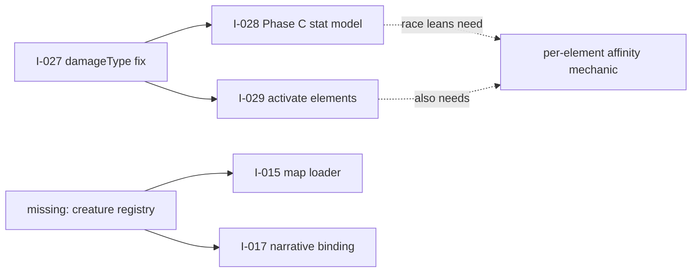

# Backlog overview release 1.5 open

Snapshot note. **31 ideas — 14 open, 17 refined into features.** Of those 17 features,
15 are promoted and 2 (F-002, F-015) are still open. Release **1.5** is open and empty;
last promoted **1.4** (2026-07-27).

<b>14</b>open ideas

<b>17</b>refined to features

<b>2</b>features still open

<b>0</b>features in release 1.5

---

## 1. Open ideas by theme

### Combat / game system — the F-017 cluster

Newest and tightly coupled. **Order matters** (see §4).

| ID | Idea | Why it exists | Size |
|---|---|---|---|
| **I-027** | `damageType` dropped on the BattleManager queue path | Live correctness bug — every magical projectile is defended with `pDef` instead of `mDef`. Pre-existing, not from F-017 | S |
| **I-028** | Phase C runtime spine — race/class field + stat model + leans | Canon promises 8×8 races/classes; nothing stores a class server-side | **XL — oversized** |
| **I-029** | Activate the element system | Built, tested, canon-backed, and **100% inert** — zero non-neutral elements in shipped content | M |

<b>I-028 is not one feature.</b> Second-pass analysis found: <code>dex</code> is a phantom
stat (read by nothing), <code>int</code> drives both mAtk and mDef, <b>4 of 8 canon race
leans have no mechanism at all</b> (no mana, no cast speed, no craft stat, no per-entity
element affinity), skills have no class/element field, and changing
<code>PrimaryStats</code> is a <b>10-site blast radius including a stored-profile
migration</b> (<code>schemaVersion: z.literal(1)</code> under <code>.strict()</code>).
Realistically 2–3 features.

### Runtime binding — deferred halves of already-shipped features

All four were captured 2026-07-21. **All verified still un-built on 2026-07-28.**

| ID | Idea | Parent | Verdict this pass |
|---|---|---|---|
| **I-014** | Character-content binding hardening | F-007 | ⚠️ **Shrinks** — Gate 2 now runs `--require-complete`; CI still warn-only |
| **I-015** | Map runtime loader (phases 2–4) | F-008 | ✅ Needed — **stated blocker evaporated** |
| **I-016** | Godot transient-VFX runtime | F-009 | ✅ Needed, unchanged · Godot-blocked |
| **I-017** | Narrative runtime binding | F-010 | ⚠️ **Re-scope — premise is stale** |
| **I-018** | 2D asset seeding + client icon binding | F-011 | ✅ Needed, unchanged · Godot-blocked |

<b>The pattern is the finding.</b> Five features shipped their authoring/content half and
deferred the runtime half. This is a recurring shape, not five unrelated items — worth one
consolidated runtime-binding push rather than five separate claims.

**Evidence behind the two changed verdicts:**

| Idea | What changed |
|---|---|
| I-014 | `ci.yml` runs `check_content.mjs` **without** `--require-complete` ("warnings until roadmap #1 flips" it), but `scripts/integration.sh:81` — created *after* I-014 — runs it **with** the flag. Risk now caught at promote, not never. Remaining: `src/config/npcs` + `character-bridge.json` + flip CI to hard-fail |
| I-017 | Two disjoint narrative systems now exist: `content/story/*.json` (**152 nodes, 28 quests**, gated, canon) vs `contracts/content/quests.json` (**3 quests**, zero narrative fields, what Nakama actually runs). I-017 predates the 152-node graph. Real question: should the meta catalog be **generated from** the story graph instead of hand-maintained? |

### Content pipeline / gates

| ID | Idea | Why it exists |
|---|---|---|
| **I-030** | Concept-art manifest gate + missing `art:race-human` | 80 keys in `art-manifest.json` gated by **nothing**; LFS payloads unverified; race lineup is 7, not 8 |
| **I-031** | Commit the concept-art generation pipeline | The scratchpad holding it is **already gone**; decays further every session |

### Story / lore

| ID | Idea |
|---|---|
| **I-024** | Undertow villain spotlight beats (Bell-Keeper, Iron Regent, Ash Prophet) |
| **I-025** | Brotherhood Caravan retcon — backport novel v3 framing into game canon |

### Cross-cutting

| ID | Idea | Note |
|---|---|---|
| **I-002** | Security hardening — server-authority, transport, anti-abuse | **Oldest open idea (2026-07-10, 18 days).** Only security item; surface area has grown since |
| **I-012** | SFX taxonomy + server-authoritative combat-event→SFX broadcast | |

---

## 2. Refined into features

| Idea | Feature | Status | Subject |
|---|---|---|---|
| I-001 | F-001 | promoted | Player meta-systems (Nakama) |
| I-003 | **F-002** | **open** | Asset build pipeline + storybook + CC0 seed |
| I-004 | F-003 | promoted | asset-forge: Blender→game mobs |
| I-005 | F-004 | promoted | storybook performance |
| I-006 | F-005 | promoted | Content authoring pipeline |
| I-007 | F-006 | promoted | Registry reconciliation + binding spine |
| I-009 | F-007 | promoted | Character/mob roster depth |
| I-008 | F-008 | promoted | Map authoring + runtime loader |
| I-011 | F-009 | promoted | Transient VFX runtime |
| I-013 | F-010 | promoted | Narrative pipeline |
| I-010 | F-011 | promoted | 2D asset forge + icon seeding |
| I-020 | F-012 | promoted | Epic story pipeline (graph + gate + viz) |
| I-019 | F-013 | promoted | Generated `mob-types.json`, WARN→hard-fail |
| I-021 | F-014 | promoted | Narrative System v2 |
| I-022 | **F-015** | **open** | CI: scripts test-suite step |
| I-023 | F-016 | promoted | The Undertow — 5-act epic |
| I-026 | F-017 | promoted | World Wisdom — elements, schools, 8×8 |

---

## 3. What blocks what

| Blocker | Ideas held | Nature |
|---|---|---|
| **Local Godot .NET binary** | I-016, I-018, part of I-017 | Environmental — these age regardless of priority |
| **Owner stat decision** | I-028 (→ I-029 leans) | Design — `dex` vs `int`, mana, per-element affinity |
| **Stored-profile migration** | I-028 | Data — `z.literal(1)` + `.strict()` rejects any shape change |
| **Two narrative sources** | I-017 | Architectural — must decide generate-vs-author first |
| **What F-008 actually shipped** | I-015 | Unknown — `content/maps/` holds one `.md` and no spec files |

---

## 4. Suggested sequencing

1. **I-027 first.** Elements multiply *after* defense, so the `pDef`/`mDef` error is
   compounded by the first elemental weapon. Cheap, and it de-risks both successors.
2. **Design per-element affinity once.** I-028 (Demon/Immortal/Dragon leans) and I-029
   (element content) both need it. Building it twice is the failure mode.
3. **Split I-028 before claiming it.** Stat-model decision + migration is one feature;
   race/class field is another; skills gaining class/element is a third.
4. **Re-scope I-017 before claiming it** — the generate-vs-author question changes the work.

---

## 5. Gap not yet captured as an idea

<b>There is no creature registry.</b> <code>colyseus-server/generated/mob-types.json</code>
contains <code>["aggressive","balanced","defensive","double_attacker","hybrid","spear_thrower"]</code>
— <b>behavior archetypes, not creatures</b>. So <code>q_boar_5</code>'s
<code>targetId: "boar"</code> resolves to nothing, and neither maps nor quests have any
id-space to reference actual creatures.
  
This one gap touches <b>I-015</b> (map <code>mobSpawnAreas[].mobType</code>),
<b>I-017</b> (quest targets), and <b>F-013</b>'s gate — which now hard-fails against a
list of archetypes rather than creatures.

---

## 6. Provenance

Derived from two hand-off documents plus direct verification against the tree
(2026-07-28):

- `docs/superpowers/decisions/2026-07-27-world-wisdom-handoff.md` — current
- `HANDOFF-2026-07-28.md` — **largely superseded**; its header says "release/1.4, last
  promoted 1.3" and its top two next-moves (promote 1.4, refine I-026) are both done

Every "still needed / already built" verdict in §1 was checked by grep against the
working tree, not inferred from the hand-offs.
