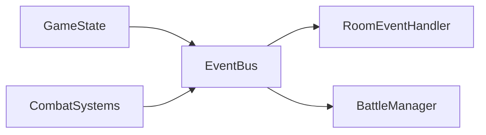

# Event flow

Room-scoped events drive physics setup, teardown, and battle persistence. All events are emitted and consumed per `roomId`.

## EventBus

- **Source:** `colyseus-server/src/events/EventBus.ts`
- Singleton. `emitRoomEvent(roomId, eventType, data)` publishes; typed helpers `onRoomEventPlayerJoin(roomId, cb)`, `onRoomEventMobSpawn(roomId, cb)`, etc. subscribe per event type.
- Internal key: `room-${roomId}:entity-event`; payload includes `eventType`, `roomId`, `data`, `timestamp`.

## RoomEventType

| Event | Purpose |
|-------|---------|
| PLAYER_JOINED | Player added to room |
| PLAYER_LEFT | Player removed |
| MOB_SPAWNED | Mob created and registered |
| MOB_REMOVED | Mob removed from room |
| NPC_SPAWNED | Companion created for player |
| NPC_REMOVED | Companion removed |
| BATTLE_ATTACK | Attack committed (actor, target, damage, range) |
| BATTLE_HEAL | Heal committed |
| BATTLE_DAMAGE_PRODUCED | Damage/impulse applied (attacker, taker) |

## Emitters

- **GameState:** PLAYER_JOINED, PLAYER_LEFT (addPlayer / removePlayer); MOB_SPAWNED, MOB_REMOVED (reInitializeMobs / lifecycle); NPC_SPAWNED, NPC_REMOVED (addPlayer / removePlayer).
- **MobCombatSystem / PlayerCombatSystem / NPCCombatSystem:** BATTLE_ATTACK when an attack is committed.
- **Damage path** (e.g. projectile or melee hit): BATTLE_DAMAGE_PRODUCED when damage and optional impulse are applied.

RoomEventHandler does not emit; it only subscribes.

## Subscribers

- **RoomEventHandler:** PLAYER_JOINED → create player physics body; PLAYER_LEFT → remove body; MOB_SPAWNED → create mob body; MOB_REMOVED → remove body; NPC_SPAWNED → create NPC body + attach melee strategy; NPC_REMOVED → remove body.
- **BattleManager:** BATTLE_ATTACK, BATTLE_HEAL (e.g. persistence, UI messages).

## Flow (high level)

Next: [spawn.spec.md](./spawn.spec.md).
