# Story Graph

Generated by `scripts/gen_story_graph.mjs` — do not hand-edit. Regenerate with
`node scripts/gen_story_graph.mjs --write`; CI runs
`node scripts/gen_story_graph.mjs --check` right after the content gate and
fails the build if this file is stale.

Nodes are colored by kind (act / region / faction / character / arc /
quest / event / dialogue / lore). Acts are rendered as subgraphs
containing their arcs (arc.actId) and those arcs' quests (quest.arcId);
every other node renders in the shared (act-less) lane. Edges are
labeled by the source field: quest.giver / arcId / unlockedBy / faction /
region, arc.questIds / actId, character.faction / region / diedAt,
event.involves / triggeredBy / unlockedBy, dialogue.speaker / context /
unlockedBy, faction.relationships, lore.anchor.

```mermaid
flowchart LR
  classDef act fill:#343A40,color:#fff,stroke:#212529,stroke-width:1px
  classDef region fill:#4C6EF5,color:#fff,stroke:#364FC7,stroke-width:1px
  classDef faction fill:#F76707,color:#fff,stroke:#D9480F,stroke-width:1px
  classDef character fill:#12B886,color:#fff,stroke:#087F5B,stroke-width:1px
  classDef arc fill:#BE4BDB,color:#fff,stroke:#862E9C,stroke-width:1px
  classDef quest fill:#FAB005,color:#000,stroke:#E67700,stroke-width:1px
  classDef event fill:#FA5252,color:#fff,stroke:#C92A2A,stroke-width:1px
  classDef dialogue fill:#868E96,color:#fff,stroke:#495057,stroke-width:1px
  classDef lore fill:#66D9E8,color:#000,stroke:#0B7285,stroke-width:1px

  subgraph sg_n_act_1["Act 1 — Small Lives"]
    n_act_1["act-1"]:::act
    n_arc_meadow_awakening["arc-meadow-awakening"]:::arc
    n_quest_cull_the_packs["quest-cull-the-packs"]:::quest
    n_quest_first_steps["quest-first-steps"]:::quest
    n_quest_the_twin_strike["quest-the-twin-strike"]:::quest
  end
  subgraph sg_n_act_2["Act 2 — The War Comes Home"]
    n_act_2["act-2"]:::act
    n_arc_icefield_reckoning["arc-icefield-reckoning"]:::arc
    n_quest_icefield_reckoning["quest-icefield-reckoning"]:::quest
  end
  subgraph sg_n_act_3["Act 3 — The Ledger Game"]
    n_act_3["act-3"]:::act
  end
  subgraph sg_n_act_4["Act 4 — The Truth Arrives Late"]
    n_act_4["act-4"]:::act
  end
  subgraph sg_n_act_5["Act 5 — The Undertow"]
    n_act_5["act-5"]:::act
  end
  n_char_ashfang_alpha["char-ashfang-alpha"]:::character
  n_char_clerk_of_gildmark["char-clerk-of-gildmark"]:::character
  n_char_elder_of_rooktide["char-elder-of-rooktide"]:::character
  n_char_expedition_member["char-expedition-member"]:::character
  n_char_farrow_the_forward["char-farrow-the-forward"]:::character
  n_char_iron_regent["char-iron-regent"]:::character
  n_char_joren_of_norhollow["char-joren-of-norhollow"]:::character
  n_char_liss_of_embervale["char-liss-of-embervale"]:::character
  n_char_mirelle["char-mirelle"]:::character
  n_char_quartermaster["char-quartermaster"]:::character
  n_char_speaker_of_norhollow["char-speaker-of-norhollow"]:::character
  n_char_the_ash_prophet["char-the-ash-prophet"]:::character
  n_char_the_bell_keeper["char-the-bell-keeper"]:::character
  n_char_the_broker["char-the-broker"]:::character
  n_char_thornveil_war_speaker["char-thornveil-war-speaker"]:::character
  n_char_war_countess["char-war-countess"]:::character
  n_char_warden_bright["char-warden-bright"]:::character
  n_char_widow_of_the_first_caravan["char-widow-of-the-first-caravan"]:::character
  n_dlg_expedition_member_twin_strike_aftermath["dlg-expedition-member-twin-strike-aftermath"]:::dialogue
  n_dlg_quartermaster_icefield_briefing["dlg-quartermaster-icefield-briefing"]:::dialogue
  n_event_icefield_thornveil_standoff["event-icefield-thornveil-standoff"]:::event
  n_event_twin_strike_falls["event-twin-strike-falls"]:::event
  n_faction_ashen_column["faction-ashen-column"]:::faction
  n_faction_ashfang["faction-ashfang"]:::faction
  n_faction_bellfaith["faction-bellfaith"]:::faction
  n_faction_embervale_banner["faction-embervale-banner"]:::faction
  n_faction_expedition["faction-expedition"]:::faction
  n_faction_gildmark_council["faction-gildmark-council"]:::faction
  n_faction_norhollow_banner["faction-norhollow-banner"]:::faction
  n_faction_stoneguard["faction-stoneguard"]:::faction
  n_faction_thornveil["faction-thornveil"]:::faction
  n_faction_unaligned["faction-unaligned"]:::faction
  n_lore_first_claim_stone["lore-first-claim-stone"]:::lore
  n_lore_guarded_nothing["lore-guarded-nothing"]:::lore
  n_region_ashvale_front["region-ashvale-front"]:::region
  n_region_cindervast["region-cindervast"]:::region
  n_region_embervale["region-embervale"]:::region
  n_region_gildmark["region-gildmark"]:::region
  n_region_icefield["region-icefield"]:::region
  n_region_millcross["region-millcross"]:::region
  n_region_norhollow["region-norhollow"]:::region
  n_region_rooktide["region-rooktide"]:::region
  n_region_spawn_meadow["region-spawn-meadow"]:::region
  n_region_thornveil["region-thornveil"]:::region

  n_arc_icefield_reckoning -->|actId| n_act_2
  n_arc_icefield_reckoning -->|questIds| n_quest_icefield_reckoning
  n_arc_meadow_awakening -->|actId| n_act_1
  n_arc_meadow_awakening -->|questIds| n_quest_cull_the_packs
  n_arc_meadow_awakening -->|questIds| n_quest_first_steps
  n_arc_meadow_awakening -->|questIds| n_quest_the_twin_strike
  n_char_ashfang_alpha -->|diedAt| n_event_twin_strike_falls
  n_char_ashfang_alpha -->|faction| n_faction_unaligned
  n_char_ashfang_alpha -->|region| n_region_spawn_meadow
  n_char_clerk_of_gildmark -->|faction| n_faction_gildmark_council
  n_char_clerk_of_gildmark -->|region| n_region_gildmark
  n_char_elder_of_rooktide -->|region| n_region_rooktide
  n_char_expedition_member -->|faction| n_faction_expedition
  n_char_expedition_member -->|region| n_region_spawn_meadow
  n_char_farrow_the_forward -->|faction| n_faction_expedition
  n_char_farrow_the_forward -->|region| n_region_millcross
  n_char_iron_regent -->|faction| n_faction_embervale_banner
  n_char_iron_regent -->|region| n_region_embervale
  n_char_joren_of_norhollow -->|region| n_region_norhollow
  n_char_liss_of_embervale -->|region| n_region_embervale
  n_char_mirelle -->|region| n_region_gildmark
  n_char_quartermaster -->|faction| n_faction_expedition
  n_char_quartermaster -->|region| n_region_spawn_meadow
  n_char_speaker_of_norhollow -->|faction| n_faction_norhollow_banner
  n_char_speaker_of_norhollow -->|region| n_region_norhollow
  n_char_the_ash_prophet -->|faction| n_faction_ashen_column
  n_char_the_ash_prophet -->|region| n_region_cindervast
  n_char_the_bell_keeper -->|faction| n_faction_bellfaith
  n_char_the_bell_keeper -->|region| n_region_gildmark
  n_char_the_broker -->|faction| n_faction_gildmark_council
  n_char_the_broker -->|region| n_region_gildmark
  n_char_thornveil_war_speaker -->|faction| n_faction_thornveil
  n_char_thornveil_war_speaker -->|region| n_region_thornveil
  n_char_war_countess -->|faction| n_faction_embervale_banner
  n_char_war_countess -->|region| n_region_embervale
  n_char_warden_bright -->|faction| n_faction_bellfaith
  n_char_warden_bright -->|region| n_region_gildmark
  n_char_widow_of_the_first_caravan -->|faction| n_faction_embervale_banner
  n_char_widow_of_the_first_caravan -->|region| n_region_embervale
  n_dlg_expedition_member_twin_strike_aftermath -->|context| n_event_twin_strike_falls
  n_dlg_expedition_member_twin_strike_aftermath -->|speaker| n_char_expedition_member
  n_dlg_quartermaster_icefield_briefing -->|context| n_quest_icefield_reckoning
  n_dlg_quartermaster_icefield_briefing -->|speaker| n_char_quartermaster
  n_event_icefield_thornveil_standoff -->|involves| n_faction_stoneguard
  n_event_icefield_thornveil_standoff -->|involves| n_faction_thornveil
  n_event_icefield_thornveil_standoff -->|involves| n_region_icefield
  n_event_icefield_thornveil_standoff -->|triggeredBy| n_quest_icefield_reckoning
  n_event_twin_strike_falls -->|involves| n_char_ashfang_alpha
  n_event_twin_strike_falls -->|involves| n_char_expedition_member
  n_event_twin_strike_falls -->|involves| n_region_spawn_meadow
  n_event_twin_strike_falls -->|triggeredBy| n_quest_the_twin_strike
  n_faction_ashen_column -->|relationships| n_faction_embervale_banner
  n_faction_ashen_column -->|relationships| n_faction_gildmark_council
  n_faction_ashen_column -->|relationships| n_faction_norhollow_banner
  n_faction_ashfang -->|relationships| n_faction_unaligned
  n_faction_bellfaith -->|relationships| n_faction_gildmark_council
  n_faction_embervale_banner -->|relationships| n_faction_gildmark_council
  n_faction_embervale_banner -->|relationships| n_faction_norhollow_banner
  n_faction_expedition -->|relationships| n_faction_ashfang
  n_faction_norhollow_banner -->|relationships| n_faction_embervale_banner
  n_faction_norhollow_banner -->|relationships| n_faction_gildmark_council
  n_faction_unaligned -->|relationships| n_faction_ashfang
  n_lore_first_claim_stone -->|anchor| n_region_icefield
  n_lore_guarded_nothing -->|anchor| n_faction_stoneguard
  n_quest_cull_the_packs -->|arcId| n_arc_meadow_awakening
  n_quest_cull_the_packs -->|faction| n_faction_ashfang
  n_quest_cull_the_packs -->|giver| n_char_quartermaster
  n_quest_cull_the_packs -->|region| n_region_spawn_meadow
  n_quest_cull_the_packs -->|unlockedBy| n_quest_first_steps
  n_quest_first_steps -->|arcId| n_arc_meadow_awakening
  n_quest_first_steps -->|faction| n_faction_unaligned
  n_quest_first_steps -->|giver| n_char_quartermaster
  n_quest_first_steps -->|region| n_region_spawn_meadow
  n_quest_icefield_reckoning -->|arcId| n_arc_icefield_reckoning
  n_quest_icefield_reckoning -->|faction| n_faction_stoneguard
  n_quest_icefield_reckoning -->|giver| n_char_quartermaster
  n_quest_icefield_reckoning -->|region| n_region_icefield
  n_quest_icefield_reckoning -->|unlockedBy| n_quest_the_twin_strike
  n_quest_the_twin_strike -->|arcId| n_arc_meadow_awakening
  n_quest_the_twin_strike -->|faction| n_faction_unaligned
  n_quest_the_twin_strike -->|giver| n_char_quartermaster
  n_quest_the_twin_strike -->|region| n_region_spawn_meadow
  n_quest_the_twin_strike -->|unlockedBy| n_quest_cull_the_packs
```

