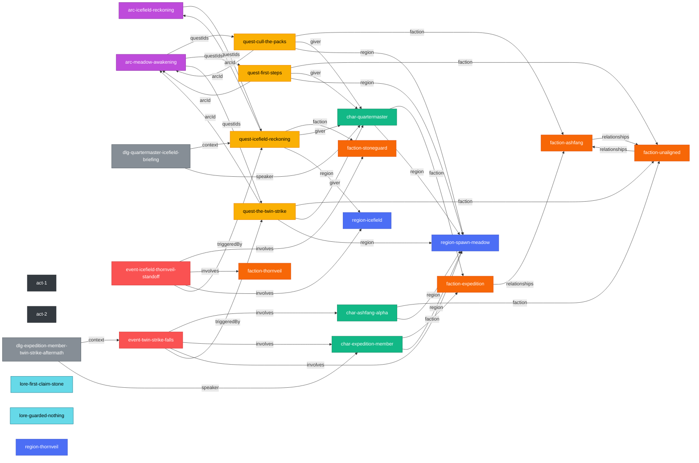

# Story Graph

Generated by `scripts/gen_story_graph.mjs` — do not hand-edit. Regenerate with
`node scripts/gen_story_graph.mjs --write`; CI runs
`node scripts/gen_story_graph.mjs --check` right after the content gate and
fails the build if this file is stale.

Nodes are colored by kind (region / faction / character / arc / quest /
event / dialogue). Edges are labeled by the source field: quest.giver /
arcId / prereq / faction / region, arc.questIds, character.faction /
region, event.involves / triggeredBy, dialogue.speaker / context,
faction.relationships.

