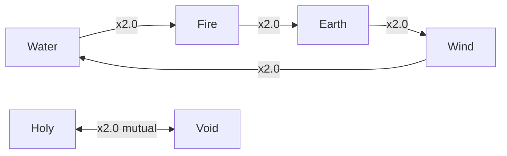

# Hand-off <span class="topic-chip">F-017</span> <span class="topic-chip">release 1.4 → main</span>

One session took **I-026 from three unanswered questions to a promoted feature on `main`**:
idea → brainstorm → approved spec → refine (F-017) → plan → claim → 6 tasks → ship →
Gate 2 → PR → merge → cleanup → release 1.5 opened.

<div class="metric-grid">
<div class="metric-tile"><b>542</b><span>server tests passing</span></div>
<div class="metric-tile"><b>152</b><span>story nodes, 0 warnings</span></div>
<div class="metric-tile"><b>221</b><span>files in the release PR</span></div>
<div class="metric-tile"><b>8/8</b><span>Gate 2 sections pass</span></div>
</div>

---

## 1. Where everything is now

| Thing | Location |
|---|---|
| Approved spec | `docs/superpowers/specs/2026-07-27-world-wisdom-design.md` (on `main`) |
| Implementation plan | `docs/superpowers/plans/2026-07-27-world-wisdom.md` |
| Release PR | [#6](https://github.com/montionugera/atlas-world-svc/pull/6) — squash `dd4fbb6`, finalize `06cc972` |
| Current release | **1.5 in progress**; last promoted **1.4** (2026-07-27) |
| Backlog | 15 features promoted, 2 open (F-002, F-015); 27 ideas (10 unpromoted) |

<div class="callout success">
<b>Everything is on <code>main</code> now.</b> Earlier in the session these files existed only
in the <code>_release</code> worktree, which is why opening them from the primary checkout
silently did nothing. That is resolved — <code>content/story/canon.md</code>,
<code>scripts/integration.sh</code> and the spec are all in the main checkout.
</div>

---

## 2. Owner decisions — locked, do not re-litigate

These came from direct owner answers during the brainstorm. They are canon.

1. **Magic is widespread**, not lost or rare.
2. **No fuel scarcity** — cast from personal mana *or* magic stones; stones are cheap,
   common, mined in many towns.
3. **Antimagic Runes are the real limit.** Standard war gear is rune-warded; ordinary
   combat magic fails against it; only rare **High-Tier** casters break wards. The
   bottleneck is *mastery*, not money. **This is why the war is fought with steel.**
4. **Rune-craft is public** — every town wards its own. Nobody monopolizes defense.
5. **Elements: pure RO-style table.** Genshin-style reaction system **cut, not deferred**.
6. **Six elements.** Holy was added mid-session as the opposed pair to Void, superseding
   the original five-element list. The earlier "Void beats Void like RO's Ghost" rule was
   replaced by Holy-as-counter, with owner approval.
7. **Advantage is ×2.0** — owner explicitly wanted element use *encouraged*.
8. **Void is not tied to Cindervast.** Cindervast's fall keeps its own cause.
9. **Void has no official school** — learned outside the system.
10. **Race × class is free** across all 64 combinations, with small per-race stat leans.
    The leans are **canon-of-intent only** — nothing was built (see §5).

### The element table



Cycle advantage ×2.0 (one direction only) · reverse-of-cycle and same-element ×0.5 ·
Holy↔Void ×2.0 **both** directions · anything involving Neutral ×1.0.

<div class="callout info">
<b>Neutral is the safe baseline</b> — ×1.0 always. Elements are high-risk/high-reward:
know the target and get ×2.0, guess wrong and get ×0.5. That asymmetry is the whole
incentive to learn monster elements.
</div>

---

## 3. What the code actually does

<div class="schematic">
weapon.element ─┐
                ├─→ Projectile.element ─→ ProjectileCollisionResolver ─┐
attack.element ─┘                                                      │
                                                                       ▼
                                          DamageCalculator.calculate({ ... })
                                                                       │
                       afterDefense = max(1, base − min(totalDef, base×0.8))
                       final        = max(1, floor(afterDefense × multiplier))
                                                                       ▲
                                          WorldLife.element ───────────┘
</div>

- `src/config/combat/elements.ts` — `Element` type, the 7×7 table,
  `getElementMultiplier()`, `isElement()`. Pure; no schema/module imports.
- `WorldLife.element` — synced `@type('string')`, defaults `neutral`, **validated with
  `isElement` at construction** (a bad id would otherwise produce `NaN` damage replicated
  to clients).
- Optional `element` on `WeaponConfig` and `AttackDefinition`. **No shipped content carries
  a non-neutral element**, so every pre-existing damage number is unchanged.
- `DamageCalculator.calculate` and `BattleManager.createAttackMessage` were converted to
  **single options objects** — the repo's single-path-API invariant.
- **Order matters:** the element multiplies *after* defense reduction, so an advantage
  exactly doubles the number the player sees.

<div class="callout warn">
<b>The plan got one thing wrong — worth internalising.</b> It assumed the three combat
systems call <code>createAttackMessage</code>. They don't — they emit
<code>BATTLE_ATTACK</code>, and real damage reaches the formula through
<b>projectiles</b>. The element had to be stamped on <code>Projectile</code> at four
creation sites instead. <mark>Trace the runtime path, not the filename.</mark>
</div>

### Damage paths that carry no element (intentional, documented in code)

Zone effects · DOT ticks · `processDamageAction` (dormant, no producer) · the
strategy-less `BATTLE_ATTACK` fallback · **all NPC attacks** (NPCs get a bare
`MeleeAttackStrategy` with no `AttackDefinition`).

`Player` and `NPC` never seed an element — only `Mob` does. **Element-effect tests must
use `Mob` targets.**

---

## 4. Lore side

- `content/story/style.md` **§6 rewritten** — was *"magic is a scarce, contested resource
  — oil, not miracle"*, now opens on widespread-but-warded magic. The **iron rule survives
  verbatim** (no spell resolves a political knot, cures grief or trauma, or raises the
  dead) plus a new clause: *a world full of casters is still a world where nobody can cast
  the war away*. New rule added: **elements are texture, not a physics lecture** — prose
  may name an element, never a multiplier.
- `content/story/canon.md` **new §5** "Magic, schools, and the elements" — magic model,
  the elements in words with zero numbers, the school/town table, the rosters, and an
  explicit *"not in game state yet"* subsection.
- **4 new lore fragments** on thread `the-warded-world`, anchored to real nodes
  (`region-gildmark`, `faction-bellfaith`, `region-embervale`, `region-ashvale-front`).

<div class="callout danger">
<b>The trap that nearly shipped a contradiction.</b> The first spec claimed "zero backport
needed" after grepping only <code>canon.md</code> and the novel. <code>style.md</code> §6
directly contradicted the new magic model — and that file is the voice-law every authoring
pass must read. <b>When changing world rules, grep <code>style.md</code> and
<code>README.md</code>, not just canon.</b>
</div>

---

## 5. Explicitly NOT built

- No elemental reaction system.
- No skill trees, no per-class skill numbers.
- **No player class/race field and no stat leans.** Nothing stores a class server-side;
  the sim's `BaseStat` is `{agi,str,vit,dex}` while Nakama's `PrimaryStats` is
  `{str,agi,int,vit}` — they disagree, and picking a side is its own decision. Phase C.
- No mana/MP resource (decision #2 makes fuel a non-limit).

---

## 6. Gate 2 did not exist before this session

<div class="callout danger">
<code>scripts/integration.sh</code> was <b>missing from the entire repo history</b> —
meaning <b>releases 1.1, 1.2 and 1.3 all reached <code>main</code> with Gate 2 never
run</b>. The promote script offers <code>--allow-missing-gate2</code> to sail past it;
that was declined.
</div>

A real one now exists (`c08b44f`), modelled on the existing `scripts/test_all.sh` house
style. It is **self-provisioning** because a fresh `_release` worktree has no
`node_modules`, and it runs eight sections: deps → server tsc build → jest → prettier →
content gate `--require-complete` → story-graph drift → content-gate suite →
story-explorer smoke. Verified by a real run: **8/8 PASS, exit 0**.

---

## 7. Environment gotchas that cost time

<div class="callout idea">
<ol>
<li><b><code>npm install</code> fails in this repo</b> — <code>EUNSUPPORTEDPROTOCOL:
workspace:*</code>. It is a <b>pnpm</b> workspace: <code>pnpm install</code> at the root.
<code>scripts/</code> is <i>outside</i> the workspace and uses <code>npm ci</code>.</li>
<li><b>Build <code>contracts/</code> first</b> or <code>colyseus-server</code>'s tsc emits
10 phantom <code>TS2307</code> errors.</li>
<li><b>Feature worktrees are cut from <code>main</code></b>, which lagged badly — it had
only the old <code>content/story/{bible.md,story.json}</code>. <code>git merge
release/&lt;v&gt;</code> into the feature branch was required before any story work. (Less
of an issue now that 1.4 is on main, but the pattern recurs every release.)</li>
<li><b>Piping to <code>tail</code> masks exit codes.</b> A failed <code>npm install</code>
reported success because <code>tail</code>'s status was read instead. Capture to a file
and check <code>$?</code>.</li>
<li><b><code>new_idea.py --help</code> creates an idea titled "--help".</b> Check argument
handling before running unfamiliar toolkit scripts.</li>
</ol>
</div>

---

## 8. Correction to carry forward

<div class="callout warn">
The promote skill states <i>"the merge to main triggers the prod (Vultr) deploy."</i>
<b>That is not true in this repo.</b> <code>origin/main</code> has only
<code>.github/workflows/{ci.yml,contracts.yml}</code>; ci.yml runs on push-to-main and PRs,
contracts.yml on PRs only. <b>There is no deploy workflow at all.</b> The only deploy in
the whole flow is the <b>local k8s</b> one that <code>ship</code> runs via
<code>scripts/deploy-local.sh</code>. Nothing reached production. Verify
<code>.github/workflows/</code> before telling anyone a merge ships.
</div>

---

## 9. Open follow-ups

<div class="callout action">
<b>I-027 — <code>damageType</code> dropped on the queue path.</b> <i>(captured, top
candidate for 1.5)</i><br>
<code>BattleManager.createAttackMessage</code> has no <code>damageType</code> option, so
<code>processAttack</code> falls back to <code>'physical'</code> and <b>every magical
projectile is defended with <code>pDef</code> instead of <code>mDef</code></b>.
Pre-existing, not from F-017 — deliberately left out to preserve the "no shipped number
changes" guarantee. It matters now because elements multiply <i>after</i> defense, so the
first elemental magic weapon compounds the error. <code>Projectile.damageType</code>
already carries the right value; it is simply not forwarded.
</div>

**Not captured as ideas, flagged only:**

- **`art:race-human` is missing** — the race lineup is 7, not 8, though `human` heads the
  class grid and all 8 human class images exist. Also **no gate covers
  `game-client/assets/art/art-manifest.json`**, so its 71 keys are unverified against
  files on disk.
- **`docs/superpowers/specs/2026-07-23-grand-epic-undertow-design.md:33,92`** still says
  playable races are out of scope, with no supersession note. Both *binding* law documents
  are now correct, so this is a stale snapshot only.

---

## 10. Picking up next

```bash
python3 ~/.claude/ps-release-workflow/scripts/status.py    # where things stand
```

Release **1.5** is open and empty. Reasonable next moves, in rough priority order:

1. **Refine I-027** and fix the `damageType` hole — it is a live correctness bug and the
   element system makes it worse.
2. **Phase C** (runtime spine): the class/race field, which unblocks the stat leans this
   spec deliberately left as canon-of-intent.
3. **Give some content a non-neutral element.** Nothing in the game uses the element
   system yet — it is fully built and entirely inert. War-scar monsters as Void-line is
   the canon-supported starting point.
