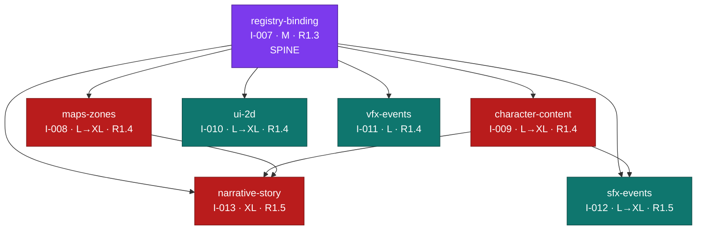

# atlas-world-svc — Master Gap-Closing Roadmap

**Release architect synthesis of 7 reviewed lanes · dependency-corrected · 2026-07-19**

Current line: **1.3 in progress**. Backlog: ps-release-workflow (highest existing I-006 → new ideas start at **I-007**).

---

## Executive summary

Seven content→runtime gaps, but **one foundation plus two dependent waves** — not seven parallel efforts. After applying the reviewers' corrected `revisedDependsOn` (which supersedes the planners' originals), every lane collapses onto a single root: **registry-binding**. That lane reconciles the stale F-002 catalog and hardens the shipped registry into ONE documented, CI-verified spine (asset-key codegen ↔ render-spec taxonomy ↔ four manifests ↔ content gate ↔ Godot AssetRegistry) plus a formal **event→asset-key binding contract**. Nothing safely builds until that contract lands.

The reviewers also fixed a would-be **cycle**: the character-content planner had it depending on narrative-story, but the review flips it — **character-content → registry-binding**, and **narrative-story → character-content** (+ maps-zones). That makes the graph a clean DAG.

> Honest tradeoff: registry-binding is a single point of gating, and Release 1.4 fans out four lanes (several trending L→XL) in parallel. Do not pretend everything ships at once — the spine is a hard serialization point, and 1.4 is the schedule's stress test.

---

## Corrected dependency graph

**Critical path (gates the whole program):** `registry-binding → character-content → narrative-story`. Co-critical: `registry-binding → maps-zones → narrative-story` — narrative-story needs BOTH maps-zones and character-content, so its start is `max(maps-zones, character-content)`. character-content is the higher-leverage node (it also gates sfx-events), so **staff it first** in 1.4.

---

## Sequenced release slices

| Slice | Lanes | Parallelism | Why here |
|---|---|---|---|
| **1.3** (in progress) | `registry-binding` (I-007) | Solo | DAG root. Delivers the contract doc, render-spec taxonomy fixes, event→asset-key contract, CI Godot probes, additive content-gate. Also reconciles F-002. Everything binds against it. |
| **1.4** | `maps-zones` (I-008), `character-content` (I-009), `ui-2d` (I-010), `vfx-events` (I-011) | 4-way parallel | Only dependency is registry-binding. **Prioritize maps-zones + character-content** (both gate 1.5). ui-2d + vfx-events are leaves — absorb slack. Split into 1.4a/1.4b if capacity-limited. |
| **1.5** | `sfx-events` (I-012), `narrative-story` (I-013) | 2-way parallel | Terminal consumers. sfx needs character-content's surface materials; narrative needs maps-zones' zoneIds + character-content's NPC ids. narrative-story is XL and last. |

---

## What the spine (I-007) must deliver — build once, first

1. **F-002 reconciliation** — fill the empty spec.md with delivered architecture + task→commit→release provenance; route the retro-promote-vs-rescope decision through the `_release` worktree (never hand-edit `_catalog.json`).
2. **The contract doc** `asset-registry-contract.md` — the single index every lane reads.
3. **Render-spec taxonomy, hole-free** — `prop→model3d` default; **do NOT** default `vfx→model3d` (require explicit render so vfx-events keeps spritesheet/particle renderers); document + enforce the audio ext-resolution policy; completeness test. Re-run the Godot RegistryVerify/ManifestVerify probes on *every* render-spec edit (it is mirrored in the .mjs gate, `AssetRegistry.cs` runtime, and storybook JS).
4. **Event→asset-key binding contract** — `Mob.mobTypeId→mob:<id>`, `Projectile.type→projectile:<Type>`, `ZoneEffect.type→zone:<type>`, `Player→player`, `NPC→npc`; keys derive from synced schema ONLY. Jest round-trip test that **imports** gen-asset-keys enumerators (one source). This is the surface sfx/vfx extend.
5. **CI Godot verify probes** — pin Godot version, `--headless --import`, run ATLAS_VERIFY_MANIFEST/REGISTRY/ENTITYVIEW with surfaced exit codes.
6. **Additive content-gate link-check + extension recipe** + decide the mob-type-id source the map/narrative gates need.

---

## Per-domain summary

**registry-binding (I-007, M, R1.3, deps: none).** The foundational spine. Reconciles F-002, writes the one contract doc, closes render-spec taxonomy holes, formalizes the event→asset-key contract, and wires the Godot verify probes into CI. Lowest blast radius (docs/tests/taxonomy/CI; no @colyseus/schema or sim-loop changes). **Blocks all six other lanes.**

**maps-zones (I-008, L→XL, R1.4, deps: registry-binding).** Real map spec schema + 3 authored bible regions + content-gate map branch + server MapLoader with byte-identical legacy fallback + static zone hazards via ZoneEffectManager. Critical-path (gates narrative-story). Blockers to resolve: **content packaging into the server runtime** (Docker COPY + config base-dir + dist smoke test; js-yaml/ajv become prod deps), the **synced-schema-vs-REST** decision for static region geometry, and minimizing the GameState/MobLifeCycleManager constructor retrofit (~55 test files).

**character-content (I-009, L→XL, R1.4, deps: registry-binding — NOT narrative-story).** Authors the 5 owed sheets + the NPC config home + the sheet↔asset-key↔server-config triple-validation bridge. Highest-leverage 1.4 lane — gates BOTH sfx-events (surface materials) and narrative-story (NPC ids). Honors the v1 boundary (numbers stay server-side; sheet carries a validated reference only) — get R1 sign-off.

**ui-2d (I-010, L→XL, R1.4, deps: registry-binding).** 2D asset forge (transactional intake) + icon/tileset/ninepatch seeding + meta-UI icon binding. Leaf lane (nothing depends on it). Real dependency footprint is the Godot toolchain (import + build + theme bake) — front-load that risk. Correctly touches no server schema.

**vfx-events (I-011, L, R1.4, deps: registry-binding).** Transient one-shot VFX runtime bound to the three already-synced client combat edges (hit/death/attack) — no new network traffic, no schema growth. Leaf lane. Corrections: leave the attack edge VFX-unbound (no cast signal exists), and fix the grid-divisibility check to modulo + `count<=cols*rows`.

**sfx-events (I-012, L→XL, R1.5, deps: registry-binding, character-content).** SFX taxonomy over 31 baked clips + a server-authoritative discrete `room.broadcast('sfx')` channel + drift-proof binding. Can start early against the flesh-default, but material fidelity needs character-content. Blockers: the driftGated-flip conflicts with gate guard (A) (coordinate a registry-binding gate-code change), the 31 irregular keys resist a generated matrix, and the C# key-constants bridge must be built. Correctly uses a side-channel (no @colyseus/schema change).

**narrative-story (I-013, XL, R1.5, deps: registry-binding, maps-zones, character-content).** Formal story schema + machine-readable catalog + quest narrative fields + live ZONE_ENTERED emitter + prereq accept-gating. Terminal lane. Keep the Nakama-owns-STATE / Colyseus-reports-EVENTS split; reduce giver-gating to prereq-only (giver enforcement needs the deferred in-world NPC trigger); ZONE_ENTERED is scaffolding-only until maps-zones supplies real zoneIds.

---

## Consolidated risks & open questions

- **F-002 (R1, decide in 1.3):** retro-promote vs rescope-into-I-007; route through `_release` worktree.
- **GameState replication (decide before maps-zones Phase 3):** static map geometry over REST `/api` vs synced @type + new `MapRegion.cs` codegen class. Other lanes correctly avoid schema growth — preserve that.
- **Nakama-vs-Colyseus (narrative-story):** keep STATE/EVENT split; prereq-only accept-gating now; ZONE_ENTERED scaffolding-only without maps-zones.
- **Server content packaging (maps-zones):** dist/Docker copy + config base-dir + js-yaml/ajv as prod deps.
- **Godot-in-CI (open):** confirm binary availability; else commit `.import` artifacts + downgrade probes to local-only.
- **Single point of gating:** freeze the CatalogLoader interface early so ui-2d's fallback conforms.
- **sfx driftGated flip:** coordinate a registry-binding gate-code change before flipping; reconcile 31 irregular keys; build the C# key emitter.
- **Effort realism:** four L→XL lanes in 1.4 — plan a 1.4a/1.4b split.
- **character-content v1 boundary (R1):** validated reference only, advisory enum→band WARN, resolve double_attacker boss/enemy in Phase 0.