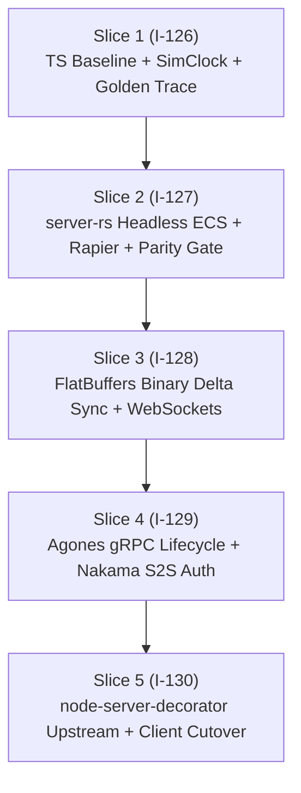

# OpenUltraCode Execution Plan: E-001 Rust Game Server Migration

**Epic ID:** E-001  
**Slices:** I-126, I-127, I-128, I-129, I-130  
**Discipline:** OpenUltraCode (Evidence-Before-Assertions, Strict Verification Gates, Adversarial Reconciliation)

---

## 1. Intake & Executive Summary

- **User Goal:** Migrate the Atlas World game server from the single-threaded TypeScript/Colyseus prototype to a high-density, authoritative Rust game server (`server-rs`) powered by `bevy_ecs` and `rapier2d`, achieving $\ge 10,000\text{--}20,000$ active entity capacity with zero garbage collection pauses and $< 1.0\text{ ms}$ tick execution time.
- **Adversarial Reconciliation (Thinker / Claude Opus 5.5 Findings Incorporated):**
  1. *Unverified Baseline Trap:* We cannot assert a Rust port is successful without an authoritative, bit-accurate test oracle. **Slice 1 (I-126)** explicitly lands the TypeScript spatial grid fix (`I-124`) and routes all simulation time through `SimClock` to produce a 1,000-tick golden deterministic execution trace.
  2. *Behavioral Parity Oracle:* Rather than merely looping over arbitrary dummy structs, **Slice 2 (I-127)** verifies that `server-rs` reproduces the exact mob decisions, separation repulsion, and collision kinematics of the golden trace.
  3. *Upstream Decorator Dependency:* The user's note regarding `"utility function support from node-server decorator"` refers to `/Users/pasitnusso/workspace/repos/node-server-decorator` (the platform library providing caching, event tracking, and entity specs). It is explicitly tracked in **Slice 5 (I-130)** for platform metrics/event wrappers outside the 20 Hz simulation loop.

---

## 2. Structured Slices & Chain of Execution

### Slice 1 (I-126): TypeScript Baseline Benchmark & Golden Deterministic Trace
- **Goal:** Land the I-124 spatial grid fix to measure real TypeScript capacity ceiling, thread all sim time through `SimClock`, and capture a 1,000-tick golden simulation trace.
- **Tasks:**
  1. Land `I-124` spatial hash in `colyseus-server` (`calculateSeparation`, `pickTarget`, `getNearestMob`).
  2. Measure clean baseline via `npm run load 2>&1 | grep -E "^(OK|OVER)"`.
  3. Route remaining `Date.now()` and `Math.random()` calls in `GameSimulationSystem` through `SimClock` and a seeded PRNG.
  4. Run a 1,000-tick automated scenario and serialize state snapshots to `tests/fixtures/golden_sim_trace_1000.json`.
- **Verification Gate:**
  - `cd colyseus-server && npx jest src/tests/ai-*.test.ts` (All pass).
  - `npm run load` confirms p95 $< 50\text{ ms}$ at 300p $\times$ 1,000m.
  - `golden_sim_trace_1000.json` generated and committed as test oracle.

### Slice 2 (I-127): Headless `server-rs` ECS Simulation Core & Rapier2D
- **Goal:** Build the pure Rust simulation crate (`server-rs`) with `bevy_ecs` and `rapier2d`, verified against the golden trace.
- **Tasks:**
  1. Initialize Cargo crate `server-rs` with dependencies: `bevy_ecs`, `rapier2d`, `glam` (or `nalgebra`), `serde`, `rand_chacha`.
  2. Implement Component archetypes: `Transform`, `Velocity`, `ColliderHandle`, `RigidBodyHandle`, `Health`, `MobAI`, `ThreatTable`.
  3. Implement Systems: `movement_system`, `rapier_physics_step`, `spatial_index_rebuild`, `mob_ai_decision_system`, `combat_resolution_system`.
  4. Implement trace comparator test: replay inputs from `golden_sim_trace_1000.json` and assert entity positions/decisions match within $\epsilon \le 0.05$.
  5. Author benchmark `benches/scale_benchmark.rs` for 10,000 and 20,000 active entities.
- **Verification Gate:**
  - `cargo test --manifest-path server-rs/Cargo.toml` (100% pass, trace comparison matches).
  - `cargo bench --manifest-path server-rs/Cargo.toml` (p95 tick $\le 1.0\text{ ms}$ at 10,000 entities, 0.0 ms GC).

### Slice 3 (I-128): Zero-Copy FlatBuffers Delta State Replication
- **Goal:** High-throughput binary state replication and TypeScript client decoders over WebSockets.
- **Tasks:**
  1. Define schema `protocol/game_state.fbs` (WorldSnapshot, EntityDelta, PlayerInput).
  2. Compile Rust encoders (`flatc --rust`) and TypeScript decoders (`flatc --ts`).
  3. Implement async WebSocket network listener using `tokio` and `tokio-tungstenite`.
  4. Implement Area of Interest (AOI) spatial culling: compute per-client delta bitmasks.
  5. Author test harness connecting 300 synthetic WebSocket clients sending move packets and receiving deltas.
- **Verification Gate:**
  - Client decoder unit test in TypeScript decodes Rust-serialized packet with byte-level fidelity.
  - 300-client synthetic network benchmark maintains 20 Hz tick rate with $< 5\text{ KB/s}$ per-client delta bandwidth.

### Slice 4 (I-129): Agones gRPC Lifecycle Sidecar & Nakama Authentication
- **Goal:** Integrate Rust server with production Kubernetes fleet infrastructure.
- **Tasks:**
  1. Integrate Agones gRPC client via `tonic` (calling `127.0.0.1:9357` for `Ready`, `Health`, `Shutdown`).
  2. Implement Nakama S2S token authentication on WebSocket connection upgrade (`GET /v2/account`).
  3. Package multi-stage Dockerfile targeting scratch or Alpine linux ($< 35\text{ MB}$ final image).
- **Verification Gate:**
  - Unit test with mock Agones gRPC server passes health check loop.
  - Invalid Nakama token returns HTTP 401 unauthorized.
  - Docker container builds and boots in $< 50\text{ ms}$.

### Slice 5 (I-130): Platform Decorators, Client Cutover & Release
- **Goal:** Ensure platform telemetry in `node-server-decorator` is preserved, cutover game clients, and deploy.
- **Tasks:**
  1. Verify platform decorator requirements in `/Users/pasitnusso/workspace/repos/node-server-decorator` for server-side metrics/events.
  2. Wire `game-client` and `react-client` WebSocket connection URL to `server-rs`.
  3. Execute local cluster deployment (`k8s/local`) with Agones Fleet.
  4. Verify live multiplayer movement, combat, and mob aggro in browser.
  5. Decommission `colyseus-server`.
- **Verification Gate:**
  - `kubectl rollout status fleet/atlas-world-server` reaches Ready state.
  - In-browser playtest verified with live client rendering.
  - Precheck and Gate 1 tests pass cleanly.
