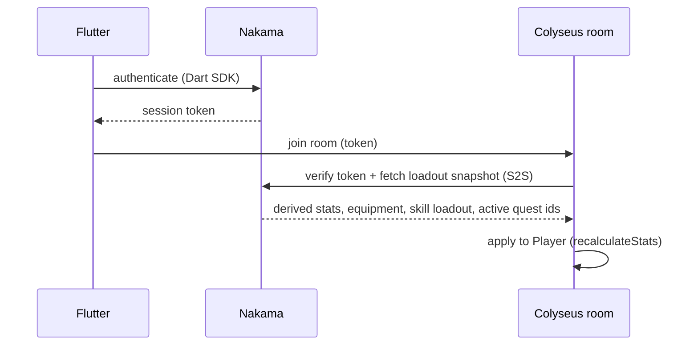
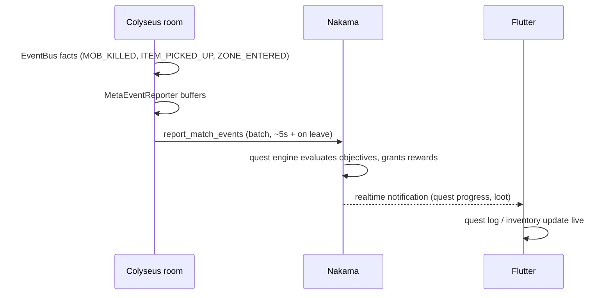

# Player Meta-Systems Design — Stats, Skills, Inventory, Quests

**Date:** 2026-07-09 · **Idea:** I-001 · **Status:** Approved (design), pre-implementation

<div class="callout info">
This spec defines the <mark>meta-systems architecture</mark> for atlas-world-svc: where persistent
player data lives, how it flows between Nakama ↔ Colyseus ↔ Flutter/Unity, and the schemas that
make it robust. Each subsystem (profile/stats, inventory, skills, quests) gets its own
implementation plan on top of this shared foundation.
</div>

## Decisions

| # | Decision | Choice | Rationale |
|---|----------|--------|-----------|
| D1 | Persistent data home | **Nakama** (+ CockroachDB), stood up for real | Matches the documented split architecture; auth/social/matchmaking land on rails we need anyway |
| D2 | Meta-UI layer | **Flutter** (Nakama Dart SDK) | Native lists/forms, fast iteration, meta screens work with no match running; Unity keeps in-world rendering + minimal HUD only |
| D3 | Quest progress flow | **S2S events; Nakama owns quest rules** | Single source of truth, survives reconnects/room crashes, unspoofable by clients |
| D4 | Static content | **Versioned JSON catalogs in the repo** (contracts package) | Content is code: reviewable, diffable, ships with the server that interprets it |

## 1. Data ownership

- **Definitions** (item / skill / quest catalogs): JSON in `contracts/`, validated with zod,
  codegen'd to C# through the existing contracts pipeline. Referenced everywhere by string ids.
- **Player persistent state** (level/XP, unlocked skills, inventory, equipment, quest progress):
  Nakama storage collections, one per subsystem (see §2).
- **In-match transient state** (HP, cooldowns, positions, active loadout): Colyseus `GameState`
  schema, as today. Colyseus *loads* a snapshot from Nakama at join; it never owns the durable copy.

## 2. Nakama storage schema (per user)

```
profile/main        { schemaVersion, level, xp, statPoints, allocated: {str, agi, int, vit} }
inventory/main      { schemaVersion, stackables: [{itemId, qty}],
                      uniques: [{instanceId, itemId, mods?}] }
equipment/main      { schemaVersion, slots: {weapon: instanceId, armor: ..., accessory: ...} }
skills/main         { schemaVersion, unlocked: [{skillId, level}], loadout: [skillId × N] }
quests/main         { schemaVersion,
                      active: [{questId, startedAt, objectives: {objectiveId: count}}],
                      completed: [{questId, completedAt, claimed: bool}] }
```

**Robustness rules (non-negotiable):**

- **All mutation through Nakama RPCs.** Clients get read permission on their own objects, never
  direct write. Client RPCs: `equip_item`, `allocate_stats`, `set_skill_loadout`, `accept_quest`,
  `claim_quest_reward`. S2S-only RPCs: `report_match_events`, `grant_loot`, `grant_xp`.
- **Optimistic concurrency** via Nakama object versions on every write — two racing sessions
  cannot silently lose updates.
- **`schemaVersion` + lazy migration**: a read hook upgrades old documents on access; schema
  evolution never requires a big-bang migration.
- **Idempotent S2S events**: every event batch carries `matchId` + a monotonic sequence number;
  Nakama dedupes, so Colyseus retries are always safe.

## 3. Runtime flows

### Match join (loadout in)



### During match (progress out)



Meta-UI updates arrive over the player's Nakama realtime socket; a few seconds of latency is
acceptable for "3/5 boars". No Flutter↔Unity messaging is needed in v1.

### Failure handling

- **Nakama unreachable at join:** retry ×3, then admit with default loadout flagged
  `ephemeral` — no progress is recorded and the condition is logged loudly.
- **Event batch flush fails:** batch stays in the room buffer and re-flushes; on room dispose,
  one final retry burst, then the loss is logged with counts (bounded and explicit, never silent).

## 4. Stats & skills model (v1 scope)

- **Stats:** `level` + `xp` persist; XP is granted only by Nakama (quest rewards, kill events).
  Derived combat stats are computed from `level + allocated points + equipment` in **one pure
  function in the contracts package**, shared by Nakama (display) and Colyseus (simulation) so
  the two can never drift.
- **Skills:** the catalog defines cost/cooldown/effects; players unlock skills with skill points
  from levels; a fixed **loadout of 4 slots** enters a match. In-match execution reuses the
  existing cooldown `MapSchema` + `PlayerCombatSystem`.

<div class="callout warn">
<b>YAGNI line:</b> no respec, no prerequisite trees, no item trading, no crafting in v1.
The skill catalog reserves a <code>requires</code> field; everything else waits for demand.
</div>

## 5. Component map

| Where | New pieces |
|-------|-----------|
| `nakama/` (new top-level dir) | TS runtime: `quest-engine.ts` (pure, unit-testable), `rpc/*.ts`, `migrations/` (lazy doc upgraders); joins docker-compose with CockroachDB |
| `contracts/` | Content catalogs + zod schemas + derived-stats function; C# codegen extended to cover them |
| `colyseus-server/` | `NakamaClient` (S2S auth + RPC wrapper), `MetaEventReporter` (EventBus → batches), loadout application in `GameRoom.onJoin` |
| `joymify-app` (Flutter) | Nakama Dart SDK session; screens: character, skills, inventory, quests; notification listener |

## 6. Testing

- Quest engine + derived-stats are pure functions → plain jest units.
- Integration: boot Nakama in docker, run RPC round-trips, replay a recorded event batch
  (assert dedupe, progress, rewards).
- Colyseus: extend the existing `GameSimulationSystem` integration test with a fake
  `NakamaClient` to assert batching/flush behavior.

## 7. Build order (each step = its own feature/plan with the phased quality gate)

1. **Infra** — Nakama + DB in docker-compose, Flutter auth session, Colyseus token verification.
2. **Profile/stats** — profile doc, XP grant, derived-stats function, loadout snapshot at join.
3. **Inventory + equipment** — catalogs, grant/equip RPCs, Flutter inventory screen.
4. **Skills** — catalog, unlock/loadout RPCs, in-match execution wiring.
5. **Quests** — quest engine, event reporting, notifications, quest log screen.

## 8. Risks & trade-offs

- Committing to Nakama is the most upfront infra of the options considered (new runtime,
  TS modules deployed inside Nakama's container, CockroachDB in the stack). Accepted because
  auth/social/matchmaking need it anyway.
- Nakama's TS runtime is a less familiar dev loop than NestJS — mitigated by keeping all game
  logic in pure functions jest can test outside Nakama.
- Alternatives considered and rejected: Postgres + thin meta API (duplicates what Nakama
  provides, delays the split architecture); Colyseus-local persistence (couples the stateless
  sim server to storage); client-mediated quest progress (spoofable, breaks server authority).
