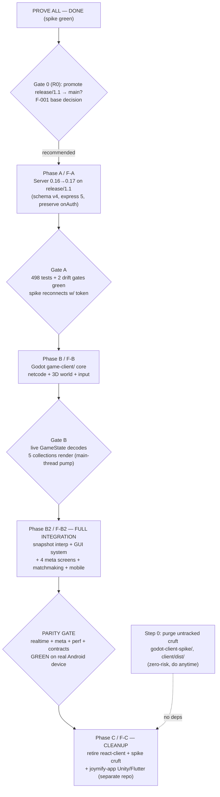
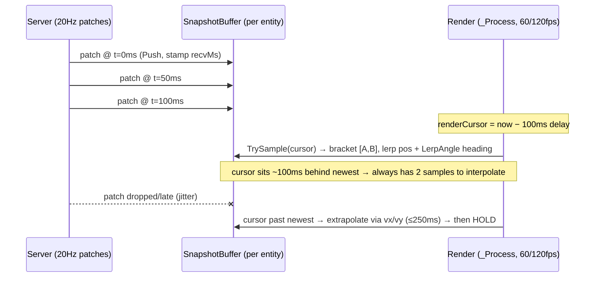

# Master Migration Plan — atlas-world-svc Client: Unity+Flutter → Godot 4 (C#)

> **Status:** Execution-ready. Spike GREEN end-to-end (2026-07-11). Server stays TypeScript (Colyseus + Nakama, unchanged in design); only the **client** is replaced and the **server bumps one minor line** (Colyseus 0.16→0.17) to unlock the maintained C# SDK.
> **Program shape:** four macro-phases — **PROVE ALL → MIGRATE → FULL INTEGRATION → CLEANUP** — each shipped as one ps-release-workflow feature (`F-A`, `F-B`, `F-B2`, `F-C`) behind a hard go/no-go gate.

---

## Executive summary

The Godot 4.7 (C#) client is **proven viable end-to-end**: a spike connected the maintained NuGet Colyseus 0.17.17 SDK to a migrated atlas 0.17 server, decoded the full `GameState` (12 schema classes, 5 MapSchemas), rendered 25 live 3D entities at the real ~19 Hz patch rate, round-tripped input intents, and read F-001 Nakama meta storage into a live HUD. **All three seams (Colyseus sim, generated C# contracts, Nakama meta) are green.** What remains is not research — it is disciplined productionization.

The program is one strict dependency chain, not parallel lanes:

1. **PROVE ALL — DONE (spike).** Documented below as facts, not tasks.
2. **MIGRATE.** (a) Bump the real server 0.16→0.17 (schema v3→v4, express 4→5) **on `release/1.1` where F-001 lives**, preserving F-001's fail-closed `onAuth`; (b) build the production Godot client `game-client/` in-repo, consuming the drift-gated generated contracts by compile-link.
3. **FULL INTEGRATION.** Server-buffered smoothing via **client snapshot interpolation** (render ~100 ms in the past, 20 Hz → 60/120 fps, no server change); the **Godot GUI design system** (token module → theme, reusable Button/LineEdit/Panel/List/ProgressBar); and **all F-001 meta screens** (Character/Inventory/Skills/Quests + a read-only Loadout) on a from-scratch meta shell, plus real Nakama matchmaking + Agones allocation and mobile perf.
4. **CLEANUP.** Retire react-client (forced by the colyseus.js-0.16 break), delete spike cruft, and — in the separate `joymify-app` repo — retire the Unity+Flutter embed. **Only after a hard PARITY GATE.**

**The single biggest schedule risk** is the one deliberate departure from the proven spike: the spike shipped **shared-loop dispatch** (`SetSynchronizationContext(null)` + `CallDeferred` everywhere); the production client wants **main-thread `DispatchMessageQueue()` pump** to eliminate the latent off-thread freed-node crash. That pump path is a *documented-valid* config but is **not spike-proven for state decode** — so Phase B's very first task re-verifies it, with the proven shared-loop model as a documented, reversible fallback.

---

## What's already PROVEN (macro-phase 1: PROVE ALL — DONE)

Every item below is verified spike evidence — build **on** these, do not re-derive.

| Seam | Proven fact | Evidence |
|---|---|---|
| **Toolchain** | Godot 4.7.stable.mono + **arm64** .NET 8 (`~/.dotnet-arm64`, 8.0.422). Build via `dotnet build *.sln` (Godot `--build-solutions` swallows C# errors). | headless build+run green |
| **Server migration** | 0.16→0.17 is **~3 code edits + express-5 coercions + index.ts idiom**. Schema v3→v4 codegen regenerates cleanly. | `~/workspace/godot-server-017` runs fully under 0.17/v4 |
| **Colyseus decode** | Full `GameState` decodes: `players=1 mobs=14 npcs=5 proj=5`, **25 MeshInstance3D live**, **112 patches / 6 s (~19 Hz)**, `welcome`+equipment msgpack decodes, input intent round-trips (`🎮 MOVE`). | headless runs, schema-shape bisect all green |
| **Root cause of every 1004** | NOT version skew — the spike sent an **unregistered `move` message**; Colyseus errors the connection on unknown message types. Fix = use the registered input contract (`player_input_move`). | systematic bisect; SDK's own 17/17 tests passed vs `sdks-test-server` |
| **Working version trio** | server `colyseus@0.17.8` + overrides `@colyseus/core 0.17.34` / `@colyseus/schema 4.0.11` / `@colyseus/tools 0.17.18` / `@colyseus/ws-transport 0.17.9` + `express ^5.2.1`; client NuGet **`Colyseus 0.17.17`** (pin exactly). | `sdks-test-server` package-lock (what SDK 0.17.17 CI tests against) |
| **Codegen namespace fix** | `AtlasWorld.Schema` shadows base `Colyseus.Schema.Schema` → CS0118. Fix = rename namespace to **`AtlasWorld.Contracts`** (matches the UPM asmdef) in codegen. | spike used `global::` sed; real fix is the rename |
| **Dispatch (spike config)** | `SetSynchronizationContext(null)` **before** `new Client()` → SDK shared bg loop pumps; callbacks off-thread → all scene mutation via `CallDeferred`. Do NOT *also* `DispatchMessageQueue` (double-drain → 1004). | windowed + headless green |
| **Nakama meta** | NuGet `NakamaClient 3.21.2`, device-auth (GUID at `user://device_id`), reads F-001 `inventory/main`+`profile/main` (permissionRead:2), live HUD. Nakama awaits resume off-thread → `CallDeferred`. | account `02b88759` (level 2, statPoints 3, potion×1) rendered live |

**Open from spike (cheap to close in Phase A):** does latest core 0.17.44 / schema 4.0.27 now interoperate with SDK 0.17.17 (now that the `move` bug is understood)? If yes → drop the brittle overrides pin entirely.

**Not reached in spike (Phase B2 owns these):** mobile/Android 3D perf; real matchmaking (spike hardcoded JoinOrCreate); `onAuth` token flow (spike joined the no-auth `main` server).

---

## Dependency-ordered sequencing



**The one-way door:** merging 0.17 to `main` permanently breaks react-client (no colyseus.js 0.17 exists). Tag a `0.16` escape point before that merge and treat it as an explicit logged decision.

---

## Protecting shipped F-001 across the schema v3→v4 wire break

F-001 (Nakama `onAuth` session verification + the 4-param auth generic + the meta contract) is **shipped only on `release/1.1`** (47 commits ahead of `main`, unmerged). This is the sharpest correctness hazard in the whole program, because the spike's proven 3-edit diff was derived against **pre-F-001 `main`**, whose `GameRoom` is a plain `Room<GameState>` with **no `onAuth`**.

<div class="danger">

**The trap:** applying the memo's `Room<{ state: GameState }>` edit verbatim to the F-001 form silently **drops** `onAuth` and the auth generic → the server fails **open** (any client joins unauthenticated). Typecheck stays green; the regression is invisible without the auth tests.

</div>

**Four protections, enforced:**

1. **Migrate ON `release/1.1`, never on `main`.** The migration lands alongside F-001; a later single promote carries both to prod together. (Migrating `main` then merging F-001 is rejected — it produces an `onAuth`-less `GameRoom` that hard-conflicts with 47 commits of F-001.)
2. **Re-derive the 0.17 Room generic against the F-001 form**, threading auth:
   `Room<GameState, any, any, GameRoomAuthData>` → `Room<{ state: GameState; auth: GameRoomAuthData }>`. Typecheck-verify against the actual 0.17 `Room.d.ts` — the green 017 reference has **no** auth, so this generic is re-derived, not proven.
3. **Never touch the `onAuth`/`onJoin` bodies** (Nakama `verifySession`, `devBypass`, loadout load, welcome+equipment). Only the *signatures* change.
4. **Keep the F-001 guard tests green** as a gate: `game-room-auth.test.ts`, `meta-event-reporter.test.ts`, `nakama-meta-backend.test.ts`, `apply-loadout.test.ts`, plus `scripts/e2e-meta.sh`.

**Downstream consequence flagged early:** once migrated, `onAuth` **fail-closes** — a bare Godot client is rejected. The client phases MUST send a valid Nakama session token (`options.token`) or `options.devBypass=true` (non-prod). The spike never exercised this (it joined no-auth `main`).

---

## How it rides ps-release-workflow

The repo is opted in (`.release.json` present). **One feature per phase**, each through the full lifecycle:

```
idea → refine (solid spec) → claim (isolated worktree) → implement
     → per-phase quality gate → ship (Gate 1: precheck.sh) → [promote when release full] (Gate 2: integration.sh) → squash-merge
```

- **Feature map:** `F-A` = server-0.17-migration · `F-B` = godot-client-core · `F-B2` = godot-meta-ui-and-matchmaking · `F-C` = retire-legacy-clients.
- **Worktrees are mandatory for edits** — the PreToolUse guard blocks writes to tracked files in the main checkout (keys on filesystem location, not branch). Every phase (including `git rm` in cleanup and doc edits) runs from a claimed feature worktree. Fresh worktrees have no `node_modules` — run `pnpm install` first.
- **Per-phase quality gate (global rule #7), automatic, not a checkpoint:** implement → verify (real evidence) → **independent adversarial review of that phase's diff** → refactor → re-verify. Runs every phase before advancing.
- **Squash-merge only**, conventional commit subjects, trunk-based.

---

# Phase A / F-A — Server Colyseus 0.16 → 0.17 (schema v4, express 5)

<span class="topic-chip">MIGRATE · server</span>

### Goal
Bring the authoritative TypeScript server up to the proven 0.17 line (schema v4, express 5, `WebSocketTransport`) so the Godot C# SDK 0.17.17 can connect and decode state — **without regressing F-001**, keeping the full **498-test** suite and **both drift gates** green, and re-committing the v4-regenerated C# models under the non-shadowing `AtlasWorld.Contracts` namespace. This is the single server-side prerequisite for the entire client swap.

### Scope
~6 files change: `index.ts`, `GameRoom.ts`, 3 `req.params` sites, 2 codegen scripts — plus dependency + lockfile restructure. **Effort: L** — not from code volume but from the verify surface: a triple runtime-major bump (Colyseus, schema, express) across 498 tests + 2 drift gates + e2e-meta + a re-run spike, PLUS a re-derived auth generic, PLUS a pnpm-workspace lockfile/overrides restructure.

### Task breakdown
- **0. Claim + worktree off `release/1.1`** (ps-release mechanics). `pnpm install` at worktree root. Do NOT use the `_release` metadata worktree for code edits.
- **1. Cheap unpinned retest FIRST** (resolves the pinning open question). Repoint to latest (`colyseus 0.17.x`, `@colyseus/schema 4.0.27`, `express ^5`, `+@colyseus/ws-transport`), **no overrides**, install, regen C#, run the spike + full suite. If green → ship unpinned (skip step 2 entirely — cleanest). Only if it fails → fall back to the proven pinned trio.
- **2. Dependency edits** (`colyseus-server/package.json`): `@colyseus/schema` ^3→4.0.11, `colyseus` ^0.16.4→0.17.8, `express` ^4→^5.2.1, `@types/express` ^4→^5, add `@colyseus/ws-transport` ^0.17.9 as a **direct dep** (the import needs it), KEEP `colyseus.js ^0.16.19`. If pinning needed → **new root `package.json`** with `pnpm.overrides` (pnpm ignores per-package `overrides`), regenerate + commit root `pnpm-lock.yaml` or CI `--frozen-lockfile` fails.
- **3. `index.ts` — `WebSocketTransport` + `ServerOptions.express` idiom** (copy the proven green shape from `godot-server-017/src/index.ts`, minus its spike-only bisect defines). Drop `createServer`/`http`.
- **4. `GameRoom.ts` (F-001 form) — re-derived generic + `onLeave`** (see F-001 protection above). Bodies unchanged.
- **5. express-5 `req.params` coercions (3 known sites):** `mobHandlers.ts:39`, `playerHandlers.ts:89`, `middleware/roomValidator.ts:15` → `String(req.params.x)`. **Audit the rest of `src/api`** for other destructures / wildcard routes / error-handler signatures express-5 breaks.
- **6. Codegen namespace-shadow fix + regen:** rename `AtlasWorld.Schema` → `AtlasWorld.Contracts` in **BOTH** `gen-csharp.sh:25` AND `check_drift.sh:30` (must land together or the drift gate reports drift). Regenerate all 12 `Runtime/*.cs` under v4, `git add` + commit. Leave `gen-csharp-meta.*` / `MetaTypes.cs` / `check_drift_meta.sh` untouched (already `AtlasWorld.Contracts.Meta`, version-independent).
- **7. Verify (evidence gate):** typecheck → format:check → full 498-test suite → `test:contracts` + both drift gates → the 4 F-001 guard tests → `scripts/e2e-meta.sh` → re-run the Godot spike against the migrated server (with token/devBypass). Then independent adversarial review → refactor → re-verify.
- **8. Ship into `release/1.1`** (Gate 1 precheck → squash-merge). Subject: `feat(server): migrate Colyseus 0.16→0.17 (schema v4, express 5) for Godot client`.

### Key decisions
- Target = `release/1.1` (carries F-001), edited in a per-feature worktree.
- Run the **unpinned retest before committing to overrides** — it may remove the whole pinning risk class.
- `@colyseus/ws-transport` as a **direct dep**, not override-only (safer under pnpm than the npm hoist godot-server-017 relied on).
- Accept the interim browser-client break (colyseus.js maxes at 0.16) **explicitly** — react-client stops connecting at cutover; its retirement is Phase C, not here.

### Representative code
```ts
// index.ts — proven green shape (from godot-server-017)
import { Server } from 'colyseus'
import { WebSocketTransport } from '@colyseus/ws-transport'
const gameServer = new Server({
  transport: new WebSocketTransport(),
  express: app => {
    app.use(cors()); app.use(express.json())
    app.use('/api', createApiRouter(gameServer))
    app.get('/health', (req,res)=>{ /* unchanged */ })
    app.get('/rooms',  (req,res)=>{ /* unchanged */ })
  },
})
gameServer.define('game_room', GameRoom)
gameServer.listen(Number(PORT))   // transport owns the HTTP server now

// GameRoom.ts on release/1.1 — RE-DERIVED (memo only covered main's Room<GameState>)
export class GameRoom extends Room<{ state: GameState; auth: GameRoomAuthData }> {
  async onAuth(client: Client<any, GameRoomAuthData>, options: GameRoomOptions): Promise<GameRoomAuthData> { /* BODY UNCHANGED: Nakama verifySession + devBypass + throw-unauthorized */ }
  async onJoin(client, options, auth) { /* UNCHANGED — verify 0.17 still passes auth here vs client.auth */ }
  onLeave(client, _code?: number) { /* was (client, consented: boolean) — body unchanged */ }
}

// express-5 coercion ×3
const mobId = String(req.params.mobId)   // was: const { mobId } = req.params

// codegen: gen-csharp.sh:25 AND check_drift.sh:30
// --namespace AtlasWorld.Schema  →  --namespace AtlasWorld.Contracts
```

### Risks & mitigations
| Risk | Mitigation |
|---|---|
| schema v3→v4 is a runtime major (encode/decode + MapSchema iteration can shift) | The 498-test suite (combat, projectile collision, game-sim-integration) is the real regression surface — **typecheck-green is not sufficient**; run the full suite. |
| express 4→5 breaks beyond the 3 known sites | Audit all `src/api` middleware / wildcard routes / error handlers, not just the `String()` edits. |
| pnpm ignores per-package `overrides` | Pins go in a **root** `package.json` `pnpm.overrides`; regenerate + commit root lockfile. |
| Re-derived auth generic isn't proven | Typecheck against real 0.17 `Room.d.ts`; keep the 4 F-001 auth tests green; verify whether `onJoin` still receives `auth` as 3rd arg vs `client.auth`, and whether `onAuth` gains an optional `AuthContext`. |
| Two drift gates fail unless regenerated `.cs` committed + namespace renamed in both scripts | Commit all 12 regenerated files; land the rename in `gen-csharp.sh` AND `check_drift.sh` together. |

### Go/No-Go — Gate A
Both drift gates green · full 498-test suite green **under schema v4** · server boots · spike client reconnects **with a Nakama token/devBypass** (onAuth now fail-closes) · react-client break logged.

---

# Phase B / F-B — Godot 4 (C#) client core (`game-client/`)

<span class="topic-chip">MIGRATE · client</span>

### Goal
Design and build the production Godot 4.7 (C#) client that replaces both the Unity+Flutter product client and the react-client debug viewer: a full-3D, server-authoritative client that connects to the 0.17/schema-v4 sim with robust **main-thread** dispatch + reconnection, renders all 5 entity collections, sends only registered input intents (desktop + mobile), and consumes the drift-gated generated contracts. **Port-and-restructure the 3 proven spike seed files (NetClient/Main/MetaClient), do not greenfield.**

### Scope
In-repo at `game-client/` (sibling of `colyseus-server/`), layered `src/{Core,Net,World,Input,Meta,Contracts}`. **Effort: M for the vertical slice** (spike proved every seam; decompose-and-harden), pushed to **L** by reconnection robustness, mobile input, and the looming (deferred) 3D art pipeline.

### Task breakdown
- **Scaffold** `game-client/` (claimed worktree). `project.godot` (Godot 4.7, forward_plus + `.mobile` Vulkan override). `GameClient.csproj`: net8.0, `EnableDynamicLoading`, `Nullable`, `RootNamespace AtlasWorld.Client`; `PackageReference Colyseus 0.17.17` (pin) + `NakamaClient 3.21.2`; **`<Compile Include="..\colyseus-server\generated\csharp\Runtime\*.cs">`** to compile-link the drift-gated schema.
- **Core:** `GameRoot.cs` scene state machine `Boot→Auth(Nakama)→Match(SessionGateway)→World(+MetaShell)→(disconnect→reconnect/Match)`. `Config.cs` reads endpoint/Nakama host from resource/env (no hardcoded `ws://`). `ServiceLocator` holds `ColyseusConnection`, `MetaService`, `SessionGateway`.
- **Net — `ColyseusConnection`:** port `NetClient` but **KEEP SyncContext**; pump `_room.Connection.DispatchMessageQueue()` in `_Process` wrapped in try/catch → `TriggerReconnect`. Delete all `SPIKE_*` sentinels, bisect branches, self-quit timer, stale comments. `JoinOrCreate<GameState>("game_room", {token})`. `OnLeave`: `1000`=clean else reconnect via `ReconnectionToken` with backoff.
- **Net — `EntitySync`:** `Callbacks.Get(room)`; OnAdd/OnChange/OnRemove for players, mobs, npcs, projectiles, **AND zoneEffects** (the 5th map, unwired in the spike). Callbacks run on main thread (pump) → call `EntityManager` **directly, no `CallDeferred`**.
- **Net — `InputSender`:** the **only** class allowed to call `room.Send`; API is the 6 registered handlers; no method can send a position or hp (server-authority by construction). Debug sends behind `#if DEBUG`.
- **World:** `EntityManager` (pooled `Dictionary<string,EntityView>`, `IsInstanceValid` guards), `EntityView` (visuals = pure function of synced fields: team→tint, hp→bar, isAlive→death+free, state→anim, heading→Y-rot), `EntityVisuals.CreateView(kind)` (the art-pipeline swap seam — placeholder primitives now), `CameraRig` (free-orbit + follow-own-player, extracted verbatim from spike Main.cs).
- **Input — `PlayerController`:** Godot InputMap actions so keyboard/gamepad/touch resolve to the same intents. Desktop WASD → normalized → `SendMove` (send-on-change); mobile `VirtualJoystick.tscn` (touch-only) → same `SendMove`.
- **Meta seed:** `MetaService` (device-auth, `ReadDoc`, `CallRpc`, realtime socket) — Nakama off-thread → **`CallDeferred` for all UI**. Full 4-panel build is Phase B2.
- **Contracts:** compile-linked `AtlasWorld.Contracts` (12 classes) + `AtlasWorld.Contracts.Meta` POCOs + RPC-id/collection constants mirrored from generated, never hand-copied.
- **Verify vertical slice:** re-verify main-thread-pump decode green (headless + windowed); 5 collections render; input round-trips (server logs MOVE); reconnect after forced OnLeave; one Nakama read + one RPC write.

### Key decisions
- **DISPATCH (the core architectural call):** main-thread `DispatchMessageQueue()` pump, **keep SyncContext**, callbacks mutate nodes directly — no `CallDeferred`, no off-thread freed-node crash. This is the **opposite** of the spike's shipped shared-loop config and **MUST be re-verified first** (only shared-loop is spike-proven).
- **Split threading rule (never mixed):** Colyseus = main-thread (no `CallDeferred`); Nakama/Meta = off-thread → `CallDeferred` for **all** meta UI mutation.
- **Contracts = compile-link, not copy** — the drift gate becomes the single source of truth (kills the copy-drift class that bit Flutter's stale `quests.json`). Requires Phase-A's namespace fix so there's no CS0118 shadow.
- **Auth coupling:** connect flow is Nakama device-auth → session token → Colyseus `JoinOrCreate({token})`; `SessionGateway` is the matchmaking seam (DevDirectJoin now, NakamaMatchmake+Agones later).

### Representative code
```csharp
// Net/ColyseusConnection.cs : MAIN-THREAD pump (chosen dispatch model)
public override void _Process(double _) {
    if (_room == null) return;
    try { _room.Connection.DispatchMessageQueue(); }   // callbacks fire HERE, safe to mutate nodes
    catch (Exception e) { GD.PushError(e); TriggerReconnect(); }
}
// DO NOT SetSynchronizationContext(null) — double-drain = WS 1004

// Net/EntitySync.cs : callbacks on main thread → direct calls, NO CallDeferred
var cb = Colyseus.Schema.Callbacks.Get(room);
cb.OnAdd(s => s.players, (id,p) => _entities.Spawn(id, EntityKind.Player, p));
cb.OnChange(p, () => _entities.Apply(id, p));
cb.OnRemove(s => s.players, (id,_) => _entities.Despawn(id));
// …mobs, npcs, projectiles, AND zoneEffects (5th map — added here)

// Input/InputSender.cs : ONLY registered intents; cannot send position/hp
public void SendMove(float vx, float vy)     => _room.Send("player_input_move",   new { vx, vy });
public void SendAction(string a, string tgt) => _room.Send("player_input_action", new { action=a, targetId=tgt });
```

### Risks & mitigations
| Risk | Mitigation |
|---|---|
| **Main-thread pump UNVERIFIED for decode** (spike proved only shared-loop) | Re-verify decode-green under the pure pump **first thing** in Phase B; documented reversible fallback = shared-loop + `CallDeferred`. |
| onAuth fail-closed rejects bare joins | Verify exact 0.17 `onAuth` signature + the join-options token key the F-001 handler reads; wire `SessionGateway` to thread the token. |
| Compile-linking `../colyseus-server/...` may fight Godot editor hot-reload | If it doesn't hot-reload cleanly, fall back to a codegen **copy step** into `game-client/src/Contracts/` with its own drift check. |
| Freed-node crash mitigated, not eliminated | `EntityManager` `IsInstanceValid` guards; remove from pool in OnRemove before any later OnChange fires. |
| 3D art pipeline is the real downstream cost, out of this phase | `EntityVisuals.CreateView` is the only seam isolating it; placeholder primitives carry the slice. |

### Go/No-Go — Gate B
Live `GameState` decodes under the **main-thread pump** · 25 entities render · patches flow (~19 Hz) · input round-trips · reconnect works · off drift-gated contracts (drift gate green) · one Nakama read+write.

---

# Phase B2 / F-B2 — FULL INTEGRATION (smoothing + GUI system + meta screens + matchmaking + mobile)

<span class="topic-chip">FULL INTEGRATION</span>

This macro-phase has three parallel-safe workstreams (all client-only, server untouched) plus real room acquisition and mobile perf. Ships as one ps-release feature. **Effort: L.**

## B2.1 — Server-buffered smoothing via client snapshot interpolation

### Goal
Replace the spike's naive per-entity exp-lerp with proper snapshot interpolation: buffer patches (~20 Hz/50 ms), render remote entities ~100 ms in the past, interpolate position + shortest-arc heading between bracketing snapshots, degrade to velocity-based extrapolation on starvation, handle add/remove cleanly across the buffer window. **20 Hz server state → smooth 60/120 fps. NO server change.**

### Key decisions
- **Clock = client monotonic (`Stopwatch`)** stamped at patch arrival — not `state.tick` (sim runs ~60 Hz but patches ship 20 Hz → tick→ms ambiguous), not wall clock (NTP jumps). `tick` is a dedup/order id only. **Single clock domain, zero clock-sync math.**
- **Sample at `room.OnStateChange`** (once per applied patch = the natural snapshot boundary), not per-field `OnChange`.
- **Interpolation delay = 100 ms** (2× the 50 ms patch interval) — the single most important feel/robustness knob, tunable.
- **Extrapolation uses server-synced `vx/vy`** (cheaper + more stable than finite-differencing), capped at 250 ms then hold-freeze.
- **Local player is EXEMPT** from the buffer (interpolating your own avatar = ~100 ms input lag) — render at newest snapshot; leaves the seam for future client-side prediction.
- **Buffer ingestion is main-thread-only.** ⚠️ **This module's threading assumption depends on the Phase-B dispatch decision.** As written it assumes callbacks fire **off-thread** (shared-loop) and routes samples through a `ConcurrentQueue` drained in `_Process`. **If Phase B ships the main-thread pump (recommended), OnStateChange already fires on the main thread → the ConcurrentQueue is unnecessary; push straight into the buffer.** Reconcile this against the Gate-B dispatch outcome before wiring.

### Interpolation timeline


### Task breakdown
- `MonotonicClock` (`Stopwatch.StartNew()`, `NowMs`). `PoseSample{Tick,RecvMs,Pos,Heading,Vel}` + `SnapshotBuffer` (fixed ring ~16 ≈ 800 ms; `Push` drops if `Tick ≤ LastTick`; `PruneOlderThan`; `TrySample`). `SnapshotInterpolator` (`InterpolationDelayMs=100`, `MaxExtrapolationMs=250`, `DrainPending`, `RemoveEntity(lingerMs)`, `TrySamplePose`, `TickCleanup`).
- Wire ingestion in `OnStateChange` (capture `recvMs`+`tick` first; build sample list; push/enqueue per the reconciled threading model). Keep OnAdd/OnRemove for view lifecycle (linger-free on remove so views finish interpolating to last pose).
- Drain + interpolate in `_Process`; `TrySample` covers interp / extrap / hold / snap. Delete Main.cs exp-lerp — the interpolator is now the single source of rendered pose. Tune the two knobs against real jitter.

### Risks
Extrapolation overshoot past a sharp server stop (wall/death/stun) → cap 250 ms + freeze; consider zeroing extrapolation when `isAlive` flips false. · schema-v4 MapSchema iteration semantics differ from v3 — validate iterating `state.players/mobs` each `OnStateChange`. · Removal-linger vs immediate re-add of the same id → on OnAdd cancel any pending linger-free and reuse the view. · **Local player has no smoothing** until prediction is added (renders raw newest 20 Hz — may look slightly steppy).

## B2.2 — Godot GUI design system + F-001 meta screens

### Goal
Stand up a single design system (Theme resource + token module + reusable Button/LineEdit/Panel/Label/List/ProgressBar) and rebuild the four F-001 Flutter meta screens as Control scenes — Character, Inventory(+equipment), Skills(+loadout), Quests — plus a composed **read-only Loadout** overview (the 5th screen), all wired to a productionized Nakama `MetaGateway`. One theme serves both the in-match HUD and the full-screen meta shell; responsive desktop+mobile.

### Key decisions
- **Two-layer, drift-proof design system:** `Design.cs` = static token module (single source of truth: colors, spacing, radii, type sizes, rarity map) → a C# `ThemeBuilder` constructs `atlas_theme.tres` **from** those tokens (tokens and StyleBoxes can never disagree). Styling variants via Godot **Theme type variations** (PrimaryButton/GhostButton/DangerButton, Card/Well, Display/H1/Body/Value); genuinely composed widgets (StatRow, InventoryTile, SkillTile, QuestCard, Toast, SlotPicker) are their own `.tscn`.
- **Brand:** keep the real product identity — the joymify **fantasy** palette (navy `#1A2036`, gold `#FFD700`, bronze `#CD7F32`) as **values**; borrow zen-ui "Warm Sand"'s **token architecture** (numbered scales, semantic aliases, 4 px base) as **structure**. A future re-skin is a one-file `Design.cs` swap.
- **`MetaGateway` autoload owns ALL Nakama awaiting** and re-emits results as Godot **signals via `CallDeferred`**; panels are pure signal listeners → every node mutation lands on the main thread. (Direct analog of the NetClient CallDeferred rule and the Flutter setState-on-main rule.) This threading model is the **same decision as Phase B's meta side** — it must NOT be mixed with `DispatchMessageQueue`.
- **Correct RPC payloads baked in, NOT the wrong Flutter guesses:** `allocate_stats = {str,agi,int,vit}` delta; `equip_item = {slot,instanceId}` (slot inferred from `ItemDef.kind` with a `SlotPicker` fallback). `set_skill_loadout = {loadout: string[]}` (≤4). `get_loadout` is **S2S-only — client must NOT call it** (throws for client sessions); the Loadout screen reads individual docs instead.
- **Contracts:** consume generated `AtlasWorld.Contracts.Meta` POCOs + a `MetaIds` constants file mirrored from `contracts/src/meta/ids.ts`. Quest display names via a client-side `QuestDisplay` map (`QuestDef` has no `name` field — interim; prefer server-side long-term).

### Representative code
```csharp
// Design.cs (token single-source) — excerpt
public static readonly Color Surface=Color.FromHtml("#1A2036"), Gold=Color.FromHtml("#FFD700"),
  OnGold=Color.FromHtml("#1A2036"), Sunken=Color.FromHtml("#0E1424"), Border=Color.FromHtml("#38415F");
public const int S3=12,S4=16, RMd=8, FBody=14, TouchMin=44;

// ThemeBuilder — PrimaryButton (gold fill, navy text) as a Theme *type variation*
theme.SetTypeVariation("PrimaryButton","Button");
theme.SetStylebox("normal","PrimaryButton", Flat(Design.Gold, Design.RMd, Design.S4, Design.S3));
theme.SetColor("font_color","PrimaryButton", Design.OnGold);
// LineEdit — input well, gold focus ring + caret
theme.SetStylebox("focus","LineEdit", Flat(Design.Sunken, Design.RSm, Design.S3, Design.S2, Design.Gold, 2));
theme.SetColor("caret_color","LineEdit", Design.Gold);

// MetaGateway (autoload) — all awaiting here; panels are signal listeners
public async void CallRpc(string id, object payload, Action<string> ok){
  try { var res = await _c.RpcAsync(_s, id, JsonSerializer.Serialize(payload));
        CallDeferred(() => ok(res.Payload)); }        // ok() runs on main thread
  catch (Exception e){ CallDeferred(nameof(EmitFail), id, e.Message); }
}
```

### Task breakdown
`Design.cs` tokens → `ThemeBuilder`→`atlas_theme.tres` + fonts → 8 reusable widget scenes → `MetaGateway` autoload + `MetaIds` → `MetaShell.tscn` (CanvasLayer 10, Scrim + NavRail↔bottom-tab breakpoint at 900 px) → CharacterPanel (XP bar `xpToNext=100*level`, 4 StatRows, optimistic `allocate_stats` + rollback) → InventoryPanel (3 EquipSlots + responsive 4/3/2 grid, rarity borders, `equip_item`) → SkillsPanel (loadout cap 4, `set_skill_loadout`) → QuestPanel (active + claimable, `claim_quest_reward`, quiet refetch on notif codes 1/2) → LoadoutPanel (read-only composed, `derivedStats()`) → HUD integration (CanvasLayer 1, compact variations, SkillTile hotbar) + input-focus guard (suppress movement intents while any LineEdit has focus).

### Risks
Threading trap — any panel that `await`s Nakama directly then touches a node crashes off-thread; enforce gateway-owns-all-awaits via review checklist. · The two provably-wrong Flutter payloads ship broken if copied. · `get_loadout` S2S-only — keep the guard in review. · Type-variation names are stringly-typed — centralize as C# consts. · Font licensing for a fantasy display face. · Android nested-min-size overflow — needs on-device testing.

## B2.3 — Real room acquisition + mobile

- Replace DevDirectJoin's hardcoded endpoint with the real **Nakama matchmaking → Agones allocation → endpoint + seat reservation → ConsumeSeatReservation** flow behind `SessionGateway`.
- Validate **Android/mobile 3D perf** (the one untouched spike item — needs `dotnet workload install android` + export templates). Frame rate + memory on target device.

### Go/No-Go — Integration gate = the PARITY GATE (see Phase C).

---

# Phase C / F-C — CLEANUP (retire legacy clients + repo restructure)

<span class="topic-chip">CLEANUP · gated tail</span>

### Goal
Retire the three legacy client surfaces (react debug client, Unity C# client, Flutter embed) and the spike cruft — **safely, only once the Godot client passes a hard PARITY GATE** — while finalizing the in-repo `game-client/` layout. **Effort: S–M** (mostly `git rm` + doc edits + one cross-repo PR); the real time sink is the *preceding* parity verification.

### The PARITY GATE (retirement go/no-go — ALL green on a real Android device)
- **Realtime:** Godot joins via **Nakama matchmaking + Agones** (not hardcoded JoinOrCreate); sends valid Nakama token → `onAuth` accepts; decodes all 5 MapSchemas; sends only the registered input contract; sustains ~19 Hz.
- **Meta:** all 4 screens read live docs + mutate via **correct** RPC payloads; optimistic-update + rollback works.
- **Perf:** acceptable 3D frame rate + memory on target Android.
- **Contracts:** `game-client` compiles against `generated/csharp` via compile-link with drift gate **GREEN**.

### Task breakdown
- **Step 0 (do immediately, zero risk, no deps):** purge untracked cruft — `rm -rf godot-client-spike/` (verified untracked `??`, 0 tracked files) and `client/dist/`. (`rm` of untracked files likely passes the guard, which keys on Edit/Write of tracked files — confirm; use a worktree if blocked.)
- **In-repo retirement** (claimed worktree): `git rm -r client/react-client/` (89 files) + `client/package-lock.json`; remove the dangling `client` entry from `pnpm-workspace.yaml`; update `README.md` (drop `:3001` row, the C# Unity Client section, the react-client structure line) and atlas `CLAUDE.md` (rewrite the "C# Unity client models" line → point at Godot `game-client/` + `AtlasWorld.Contracts`). Verify CI green (drift gates + 498 tests) — zero CI/docker impact (no client builds in CI).
- **Cross-repo retirement** (SEPARATE PR in `joymify-app`, own CI, tracked as a linked task): remove `unity/**/AtlasWorld/**`, the `io.colyseus.sdk` UPM dep, `flutter_embed_unity*` pubspec deps + embed host code; the hand-maintained `AtlasWorldModels.cs` dies with it.

### Key decisions
- **Godot client goes IN-REPO** at `game-client/` consuming `generated/csharp` (compile-link/ProjectReference) so the existing drift gate governs it — **not** a copy (spike), **not** a separate repo (the joymify-app failure mode that reintroduces copy-drift and splits CI).
- **`game-client/` stays a standalone .NET solution** — it's C#/.NET, not a pnpm package; leave `pnpm-workspace.yaml` to TS packages only.
- **Two independent deletions with different risk profiles** — in-repo cleanup as one ps-release feature; the Unity+Flutter retirement as a tracked cross-repo PR so it doesn't orphan.
- **Explicit KEEP list (load-bearing):** `colyseus-server/**`, `generated/csharp/Runtime/*.cs`, `scripts/codegen/*`, both drift-gate workflows, `docs/*.spec.md`. Cleanup must scope KEEP vs DELETE so the contracts pipeline the Godot client depends on is never swept up.

### Repo layout after Phase C
```
atlas-world-svc/
  colyseus-server/     (KEEP — server + generated/csharp + scripts/codegen + drift gates)
  game-client/         (NEW — Godot 4.7 C#; compile-links ../colyseus-server/generated/csharp)
  client/              (REMOVED entirely)
pnpm-workspace.yaml → packages: ['colyseus-server']   (client entry removed)
```

### Risks & mitigations
| Risk | Mitigation |
|---|---|
| Premature retirement removes the only visual server-state check | PARITY GATE is a hard predecessor; react-client stays until Godot renders live state. |
| One-way door: 0.17→main permanently breaks react-client | Explicit logged decision; tag a `0.16` escape branch before merge. |
| Scope-creep `git rm` sweeps up `generated/csharp` or codegen | Explicit KEEP list; adversarial review of the F-C diff. |
| Cross-repo orphan (joymify-app deletion invisible to atlas CI) | Track as an explicit linked follow-up PR. |
| **F-001 emulator demo may still depend on the Flutter embed** (see MEMORY) | **Confirm demo status before retiring the embed** or the demo breaks. |

### Go/No-Go — program complete
react-client + spike cruft removed · CI green · game-client is the sanctioned client on drift-gated contracts · joymify-app retirement PR tracked/merged.

---

## Open questions / decisions needed from the user

**R0 sequencing (highest priority — needs an explicit go):**
1. **Gate 0:** Promote `release/1.1` → `main` FIRST (recommended — R0 prod deploy, gives a clean stable F-001 base to re-derive the auth generic against), **or** run the 0.17 migration inside `release/1.1` and promote both together later (avoids the promote but re-derives on a moving branch)?
2. **Interim client policy:** Is react-client officially abandoned at the 0.17 cutover (accept a no-browser-client window until Godot ships), or is a minimal Godot debug view / frozen-0.16 escape branch required first?

**Cheap-to-close technical forks:**
3. Does **latest core 0.17.44 / schema 4.0.27** now interoperate with C# SDK 0.17.17 (now that the `move` bug is understood)? If yes → drop the brittle overrides pin entirely. **Run Phase A step 1 to decide.**
4. **Dispatch model:** confirm the **main-thread `DispatchMessageQueue` pump** decodes `GameState` green (only shared-loop is spike-proven). This gates Phase B and the interpolation threading model — verify first thing in Phase B.
5. **Contract consumption:** compile-link `../generated` (single source, may fight hot-reload) vs a drift-checked codegen **copy** into `game-client/src/Contracts/` — which does Godot .NET tooling actually tolerate?

**Product/UX decisions (no Flutter reference exists):**
6. **Meta-menu IA:** side NavRail ↔ bottom tab bar is proposed — but is the trigger a Tab-key overlay, an Esc pause menu, or a persistent HUD button? (The Flutter screens were never assembled into a shell.)
7. **Loadout tab:** read-only (as designed) or editable (needs drag-to-equip + would need a client RPC to replace S2S `get_loadout` — larger scope)?
8. **Quest acceptance:** `accept_quest` RPC exists but no Flutter screen used it — does the Godot QuestPanel add an "available quests" section, or is acceptance driven by in-world NPC dialog?
9. **Equip UX:** infer slot from `ItemDef.kind` with a SlotPicker fallback, vs always-explicit slot picker? (Confirm no multi-slot items exist.) And where do human-readable quest/objective display names live — extend the catalog server-side or a client display map?
10. **Show derived combat stats** (HP/pAtk/mAtk/pDef/mDef/moveSpeed via `derivedStats()`) on Character/Loadout? The contract supports it; Flutter omitted them. Design includes them (easy to hide).

**Scope/interpolation choices:**
11. **Interpolation:** fixed 100 ms delay now (recommended) then measure → adaptive later? And do fast, short-lived **projectiles** interpolate-in-the-past like WorldLife, or render ballistically from spawn pose + velocity? Are **zoneEffects** interpolated or static-placed?
12. **Local-player smoothing:** ship minimum-viable newest-snapshot rendering now (may look slightly steppy), or is full **client-side prediction + reconciliation** in scope soon? (The design leaves the seam.)
13. **Cross-repo scope:** is the joymify-app Unity+Flutter retirement in scope for this program (tracked linked PR) or a deferred follow-up?
14. **F-001 emulator demo:** does it still depend on the Flutter embed such that retiring it needs coordination?
15. **Fonts:** which fantasy display + UI face, and are both redistribution-licensed for the shipped client?

**Long-term (deferrable):**
16. Later emit a server-authoritative time field to switch to jitter-free server-clock interpolation? (Receive-time is recommended now — zero server change; server-clock is a strictly-better-feel upgrade, cheap to add since `tick` is already synced.)
