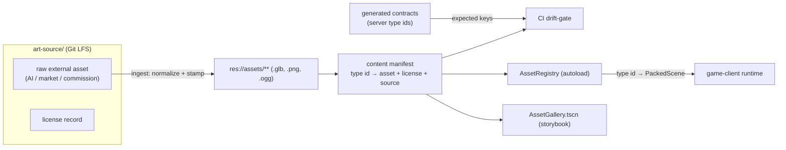
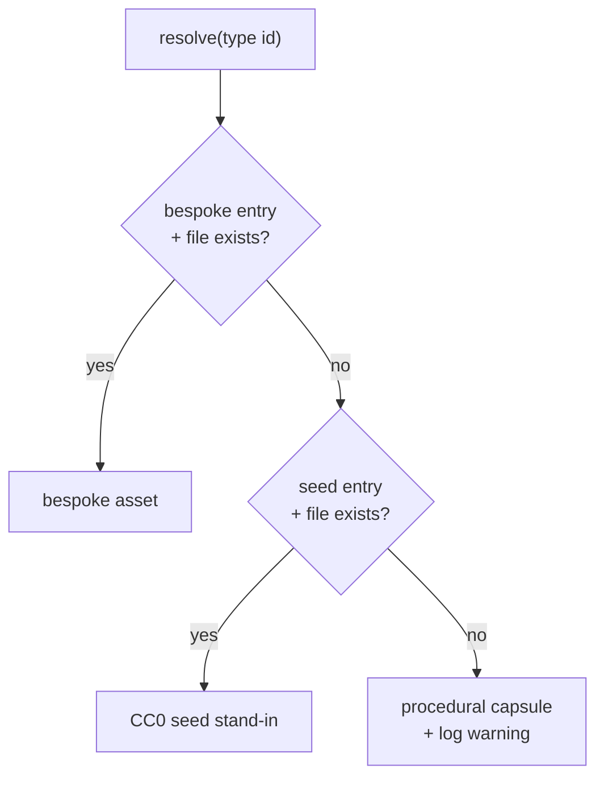

# Asset Build Pipeline — Design Spec (I-003)

> **Status:** Design approved in brainstorming (2026-07-12); open decisions D1–D3 resolved (2026-07-12). Ready for `writing-plans` on Stage 0 + 0.5.
> **Scope:** The Godot 4 (C#) client's asset pipeline — intake, normalization, a content registry bound to server type ids, a preview "storybook", a CI drift-gate, and a CC0 seed set so the system is never empty. Server is unchanged (assets are a pure client concern).
> **Line:** `release/1.2`, idea `I-003`.

---

## Context

The `game-client/` renders **entirely procedural geometry today** — `BoxMesh`/`CapsuleMesh` for entities, procedurally-built terrain in `MapVisuals.cs` — plus one UI `.tres`. There are **zero committed art or audio assets**. This is greenfield: the pipeline is being set up *before* content accumulates ad hoc, which is when it is cheapest to get right.

Three existing patterns are reused rather than invented:

- **`@atlas/contracts` codegen + drift-gate** (TS schema → generated C#, CI fails on drift) → becomes the **art drift-gate**.
- **`GenerateTheme.tscn` tools-scene** (a scene that generates the UI theme) → becomes the **storybook** pattern.
- **World-unit discipline** (`CLAUDE.md`: physics in world units; rendering multiplies by `scale`) → becomes the **intake normalization** rule.

### Decisions locked in brainstorming

| Axis | Decision |
|---|---|
| Intent | **Staged** — lean spine now, harden per-type later |
| Sources | **AI-generated + asset-store/marketplace + commissioned artists** (no in-house authoring) → pipeline's core job is **intake, normalization, licensing, QA**, not authoring |
| Priority types | All eventually (3D chars+anims, props/env, VFX/projectiles, audio+cutscenes) — **sequenced**, not parallel |
| Seed | **Yes** — seed with curated **CC0** assets so nothing renders empty and the pipeline has a permanent test fixture |

## Goals / Non-goals

**Goals**
- A content **registry** that maps every server entity/skill/projectile **type id → visual/audio asset**, with the expected key-set derived from the generated contracts.
- **Graceful three-tier resolve** so content lands incrementally and nothing ever crashes on a missing asset.
- A repeatable **intake** that conforms heterogeneous external assets (scale, orientation, pivot, naming, import preset) and records **license + source**.
- A **storybook** to preview/QA assets in isolation, without booting the full game+server.
- A **CI gate** that fails on registry drift, broken `res://` refs, or missing license metadata.
- A **CC0 seed set** covering current server types so day-one the game looks like a game.

**Non-goals (this spec)**
- No server changes.
- No bespoke/commissioned art production (the pipeline *receives* it; producing it is separate work).
- No full four-type storybook up front — VFX/audio/cutscene harnesses are added when those asset classes exist.
- No runtime asset streaming / CDN — local `res://` packaging only for now.

---

## Architecture — the spine



### 1. Content manifest — the backbone

A declarative map from server type id → asset + provenance. One entry per renderable/audible server type.

```
mob:spear_thrower → {
  scene:   "res://assets/characters/quaternius_skeleton.glb",
  source:  "market",                       // ai | market | commission
  license: "CC0 (Quaternius)",
  scale:   1.0,                            // post-normalization; 1 unit = 1 m
  tier:    "seed"                          // seed | bespoke
}
```

**Key insight:** the server already owns every type id (`mobTypesConfig`, skills, projectiles), and those already generate C# contracts. So the **expected key-set is generated from the contracts** — the CI gate is literally "every server type has a manifest entry whose asset file exists," the `@atlas/contracts` drift-gate applied to art.

> **D1 — RESOLVED: JSON.** Diff-friendly, tool-agnostic, matches the contracts-JSON precedent; round-trips with the contracts tooling and is trivial to validate in a Node/CI script. (Godot `Resource`/`.tres` rejected — editor-native but harder to gate in CI.)

### 2. AssetRegistry (autoload) — three-tier resolve

Loads the manifest, resolves `type id → PackedScene`/`AudioStream`, **best-available**:



This is what makes "staged" real: every type falls back safely, so bespoke art replaces seeds **one entity at a time** with no big-bang.

### 3. Intake / normalization (the part that matters for external sources)

Because assets arrive heterogeneous (mixed formats, scales, orientations, quality), intake is the pipeline's core value:

- **`art-source/`** (**D2 — RESOLVED: Git LFS in-repo**) holds raw delivered originals + a per-asset license record. The game repo commits only the **baked** `res://` assets; raw originals are LFS-tracked so the working tree stays lean.
- A documented **ingest checklist** (+ a small Godot editor tool in a later stage) conforms each asset:
  - **scale to 1 unit = 1 m** — critical: server runs in world units, rendering multiplies by `scale`; a mis-scaled marketplace model renders wrong-sized.
  - orientation (Godot −Z forward), pivot (feet for characters, center for props), naming convention, per-type import preset.
  - stamps the manifest entry with `source` + `license`.
- A one-page **delivery spec** handed to commissioned artists so they deliver conformant `.glb` (fewer round-trips).

> ⚠️ The units normalization is not optional polish — it is the one step that, if skipped, silently breaks every imported model's size relative to the authoritative physics world.

### 4. CI drift-gate

Mirror of `test_contracts.sh`. Fails the build when:
- a server type id has **no** manifest entry, or
- a manifest `res://` path is **missing or fails to import**, or
- an entry lacks `license`/`source`.

Optional later: headless Godot screenshot of `AssetGallery` as a build artifact for visual regression.

---

## The storybook — tool scenes, one per type, added as content arrives

No off-the-shelf Storybook exists for Godot; it is built as **tool scenes** (the `GenerateTheme.tscn` pattern, proven).

- **Stage 1:** `res://scenes/tools/AssetGallery.tscn` (3D) — reads the **same manifest** the game uses, lists everything, spawns the selected asset on a turntable with an `AnimationPlayer` dropdown, flags placeholders/tier. Because it shares the manifest it is auto-synced with runtime and screenshot-able for CI.
- **Grown per-type only when the assets exist:** VFX preview (looping `GPUParticles`) → soundboard (list + play + waveform) → cutscene player (scrub timeline). *Do not build a cutscene previewer before there is a cutscene.*

---

## The CC0 seed set (Stage 0.5)

Seeding is the **first real run of the marketplace-intake path** and becomes the pipeline's permanent test fixture. **CC0 only** — public domain, no attribution obligation, zero legal risk, exercises the `license:` field with the easy case first.

| Source | License | Seeds |
|---|---|---|
| **Quaternius** | CC0 | Animated low-poly characters/monsters → priority #1 (chars + anims), pre-rigged (skips Mixamo license nuance) |
| **Kenney.nl** | CC0 | Props, environment, UI, particle textures, SFX → props + VFX + audio in one house-style |
| **Poly Pizza** | CC0 / CC-BY | Gap-fill individual low-poly models (CC0 preferred) |

Both ship glTF/`.glb` → straight into the `.glb` import path. Blending Kenney + Quaternius yields one coherent house-style so the placeholder game reads as intentional, not asset-flipped.

> Guardrail: no external downloads happen until this spec is approved **and** the user gives an explicit go; every seeded asset's CC0 license is recorded at intake time.

**Coverage target:** a seed stand-in for every current server type (all present mob types, the player, NPCs, each projectile/skill FX, a handful of SFX) so `AssetRegistry` never falls through to a capsule for a *known* type.

---

## Staging (lean → harden)

| Stage | Deliverable | Needs real art? |
|---|---|---|
| **0 — spine** | manifest schema + `AssetRegistry` autoload + capsule fallback + CI drift-gate + `art-source/` LFS + license record + ingest/delivery docs | ❌ ships with capsules |
| **0.5 — seed** | curated CC0 pack (Quaternius chars + Kenney props/FX/SFX) ingested through the real pipeline, mapped as the default tier for every current server type → **nothing renders empty** | CC0 seed |
| **1** | `AssetGallery` 3D storybook over the seed set; begin swapping in bespoke chars/props | first bespoke `.glb` |
| **2** | VFX/projectile harness + skill FX | — |
| **3** | audio soundboard + SFX/music | — |
| **4** | cutscene previewer + cutscenes | — |

**First plan target:** Stage 0 + Stage 0.5 together — the spine plus a visible, running seed set (Kenney/Quaternius characters instead of capsules) is a tight, self-contained, demonstrable slice.

## Testing strategy

- **Registry unit tests:** resolve() returns bespoke > seed > capsule correctly; unknown type → capsule + warning (no throw).
- **CI drift-gate test:** synthesize a missing entry / broken path / absent license and assert the gate fails (red-green).
- **Import smoke:** every manifest `res://` asset loads + instantiates headlessly.
- **Units assertion:** a normalized seed character's bounding height is within tolerance of its declared world-unit size.
- **Storybook (Stage 1):** headless launch of `AssetGallery`, assert it enumerates the full manifest with no load errors.

## Resolved decisions (2026-07-12)

- **D1 — manifest format: JSON.** Diff-friendly, CI-validatable, matches the contracts-JSON precedent.
- **D2 — `art-source/` location: Git LFS in-repo.** Raw originals tracked via LFS in this repo (no sibling repo); working tree stays lean, one clone gets everything.
- **D3 — key generation: extend the existing codegen.** The contracts codegen additionally emits the expected manifest key-list (the set of renderable/audible server type ids), so the manifest and the CI drift-gate share one generated source of truth — no separate parser to drift.

---

## Summary

Set up the asset pipeline as a **spine** (manifest bound to server type ids + a graceful three-tier registry + intake normalization + a contracts-style CI gate), seed it immediately with **CC0** assets so it is never empty and always testable, and grow the **storybook** per asset-type as real content arrives. It reuses three patterns the team already ships — the contracts drift-gate, the tools-scene, and world-unit discipline — so there is nothing exotic to invent.
