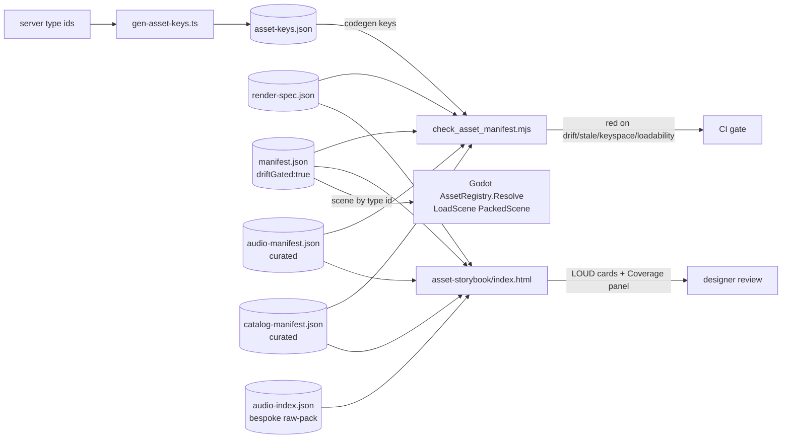

# Universal Asset Previewer — atlas-world-svc Architecture Spec

> **Status:** Final · **Blast radius:** LOW (additive; `asset-keys.json`, `gen-asset-keys.ts`, and the Godot `AssetRegistry` runtime path are untouched) · **Reversibility:** Full (revert 3 files → today) · **Grounding:** Every "no-change / non-breaking" claim below is verified against the live `_release` worktree code, not against the research summaries (which were passed as non-existent `undefined/…` paths and do not exist on disk).

---

## 1. Summary & goals

Build **one** previewer that renders **every** asset class this game ships — 3D characters, 2D item icons, spritesheet/SpriteFrames VFX, tilesets, fonts, UI kits (nine-patch + Godot Theme), materials, audio (SFX + music), video, and raw Godot data resources — from the **same manifest pipeline** that already drives the drift gate and the Godot runtime, with **no build step** and a **single self-contained static HTML** served by the existing Range-less static server.

**Design goals, in priority order:**

1. **Manifest-driven, never hand-invented.** The storybook and the drift gate read the *same* declarative contract (`render-spec.json`); they can never disagree on what a render-type requires.
2. **Decouple `kind` from `render`** — `kind` is the server/gameplay concept emitted by codegen (`character|prop|vfx|audio`); `render` is the client presentation. One `kind` may map to several `render` types over time. **Constraint (from review):** this decoupling is only free for *curated* manifests the Godot runtime never touches; codegen-keyed entries stay Godot-scene-loadable (§6).
3. **Additive & reversible.** `asset-keys.json`, `gen-asset-keys.ts`, `AssetKind`, and `AssetRegistry.Resolve` do not change. New fields are silently ignored by C# (verified: `JsonOptions` has **no** `UnmappedMemberHandling.Disallow`).
4. **Never silently show nothing, never silently pass drift.** Unknown render → LOUD red card. Unmapped codegen key → red "MISSING ENTRY" card. Baked-preview staleness → gate **failure**, not a green pass.
5. **New asset class = a data row + one builder fn**, not a new code path or a schema migration.

---

## 2. Asset-class taxonomy

`kind` = server/gameplay concept. `render` = how the previewer draws the bytes. **Keying:** *codegen* entries are keyed by server type id and live in `manifest.json` (`driftGated:true`, cross-checked against `asset-keys.json`); *curated* entries are keyed by content namespace and live in curated files (`driftGated:false`).

| Asset class | `kind` | `render` | Path ext(s) | Keyspace | Need | Notes |
|---|---|---|---|---|:--:|---|
| 3D character / rigged actor | `character` | `model3d` | `.glb .gltf .tscn .scn` | **codegen** (`player`,`npc`,`mob:*`) | now | `.tscn`/`.scn` accepted because runtime loads them (§6, finding 3) |
| Projectile / zone VFX (scene) | `vfx` | `model3d` | `.glb .gltf .tscn .scn` | **codegen** (`projectile:*`,`zone:*`) | now | **Must** be scene-loadable — codegen-keyed (§6, finding vfx) |
| 2D item / inventory icon | `prop` | `image` | `.png .webp .jpg .svg` | curated (`item:*`,`icon:*`) | now | The most concrete near-term gap → **Phase 1** |
| 2D animated sprite (mob/actor) | `vfx`/`prop` | `spritesheet` | `.png .webp` (+`.json` atlas) | curated | now | Multi-clip `animations[]` (SpriteFrames), finding 2 |
| Particle / effect flipbook | `vfx` | `spritesheet` | `.png` (+`.json`) | curated | now | Single flipbook variant |
| Tileset (raw grid) | `prop` | `tileset` | `.png` | curated (`tileset:*`) | soon | Grid overlay only — not `.tres` terrain data |
| UI nine-patch panel/button/bar | `prop` | `ninepatch` | `.png` | curated (`ui:*`) | **now** | Added by review (finding 1) — no honest renderer before |
| Godot Theme resource | `prop` | `theme` | `.tres` | curated (`theme:*`) | soon | Baked `preview` PNG required (finding 1) |
| Font | `prop` | `font` | `.ttf .otf .woff .woff2` | curated (`font:*`) | soon | |
| PBR material (baked) | `prop` | `material` | `.tres .material` | curated (`mat:*`) | future | **Manual bake** + staleness gate (findings 6, 16) |
| PBR texture-map set | `prop` | `texturemap` | `.png .webp` | curated (`tex:*`) | future | `role: albedo\|normal\|roughness\|metallic\|ao\|orm` (finding 8) |
| Shader / ShaderMaterial | `vfx` | `material` *(static)* | `.gdshader .tres` | curated | future | **Static-preview-only limitation** flagged (finding 4) |
| Environment / skybox / HDRI | `prop` | `skybox` | `.hdr .exr .png` | curated (`env:*`) | future | Flat tonemapped first cut (finding 7) |
| Video / cinematic | `vfx` | `video` | `.webm .mp4 .ogv` | curated (`video:*`) | future | blob→objectURL (Range-safe) |
| Data asset (loot/particle cfg) | `prop` | `json` | `.json` | curated (`data:*`) | soon | Pretty-printed |
| Godot text-resource (TileSet/Gradient/Curve/AnimationLib `.tres`/`.res`) | `prop` | `godotres` | `.tres .res` | curated | soon | Pretty-print fallback — **prevents `json` parser crash** (finding 12) |
| SFX (one-shot) | `audio` | `audio` | `.ogg .wav .mp3` | curated (`sfx:*`) | now | WebAudio soundboard (exists) |
| Music / ambience (long) | `music`/`ambience` | `music` | `.ogg .mp3` | curated (`music:*`) | soon | Lazy/streamed, seek+loop UI — **not** pre-decoded (finding 5) |
| Voice / dialogue | `voice` | `audio` | `.ogg .wav` | curated (`vo:*`) | future | `transcript/speaker/locale` fields (finding 11) |

**Explicitly scoped out (documented, not silently mis-rendered):**
- **Runtime-composed cards / nameplates / tooltips** (frame + art + rarity + dynamic text) — preview baked art as `image`; composition is not modeled (finding 10).
- **Animated cursors + hotspot** — `image` with optional `hotspot:{x,y}` crosshair; animated cursors reuse `spritesheet` (finding 9, low).
- **Live animated/parameterized shaders** — no in-browser GLSL compile in v1; routed through `material` with a **"static preview only"** banner and staleness gate (finding 4).

---

## 3. Renderer registry

**Constraint recap:** single self-contained static HTML, served by a bare **Range-less** static server, CDN scripts allowed, **no build step**, manifest-driven.

### 3.1 Backing tech, deps, and the CDN/importmap reality

| `render` | Backing tech | New runtime dep? | Range-safe strategy |
|---|---|:--:|---|
| `model3d` | `<model-viewer>` (existing) | none | ESM module script, self-contained bundle |
| `image` | native `` | none | direct URL |
| `spritesheet` | `<canvas>` + `requestAnimationFrame` | none | slice PNG / load atlas JSON |
| `tileset` | `<canvas>` grid overlay | none | direct URL |
| `ninepatch` | `<canvas>` 9-slice draw | none | direct URL |
| `font` | `FontFace(family, ArrayBuffer)` | none | `fetch → arrayBuffer` (works Range-less) |
| `theme` / `material` | `` on baked `preview` PNG | none | direct URL |
| `texturemap` | `<canvas>` (normal-map viz, channel split) | none | direct URL |
| `skybox` | `` tonemapped strip (v1) | none | direct URL |
| `video` | `<video muted loop playsinline>` | none | `fetch → blob → objectURL` |
| `audio` | WebAudio `decodeAudioData` soundboard (existing) | none | full decode (fine for short SFX) |
| `music` | native streaming `<audio>` **via blob objectURL** or on-demand decode | none | lazy; **not** pre-decoded on section render |
| `json` / `godotres` | `fetch` → `<pre>` (JSON.parse for json; raw text for godotres) | none | direct fetch |
| `packedscene` (`.tscn`/`.scn` fallback) | placeholder card + optional baked `preview` | none | — |

**Key CDN corrections (verified, findings 19–22):**

- **Pin model-viewer.** The live tag is unpinned (`unpkg.com/@google/model-viewer/…` → silently tracks latest, currently 4.3.1). Change to **`https://unpkg.com/@google/model-viewer@4.3.1/dist/model-viewer.min.js`** so a future breaking major can't change rendering with zero repo change.
- **It is an ESM module script**, not a "plain `<script>`": the tag is `type="module"`. The "no importmap yet" point stands, but the correct characterization is *"ESM module script (`type=module`), no importmap required because the bundle is self-contained."*
- **model-viewer bundles its own copy of three** and exposes no bare specifiers. Therefore: (a) a future `<script type="importmap">` does **not** affect it, and (b) it will **not** share the proposed `ctx` shared-WebGL context. Only the future three/addons-based builders (FBX/OBJ/VOX/STL, `material` 3D) share `ctx`'s WebGL context.
- **When three.js is first needed** (non-glTF loaders, live material), add **one** `<script type="importmap">` block (bare `three` + `three/addons/`) placed in `<head>` **before the first `three/addons/` import** (bare-specifier resolution requirement). `RoomEnvironment` imports from **`three/addons/environments/RoomEnvironment.js`** (not `loaders/`); the single `three/addons/` prefix covers both subpaths.
- **FontFace must use the ArrayBuffer form** — `new FontFace(family, urlString)` parses arg 2 as a CSS `<src>` descriptor and throws `SyntaxError` on a bare URL. Correct path:
  ```js
  fetch(u).then(r => r.arrayBuffer())
          .then(b => new FontFace(family, b).load())
          .then(f => document.fonts.add(f));   // Range-safe, no CSS-src quoting
  ```

### 3.2 Registry structure (in the single static HTML)

Replaces the `if (kind === "character") … else placeholder` branch at `index.html:1146`. `render-type → builder(entry, mountEl, ctx)`; the **card chrome** (badges, key, filename, health dot, `kind` facet-chip) is shared and data-driven.

```js
// ctx = { resolvePath(field), health(status), spec, sharedGL() }
//   resolvePath("scene"|"stream") → served URL (res:// → ../../game-client/assets/…)
//   health("ok"|"err"|"pending")  → drives sidebar dots + Coverage panel
//   sharedGL()                    → lazily-created WebGL ctx shared by three/addons builders ONLY
const RENDERERS = {
  model3d:     buildModel3d,     // = today's buildCard renamed (<model-viewer> + anim dropdown)
  image:       buildImage,       //  onload→ok / onerror→err, checkerboard bg, optional hotspot crosshair
  spritesheet: buildSpritesheet, // <canvas> flipbook; single-grid OR multi-clip animations[] + clip dropdown
  tileset:     buildTileset,     // <canvas> grid overlay at entry.tileSize
  ninepatch:   buildNinePatch,   // <canvas> draw 9 slices at 1x AND stretched → shows border-preserving stretch
  font:        buildFont,        // FontFace(family, ArrayBuffer) → specimen at multiple sizes
  theme:       buildTheme,       //  + ".tres Theme — baked preview" note
  material:    buildMaterial,    //  + ".tres/.gdshader — static preview only" note
  texturemap:  buildTextureMap,  // <canvas> map-role label + normal viz + channel split for ORM
  skybox:      buildSkybox,      //  tonemapped equirect strip (v1); spherical later
  video:       buildVideo,       // fetch→blob→objectURL→<video muted loop playsinline>
  audio:       buildAudio,       // = today's WebAudio soundboard tile (short SFX), reused
  music:       buildMusic,       // lazy streamed <audio> w/ duration+seek+loop UI, NOT pre-decoded
  json:        buildJson,        // fetch→JSON.parse→<pre>; err card on parse fail
  godotres:    buildGodotRes,    // fetch→raw text→<pre> + "Godot resource — no rich preview" note
  packedscene: buildPackedScene, // placeholder: "Godot scene — open in editor" + optional baked preview
  __unknown:   buildUnknown,     // LOUD red card: "no renderer for render=<x>"
};

function renderEntry(id, entry, ctx) {
  const rt = resolveRender(entry, ctx.spec);           // §4.1
  const build = RENDERERS[rt] || RENDERERS.__unknown;
  return buildCardShell(id, entry, rt, build(id, entry, ctx));  // shared chrome wraps the viewport
}
```

**Plugging in a new renderer = 2 edits, no build:** one row in `render-spec.json` (so the gate validates it too) + one `buildFoo` fn in `RENDERERS`. Sidebar sections, health dots, and the Coverage panel are computed off whatever render-types actually appear.

---

## 4. Manifest schema v2

Top level unchanged: `{ "version": 2, "entries": { "<id>": <entry> } }`. Path field stays **`scene`** (visual) / **`stream`** (audio) — **no `src` rename, no codemod** (a PNG/ttf/tres/ogv is a valid `res://` path, so the gate's existing scene-exists check already covers it). Render-specific fields are **flat and open** — C# ignores them; `render-spec.json` documents which builder consumes each.

### 4.1 Render-type resolution

`render` is **optional and authoritative when present**; otherwise resolve by kind-default → extension-sniff → `unknown`.

```js
function primaryPath(e) { return e.scene ?? e.stream ?? ""; }

function resolveRender(entry, spec) {
  if (entry.render) return entry.render;                                  // 1. explicit — authoritative
  if (entry.kind && spec.kindDefaultRender[entry.kind])                   // 2. unambiguous kind default
    return spec.kindDefaultRender[entry.kind];
  const ext = "." + primaryPath(entry).split(".").pop().toLowerCase();
  return spec.extRender[ext] || "unknown";                               // 3. ext sniff → 4. unknown
}
```

- **Only unambiguous kinds get a default:** `character → model3d`, `audio → audio`. That is exactly the set that makes **v1 files pass unmodified** (the 8 `character` entries + 3 `audio` entries resolve for free).
- **Ambiguous kinds (`vfx`, `prop`) have NO kind-default** and **must** set `render` explicitly, or they fall through to ext-sniff / `__unknown`.
- **On `version`:** inference runs **unconditionally**, independent of the `version` field. The gate does **not** branch validation strictness on version, and C# reads `Version` but does not branch on it. So there is **no "v1 legacy infer mode vs v2 explicit mode" switch** — the migration-safety guarantee rests entirely on **inference coverage**, not on a version gate. `version:2` is a documentation/marker bump only. *(Correcting finding 17 — the earlier "both v1 and v2 accepted via a version branch" framing described code that does not exist.)*

### 4.2 Required-fields-per-type

Driven by `render-spec.json` `require` / `oneOf` / `optionalPaths` / `sceneLoadable` (see §4.4). Summary:

| `render` | required scalar fields | path field | oneOf | optional paths |
|---|---|---|---|---|
| model3d | `license`,`source` | `scene` | — | — |
| image | `license`,`source` | `scene` | — | — |
| spritesheet | `license`,`source` | `scene` | `[frame,frames] \| [atlas] \| [animations]` | `atlas` |
| tileset | `license`,`source`,`tileSize` | `scene` | — | — |
| ninepatch | `license`,`source`,`patchMargins` | `scene` | — | — |
| font | `license`,`source`,`family` | `scene` | — | — |
| theme | `license`,`source`,`preview`,`previewHashOf` | `scene` | — | `preview` |
| material | `license`,`source`,`preview`,`previewHashOf` | `scene` | — | `preview` |
| texturemap | `license`,`source`,`role` | `scene` | — | — |
| skybox | `license`,`source` | `scene` | — | — |
| video | `license`,`source` | `scene` | — | `poster` |
| json / godotres | `license`,`source` | `scene` | — | — |
| audio | `license` | `stream` | — | — |
| music | `license` | `stream` | — | — |

**Note:** `audio`/`music` require **only `license`** — matching the live audio entries, which carry `stream`+`license` and lack `source`/`kind`.

### 4.3 Concrete entry examples

```jsonc
// ── manifest.json  (driftGated:true, codegen-keyed) ──────────────────────
// 3D character — UNCHANGED v1 shape; render inferred from kind. scene is Godot-loadable.
"player": {
  "scene": "res://assets/characters/character-male-a.glb",
  "kind": "character", "source": "market",
  "license": "CC0 (Kenney Mini Characters)", "tier": "seed",
  "anims": { "attack": "attack-kick-right" }          // model3d-specific (open field)
},
// vfx is CODEGEN-keyed → render MUST resolve to a scene-loadable type (§6). A .tscn is legal.
"projectile:arrow": {
  "scene": "res://assets/vfx/arrow.tscn",
  "render": "model3d", "kind": "vfx",
  "source": "market", "license": "CC0 (Kenney)", "tier": "seed"
}

// ── catalog-manifest.json  (NEW, driftGated:false, curated) ──────────────
// 2D item icon — no server type id; keyed by content namespace.
"item:health_potion": {
  "scene": "res://assets/icons/potion-red.png",
  "render": "image", "kind": "prop",
  "source": "market", "license": "CC0 (Kenney Item Pack)", "tier": "seed",
  "label": "Health Potion"
},
// Spritesheet — single uniform-grid flipbook (particle effect). vfx ⇒ render REQUIRED.
"vfx:explosion": {
  "scene": "res://assets/vfx/explosion.png",
  "render": "spritesheet", "kind": "vfx",
  "frame": { "w": 64, "h": 64 }, "frames": 16, "fps": 24, "layout": "grid",
  "source": "market", "license": "CC0 (Kenney Particle Pack)", "tier": "seed"
},
// SpriteFrames — MULTIPLE named clips (2.5D billboarded mob). oneOf the multi-clip shape.
"sprite:slime": {
  "scene": "res://assets/sprites/slime.png",
  "render": "spritesheet", "kind": "vfx",
  "frame": { "w": 32, "h": 32 },
  "animations": [
    { "name": "idle",   "row": 0, "count": 4,  "fps": 6,  "loop": true },
    { "name": "walk",   "row": 1, "count": 6,  "fps": 10, "loop": true },
    { "name": "attack", "row": 2, "count": 5,  "fps": 12, "loop": false },
    { "name": "death",  "row": 3, "count": 7,  "fps": 12, "loop": false }
  ],
  "source": "market", "license": "CC0 (Quaternius)", "tier": "seed"
},
// Nine-patch UI panel — patchMargins REQUIRED so the canvas can show stretch behavior.
"ui:panel_wood": {
  "scene": "res://assets/ui/panel-wood.png",
  "render": "ninepatch", "kind": "prop",
  "patchMargins": { "l": 12, "t": 12, "r": 12, "b": 12 },
  "source": "market", "license": "CC0 (Kenney UI Pack)", "tier": "seed"
},
// Godot Theme .tres — baked preview + hash pairing so staleness is a gate FAILURE.
"theme:main_ui": {
  "scene": "res://assets/ui/main.tres",
  "render": "theme", "kind": "prop",
  "preview": "res://assets/ui/main_preview.png",
  "previewHashOf": "res://assets/ui/main.tres",       // §6: gate fails if .tres newer than preview
  "source": "hand", "license": "CC0 (assembled from Kenney UI)", "tier": "seed"
},
// Font — specimen + family for preview.
"font:ui_body": {
  "scene": "res://assets/fonts/Kenney-Mini.ttf",
  "render": "font", "kind": "prop", "family": "Kenney Mini",
  "specimen": "The quick brown fox — 0123 HP/MP/Lv",
  "source": "market", "license": "CC0 (Kenney Fonts)", "tier": "seed"
},
// Material — MANUAL baked sphere PNG (flagged manual-authoring; not codegen-provenanced).
"mat:stone": {
  "scene": "res://assets/materials/stone/stone.tres",
  "render": "material", "kind": "prop",
  "preview": "res://assets/materials/stone/stone_preview.png",
  "previewHashOf": "res://assets/materials/stone/stone.tres",
  "source": "hand", "license": "CC0 (Kenney textures)", "tier": "seed"
},
// Video — optional poster.
"video:intro": {
  "scene": "res://assets/video/intro.webm",
  "render": "video", "kind": "vfx", "poster": "res://assets/video/intro_poster.png",
  "source": "hand", "license": "CC0", "tier": "seed"
},
// JSON data asset — pretty-printed.
"data:loot_common": {
  "scene": "res://assets/data/loot-common.json",
  "render": "json", "kind": "prop",
  "source": "hand", "license": "CC0", "tier": "seed"
}

// ── audio-manifest.json  (driftGated:false, curated) ─────────────────────
// SFX — v1 works via inference; render/kind optional (retires the SFX_CLASS special-case).
"sfx:attack": { "stream": "res://assets/audio/chop.ogg", "render": "audio", "kind": "audio", "loop": true, "license": "CC0 (Kenney RPG Audio)" },
// Music — long:true / render:music so the section lazy-streams instead of pre-decoding.
"music:overworld": { "stream": "res://assets/music/overworld.ogg", "render": "music", "kind": "music", "loop": true, "loopStart": 4.0, "license": "CC0" }
```

### 4.4 Shared contract: `render-spec.json`

New file `game-client/assets/render-spec.json`, read by **both** the gate (`fs.readFileSync`) and the storybook (`fetch`). Validation contract only — **builder functions stay in the HTML**. Adds a **`sceneLoadable`** flag (finding vfx) so the gate can enforce that codegen-keyed entries resolve to a Godot-instantiable resource.

```json
{
  "version": 1,
  "renderers": {
    "model3d":     { "pathField": "scene",  "sceneLoadable": true,  "exts": [".glb",".gltf",".tscn",".scn",".res",".escn"], "require": ["license","source"] },
    "image":       { "pathField": "scene",  "sceneLoadable": false, "exts": [".png",".jpg",".jpeg",".webp",".svg"], "require": ["license","source"] },
    "spritesheet": { "pathField": "scene",  "sceneLoadable": false, "exts": [".png",".webp"], "require": ["license","source"],
                     "oneOf": [["frame","frames"], ["atlas"], ["frame","animations"]], "optionalPaths": ["atlas"] },
    "tileset":     { "pathField": "scene",  "sceneLoadable": false, "exts": [".png"], "require": ["license","source","tileSize"] },
    "ninepatch":   { "pathField": "scene",  "sceneLoadable": false, "exts": [".png",".webp"], "require": ["license","source","patchMargins"] },
    "font":        { "pathField": "scene",  "sceneLoadable": false, "exts": [".ttf",".otf",".woff",".woff2"], "require": ["license","source","family"] },
    "theme":       { "pathField": "scene",  "sceneLoadable": false, "exts": [".tres"], "require": ["license","source","preview","previewHashOf"], "optionalPaths": ["preview"], "bakedPreview": true },
    "material":    { "pathField": "scene",  "sceneLoadable": false, "exts": [".tres",".material",".gdshader"], "require": ["license","source","preview","previewHashOf"], "optionalPaths": ["preview"], "bakedPreview": true },
    "texturemap":  { "pathField": "scene",  "sceneLoadable": false, "exts": [".png",".webp"], "require": ["license","source","role"] },
    "skybox":      { "pathField": "scene",  "sceneLoadable": false, "exts": [".hdr",".exr",".png"], "require": ["license","source"] },
    "video":       { "pathField": "scene",  "sceneLoadable": false, "exts": [".webm",".mp4",".ogv"], "require": ["license","source"], "optionalPaths": ["poster"] },
    "json":        { "pathField": "scene",  "sceneLoadable": false, "exts": [".json"], "require": ["license","source"] },
    "godotres":    { "pathField": "scene",  "sceneLoadable": false, "exts": [".tres",".res"], "require": ["license","source"] },
    "audio":       { "pathField": "stream", "sceneLoadable": false, "exts": [".ogg",".wav",".mp3"], "require": ["license"] },
    "music":       { "pathField": "stream", "sceneLoadable": false, "exts": [".ogg",".mp3"], "require": ["license"] }
  },
  "kindDefaultRender": { "character": "model3d", "audio": "audio" },
  "extRender": {
    ".glb":"model3d",".gltf":"model3d",".tscn":"model3d",".scn":"model3d",
    ".png":"image",".webp":"image",".jpg":"image",".jpeg":"image",".svg":"image",
    ".ttf":"font",".otf":"font",".hdr":"skybox",".exr":"skybox",
    ".ogg":"audio",".wav":"audio",".mp3":"audio",
    ".webm":"video",".ogv":"video",".mp4":"video",".json":"json"
  },
  "codegenReservedNamespaces": ["player","npc","mob:","projectile:","zone:"]
}
```

> Note `pathField` is `scene` for every visual type (zero-rename), `audio`/`music.require` is only `["license"]` (matches live entries), and `godotres` shares `.tres` with `theme`/`material` but is chosen **explicitly** via the `render` field — ext-sniff alone would be ambiguous, which is why any `.tres` entry MUST set `render`.

---

## 5. Repo / naming conventions

Two roots, mirrored by class (extends the existing `art-source/seed/…` → `game-client/assets/…` split). `art-source/` is **provenance only — never referenced by a manifest**; `res://` always points into `game-client/assets/<class>/`.

```
art-source/<tier>/<pack>/…            # raw CC0 packs, one dir per pack; licenses in art-source/LICENSES.md
game-client/assets/<class>/…          # baked, res://-addressable (the drift gate resolves here)
```

| render | game-client dir | ext | exists today |
|---|---|---|:--:|
| model3d | `characters/`, `props/`, `vfx/` | `.glb .tscn .scn` | ✓ |
| image | `icons/`, `sprites/` | `.png .webp` | |
| spritesheet | `vfx/`, `sprites/` | `.png` (+ `.json` atlas, same basename) | |
| tileset | `tiles/` | `.png` | |
| ninepatch | `ui/` | `.png` | |
| font | `fonts/` | `.ttf .otf` | |
| theme | `ui/` | `.tres` (+ `_preview.png`) | |
| material | `materials/<name>/` | `.tres` (+ `_preview.png`) | |
| texturemap | `materials/<name>/` | `.png` (`_albedo`,`_normal`,`_orm`) | |
| skybox | `env/` | `.hdr .exr .png` | |
| audio / music | `audio/`, `music/` | `.ogg` | ✓ (audio) |
| video | `video/` | `.webm` (+ `_poster.png`) | |
| json / godotres | `data/` | `.json .tres` | |

**Conventions:** kebab-case files; spritesheet atlas JSON is `<sheet>.json` beside the PNG; baked-preview is `<name>_preview.png` beside the source; material/texture sets live in a per-material folder. `res://assets/<class>/` mirrors the class so path-inference and folder agree. **Preview PNGs carry their own license/provenance line in `LICENSES.md`** (finding 16 — a baked preview is a distinct authored asset).

**Audio raw-pack view (finding 15, resolved honestly):** today's soundboard is driven by `audio-index.json` (~51 raw `art-source` files from `gen_audio_index.mjs`), and `audio-manifest.json` only *labels* which raw files are wired. This is a **bespoke source**, not a manifest-driven section. Decision: **keep `audio-index.json` as an explicit bespoke source alongside the manifest** so the raw-pack browser survives Phase A unchanged. `buildAudio` is reused, but its *input* stays `audio-index.json` — we do **not** claim the audio section becomes "just another `groupByRender` section" in Phase A (that would silently shrink it to the 3 wired entries). Generalizing to a per-class `art-source-index.json` (to show un-wired raw packs for other classes) is **net-new work**, scoped to a later phase, not part of the byte-identical refactor.

---

## 6. Drift gate + codegen integration

Swap the scene-hardcoded per-entry loop in `check_asset_manifest.mjs` for a **source-registry + render-spec** loop. Everything else is preserved: keys load, `UNMAPPED`/`UNKNOWN` warnings, `--require-complete`, exit codes, and audio running unconditionally. **No CI wiring change.**

```js
const MANIFEST_SOURCES = [
  { path: "game-client/assets/manifest.json",         keyspace: "codegen", driftGated: true  },
  { path: "game-client/assets/audio-manifest.json",   keyspace: "curated", driftGated: false },
  { path: "game-client/assets/catalog-manifest.json", keyspace: "curated", driftGated: false }, // +1 line per new file
];
const spec = readJson(opts.renderSpec, "render-spec", failures);        // new --render-spec flag

function validateEntry(id, entry, source, gameClient, failures) {
  const render = resolveRender(entry, spec);
  const r = spec.renderers[render];
  if (!r) { failures.push(`entry "${id}": unknown render "${render}"`); return; }

  // (A) CODEGEN-KEYED entries MUST be Godot-scene-loadable (finding: vfx PNG passes gate but capsule-falls at runtime)
  if (source.driftGated && !r.sceneLoadable)
    failures.push(`entry "${id}": codegen-keyed entry cannot use render="${render}" (not Godot-instantiable — would capsule-fallback at runtime with a GREEN gate)`);

  // (B) path field exists + non-empty + is a real, non-zero file
  const fsPath = resolveResPath(entry[r.pathField], gameClient);        // scene | stream
  if (fsPath === null)                       failures.push(`entry "${id}": ${r.pathField} must be res:// (got ${JSON.stringify(entry[r.pathField])})`);
  else if (!existsSync(fsPath) || !statSync(fsPath).isFile()) failures.push(`entry "${id}": file missing — ${entry[r.pathField]}`);
  else if (statSync(fsPath).size === 0)      failures.push(`entry "${id}": file is empty — ${entry[r.pathField]}`);

  // (C) required scalar fields
  for (const f of r.require)
    if (isEmptyField(entry[f]))              failures.push(`entry "${id}": required "${f}" empty for render=${render}`);

  // (D) optional path fields — if present, must resolve
  for (const pf of (r.optionalPaths || []))
    if (entry[pf] && !existsSync(resolveResPath(entry[pf], gameClient))) failures.push(`entry "${id}": ${pf} path missing — ${entry[pf]}`);

  // (E) oneOf groups — exactly one group fully present
  for (const groups of (r.oneOf ? [r.oneOf] : [])) {
    const present = groups.filter(g => g.every(k => !isEmptyField(entry[k])));
    if (present.length !== 1) failures.push(`entry "${id}": render=${render} needs exactly one of ${JSON.stringify(groups)} (got ${present.length})`);
  }

  // (F) BAKED-PREVIEW STALENESS — the "never disagree" guarantee for baked types (findings 6, 16)
  if (r.bakedPreview && entry.previewHashOf && entry.preview) {
    const srcP = resolveResPath(entry.previewHashOf, gameClient);
    const pvP  = resolveResPath(entry.preview, gameClient);
    if (existsSync(srcP) && existsSync(pvP) && statSync(srcP).mtimeMs > statSync(pvP).mtimeMs)
      failures.push(`entry "${id}": baked preview is STALE — ${entry.previewHashOf} is newer than ${entry.preview}; re-bake`);
  }
}

// (G) CROSS-FILE KEYSPACE DISJOINTNESS (finding: no duplicate-key guard)
function assertDisjoint(sourcesEntries, failures) {
  const seen = new Map();                                               // id → file
  for (const { path, entries } of sourcesEntries)
    for (const id of Object.keys(entries)) {
      if (seen.has(id)) failures.push(`duplicate id "${id}" in ${seen.get(id)} AND ${path} — keyspaces must be disjoint`);
      seen.set(id, path);
    }
}
// (H) curated files may NOT use a reserved codegen namespace
function assertNoReserved(id, source, failures) {
  if (!source.driftGated && spec.codegenReservedNamespaces.some(ns => id === ns || id.startsWith(ns)))
    failures.push(`curated entry "${id}" uses reserved codegen namespace — forbidden`);
}
// driftGated:true sources ALSO run the existing keyIds ↔ entries cross-check against asset-keys.json.
// driftGated:false sources skip it (no UNKNOWN-key noise for curated item:/font:/ui:/theme:).
```

**Why the two new global guards matter (both were real holes):**

- **(A) codegen scene-loadability** — Verified: `AssetRegistry.Resolve` calls `ResourceLoader.Load<PackedScene>(entry.Scene)` for **any** `res://` path fed to it by server type id. A codegen-keyed `vfx:explosion` with a raw PNG `scene` would **pass the old gate** (file exists + license + source) but `Load<PackedScene>(png)` returns `null` → **silent capsule fallback + `PushWarning`** with a **GREEN drift gate**. No crash, but a quietly-broken runtime the gate can't see. Guard (A) makes that a **hard failure**. Real `projectile:*`/`zone:*` keys are satisfied by a Godot-loadable `.glb`/`.tscn`, or are gated as "awaiting a Godot 2D runtime loader" — they never carry a raw PNG in a codegen-keyed file.
- **(G/H) keyspace disjointness** — `MANIFEST_SOURCES` validates each file in isolation; nothing asserted the id keyspaces are disjoint. The same id in two files (different `render`/`scene`) would keep the gate green while C# (`manifest.json` only) and the storybook (merges all) resolve **different entries**. Latent today, but the moment codegen grows a namespace a curated file already uses (e.g. droppable items become server entities keyed `item:*`), they silently diverge. Guards (G)+(H) close it and reserve the codegen namespaces (`player`, `npc`, `mob:`, `projectile:`, `zone:`).

**Untouched, verified non-breaking:**

- **Codegen (`gen-asset-keys.ts`)** — `render` is a client concern; `asset-keys.json` stays `{id, kind}`, `AssetKind` unchanged. Curated classes are keyed on catalog/event ids and never enter `asset-keys.json` — the exact split that already exists for audio.
- **C# (`AssetManifest.cs` / `AssetRegistry.cs`)** — additive, non-breaking. You **may** add `Render` to `EntryDto`, but **state plainly that it does nothing at runtime today**: `AssetRegistry.Resolve` still calls `LoadScene()` unconditionally and never consults `Render`. Parsing the field is **pure forward-declaration (parse-and-ignore)** — it enables **zero** 2D/UI runtime behavior. All other new fields are silently dropped (no `UnmappedMemberHandling.Disallow`). Runtime 2D/UI loading is **genuinely separate follow-on work outside this previewer's scope** — the previewer is precisely the tool that makes those assets reviewable *before* that runtime work exists.

**Blast-radius statement (verified):** LOW. Changed files: `render-spec.json` (new), `catalog-manifest.json` (new, when first icon lands), `check_asset_manifest.mjs`, `tools/asset-storybook/index.html`. Reversible by reverting those. `asset-keys.json`, `gen-asset-keys.ts`, `AssetKind`, and the C# runtime `Resolve` path are never modified.

### Pipeline (unchanged spine, new spec fan-in)



---

## 7. CC0 sourcing

Recommended CC0 pack per class, from the known CC0 providers. **All packs below are CC0 (public-domain-equivalent) — but verify each pack's own license file at download time; a few Kenney/OGA items are CC-BY.** Provenance goes in `art-source/LICENSES.md`, one line per pack.

| Class | Recommended CC0 source | Coverage | Gap / risk |
|---|---|---|---|
| 3D characters | **Kenney** Mini Characters / Blocky Characters | good (stylized humanoids) | low-poly only; no rigged monsters |
| 3D monsters / creatures | **Quaternius** (Ultimate Monsters, Animated Animals) | good | **Kenney has no CC0 monsters → Quaternius is the fallback** |
| 3D props / environment | **Kenney** Nature/Dungeon/Platformer kits, **Quaternius** | good | — |
| 2D item icons | **Kenney** Board/RPG/Generic Items | partial | **no herb/ore/gathering icons; no skill/buff/status-effect icons** — must commission or draw |
| 2D UI / nine-patch | **Kenney** UI Pack / Fantasy UI / RPG UI | good | Theme `.tres` must be **assembled by hand** from the atlas (no CC0 Godot Theme ships ready) |
| Fonts | **Kenney** Fonts, **Google Fonts** (OFL — near-CC0, attribution-free redistribution but check OFL terms) | good | OFL ≠ CC0 — keep OFL fonts labeled distinctly |
| Tilesets | **Kenney** Roguelike/Top-down, **OpenGameArt** CC0 tiles | good | autotile/terrain metadata is hand-authored |
| VFX / particles | **Kenney** Particle Pack; **Quaternius** FX | partial | animated shaders are **not** available CC0 — author in-engine |
| Audio SFX | **Kenney** RPG Audio / Interface / Impact (already wired) | good | — |
| Music / ambience | **OpenGameArt** CC0 music, **Kevin MacLeod** (CC-BY — *not* CC0), **Kenney** music jingles | partial | **most game music is CC-BY, not CC0** — filter hard for CC0; expect a real gap |
| Skybox / HDRI | **Poly Haven** (CC0 HDRIs) | good | large files; convert `.hdr`→`.exr`/`.png` for preview |
| PBR textures | **Poly Haven**, **ambientCG** (CC0) | good | channel-packing (ORM) convention must be normalized on bake |
| Video | — | none | no general CC0 game-cinematic source; author per-project |
| Voice / dialogue | — | none | must be recorded/generated per-project |

**URL-decay warning:** pack download URLs (itch.io, kenney.nl asset pages, OGA) rot over time. **Do not** reference remote URLs from any manifest — vendor the bytes into `art-source/<tier>/<pack>/` and record the **source URL + retrieval date + license** in `art-source/LICENSES.md`. The manifest only ever points at `res://assets/…` (the baked copy).

> **Grounding note:** the `research-cc0-sources.md` file was passed as a non-existent `undefined/…` path. The table above is assembled from the well-established CC0 providers and the specific gaps the task called out (no Kenney CC0 monsters → Quaternius; no skill/buff icons; no herb/ore icons; URL decay). Treat pack choices as recommendations to confirm against each pack's live license at download time.

---

## 8. Phased implementation plan

Each phase ends with the **quality gate**: implement → **verify in the browser** (load `index.html` on the Range-less static server, eyeball the cards + Coverage panel) → run `check_asset_manifest.mjs` (expect the stated exit code) → independent review of the phase diff → refactor → re-verify. A phase is not "done" until all pass.

### Phase 0 — Contract first (no behavior change)
- **Tasks:** Add `render-spec.json` (nothing references it yet). Add `--render-spec` flag scaffolding to `check_asset_manifest.mjs` behind the old code path (dark launch).
- **Verify:** gate runs unchanged, green, no manifest edits.
- **Gate:** review confirms the spec JSON matches §4.4 and no runtime path reads it yet.

### Phase 1 — Renderer-registry refactor + the 2D image renderer (the concrete near-term need)
- **1a (pure refactor, byte-identical):** `buildCard → buildModel3d`; extract soundboard → `buildAudio` (input stays `audio-index.json`); `groupByKind → groupByRender`; register `model3d` + `audio` only. **Pin model-viewer to `@4.3.1`.** **Verify by diffing the rendered DOM/screenshot before vs after** — must be visually identical.
- **1b (smallest new type):** swap the gate to the spec-driven loop **with guards (A), (F), (G), (H)**. **Run the gate before touching any manifest** — the 8 `character` entries infer `model3d`, the 3 audio infer `audio`; **first run must be green with zero manifest edits** (this green run is the migration safety check). Then bump `manifest.json` → `version:2`.
- **1c (item-icon gap):** add `catalog-manifest.json` (+ registry row), add `buildImage`, add one `item:*` entry pointing at a real Kenney icon PNG. Add the **Coverage panel** (unmapped codegen key → red "MISSING ENTRY"; unknown render → red `__unknown` card).
- **Verify:** browser shows the model3d section unchanged, the audio soundboard unchanged, a new image card rendering the icon, and a green Coverage panel; gate exits 0.
- **Gate:** review the diff for the vfx-loadability guard actually firing (add a throwaway codegen-keyed PNG entry → gate must go red → remove it).

### Phase 2 — 2D animation + UI kits (the highest-value uncovered near-term classes)
- **Tasks:** `buildSpritesheet` (single-grid **and** multi-clip `animations[]` with a clip-picker dropdown mirroring the model3d anim dropdown); `buildNinePatch` (9-slice at 1x + stretched); `buildTileset`. Add corresponding real assets (`vfx:explosion`, `sprite:slime`, `ui:panel_wood`, one tileset).
- **Verify:** flipbook animates at the right fps; clip dropdown switches clips; nine-patch shows border-preserving stretch; tileset grid overlay aligns.
- **Gate:** review the `oneOf` enforcement (an entry with both `frames` and `animations` must fail the gate).

### Phase 3 — Fonts, data resources, Godot `.tres` fallback
- **Tasks:** `buildFont` (**ArrayBuffer FontFace form**); `buildJson`; `buildGodotRes` (raw-text `<pre>`, prevents `json` parser crash on `.tres`). Add `font:*`, `data:*`, and one `godotres` `.tres` entry.
- **Verify:** specimen renders in the actual font at multiple sizes; JSON pretty-prints; a `.tres` shows as readable text (not a parse error).
- **Gate:** confirm a `.tres` entry with `render:json` fails the gate (ext mismatch) and with `render:godotres` passes.

### Phase 4 — Baked-preview types + staleness enforcement
- **Tasks:** `buildTheme`, `buildMaterial` (both `` on baked `preview` + "static preview only" note). Enforce the **`previewHashOf` mtime staleness failure** (§6-F). Add `theme:*` and `mat:*` entries with real baked PNGs and provenance lines.
- **Verify:** edit a `.tres` after baking → gate goes **red** ("STALE") until re-bake. This is the test that proves the drift guarantee extends to baked types.
- **Gate:** review confirms baked-preview types are **flagged manual-authoring** in the card UI and that preview PNGs have their own `LICENSES.md` line.

### Phase 5 — three.js family + environment + texture maps (deferred deps)
- **Tasks:** add the `<script type="importmap">` block in `<head>` (bare `three` + `three/addons/`, before first addon import); `sharedGL()` WebGL context shared by addon-loader builders **only** (model-viewer keeps its own three); `buildSkybox` (tonemapped strip), `buildTextureMap` (normal viz + ORM channel split), `buildVideo` (blob objectURL), `buildMusic` (lazy streamed, seek+loop UI, **not** pre-decoded). Import `RoomEnvironment` from `three/addons/environments/`.
- **Verify:** N video/music cards on one page do **not** spin up N decoders or pin memory; importmap resolves; model-viewer still works alongside it.
- **Gate:** review confirms model-viewer's three instance is not entangled with `sharedGL()`.

### Phase 6 — CC0 asset seeding + coverage sweep
- **Tasks:** vendor the recommended CC0 packs into `art-source/`, bake into `game-client/assets/<class>/`, wire manifest entries, fill `LICENSES.md`. Drive the Coverage panel to green for every needed-now codegen key.
- **Verify:** gate green; Coverage panel shows no red cards for needed-now classes; every card renders.
- **Gate:** final review — confirm the documented gaps (skill/buff icons, herb/ore icons, CC0 music, video, VO) are tracked as open items, not silently missing.

---

## 9. Open questions / decisions for the user

1. **Live shaders (finding 4):** ship v1 with shaders as **static `material` previews + a staleness gate** (recommended, cheap), or invest now in a WebGL/three.js `shader` render type that compiles a GLSL translation (reintroduces the three.js dep early, and GLSL≠`.gdshader` so translation is lossy)? **Default:** static preview in v1; revisit if VFX review friction proves it insufficient.
2. **PackedScene runtime scope (finding 3):** we chose **option (a)** — accept `.tscn`/`.scn` in `model3d.exts` so the gate accepts what the runtime loads, with a `packedscene` placeholder card. Confirm no character/vfx is expected to ever be a **bare `.glb` only** (which would let us pick the stricter option (b)). **Default:** (a), because it matches runtime reality.
3. **Item keyspace future (findings G/H):** if droppable items will **later become server entities** keyed `item:*`, we should reserve `item:` as a codegen namespace **now** and key curated icons as `icon:*` instead, to avoid a future forced rename. **Decision needed before Phase 1c.**
4. **Music/VO kinds (findings 5, 11):** confirm we want distinct `music` / `ambience` / `voice` kinds (separate Coverage buckets + directory folders) rather than overloading `audio`. **Default:** yes — the pre-decode cost and the VO-vs-SFX review needs justify it.
5. **Texture-map grouping (finding 8):** group `texturemap` entries under their owning material id in the UI, or list them flat with a `role` badge? **Default:** flat + `role` badge in v1; grouping later.
6. **C# `Render` field:** add it now as parse-and-ignore forward-declaration, or leave it out until the 2D runtime loader work actually starts? It changes nothing at runtime either way. **Default:** leave it out until the runtime loader lands — adding a field nobody reads invites the misconception that 2D rendering is wired.
7. **CC0 gaps with no source (skill/buff icons, herb/ore icons, CC0 music, video, VO):** commission, generate, or draw in-house? These are **content gaps, not architecture gaps** — the previewer will LOUD-card them as missing entries until filled. **Decision:** owner + timeline per gap.

---

*Grounding disclaimer: the three `research-*.md` inputs were passed as literal `undefined/…` paths and do not exist on disk. Every "no-change / non-breaking" claim above — C# unmapped-field tolerance (`JsonOptions` has no `UnmappedMemberHandling.Disallow`), the gate's scene/license/source rules, audio-validated-on-`stream`+`license` only, `AssetRegistry.Resolve` loading `PackedScene` by server type id, and the storybook's `kind`-grouping + WebAudio soundboard + `SFX_CLASS` synthetic kind — is confirmed against the live `_release` worktree code, not against the summaries. Files: `tools/asset-storybook/index.html`, `game-client/assets/manifest.json`, `game-client/assets/audio-manifest.json`, `colyseus-server/scripts/codegen/gen-asset-keys.ts`, `scripts/check_asset_manifest.mjs`, `game-client/src/Content/AssetManifest.cs`, `game-client/src/Content/AssetRegistry.cs`. New: `game-client/assets/render-spec.json`, `game-client/assets/catalog-manifest.json`.*