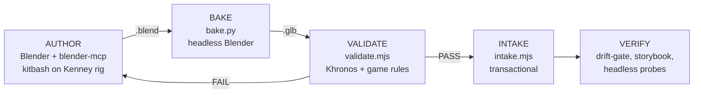

# Asset Forge — Blender→game mob pipeline (design)

- **Date:** 2026-07-15
- **Status:** draft for review
- **Backlog:** I-004 (`asset-forge`) — refine to F-NNN once this spec is approved
- **Depends on:** F-002 asset pipeline (shipped, release/1.2)

## Problem

F-002 shipped the *feed* half of the asset story: manifest v2 with three-tier
resolve (bespoke → seed → procedural capsule), `art-source/` LFS intake with a
license ledger, a CI drift-gate, the storybook, and an `AnimationController`
driving glTF clips by name. What's missing is the *build* half: a repeatable
path from "idea for a mob" to a validated `.glb` mapped in the manifest.
Today nothing validates a `.glb` itself against `docs/asset-delivery-spec.md`
— which is exactly how the known seed-scale bug (Kenney characters ~0.7u vs
the 1.8u target) entered the repo unnoticed.

## Goal

1. A reusable pipeline (`tools/asset-forge/`) that takes a Blender-authored
   mob from `.blend` to a spec-validated `.glb` wired into the manifest.
2. One proof mob shipped through it end-to-end: **`mob:aggressive` flipped
   `seed` → `bespoke`** with a kitbashed model, visible in storybook and game.

Non-goal: fixing the seed-tier scale bug (stays an F-002 follow-up; the
validator only *reports* it), new mob types, texture atlasing, procedural
variant generation.

## Design overview

The pipeline splits at the creative/mechanical boundary: authoring is an
interactive Blender session (driven by human or agent via blender-mcp);
everything after the `.blend` is saved is deterministic, scripted, and gated.



| Stage | Tool | Deterministic | Gate |
|---|---|---|---|
| Author | Blender (interactive) | no — creative | runbook rules |
| Bake | `tools/asset-forge/bake.py` | yes | Blender ≥ 4.5 asserted |
| Validate | `tools/asset-forge/validate.mjs` | yes | exit ≠ 0 blocks intake + CI |
| Intake | `tools/asset-forge/intake.mjs` | yes | runs validate first; transactional |
| Verify | existing rails | yes | drift-gate, `ATLAS_VERIFY_*` probes |

## Stage: AUTHOR (runbook, not script)

Documented in `tools/asset-forge/README.md`. The recipe:

1. Import a donor from `art-source/seed/kenney-mini-characters/*.glb`
   (CC0) into Blender.
2. **May change:** mesh geometry (sculpt, proportions, part swaps between
   donors), materials, textures (new colormap or per-mob texture).
3. **Must not change:** armature bone names/hierarchy, armature modifiers,
   animation clip names. The 32 shared Kenney clips are the whole point of
   the kitbash strategy — they come free and already match the
   `AnimationController` default clip-map.
4. **Scale to target:** donors are ~0.7u tall; the delivery spec (and the
   height rule below) demand 1.6–2.0u. Scale the whole kitbash up (~2.4×)
   and apply transforms. Caution: applying scale on an armature can distort
   animation location F-curves — if it does, VALIDATE's height/clip/skeleton
   net catches it; the runbook documents the working Blender procedure once
   established during implementation.
5. Save to `art-source/bespoke/<asset_name>/source/<asset_name>.blend`
   (Git LFS; `snake_case` per the delivery spec).

Violations of rule 3 are caught mechanically by VALIDATE (skeleton diff +
clip checks), so the runbook is guidance, not the only line of defense.

<div class="callout warn">
<b>Accepted visual mismatch:</b> a spec-correct 1.8u proof mob will visibly
dwarf the ~0.7u seed mobs in-game until the F-002 seed-scale follow-up lands.
This is deliberate — the proof mob is built RIGHT and the seed set is what's
off-spec; shipping it front-loads pressure to do the seed scale pass rather
than propagating the bug into new assets.
</div>

## Stage: BAKE

`bake.py <asset>.blend [-o out.glb]` — runs Blender headless
(`--background --python`), asserts Blender ≥ 4.5, exports glTF 2.0 binary
per the delivery spec: transforms applied, textures embedded, animations
included, feet pivot preserved.

**Provenance stamp:** writes into the glb's `asset.extras`:

```json
{ "atlasForge": { "blender": "4.5.11", "blendSha256": "<hash of source .blend>", "forge": "<forge version>" } }
```

CI cannot run Blender, so a hand-exported glb *can* enter the repo — the
stamp makes that visible instead of silent: VALIDATE warns when the stamp is
absent. Provenance, not a security boundary.

## Stage: VALIDATE

`validate.mjs <file.glb> --kind character [--tier bespoke]` and
`validate.mjs --manifest <manifest.json>` (validates every entry whose file
exists; `bespoke` entries fail hard, `seed` entries warn-only so the known
scale bug doesn't redden CI).

Two layers:

1. **Structural conformance** — the official Khronos glTF-Validator (npm
   package `gltf-validator`); `@gltf-transform/core` for reading geometry,
   animations, and skeleton data for the game rules. Not hand-rolled.
2. **Game rules** (this repo's delivery spec):

| Check | Rule (character kind) | Severity |
|---|---|---|
| Height | bounding-box Y ∈ [1.6, 2.0] u | fail (bespoke) / warn (seed) |
| Pivot | min-Y ≈ 0 (feet on ground, |minY| ≤ 0.02u), X/Z centered | fail |
| Clips | every clip named by the effective clip-map (default Kenney map, or the manifest entry's `anims` override) exists in the glb | fail |
| Skeleton | bone-name set == reference `rig-reference/kenney-mini.bones.json` (generated once from a pristine donor) | fail |
| Tri budget | ≤ 10 000 triangles | fail |
| Texture budget | ≤ 1024×1024 per texture | fail |
| License | asset has an entry in `art-source/LICENSES.md` | fail |
| Naming | `snake_case`, no spaces | fail |
| Provenance | `asset.extras.atlasForge` present | warn |

Budgets and height ranges live in `tools/asset-forge/forge.config.json`
(per-kind), not hardcoded — props/projectiles later get their own rows.

**Known limitation:** forward-axis (−Z) is not reliably detectable from a
static glb; bake settings + runbook own that check.

## Stage: INTAKE (transactional)

`intake.mjs <asset>.glb --key mob:aggressive` does, in order:

1. Run VALIDATE — any failure aborts with no side effects.
2. Stage: copy glb → `game-client/assets/characters/<asset_name>.glb`.
3. Write manifest entry **last**: `tier:"bespoke"`, `scene`, `source:"internal"`,
   `license`, `kind:"character"` (plus `anims` override only if clip names
   deviate — for kitbashes they don't).
4. Post-check: run the existing drift-gate (`scripts/check_asset_manifest.mjs`).
5. **On any failure after step 1: rollback** — restore the manifest from its
   pre-run copy and remove the staged glb. Re-running from any state is safe;
   same key = idempotent overwrite.

Reminder in output: commit the Godot `.import` sidecar together with the glb
(otherwise other machines re-import with different settings).

## Stage: VERIFY (existing rails, no new code)

Storybook card renders with working animation dropdown; headless
`ATLAS_VERIFY_ENTITYVIEW=1` and `ATLAS_VERIFY_ANIM=1` probes pass; windowed
eyeball check in game.

## CI wiring

Extend the existing asset job in `.github/workflows/ci.yml`:
after the drift-gate, run `validate.mjs --manifest game-client/assets/manifest.json`.
Bespoke failure = red; seed issues = warnings. glb parsing is milliseconds
per file; no Blender in CI.

## Dependencies & layout

```
tools/asset-forge/
  package.json          # own Node context: @gltf-transform/*, Khronos validator
  forge.config.json     # per-kind budgets
  bake.py               # headless Blender export
  validate.mjs          # structural + game rules
  intake.mjs            # transactional intake
  rig-reference/kenney-mini.bones.json
  README.md             # authoring runbook (kitbash rules, .import note)
  tests/                # jest + fixture glbs
```

Deps stay out of the server pnpm workspace — third Node context in the repo,
accepted and isolated.

## Error handling

- Runtime is already self-healing (F-002): broken path → tier fallback,
  missing clip → warn+noop. This feature never touches that code.
- VALIDATE failures are the designed loop-back to AUTHOR; messages must name
  the exact rule and measured value (e.g. `height 0.72u, expected 1.6–2.0u`).
- INTAKE is all-or-nothing (see rollback above).
- BAKE aborts on Blender-version mismatch or missing armature.

## Testing

- `validate.mjs`: jest against committed fixture glbs — one good, one
  too-short, one missing a clip, one with a renamed bone, one without
  provenance. Fixtures generated once by `bake.py` from tiny source blends
  and committed (small binaries, LFS).
- `intake.mjs`: dry-run mode + a test that forces a post-copy failure and
  asserts full rollback.
- Proof mob = the integration test (acceptance below).

## Acceptance criteria (proof mob)

1. `mob:aggressive` mapped `tier:"bespoke"` to a kitbashed model authored via
   blender-mcp, baked + validated + intaken by the forge scripts only.
2. VALIDATE passes (all fail-severity rules); provenance stamp present.
3. Drift-gate green; CI validate step green (seed warnings expected).
4. Storybook shows the new model; animation dropdown plays its clips.
5. Headless `ATLAS_VERIFY_ENTITYVIEW=1` and `ATLAS_VERIFY_ANIM=1` pass.
6. Windowed run: the aggressive mob visibly uses the new model with
   working idle/walk/attack/death animations.

## Future (explicitly out of scope)

- Procedural "mob recipes" (parameterized kitbash variants) layered on AUTHOR.
- Shared texture atlas pass when per-mob textures pressure memory.
- Seed-tier scale correction (F-002 follow-up; validator already measures it).
- Props/projectiles/zones through the same forge (config rows exist, no work).
