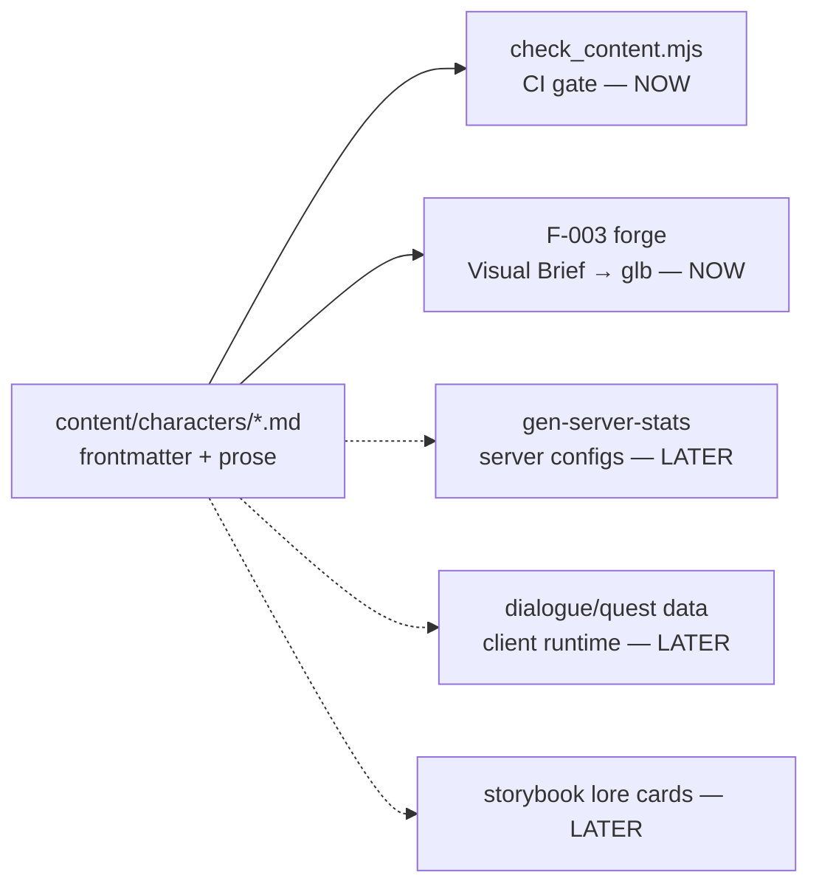
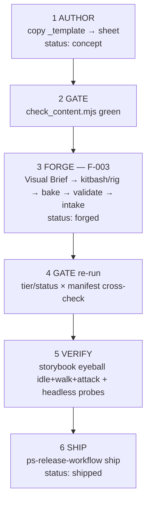

# Game Content Authoring Pipeline — Design

**Date:** 2026-07-19 · **Idea:** I-006 · **Status:** approved (brainstormed + approved in session, this doc is the canonical spec)

## Goal

A scalable, clean, robust workflow for creating **game content** — characters, story, maps — as schema-validated source files that build into final in-game assets and data. Builds directly on the shipped asset pipeline: F-002 (manifest + drift-gate), F-003 (Blender asset-forge), F-A (sourcing + license gate).

<div class="callout info">Content design is the missing layer: F-002/F-003/F-A move <em>binary assets</em>; nothing yet captures <em>what</em> a character/story/map is, or drives asset creation from a design source of truth.</div>

## Decisions (approved)

| # | Decision | Choice |
|---|----------|--------|
| 1 | Consumer model | **Staged**: production briefs now, runtime-compiled data later — structured source from day one so build targets grow without rewrites |
| 2 | Proof lane | **Characters** first; story + maps are stub folders with minimal schemas |
| 3 | v1 output boundary | **Design→asset only** — stats are descriptive enums; server configs keep owning balance numbers until a future stats-codegen |
| 4 | Proof subject | **Both**: retrofit sheets for the 2 bespoke mobs + 1 brand-new character sheet-first end-to-end |
| 5 | Structure | **`content/` root package**: markdown + typed YAML frontmatter, per-type JSON Schemas, CI gate (`check_content.mjs`) |

## Source-of-truth boundary

`content/` is the source of truth for: character identity, roles, lore, visual briefs, content↔asset-key mapping, design intent (enum stats). It is **not** (yet) the source of truth for balance numbers — the sheet says `durability: high`, the server config says `hp: 120`. Flipping that is a roadmap item (stats-codegen), not a v1 concern; the parse surface (frontmatter) already supports it.



One parser, N build targets: every consumer reads the same frontmatter; adding a consumer never changes the source format.

## Layout

```
content/
  README.md                       # authoring runbook (pattern: docs/asset-intake.md)
  schemas/
    character.schema.json         # full — designed now
    story.schema.json             # stub — id, title, links[] only
    map.schema.json               # stub — id, title, links[] only
  characters/
    _template.md                  # copy-to-start template
    mob-aggressive-brute.md       # retrofit
    mob-defensive-guard.md        # retrofit
    <new-character>.md            # sheet-first proof
  story/
    bible.md                      # free prose for now (schema later)
  maps/
    .gitkeep
scripts/check_content.mjs         # the content gate (+ node --test suite)
```

## Character sheet format

One file per character: **YAML frontmatter** = typed contract, **prose body** = lore + visual brief.

```yaml
id: mob-aggressive-brute          # slug, must equal filename
assetKey: "mob:aggressive"        # must exist in generated/asset-keys.json
name: "Ashfang Brute"
role: enemy                       # enemy | boss | npc | player-skin
status: shipped                   # concept → forged → shipped
tier: bespoke                     # must match manifest tier for this key
stats:                            # descriptive enums in v1 (NOT numbers)
  archetype: bruiser              # bruiser | skirmisher | tank | caster | support
  durability: high                # low | mid | high
  speed: low
  threat: melee
links:
  story: []                       # future [[story-ids]]; empty ok in v1
```

Prose body, fixed headings enforced by template + gate: `## Lore`, `## Visual Brief` (silhouette, palette, scale target, donor/rig notes — the forge's input), `## Design Notes` (optional).

<div class="callout warn">Stats are enums, not numbers, on purpose: sheets state design intent; the server keeps owning balance until real codegen exists. No fake source-of-truth.</div>

## The content gate — `scripts/check_content.mjs`

Same skeleton and exit-code discipline as `scripts/check_asset_manifest.mjs`:

1. **Schema validation** — every `content/characters/*.md` frontmatter validates against `character.schema.json`; `id` must equal filename slug. Failure = **hard fail**.
2. **Forward link-check** — `assetKey` must exist in `colyseus-server/generated/asset-keys.json`; if `status: forged|shipped`, the key must resolve in `game-client/assets/manifest.json` at the claimed `tier`. Broken = **hard fail**.
3. **Reverse link-check (coverage)** — every character-kind asset key (`player`, `npc`, `mob:*`) without a sheet = **warn**, listed; `--require-complete` escalates warns to fails. Projectile/zone keys are out of scope (not characters).
4. **Structure check** — required prose headings present; `## Visual Brief` non-empty when `status: concept`. **Warn** in v1.

**CI wiring:** one step in `.github/workflows/ci.yml`, same job as the asset gate (needs `generated/asset-keys.json` + manifest, already checked out there). **Tests:** `node --test` fixtures for pass + each failure mode, pattern from the forge suite. **Dependency:** frontmatter parsing via `js-yaml` (verify presence at plan time; if absent, one devDependency — no framework).

## Authoring workflow



Steps 2–4 are identical commands for humans and agents; the sheet is the forge's only required input. Failure handling is inherited: forge intake is transactional (rollback); a red content gate just blocks CI — nothing to unwind.

## Proof plan

- **Retrofit** sheets for `mob-aggressive-brute` + `mob-defensive-guard` — lore + brief written *from* the existing models; proves the schema fits reality.
- **One new character, sheet-first**, through the full loop — proves the pipeline creates content. Candidate path: KayKit-rig-based (the proven organic-mesh route from F-003); the specific character concept is authoring-time creative work, not spec-locked.
- **Gate green in CI** with coverage warns listing the remaining sheetless character keys (player, npc, 4 mobs) — a visible, enumerable backlog.

## Follow-up roadmap (tracked, not lost)

1. **Remaining character sheets** → then flip `--require-complete` for character coverage.
2. **Stats-codegen** — enums → typed numbers; `gen-server-stats` emits server mob config; hand-tuned balance becomes a gate-checked override file.
3. **Story schema v1** — `story/entities/` + bidirectional `links.story` enforcement.
4. **Map pipeline** — map spec → Godot scene + server spawn/world data (own brainstorm; touches the sim/AOI).
5. **Storybook lore cards** — character cards render sheet lore/role from frontmatter.

Each item becomes its own `/ps-release-workflow:idea` when picked up.

## Out of scope (v1)

- Numeric stats / server config generation (roadmap #2)
- Quest/dialogue runtime, player-facing narrative text
- Map authoring (roadmap #4)
- Any change to existing forge/manifest/gate behavior — the content gate is additive

## Testing summary

- Gate test suite (`node --test`): schema pass/fail, forward-link fail, tier mismatch fail, coverage warn list, `--require-complete` escalation, heading structure warn.
- CI: gate wired next to the asset gate; green run on the proof branch is the acceptance evidence.
- End-to-end: new character's glb passes forge `validate.mjs`, manifest validate exit 0, storybook renders with correct badge, content gate green with its sheet at `status: forged`.
