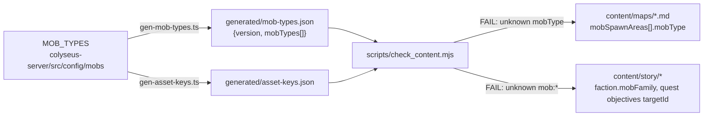

# Generated mob-types.json — mob refs WARN→FAIL <span class="topic-chip">content gate</span> <span class="topic-chip">codegen</span>

## Problem

A typo in an authored map's `mobSpawnAreas[].mobType` (e.g. `agressive`) passes
the content gate today — `check_content.mjs` step (4) only <mark>WARNs</mark>,
because the repo-root ESM gate cannot import the server's TypeScript mob ids
and hardcoding them would silently drift. At runtime the spawn area quietly
spawns nothing: the **silent-empty-spawn** bug class.

The story layer is partially covered: `faction.mobFamily[]` already hard-FAILs
against `asset-keys.json` (whose `mob:<id>` keys come from the same `MOB_TYPES`
loop — the two id-sets cannot diverge today), but
`quest.objectives[].targetId` of form `mob:*` stays WARN-only, explicitly
deferred to this feature by F-012's plan ("when I-019 lands, flip those two
WARNs to FAILs").

<div class="callout danger">
A content author can ship a map spawn area or quest objective that references
a mob the server has never heard of, and nothing red appears anywhere — only a
WARN line nobody is required to read.
</div>

## Design

Mirror the proven `gen-asset-keys` codegen: emit a machine-readable list of
valid mob ids from the live server config, and have `check_content.mjs` treat
it as the single source of truth.



### 1. Codegen — `gen-mob-types`

- `colyseus-server/scripts/codegen/gen-mob-types.ts` + `gen-mob-types.sh`
  wrapper, structured exactly like `gen-asset-keys.{ts,sh}` (ts-node
  `--transpile-only`, single optional output-path arg).
- Imports `MOB_TYPES` from `../../src/config/mobs`; emits
  `colyseus-server/generated/mob-types.json`:

```json
{
  "version": 1,
  "mobTypes": [
    "aggressive",
    "balanced",
    "defensive",
    "double_attacker",
    "hybrid",
    "spear_thrower"
  ]
}
```

- Deterministic: dedup by id, stable lexicographic sort, trailing newline.
  The artifact is **committed**; CI regenerates it before the gates run (same
  model as `asset-keys.json` — no `git diff --exit-code` drift step exists for
  either). **Authoring workflow to document** (README of `content/` or the
  codegen header): add a mob definition → run `gen-mob-types.sh` → commit the
  refreshed artifact, or local `check_content.mjs` runs will FAIL against the
  stale file.
- Test beside `gen-asset-keys.test.ts`, but **importing the exported
  `genMobTypes()` directly** (ids present, sorted, deduped, version field) —
  not exec-ing the bash+ts-node pipeline like `gen-asset-keys.test.ts` does;
  one full ts-node boot in that suite is enough.

### 2. Gate — `check_content.mjs`

- New `--mob-types <path>` flag, default
  `colyseus-server/generated/mob-types.json` (mirrors `--keys`).
- **Missing, unparseable, or shape-invalid file (`mobTypes` not a string
  array) → one hard FAIL** and the mob
  checks are skipped (they cannot silently pass). This deliberately does NOT
  mirror the story.json/bible.md soft-skip: the file is committed and
  CI-refreshed, so absence means broken setup, and a soft-skip would recreate
  the exact silent hole this feature closes.
- **Maps:** step (4) per-area WARN becomes a FAIL when
  `mobSpawnAreas[].mobType` is not in the set. Message lists the valid ids:
  `maps/x.md: mobType "agressive" (area "a1") is not a server mob id (valid: aggressive, balanced, …)`.
- **Story:** for `faction.mobFamily[]` entries and
  `quest.objectives[].targetId` values of form `mob:<id>` — strip the `mob:`
  prefix, FAIL if the id is not a server mob type. The existing
  mobFamily→asset-keys check stays; the new check is what makes `targetId`
  enforced at all, and makes both refs mean "actually spawnable" rather than
  "renderable" if the two sets ever diverge. (Post-F-012 this lands in the
  story-graph code — `scripts/lib/story.mjs` / `resolveStoryRefs` — not the
  current single-file `checkStory`.)
- **Prefix escape hatch (added 2026-07-22):** an objective with
  `type: "MOB_KILLED"` whose `targetId` does NOT start with `mob:` is also a
  hard FAIL. `quest.schema.json` leaves `targetId` as free-form `minLength: 1`
  (unlike `mobFamily`'s `^mob:[a-z0-9_]+$` pattern), so without this rule a
  prefixless typo (`"aggressive"`, `"mbo:aggressive"`) would silently skip
  every mob check — the same bug class, one typo over. Keyed on the objective
  `type`, not a blanket schema pattern, so future non-mob objective types stay
  legal.

### 3. CI

Extend the existing **"Codegen asset keys"** step in `.github/workflows/ci.yml`
to also run `gen-mob-types.sh` — one refresh point before the gates, no new
step ordering to reason about.

### 4. Tests

`scripts/tests/check_content.test.mjs` fixtures:

| Fixture | Expected |
|---|---|
| map with valid `mobType` | green |
| map with typo'd `mobType` | FAIL naming file, area, valid ids |
| `mob-types.json` absent/malformed (explicit bogus `--mob-types` path) | FAIL (single failure), mob checks skipped |
| story `mobFamily` / objective `targetId` with bogus mob id | FAIL |
| `MOB_KILLED` objective whose `targetId` lacks the `mob:` prefix | FAIL |

**Fixture hermeticity (in scope):** because the `--mob-types` default resolves
script-relative to the real committed artifact, every existing `runGate`
helper — `scripts/tests/check_content.test.mjs` AND F-012's story test files —
must be retrofitted to pass an explicit fixture `--mob-types` file. Otherwise
all fixture tests silently depend on the live server mob set and go
non-hermetic (renaming a mob def would flip unrelated tests).

## Sequencing dependency

<div class="callout warn">
<b>F-012 first.</b> F-012 (Epic Story Pipeline, in flight on
<code>feat/F-012</code>) rewrites <code>checkStory</code> into the 7-file
story-graph loader — the same code this feature's story flip touches.
Implement I-019 <b>after F-012 ships to release/1.4</b>; its plan flips the
two WARNs F-012 leaves behind.
</div>

## Doc updates (in scope)

- `scripts/check_content.mjs:300` comment names `content/schemas/mob-types.json`
  as the anticipated path — update to the real
  `colyseus-server/generated/mob-types.json` when implementing.
- `content/maps/atlas-frontier.md` body text documents the WARN-pending
  behavior — update to reflect the hard gate.

## Out of scope

- Runtime consumption of `mob-types.json` — the server already imports
  `MOB_TYPES` directly; the artifact is for out-of-process gates only.
- The legacy hardcoded `colyseus-server/src/config/mapConfig.ts` (covered by
  server-side TypeScript imports and existing tests).
- Godot client anything.

## Decisions (locked 2026-07-22)

1. **Scope:** maps + story refs (both flips), not maps-only.
2. **Mechanism:** dedicated `mob-types.json` artifact — not derived from
   `asset-keys.json`. Today the two sets are derivationally identical (same
   `MOB_TYPES` loop), so this buys nothing *now*; the value is guarding the
   future divergence where a renderable-only `mob:*` asset key (decorative
   variant, unreleased art) must not count as spawnable. Also honors the
   contract *filename* F-012's plan and the `check_content.mjs` comment
   reference (the comment's anticipated path differs — see Doc updates).
3. **Missing file:** hard FAIL, never soft-skip.
