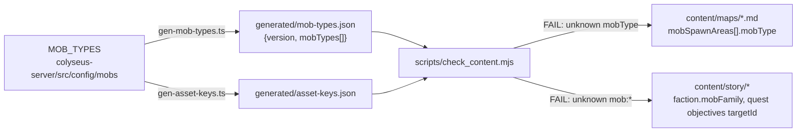

# Generated mob-types.json — mob refs WARN→FAIL <span class="topic-chip">content gate</span> <span class="topic-chip">codegen</span>

## Problem

A typo in an authored map's `mobSpawnAreas[].mobType` (e.g. `agressive`) passes
the content gate today — `check_content.mjs` step (4) only <mark>WARNs</mark>,
because the repo-root ESM gate cannot import the server's TypeScript mob ids
and hardcoding them would silently drift. At runtime the spawn area quietly
spawns nothing: the **silent-empty-spawn** bug class.

The same hole exists in the story layer: `faction.mobFamily[]` and
`quest.objectives[].targetId` of form `mob:*` stay WARN-only, explicitly
deferred to this feature by F-012's plan ("when I-019 lands, flip those two
WARNs to FAILs").

<div class="callout danger">
A content author can ship a map or quest that references a mob the server has
never heard of, and nothing red appears anywhere — only a WARN line nobody is
required to read.
</div>

## Design

Mirror the proven `gen-asset-keys` codegen: emit a machine-readable list of
valid mob ids from the live server config, and have `check_content.mjs` treat
it as the single source of truth.



### 1. Codegen — `gen-mob-types`

- `colyseus-server/scripts/codegen/gen-mob-types.ts` + `gen-mob-types.sh`
  wrapper, structured exactly like `gen-asset-keys.{ts,sh}` (ts-node
  `--transpile-only`, single optional output-path arg).
- Imports `MOB_TYPES` from `../../src/config/mobs`; emits
  `colyseus-server/generated/mob-types.json`:

```json
{
  "version": 1,
  "mobTypes": [
    "aggressive",
    "balanced",
    "defensive",
    "double_attacker",
    "hybrid",
    "spear_thrower"
  ]
}
```

- Deterministic: dedup by id, stable lexicographic sort, trailing newline —
  so a git-diff drift check is meaningful. The artifact is **committed**.
- Unit test beside `gen-asset-keys.test.ts` (ids present, sorted, deduped,
  version field).

### 2. Gate — `check_content.mjs`

- New `--mob-types <path>` flag, default
  `colyseus-server/generated/mob-types.json` (mirrors `--keys`).
- **Missing/unparseable/schema-invalid file → one hard FAIL** and the mob
  checks are skipped (they cannot silently pass). This deliberately does NOT
  mirror the story.json/bible.md soft-skip: the file is committed and
  CI-refreshed, so absence means broken setup, and a soft-skip would recreate
  the exact silent hole this feature closes.
- **Maps:** step (4) per-area WARN becomes a FAIL when
  `mobSpawnAreas[].mobType` is not in the set. Message lists the valid ids:
  `maps/x.md: mobType "agressive" (area "a1") is not a server mob id (valid: aggressive, balanced, …)`.
- **Story:** for `faction.mobFamily[]` entries and
  `quest.objectives[].targetId` values of form `mob:<id>` — strip the `mob:`
  prefix, FAIL if the id is not a server mob type. The existing
  mobFamily→asset-keys check stays; this adds "is actually spawnable".

### 3. CI

Extend the existing **"Codegen asset keys"** step in `.github/workflows/ci.yml`
to also run `gen-mob-types.sh` — one refresh point before the gates, no new
step ordering to reason about.

### 4. Tests

`scripts/tests/check_content.test.mjs` fixtures:

| Fixture | Expected |
|---|---|
| map with valid `mobType` | green |
| map with typo'd `mobType` | FAIL naming file, area, valid ids |
| `mob-types.json` absent/malformed | FAIL (single failure), mob checks skipped |
| story `mobFamily` / objective `targetId` with bogus mob id | FAIL |

## Sequencing dependency

<div class="callout warn">
<b>F-012 first.</b> F-012 (Epic Story Pipeline, in flight on
<code>feat/F-012</code>) rewrites <code>checkStory</code> into the 7-file
story-graph loader — the same code this feature's story flip touches.
Implement I-019 <b>after F-012 ships to release/1.4</b>; its plan flips the
two WARNs F-012 leaves behind.
</div>

## Out of scope

- Runtime consumption of `mob-types.json` — the server already imports
  `MOB_TYPES` directly; the artifact is for out-of-process gates only.
- The legacy hardcoded `colyseus-server/src/config/mapConfig.ts` (covered by
  server-side TypeScript imports and existing tests).
- Godot client anything.

## Decisions (locked 2026-07-22)

1. **Scope:** maps + story refs (both flips), not maps-only.
2. **Mechanism:** dedicated `mob-types.json` artifact — not derived from
   `asset-keys.json` — keeping "spawnable mob" semantically distinct from
   "renderable asset", and honoring the contract name both the
   `check_content.mjs` comment and F-012's plan already reference.
3. **Missing file:** hard FAIL, never soft-skip.
