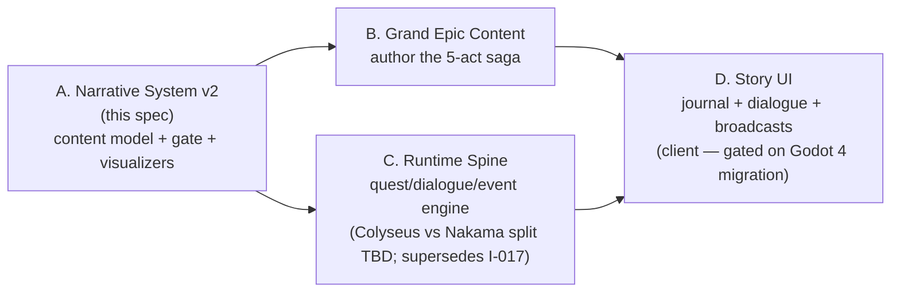

# Narrative System v2 — Grand Epic Program (Sub-project A)

**Date:** 2026-07-22
**Status:** Approved design (brainstormed with user)
**Depends on:** F-012 Epic Story Pipeline (shipped, release/1.4)
**Program:** A of A→B→C→D (see Program Map)

<strong>Design principle (user-set, binding):</strong> <mark>Simplicity is first-class; immersion rides on top of it.</mark> The smallest possible schema surface; immersion is delivered by <em>content</em> (lore fragments, events, fates), never by machinery.

## 1. Purpose

Upgrade the F-012 story content model so it can carry a **5-act, saga-scale epic** inspired by four references:

- **Ragnarok Online** — danger-tiered regions, mob families per region, towns-as-safe-hubs.
- **Hollow Knight / Silksong** — fragmented environmental storytelling; a fallen-kingdom mystery pieced together from discoverable fragments.
- **Game of Thrones** — faction politics in the foreground, no plot armor for named characters, a slow-burn existential threat behind the human conflict.

The creative premise (locked): **buried mystery + politics above.** The frontier is a fallen kingdom. The Stoneguard — "a defensive order that outlived what it guarded" — sealed something that is slowly waking. Living factions scheme over reopened territory, unaware the real war is underneath. The deep story is delivered almost entirely through lore fragments, not exposition.

## 2. Program Map (decomposition)

This spec covers **A only**. Each sub-project gets its own spec → plan → implementation cycle.

<strong>Hard dependency:</strong> D lands on the client, which is migrating Unity+Flutter → <strong>Godot 4 (C#)</strong> per the 2026-07-11 platform decision. D cannot start before the Godot spike.

## 3. Scale targets A must structurally support

| Dimension | Target |
|---|---|
| Acts | 5 (first-class nodes) |
| Regions | 8–10, danger-tiered |
| Factions | ~8 |
| Quests | 25–40 |
| Named characters | mortal — can die in events |
| Lore fragments | 30+ across multiple mystery threads |

These are targets for **B**; A must make them expressible and validatable, nothing more.

## 4. Content model changes

### 4.1 New kind: `act-*` (story spine)

Five nodes `act-1`…`act-5`. Fields: `id`, `kind: "act"`, `title`, `summary`, `order` (integer 1–5), `theme` (one line). New file `content/story/acts.json`, new schema `content/schemas/act.schema.json`.

- `arc` gains **required** `actId` → replaces today's implied act number (and retires the triggeredBy act-order WARN's guesswork).
- Gate: every `arc.actId` resolves; act `order` values are contiguous 1..N with no duplicates.

### 4.2 New kind: `lore-*` (the immersion layer)

Hollow-Knight-style discoverable fragments. New file `content/story/lore.json`, schema `content/schemas/lore.schema.json`. Fields:

- `id`, `kind: "lore"`, `title`, `summary`
- `body` — the discoverable text itself (what the player reads in the world).
- `anchor` — **one** node id of any kind (region, character, faction, event, quest…): where/what this fragment is attached to. An edge; FAIL on dangling.
- `thread` — plain string naming the mystery thread this fragment feeds (e.g. `"the-first-claim"`). Not an id-space, not a new file — just a tag.

Gate: **WARN** when a thread has fewer than 2 fragments (a thread of one isn't a mystery). No other thread machinery.

### 4.3 One unlock mechanism: `unlockedBy`

Optional `unlockedBy: [id, …]` array on **quest, dialogue, event**. Semantics come from the id prefix — no type field, no expressions:

| Referenced id | Meaning |
|---|---|
| `quest-*` | that quest completed |
| `event-*` | that event fired |
| `act-*` | that act reached |

- Flat array = **AND only.** No OR, no nesting, no flags, no counters.
- **Migration:** today's singular `quest.prereq` is removed; existing prereqs become `unlockedBy: ["quest-…"]`. Exactly one mechanism remains.
- Gate: every ref resolves; the existing prereq-DAG cycle check (`assertQuestPrereqDag`) generalizes to the whole unlock graph (cycle anywhere = FAIL).
- This array is the **exact contract the runtime (C) will execute.** C implements nothing the gate didn't already validate.

### 4.4 Character fates (minimal GoT mortality)

`character` gains:

- `status`: `"alive" | "dead" | "missing"` (default `alive`).
- optional `diedAt`: an `event-*` id (edge; FAIL on dangling).

Gate: `diedAt` present ⇒ `status` ≠ `alive`. **Deferred by design:** dead-speaker timing rules and posthumous-dialogue flags — authoring discipline in B handles those; no schema for them.

## 5. Gate, mirrors, visualizers

**New edges** (all three mirrors updated together; explorer smoke test continues to assert parity):

`arc.actId → act` · `lore.anchor → any` · `character.diedAt → event` · `{quest,dialogue,event}.unlockedBy[] → quest|event|act`

- **`scripts/check_content.mjs`** — new resolutions above; act-order contiguity; thread-size WARN; fate consistency; generalized cycle check.
- **`scripts/gen_story_graph.mjs`** — Mermaid groups nodes by act (subgraph per act; act-less kinds in a shared lane). Still deterministic; drift gate unchanged.
- **`tools/story-explorer/`** — `EDGE_SPECS` gains the new edges; UI gains an act lane/ordering and a lore-thread filter; lore nodes render `body` in the side panel.

**WARN/FAIL discipline unchanged:** dangling refs and cycles FAIL; coverage/orphan/thread-size WARN; warnings exit 0, failures exit 1. `mob:*` refs stay WARN until I-019.

## 6. Seed migration

The shipped 21-node seed migrates in-place: add `act-1` ("Meadow Awakening") and `act-2` ("Icefield Reckoning") nodes; arcs get `actId`; `quest.prereq` → `unlockedBy`; old `prereq` field removed from schema. All existing tests updated; green before and after per the usual red/green fixture pattern.

## 7. Antagonist Doctrine (binding on B)

<strong>The villain attacks the story's core theme, not the hero.</strong> These five principles (user-set) govern all epic authoring in B.

1. **The Philosophical Inverse (Foil).** The Expedition's creed is *reclamation* — map it, hold it, reopen it. The buried threat is the inverse made real: it wants no territory; it **is the argument that claiming is what broke this world**. The Stoneguard weren't guarding a treasure from the world — they were guarding the world from what claiming awakens.
2. **Immaterial Motivation.** It cannot be bought, reasoned with, or intimidated, because its goal is to prove a thesis: *everything held will be abandoned; every camp becomes a ruin.* The frontier's existing ruins are its evidence.
3. **The Mirror of Hypocrisy.** It isn't 100% wrong. The Expedition is the *next* wave of claimers, walking over the ruins of the previous ones. Lore and dialogue let the player feel this before any character says it.
4. **Collateral Targeting.** It never appears as a punchable boss until very late, if ever. It hollows factions, turns loyalty into desertion, and kills named characters — expressed entirely with existing machinery: **events + `diedAt` fates + `unlockedBy` chains.** No villain-specific schema exists, deliberately.
5. **Working name:** *the Unclaimed King* — the fallen kingdom's own claimant, become the argument against claiming. B refines or replaces the name.

**Act sketch** (creative outline for B; structural proof for A):

| Act | Working title | Movement |
|---|---|---|
| 1 | Meadow Awakening *(exists)* | Foothold; first ruins; first lore threads open. |
| 2 | Icefield Reckoning *(exists)* | The Stoneguard's silence; first hint the Guard guarded a **seal**, not a treasure. |
| 3 | The Claiming | Politics peak — Thornveil, Expedition, Stoneguard remnant contest the opened land. Collateral targeting begins: desertions, a named death. |
| 4 | The Hollowing | The thesis made manifest: camps fail, alliances invert, a major character dies. The Expedition's creed is publicly questioned. |
| 5 | The Answer | The Expedition must answer the thesis — hold differently, or let go. The climax is an authored choice in canon, not a boss health bar. |

<strong>Single canon, explicitly.</strong> This is a shared-world multiplayer server: canon cannot fork per player. Dilemmas are <em>authored</em> — they happen in the story and players live through them. This is what keeps AND-only <code>unlockedBy</code> sufficient. Branching choice is out of scope for the whole program (a possible far-future season mechanic).

## 8. Out of scope for A

- Per-act faction stance matrices (politics evolve via events instead).
- Flag registries, OR/nested conditions, counters, reputation.
- Any runtime code (C), any client work (D).
- Posthumous-dialogue rules and dead-speaker timing validation.
- Branching player choice (out for the whole program — single canon).

## 9. Testing

Same discipline as F-012: red/green fixtures per gate rule (act contiguity, unlock-graph cycle, lore anchor resolution, thread-size WARN, fate consistency); explorer smoke test asserts edge-mirror parity including the four new edge kinds; Mermaid drift gate stays deterministic; seed migration keeps `check_content.mjs` green and `--require-complete` exit 0. Node quirk: always `node --test tests/*.test.mjs` (bare dir fails on Node 26).
