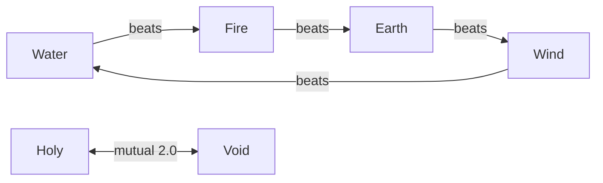

# World Wisdom: magic elements + schools + 8 races x 8 classes (lore + gameplay classes)

## Problem

The Undertow world has deep history/politics/economy but no knowledge-and-power system:
who can use magic, who teaches what, what classes exist. Without it, character/mob/skill
design has no spine, and the new 8-race x 8-class artwork (already in the storybook,
commit 4bd18f8) has no canon behind it.

## Owner decisions

### Locked 2026-07-27 (initial capture, chat)

1. **Magic is WIDESPREAD in the current era** — not lost/shattered knowledge.
2. **Void is NOT tied to Cindervast** — Cindervast's fall keeps its own cause
   (Last King + unmaking weapon).
3. **Robot = clockwork automata powered by MAGIC STONES** (not wind-up, not sci-fi).
4. **This is BOTH a gameplay class system AND lore** — the 8x8 class art grid is the
   visual reference for playable classes.

### Locked 2026-07-27 (brainstorm session, all former open questions resolved)

5. **No fuel scarcity.** Combat magic is cast from personal mana OR magic stones;
   stones are cheap, common, mined in many towns. (Rejected: scarcity economics.)
6. **Antimagic Runes are why war looks like steel.** Standard war equipment/armor
   carries engraved antimagic runes that null ordinary combat magic; only
   **High-Tier magic** breaks rune wards. High-tier casters are rare (mastery, not
   money), so steel is the reliable battlefield weapon.
7. **Rune-craft is public knowledge** — every town can engrave wards. Nobody
   monopolizes defense. Gildmark's arms edge is industrial scale/quality, per
   existing canon, not a craft monopoly.
8. **Elemental rules: pure RO-style table, self-contained.** No Genshin-style
   reaction system — cut, not deferred.
9. **Holy added as the 6th element**, opposed pair with Void (supersedes the
   original 5-element list). Healer/Bellfaith = Holy. War-scar monsters = Void-line.
10. **Race x class: free choice across all 64 combinations + small per-race stat
    leans.** No forbidden classes, no meta locks.

## Magic Model (canon)

1. Magic is widespread and everyday. Fuel is never the limit: cast from personal
   mana or burn cheap magic stones.
2. Antimagic runes are standard on war gear (armor, shields, siege equipment).
   Ordinary combat magic fails against warded targets; High-Tier magic breaks wards.
   High-Tier casters are few — the bottleneck is mastery (years of school training),
   not materials.
3. Rune-craft is a public craft; every town engraves its own wards. The world is
   balanced by mutual protection, not by monopoly.
4. **Novel/canon reconciliation — zero backport needed.** The finished novel and
   canon.md never depict battle magic; every magic artifact on the page (Bellfaith
   bells, Gildmark mirror tower, lovers' ink) is utility/infrastructure magic, which
   fits this model exactly. War scenes read as steel because everyone is rune-warded
   and POV characters are ordinary soldiers; the caravan burned by ordinary fire
   (runes stop spells, not torches). This spec only ADDS lore; it changes nothing
   written.

## Elemental rules (RO-style table, canon for lore AND gameplay)

**6 elements**: a 4-element natural cycle + an opposed pair + Neutral for pure
physical.

Damage multiplier table (row = attack element, column = defender element):

| atk \ def | Neutral | Earth | Water | Wind | Fire | Holy | Void |
|-----------|---------|-------|-------|------|------|------|------|
| **Neutral** | 1.0 | 1.0 | 1.0 | 1.0 | 1.0 | 1.0 | 1.0 |
| **Earth**   | 1.0 | 0.5 | 1.0 | **2.0** | 0.5 | 1.0 | 1.0 |
| **Water**   | 1.0 | 1.0 | 0.5 | 0.5 | **2.0** | 1.0 | 1.0 |
| **Wind**    | 1.0 | 0.5 | **2.0** | 0.5 | 1.0 | 1.0 | 1.0 |
| **Fire**    | 1.0 | **2.0** | 0.5 | 1.0 | 0.5 | 1.0 | 1.0 |
| **Holy**    | 1.0 | 1.0 | 1.0 | 1.0 | 1.0 | 0.5 | **2.0** |
| **Void**    | 1.0 | 1.0 | 1.0 | 1.0 | 1.0 | **2.0** | 0.5 |

Rules in words:

- Cycle advantage = **x2.0** (double bonus — owner wants element use encouraged);
  reverse of the cycle = x0.5; same element vs itself = x0.5.
- **Holy <-> Void = x2.0 both directions** — the special duel pair (cycle advantages
  are one-directional; this pair is mutual).
- Neutral deals and receives x1.0 everywhere — the safe baseline. Elements are
  high-risk/high-reward: know the target, get x2.0; guess wrong, get x0.5. That
  asymmetry is the incentive to learn monster elements.
- Attack element rides on the weapon/skill; defense element rides on armor/monster,
  RO-style. Players default to Neutral armor; elemental armor is opt-in (resist one
  element at the cost of a x2.0 weakness) — keeps PvP from becoming pure
  rock-paper-scissors while PvE rewards element knowledge.
- Balance note: big damage swings live mostly in PvE (monsters carry declared
  elements); numbers are round (2, 1, 1/2) — one table lookup per hit, fits the
  20 FPS authoritative sim.
- **War-scar monsters are Void-line** (weak to Holy) → Healer/Bellfaith has a clear
  combat role, consistent with the church's healing monopoly in canon.

## Wisdom branches, schools, towns

| Branch | School(s) | Home town(s) | Element / craft |
|--------|-----------|--------------|-----------------|
| **Magic** | Elements Schools (per element) | Embervale (Fire/Earth — mining town), Norhollow + Rooktide (Water/Wind) | Earth, Water, Wind, Fire |
| **Physical** | Sword / Spear / Dagger / Bow / Shield Schools | Every town (common craft) | Neutral; weapons can be endowed with elements via coatings/magic stones |
| **Mix** | Builder School (magic-stone automata), Summoner | Builder = Gildmark (Dwarf artisans; automata as the arms industry's next product line), Summoner = Millcross (stateless; war-scar beast affinity) | Automata = machinery + magic stones. Rune-craft is public, but Builder School teaches the engineering tier |
| **Healer** | Bell School | Bellfaith | **Holy** — the church monopolizes news AND healing (canon), and is the branch that counters Void |

**Void has no official school.** No town dares teach it openly; it is learned
outside the system (illegal manuals, private masters). This preserves decision #2
(Void not tied to Cindervast) while giving Void-line content its dark flavor.

## Races x classes

8 playable classes (art locked in storybook): Swordsman, Archer, Assassin, Spearman,
Mage, Summoner, Engineer, Healer.
8 races (art locked): Human, Demon, Dwarf, Immortal (Angel), Elf, Dragon, Beastkin
(kemonomimi: human face + animal ears/tail), Ogre.

- **Free choice across all 64 combinations** (art grid is complete). No forbidden
  classes, no meta locks.
- **Small per-race stat leans** — spec locks direction only; actual numbers are
  tuned at implementation time:

| Race | Lean | Race | Lean |
|------|------|------|------|
| Human | balanced (no lean) | Elf | +mana / cast speed |
| Ogre | +physical power / HP | Dwarf | +defense / craft |
| Demon | +Void affinity | Immortal | +Holy affinity |
| Dragon | +elemental magic power | Beastkin | +agility |

- Muscularity gradient canon unchanged: race axis (Elf lightest -> Ogre heaviest) x
  class axis (Mage lightest -> Swordsman heaviest), score 6.0-8.5.

## Out of scope

- **No elemental reaction system** (Genshin-style) — cut, not deferred.
- **No skill trees or per-class skill numbers** — this spec fixes canon, the element
  table, and the school structure only.
- **Server-side class storage** (Colyseus player schema vs Nakama meta) — phase C
  concern, unchanged.
- **No edits to the finished novel/canon** — Magic Model rule 4 makes backport
  unnecessary; this spec only adds new lore.

## Assets already done

64 class artworks + 8 race concepts + pipeline (Z-Image + silhouette proportion lock +
muscle gradient) in tools/asset-storybook (commits 9355f05..49fd6c4 on release/1.4).
