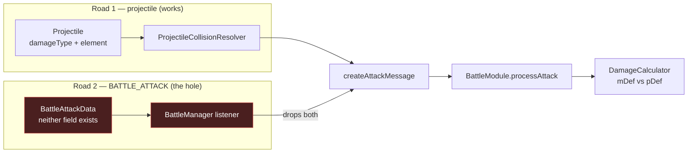

# `BATTLE_ATTACK` must state its channel and its element

<div class="callout info">

**Nothing is broken today.** Every current emitter is physical and neutral, and that is
*correct*, not merely defaulted. This lane closes a trap before it fires — and the trap got
sharper when F-019 shipped. Read §2 for why it is worth doing anyway.

</div>

## 1. The two roads a hit travels

Every hit reaches `DamageCalculator` by one of two routes. `DamageCalculator` picks the
defence to subtract from a single field:

```ts
const primaryDefense = damageType === 'magical' ? target.mDef : target.pDef
```

<div class="schematic">

```
  ROAD 1 — projectile            ROAD 2 — BATTLE_ATTACK event
  ────────────────────           ──────────────────────────────
  Projectile.damageType          BattleAttackData
  Projectile.element               → has NO damageType field
       │                           → has NO element field
       ▼                                │
  ProjectileCollisionResolver           ▼
       │  (carries both)          BattleManager listener
       ▼                                │  (carries NEITHER)
  createAttackMessage  ◄────────────────┘
       │
       ▼
  BattleModule.processAttack   ──►  ?? 'physical'   ?? DEFAULT_ELEMENT
       │
       ▼
  DamageCalculator      picks target.mDef vs target.pDef
```

</div>



Road 1 was fixed by F-018 Phase 0 (`ac7eff7`). Road 2 was left out on the grounds that
nothing magical used it. That reasoning is still true, and still load-bearing — which is
exactly what makes it fragile.

## 2. Why a correct default is still a defect

`?? 'physical'` **cannot distinguish two different situations**:

<div class="row two">
<div>

**"This hit is physical, I decided that."**
Correct. Deliberate. Reviewed.

</div>
<div>

**"Nobody stated a channel, so I guessed."**
Indistinguishable from the above, at every layer.

</div>
</div>

The day someone adds a fire-casting mob and reuses the melee path — the obvious thing to
do, since it is the existing path — their magic damage is mitigated by `pDef`. No compile
error, no exception, no log line. Just quietly wrong numbers.

<div class="callout warn">

**F-019 sharpened this.** Under the shipped offence formula a blade yields `mAtk` of
**exactly `0`** (offence reads one weapon-chosen stat; a blade's physical share `rho` is 1,
so `mAtk = atk * 2 * (1 - 1) = 0`). Before F-019 every character had `mAtk = 10 + 2*int > 0`.
So the *next* failure on this path is not merely wrong-channel damage — it can be **no
damage at all**, which is quieter still.

</div>

## 3. Audit — what actually emits on Road 2

<div class="metric-grid">
<div class="metric-tile"><b>3</b><br/>emitters of <code>BATTLE_ATTACK</code></div>
<div class="metric-tile"><b>3</b><br/>independent <code>'physical'</code> defaults stacked</div>
<div class="metric-tile alarm"><b>0</b><br/>places the channel can be stated</div>
</div>

| site | sources damage from | channel today | correct? |
| --- | --- | --- | --- |
| `src/systems/MobCombatSystem.ts:130` | `this.mob.pAtk` | physical | ✅ genuinely |
| `src/systems/NPCCombatSystem.ts:102` | `this.npc.pAtk` | physical | ✅ genuinely |
| `src/systems/PlayerCombatSystem.ts:209` | `this.player.pAtk` | physical | ✅ — animation only, `targetId` is always `''`, so it never resolves to damage |

The default is applied independently at three layers, so no single edit covers it:

| layer | file | today |
| --- | --- | --- |
| factory | `src/modules/BattleManager.ts:127` | `opts.damageType ?? 'physical'` |
| payload type | `src/modules/BattleActionMessage.ts:31` | `damageType?: 'physical' \| 'magical'` |
| resolver | `src/modules/BattleModule.ts:87` | `payload.damageType \|\| 'physical'` |

## 4. Decision — mandatory, explicit, strongly typed

**D1. `BattleAttackData` gains two required fields.**

```ts
export interface BattleAttackData {
  actorId: string
  targetId?: string
  damage: number
  /** Which defence mitigates this hit: pDef for 'physical', mDef for 'magical'. */
  damageType: 'physical' | 'magical'   // required — no `?`
  /** Attack element (World Wisdom / F-017). State 'neutral' explicitly. */
  element: Element                     // required — no `?`
  range: number
  roomId: string
}
```

**D2. Every *silent* default below it comes out.** `damageType` becomes required on
`createAttackMessage`'s options, required on `AttackActionPayload`, and read without a
silent fallback in `processAttack`. Same for `element`. The single remaining runtime
fallback — the last-resort guard for the `any` hole in §5 — is retained *only* because it
logs an error identifying the defect, which is the property the removed defaults lacked.

**D3. The three emitters state their values explicitly**, keeping the existing reason
comments — those comments are good and they explain *why* physical/neutral is right, which
is precisely the information a bare default destroys.

**D4. `element` is fixed in the same change as `damageType`.** They are the same hole, one
field apart, in the same four files. Fixing only one leaves the rule as *"state your
channel, but guess your element"* — and F-017's element table (Holy↔Void at ×2.0) is
exactly the system that would silently mis-resolve.

<div class="callout success">

**Why required-field beats fail-fast.** A runtime throw was considered and rejected:
`BattleManager.processActionMessages` wraps each action in `try/catch` and only
`console.error`s. A throw would make the **entire attack silently vanish** — a *quieter*
failure than the wrong-channel one being fixed. A required field catches the same mistake
at compile time, before it can run at all.

</div>

## 5. The one hole types cannot close

`BattleActionMessage.actionPayload` is typed **`any`** (`BattleActionMessage.ts:11`), and
`BattleModule.ts:393` casts it with `as AttackActionPayload`. **Types are erased at exactly
the queue boundary**, so "required" is a compile-time promise with a runtime gap.

Closed with a check at the top of the attack handler:

```ts
if (payload.damageType !== 'physical' && payload.damageType !== 'magical') {
  console.error(
    `❌ BATTLE: attack from ${actor.id} arrived with no damageType — resolving as ` +
    `physical. This is a defect, not a default (I-037).`
  )
}
```

**An audible default, not a silent one.** It never throws, for the reason in §4.

<div class="callout idea">

**Deliberately deferred, not forgotten.** The real fix is making `BattleActionMessage` a
discriminated union on `actionKey`, which removes all five `as` casts in `processAction`.
That touches the heal / kill / respawn / damage paths and is **not** this lane's job. It
gets filed as its own idea.

</div>

## 6. Preventing the blade + magic-skill zero, by construction

`src/combat/attackDamage.ts:38`:

```ts
return kind === ATTACK_KIND.SKILL_MAGICAL ? player.mAtk : player.pAtk
```

No weapon guard. After F-019 a blade user casting a magical skill deals **`0`** — not
wrong-channel damage, *no* damage.

**Reachability, checked:** `SKILL_MAGICAL` appears only inside `attackDamage.ts`
(definition `:18`, signature `:36`, use `:38`). **No caller passes it.** Armed, unreachable.
A loaded gun with no trigger attached — do not report it as a live bug.

The fix makes the misleading number **unrepresentable** rather than guessing at
skill-system policy that does not exist yet:

```ts
export type SkillDamageResolution =
  | { ok: true; damage: number; damageType: 'physical' | 'magical' }
  | { ok: false; reason: 'no-magical-offence' | 'no-physical-offence' }
```

| input | result |
| --- | --- |
| `SKILL_MAGICAL`, `player.mAtk > 0` | `{ ok: true, damage: mAtk, damageType: 'magical' }` |
| `SKILL_MAGICAL`, `player.mAtk <= 0` | `{ ok: false, reason: 'no-magical-offence' }` |
| `SKILL_PHYSICAL`, `player.pAtk > 0` | `{ ok: true, damage: pAtk, damageType: 'physical' }` |
| `SKILL_PHYSICAL`, `player.pAtk <= 0` | `{ ok: false, reason: 'no-physical-offence' }` |

Three properties earn this shape:

1. **The future caller cannot accidentally deal 0** — it must handle `ok: false`.
2. **The channel travels with the number.** A skill's damage stat and its damage type come
   from one decision and can never drift apart. Same principle as §4.
3. **It decides no gameplay policy.** Block the cast? Warn? Substitute a stat? That is the
   caller's call, made when there is a skill system to validate it against.

Guarding on `player.mAtk <= 0` rather than `isWeaponMagicalPrimary(weapon)` is deliberate:
the stat being zero **is** the failure, and testing it directly invents no weapon-class
rule (a hybrid weapon with small non-zero `mAtk` still works).

This follows the existing `canAttack() → { canAttack, reason? }` precedent in
`BattleModule.ts:183`, so it introduces no new idiom. One caller exists today
(`attack-damage.test.ts:83`); it is cheap now and expensive later.

## 7. I-027's open question is already answered — by the code

I-027's spec asked whether `mDef`/`pDef` selection should move into the projectile stamp so
both branches read one source. **It already does.** `ProjectileCollisionResolver` reads
`projectile.damageType` on the queue branch (`:65`) *and* on the direct-damage branch
(`:85`). There is no per-branch re-derivation left to unify. **No work — record the answer
and close the question.**

## 8. Tests

### 8.1 The red-first test

> *An emitter sourcing a magical hit must not land as physical.*

Driven through the real chain — `eventBus.emit(BATTLE_ATTACK)` → `BattleManager` listener →
queue → `processAttack` → `DamageCalculator` — against a mob with **asymmetric
`pDef: 40` / `mDef: 10`**, following the structure already established in
`src/tests/damage-type-routing.test.ts`.

<div class="callout warn">

**Assert on the channel that reaches `DamageCalculator`, not on a damage number in
isolation.** Base damage is passed explicitly and is *never* sourced from `mAtk`, so a
wrong-channel hit and a correct-but-zero hit cannot be confused — a real hazard now that
`mAtk = 0` is reachable (§2).

</div>

**Sequencing, so the red is genuine:**

| step | state | why |
| --- | --- | --- |
| 1 | add the two fields to `BattleAttackData`, emit a magical event in the test | the test must compile before it can fail |
| 2 | run → **RED** | the `BattleManager` listener still drops both fields; `mDef` is not read |
| 3 | thread both fields through the listener | |
| 4 | run → **GREEN** | |

**That red in step 2 is the evidence the defect is real.** Without it this lane has proved
nothing.

An element counterpart of the same test covers D4.

### 8.2 One deliberate deletion

`src/tests/damage-type-routing.test.ts:50` — *"defaults to physical when no damageType is
supplied"* — is an F-018 test that pins the exact default being removed. It **must** go.
Recorded here so it reads as a decision, not an accident.

### 8.3 Mechanical fallout

Roughly **21 call sites** must now state `damageType` (and `element`), about **19 of them
in test files**: `battle.test.ts`, `battle-messages.test.ts`, `room-scoped-battle.test.ts`,
`f018-harness.ts`, `element-combat-integration.test.ts`, `damage-type-routing.test.ts`.
Mechanical, but it is the bulk of the diff — expect the review to be mostly noise, and say
so in the PR.

### 8.4 Skill resolution tests

Extend `src/tests/attack-damage.test.ts:83`: blade + `SKILL_MAGICAL` → `ok: false` with
`reason: 'no-magical-offence'`; magical-primary weapon + `SKILL_MAGICAL` → `ok: true`
carrying `mAtk` and `damageType: 'magical'`.

## 9. Explicitly out of scope

| left alone | why |
| --- | --- |
| `ZoneEffectManager` (`:219`) | flat final damage by design, no channel and no element to carry — already documented at the call site |
| `StatusEffectManager` DOTs (`:25`) | same, already documented |
| discriminated union for `BattleActionMessage` | §5 — real, separate, gets its own idea |
| the 6 pending colyseus tests | `it.failing` characterised divergences; they turn red when the underlying behaviour is fixed. **That is the design — do not "fix" them.** |

## 10. Done when

<div class="callout action">

- [ ] A magical emitter **cannot** produce a physical hit, proven by a test observed **RED
      against the pre-fix tree** (§8.1 step 2) before it goes green.
- [ ] The same holds for `element`.
- [ ] `attackDamage.ts` can no longer return a silent `0` for a magical skill (§6).
- [ ] `cd contracts && pnpm build`, then `cd colyseus-server && npx tsc --noEmit` — **a green
      jest run does not prove the build compiles**; ts-jest caches per file.
- [ ] `./scripts/precheck.sh` exits 0.

</div>

## 11. Risks

| risk | mitigation |
| --- | --- |
| Large mechanical diff hides a real change | Land the required-field change and the ~21 call-site updates as separate commits so review can read them apart |
| Deleting an F-018 test looks like a regression | §8.2 records the reason; reference it in the commit message |
| `actionPayload: any` still lets a hand-built message bypass the type | §5 audible-default guard; no production code hand-builds these |
| Cut from `main`, missing release/1.6 | **`git merge release/1.6 --no-edit` immediately after claiming** — this bit both F-018 and F-019 in 1.5 |

## 12. Files

| file | change |
| --- | --- |
| `src/events/EventBus.ts` | `BattleAttackData` — add required `damageType` + `element` |
| `src/modules/BattleManager.ts` | listener threads both through; `createAttackMessage` opts required, defaults removed |
| `src/modules/BattleActionMessage.ts` | `AttackActionPayload.damageType` / `.element` required |
| `src/modules/BattleModule.ts` | `processAttack` reads without fallback; audible-default guard (§5) |
| `src/systems/MobCombatSystem.ts` | state `'physical'` / `'neutral'` |
| `src/systems/NPCCombatSystem.ts` | state `'physical'` / `'neutral'` |
| `src/systems/PlayerCombatSystem.ts` | state `'physical'` / `'neutral'` |
| `src/combat/attackDamage.ts` | `getSkillDamageForKind` → `SkillDamageResolution` (§6) |
| `src/tests/battle-attack-channel.test.ts` | **new** — the red-first test (§8.1) |
| `src/tests/damage-type-routing.test.ts` | delete the default test (§8.2) |
| ~5 further test files | mechanical call-site updates (§8.3) |
