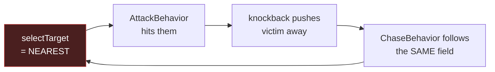

# Boss threat / aggro

**The decision is made.** Trinity roles (tank / healer / DPS) are the intended endgame
shape, so **Option 1 — a threat table** is adopted. Option 2 (multi-target cleave) is
deferred to its own idea. Both calls were made by the release owner on 2026-07-31.

## 1. What the lane-D brief got wrong correction

The brief (`2026-07-31-lane-D-boss-aggro-decision.md`) framed this as two comparable
fixes for one bug, sharing one acceptance signal. Three of its load-bearing claims do not
survive contact with the code.

**A threat table does not spread boss damage. It concentrates it.** That is what threat
is *for* — a working aggro system parks the boss on the tank. The brief's claim that the
`it.failing` even-spread assertion inverts "whichever is chosen" (brief §*Acceptance
signal*, lines 89–93) is **false for Option 1**. Flipping
`worstShare <= (1+EPS)/PARTY` green would be evidence the threat system is **broken**.

| brief's claim | what the code says |
| --- | --- |
| "the `it.failing` assertion inverts, whichever is chosen" | Only true for cleave. Threat deliberately concentrates damage — see above. |
| Option 2 is "much cheaper; no new state" | `AttackCharacteristicType.AREA` is **declared and unimplemented**: `attackStrategyFactory.ts:102-104` is a `TODO` + `console.warn`. It also drags in the F-017 element bug at `MobLifeCycleManager.ts:250`. |
| "No arithmetic in `tools/combat-lab` can fix this" | Under trinity, arithmetic is exactly where half the fix lives — see §7. |

A fourth problem is fatal to the brief's test plan on its own: in the boss test **the
players never attack** (`f018-boss-spread.test.ts:112-113` sets `player.input.attack =
false` deliberately, so wind-up does not deflect incoming melee). Damage-dealt threat
would therefore be **identically zero for all four players**, the table would be empty,
selection would fall back to distance, and the test would be **unchanged**.

## 2. Why the defect is structural

Target selection and chase read the *same* field, so distance and target define each
other:

`target = f(distance)` and `distance = f(target)`. Nothing in the loop is random or
time-based, so no threshold, cooldown or weight change breaks it.

**Threat opens the cycle because threat is not a function of the mob's own position.**

## 3. The seam architecture

There is exactly one place to change.

  AIWorldInterface.buildAgentEnvironment()          ← src/ai/AIWorldInterface.ts:209
        │
        ├── getNearestOppositeTeam()   ══╗  REPLACE WITH  selectTarget()
        │                                ║
        └── returns env.nearestPlayer ───╨──┬── AttackBehavior  canApply    :128
                                            ├── AttackBehavior  getDecision :174
                                            ├── ChaseBehavior   canApply    :236
                                            └── ChaseBehavior   getDecision :271
                                               (all in src/ai/behaviors/AgentBehaviors.ts)

`AttackBehavior` and `ChaseBehavior` read the **same** field — four call sites, one
source — which is why they cannot currently disagree, and why one substitution fixes
both. **Behaviors, combat systems and `BattleModule` are untouched.**

Rename `nearestPlayer` → `preferredTarget` (and `distanceToNearestPlayer` →
`distanceToPreferredTarget`) so the field stops lying about what it holds.

## 4. `ThreatTable`

One class, owned per-agent. A bounded `Map<entityId, number>`.

<strong>≤32</strong>entries per mob (hard cap, evict-lowest)

<strong>0</strong>per-tick writes — damage events only

<strong>O(candidates)</strong>selection cost, unchanged from today

**Threat sources, v1**

| source | effect | write site |
| --- | --- | --- |
| damage dealt to this mob | `+damage × multiplier` | `BattleModule.ts:100` — the scope already carries `attackerId` (`:25`, `:165`) |
| taunt | set to `max + margin`, hold for a lock duration | new threat op on `BattleModule` |
| decay | exponential toward zero, so disengaging sheds threat | selection-time, lazy |
| death / disconnect | entry dropped | existing entity lifecycle |

**Healing-generates-threat needs no redesign later.** `BattleModule.ts:54-64` already
injects an `applyDamage` / `healEntity` route for status effects, so the healer hook
lands in a seam that exists today.

**Scale.** Writes are event-driven, never per-tick, so threat costs nothing on quiet
ticks. The entry cap bounds memory regardless of party size — at the README's 150–300
players a mob still holds at most 32 entries. Decay is computed lazily at read time
rather than swept.

## 5. Selection rule

1. Candidates = alive, opposite team, within perception range — **unchanged**.
2. Any candidate with threat > 0 → **highest threat wins**.
3. Otherwise → **nearest**, byte-identical to today.
4. **Hysteresis:** hold the current target unless a challenger exceeds it by
   `switchMargin` (~1.1×).

**Rule 3 is what makes the blast radius survivable.** Every existing AI and combat test
runs with an empty threat table and therefore sees exactly current behaviour. Rule 4 is
the robustness clause — without it two similarly-threatening players flip the target
every tick.

Per the repo's single-path-API invariant, `selectTarget` takes **one options object** —
no positional overloads, no boolean flags that branch behaviour.

## 6. Test re-gating acceptance

The brief's acceptance signal is replaced, for the reason in §1.

- **`it.failing` even-spread assertion (`f018-boss-spread.test.ts:172-178`) is DELETED,
  not inverted** — with the reasoning recorded in the file, because a future reader will
  otherwise re-derive this entire argument from scratch.
- **`PINNED FINDING` (`:145`) stays and keeps passing.** Concentration is now intentional
  rather than a defect; its header comment is rewritten to say so.

Five new gates:

| # | gate |
| --- | --- |
| 1 | Threat decides — the threatening player is targeted over the nearer one |
| 2 | Taunt transfers the target within one decision tick and holds for the lock |
| 3 | The lock pins the target even against far higher threat, then releases it |
| 4 | Zero-threat party falls back to nearest — pins today's behaviour against regression |
| 5 | Threat inside `switchMargin` does not flip the target tick-to-tick |

Gate 2 requires taunt to be fireable, so v1 ships taunt as a **threat operation** plus a
`DebugCommandHandler` command. Whether any class *has* a taunt ability is content, not
this system.

**Implementation note (2026-07-31).** The gates assert on the AI environment's
`preferredTarget`, **not** on `Mob.currentAttackTarget`. That schema field is only
populated while `AttackBehavior` is the active behaviour and is `''` on every tick the
boss spends chasing, so asserting on it produced false failures. Selection is what these
gates are about, so they read selection.

Gate 3 was also strengthened during implementation: because `taunt()` sets threat to
`1.5x` the current maximum, the taunter legitimately still leads *after* the lock lapses.
The gate therefore spikes a rival's threat **while the lock is up** — proving the lock,
not mere threat ordering, is what pins the target.

## 7. Explicitly out of scope

| item | why deferred |
| --- | --- |
| `AreaAttackStrategy` / cleave | Separate idea. Unimplemented (`attackStrategyFactory.ts:102`) and blocked behind the F-017 element bug (`MobLifeCycleManager.ts:250`). |
| Reconciling the boss `÷n` branch | combat-lab arithmetic, not server code. Files as a follow-up idea. |
| Healer / mana / healing | `combat-stat-model-design.md:386-389` lists all three as *does not exist*. Design leaves the hook, builds nothing. |

### The model reconciliation, recorded

`tools/combat-lab/CHECKLIST.md:291-295` states the assumption **with a qualifier the
brief drops**:

> **Load-bearing assumption:** a boss shares its damage evenly across the party… **Without
> healing**, even sharing is the only survivable reading.

The same file already derives the other reading — `:111` *"A boss's wall clock is bought
with healing, not HP"* and `:129` `sustain = 1 − n²/(R × a × d × h)`, with SSS needing
healing to replace **93.4%** of boss output.

**`÷n` even-spread is the no-healer model. Tank-absorbs-plus-healer-funds is the trinity
model.** Trinity was chosen, so the boss branch's `÷n` is itself the thing that is wrong —
not merely the AI. This is why decision **D1** (`combat-stat-model-design.md:375`) already
reads *"a tank's group value must come from taunt/aggro."* This design pays D1.

## 8. The trade we are accepting

**Until healing ships, the boss branch of the balance model stays unverified against the
simulation.** This change makes the *mechanism* correct and testable. It does not make the
*numbers* right. That is a deliberate trade, not an oversight — recorded here so nobody
reads a green suite as a validated boss ladder.

## 9. Route from here

1. `/ps-release-workflow:refine I-035` → mint `F-NNN` (this spec satisfies the refine
   gate's "solid, approved spec" requirement).
2. Claim, then **immediately `git merge release/1.6 --no-edit`** — the claim script cuts
   from `main`, which bit both F-018 and F-019 in 1.5.
3. Implement; Gate 1 (`./scripts/precheck.sh`) before shipping.
4. File the two follow-up ideas from §7.

## Shared invariants

1. All combat logic stays centralised in `BattleModule` — never duplicated into emitters
   or systems.
2. Single-path APIs: one options object; no positional overloads or boolean branch flags.
3. Do not tune the model to paper over a sim disagreement. Record it (§8 does).
4. Use **pnpm**, never npm. Never `git commit --amend`.
