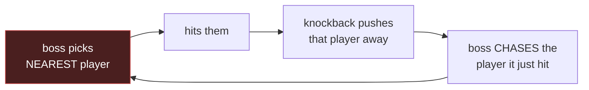

# Lane D — boss target rotation / aggro

Self-sufficient. You do not need the other lane docs.

Ticket: `.claude/idea_backlog/I-035-boss-target-rotation-aggro-bosses-struct/spec.md`

**This lane starts with a decision, not a keyboard.** Do not open a worktree and start
writing an aggro system. The deliverable of the first step is an **approved design spec**;
implementation is a later, separate claim.

It is also the item most likely to block the combat line again, because everything the
balance model says about bosses currently rests on an assumption the simulation violates.

## The defect, and why it is structural

`nearest-opposite-team` target selection plus knockback forms a **closed loop**:

Chasing keeps that player nearest. The target is never handed to anyone else. **Nothing
in the loop is random or time-based**, so this is not a tuning problem — no threshold,
cooldown or weight change breaks it.

## What it costs

The balance model's boss branch prices a rank as though damage splits `n` ways across the
party. It does not split at all. At **S / SS / SSS** one player absorbs
**8× / 20× / 50×** the intended pressure and dies in `swings` swings while the rest of the
party stands untouched.

**No arithmetic in `tools/combat-lab` can fix this.** It is not a model error — the model
is describing a game that does not behave the way it assumes. Retuning rank multipliers
would only move the number at which one player gets deleted.

## The decision

Two families. This is a **game-design** call, not an engineering one — which is precisely
why it is parked here rather than being decided by whoever picks up the code.

### Option 1 — aggro / threat table

Each boss keeps per-player threat; target selection reads threat rather than distance.

- **For:** the conventional answer; gives designers real levers — taunt, threat decay,
  healing-generates-threat, threat multipliers per ability. Composes with future tank/
  healer roles the foundation spec already anticipates.
- **Against:** new persistent per-entity state, new tuning surface, and it needs a
  decision about what generates threat before any of it can be built.

### Option 2 — multi-target boss attacks

Cleaves / AoE that hit several players per swing, so pressure spreads without changing
target selection at all.

- **For:** much cheaper; no new state; the `n`-way split the model already assumes becomes
  true almost by construction.
- **Against:** it changes **what a boss is** rather than how it picks. Bosses become
  area-damage dealers, which is a content/feel decision with consequences for every
  encounter already authored.

**A hybrid is legitimate** — threat for single-target bosses, cleaves for large ones — but
say so explicitly rather than drifting into it.

## Acceptance signal, whichever is chosen

The `it.failing` boss assertion in `colyseus-server/src/tests/f018-*.test.ts` **inverts to
a passing even-spread assertion.** It is currently pinned red-when-fixed on purpose, so
flipping it is the unambiguous proof the work landed.

Until then, treat **`n²` as unverified against the simulation** — and note the pack
branch `2n/(n+1)` is unverified too, for a different reason (see the Lane C handoff; its
even spread is explained by lane geometry, with only 1 of 49 swings measured as a genuine
non-lane-mate engagement).

## Suggested route

1. `/superpowers:brainstorming` on the two options with the release manager / design owner
   — output a spec under `docs/superpowers/specs/`.
2. Only once that spec is solid: `/ps-release-workflow:refine I-035` → mint `F-NNN` →
   claim. Refining an idea whose spec is still the empty skeleton is the exact mistake the
   refine gate exists to prevent.
3. Implementation lands with the boss assertion inverted in the same change.

## Reading before the brainstorm

- `.claude/idea_backlog/I-035-.../spec.md` — the finding, as filed
- `docs/superpowers/specs/2026-07-30-combat-model-split-design.md` — the model whose boss
  branch this invalidates
- `colyseus-server/src/ai/` — `AIModule`, `behaviors/`, `strategies/`; target selection
  lives here
- `colyseus-server/src/systems/MobCombatSystem.ts`

## Shared invariants (repeated so this file stands alone)

1. **Cut your branch, then immediately `git merge release/1.6 --no-edit`.** The claim
   script cuts from `main`; this bit both F-018 and F-019 in 1.5.
2. **Run Gate 1 before shipping:** `./scripts/precheck.sh`.
3. **All combat logic is centralised in `BattleModule`** — never duplicated into emitters
   or systems.
4. **Single-path APIs:** constructors/methods take one options object; no positional
   overloads, no boolean flags that branch behaviour. Use explicit keys
   (`mode: "attack" | "chase"`).
5. **Do not tune the model to paper over a sim disagreement.** Record it.

Use **pnpm**, never npm. Never `git commit --amend`.
