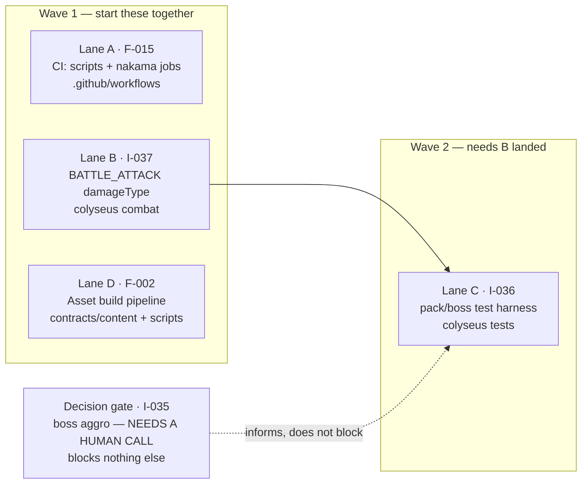

# Handoff — release 1.6

Written 2026-07-31, immediately after promoting 1.5. Nothing below is in progress:
every lane starts from a clean `main`. Read **Shared invariants** before starting any
lane — four of the five traps in it cost real time during 1.5.

<div class="callout success">

**Where things stand.** `main` is at `da67c6e`. Release **1.6** is open
(`release/1.6`, `_release` worktree recreated). 17 features promoted, **2 open and
unclaimed** (F-002, F-015), 19 unpromoted ideas. All suites green as of the promote:
contracts 55/55, nakama 40/40, colyseus 576 passed / 6 pending, `verify.mjs` exit 0,
`dotnet build` 0 errors.

</div>

## The lane map



### Can these really run in parallel?

Yes for A, B, D — verified by file overlap, not by assumption:

| | Lane A (CI) | Lane B (damageType) | Lane C (tests) | Lane D (assets) |
| --- | --- | --- | --- | --- |
| **A** — `.github/workflows/*` | — | none | none | none |
| **B** — `src/modules/Battle*`, emitters | none | — | **overlap** | none |
| **C** — `src/tests/f018-*` | none | **overlap** | — | none |
| **D** — `contracts/content/*`, `scripts/*` | none | none | none | — |

**Only B↔C genuinely conflict**, and not by file — Lane C's assertions read the damage
values Lane B is changing the plumbing for. Running them together means C rebases onto a
moving target. Land B first.

Lane D touches `scripts/`, and Lane A *reads* `scripts/package.json` to wire the CI step,
but does not edit it. Not a conflict.

---

## Wave 1

### Lane A — F-015: CI runs the `scripts/` suite (and nakama)

**Size:** small. **Start here if you want a quick win.**

`.claude/refined_backlog/F-015-ci-add-scripts-test-suite-step-node-test/`

**The gap.** `scripts/package.json:6` defines `"test": "node --test tests/*.test.mjs"`
— a 101-test suite that Gate 2 runs and **CI does not**. `ci.yml`'s single
`colyseus-server` job runs the story-explorer smoke test
(`node --test tools/story-explorer/tests/*.test.mjs`) but never the `scripts/` suite.

**Scope creep worth accepting, because it is the same defect:** there is **no nakama job
in CI at all**. `ci.yml` covers `colyseus-server`, `contracts.yml` covers `contracts`,
and nothing covers `nakama` — whose code is bundled into the Nakama runtime, where a type
error breaks `InitModule` at load. `scripts/precheck.sh` gates it locally as of
`b164c11`; CI does not. Add both jobs or say explicitly why not.

**Files:** `.github/workflows/ci.yml` (add a step or job), possibly a new
`.github/workflows/nakama.yml` mirroring `contracts.yml`'s shape.

**Done when:** a PR shows the new check(s) reporting, and deliberately breaking a
`scripts/` test turns CI red. Prove it bites — do not merge on green alone.

---

### Lane B — I-037: `BATTLE_ATTACK` carries no `damageType`

**Size:** small–medium. **This one has a live finding attached; read it.**

`.claude/idea_backlog/I-037-battle-attack-carries-no-damagetype-the/spec.md`

**Status today: correct but fragile.** Both the mob and NPC emitters source `damage` from
`pAtk`, and the omission is documented as deliberate at
`colyseus-server/src/modules/BattleManager.ts:50`. It is the one remaining place a
magical hit could silently become physical, because `?? 'physical'` cannot tell "physical
on purpose" from "channel forgotten".

<div class="callout warn">

**Sharper after F-019 — a measured finding, not speculation.** Under the shipped formula
a blade yields `mAtk` of **exactly 0**. The F-019 audit walked every production `mAtk`
reader:

- `combat/attackDamage.ts:70` — **safe**, guarded by `isWeaponMagicalPrimary`
  (`weapon.mAtk > weapon.pAtk`), which a blade never satisfies
- `schemas/WorldLife.ts:109,116` — **safe**, `Math.max(pAtk, mAtk)`, not a sum
- **`combat/attackDamage.ts:38` — a latent zero-damage path.**
  `getSkillDamageForKind` returns `player.mAtk` for `SKILL_MAGICAL` with **no weapon
  guard**, so a blade user casting a magical skill deals `0`. Currently unreachable —
  nothing passes `SKILL_MAGICAL` — so it is a trap armed for the day the skill system
  lands, not a live bug.

</div>

**The design choice this lane must make:** carry the channel explicitly on
`BATTLE_ATTACK` (uniform with the projectile path F-018 Phase 0 already fixed), or drop
the `?? 'physical'` default so an event without a channel fails fast. The second is
louder and forces the decision at every call site.

**The test that does not exist:** an emitter sourcing `mAtk` must not produce a physical
hit. Assert on **the channel that reaches `DamageCalculator`**, not on the damage number
— a number can coincide.

---

### Lane D — F-002: asset build pipeline

**Size:** large. **The only lane that is a genuine feature build rather than a gap-fill.**

`.claude/refined_backlog/F-002-asset-build-pipeline-content-registry-st/` —
"Asset build pipeline: content registry + storybook + CC0 seed set"

Oldest open feature in the backlog. Fully isolated from the combat work: touches
`contracts/content/`, `scripts/`, the asset manifest and storybook. Read its `spec.md`
first — it predates several shipped releases (F-003 asset-forge, F-A asset sourcing,
F-006 registry spine all landed since), so **verify what it still asks for is not already
built** before planning. That check is the first task, not an afterthought.

---

## Wave 2

### Lane C — I-036: pack/boss test harness, properly built

`.claude/idea_backlog/I-036-pack-no-focus-fire-properly-tested-a-par/spec.md`

Starts once Lane B lands. Two jobs, both currently misrepresented in the suite:

1. **The pack test proves nothing.** Its even damage spread is explained by **lane
   geometry**, not by the AI declining to converge — measured: only **1 of 49 swings
   (2%)** landed while a mob's own lane-mate was not already its nearest player. The
   assertion pins 2% as an *upper* bound. Needed: a clustered party where every mob can
   reach every player, so convergence is possible and declining to converge is a real
   observation. **Inverting the assertion to `>= 0.2` is the signal the work landed.**
2. **The parity test is a per-hit probe, not a fight.** Every number is reproducible in
   closed form without instantiating a room. Needed: a fight run to completion measuring
   **TTK** and **HP remaining** against `mob(L, rank)`. Its guard is a blanket
   `it.failing`, which passes on **any** throw rather than only the intended divergence.

**Ceiling to state up front, so nobody chases it:**
`colyseus-server/src/modules/combat/DamageCalculator.ts` is subtractive, 80%-capped and
1-floored; the model is divisive and uncapped. Different functions — they cannot agree in
general. A parity test can validate **shape and ordering only**, never absolute damage.

**Also:** `GameRoom.maxClients` is `1` for single-player debugging, so multi-player tests
must construct the room directly rather than going through client connection. Follow
whichever existing test in `colyseus-server/src/tests/` already does this.

---

## Decision gate — I-035, boss aggro

<div class="callout danger">

**This needs a human design call before it can be planned, and it is the thing most
likely to block the combat line again.** It is not a lane; it is a question.

`nearest-opposite-team` + knockback forms a closed loop: the boss picks the nearest
player → knockback pushes them away → the boss chases the player it just hit → which
keeps them nearest. Nothing hands the target to anyone else. At S/SS/SSS one player
absorbs **8× / 20× / 50×** the intended pressure. **No arithmetic in `tools/combat-lab`
fixes this.**

Two families, and the choice is a game-design decision, not an engineering one:

- **Aggro / threat table** — per-player threat drives target selection. Gives designers a
  lever (taunt, decay, healing-generates-threat). The conventional answer.
- **Multi-target boss attacks** — cleaves/AoE spread pressure without changing target
  selection at all. Cheaper, but changes what a boss *is*.

Until this is decided, the boss `n²` branch of the balance model describes nothing.

</div>

---

## Shared invariants — read before starting any lane

<div class="callout warn">

**1. Cut your branch, then immediately merge `release/1.6` into it.** The claim script
cuts feature branches from **`main`**. This bit both F-018 and F-019 in 1.5 — F-018's
branch lacked the entire combat-lab, which existed only on the release branch. Always:

```bash
git merge release/1.6 --no-edit
```

The three legacy worktrees are each **10 commits behind `main`** for the same reason.

</div>

**2. A green jest run does NOT prove the build compiles.** `npm run build` is `tsc` and
typechecks the whole project including `src/tests/**`; ts-jest transpiles per file and
**caches**, so a test whose literals went stale against a changed shared type is never
re-checked. On 2026-07-30 jest reported **571 passed / 0 failed** and the next docker
build failed with three errors in a file it had just "passed". After any shared-type
change:

```bash
cd contracts && pnpm build          # ALWAYS first — a stale dist typechecks green
cd ../colyseus-server && npx tsc --noEmit
```

**3. Gate 1 now exists — use it.** `scripts/precheck.sh` (`b164c11`) is new in 1.5.
Before this, `ship` found no precheck, warned, and merged anyway — **every feature in
this repo's history shipped through a gate that did not exist.** Run it yourself before
shipping:

```bash
./scripts/precheck.sh              # or --no-install if deps are warm
```

**4. There is NO prod deploy.** `.github/workflows/ci.yml` runs tests only on push to
`main`. The only deploy script is `scripts/deploy-local.sh`, which targets a **local** k8s
cluster. The ps-release-workflow docs describe a prod deploy generically; it is not true
in this repo. Do not tell anyone a merge ships to production.

**5. `--babysit` races CI registration.** During the 1.5 promote it reported
`no checks reported → PR checks FAILED` while both checks were in fact `IN_PROGRESS` and
subsequently passed. **`no checks` ≠ `red checks`.** Verify with
`gh pr view <n> --json statusCheckRollup` before believing a failure — and never merge
over genuinely red checks.

**Also:** use **pnpm**, not npm, for installs. Never `git commit --amend`. Do not run
prettier on `tools/combat-lab/combat-model.json` (generated, in `.prettierignore`). And
`.claude/refined_backlog/*/plan.md` is **gitignored** — canonical specs and plans live
under `docs/superpowers/`.

## Starting a lane

```bash
# one-time per lane
python3 ~/.claude/ps-release-workflow/scripts/init_work_refined_backlog.py F-0NN
cd .claude/worktrees/F-0NN-<slug>
git merge release/1.6 --no-edit     # invariant 1 — do not skip
pnpm install && (cd contracts && pnpm build)
```

For the idea-backlog lanes (I-035/036/037), the gate is deliberate: **brainstorm to a
solid spec under `docs/superpowers/specs/` first**, then `refine` to mint an `F-NNN`,
then claim. Refining an idea whose spec is still the empty skeleton is the exact mistake
that gate exists to prevent.

## What NOT to do

- **Do not delete the three legacy branches.** `lane/C-content` (8 unmerged commits),
  `feature/colyseus-0.17-migration` (49), `feature/godot-game-client` (49). The last is
  almost certainly the Godot 4 client migration decided 2026-07-11 — live strategic work,
  not debris. Removing the *worktree directories* is reversible; deleting the *branches*
  is not.
- **Do not "fix" the 6 pending colyseus tests.** They are `it.failing` characterised
  divergences. They turn red the moment someone fixes the underlying behaviour, which is
  the point. Lanes B and C are how they get resolved.
- **Do not tune numbers to make the parity test pass.** A disagreement between model and
  sim is a finding to record, not a number to adjust.
