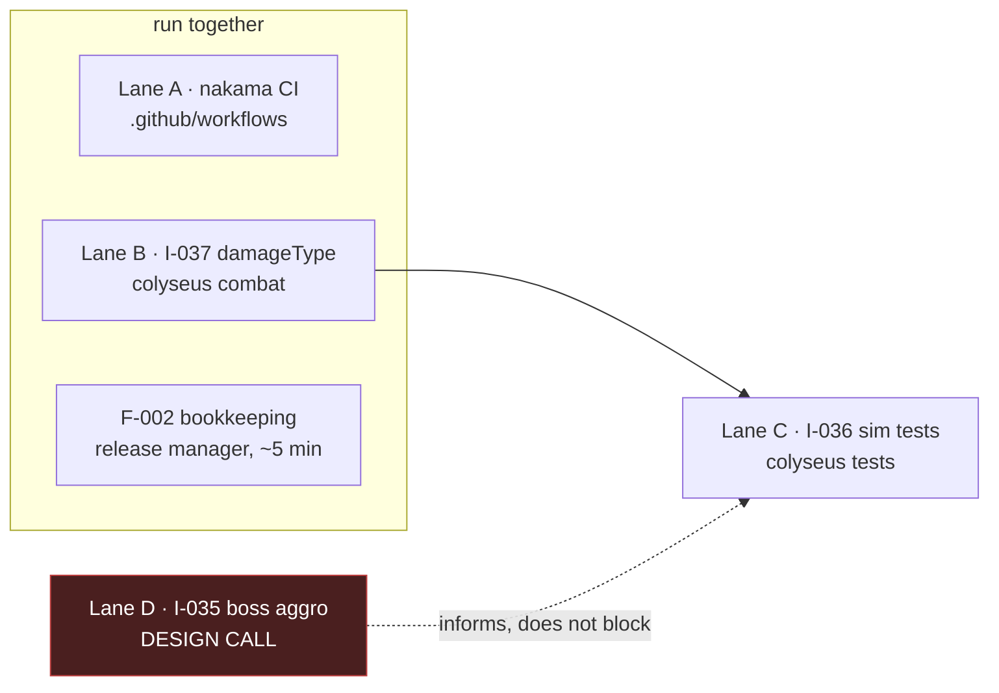

# Handoff — release 1.6

Index only. **Each lane has its own self-sufficient file** — pick one and read that;
you do not need this page or the sibling lanes.

**Correction to the first draft of this handoff (`2e2af88`).** It proposed four lanes.
**Two were invalid, and I did not check the backlog specs before writing them.**

- **F-015 is `status: invalid-wont-do`.** CI *already* runs the `scripts/` suite —
  `ci.yml:78` runs `npm test --prefix scripts` inside the step named "Content gate". The
  first draft grepped step *names*, saw "Content gate", and never read its `run:` block.
  F-015's own spec documents that exact trap: a reviewer "looked for a literal
  `node --test` step and missed the `npm test` indirection." The draft repeated it
  verbatim. **Read what a CI step executes, not what it is called.**
- **F-002 is already delivered.** All 7 tasks shipped in release 1.2 (squash `3cf96e7`,
  2026-07-19) alongside F-003/F-004/F-005. Its spec carries a full task → deliverable →
  commit provenance table, reconciled 2026-07-20 by F-006. It reads `open` purely as a
  bookkeeping artifact — it predates the point where asset work was routed through
  claim → ship → promote.

What survived: the **nakama CI gap is real** (zero references to `nakama` in any
workflow), and it becomes Lane A in place of F-015.

**Where things stand.** `main` at `da67c6e`. Release **1.6** open (`release/1.6`,
`_release` worktree recreated). All suites green as of the promote: contracts 55/55,
nakama 40/40, colyseus 576 passed / 6 pending, `verify.mjs` exit 0, `dotnet build`
0 errors.

## Lanes

| lane | file | what | size | state |
| --- | --- | --- | --- | --- |
| **A** | [`lane-A-nakama-ci`](2026-07-31-lane-A-nakama-ci.md) | `nakama` has no CI job at all | small | unfiled finding — file an idea first |
| **B** | [`lane-B-damagetype`](2026-07-31-lane-B-damagetype.md) | `BATTLE_ATTACK` carries no `damageType` (I-037) | small–med | idea filed, needs brainstorm |
| **C** | [`lane-C-sim-test-harness`](2026-07-31-lane-C-sim-test-harness.md) | pack/boss tests prove nothing yet (I-036) | med | **after B** |
| **D** | [`lane-D-boss-aggro-decision`](2026-07-31-lane-D-boss-aggro-decision.md) | boss aggro (I-035) | — | **blocked on your design call** |

### Is the parallelism real?

Checked by file overlap, not assumed:

| | A `.github/workflows` | B `src/modules/Battle*` | C `src/tests/f018-*` |
| --- | --- | --- | --- |
| **A** | — | none | none |
| **B** | none | — | **overlap** |
| **C** | none | **overlap** | — |

**A ∥ B is genuinely independent.** Only **B↔C** conflict — not by file, but semantically:
Lane C's assertions read the damage values Lane B re-plumbs. Land B first.

## Also outstanding — not a lane

**F-002 bookkeeping (release manager, ~5 minutes).** Its work shipped under release 1.2,
but its catalog row still reads `open`. Its spec flags the open decision explicitly:
retro-promote vs formally close. There is **no sanctioned toolkit path** to retro-promote
a feature whose work shipped under another feature's release, and hand-editing
`_catalog.json` is forbidden (R1, release-manager owned). Decide it; do not code it.

## Deliberately left alone

**The three legacy worktrees**, all with unmerged work and untouched for 3 weeks:
`lane/C-content` (8 commits ahead), `feature/colyseus-0.17-migration` (49),
`feature/godot-game-client` (49). The last is almost certainly the Godot 4 client
migration decided 2026-07-11 — live strategic work, not debris. Removing the *worktree
directories* is reversible; deleting the *branches* is not. All three are now **10 commits
behind `main`**; merge `main` before resuming either.

## Invariants (each lane file repeats the ones it needs)

1. **Cut your branch, then immediately `git merge release/1.6 --no-edit`.** The claim
   script cuts from `main` — this bit both F-018 and F-019 in 1.5.
2. **A green jest run does not prove the build compiles.** `tsc` checks the project
   including tests; ts-jest transpiles per file and **caches**. On 2026-07-30 jest
   reported 571 passed / 0 failed and the next docker build failed with three errors in a
   file it had just "passed". `cd contracts && pnpm build` first — a stale `dist` typechecks
   green against the *old* types — then `npx tsc --noEmit`.
3. **Gate 1 exists now:** `./scripts/precheck.sh` (`b164c11`). Before 1.5, `ship` found no
   precheck, warned, and merged anyway — **every feature in this repo's history shipped
   through a gate that did not exist.**
4. **There is no prod deploy.** `ci.yml` runs tests only on push to `main`; the only deploy
   script is `scripts/deploy-local.sh` (local k8s). The ps-release-workflow docs describe
   one generically; it is not true here.
5. **`--babysit` races CI registration** — during the 1.5 promote it reported
   `no checks reported → PR checks FAILED` while both checks were `IN_PROGRESS` and
   subsequently passed. **`no checks` ≠ `red checks`.** Verify with
   `gh pr view <n> --json statusCheckRollup` before believing it; never merge over
   genuinely red checks.
6. **Read the backlog spec before planning any lane.** Two of the four lanes in the first
   draft of this file would have been caught by opening one file.

Use **pnpm**, never npm. Never `git commit --amend`. Do not run prettier on
`tools/combat-lab/combat-model.json`. `.claude/refined_backlog/*/plan.md` is gitignored —
canonical specs live under `docs/superpowers/`.
