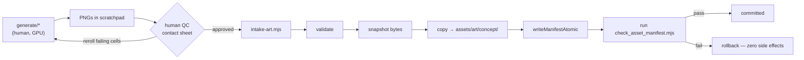

# T0 · Art Forge Foundation — design

**Date:** 2026-08-01
**Program:** `2026-08-01-world-art-bible-program.md` (track T0 of T0–T3)
**Supersedes as a design:** ideas **I-030** (concept-art manifest gate) + **I-031** (commit the generation pipeline)
**Ships zero new artwork.** T0 makes the *next* art reproducible and gated.

<div class="callout warn">
<strong>The problem in one line.</strong> 81 committed images are durable; the means of
producing more is not. <code>HANDOFF-2026-07-28.md</code> §2 calls the pipeline
<em>"reusable — this is the valuable part"</em>, then §3 concedes it lives in a scratchpad
that <strong>is already gone</strong>. Meanwhile <code>art-manifest.json</code>'s 80 entries
are validated by <strong>nothing</strong>.
</div>

## 1. Verified starting state

| Fact | Evidence |
|---|---|
| `art-manifest.json` has 80 entries, groups `cast` / `race` / `class` | `game-client/assets/art/art-manifest.json` |
| Nothing validates it — the gate reads only 4 other sources | `scripts/check_asset_manifest.mjs:174` `manifestSources()` |
| The gate runs in **CI**, not in Gate 2 | `.github/workflows/ci.yml:69` — *(corrects I-030, which claimed `integration.sh`)* |
| CI checks out LFS payloads | `.github/workflows/ci.yml` — `actions/checkout@v4` with `lfs: true` |
| A transactional 2D intake already exists | `tools/asset-2d-forge/intake2d.mjs` — validate → snapshot → copy → write-entry → gate → rollback |
| Its atomic writer is **already shared**, not private | `intake2d.mjs:60` imports `../asset-forge/lib/manifest.mjs` (`writeManifestAtomic`) |
| The only concept-art consumer | `tools/asset-storybook/index.html:782` fetches the manifest at runtime |
| `art:race-human` does not exist | `grep -o '"art:race-[a-z]*"'` → beastkin, demon, dragon, dwarf, elf, immortal, ogre |

<div class="callout info">
<strong>Why a third sink and not a merge.</strong> <code>catalog-manifest.json</code> is
driven by <code>render-spec.json</code> and describes assets the client <em>renders</em>.
Concept art has no renderer — it is reference material. Folding it in would mean inventing
a non-rendering render type and rewriting the storybook. The manifests stay separate; the
<em>plumbing</em> is what gets shared.
</div>

## 2. Architecture — the load-bearing boundary

```
tools/art-forge/
  README.md            the recipe: ComfyUI on mont-pc, prompt laws, QC method
  forge.config.json    model + denoise + silhouette params (the tuning)
  prompts/             per-group templates + locked race identity canon
  generate/            ⚠ HUMAN-RUN · GPU-BOUND · NEVER invoked by any gate
    charsheet.mjs        txt2img
    i2i.mjs              img2img — denoise 0.82 over flat-grey silhouettes
    batch-matrix.mjs     full 8×8 matrix + muscle gradient
    contact-sheet.sh     QC montage (magick montage -tile 8x8)
  intake-art.mjs       CI-runnable: transactional entry → art-manifest.json
  tests/

game-client/assets/art/
  art-groups.json      shared group registry — see §5

tools/asset-storybook/index.html
  buildArt()           group-order table + generic fallback — see §5.1
```

<div class="callout danger">
<strong>The split rule.</strong> Everything under <code>generate/</code> requires a GPU and a
Tailscale tunnel to <strong>mont-pc</strong> (2× RTX 3090, ComfyUI GPU 0 : 8188). It can
<strong>never</strong> run in CI. No gate, test, or npm script may invoke it. Everything
outside <code>generate/</code> is pure Node and fully testable.
</div>

### Data flow



`intake-art.mjs` mirrors `intake2d.mjs`'s shape exactly and imports the **same**
`writeManifestAtomic` from `tools/asset-forge/lib/manifest.mjs`. No new writer, no
extraction — the shared module already exists and is already cross-imported.

## 3. Preserved tuning <span class="topic-chip">the actually-valuable part</span>

`forge.config.json` + `prompts/` capture what cost real iteration and would otherwise be
re-derived from prose:

- **Winning recipe (v3):** Z-Image Turbo **img2img, denoise 0.82**, over flat-grey per-job
  silhouettes cut from the approved human row via ImageMagick magenta-key. Proportion and
  pose come from the silhouette; race and costume come from the prompt.
- **Prompt law — text cannot hold head-body ratio.** Must anchor with an image; the owner
  caught drift twice on text-only attempts.
- **Prompt law — anti-3D counters.** `"raccoon"` / `"goggles"` / `"dwarf"` drag the model to
  3D-furry/Pixar. Counter with `"KEMONOMIMI, HUMAN face, no fur"` and
  `"crisp flat 2D anime illustration, NOT 3D render NOT CGI NOT clay"`.
- **Muscle gradient:** race axis (Elf lightest → Ogre heaviest) × job axis (Mage → Swordsman),
  scored 6.0 → 8.5.
- **Race identity canon** (locked by owner iteration, and now referenced by
  `content/story/canon.md` §5, so drift here is drift against canon): Ogre = moss-green skin,
  small tusks, intelligent eyes, natural muscle · Immortal halo = a ring of **light**, not
  bells · Dragon = white hair, pearl-opal iridescent skin · Beastkin = human face, animal
  ears and tail only.
- **QC method:** contact sheet per row, then reroll only failing cells with a new seed plus
  reinforced identity words.

## 4. Gate changes

Add `art-manifest.json` as a **4th curated source** in `manifestSources()` — keyspace
`curated`, `driftGated: false`, alongside `audio-manifest`, `catalog-manifest` and
`music-manifest`.

<div class="callout danger">
<strong>The "+1 line" hook does not work here — measured, not assumed.</strong> Running
<code>node scripts/check_asset_manifest.mjs --catalog-manifest game-client/assets/art/art-manifest.json</code>
fails <strong>all 80 entries</strong> with <code>unknown render "unknown"</code>.
<br><br>
Cause: <code>validateEntry()</code> is render-spec-driven. It resolves a render type from
<code>entry.render</code> → <code>kindDefaultRender[entry.kind]</code> → an extension sniff of
<code>primaryPath()</code>, which reads <code>entry.scene ?? entry.stream ?? ""</code>. Art
entries carry <strong><code>file</code></strong> — a plain path relative to
<code>game-client/assets/art/</code>, not a <code>res://</code> scene — and no
<code>render</code> or <code>kind</code>. So the sniff runs on <code>""</code>, resolves to
<code>"unknown"</code>, and <code>spec.renderers["unknown"]</code> does not exist.
<br><br>
The comment at <code>check_asset_manifest.mjs:199</code> is accurate for a curated file that
follows the render-spec entry shape. <strong>Concept art does not</strong> — it has no
renderer by design (§1).
</div>

**Therefore:** each entry in `manifestSources()` gains a `validator` field —
`"render"` (the existing path, default for all four current sources) or `"art"`. `main()`
branches on it. This keeps `validateEntry()` untouched rather than threading art-shaped
special cases through a function that four other sources depend on.

```js
// manifestSources() — the new source
{
  path: opts.artManifest,
  label: "art-manifest",
  keyspace: "curated",
  driftGated: false,
  validator: "art",        // ← not render-spec shaped
  root: opts.artRoot,      // game-client/assets/art
}
```

`validateArtEntry(id, entry, source, groups, failures)` replaces the render checks with:
`group` is a string present in `art-groups.json` · `title` non-empty · `note` non-empty
(provenance, since art is locally generated and carries no third-party licence) · `file` is a
relative path — no `res://`, no leading `/`, no `..` — resolving to a non-empty file under
`source.root`.

<div class="callout info">
<strong>Licence policy deliberately does not apply.</strong> Guard (I)
(<code>checkLicensePolicy</code>) runs inside <code>validateEntry</code> and enforces the
tiered CC0/CC-BY rules for <em>sourced</em> assets. Concept art is generated locally on
mont-pc, so it has no upstream licence to record; the <code>note</code> field carries
provenance instead. Bypassing guard (I) here is the intended behaviour, not an oversight.
</div>

<div class="callout success">
<strong>Guard (H) is already safe.</strong> <code>codegenReservedNamespaces</code> is
<code>["player", "npc", "mob:", "projectile:", "zone:", "item:"]</code> and the check is a
prefix match on the whole id. T1's <code>art:mob-*</code> and T3's <code>art:item-*</code>
start with <code>art:</code>, so they do not collide with <code>mob:</code> or
<code>item:</code>. No change needed — but do not rename the groups to bare
<code>mob:</code>/<code>item:</code> prefixes later.
</div>

New assertions:

| # | Assertion | Catches |
|---|---|---|
| 1 | every entry's `file` resolves under `game-client/assets/art/` | a renamed or deleted PNG → today a broken image in the browser with green CI |
| 2 | **reverse direction** — every image under `assets/art/` has an entry | a committed PNG that is invisible forever |
| 3 | **LFS-pointer check** — contents starting `version https://git-lfs.github.com/spec/v1` are a pointer, not payload → fail | a fresh clone without `git lfs pull`; a pointer stub passes rule 1 today |
| 4 | group completeness — `race` = 8, `class` = 64 | the exact 7-vs-8 symptom that went unnoticed |
| 5 | `group` ∈ the known set (§5) | a typo minting a shadow group |

Rules **G** (disjoint keyspaces) and **H** (curated files may not use a reserved codegen
namespace, `check_asset_manifest.mjs:367`) apply to the new source for free.

### `art:race-human` — decided explicitly

Mint the key pointing at the chosen cast image, carrying a `note` that records the reuse.
`HANDOFF-2026-07-28.md:20` claims *"Races 8 — Human(=cast)"*, i.e. the reuse was deliberate.
With no gate that is **indistinguishable from an omission** — which is precisely how it
survived. Assertion 4 then holds at 8 rather than being weakened to 7.

## 5. Keyspace reserved for T1–T3

Reserved now so later tracks cannot collide or fork naming:

| Group | Keys | Track |
|---|---|---|
| `cast`, `race`, `class` | `art:cast-*`, `art:race-*`, `art:class-*` | existing |
| `mob`, `boss` | `art:mob-*`, `art:boss-*` | T1 |
| `map`, `town`, `biome` | `art:map-*`, `art:town-*`, `art:biome-*` | T2 |
| `item`, `icon`, `crest` | `art:item-*`, `art:icon-*`, `art:crest-*` | T3 |

These eleven group names live in **one file**, `game-client/assets/art/art-groups.json`,
read by both gate assertion 5 and the storybook renderer (§5.1). A new group cannot be
minted without simultaneously giving it a place to display.

### 5.1 Storybook renderer <span class="topic-chip">consumer</span>

`tools/asset-storybook/index.html:2211` `buildArt()` currently hardcodes three buckets:

```js
if (entry.group === "race")       raceList.push(...)
else if (entry.group === "class") classList.push(...)
else                              castList.push(...)   // ← everything else
```

<div class="callout danger">
<strong>Every T1–T3 group falls into that <code>else</code>.</strong> A
<code>group: "mob"</code> or <code>"town"</code> entry does not vanish — it renders under a
heading that says <strong>"Cast"</strong>. Wrong, and silent. Reserving a keyspace whose only
consumer cannot display it is reserving nothing.
</div>

Replace the three-way branch with a group-order table driven by `art-groups.json`, plus a
generic fallback that gives an unrecognised group **its own titled section** instead of
absorbing it. This is the pattern the file already intends one level lower — the
`CLASS_RACE_ORDER` comment at `index.html:2137` states that an unknown race
*"still renders, just appended after the known ones instead of vanishing."* The same
defensive rule, applied to groups.

`buildArtGroup(label, list)` and `buildArtCard(id, entry)` are already generic and need no
change; only the bucketing does. `buildArtClasses()` stays the special case it is (the 8×8
matrix layout).

<div class="callout warn">
T1's <code>art:mob-*</code> keys must not fork from the server's mob ids
(<code>balanced</code>, <code>defensive</code>, <code>spear_thrower</code>), which are
load-bearing in <code>content/maps/atlas-frontier.md</code> and hard-gated by F-013 against
<code>colyseus-server/generated/mob-types.json</code>. T0 only reserves the namespace;
binding the ids is T1's problem.
</div>

## 6. Testing

Fixture-driven, landing in `scripts/` npm test — already run by **both** CI
(`.github/workflows/ci.yml`) and Gate 2 (`scripts/integration.sh` → `content_tests`):

- gate fixture: entry pointing at a missing file → fail
- gate fixture: file present but its bytes are an LFS pointer → fail
- gate fixture: PNG on disk with no manifest entry → fail
- gate fixture: `race` group with 7 entries → fail
- gate fixture: unknown `group` value → fail
- gate fixture: healthy manifest → pass, exit 0
- intake test: gate fails after write → **rollback restores exact prior bytes**, no PNG left behind (mirrors `tools/asset-2d-forge/tests/intake2d.test.mjs`, which already injects the real gate)

<div class="callout warn">
<strong>Coverage gap, accepted deliberately.</strong> The §5.1 storybook renderer change has
<strong>no automated test</strong> — <code>index.html</code> is a single-file browser app with
no headless harness today. It is verified by <strong>loading the page and confirming each
group renders its own titled section</strong> (serve the worktree, open the Concept Art
section). A headless smoke test following the <code>tools/story-explorer/tests</code> pattern
— which Gate 2 already runs via <code>explorer_smoke</code> — was considered and deferred;
capture it as a follow-up idea rather than leaving it implied.
</div>

## 7. Scope

**In:** `tools/art-forge/` (recipe, config, prompts, generation scripts, intake), the 5 gate
assertions, the `art:race-human` key, the reserved keyspace in `art-groups.json`, the
storybook `buildArt()` group-order fix (§5.1), the tests.

**Out:** any new artwork · the two-worlds map decision (T2) · mob species taxonomy (T1) ·
wiring `check_asset_manifest.mjs` into `integration.sh` as a separate Gate 2 section — it
already runs per-PR in CI, and Gate 2 gains coverage through `content_tests` regardless ·
a headless storybook smoke test (§6) — deferred to a follow-up idea.

## 8. Risks

| Risk | Mitigation |
|---|---|
| Reconstructed generation scripts do not reproduce the committed house style | `generate/` is human-run and QC'd against the existing 80 images before any new batch is intaken; T0 ships no art, so a mismatch is caught before it contaminates the manifest |
| mont-pc unreachable when the scripts are next needed | `README.md` records the full path: Tailscale `100.66.190.100`, `C:\Users\Mont\run-comfy-gpu0.cmd`, GPU 0 : 8188 — owner's own instance on GPU 1 : 8189 is **not ours to touch** |
| Assertion 2 (reverse direction) fails on stray files | scope it to image extensions under `assets/art/` and honour a `.gateignore`-style exclusion only if a real case appears — do not pre-build it |
