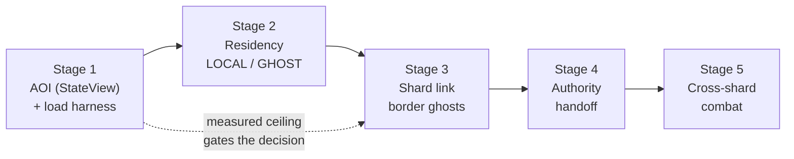
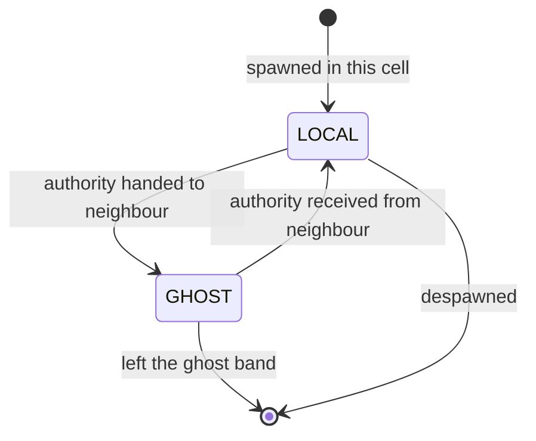
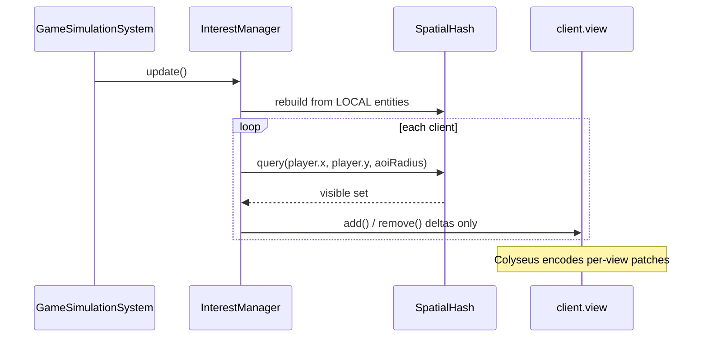
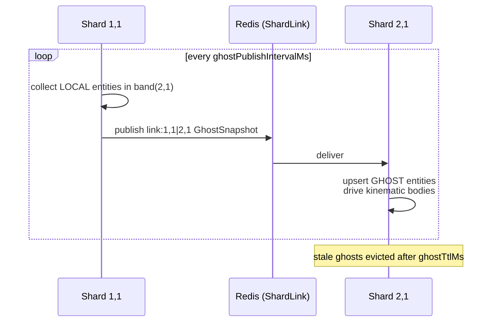
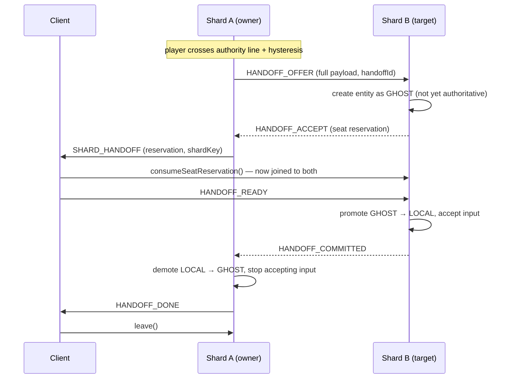
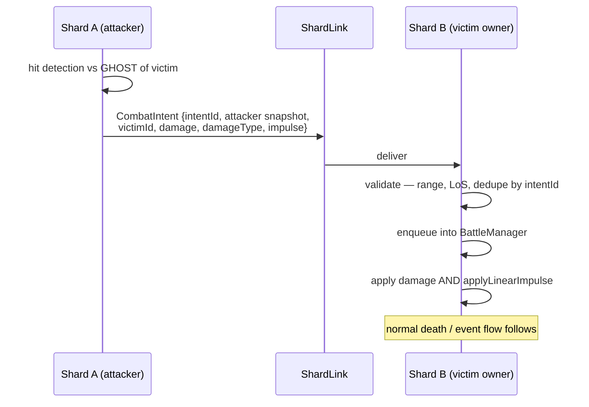

# Seamless large-world scaling — design

**Idea:** I-058 · **Date:** 2026-08-01 · **Status:** design, awaiting approval
**Scope:** all five stages — AOI, residency, shard link, authority handoff, cross-shard combat

---

## TL;DR

Today `atlas-world-svc` runs **one world = one room = one Node process = one Planck world**, and every client receives the full state of every entity. This design takes it to a **seamless continuous world**: a fixed grid of shards, each an authoritative room, where players walk across shard borders without a loading screen and can see — and eventually fight — across those borders.

It lands in five stages. Stages 1–2 are low-risk, ship value alone, and cause no regression. Stages 3–5 are a genuine distributed-systems build on a framework that provides pipes but no semantics.

<div class="callout warn">
<strong>Read the risk register before the design.</strong> Four concerns are serious enough to change what you build, and one of them — no measured bottleneck — may mean stages 3–5 are unnecessary. They are recorded here deliberately rather than discovered during implementation.
</div>

---

## Problem <span class="topic-chip">motivation</span>

A single room is bounded by two independent limits:

- **Bandwidth per client** — every client currently receives every entity. This scales with *total* entity count, so a bigger world is directly more expensive for every player, even players who can see none of it.
- **CPU per tick** — physics, AI, and combat for all entities run in one Node thread at a 50 ms tick (`config/gameConfig.ts:8`). This scales with *entity count*, not map area.

Map **area** is not itself a cost. A large empty world is free. The cost is entities. Both limits must be addressed, and they are addressed by different mechanisms: bandwidth by interest management, CPU by sharding.

### Success criteria

| Criterion | Target |
|---|---|
| Client snapshot size | Independent of total world entity count; scales only with entities inside the player's AOI radius |
| World capacity | Scales linearly with shard count |
| Border crossing | No perceptible input freeze; no entity pop-in for entities already within AOI |
| Regression | A 1×1 grid behaves identically to today |
| Authority | Exactly one shard accepts input for a given player at any instant — never zero, never two |

---

## Risk register <span class="topic-chip">read first</span>

<div class="metric-grid">
<div class="metric-tile alarm"><strong>R1</strong><br/>Bottleneck never measured</div>
<div class="metric-tile alarm"><strong>R2</strong><br/>Knockback breaks at seams</div>
<div class="metric-tile"><strong>R3</strong><br/>Boss fights straddling borders</div>
<div class="metric-tile"><strong>R4</strong><br/>Agones model mismatch</div>
</div>

### R1 — The bottleneck has never been measured 🔴

There is **no load or stress test in the repository**. `src/tests/` contains `ai-performance.test.ts` and nothing else resembling load. The room ships with `maxClients = 1` (`rooms/GameRoom.ts:56`) and `mobCount: 1` (`config/gameConfig.ts:15`).

Sharding is therefore a solution to a ceiling nobody has located. One Node process with Planck at 20 Hz may hold 300 players and 1000 mobs, or may fail at 40. That number determines whether the grid is 1×1 or 10×10, and how large a cell should be.

<div class="callout danger">
<strong>Mitigation (mandatory, gates Stage 3):</strong> Stage 1 includes a load harness that drives N synthetic players and M mobs against a single room and records tick duration, physics step, and snapshot bytes. <strong>Cell size must be derived from its output</strong>, not guessed. If a single room comfortably exceeds the target population, stages 3–5 should be reconsidered before being built.
</div>

### R2 — Knockback does not survive a border 🔴

Knockback is a core mechanic, not decoration. It is applied in four places:

- `physics/PlanckPhysicsManager.ts:396` and `:729` — `applyLinearImpulse`
- `modules/BattleModule.ts:122` — `damage * attackImpulseMultiplier`
- `modules/projectile/ProjectileCollisionResolver.ts:111` **and `:234`** — same on projectile hits

with `attackImpulseMultiplier: 20` (`config/gameConfig.ts:21`), commented in-repo as "Doubled to 20 for impactful knockback". Note there are **four** impulse sites, not three; R2's mitigation must cover both `ProjectileCollisionResolver` branches.

A ghost is a read-only copy with no physics authority. Applying an impulse to a ghost does nothing. Two consequences:

1. Hitting a target across a border produces damage but **no knockback**, unless the impulse is explicitly forwarded.
2. Two players standing either side of a border **overlap** — neither server owns both bodies, so neither resolves the collision.

**Mitigation:** Stage 5 forwards impulse as a first-class `ImpulseIntent` alongside damage (see [Stage 5](#stage-5--cross-shard-combat)). Body overlap at the seam is *accepted* — mitigated by making the ghost band wide enough that overlapping pairs are rare, and by treating the seam as low-traffic terrain in content design.

### R3 — Boss fights straddling a border are incoherent 🟠

A boss is `LOCAL` to exactly one shard. If part of a raid stands in the neighbouring shard, those players are ghosts to the boss: stale positions, proxied damage, and the threat/aggro table shipped in F-023 exists in one room only. Threat ordering across shards would be wrong.

<div class="callout action">
<strong>Mitigation is a content rule, not code:</strong> boss arenas, dungeons, and any encounter with a threat table <strong>must sit entirely inside one cell</strong> and never straddle a boundary. This constrains map authoring permanently and must be enforced by the map validation gate (see <a href="#content-constraints">Content constraints</a>).
</div>

### R4 — Agones is the wrong shape for a persistent world 🟠

`docs/networking.spec.md` describes the current model: Nakama calls Agones Allocation, which starts a pod for a match and shuts it down when the match ends. That is allocate-on-demand, match-scoped, ephemeral.

A world grid needs the opposite: pods that are **always running and addressable by cell coordinate**, even with zero players, because a neighbour must still be able to fetch ghosts from them and hand players off to them. A shard with no players is not idle — it is a required participant in its neighbours' borders.

**Mitigation:** Stage 3 introduces a persistent shard deployment (StatefulSet-shaped, stable per-cell identity and DNS) that runs alongside, not instead of, the existing Agones fleet. Instanced content (dungeons, arenas) keeps the Agones match model. Detailed in [Deployment](#deployment-changes).

### Lesser risks

| Risk | Impact | Mitigation |
|---|---|---|
| **Ghost staleness** — ~60–100 ms (one 50 ms tick + broker hop) | Cross-border melee hits where the target *was* | Client-side interpolation + extrapolation of ghosts; accept residual error; lag compensation deferred |
| **Redis as shared bottleneck** — every adjacent pair publishing through one broker | Hotspot at scale | `ShardLink` is an interface; Redis is one implementation. Direct pod-to-pod transport can replace it without touching callers |
| **Handoff payload completeness** — cooldowns, pending attacks, buffs, in-flight casts, threat entries | Subtle bugs that only appear near borders | Handoff payload is a versioned contract with an exhaustiveness test; a round-trip property test asserts serialize→deserialize is lossless |
| **Client risk** — dual-connect handoff lands in an unbuilt Godot client | Schedule risk on the least stable component | Stage 4 defines a server-side conformance harness so the protocol can be tested without a real client |
| **Tick granularity** — 50 ms, not the 30 Hz the README advertises | Coarse handoff and ghost timing | Documented; ghost publish rate is configurable independent of tick rate |

---

## Stage map



| Stage | Adds | Ships value alone | Risk |
|---|---|---|---|
| **1 — AOI** | Per-client `StateView` filtering; load harness | ✅ Bandwidth decoupled from world size | **Medium** — see [Stage 1](#stage-1--interest-management-aoi); it is not additive |
| **2 — Residency** | `LOCAL`/`GHOST` on `WorldObject`; systems iterate local only | ✅ No behaviour change; unlocks 3–5 | Low, but invasive |
| **3 — Shard link** | Grid topology; Redis border snapshots; see across borders | ⚠️ Requires ≥2 shards to matter | High |
| **4 — Handoff** | Authority transfer + client dual-connect | ✅ The seamless payoff | High |
| **5 — Cross-shard combat** | Damage + impulse intents across the link | ✅ Completes the world | Medium |

**Out of scope:** map authoring and the runtime map loader (that is I-015); Godot rendering and interpolation; Nakama meta-systems beyond mid-play seat reservation; the asset pipeline; lag compensation.

---

## Core concepts

### World grid

A **world** (e.g. `world-01`) of dimensions W×H is partitioned into a fixed grid of `cellSize` × `cellSize` cells. One cell is one Colyseus room, one pod, one Planck world.

```
   world-01, cellSize = 1000
   ┌──────────┬──────────┬──────────┐
   │   0,0    │   1,0    │   2,0    │      shardKey = "world-01:1,0"
   │          │          │          │      MAP_KEY env carries it
   ├──────────┼──────────┼──────────┤
   │   0,1    │ ◀ 1,1 ▶  │   2,1    │      each cell:
   │          │          │          │        1 room · 1 pod · 1 Planck world
   └──────────┴──────────┴──────────┘
```

This **generalizes the existing `mapId`** rather than replacing it. Today `GameRoom.onCreate` reads `options.mapId` (default `map-01-sector-a`) and `getMapDimensions` resolves per-map dimensions (`config/mapConfig.ts:10`). A shard key resolves the same way, plus cell coordinates and world-space origin.

<div class="callout success">
<strong>A 1×1 grid is byte-for-byte today's behaviour.</strong> Single-shard is the degenerate case of the sharded design, so stages 3–5 can land without regressing the single-room game, and the existing <strong>80</strong> test files continue to exercise a valid configuration. (<code>CLAUDE.md</code>'s "~55" is stale.)
</div>

**Fixed grid, not dynamic splitting.** Adaptive re-partitioning under live entities is a research problem — it requires migrating arbitrary entity sets between processes while they are being simulated. Rebalancing is done by changing cell sizes between deploys. Deliberate YAGNI.

#### Cell shape: hexagons, not squares <span class="topic-chip">decided 2026-08-02</span>

Cells are **regular hexagons**. Three independent reasons, all permanent:

| | Square | Hexagon |
|---|---|---|
| Cells meeting at a vertex | **4** | **3** |
| Neighbours | 8 — 4 edge-adjacent, 4 corner-only | **6, all edge-adjacent** |
| Border length for equal cell area | `4.00·√A` | **`3.72·√A` (~7% less)** |

1. **Fewer participants at the worst point.** A square's corner is shared by four cells, so a player standing there may need ghosts from three neighbours at once, and a handoff there is a four-way geometric decision. A hex vertex is shared by three.
2. **One kind of neighbour.** A square has edge-neighbours and corner-neighbours, which need different ghost-band geometry and make `isInBand` two cases instead of one. All six hex neighbours are edge-adjacent and equidistant. This removes the "diagonal neighbours" open question entirely — it is no longer 4-vs-8, it is always 6.
3. **Less border per unit area.** ~7% less edge means proportionally fewer entities inside the ghost band, so lower steady-state `ShardLink` traffic forever. The hexagon is the provably optimal tiling for minimising perimeter per area (honeycomb conjecture, Hales 1999).

**Costs, recorded honestly:** axial/cube hex coordinates are less familiar than `(cx, cy)` — standard and well-documented, but roughly 50 lines of non-obvious math, all confined to `ShardTopology.ts`. The world's outer rim is jagged rather than a clean rectangle; clip it or accept it.

**What this does not affect:** map art, terrain zones, and spawn areas stay rectangular. Sharding partitions **continuous space**, not tiles — entities carry float world coordinates, so the shard lattice and the content lattice are independent. Stage 1 is also unaffected: AOI is a radius query and is shape-agnostic.

<div class="callout info">
<strong>No central bridge.</strong> Shards communicate peer-to-peer over <code>ShardLink</code>. A central bridging service was considered and rejected — it is the "gateway multiplexer" option from the handoff-model decision: an extra latency hop on every message, a throughput bottleneck, and a single point of failure for the entire world.
</div>

### Residency

Every `WorldObject` gains a residency. This is the conceptual core of stages 2–5.



- **`LOCAL`** — this shard owns it, simulates it, and is the sole authority for its state. It has a dynamic Planck body.
- **`GHOST`** — owned by a neighbouring shard, replicated read-only for visibility and targeting. It has a **kinematic** Planck body: position is driven by incoming snapshots, it produces no collision response against local bodies, and no system may mutate it.

The class hierarchy is `Schema → WorldObject → WorldLife → {Player, Mob, NPC}` and `WorldObject → Projectile` (`schemas/WorldObject.ts:3`, `schemas/WorldLife.ts:14`). Residency goes on **`WorldObject`** so projectiles inherit it.

<div class="callout info">
<strong>Note:</strong> <code>CLAUDE.md</code> describes this hierarchy as rooted at <code>Entity.ts</code>. No such file exists. The doc should be corrected — tracked separately, not part of this work.
</div>

### Ghost band

Each shard publishes to a neighbour any entity within `ghostBand` of the shared edge.

```
        shard 1,1                    │        shard 2,1
                                     │
    ┌────────────────────────────────┼─────────────────┐
    │                     ░░░░░░░░░░ │ ░░░░░░░░░░      │
    │      LOCAL          ░ band  ░░ │ ░░ band ░       │
    │      entities       ░ (pub) ░░ │ ░░ (pub)░       │
    │                     ░░░░░░░░░░ │ ░░░░░░░░░░      │
    └────────────────────────────────┼─────────────────┘
                                     │
                              authority line
    ◀──── ghostBand ────▶│◀──── ghostBand ────▶
```

Band width must satisfy:

```
ghostBand ≥ aoiRadius + (maxEntitySpeed × handoffTimeoutMs / 1000)
```

The `aoiRadius` term ensures a player standing exactly on the authority line still receives a full interest radius into the neighbour. The speed term ensures a fast entity cannot cross the entire band within one handoff window, which would produce a pop-in.

---

## Stage 1 — Interest management (AOI)

**Goal:** each client receives only entities within `aoiRadius` of its player. Independent of sharding; useful immediately.

### Mechanism

`@colyseus/schema` v4 ships `StateView` (`node_modules/@colyseus/schema/build/index.d.ts:29`), which replaces the removed `@filter` decorator. Each client is assigned a view; only entities added to that view are encoded for it.

<div class="callout warn">
<strong>Nothing to extend — no AOI structure exists in the code.</strong> An exhaustive grep of <code>colyseus-server/src</code> for <em>spatial / aoi / grid / cell / quadtree / broadphase / interest / neighbour</em> returns no interest structure. The only near-hit, <code>config/physicsConfig.ts:125-126</code> (<code>enableBroadphase: true, broadphase: 'SAP'</code>), is <strong>dead config read by nothing</strong>, and would be Planck's collision broadphase, not network interest management. Stage 1 builds this from zero.
<br/><br/>
<code>README.md:16</code> is <em>consistent</em> with this — it sits in the performance-budget block and states AOI as a <strong>target</strong> ("budget: 15-25 entities; ~800B peak/client"), the same way the block states a 30 Hz tick the config does not run. Stage 1 should adopt that budget as its goal. What <strong>is</strong> wrong is the workspace-level <code>repos/CLAUDE.md:16</code>, which lists "AOI grid" as an architectural <em>fact</em> of this service alongside Planck physics. That file is outside this repo; correcting it is a separate housekeeping task.
</div>

### Components

**New — `src/interest/InterestManager.ts`**

- Owns one `StateView` per client.
- Each tick (or every Nth tick, configurable), recomputes each client's visible set and applies the delta — `view.add(entity)` / `view.remove(entity)`.
- Backed by a uniform spatial hash sized to `aoiRadius` so recomputation is O(entities near the player), not O(all entities).
- **The visible-set computation takes a pluggable per-client predicate, not a hard-wired `query(x, y, aoiRadius)`.** See [the phasing hook](#the-phasing-hook-i-053) below — this is the one part of Stage 1 that genuinely cannot be retrofitted.

**Changed — `schemas/GameState.ts`** ← *missing from the original draft*

View filtering is **opt-in per field**. A field is only filtered if it carries a `@view()` tag (`@colyseus/schema` `build/index.mjs:1124` — `isFiltered = this.isFiltered || (this.metadata?.[index]?.tag !== undefined)`). So the five root collections at `GameState.ts:21-25` (`players`, `mobs`, `npcs`, `projectiles`, `zoneEffects`) must each gain `@view()`. **A client that is never assigned a view then receives nothing** — which is why the own-entity invariant test below exists.

**Changed — `src/codegen/isolate-schemas.ts`** ← *missing from the original draft*

The C# codegen isolator copies every decorator verbatim (`isolate-schemas.ts:56-59`) but seeds its import set with only `['Schema', 'type']` (`:44`, plus `ArraySchema`/`MapSchema` at `:64-65`). Adding `@view()` emits it into `generated/.schema-src/GameState.ts` **with no `view` import**, breaking `npm run client:csharp` and the drift gate `scripts/codegen/check_drift.sh`. One-line fix, but it must be in the same commit as the schema change.

**Changed — `rooms/GameRoom.ts`**

- `onJoin` (`:165`) creates the client's view; `onLeave` (`:199`) disposes it. `client.view` is the documented seam (`@colyseus/core@0.17.44 build/Transport.d.ts:95`).
- The interest update slot is added to the simulation pass.
- **`maxClients = 1` (`:56`) has to become config-driven** — see [Testing](#testing) below.

**Changed — `rooms/systems/GameSimulationSystem.ts`**

- One new ordered step, after entity updates and before patch encoding, so views reflect post-simulation positions. The existing single ordered pass is `GameSimulationSystem.ts:7-41`.

**Changed — `config/gameConfig.ts`**

- `GAME_CONFIG` is declared `as const` (`:25`). Adding env-overridable AOI keys means either dropping `as const` or introducing a parallel mutable object; pick one deliberately.

### The phasing hook (I-053)

I-053 asks for **phasing** — two players in one room seeing different world contents based on progression, not distance. Triage verdict: **a rider on this stage, not a duplicate of it.**

`StateView` is predicate-agnostic — `add(obj: Ref, tag?: number)` (`build/encoder/StateView.d.ts:51`) takes any ref, and nothing in the API is distance-aware. So one view per client can carry both predicates by intersection: `visible = nearby(x, y, r) ∩ phaseVisible(player)`. **But** if `InterestManager` owns the view authoritatively and recomputes it from the spatial hash every tick, any phase-driven `add()` is silently `remove()`d on the next tick. Hence the pluggable predicate above.

Two hard limits, recorded here so Stage 1 does not over-promise:

- **A view can hide a field; it cannot give client A value X and client B value Y for the same ref+field.** `Encoder` holds a single `state` tree (`build/encoder/Encoder.d.ts:11`) and `encodeView` encodes from it (`:20`). Divergent world *content* must be modelled as **two entity instances**, not one field with two values.
- **Physics is not view-filtered.** Two phase-variants of an NPC means two dynamic Planck bodies in one world, and a phase-A player would physically collide with the phase-B body. No stage in this design addresses that; it needs a Planck collision-filter category per phase.

Everything else I-053 needs is outside this design: the room has **no progression state at all** (`GameRoom.onJoin` fetches only a `LoadoutSnapshot`, `GameRoom.ts:185` → `src/meta/applyLoadout.ts`; quest state lives in `nakama/src/questEngine.ts`), so the phase predicate has no input until a new Nakama RPC and join-time fetch exist.

### Data flow



### Hysteresis

Entities are added at `aoiRadius` and removed at `aoiRadius × aoiHysteresis` (default 1.15). Without this, an entity oscillating on the radius boundary is added and removed every tick, producing continuous churn and visible flicker.

### Load harness (gates R1)

**New — `src/tests/load/roomLoad.harness.ts`**, run manually and in a nightly CI job, not in the default `npm test`:

- Drives N synthetic players (scripted input) and M mobs in one room.
- Records p50/p95/p99 tick duration, physics step duration, entities simulated, snapshot bytes per client, and heap.
- Sweeps N and M to locate the knee.

<div class="callout metric">
<strong>Output artifact:</strong> a capacity table — for each (players, mobs) pair, whether p95 tick duration fits inside the 50 ms budget. <strong>This table sets <code>cellSize</code>.</strong> Without it, Stage 3 is guesswork.
</div>

<div class="callout warn">
<strong>The harness is not "just write a file" — the repo has no tooling for it.</strong> <code>@colyseus/testing</code> is <strong>not installed</strong> (<code>colyseus-server/package.json:39-56</code> — devDeps are jest / ts-jest / ts-node / ts-morph only). <code>colyseus.js</code> is a runtime dependency (<code>:34</code>) but is pinned at <code>^0.16.19</code> against a <strong>0.17</strong> server — an unflagged version skew. Two viable paths: add <code>@colyseus/testing</code>, or hand-roll an in-process harness instantiating <code>GameRoom</code> + <code>GameSimulationSystem</code> directly, the pattern <code>src/tests/game-simulation-integration.test.ts</code> and <code>src/tests/f018-harness.ts</code> already prove. Note that <strong>snapshot bytes per client — the single most important number here — cannot be measured without real clients or a hand-driven <code>Encoder</code></strong>. Decide which before Stage 1 starts.
</div>

### Testing

- Membership: an entity crossing into/out of `aoiRadius` is added/removed exactly once; hysteresis prevents oscillation.
- Correctness: a client's decoded state contains exactly the expected set.
- Bandwidth: an assertion that snapshot bytes with AOI enabled are materially smaller than without, at a fixed entity count — the regression guard for the whole stage.
- Own-entity invariant: a player's own entity is **always** in its view regardless of geometry.

<div class="callout danger">
<strong><code>maxClients = 1</code> makes half of these tests impossible today.</strong> <code>GameRoom.ts:56</code> seats one client. The membership and bandwidth tests both need ≥2 seated clients, and <code>maxClients = 1</code> is load-bearing for the current single-player debug posture (<code>gameConfig.ts:15</code> <code>mobCount: 1</code>) that the existing <strong>80</strong> test files were written under. Stage 1 must pick one: <strong>(i)</strong> make <code>maxClients</code> config-driven and prove the full suite still passes, or <strong>(ii)</strong> test <code>InterestManager</code> + <code>StateView</code> in isolation against synthetic refs, with no real room. The original draft assumed multi-client tests were already possible.
</div>

---

## Stage 2 — Residency model

**Goal:** the room stops assuming `state` is the whole world. No behaviour change, no cross-room traffic, single shard throughout. This is the invasive refactor that makes stages 3–5 additive rather than a rewrite.

### Components

**Changed — `schemas/WorldObject.ts`**

- Adds `residency: 'LOCAL' | 'GHOST'`, defaulting to `LOCAL`.
- Adds `ownerShard: string` — empty for local entities, the owning shard key for ghosts.
- Adds `authoritySeq: number` — a monotonic counter used to resolve split-brain (see Stage 4).

Residency is `@type`-annotated and replicated, because the client must render ghosts differently (no prediction, interpolation only) and must not accept input for them.

**Changed — `schemas/GameState.ts`**

- Adds indexed accessors: `localPlayers()`, `localMobs()`, `localNPCs()`, `localProjectiles()`. Maintained as incrementally-updated sets, not per-call filters — the simulation loop runs these every tick and per-call filtering would add O(n) work to every step.

**Changed — every consumer of the raw maps**

`GameSimulationSystem` currently iterates `state.players`, `state.mobs`, `state.npcs`, and `state.projectiles` wholesale (`rooms/systems/GameSimulationSystem.ts` — `updatePlayers:51`, `updateMobs:83`, `updateNPCs:93`). These become local-only iterations. The same change applies in `AIModule` / `AIWorldInterface`, `MobLifeCycleManager`, `ZoneEffectManager`, `BattleModule`, and `ProjectileManager`.

**New — the ghost-mutation guard**

In non-production builds, mutating a `GHOST` throws. Implemented as a dev-only property trap installed on ghost instances.

<div class="callout danger">
<strong>This guard is the foundation of stages 3–5.</strong> Every correctness property later — no duplicate authority, no double damage, no divergent physics — reduces to "a shard only mutates what it owns". Enforcing it mechanically in Stage 2, while there are still zero ghosts in existence, is dramatically cheaper than discovering violations across a network in Stage 4.
</div>

### Physics

`PlanckPhysicsManager` gains a body kind. `LOCAL` entities get dynamic bodies as today. `GHOST` entities get **kinematic** bodies: position set directly from snapshots, no forces, and a collision filter that excludes ghost-vs-local contact response while still permitting sensor overlap so hit detection and targeting work.

### Testing

- Invariant: with all entities `LOCAL`, every existing test passes unchanged. This is the stage's primary gate — Stage 2 must be behaviour-preserving.
- Guard: mutating a ghost throws in dev.
- Index correctness: local-set accessors match a naive filter after arbitrary spawn/despawn/residency-change sequences (property test).
- Physics: a ghost body does not push a local body; a ghost body still registers sensor overlap.

---

## Stage 3 — Shard link and border ghosts

**Goal:** a shard can see into its neighbours. No crossing yet.

### Components

**New — `src/shard/ShardTopology.ts`**

Pure functions, no I/O: `cellForPoint(x, y)`, `neighboursOf(cell)`, `isInBand(entity, neighbourCell)`, `shardKey(world, cx, cy)`, `originOf(cell)`. All world coordinates are **global**, never cell-relative — cell-relative coordinates would require translation on every handoff and every ghost apply, and would make cross-shard geometry error-prone.

**New — `src/shard/ShardLink.ts`**

Transport interface — `publish(channel, payload)` and `subscribe(channel, handler)` — with a Redis implementation over `@colyseus/redis-presence` — **which is NOT installed**. `require.resolve('@colyseus/redis-presence')` from `colyseus-server` fails with `MODULE_NOT_FOUND`; it exists only inside the `colyseus` bundle's private pnpm tree, and resolves there to **0.16.4**, not the `^0.17.7` that `colyseus@0.17.10` declares (same skew for `redis-driver`: 0.16.1). Stage 3 must add it as a direct dependency *and* resolve that version skew — it is not the solved prerequisite the original draft assumed. One channel per **unordered adjacent pair**, e.g. `link:world-01:1,1|2,1`, so a shard subscribes to at most 8 channels.

Keeping this an interface is what makes the Redis bottleneck (lesser risk) escapable later without touching callers.

**New — `src/shard/GhostSync.ts`**

- **Publish:** every `ghostPublishIntervalMs` (default 100 ms — decoupled from the 50 ms tick), collect local entities in each neighbour's band and publish a compact snapshot.
- **Apply:** on receipt, upsert ghosts, update kinematic body positions, and evict ghosts absent from the snapshot for longer than `ghostTtlMs`.

**New — contracts in `contracts/src/shard/`**

The workspace already has an `@atlas/contracts` package (`pnpm-workspace.yaml`, `contracts/src/index.ts`) shared by server and Nakama. The wire protocol belongs there.

`GhostSnapshot` is a deliberately compact, purpose-built payload — **not** the Colyseus schema. It carries `id`, `kind`, `x`, `y`, `vx`, `vy`, `heading`, `hp`, `maxHp`, `team`, `animState`, `ownerShard`, `authoritySeq`, and a `seq` for ordering. Colyseus's encoding is a stateful per-client delta stream and cannot be reused as a server-to-server format.

### Data flow



### Failure handling

| Failure | Behaviour |
|---|---|
| Link down / broker unreachable | Ghosts freeze, then evict after `ghostTtlMs`. Handoffs blocked — players are soft-walled at the border. **The world degrades to independent sectors and keeps running.** |
| Out-of-order snapshot | Dropped by `seq` comparison |
| Neighbour shard down | Same as link down for that pair only; other borders unaffected |

<div class="callout info">
Degradation is deliberately <em>visible and safe</em> rather than silent. A soft wall at a border is a bug report; a player falling into an unsimulated cell is data loss.
</div>

### Testing

- Two rooms in one process with an **in-memory `ShardLink`**: assert ghost convergence, TTL eviction, and out-of-order rejection. This is the workhorse harness for stages 3–5 and avoids needing real pods for logic tests.
- Band membership: `isInBand` property tests against a naive geometric check.
- Link-down: assert ghosts evict and handoff is refused rather than hanging.
- A multi-pod integration test extends the existing local k8s stack from F-021 to run ≥2 shard pods.

---

## Stage 4 — Authority handoff

**Goal:** a player walks across a border with no perceptible interruption.

### The invariant

> **Exactly one shard accepts input for a given player at any instant.** Never zero, never two.

Everything in this stage exists to preserve that under packet loss, timeouts, and pod death.

### Protocol



**Authority transfers at exactly one point:** when B receives `HANDOFF_READY`. Before that, B holds the entity as a ghost and ignores its input; A remains fully authoritative. There is no window where both accept input, and none where neither does.

### Hysteresis and cooldown

Handoff triggers only when the player is `handoffHysteresis` units **past** the line, and a `handoffCooldownMs` prevents immediate re-handoff. Without both, a player standing on the boundary with jittering velocity would thrash between shards every tick.

### Handoff payload

A versioned contract, `HandoffPayload` in `contracts/src/shard/`. It must carry every piece of authoritative entity state, including:

- Position, velocity, heading, and physics body parameters
- Health, alive state, death timestamps
- All cooldowns and combat timers; `pendingAttack` / `isAttacking`
- Active buffs and debuffs
- In-flight zone effect casts owned by this entity
- Threat table entries **referencing** this entity, held by mobs on the source shard
- Meta-system state applied at join (the `LoadoutSnapshot` derived stats)

<div class="callout warn">
Omitting a field here produces bugs that only manifest near borders and only sometimes — the hardest class to diagnose. The payload therefore gets an <strong>exhaustiveness test</strong> that fails when a new authoritative field is added to <code>WorldLife</code> or <code>Player</code> without being added to the payload, plus a round-trip property test asserting serialize→deserialize is lossless.
</div>

### Failure handling

| Failure | Behaviour |
|---|---|
| `HANDOFF_ACCEPT` times out | A keeps authority, aborts, retries after cooldown |
| Client never sends `HANDOFF_READY` | B discards the pending entity on timeout; A keeps authority |
| `HANDOFF_COMMITTED` lost | A holds authority; B detects via a commit-ack timer and demotes back to ghost |
| **Split brain** (both claim `LOCAL`) | Resolved by `authoritySeq`: the higher value wins, the loser demotes. Every accepted handoff increments it |
| Shard pod dies mid-handoff | Player reconnects via Nakama to the reallocated pod using a periodic position checkpoint written to Nakama storage |

**Fail-safe direction is always "stay put".** Every timeout resolves toward the source shard retaining authority, because a player who fails to cross is a stuck player, whereas a player owned by nobody is a lost player.

### Client requirements

The Godot client needs a handoff state machine: hold two room connections briefly, keep rendering from the source until `HANDOFF_DONE`, then swap the authoritative stream. Since the client is unbuilt, Stage 4 includes a **server-side conformance harness** — a scripted synthetic client that exercises every branch above — so the protocol is proven before the real client exists.

### Nakama requirement

Nakama must issue **mid-play seat reservations** for a specific shard. Today it allocates at match start (`docs/networking.spec.md`). This is a new RPC: given a valid session and a handoff token from the source shard, return a reservation for the target shard.

### Testing

- State machine: every branch and every timeout, against the in-memory link.
- Soak: a bot walks back and forth across a border for thousands of crossings; assert exactly-one-authority holds continuously and no entity is duplicated or dropped.
- Payload: exhaustiveness and lossless round-trip.
- Split brain: force divergent `authoritySeq` and assert convergence.

---

## Stage 5 — Cross-shard combat

**Goal:** attacks across a border resolve correctly, including knockback.

### The rule

> **The shard that owns the victim resolves the damage.**

This preserves the existing single-authority invariant instead of fighting it, and it maps onto machinery that already exists: `BattleManager` already enqueues damage rather than applying it inline, so a cross-shard hit becomes one more producer for that queue.

### Flow



### Validation on the receiving shard

The receiving shard **must not** trust the intent. It re-checks range and line-of-sight against its own authoritative state, rejects duplicates by `intentId`, and rejects intents older than a freshness window. Ghost staleness means the attacker's view was up to ~100 ms behind, so validation uses a tolerance band rather than exact equality — sized from the measured link latency.

This is server-authority applied to a peer server: the same reasoning that forbids trusting client-reported positions forbids trusting a peer's hit claim.

### Knockback (closes R2)

`ImpulseIntent` travels with `CombatIntent` and carries the impulse vector computed by the attacker's shard using the existing `attackImpulseMultiplier` formula. The victim's shard applies it via `PlanckPhysicsManager.applyLinearImpulse` to the body it owns. Knockback across a border then behaves the same as knockback within one.

### Projectiles

A projectile is a `WorldObject` and therefore hands off using the Stage 4 machinery, minus the client seat reservation — a projectile has no connection. On crossing the authority line, ownership transfers to the target shard, which then performs its own collision detection.

The invariant from `CLAUDE.md` still applies on the receiving side: when `stick()` zeroes velocity, `syncEntityToBody` must be called in the same collision path.

### Testing

- Equivalence: identical combat setups produce identical damage and identical resulting velocity whether the participants are co-located or split across a border. This is the stage's headline test.
- Dedupe: a replayed `intentId` applies damage exactly once.
- Rejection: an intent failing range or freshness validation is dropped and counted.
- Projectile handoff: a projectile crossing a border hits correctly on the far side, and the `stick()` → `syncEntityToBody` path holds.

---

## Configuration surface

Added to `config/gameConfig.ts`, all overridable by environment variable:

| Key | Default | Notes |
|---|---|---|
| `aoiRadius` | *from load harness* | Stage 1 |
| `aoiHysteresis` | `1.15` | Removal radius multiplier |
| `interestUpdateIntervalTicks` | `1` | Raise to trade freshness for CPU |
| `worldId` | `world-01` | Stage 3 |
| `cellSize` | *from load harness* | **Derived from measurement, not guessed** |
| `maxEntitySpeed` | *from existing entity tuning* | Fastest world-units/sec any entity can reach; feeds `ghostBand` |
| `ghostBand` | `aoiRadius + maxEntitySpeed × handoffTimeoutMs / 1000` | Validated at boot |
| `ghostPublishIntervalMs` | `100` | Independent of tick rate |
| `ghostTtlMs` | `500` | Eviction after link loss |
| `handoffHysteresis` | `2.0` world units | Stage 4 |
| `handoffCooldownMs` | `1000` | Anti-thrash |
| `handoffTimeoutMs` | `2000` | Per protocol step |
| `combatIntentFreshnessMs` | `250` | Stage 5 validation window |

Boot-time validation refuses to start if `ghostBand < aoiRadius`, which would produce silent pop-in at every border.

---

## Deployment changes

Stage 3 introduces persistent shard pods **alongside** the existing Agones fleet, not replacing it:

- **Persistent world shards** — stable identity per cell, always running, addressable by coordinate. `MAP_KEY` carries the shard key. StatefulSet-shaped with stable DNS so neighbours resolve each other without a discovery service.
- **Instanced content** — dungeons, arenas, and any encounter that must not straddle a border keeps the current Agones allocate-on-demand model.
- **Redis** — required infrastructure from Stage 3 onward, for both `ShardLink` and `@colyseus/redis-driver` room discovery across processes.
- **Nakama** — gains the shard directory (map a world position to a shard endpoint) and the mid-play seat reservation RPC.

`docs/networking.spec.md` needs a companion section describing the persistent-shard exposure model; the existing HostPort recommendation still applies per pod.

---

## Content constraints

These constrain map authoring permanently and must be enforced by the map validation gate rather than left to author discipline:

1. **Boss arenas and any encounter with a threat table must lie entirely within one cell.** See R3.
2. **Cell boundaries should fall on low-traffic terrain** — walls, cliffs, water — so seam artifacts (body overlap, ghost staleness) occur where players rarely fight.
3. **Spawn points must not sit inside a ghost band**, so a newly spawned entity is unambiguously owned.
4. **No static geometry may straddle a boundary** unless it is duplicated identically in both cells, since each Planck world builds its own static bodies.

---

## Observability

Prometheus metrics, extending the existing exporter:

- `shard_entities{residency}` — local vs ghost counts
- `shard_link_publish_bytes`, `shard_link_apply_latency_ms`
- `shard_handoff_total{result}` — committed / aborted / timeout
- `shard_handoff_duration_ms`
- `shard_split_brain_total` — **should be zero; alert on any increase**
- `aoi_snapshot_bytes` — per client, the Stage 1 payoff metric
- `combat_intent_total{result}` — applied / rejected / duplicate

---

## Open questions

1. **Cell size and AOI radius** — cannot be answered until the Stage 1 load harness runs. Everything downstream depends on these two numbers.
2. **Do mobs hand off, or are they cell-bound?** Cell-bound mobs (they turn back at the border, like the existing `BoundaryAwareBehavior`) are far simpler and remove most mob handoff traffic. Handing off mobs is more believable. **Recommendation: cell-bound in Stage 4, revisit after.**
3. **Does world state persist across shard restart?** Players persist through Nakama already. Mobs are proposed as ephemeral and respawned from spawn tables. Persistent world objects — dropped loot, player structures — are undesigned and out of scope here.
4. ~~**Diagonal neighbours** — a corner cell has 8 neighbours; publish to all 8 or only the 4 edge-adjacent?~~ **Closed 2026-08-02 by the move to hexagons.** A hex has exactly 6 neighbours, all edge-adjacent — there is no diagonal case to decide. See *Cell shape* above.
5. **Phasing (I-053)** — is phasing in Season 1 scope at all? Stage 1 must ship the pluggable predicate either way (it is cheap now, expensive later), but per-phase Planck collision filtering and the Nakama progression fetch are only worth building if the answer is yes. **This is a content/design call, not an engineering one.**

---

## Appendix — files touched

| Stage | New | Changed |
|---|---|---|
| 1 | `src/interest/InterestManager.ts`, `src/tests/load/roomLoad.harness.ts` | **`schemas/GameState.ts`** (`@view()` on the 5 root collections), **`src/codegen/isolate-schemas.ts`** (emit the `view` import), `rooms/GameRoom.ts` (view lifecycle + `maxClients`), `rooms/systems/GameSimulationSystem.ts`, `config/gameConfig.ts` |
| 2 | ghost-mutation guard | `schemas/WorldObject.ts`, `schemas/GameState.ts`, `rooms/systems/GameSimulationSystem.ts`, `physics/PlanckPhysicsManager.ts`, `ai/AIModule.ts`, `ai/AIWorldInterface.ts`, `modules/MobLifeCycleManager.ts`, `modules/ZoneEffectManager.ts`, `modules/BattleModule.ts`, `modules/ProjectileManager.ts` |
| 3 | `src/shard/ShardTopology.ts`, `src/shard/ShardLink.ts`, `src/shard/GhostSync.ts`, `contracts/src/shard/*` | `rooms/GameRoom.ts`, `config/mapConfig.ts`, deployment manifests |
| 4 | `src/shard/HandoffCoordinator.ts`, conformance harness | `rooms/GameRoom.ts`, `rooms/handlers/PlayerInputHandler.ts`, Nakama RPC module |
| 5 | `src/shard/CrossShardCombat.ts` | `modules/BattleManager.ts`, `modules/BattleModule.ts`, `modules/projectile/ProjectileCollisionResolver.ts` |
