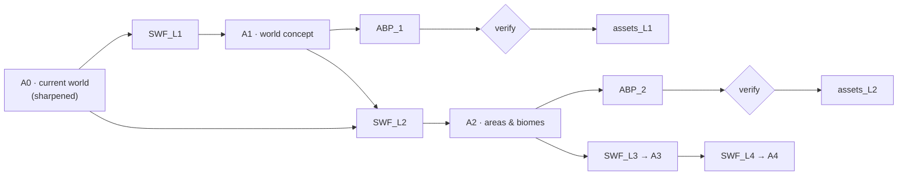

# Synthesis Workflow (SWF) — contract, research plan, quality bar

**Date:** 2026-08-01
**Status:** proposed — awaiting one decision (§7)
**Purpose:** define how world artifacts get made, so that every level is researched before it is written and every artifact is judged against the same bar.

<strong>Why this exists.</strong> The first attempt at the myth layer was synthesised straight
from the model's own head with no research. It is parked, uncommitted, as
<code>cosmology-draft-zero.md</code> — kept deliberately as the "no research" baseline to compare
the researched version against.

## 1. The pipeline

Each `SWF_LN` is the same three-stage machine:

| Stage | Does | Output |
|---|---|---|
| **Research** | find sources → extract mechanisms → analyse | a source dossier with citations |
| **Brainstorm** | diverge; generate options; kill clichés | an options set, each with trade-offs |
| **Synthesise** | converge; write the artifact | `A_N` |

**Non-negotiable:** synthesis may not begin until research and brainstorm outputs exist as files. An artifact with no dossier behind it is rejected on process, regardless of quality.

## 2. Level definitions

| Level | Artifact | Scope |
|---|---|---|
| **L0** | `A0` | What the world already is — canon, geography, factions, magic, story, bestiary. Sharpened, not invented. |
| **L1** | `A1` | World concept: god(s), Void, deep-time legend, world map, the 6 towns |
| **L2** | `A2` | Areas & biomes: the 3 live regions, their ecology, what lives where and why |
| **L3** | `A3` | Races beyond the 8, dungeons, camps, bosses |
| **L4** | `A4` | NPCs, mobs (116 already drafted), items |

## 3. Artifact contract — what every `A_N` must contain

An artifact is **rejected** if any section is missing.

1. **Provenance** — which `A_<N` it derives from, and the dossier it was researched against.
2. **Claims** — the new facts, numbered, each declarative and binding.
3. **Causal links** — for each claim, what *already existing* fact it explains. A claim that explains nothing is decoration.
4. **Consequences** — for each claim, at least **two second-order effects** on ordinary life: work, trade, law, burial, food, travel, who gets rich.
5. **Costs & limits** — what the thing costs, who cannot have it, what it fails against. Power with no cost is not worldbuilding.
6. **Known-wrong** — what people *believe* that is false, in the style of canon §3's who-knows-what matrix.
7. **What this does not change** — explicit list of existing content left valid.
8. **Contradiction rule** — matching canon §6.
9. **Open questions** — what the next level must resolve.

## 4. Quality checklist — is this a good artifact?

Scored before acceptance. **Any ❌ on a Gate item blocks.**

### Gate items (blocking)

<strong>G1 · The swap test.</strong> Replace every proper noun with a placeholder. If the result
reads like generic high fantasy, it is a re-skin. <strong>Reject.</strong>

- **G2 · Explains, not appends.** Every claim ties to something already on the page (contract §3). An artifact that only adds is a parallel world, not this one.
- **G3 · Has a cost.** Every power, blessing and relic has a price, a limit, and something it loses to.
- **G4 · Voice.** Obeys `content/story/style.md`. No capital-letter portent, no prophecy cadence, no invented archaisms.
- **G5 · No contradiction.** Nothing collides with `canon.md`, the 152 story nodes, the novel, or the 116-monster bestiary — or, if it does, the collision is named and the fix is proposed in the same commit (canon §6).
- **G6 · Ordinary life is legible.** After reading it, you can say what changes for a miller, a caravan guard and a bell-warden.

### Quality items (scored, not blocking)

| # | Test | Good looks like |
|---|---|---|
| Q1 | **Second-order yield** | ≥3 implications the author did not set out to write |
| Q2 | **Specificity** | Named, countable, mundane detail — not abstraction |
| Q3 | **Inversion** | At least one expectation deliberately turned over |
| Q4 | **Material grounding** | Someone profits; someone pays; there is a supply chain |
| Q5 | **Hook density** | ≥3 things a quest could be hung on |
| Q6 | **Restraint** | Leaves gaps for later levels rather than filling everything |

## 5. Research plan — where to look, and where NOT to

<strong>The core insight about this world.</strong> Undertow's strength is already
<strong>materialist</strong> worldbuilding: Gildmark's harbour monopoly, magic-stone economics,
antimagic runes explaining why a magical world fights with steel, a church that owns the news.
The non-cliché move is to keep researching in that register — <strong>anthropology and economics,
not fantasy fiction.</strong>

**Search (mechanisms, not aesthetics):**

- Bell traditions in real religion — passing bells, curfew bells, bells as civic infrastructure and legal instrument
- Death rites and the taboo of the unburied — what real cultures believed happens, and what it cost them to do it properly
- Relic economies — how relics were authenticated, traded, faked, and who profited
- Iconoclasm and forbidden knowledge — how and why real institutions banned a practice, and how it survived anyway
- Absent/silent-god theology, and how ordinary belief behaves when the divine is real but unresponsive
- Folk religion vs institutional religion — the gap between what the church teaches and what villagers do

**Explicitly NOT sources** — these are where cliché comes from:

- D&D / Pathfinder pantheons and cosmologies
- Tolkien and its descendants
- Generic fantasy wikis, "top 10 fantasy religions" listicles
- Other games' lore (Lineage 2 included — structure only, never substance)

**Extract into a dossier:** mechanism · who benefited · what it cost · how it failed · one concrete detail worth stealing. **Citation required per row.**

## 6. ABP — asset build pipeline contract

For each level, `ABP_N` turns `A_N` into assets. Every ABP must declare:

1. **Subject list** — derived from `A_N`, countable, each traceable to a claim
2. **Anchor** — what enforces visual consistency (for creatures: the flat-grey silhouette per body plan; for places: to be defined at L1)
3. **Recipe** — the validated generation settings, currently `denoise 0.82`, `steps 24`, `cfg 3`, subject-noun-first prompts with **measurements, never similes** (see §6.1)
4. **Verify gate** — a sample batch reviewed by the owner *before* the full run
5. **Sink** — which manifest and group the output lands in

### 6.1 Known generation traps (measured, not theoretical)

- **Scale similes become the subject.** "the size of a hog" → a hog; "the size of a plough horse" → a horse. Use measurements.
- **Subject noun must lead and repeat**, or later nouns outvote it.
- **Style words alone do not carry non-humanoid subjects.** The 64 class images were consistent because of the silhouette anchor, not the prompt.

## 7. The one open decision

<strong>How much of the existing world may research overturn?</strong>
The owner said "it can be changed", which changes the shape of every SWF run. Three readings:
<ol>
<li><strong>Additive only</strong> — canon, the 152 story nodes and the novel are fixed; research may only explain and extend.</li>
<li><strong>Canon amendable</strong> — <code>canon.md</code> may be revised where research finds something better, but the shipped novel and story graph stay.</li>
<li><strong>Everything on the table</strong> — including the 5-act epic and the 116-monster bestiary.</li>
</ol>
Each later level inherits this answer, so it is settled once, here.

