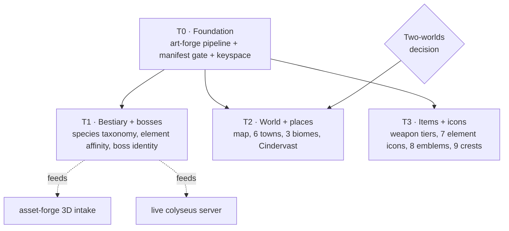

# World Art Bible — program decomposition (T0–T3)

**Date:** 2026-08-01
**Status:** T0 designed (see `2026-08-01-art-forge-foundation-design.md`); T1–T3 stubbed
**Benchmark:** Lineage II's art-bible categories, mapped onto Undertow canon

<strong>What this doc is.</strong> The concept art shipped in release 1.4 covers
<em>people standing still</em> and nothing else — 9 cast, 7 race, 64 class images.
This is the program that closes the rest of the gap, decomposed into four tracks
that each get their own spec → plan → implementation cycle.

## 1. Where we actually are verified

`game-client/assets/art/art-manifest.json` holds **80 entries**, all PNGs in Git LFS:

<strong>9</strong> cast portraits

<strong>7</strong> races (of 8 — <code>art:race-human</code> unminted)

<strong>64</strong> class images (8×8)

<strong>0</strong> mobs · places · items · icons

The only non-doc consumer is `tools/asset-storybook/index.html:782`, which fetches
the manifest at runtime. **No gate validates any of it.**

## 2. Lineage II parity gap

| L2 art pillar | Undertow canon names it | Art status |
|---|---|---|
| Continent map (Aden / Elmore / Gracia) | Millcross hub, Ashvale plain, Thornveil, Northern Icefield, Gildmark coast, Cindervast ruin | text only — `content/maps/atlas-frontier.md` + one SVG in the novel edition |
| Town key art (Giran, Aden, Rune each instantly readable) | 6 towns: Millcross, Embervale, Norhollow, Gildmark, Rooktide, Cindervast | ❌ none |
| Castle / siege architecture — L2's entire endgame | **no castles in canon**; nearest are Bellfaith bell towers, Cindervast's dead gate, Gildmark harbor | ❌ none — see §4 |
| **Bestiary** — L2's largest art category | 6 mob archetypes, named by *mechanic* not species | ❌ none, and no species taxonomy exists |
| Raid-boss key art (Antharas, Baium, Valakas) | F-023 shipped boss threat/aggro **code**; no boss identity | ❌ none |
| Weapon / armor grade silhouettes (D→S progression) | element coatings + magic stones (canon §5) | ❌ none |
| Icon sets (skills, elements, class emblems) | 6 elements + Neutral, 8 classes | ❌ none |
| Clan crests / banners | 9 factions | ❌ none |
| Biome / skybox mood | 5+ distinct biomes | ❌ none |

**Verified subject inventory from `content/story/canon.md`:**

- **Elements (6 + Neutral):** Earth, Water, Wind, Fire (the turning circle), Holy ↔ Void (matched pair outside it), Neutral.
- **Races (8):** Human, Demon, Dwarf, Immortal, Elf, Dragon, Beastkin, Ogre.
- **Classes (8):** Swordsman, Archer, Assassin, Spearman, Mage, Summoner, Engineer, Healer.
- **Factions (9):** `stoneguard`, `bellfaith`, `expedition`, `thornveil`, `ashfang`, `ashen-column`, `embervale-banner`, `norhollow-banner`, `unaligned`.
- **Mob archetypes (6):** aggressive-brute, balanced, defensive-guard, double-attacker, hybrid, spear-thrower.

## 3. The two-worlds problem open

<strong>L2 never had this.</strong> Aden's illustrated map <em>was</em> the playable map.
Atlas has <strong>two worlds that are not the same place</strong>:
<ul>
<li><strong>Lore-world</strong> — 6 towns spread over days of travel (canon §4: Gildmark is 4–5 days from Millcross by the old trade road).</li>
<li><strong>Game-world</strong> — <code>content/maps/atlas-frontier.md</code>: a <strong>1000×1000 world-unit shelf</strong>, 3 regions (Spawn Meadow, Northern Icefield, Thornveil), player spawn at (500,500), <strong>no towns at all</strong>.</li>
</ul>
"Draw the world map" is ambiguous until this is settled. <strong>It is T2's blocking decision, not T0's.</strong>

## 4. Track decomposition

| Track | Scope | Why this position |
|---|---|---|
| **T0 · Foundation** *(blocking)* | Rebuild the Z-Image generation pipeline into `tools/art-forge/` (I-031) · gate `art-manifest.json` + close `art:race-human` (I-030) · reserve the art keyspace for T1–T3 | Every later track otherwise re-derives a recipe that is **already lost**, and ships art that breaks silently in the browser with green CI |
| **T1 · Bestiary + bosses** | Species taxonomy for the 6 mechanic-named mobs · per-species element affinity · war-scar **Void-line** creatures (canon §5) · boss identities for F-023's threat system | The **only** track that feeds the running server and the `asset-forge` 3D intake. Also L2's largest art category |
| **T2 · World + places** | World map (after §3 is settled) · 6 town key arts · 3 biome/skybox moods · Cindervast ruin | Depends on T0's keyspace; gated on its own two-worlds decision |
| **T3 · Items + icons** | Weapon/armor grade silhouettes · 7 element icons · 8 class emblems · 9 faction crests | Smallest images, largest UI reuse — but presumes item and class systems that canon §5 explicitly says are **not in game state** |

## 5. Castles — deliberately not a track

L2's endgame is castle sieges; <strong>Undertow canon has no castles.</strong> Inventing a
siege layer to chase parity would contradict §6 of canon (the contradiction rule). The
equivalent landmarks — Bellfaith bell towers, the Stoneguard's gate that opens onto
nothing, Gildmark's deepwater harbor — fold into <strong>T2 as landmarks</strong>.

## 6. Open questions carried forward

1. **T2 blocking:** lore-world map, game-world map, or a reconciliation that makes `atlas-frontier` a named sub-region of the lore geography?
2. **T1:** do the 6 mob archetypes become *species*, or does each archetype span several species? Server ids (`balanced`, `defensive`, `spear_thrower`) are load-bearing in `content/maps/atlas-frontier.md` and gated by F-013 — art naming must not fork from them.
3. **T3:** can item art be authored before item systems exist server-side, or does it wait for phase C?
