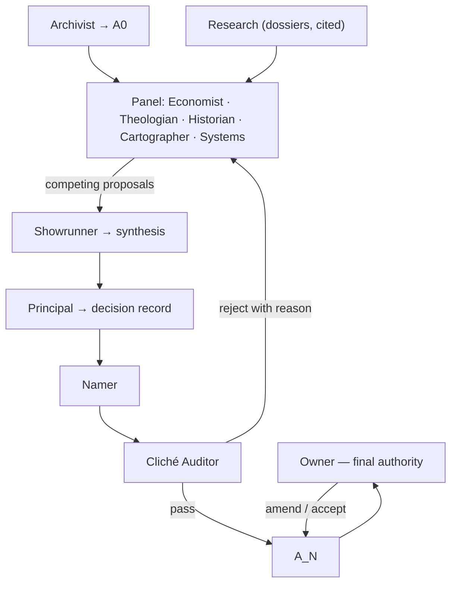

# Worldbuilding roles — charter for L0 and L1

**Date:** 2026-08-01
**Serves:** `2026-08-01-synthesis-workflow-contract.md` (the SWF contract)
**Purpose:** define who builds `A0` and `A1`, what each role decides, and what each may veto — so the world is argued into shape rather than narrated by one voice.

<strong>Why roles.</strong> A single author produces a world with one texture: everything is
equally detailed, equally important, and quietly consistent with itself in ways nobody
challenged. Roles create <strong>internal disagreement</strong>, and disagreement is what
surfaces the assumptions that make a world feel unexamined.

## 1. Standing decisions these roles inherit

Settled by the owner; roles may not reopen them without escalating.

| Decision | Value |
|---|---|
| Tone | **Contrast is deliberate** — bright readable art, grim world |
| Game shape | **Persistent MMO** |
| World scale | **Large**, comparable to a major MMO continent; may start small and scale |
| Revision scope | **Everything on the table** — canon, the 5-act epic, the novel, the 116 monsters |
| Real-world nouns | **Zero** in world artifacts (gate G7) |

## 2. The roles

### 2.1 Core — required for L0 and L1

| Role | Owns | Decides | Veto |
|---|---|---|---|
| **Archivist** | `A0` | What the world currently *is*; what each existing fact actually says | **G5** — blocks any claim that contradicts existing content without naming the collision and proposing the fix |
| **Political Economist** | Trade, licences, monopolies, prices, who profits | How any new thing is paid for, owned and abused | **G3** — blocks anything with no cost, no scarcity and no loser |
| **Theologian** | The god, Void, doctrine, the Bellfaith's practice *and* its business | What the divine is, what it wants, how it manifests, what it refuses | Blocks any use of Holy/Void inconsistent with the settled model |
| **Deep-Time Historian** | Legend, the layer above record | What happened before memory, and crucially **what people wrongly believe** | Blocks legends with no transmission path — who told this, and why did it survive? |
| **Cartographer** | The large world | Where things are, how far apart, why a settlement exists at all | Blocks geography that ignores water, terrain, trade routes or travel time |
| **Namer** | Naming systems | Naming conventions per region and culture; every proper noun | **G7** — blocks any real-world noun, near-homophone or transplant |
| **Cliché Auditor** | The quality bar | Nothing — this role only attacks | **G1** — runs the swap test on every artifact and blocks re-skins |
| **Systems Designer** | MMO constraints | What the world must support: zones, level bands, progression, density | Blocks lore that cannot be built or played at MMO scale |

| **Narrative Director** | Dramatic integrity | Whether a story *works as drama* — its engine, its cast, its ending | Blocks structures that destroy the drama, however consistent or buildable they are |
| **Player Experience** | What the player *is* | The player's role, fantasy and relationship to the story | Blocks worlds where the player has no place, or where thousands of players must each be the sole protagonist |
| **Art Director** | Visual language | The tone-contrast mandate, palette, the silhouette anchor system | Blocks content whose register the art cannot carry |

<strong>Eleven roles is the ceiling.</strong> Past that you get averaging instead of argument, and
averaging is how worlds turn generic. <strong>Live Ops</strong> and <strong>Localisation</strong>
stay out: the Thai glossary is a <em>cost the Archivist prices</em>, not a voice at the table.

<strong>Correction, recorded 2026-08-01.</strong> The Art Director was originally deferred to L2.
That was wrong: the tone-contrast mandate is at risk in the <em>scope</em> decision, which happens
at L1. It is pulled forward. The Narrative Director was missing entirely — a charter for building
a <em>story</em> world had nobody who owned whether the story works as drama.

### 2.2 Deferred — join at L2 and later

| Role | Joins at | Why not yet |
|---|---|---|
| **Naturalist** | L2 (biomes) | Needs the map and climate before ecology means anything |
| **Quest Designer** | L3 | Needs places and factions to hang hooks on |
| **Linguist (deep)** | optional | Only if the world wants real conlang depth rather than consistent naming |

## 2.3 The Principal — the decision role

| Role | Owns | Decides | May never |
|---|---|---|---|
| **Principal** | The decision record | Which option wins, with reasoning shown against weighted criteria | Propose options · author content · overrule a veto · reopen a §1 standing decision |

<strong>Why this is separate from the Showrunner.</strong> The Showrunner writes the briefs, runs
the panel and carries the session's momentum — which makes it the <em>worst</em> candidate to
judge the results. On 2026-08-01 the Showrunner recommended the option that avoided the most
expensive engineering and presented it as a design argument. That is exactly the failure this
role exists to prevent: <strong>the person who ran the process should not score it.</strong>

**The Principal must, every time:**

1. **Show the criteria and their weights** before scoring anything. Criteria are derived from §1 standing decisions, never invented to fit a preferred answer.
2. **Score every option against every criterion** — including options it dislikes.
3. **State what the decision sacrifices.** A decision with no stated cost has not been made, only asserted.
4. **Give the losing option's strongest argument, in its strongest form.** If it cannot, it has not understood the option well enough to reject it.
5. **State its confidence, and what evidence would change its mind.** A decision that nothing could overturn is a preference.
6. **Escalate rather than decide** when the choice belongs to the owner — anything touching §1, anything trading art quality against cost, anything reshaping the product.

<strong>Cost is not a tie-breaker unless the owner says it is.</strong> The owner's standing
principle is <strong>do it right, not fast</strong>. The Principal may record cost as a
consequence, never use it as the deciding criterion, and must flag explicitly when the
cheapest option and the best option differ.

**Output:** a decision record — the criteria, the matrix, the call, the sacrifice, the dissent, the confidence, and the trigger that would reopen it. Decision records are permanent; a later reversal appends, never edits.

## 2.4 Proportionality — the default is a small panel, not a full one

<strong>Roles must not be nosy.</strong> A role speaks only where its own domain or veto is
actually implicated. Commenting outside your lane is a process error, not diligence — it produces
volume, not judgement, and it drowns the one voice that mattered.

**Convening rules:**

- **Default: nobody.** Most questions need no panel at all. Answer them directly.
- **Then: the smallest sufficient set.** Convene only the roles whose domain the question actually touches. One role is a normal answer. Two or three is a large question.
- **Full panel is rare** — reserved for decisions that reshape the world or bind every later level. L1 scope is one. Most L2–L4 work is not.
- **"Not my domain" is a complete answer.** A role that has nothing at stake replies in one line and stops. That is a success, not an abstention.
- **Output length tracks stakes.** A one-line ruling is a valid artifact. Long documents are for decisions that are genuinely load-bearing and permanent.

**The Principal convenes only when:**

1. Two roles' vetoes genuinely conflict, **or**
2. The panel disagrees and no single role owns the call, **or**
3. A decision has real consequences and no natural owner.

If one role's veto settles the matter, it is settled — **no Principal, no decision record, no ceremony.** Invoking the Principal on a question a single role already answered is itself over-reach.

<strong>Recorded 2026-08-01.</strong> The first run convened three heavyweight roles at once and
produced three long documents for a single question. Two of the three were necessary. The
process was heavier than the decision required — noted so the plugin encodes proportionality
rather than the maximal version.

## 3. How they work

**The loop:**

1. **Archivist** assembles `A0` — what is true now, with every gap and contradiction listed.
2. **Research** supplies cited mechanisms (dossiers already exist for bells/news and death/relics/forbidden).
3. **Panel** each proposes independently against the same brief. **They must not converge early** — the point is competing answers, not a committee average.
4. **Showrunner** (me) synthesises the strongest combination, and records what was rejected and why. The Showrunner does **not** score the panel — see §2.3.
5. **Principal** adjudicates where the panel disagrees, and issues a decision record. It escalates to the owner rather than deciding anything that touches §1.
6. **Namer** replaces every placeholder with real names under the naming system.
7. **Cliché Auditor** attacks the result. A reject sends it back to the panel with a reason, not to the Showrunner to patch.
8. **Owner** accepts or amends. Only the owner may reopen a §1 standing decision.

## 4. Rules that make this work rather than theatre

<strong>A veto is a block, not an opinion.</strong> If a role vetoes, the artifact does not
proceed. It returns to the panel. The Showrunner may not overrule a veto — only the owner can.

- **Independent proposals first.** Panel roles are briefed separately and do not see each other's answers until all are in. Sequential briefing produces agreement, not options.
- **Every proposal names its cost.** A role that proposes a thing without saying who pays for it has not finished.
- **The Auditor never proposes.** It has no constructive duty. Giving the critic authorship destroys the critique.
- **Disagreement is recorded, not resolved away.** The artifact ships with a "rejected alternatives" section, so later levels can revisit a road not taken instead of rediscovering it.
- **Roles are briefs, not personalities.** No accents, no in-character flourish. A role is a domain, a decision right and a veto.

## 5. First run — what L0 and L1 actually produce

**L0 · Archivist alone.** Output: `A0` — the world as it stands. Every fact, every gap, every internal contradiction, plus what the shipped novel and 152 story nodes commit us to. No invention.

**L1 · Full panel.** Output: `A1`, covering:

- the god, and what Void is
- deep-time legend — what is true, and what people believe wrongly
- the large-world map: continents or regions, why settlements sit where they do
- the six existing towns, re-grounded at the new scale
- the naming system every later level inherits

**Open question for the owner (§7 of the SWF contract remains):** whether `A1` may propose *replacing* parts of the Undertow story, now that revision scope is "everything on the table". The Archivist will list exactly what any such proposal would cost.
