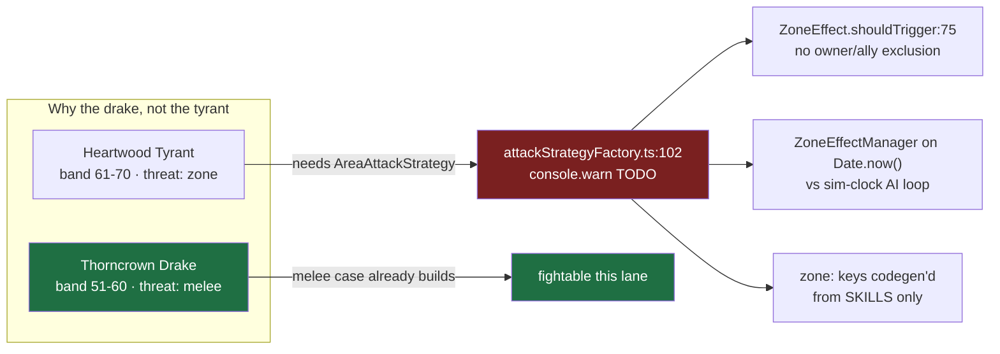

# L3 boss design — the Thornveil apex

Ships **one** boss, end to end, as the vertical slice `I-062`'s own frontmatter asks for
(`sequence_why: "vertical slice: ONE boss"`). Everything that is not required to make that
one boss fightable and gate-clean is an explicit non-goal with a named follow-up.

<b>Thorncrown&nbsp;Drake</b> the apex

<b>0</b> new bestiary rows

<b>earth</b> defence element

<b>1</b> documented gate exception

---

## 1. Three things the handoff got wrong

The handoff's §3 framed five open questions. Research settled four of them and corrected
the framing of three. These corrections are load-bearing — the design does not make sense
without them.

**A boss already ships.** `double_attacker` carries `role: boss` in
`content/characters/mob-double-attacker.md:5`, with `hp: 810`, `radius: 8`, and its own
`boss_area` spawn. The premise "no boss exists anywhere" is true of *lore and art* and
false of *the server*. This lane authors the second boss properly; it does not invent
boss support.

**F-023's threat system has no per-mob switch — and never needed one.**
`BattleModule.ts:112-116` writes threat on every resolved hit whose `damage > 0`, with no
mob-type condition. `selectTarget.ts:36` rule 4 falls back to nearest when the table is
empty. "Threat off" is simply "nothing has hit me yet". There is no flag to find.

**`threat: zone` is not a server field.** The bestiary's `threat` enum
(`character.schema.json:22`) is design intent with **zero** consumers in
`colyseus-server/src`. The server's "threat" is the F-023 aggro table — an unrelated
concept that happens to share the word. What actually has no implementation is
`AttackCharacteristicType.AREA`.

---

## 2. The apex: Thorncrown Drake

`docs/worldbuilding/A2-ecology-thornveil.md` §8.1 deliberately refuses the tie between
**Heartwood Tyrant** (the hydrology argument) and **Thorncrown Drake** (the bestiary
README's drake-family contract), and closes with "I-062 rules". It rules for the drake.

The tyrant's signature attack is an AoE, and "AreaAttackStrategy is a thin adapter over
the existing `ZoneEffectManager`" does not survive inspection. `ZoneEffect.shouldTrigger`
(`colyseus-server/src/schemas/ZoneEffect.ts:75-85`) is a pure radius test with **no owner,
team or faction exclusion**, and `ZoneEffectManager.procEffect` iterates every living
player *and* every living mob — a boss AoE would damage the boss and its own pack.
`ZoneEffectManager` also runs on `Date.now()` (lines 45, 58, 152) while mob AI runs on the
injected `SimClock` (`GameSimulationSystem.ts:31`), which F-028 shipped precisely to avoid.

A2's only formal model agrees with the pick: the mermaid at `A2-ecology-thornveil.md:161-175`
makes `drake · apex` the terminal node and draws the bramble as
`"structure and cover, not food"`.

**The tyrant is not discarded — its role is split.** A2:421 floats exactly this hedge.
The drake is the **apex predator** and the fightable boss; the tyrant remains the zone's
**apex organism** and becomes the named consumer for `I-043` (AoE / cleave), which has
been an orphan idea until now.

> เหตุผลฝั่งเรื่อง — เราไม่ได้ล้มข้อโต้แย้งเชิงนิเวศของต้นไม้ยักษ์ทิ้ง แค่แยกบทบาทตามที่เอกสาร A2
> เปิดช่องไว้เอง: **มังกรหนามคือนักล่าสูงสุด** ที่ผู้เล่นเจอและสู้ได้จริง ส่วน **ต้นไม้ยักษ์คือสิ่งมีชีวิตสูงสุด**
> ที่โซนทั้งโซนงอกออกมาจากมัน — เป็นเจ้าของพื้นที่ในเชิงนิเวศ ไม่ใช่ในเชิงการต่อสู้ มังกรตัวนี้แก่พอที่หนาม
> จะงอกทะลุเกล็ดหลังจนกลายเป็นพุ่มบนสันหลัง และพวกมังกรหนามรุ่นลูกก็เลี่ยงทางให้มันมาสองชั่วอายุแล้ว
> นั่นคือความเป็นบอสที่มาจาก canon ไม่ใช่จากตัวเลข HP

---

## 3. Shape of the change

The drake **already exists** as `mob-thorncrown-drake` in `content/bestiary/bestiary.json`
and is **already placed** in tier `heart` of `content/bestiary/placement-thornveil.json`.
Adding no roster row means gates G4 (placed exactly once), G6 (band overlaps tier) and G7
(tier contiguity) are never touched.

  content/bestiary/bestiary.json      ──► already has mob-thorncrown-drake  (untouched)
  content/bestiary/placement-*.json   ──► already places it in tier heart   (untouched)
           │
           ▼  this lane adds the runtime half
  colyseus-server/src/config/mobs/definitions/thorncrownDrake.ts   NEW
  colyseus-server/src/config/mobs/index.ts        MOB_TYPES += drake
  colyseus-server/src/config/mobs/types.ts        MobTypeConfig += element?
  colyseus-server/src/modules/MobLifeCycleManager.ts   pass element at spawn
  colyseus-server/src/config/mapConfig.ts         boss_area → drake, count 1
           │
           ▼  and the content half the gate demands
  content/characters/mob-thorncrown-drake.md      NEW  (Gate 2 blocker)
  colyseus-server/generated/mob-types.json        REGENERATED
  colyseus-server/generated/asset-keys.json       REGENERATED

### 3.1 The mob type

A new `MobTypeConfig` modelled on `doubleAttacker.ts`, using only the `melee` strategy id —
`attackStrategyFactory.ts:35` switches on `strategyConfig.id` and only `melee`, `spear` and
`doubleAttack` build anything. Stats read as a `bruiser` with `durability: high, speed: mid`,
matching the bestiary enums. Numbers stay server-side per the v1 boundary the existing
boss sheet already documents.

### 3.2 The defence element — and the exception it takes

`MobTypeConfig` has no `element` field and neither `new Mob({...})` call site passes one,
so **every entity in the game currently defends as `neutral`**, silently voiding the 7×7
table F-017 shipped. `DamageCalculator.ts:36-37` is the table's only caller.

This lane adds `element?: Element` to `MobTypeConfig`, passes it through the
`MobLifeCycleManager` spawn, and sets the drake to **`earth`** — the element its own
bestiary row already declares.

**This knowingly takes an exception to G-ELEM.** `tools/combat-lab/verify.mjs:1110-1126`
asserts *"no rank is cycle-disadvantaged, and no boss carries a cycle edge"*, with the
comment *"cycle advantage is reserved for trash/farm, so a boss must be element-neutral in
BOTH directions"*. Earth is a cycle element; only `holy↔void`, same-element and `neutral`
are Q-neutral.

**Nothing will turn red.** G-ELEM iterates `data.proposed.ladder` — the combat lab's
authored `RANK_SHAPE` (`gen_combat_model.mjs:302-309`) — never `MOB_TYPES`. The exception
is therefore invisible to Gate 1 unless it is written down, which is what this section is.

**The latent cost:** today no weapon and no mob attack carries a non-neutral element, so
an earth defender is inert in play. The moment `I-029` gives any weapon a fire element,
this boss becomes 2× easier against it with no assertion firing. **`I-029` must revisit
this before it ships an elemental weapon.**

**Decision owner:** the user, 2026-08-04, choosing roster fidelity over G-ELEM's
boss clause after the trade-off was presented.

**Mitigation shipped with the exception:** a test asserting the drake's runtime
`MobTypeConfig.element` equals its `content/bestiary/bestiary.json` element. That does not
enforce G-ELEM — it makes content↔runtime drift impossible, so the exception stays a
deliberate, visible choice rather than decaying into an accident.

Only the **defence** element is set. `element-entity.test.ts:53-61` asserts every shipped
mob **attack** is neutral; the drake declares no attack element, so that test stays green.

### 3.3 Uniqueness

`boss_area` is retargeted to the drake and its `count` drops **3 → 1**. It still respawns
after `respawnDelayMs ?? 5000` — see §5.

---

## 4. Gates this lane must clear

| gate | requirement | where |
| --- | --- | --- |
| **Gate 2 blocker** | a `mob:*` key with no character sheet hard-FAILs under `--require-complete` | `check_content.mjs:586-590`, run by `integration.sh:81` |
| server jest | `MOB_TYPES` ↔ `asset-keys.json` asserted **both ways** | `event-asset-key-contract.test.ts:46-58` |
| server jest | every spawn area's `mobType` must resolve | `map-spawn-binding.test.ts:23-33` |
| server jest | every shipped mob **attack** stays neutral | `element-entity.test.ts:53-61` |
| Gate 1 | prettier, `tsc --noEmit`, combat-lab G1–G12 | `scripts/precheck.sh` |

**The character sheet is not polish.** `content/characters/mob-thorncrown-drake.md` with
`assetKey: "mob:thorncrown_drake"` is mandatory — without it the release cannot promote.
Baseline today is exactly balanced at 8 keys / 8 sheets; adding a 7th mob type without a
sheet makes it 9/8 and Gate 2 fails.

Two further traps in that file: use `status: concept` (a `shipped` status hard-FAILs the
manifest/tier check at `check_content.mjs:557-562`), and **the lore text may not contain
the literal word "boss"** — `content/bestiary/README.md:283` bans it.

**`art:*` and `mob:*` are different pipelines.** A character sheet's `assetKey` must exist
in `colyseus-server/generated/asset-keys.json`, which only ever holds
`mob:` / `projectile:` / `zone:` / `player` / `npc`. Concept art keyed `art:boss-*` — the
prefix `2026-08-01-art-forge-foundation-design.md:201` reserves for the boss group — can
**never** satisfy a sheet. No `art:*` entry is in scope here, and `art-bestiary` honestly
stays at 0/30.

---

## 5. Non-goals

Each of these is real, verified, and deliberately out of scope. Four were found by the
completeness pass and had not been asked at all.

| non-goal | why it is out | follow-up |
| --- | --- | --- |
| AoE / cleave attack | `attackStrategyFactory.ts:102-104` is a `console.warn` TODO; `ZoneEffect` has no owner exclusion | **I-043** — now has a named consumer (the tyrant) |
| activating elements in play | needs weapons with elements + a balance pass for the 2× swing | **I-029** — must revisit §3.2 |
| a `level` / `rank` field | would add a `@type` field to `WorldLife`, and the C# contract is **positional** with two drift gates that have **zero callers** | new idea — wire `check-contracts-drift.sh` into a gate first |
| boss stays dead | `MobSpawnArea` has no `unique` flag; the drake respawns ~5s after death, forever | new idea |
| a boss-kill quest | dead three ways: server emits bare `thorncrown_drake`, the gate mandates `mob:`-prefixed, and Nakama loads a *different* catalog whose only target is `"boar"` | new idea — the highest-value one |
| the variant axis | `DR-003:167` records it as open q2, owned by the Systems Designer | **I-064** |
| 3D art / `art:*` entry | separate pipeline; unmapped keys render as a procedural capsule and a loud red storybook card | later art track |

**`maxClients = 1` does not block the demo.** `GameRoom.ts:65` caps the room at one seat,
but `AIWorldInterface.pickTarget` builds candidates from players **and NPCs**, and
`GameState.seedDemoNPCs()` spawns five NPCs on the player team. Threat switching, taunt
and hysteresis are all observable with one human seat. Raising the cap is *not* a cheap
alternative — `MetaEventReporter.ts:100-110` only `console.error`s on mixed user ids in a
batch, which its own comment calls "silent cross-account data corruption".

---

## 6. Acceptance — what "done" looks like

1. `bash scripts/precheck.sh` exits 0 (Gate 1: contracts, `tsc --noEmit`, jest, prettier,
   nakama, client, art-forge, combat-lab).
2. `node scripts/check_content.mjs --require-complete` exits 0 (the Gate 2 bar).
3. A jest test spawns the drake from `boss_area` and asserts `mobTypeId`, `maxHealth`, and
   `element === 'earth'` on the spawned `Mob`.
4. A jest test asserts the runtime element matches the bestiary roster element.
5. A jest test lands a scripted hit and asserts the drake's threat table names the attacker.
6. **Observed live**, not just green: `npm run dev`, open the React client to force room
   creation, then `curl http://localhost:2567/api/rooms/<id>/mobs` shows
   `mobTypeId: "thorncrown_drake"` with its configured `maxHealth`. Standing beside a demo
   NPC and out-damaging it flips `currentAttackTarget` once threat clears
   `switchMargin: 1.1`.

---

## 7. Open, and deliberately left open

- **G-ELEM vs runtime content.** The gate's boss clause cannot see `MOB_TYPES`. Extending
  it is a combat-lab change owned by the balance model, not by this lane — but §3.2's
  exception is exactly the case that motivates it.
- **Does boss art count toward `art-bestiary`?** `season1.mjs:67` counts a literal
  `art:mob-` prefix, so an `art:boss-*` key is silently uncounted. `DR-003:85-90` already
  predicted this. It is a budget-scope question for the Systems Designer, and belongs with
  **I-068** — not smuggled in as a bug fix here.
