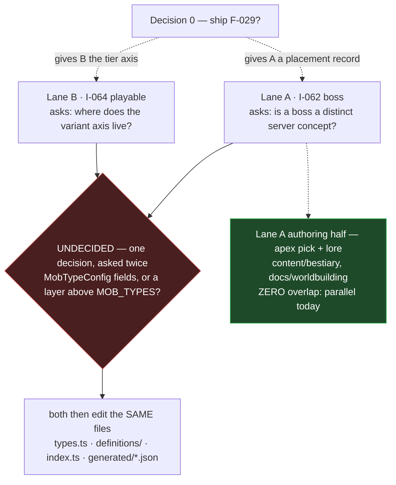

# Wave 4 — where it stands and what is left

**Each lane below is self-sufficient.** Pick one, read only that section plus §6 Traps, and
you have everything. You do not need to read the other lane.

<div class="callout warn">

**This document supersedes `2026-08-04-continue-handoff.md`, written earlier the same day.**
That file's §1 says F-029 is *"claimed and in flight … 7 commits ahead, HEAD `e10a508`"*.
It is now **complete and verified**, with `release/1.6` merged into it (HEAD `272df8a`, 8
commits). Its §2 "Decision" framing — *promote 1.6 or keep filling it* — is still live and is
restated below. Everything else in it about F-029 is stale.

</div>

---

## 1. Where wave 4 stands

Wave 4 is three ideas. **One is built. Two have never been opened.**

| order | idea | title | state |
| --- | --- | --- | --- |
| 1 | I-059 → **F-029** | L2 ecology — Thornveil | **complete, verified, NOT merged** |
| 2 | **I-062** | L3 boss design | 22-line template stub |
| 3 | **I-064** | L4 promote monsters to playable | 22-line template stub |

Waves 1–3 already shipped (I-048→F-025, I-058→F-027, I-049→F-026, all `status: shipped`
on 1.6 in `.claude/refined_backlog/_catalog.json`). Wave 5 is a single idea, I-051
*"L1 remainder: the god, what Void is, and deep-time legend"*. Wave 4 is the live front.

### F-029 — done, on a branch, unshipped

Branch `feat/F-029`, worktree
`.claude/worktrees/F-029-l2-ecology-biome-and-habitat-lore-for-cl`, HEAD **`272df8a`**,
working tree clean, **0 behind / 8 ahead of `release/1.6`** — the pre-Gate-1 release merge
is already done.

```
272df8a  Merge branch 'release/1.6' into feat/F-029
e10a508  docs(F-029): fix three citation-fidelity defects in the Thornveil ecology
8ec5250  docs(F-029): Thornveil ecology — the Naturalist derivation
b23084e  test(F-029): cover duplicate tiers, inverted bands and unparseable levelBand
14e296e  feat(I-059): gate tier declarations, band overlap and route band
a2ac992  feat(I-059): require every zone design placed exactly once
6f9298a  feat(I-059): gate placement files on zone, region and design refs
97ee0cf  feat(I-059): bestiary placement schema and Thornveil data
```

Six files, `+1054 / -3`, **all additive except a 7-line README insert** — no existing
content file was modified, which is why `bestiary.json` stayed byte-identical:

- `content/schemas/bestiary-placement.schema.json` (+50)
- `content/bestiary/placement-thornveil.json` (+114) — 14 placements, 4 depth tiers
- `scripts/check_content.mjs` (+160/−3) — `checkBestiaryPlacement()` at `:702`, called at `:136`
- `scripts/tests/bestiary-placement.test.mjs` (+260) — 19 tests
- `docs/worldbuilding/A2-ecology-thornveil.md` (+466)
- `content/bestiary/README.md` (+7) — the pointer to the new gated file class

<div class="metric-grid">
<div class="metric-tile"><strong>158 / 0</strong><br/>scripts suite on <code>feat/F-029</code><br/><em>baseline 139 on release/1.6; Δ+19 = the new test file</em></div>
<div class="metric-tile"><strong>0 failures</strong><br/><code>content-gate: 8 sheets, 1 maps, 153 story, 1 placements, 0 failures, 0 warnings</code></div>
<div class="metric-tile"><strong>identical</strong><br/><code>bestiary.json</code> sha256 matches release/1.6; <code>report_season1.mjs</code> unmodified and output unchanged</div>
</div>

All three re-measured **after** the `272df8a` release merge.

<div class="callout danger">

**Decision 0 — the first thing the next session faces: does F-029 ship?**

Its catalog row still reads `status: claimed, release_version: null,
claimed_by: claude-a6c35399`. Every other F-024…F-028 row reads `shipped / 1.6`.

Two options, and **nothing in the repo records a choice**:

- **Ship it into 1.6** (`/ps-release-workflow:ship` from inside the F-029 worktree) → 1.6
  becomes ten features, then promote.
- **Promote 1.6 at nine** and carry F-029 into 1.7.

Consequence either way: **both lanes below are cheaper after F-029 lands** (Lane B wants its
tier axis; Lane A wants its placement file if the boss is placed by tier). Neither is
*blocked* by it. Do not start a lane without settling this, because a feature worktree cut
after the merge inherits the placement gate and one cut before does not.

</div>

Also true and easy to miss: **`release/1.6` is 87 commits ahead of `origin/release/1.6`.**
Local is `187fecf`, origin is `f09bd7f`. None of the F-029 backlog commits, none of the
handoffs, none of the 1.6 features after that point exist on the remote. A fresh clone sees
none of this.

---

## 2. Lane A — I-062, the boss

*Self-sufficient. Read this section and §6 Traps; you need nothing else.*

**Idea folder:** `.claude/idea_backlog/I-062-l3-boss-design-f-023-shipped-boss-threat/` —
`spec.md` is 22 lines with `## Problem` / `## Why now` / `## Sketch` still holding the literal
template placeholders. `plan.md` and `research.md` are 3 lines each. **It needs a brainstorm
before it can be refined.** Frontmatter: `wave: 4, order: 2, sequence_why: "vertical slice: ONE boss"`.

### What exists

**A universal threat/aggro layer, shipped by F-023 — and nothing boss-specific.** `grep`ing
`boss` across `colyseus-server/src` returns only test files, one line of `mapConfig.ts`, and
comments. There is no boss flag, no boss class, no boss branch.

| piece | file |
| --- | --- |
| tuning | `colyseus-server/src/config/combat/threat.ts:9` — halfLife 10 s, maxEntries 32, switchMargin 1.1, tauntMultiplier 1.5, tauntLock 5 s |
| per-agent table | `colyseus-server/src/ai/threat/ThreatTable.ts:17` — lazy exponential decay at read, lowest-threat eviction at cap |
| registry | `colyseus-server/src/ai/threat/ThreatRegistry.ts:10` — one table per `agentId`; `forgetEntity()` at `:26` is the leak guard |
| target pick | `colyseus-server/src/ai/targeting/selectTarget.ts:24` — taunt > highest threat > incumbent within margin > nearest |
| where threat is written | `BattleModule.ts:110` — only on a **resolved hit**, amount = damage dealt |
| taunt | `BattleModule.ts:305 applyTaunt(...)`, reachable **only** from the debug message `debug_taunt` (`DebugCommandHandler.ts:14`) — no class ability exists |

**Content-side, "boss" is one label on a re-skinned mob.** `content/characters/mob-double-attacker.md:5`
is `role: boss` ("The Twin-Strike", `assetKey: mob:double_attacker`). Its only distinguishing
facts are `hp: 810` and a spawn footprint. `content/schemas/character.schema.json:11`'s `role`
enum contains `boss`, and I found **no downstream consumer of that value**.

**Zero boss art.** `game-client/assets/art/art-groups.json` declares 11 groups including
`boss` and `mob` — but the 88 entries in `art-manifest.json` are `class 64, cast 9, race 8,
town 6, map 1`. **Nothing in `boss`, nothing in `mob`.**

### The two apex candidates — the tension is handed over, not resolved

Both are real records in `content/bestiary/bestiary.json`, and F-029 placed **both in the
same `heart` tier (51–70)** of `placement-thornveil.json`.

| | Heartwood Tyrant | Thorncrown Drake |
| --- | --- | --- |
| id | `mob-heartwood-tyrant` | `mob-thorncrown-drake` |
| family | `plant` | `drake` |
| levelBand | **61-70** | 51-60 |
| element | `earth` | `earth` |
| archetype / threat | `tank` / **`zone`** | `bruiser` / `melee` |
| faction | `faction-thornveil` | `faction-unaligned` |
| placed locale | *"the heartwood itself — the zone's deepest root and its water table"* | *"the crown thickets above the heartwood"* |

<div class="callout warn">

**The tension, stated verbatim by `docs/worldbuilding/A2-ecology-thornveil.md:407-423` (§8.1):**
the zone's **hydrology** makes the plant apex — the bramble *is* the water table and the
Bramble Mothers answer to it; the bestiary's **own family contract** makes the drake apex —
`content/bestiary/README.md:78` defines `drake` as *"Scaled things … that sit at the top of a
region's food chain"*. A2 notes that Thorncrown Drake's lore already concedes ground
(*"the canes grow through its back plates and it carries a hedge on its spine"*) — one reading
of a drake that is apex **predator** but not apex **organism**.

A2 ends the section with three words: **"I-062 rules."** Do not resolve this by defaulting.

</div>

**A practical asymmetry that should inform, not decide, the pick:** Heartwood Tyrant's
`threat: zone` has **no executable strategy**. `colyseus-server/src/config/attackStrategyFactory.ts:102`
is `// TODO: Create AreaAttackStrategy` plus a `console.warn`. Picking the Tyrant either scopes
in `AreaAttackStrategy` (already captured as idea **I-043**, unpromoted) or ships a zone-threat
design implemented as a melee mob.

### What is missing (engineering, not authoring)

1. **A mob's defence element is dead in the runtime.** The 6-element RO table is live
   (`config/combat/elements.ts:12`, ×2.0 / ×0.5), the schema carries it (`WorldLife.ts:41`
   `@type('string') element`), and `DamageCalculator.ts:36` reads `target.element`. But
   `MobTypeConfig` (`colyseus-server/src/config/mobs/types.ts:71`) **has no element field**, and
   `MobLifeCycleManager.ts:189` constructs `new Mob({...})` without one. Every mob defends as
   `neutral`. Both apex candidates are `element: earth` in the bestiary; that value cannot reach
   the damage formula today.
2. **No boss concept in the type system at all** — see the open question below.

### The authoring chain — five artifacts, and asset keys are CODEGEN

You **cannot hand-write `mob:<id>`**. `colyseus-server/scripts/codegen/gen-asset-keys.ts:41`
emits exactly one `mob:<id>` key per `MOB_TYPES` entry.

1. Bestiary design record — **already exists** for both candidates.
2. New module in `colyseus-server/src/config/mobs/definitions/`, imported and appended to
   `MOB_TYPES` in that directory's `index.ts:13`.
3. Regenerate **both** `generated/mob-types.json` and `generated/asset-keys.json`
   (`gen-mob-types.sh`, `gen-asset-keys.sh`) and **commit them** — a local gate run fails
   against a stale file.
4. Character sheet `content/characters/<slug>.md`; `id` must equal the filename slug;
   schema is `additionalProperties: false`.
5. Art manifest entry in `game-client/assets/manifest.json` — **only required once
   `status` is `forged` or `shipped`** (`check_content.mjs:517`). A `status: concept` sheet
   needs no art.

**The gate that rejects an incomplete boss** is `checkCharacters()` in
`scripts/check_content.mjs`: `:512` assetKey not in `asset-keys.json` → FAIL; `:513` wrong
kind → FAIL; `:515` duplicate sheet per key → FAIL; `:519-521` forged/shipped with missing
or mismatched-tier manifest entry → FAIL; `:529` unresolvable `links.story` id → FAIL.

<div class="callout danger">

**That gate runs at Gate 2, not Gate 1.** `scripts/integration.sh:81` is
`content_gate() { node .../check_content.mjs --require-complete; }`, executed at `:98`.
`scripts/precheck.sh` (Gate 1, `ship`) does **not** run it. A malformed boss sheet ships into
the release branch clean and detonates at promote. **Run `node scripts/check_content.mjs`
by hand before shipping.**

</div>

### Two traps specific to this lane

- **Budget blind spot.** `scripts/lib/season1.mjs:68` counts bestiary art by the literal id
  prefix **`art:mob-`**, not by the `group` field. Naming boss art `art:boss-heartwood-tyrant`
  — the semantically obvious choice given the declared `boss` art group — scores **zero** on
  the `art-bestiary` line (target 30, actual 0 today).
- **The word "boss" is banned in prose.** `content/story/style.md:59`,
  `docs/worldbuilding/A0-current-world.md:342` and `content/bestiary/README.md:277` all list it.
  Boss *lore* may not contain the word *boss*.

### Hard narrative veto

`docs/worldbuilding/DR-001-L1-scope.md:190` and `role-narrative-director-scope.md:255`:
**"the Widow may not be resolved: no defeat event, no boss fight, no redemption arc."**
Whatever I-062 designs, it is not her.

### First concrete step

Read `docs/worldbuilding/A2-ecology-thornveil.md` §8.1 (lines 405–423) and
`docs/superpowers/specs/2026-07-31-lane-D-boss-aggro-decision.md`, then run
`superpowers:brainstorming` on I-062 with **one question first**: *is a boss a distinct server
concept, or a tuned mob type?* Everything else in this lane is downstream of that answer.

### Open questions this lane inherits — no file in the repo decides them

1. **Which candidate?** Hydrology (Tyrant) vs family contract (Drake). F-029 refused the tie.
2. **Is a boss a distinct server concept?** No flag, no interface, no branch exists today.
   Adding one (`boss: true` on `MobTypeConfig`, solo-spawn gating, a threat variant, phases) vs
   keeping it a pure content label is **the single biggest scope fork**, and it collides directly
   with Lane B — see §3.
3. **Does this lane fix the dead defence-element path**, or does the boss ship elementally
   neutral with the fix routed elsewhere?
4. **Art key namespace** — `art:boss-*` (semantic) or `art:mob-*` (what the budget counts)?
5. **`boss_area`** at `colyseus-server/src/config/mapConfig.ts:53` spawns **three**
   `double_attacker` mobs. That contradicts a one-boss reading, but **no spec states the intended
   semantics** — I cannot say whether it is a bug or deliberate.
6. **Does a promoted boss need an extra placement record?** Both candidates are already placed in
   `heart`, and G4 enforces *exactly once*. Undefined.

---

## 3. Lane B — I-064, promote monsters to playable

*Self-sufficient. Read this section and §6 Traps; you need nothing else.*

**Idea folder:** `.claude/idea_backlog/I-064-l4-promote-monsters-to-playable-116-desi/` — same
22-line stub, same empty Problem/Why-now/Sketch. Frontmatter: `wave: 4, order: 3,
sequence_why: "vertical slice: a few monsters made ACTUALLY playable - proves the chain"`.

### What exists

**116 bestiary designs, 6 server mob types, and no mapping between them.**

`content/bestiary/bestiary.json` is a flat array of 116 records with 14 fields each (id, name,
family, bodyPlan, levelBand, element, archetype, threat, durability, speed, region, faction,
lore, visualBrief). **No `assetKey`, no `status`, no `tier`, no `mob:*` id.** That is deliberate —
`content/bestiary/README.md` says so and explains why: a sheet naming a non-existent assetKey is a
hard gate failure, so the roster stays out of the gate's reach.

Region distribution: `ashvale-front 26 · millcross 19 · cindervast 15 · thornveil 14 ·
northern-icefield 13 · gildmark 10 · embervale 7 · norhollow 7 · rooktide 5`.

<div class="callout warn">

**The crux: the six "mob types" are BEHAVIOUR ARCHETYPES, not species.**

`colyseus-server/generated/mob-types.json` is exactly
`["aggressive","balanced","defensive","double_attacker","hybrid","spear_thrower"]` — bare ids,
no `mob:` prefix (the prefix is added only at key-mint time, `gen-asset-keys.ts:41`).

`aggressive.ts:5`, `balanced.ts:5` and `defensive.ts:5` are **byte-identical modules apart from
`hp` (90/100/150), `radius` (3.5/4/5) and which stat-range constants they read.** Nothing in any of
the six files describes a creature — no species, lore, element, family or region.

**Species identity lives on the character sheet.** `content/characters/mob-aggressive-brute.md:2-4`
is `id: mob-aggressive-brute / assetKey: "mob:aggressive" / name: "Ashfang Brute"`. So
`aggressive` (behaviour) + sheet = "Ashfang Brute" (species).

</div>

**And the 1:1 constraint is what decides the lane's shape.** `check_content.mjs:515`:

```js
if (sheetedKeys.has(fm.assetKey)) fail(`${label}: duplicate sheet for assetKey "${fm.assetKey}"`);
```

One mob type → one `mob:*` key → **at most one** character sheet → one display name. You
**cannot** skin 12 Thornveil species onto 6 archetypes at the content layer.

### What is missing

**`MobTypeConfig` has no variant axis.** `colyseus-server/src/config/mobs/types.ts:71` is
exactly seven fields: `id, name, hp?, radius?, rotationSpeed?, stats, atkStrategies`. No element,
no levelBand, no archetype, no rank, no `variantOf`. (An `element?` field *does* exist one level
down on `AttackDefinition` — that is per-attack **offensive** damage type from F-017, a different
axis from the bestiary's **defensive** element. Do not conflate them.)

That is precisely why `content/season-1-budget.json:49` marks spawn-entries blocked:

```json
{ "id": "spawn-entries", "target": 120,
  "blockedBy": "the variant axis does not exist on MobTypeConfig (spec 9 q2)",
  "source": "12 species per zone x 10 zones" }
```

**And no design→mob mapping field can exist today.** `content/schemas/character.schema.json:5-6`
is `required: [id, assetKey, name, role, status, tier, stats, links]` with
`additionalProperties: false` on both the root and `stats`. Adding `design: mob-bramble-shoot` or
`element: earth` to a sheet is a **schema FAIL** at `check_content.mjs:501` until the schema is
amended. Four of the fourteen bestiary fields do transfer (archetype/durability/speed/threat —
the enums are identical by design); **element, levelBand, region, faction, family and bodyPlan
have no home at all.**

### The cost model

**[probable — composed from separately verified rules; I did not execute a trial promotion.]**

Per new playable monster, minimum for a green Gate 2:

1. one module in `colyseus-server/src/config/mobs/definitions/<name>.ts`;
2. import + array entry in `colyseus-server/src/config/mobs/index.ts:13`;
3. `gen-mob-types.sh` **and** `gen-asset-keys.sh`, both regenerated files committed;
4. **one character sheet** — mandatory, because `check_content.mjs:545-550` under
   `--require-complete` hard-FAILs any `character`-kind key with no sheet, and Gate 2 runs with
   that flag;
5. optionally a `mobSpawnAreas` entry to actually spawn it.

<div class="callout success">

**The escape hatch that makes this affordable: art is not required.** `check_content.mjs:517`
gates the manifest requirement on `status === "forged" || "shipped"`. A **`status: concept`**
sheet needs no manifest entry and no forged art; a missing Visual Brief is only a WARN
(`:539-542`). So a monster can become a real, spawnable mob type with **zero art work** —
which decouples the `mob-bases` budget line (30, currently 6) from `art-bestiary` (30,
currently 0) in time.

The asset manifest gate is separately lenient: `check_asset_manifest.mjs` prints
`mode: stage-0 (unmapped = warning)` and **is not run by `integration.sh` at all**. The binding
constraint is the character sheet, not the art.

</div>

So **30 mob bases = 30 modules + 30 asset keys + 30 character sheets.**

### Where a spawn table plugs in

- **Authored:** `content/schemas/map.schema.json:79` → `mobSpawnAreas[]` requires
  `id, x, y, width, height, mobType, count`. `mobType` is just a non-empty string in the schema —
  validity comes from the gate: `check_content.mjs:638-641` hard-FAILs an unknown mob id.
- **Only one authored map exists.** `content/maps/atlas-frontier.md:27-30` declares **three**
  spawn areas total (`meadow_wilds` balanced ×3, `icefield_stoneguard` defensive ×2,
  `thornveil_skirmishers` spear_thrower ×4). That is the entire current spawn table, against a
  target of 120.
- **Runtime:** `colyseus-server/src/config/mapConfig.ts:34` — `mobType: string // Must match an id
  in mobTypesConfig`. The synced field is `Mob.ts:23 mobTypeId`, which is what the client resolves
  `mob:<id>` art against.

### What F-029 hands this lane

`docs/worldbuilding/A2-ecology-thornveil.md:425-435` (§8.2), verbatim: **"The tier is the
spawn-table axis."** `placement-thornveil.json` gives all 14 Thornveil designs a `tier` and a
`locale`, so a spawn table for that zone can key on tier rather than on the zone band — which the
zone band alone could never support, because it collapsed a 1–70 ecosystem into 15–28.

```
verge     (1-14)   bramble-shoot · thicket-hopper · veil-cub
route     (15-28)  bramble-stalker · veil-spearling · thornhusk-weaver ·
                   bramble-warden · thornveil-spearhand · sapdrinker-swarm
interior  (29-50)  bramble-drake · briar-caller · bramble-mother
heart     (51-70)  thorncrown-drake · heartwood-tyrant
```

That table is the ready-made input for a Thornveil spawn table. **But §8.2 also says, in bold:
"Nothing in this document mints either."** A placement record has `design`, `tier`, `locale`,
optional `note` — **no `count`, no `spawnIntervalMs`, no geometry, no `mobType`.** It is a
design-to-tier assignment, not a spawn area.

**And it only exists on `feat/F-029`.** The `_release` gate output has no `placements` segment.
If this lane keys spawn tables on tier, **F-029 merging is a prerequisite**; if it only mints mob
types, it is independent.

### First concrete step

Answer the Systems Designer's question from
`.claude/refined_backlog/F-025-season-1-scope-cut-reduce-the-mmo-target/spec.md:213-217`,
**still unanswered**: *does the variant axis go ON `MobTypeConfig`, or into a new spawn-entry layer
above `MOB_TYPES`?* That spec's own note on why it is consequential is accurate against today's
code: the chain `gen-mob-types.sh → gen-asset-keys.ts → check_asset_manifest.mjs →
check_content.mjs` all keys on the `MOB_TYPES` array, so the answer changes five files, and one
`mob:*` key is minted per entry — coupling the answer directly to the art budget.

Then brainstorm I-064 with a **scoped number**, which no file currently supplies.

### Open questions this lane inherits

1. **Variant axis: on `MobTypeConfig` or a layer above it?** No file in the repo decides it.
2. **How many monsters does cluster-1 actually need promoted?** Budget says 30 bases / 120 spawn
   entries; the stub says nothing. F-029 supplies 14 placed Thornveil designs as the one
   ready zone.
3. **Does the lane require F-029 merged?** Only if it uses the tier axis.
4. **Where would a design→`mob:*` mapping live?** Both candidate homes reject it —
   `character.schema.json:6` is `additionalProperties: false`, and the bestiary README explicitly
   forbids adding `assetKey`/`status`/`tier` to `bestiary.json`. A third file, or a schema
   amendment plus a new gate rule.

---

## 4. Is the parallelism real?

**No. Not at the code layer — and the collision is bigger than a file conflict.**

Checked by actual file overlap, not assumed:

| file | Lane A (boss) | Lane B (playable) | collide? |
| --- | --- | --- | --- |
| `config/mobs/types.ts` (`MobTypeConfig`) | wants `element`, maybe `boss` | wants the variant axis | **YES — same interface** |
| `config/mobs/definitions/` + `index.ts:13` | +1 module, +1 array entry | +N modules, +N array entries | **YES** |
| `generated/mob-types.json`, `generated/asset-keys.json` | regenerated | regenerated | **YES — same two artifacts** |
| `content/characters/` | +1 sheet | +N sheets | **YES (directory, not file)** |
| `content/bestiary/`, `docs/worldbuilding/` | lore + apex pick | — | no |
| `config/attackStrategyFactory.ts` | maybe (AreaAttackStrategy) | no | no |

The semantic coupling is the real one, and it runs deeper than the table:

<div class="callout danger">

**Lane B is the general case of Lane A.** A boss is one mob. If B builds a variant axis on
`MobTypeConfig`, A's boss is nearly free — it is one more entry. If A instead lands a bespoke
one-off boss module with hand-added fields, B has to live with whatever shape A chose.

They are not two independent lanes that happen to touch the same files. **They are two
consumers of one architectural decision that has never been made** — the same decision, phrased
twice: A asks *"is a boss a distinct server concept?"*, B asks *"where does the variant axis
live?"*. Answering either one answers most of the other.

</div>



**Recommended sequencing** (a judgment, not something the repo records):

1. **Settle F-029's ship first** (Decision 0). Cheap, unblocks the tier axis for B.
2. **Make the `MobTypeConfig` decision once**, as a shared decision record, before either lane
   is claimed. It is the intersection of both lanes and neither can be planned without it.
3. Only then do A and B become genuinely parallel — and even then, whoever merges second must
   re-run `gen-mob-types.sh` and `gen-asset-keys.sh` after resolving `index.ts`, because both
   lanes regenerate the same two committed JSON files.

**The one part that IS parallel today:** Lane A's *authoring* half — picking the apex, resolving
the hydrology-vs-family tension, writing the lore — touches only `content/bestiary/` and
`docs/worldbuilding/` and has **zero overlap with B**. If you want work to start immediately on
both fronts, that is the piece to run concurrently.

---

## 5. The pattern F-029 established

**One placement file per zone, plus a schema, plus a strict gate.** The shape is the deliverable —
`A2-ecology-thornveil.md` §8.3 says so explicitly.

| piece | file | cost for the next zone |
| --- | --- | --- |
| schema | `content/schemas/bestiary-placement.schema.json` | **already written** — reused as-is |
| gate | `checkBestiaryPlacement()` at `check_content.mjs:702` | **already written** — it globs the file class |
| tests | `scripts/tests/bestiary-placement.test.mjs` (19) | **already written** — rules are zone-agnostic |
| data | `content/bestiary/placement-<zone>.json` | **the only new file** |
| derivation doc | `docs/worldbuilding/A<n>-ecology-<zone>.md` | the expensive half — 466 lines for Thornveil |

The eight rules, each labelled in the source and each covered by a test:

| rule | line | what it enforces |
| --- | --- | --- |
| G1 | `:732` | `zone` exists in the Cartographer's `cluster1-geography.json#zones` |
| G8 | `:739` | `routeBand` equals the geography's band for that zone |
| G7 | `:747` | tiers ascend, are contiguous, and do not overlap |
| G2 | `:761` | `bestiaryRegion` is a region key the roster actually uses |
| G3 | `:767` | every named `design` exists in `bestiary.json` |
| G5 | `:777` | each placement's `tier` is one this file declares |
| G6 | `:784` | a design's `levelBand` **overlaps** its tier's band |
| G4 | `:794` | **completeness** — every roster design in that region appears exactly once |

**G4 is the load-bearing one.** It is what lets a zone prove coverage by gate rather than by eye,
and it is why the per-zone data cost is bounded: you cannot half-finish a zone and pass.

### The nine remaining zones

The ten zones in `cluster1-geography.json` are `meltwash-terrace, millcross-ford, rooktide-reach,
thornveil, emberdown, gildmark-head, hollowmarch, ashvale-front, northern-icefield, cindervast`.
Thornveil is done; **nine remain, holding 102 of the 116 designs.**

<div class="callout info">

**But only eight of the nine can actually get a file today.** `meltwash-terrace` has **zero
bestiary designs in any region** — there is no region key it maps to, so G4 would have nothing
to check and G2 would reject any region name you invented. Whether meltwash-terrace gets designs,
gets an explicit "no fauna" exemption, or stays unplaced is **an open question no file answers.**

Rough per-zone data cost, by design count: `ashvale-front 26 · millcross 19 · cindervast 15 ·
northern-icefield 13 · gildmark 10 · embervale 7 · norhollow 7 · rooktide 5`.

</div>

---

## 6. Loose ends — each with its verified status

### 6.1 The gate has no `zone` ↔ `bestiaryRegion` rule — **CONFIRMED, open**

`checkBestiaryPlacement()` validates the two fields against **different files and never against
each other**. G1 (`:732`) only checks the zone exists in the geography; G2 (`:761`) only checks at
least one design carries that region. G3 (`:774`) checks placed designs match the *declared*
region — internal consistency with the same field, not with the zone.

**A file declaring `{"zone":"thornveil","bestiaryRegion":"cindervast"}` with all 15 cindervast
designs placed would pass every rule G1–G8.**

<div class="callout danger">

**A naive `zone === bestiaryRegion` equality rule would be WRONG.** Five of ten zone ids differ
from their region key:

| zone id | bestiary region |
| --- | --- |
| `millcross-ford` | `millcross` |
| `rooktide-reach` | `rooktide` |
| `emberdown` | `embervale` |
| `gildmark-head` | `gildmark` |
| `hollowmarch` | `norhollow` |

*(The earlier survey listed four of these and missed `gildmark-head`/`gildmark`. I re-derived all
ten programmatically — five mismatches.)* Plus `meltwash-terrace`, which has no region at all.

**A correct rule already exists in the data:** `bestiaryRegion === (zone.town ?? zone.id)`.
Verified against all ten zones — it holds for all nine regions with **zero exceptions**, because
each zone carries a `town` field (`millcross-ford → "millcross"`, `hollowmarch → "norhollow"`, …)
and the four town-less zones (`thornveil`, `ashvale-front`, `northern-icefield`, plus the
region-less `meltwash-terrace`) use their own id. Implementable today with no new data.
**I did not implement or test it — read-only.**

</div>

**Open:** close it as a G9 inside F-029 before ship, or file it as a follow-up idea? F-029 is
already merged-with-release and verified; adding a rule now reopens its review gate.

### 6.2 I-056's catalog status is stale — **CONFIRMED, with a correction**

The idea catalog has **no `status` field at all**. Every one of the 75 entries in
`.claude/idea_backlog/_catalog.json` carries exactly `{id, title, created_at, promoted_to}`. The
only progress signal is `promoted_to`, and I-056's is `null`.

Meanwhile I-056's own `spec.md:4` frontmatter says `status: idea`, while `spec.md:13` says
**"## Status: 11 of 15 resolved on `release/1.6` (2026-08-02)"** with a 15-row table citing real
commits (`da31ccf`, `49c468e`, `812beb7`, `3290be8`, `0396222`) — all confirmed present on
`release/1.6`. **The work is real and landed; both the catalog and the frontmatter still read as
untouched.** A session scanning only the catalog will re-do finished work.

### 6.3 `canon.md` §6.1 is stale — **CONFIRMED**

`content/story/canon.md:448-454` still reads: *"the rename itself cannot happen on this branch —
`cluster1-geography.json` and `bestiary.json` live only on `feat/F-024`."*

F-024 has merged (`a8b82b3`, catalog `status: shipped / 1.6, shipped_at 2026-08-02`), and
`git ls-files` returns **both** files as tracked on `release/1.6`. The §6.1 table's "Losing forms"
column also still annotates both with "(on feat/F-024)". **The identical stale paragraph is
duplicated** in `.claude/idea_backlog/I-056-*/spec.md`.

**But the downstream consequence is still in force:** `content/season-1-budget.json:43` keeps
`"blockedBy": "P1 - keyspace unification; A1's ten zones have no region-* ids yet"` on the `zones`
line, so `report_season1.mjs` reports it blocked rather than measured — even though the
precondition it names is now satisfied.

### 6.4 Two of F-029's own spec verification items are unsatisfiable — **CONFIRMED**

- **Item 3, `node --test scripts/tests/`** (spec line 251) — on Node **v26.5.0** this is
  `Error: Cannot find module '.../scripts/tests'`, `MODULE_NOT_FOUND`, **true exit 1**. The
  working forms are `cd scripts && npm test` or, from the repo root,
  `node --test scripts/tests/*.test.mjs` (measured: 158 pass / 0 fail, true exit 0).
  `scripts/package.json`'s own `test` script is `node --test tests/*.test.mjs`, which only expands
  with `cwd=scripts/`.
- **Item 6, render `A2-ecology-thornveil.md` through `render-spec-md.sh`** (spec lines 256-257) —
  **fails silently.** The script's whitelist (lines 43–50) accepts only
  `*/docs/superpowers/{specs,plans,decisions,brainstorms,runbooks,research}/*` and `*/research/*`;
  everything else hits `*) exit 0 ;;`. `docs/worldbuilding/` is **not** on it, and the whitelist
  applies in CLI mode too, so passing the path explicitly does not bypass it. Proven by direct
  probe: identical files under `docs/superpowers/specs/` and `docs/worldbuilding/` — the first
  rendered, the second exited 0 and produced nothing.

  `docs/worldbuilding/A2-ecology-thornveil.html` (58 K) **does exist** in the F-029 worktree, so
  the item's *intent* was met — but not by that script, and the artifact is deliberately untracked
  (`.gitignore:111` → `docs/worldbuilding/**/*.html`). **I could not confirm the exact command that
  produced it.**

### 6.5 The 3 spurious exit-0 test results — **UNRESOLVED**

Recorded, not reproduced. No concurrency stress was run.

One concrete exit-0-masking mechanism **does** exist in this repo's normal command shapes and was
observed directly: `node --test scripts/tests/ 2>&1 | head -20; echo "exit=$?"` prints `exit=0`
while the command's **true** exit is 1 — `$?` after a pipeline reports the last element (`head`),
not `node`. Any verification written as `<test cmd> | tail -N; echo $?` reports 0 regardless of
failure.

**This is a plausible but unconfirmed explanation.** It is not load-dependent, which does not fit
the "under heavy concurrent load" framing, so it may be a separate issue. **Treat the flakiness as
open.** If the original observation recorded its exact command line and it was piped, the pipe
explains it deterministically and there is no flake; if it was a bare invocation, it is a genuine
unexplained Node 26 test-runner issue and should be filed.

---

## 7. Traps a cold session will hit

<div class="callout danger">

**1. A new feature worktree is cut from `main`, NOT from `release/1.6`.**
`~/.claude/ps-release-workflow/scripts/init_work_refined_backlog.py:130` (and `:258` for
`--resume`) call `add_worktree_new_branch(repo, path, branch, "main")`.

**`main` does not contain `content/bestiary` or `docs/worldbuilding` at all** —
`git ls-tree -r --name-only main -- content/bestiary docs/worldbuilding` returns **empty**.
`main` is 270 commits / 2188 files behind `release/1.6`.

So an I-062 or I-064 worktree would start **without the 116-design bestiary that both ideas are
entirely about.** Mitigation, first command after claiming:
`git merge release/1.6 --no-edit` — not just before Gate 1, but before doing any work at all.

</div>

**2. A fresh worktree has no `scripts/node_modules`.** `scripts/package.json` needs `ajv` and
`js-yaml`; `.gitignore:2,5` keep `node_modules` out; `init_work_refined_backlog.py` contains no
install call anywhere. **Every content-gate command fails until you run
`cd <worktree>/scripts && npm install`.**

**3. `node --test scripts/tests/` is broken on Node 26** — `MODULE_NOT_FOUND`, exit 1. Use
`cd <worktree>/scripts && npm test`, or `node --test scripts/tests/*.test.mjs` from the root.

**4. `render-spec-md.sh` silently skips `docs/worldbuilding/`** — exits 0, produces nothing. That
directory now holds ~20 design docs (A0/A1/A2, five DR-00x decision records, ABP artifacts) that
the PostToolUse hook never renders. **Open:** deliberate, or an oversight in the whitelist?

**5. Committed codegen artifacts are not drift-checked.** No `git diff --exit-code` guards
`mob-types.json` or `asset-keys.json` in `ci.yml`, `precheck.sh` or `integration.sh` — CI
*regenerates* them before the gates (`ci.yml:63-66`) as a backstop. So a stale committed artifact
is **CI-invisible but breaks every local gate run.** Minting ~30 mob types multiplies that blast
radius. Not filed as an idea; I did not check whether an existing idea covers it.

**6. Ten feature worktrees are live on disk with claim markers** — F-020…F-028 (all `shipped`)
plus F-029. The nine shipped ones are **cleanup debt, not in-flight work.**

### The commands that work — measured, not guessed

```bash
cd <worktree>/scripts && npm install            # first, in any fresh worktree
cd <worktree>/scripts && npm test               # scripts suite
cd <worktree>/scripts && node --test tests/<f>.test.mjs   # one file
cd <worktree> && node scripts/check_content.mjs           # content gate
cd <worktree> && node scripts/report_season1.mjs          # budget report
```

---

## 8. Deliberately left alone

- **The X12 keyspace rename** (I-056 item 4 / `canon.md` §6.1). Now **unblocked** by F-024's
  merge, but nothing has been filed to do it. Needs **two** things per I-056's spec: the rename
  itself, **and** a `zones` measure function in `scripts/lib/season1.mjs` that does not exist.
  **Open:** new idea, or an amendment to I-056 (still unpromoted)?
- **The `zones` budget measure.** `season-1-budget.json:43` still carries `blockedBy` and reports
  blocked. Unblocking it is the second half of the rename above. Not this wave.
- **Bestiary art.** `art-bestiary` is **0 of 30**. Nothing in either lane requires it — a
  `status: concept` character sheet needs no manifest entry (`check_content.mjs:517`). Keep the
  art half decoupled from the promotion half in time.
- **The other nine zones' placement files.** The pattern is proven and reusable (§5); the
  derivation doc is the expensive part. Not wave 4.
- **`AreaAttackStrategy`** (`attackStrategyFactory.ts:102`, idea **I-043**, unpromoted) and the
  F-018 boss-spread follow-up (**I-044**, unpromoted). Both adjacent to Lane A; neither is in it
  unless Lane A picks the `threat: zone` candidate.

---

## 9. Invariants

1. **Merge `release/1.6` into your feature branch immediately after claiming** — the claim script
   cuts from `main`, and `main` has no bestiary and no worldbuilding docs at all.
2. **Run `node scripts/check_content.mjs` by hand before shipping.** Gate 1 (`precheck.sh`) does
   not run it; only Gate 2 (`integration.sh:81`, with `--require-complete`) does. A malformed
   character sheet ships clean and detonates at promote.
3. **Never write `$?` after a pipe.** It reports the last pipeline element, not your command.
4. **Asset keys are codegen.** You cannot hand-write `mob:<id>`. Regenerate **both**
   `mob-types.json` and `asset-keys.json` and commit them.
5. **A `.claude/refined_backlog/*/plan.md` is gitignored** — canonical specs live under
   `docs/superpowers/`.
6. **Never `git commit --amend`.** New commit on top, always.
7. **`.html` files next to these docs are local view artifacts** — untracked, never committed.
