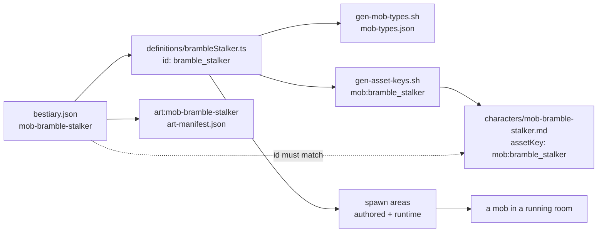

# L4 — promote monsters to playable

<span class="topic-chip">I-064</span> <span class="topic-chip">wave 4 · lane 3 of 3</span> <span class="topic-chip">release 1.7</span>

Wave 4's third and last lane. F-029 (L2 ecology) and F-030 (L3 boss) are both shipped
and promoted to `main` in release 1.6. This lane closes the wave by proving the whole
chain — **bestiary design → server mob type → character sheet → spawn table → a mob you
can actually fight** — on a small, honest slice, and by putting the first two images into
the bestiary art class.

<div class="callout info">

**This is deliberately a slice, not a bulk mint.** The value is the *derivation rule* and
the *two new gates*, which make the remaining ~27 bases cheap and un-driftable. Minting 30
bases is a separate, later lane.

</div>

---

## 1. What is true today <span class="topic-chip">measured</span>

<div class="metric-grid">
<div class="metric-tile"><b>116</b><br>bestiary designs</div>
<div class="metric-tile alarm"><b>7</b><br>server mob types (of 30 budgeted)</div>
<div class="metric-tile alarm"><b>0</b><br><code>art:mob-*</code> images (of 30 budgeted)</div>
<div class="metric-tile"><b>3 / 5</b><br>authored vs runtime spawn areas</div>
</div>

`content/bestiary/bestiary.json` holds 116 records with 14 fields each and deliberately
carries **no** `assetKey`, `status` or `tier` — `content/bestiary/README.md` explains why:
a sheet naming a non-existent assetKey is a hard gate failure, so the roster stays outside
the gate's reach.

Three findings shape everything below.

### 1.1 The spawn chain is broken in two halves

There are two spawn tables and **nothing connects them**. `grep -rn "content/maps"
colyseus-server/src` returns zero hits.

| | authored | runtime |
| --- | --- | --- |
| file | `content/maps/atlas-frontier.md` | `colyseus-server/src/config/mapConfig.ts` |
| areas | 3 — `meadow_wilds`, `icefield_stoneguard`, `thornveil_skirmishers` | 5 — `center_courtyard`, `boss_area`, `north_ice_fields`, `south_mud_pit`, `east_dunes` |
| gated | yes — `check_content.mjs` hard-fails an unknown `mobType` | no |
| spawns | **no** | yes |

Their ids, counts and geometry all differ. F-030 put the drake in the world by hand-editing
`mapConfig.ts` (`boss_area`), not by authoring content.

<div class="callout warn">

**This is a known deferral, not a discovery.** `I-015 — Map runtime loader (deferred F-008
phases 2–4)` already owns "server `loadMapSpec` + wire spec into room", and records the
blocker: `content/maps` must first be packaged into the server dist + Docker image, making
`js-yaml`/`ajv` production deps with blast radius across ~55 tests. **This lane does not
attempt that.** It adds a drift gate so the two halves cannot silently diverge further
while I-015 waits.

</div>

### 1.2 A third of the bestiary cannot be promoted at all

`AttackCharacteristicType.AREA` exists in the enum (`config/mobs/types.ts`) and in
`AttackArea`, but has **no implementation**: `attackStrategyFactory.ts:102` reaches the
AREA branch and logs `⚠️ Area attacks not yet implemented`, creating no strategy. A
`threat: zone` mob would spawn, chase, and never attack.

`threat` distribution across the 116: **melee 73 · ranged 23 · zone 20**. The 20 zone
designs are unpromotable until `I-043 — Boss multi-target cleave: implement
AreaAttackStrategy` lands. In Thornveil specifically that is **8 of 14**.

### 1.3 The art pipeline is humanoid-only

The validated `character` profile in `tools/art-forge/forge.config.json` is
**img2img, denoise 0.82, steps 24, cfg 3** (F-024's calibration campaign — the note says
do not change without re-running the sweep). It is anchored on *"flat-grey per-job
silhouettes cut from the approved human row"*, living on mont-pc at `F:\comfy-ui\input`
with prefix `sil-`. And `prompts/style-laws.json` law #1 is explicit:

> Text alone CANNOT hold head-body ratio — always anchor with an image. The owner caught
> drift twice on text-only attempts.

So text-only generation for a creature is a *known-failing* path, not an untested one.
Only **24 of 116** designs are `humanoid-raider`; the other 92 span quadruped-beast 18,
giant-hulk 14, insect-low 11, spirit 11, automaton 11, plant-rooted 6, serpentine 6,
winged-small 6, drakes 6, insect-upright 2, torso-dragger 1 — none with a silhouette anchor.

---

## 2. Decisions taken <span class="topic-chip">2026-08-05</span>

| # | Question | Decision |
| --- | --- | --- |
| 1 | How wide? | **Thin proof slice — 3 bases.** Not the 30-base budget push. |
| 2 | Implement `AreaAttackStrategy`? | **No.** Content-layer only; the zone third stays with I-043. |
| 3 | Authored vs runtime map split? | **Mirror + drift gate.** Not the I-015 runtime loader. |
| 4 | 2D art? | **Concept art for the art-able picks** via `tools/art-forge`. |
| 5 | Which three, given art is humanoid-only? | **Mixed — 2 humanoid + the drake.** |

Decision 5 is a real trade. The intersection of *promotable* (threat ≠ zone) and *art-able*
(humanoid-raider) inside Thornveil is exactly three designs, **all in the route tier**.
Full art coverage and a multi-tier ladder are mutually exclusive today. The mix keeps a
genuine difficulty step into the interior and avoids shipping two near-identical
ranged/wind raiders, at the cost of one monster having no reference art.

---

## 3. The picks

| tier | bestiary design | mobType id | body plan | threat | element | archetype | art |
| --- | --- | --- | --- | --- | --- | --- | --- |
| route (15–28) | `mob-bramble-stalker` | `bramble_stalker` | humanoid-raider | melee | earth | skirmisher | ✓ |
| route (15–28) | `mob-veil-spearling` | `veil_spearling` | humanoid-raider | ranged | **wind** | skirmisher | ✓ |
| interior (29–50) | `mob-bramble-drake` | `bramble_drake` | quadruped-drake | melee | earth | bruiser | ✗ |
| heart (51–70) | `mob-thorncrown-drake` | `thorncrown_drake` | — | melee | earth | bruiser | *shipped in F-030* |

`veil_spearling` is the only non-earth pick on purpose: it exercises the `spear` strategy
**and** a second element through the F-017 resolution table, so the slice proves more than
one code path.

Tiers come from F-029's `content/bestiary/placement-thornveil.json`, whose §8.2 states
*"the tier is the spawn-table axis"* — and equally that *"nothing in this document mints
either."* This lane is what mints them.

---

## 4. The derivation rule

Two independent axes. **Power comes from the tier; character comes from the bestiary
enums.** No new fields on `MobTypeConfig`.

```
tierFactor:   verge 0.75 · route 1.0 · interior 1.75 · heart 2.5

hp          = durabilityBase(low 70 | mid 100 | high 150) × tierFactor   [Math.round]
pAtk        = MOB_STATS.pAtk × tierFactor
maxMoveSpeed: speed low 5 · mid 8 · high 11
radius/pDef/armor by archetype: skirmisher 3/1/1 · bruiser 5/3/2 · tank 5/4/3
atkStrategies by threat: melee → [melee] · ranged → [melee, spear] · zone → UNSUPPORTED
element     = the bestiary row's element, verbatim
```

Baseline is `MOB_STATS` at `colyseus-server/src/config/combat/combatStats.ts:82` —
hp 100 · pAtk 20 · attackRange 1.5 · pDef 2 · mDef 1 · armor 1 · radius 4 · chaseRange 15
· maxMoveSpeed 8.

<div class="callout success">

`tierFactor` for `heart` is **2.5**, which is exactly F-030's existing
`DRAKE_PATK = MOB_STATS.pAtk * 2.5`. The ladder is continuous with the shipped boss rather
than a parallel invention.

</div>

<div class="callout warn">

**The rule covers non-boss bases only.** The drake's `hp: 1400` is 3.7× what the formula
yields — `role: boss` entries stay hand-tuned by design, and the spec for F-030 says so.
Do not "correct" the boss to fit the formula.

</div>

### Resulting values

| | hp | pAtk | maxMoveSpeed | radius | pDef / armor | strategies | element |
| --- | --- | --- | --- | --- | --- | --- | --- |
| `bramble_stalker` | 100 | 20 | 11 | 3 | 1 / 1 | `[melee]` | earth |
| `veil_spearling` | 70 | 20 | 11 | 3 | 1 / 1 | `[melee, spear]` | wind |
| `bramble_drake` | 263 | 35 | 8 | 5 | 3 / 2 | `[melee]` | earth |

<div class="callout danger">

**F-030's trap, repeated here so it is not re-learned.** The melee path reads
`stats.pAtk` — `MeleeAttackStrategy.execute` calls `createMelee(attacker, x, y,
attacker.pAtk)` and never reads `atkBaseDmg`. Damage put only on `atkBaseDmg` is dead
config with a green test suite. `atkBaseDmg` **is** honoured by the `spear` and
`doubleAttack` strategies, so keep the two in sync via a shared constant per module.

</div>

---

## 5. The join needs no new file

The mapping from design to mob type already has a home, established by F-030 precedent:

```
character sheet id   ==  bestiary design id      (mob-bramble-stalker)
character sheet file ==  <id>.md                 (enforced: check_content.mjs, id = filename slug)
sheet assetKey       ==  "mob:" + mobType id     (mob:bramble_stalker)
```

`mob-thorncrown-drake.md` is currently the **only** sheet whose `id` is a real bestiary
design id; the six legacy archetype sheets (`mob-aggressive-brute` etc.) are not. No schema
amendment, no third file, no change to `character.schema.json`'s
`additionalProperties: false`.



---

## 6. Part A — content + server <span class="topic-chip">hermetic · runs in CI</span>

1. **Three modules** in `colyseus-server/src/config/mobs/definitions/` —
   `brambleStalker.ts`, `veilSpearling.ts`, `brambleDrake.ts` — each carrying a header
   comment naming its bestiary row and the tierFactor used.
2. **Wiring** — import + array entry in `colyseus-server/src/config/mobs/index.ts`.
3. **Codegen regenerated and committed** — `gen-mob-types.sh` *and* `gen-asset-keys.sh`.
   Both artifacts are read by gates and by the season-1 measure; a stale artifact is a
   silent failure.
4. **Three character sheets** at `content/characters/mob-<design-id>.md`, `status: concept`,
   `tier: seed`, stats enums mirroring the bestiary row, with Lore and Visual Brief
   sections drawn from the row's `lore` / `visualBrief`.
5. **Three paired spawn areas**, written into **both** map files with identical ids:

   | id | mobType | count |
   | --- | --- | --- |
   | `thornveil_route_stalkers` | `bramble_stalker` | 2 |
   | `thornveil_skirmishers` *(retargets the existing authored entry off generic `spear_thrower`)* | `veil_spearling` | 2 |
   | `thornveil_interior` | `bramble_drake` | 1 |

   Authored geometry stays inside `region-thornveil` `(750,250) 250×500`. Runtime geometry
   is chosen inside the 1000×1000 world and **may differ** — see the gate below.

<div class="callout info">

**Room population goes 12 → 17.** Safe to state plainly: `maxMobs: 8` in
`mobSpawnConfig.ts:13` is **dead config** — `MobLifeCycleManager` reads only `area.count`
(`:71`), never `maxMobs`, so the room already runs 12 against a nominal cap of 8. Not
fixed here.

</div>

---

## 7. Part B — bestiary concept art <span class="topic-chip">interactive · NOT CI</span>

<div class="callout warn">

**Requires a live GPU and a tunnel.** `ssh -f -N -L 8188:127.0.0.1:8188 -o
ServerAliveInterval=30 mont@100.66.190.100`, then ComfyUI on mont-pc. Nothing in Part A
may depend on Part B completing — the two must be separately verifiable.

</div>

6. **`tools/art-forge/prompts/creature-identity.json`** — new prompt module keyed by
   bestiary design id:

   ```json
   {
     "mob-bramble-stalker": {
       "clause": "<derived from the row's visualBrief>",
       "silhouette": "sil-assassin",
       "validated": false
     },
     "mob-veil-spearling": { "clause": "…", "silhouette": "sil-spearman", "validated": false }
   }
   ```

   Same shape and spirit as `job-costume.json`, including its honesty convention:
   `validated: false` until visually confirmed on a contact sheet.

   <div class="callout warn">

   **`sil-assassin` / `sil-spearman` are hypotheses, not verified filenames.** The
   silhouettes live on mont-pc at `F:\comfy-ui\input` and cannot be listed from this repo.
   `job-costume.json` declares eight jobs, and `forge.config.json` says the files are
   per-job with a `sil-` prefix — so these two names are inferred from that convention.
   **First step of Part B is to `ls` that directory over SSH and correct the mapping.**
   If no suitable humanoid anchor exists for a skirmisher-with-whip-arms, pick the closest
   available job silhouette and record the substitution in the module's `_note`.

   </div>
7. **A `--creature <design-id>` path in `buildPrompt`**, appending `styleClause` **last** —
   after the creature clause, exactly as `job-costume` is composed. This is the F-024 law;
   putting the style words inside the opening `positive` array does not reproduce the
   validated prompt string.
8. **Generate** on the `character` profile at its locked recipe. QC per row on a contact
   sheet; reroll only failing cells with a new seed plus reinforced identity words.
9. **Intake** via `tools/art-forge/intake-art.mjs` → `art:mob-bramble-stalker` and
   `art:mob-veil-spearling`, `group: mob`. The group is already declared in the committed
   `game-client/assets/art/art-groups.json` (`track: T1`), so the registry needs no change.
   `title` and `note` (provenance) must be non-empty and the artifact gate must pass.

<div class="callout danger">

**Concept art does NOT promote a sheet to `status: forged`.** `checkCharacters` reads the
codegen `manifest.json` — the 3D-scene sink — never `art-manifest.json`
(`scripts/check_content.mjs:521`). And `render-spec.json` lists `mob:` in
`codegenReservedNamespaces`, so the 2D intake tool is *forbidden* from writing a `mob:*`
key at all. All three mobs stay visually unmapped in the client. The art is reference for
a later 3D forge, not a game asset.

</div>

**Budget effect:** `bestiaryArt` counts the `art:mob-` prefix
(`scripts/lib/season1.mjs:71`) — **0 → 2** of 30. `mobBases` counts codegen ids — **7 → 10**
of 30.

---

## 8. Gates and tests

### G-SPAWN-PAIR — the drift gate

> Every authored `mobSpawnAreas` entry must have a **same-`id`** counterpart in
> `mapConfig.ts` with the same `mobType` and the same `count`. **Geometry may differ** —
> the two maps describe different worlds until I-015 lands. Ids that predate the content
> layer sit in an explicit, commented `LEGACY_UNPAIRED` allowlist:
> `center_courtyard`, `north_ice_fields`, `south_mud_pit`, `east_dunes`, `boss_area`,
> `meadow_wilds`, `icefield_stoneguard`.

The allowlist is the honest part: a "must be identical" rule would be a fiction that fails
on day one against five pre-existing mismatches. New pairs are unbreakable; old ones are
named, not hidden.

### G-BESTIARY-SHEET — the join gate

> A character sheet whose `id` matches a bestiary design id must mirror that row's four
> enums (`archetype`, `durability`, `speed`, `threat`), and the `element` on the
> corresponding `MobTypeConfig` must equal the row's `element`.

This is the generalisation of the single binding test F-030 added for the drake.

### Tests

- Per-module unit tests asserting the derived numbers against the rule, not against
  restated literals.
- Gate tests for both new rules, each with a **negative case**.
- **A delete-the-rule check that actually fails.** Build the mob through the real spawn
  wiring (`MobLifeCycleManager`), not by hand-constructing a `Mob`. F-030's binding test
  passed even with the wiring deleted precisely because it hand-built the entity.

---

## 9. Verification

A phase is not done until all five steps pass, per the standing quality gate.

| # | Check | Evidence |
| --- | --- | --- |
| 1 | `npm test` in `colyseus-server` | full suite green |
| 2 | `npx tsc --noEmit` | a green jest run does not prove the build compiles |
| 3 | `node --test scripts/tests/` | gate tests incl. negative cases |
| 4 | `check_content.mjs --require-complete` | the flag Gate 2 runs with |
| 5 | Delete each new rule, re-run, confirm **red**; restore | the rule is load-bearing |
| 6 | Run a room and observe all three spawn **and attack** | not just green in tests |
| 7 | Season-1 report shows `mobBases` 10, `bestiaryArt` 2 | measured, not asserted |

Step 7's `bestiaryArt` value depends on Part B; if the tunnel is unavailable, Part A ships
with `bestiaryArt` unchanged at 0 and that is stated plainly rather than papered over.

---

## 10. Out of scope

| Item | Where it goes |
| --- | --- |
| `AreaAttackStrategy` — unblocks 20 of 116 designs (8 of Thornveil's 14) | **I-043** (exists) |
| Server loading `content/maps/` — one source of truth | **I-015** (exists, blocker documented) |
| Non-humanoid silhouette anchors — unblocks 92 of 116 for art | new idea |
| Reconciling the seven `LEGACY_UNPAIRED` map areas | new idea |
| `maxMobs` is dead config in `mobSpawnConfig.ts` | new idea |
| `mob:thorncrown_drake` has no `.glb` scene — F-030's boss is unmapped | new idea |
| Minting the remaining ~20 bases to hit the budget's 30 | new idea |
| 3D models for the three new mobs | follows the non-humanoid art work |

---

## 11. Traps carried in from prior lanes

<div class="callout danger">

1. **A green suite is not a covering suite.** Delete each new rule and confirm the suite
   goes red. This has bitten twice — F-029 and F-030.
2. **`tsc`, not jest, after a type change.** ts-jest caches per file; a green jest run does
   not prove the build compiles.
3. **A fresh worktree has no `node_modules`.** Install before verifying anything.
4. **Merge `release/1.7` into the feature branch BEFORE Gate 1.**
5. **`git push` needs `http.postBuffer`** — already set repo-locally to 524288000; a large
   push failing with `RPC failed; HTTP 400` is not a gate failure.
6. **Codegen artifacts must be committed.** `mob-types.json` feeds both the content gate
   and the season-1 measure.

</div>
