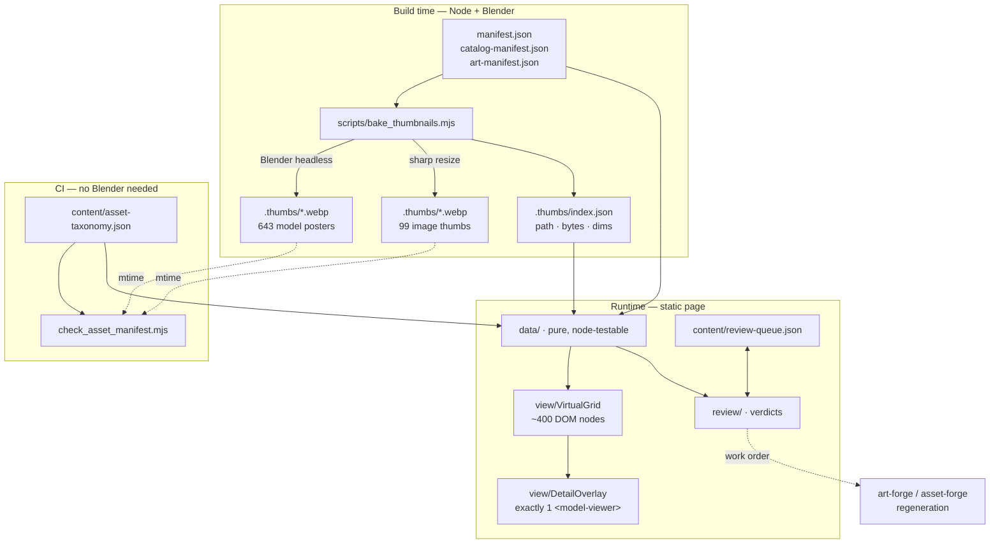
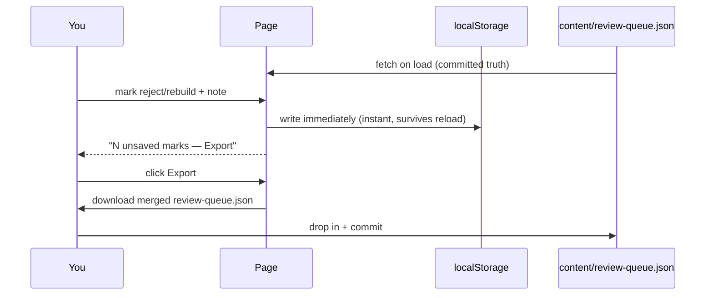

# asset-storybook as an art-direction review surface

Baked thumbnail spine · virtualized gallery · reject/rebuild verdicts

---

## 1. Problem measured

`tools/asset-storybook` was designed for the ~60-asset seed set of F-002. It now
carries **742 cards** — 653 manifest entries (19 `manifest.json` + 634
`catalog-manifest.json`), 88 concept-art PNGs, and 1 coverage card — and its
one-page, one-card-per-asset architecture has stopped working. Of the 653 manifest
entries, **643 are `model3d`**.

Every number below was measured in Chrome against
`http://localhost:8765/tools/asset-storybook/index.html` (repo served by
`python3 -m http.server`), with **no scrolling**, after a 15-second settle.

<strong>643</strong>&lt;model-viewer&gt; elements mounted at once

<strong>11,268</strong>DOM nodes

<strong>16.4 MB</strong>transferred before you touch the page

<strong>92 MB</strong>JS heap at rest

<strong>10 / 643</strong>models that actually loaded

<strong>136,400 px</strong>page height

### 1.1 Three defects, not just slowness

<strong>Health dots can never settle.</strong> <code>initHealth(groupKey, list.length)</code>
in <code>js/main.mjs</code> sets each class's <code>total</code> to its card count, but
<code>&lt;model-viewer&gt;</code> only loads what is near the viewport — 10 of 643. Since
<code>renderSidebarBadge</code> requires <code>ok + err &gt;= total</code> to call a class settled,
<strong>11 of 23 sidebar dots — including <em>All</em>, Environment (211) and Dungeon (283) —
sit at <code>loading…</code> permanently.</strong> The green dot no longer carries information.

<strong>16.4 MB downloaded at rest, almost none of it 3D.</strong> The Concept Art
<em>Cast</em> tab is the default-active tab, and <code>eagerLoadCard()</code> in
<code>js/art-tabs.mjs</code> flips its cards from <code>loading="lazy"</code> to
<code>"eager"</code> — 9 full-resolution PNGs at 1.1–1.5 MB each, ≈12 MB. VFX
spritesheets add ≈4 MB more (<code>fireball.png</code> alone is 3.0 MB).

<strong>The largest section in the tool is mislabelled:</strong>
<code>Model3d:dungeons (283)</code>. <code>RENDER_LABELS</code> in <code>js/sidebar.mjs</code>
is a hand-maintained lookup with no <code>model3d:dungeon</code> row, so
<code>classLabel()</code> falls through to its generic capitalize-and-append-s branch.
Nothing catches this — it is a lookup miss, not an error.

### 1.2 A fourth cost: the size-probe subsystem

`attachFileSize()` in `js/utils.mjs` issues one **HEAD** request per manifest card
to read `Content-Length`, capped at 8 concurrent — **653 probes** (art cards do not
use it). Only **198 had drained after 15 seconds**; the queue competes with real
asset loading for over a minute on every page load, to display a number that a
build step already knows.

---

## 2. Purpose decided

The storybook's job is an **art-direction review surface**: looking at assets to
judge them, and recording a verdict on each. Manifest bookkeeping (coverage,
drift, health) remains, but as secondary chrome.

**All 742 items get uniform review treatment.** No tier of asset is "just
inventory" — a dungeon prop is as judgeable as a hero character. This is the
requirement that forces virtualization; it is not negotiable down.

Verdict vocabulary is **`reject`** and **`rebuild`**, each with a required note.

---

## 3. Architecture

### 3.1 The thumbnail spine

**One rule: every card renders from a baked thumbnail. No exceptions.** That is
what makes 742 heterogeneous assets uniformly reviewable and uniformly cheap.

`scripts/bake_thumbnails.mjs` is one entry point with two backends, chosen by
resolved render-type:

| Source | Backend | Output |
| --- | --- | --- |
| `model3d` (643 glb) | headless Blender, **batched per process** | 256×256 webp, transparent |
| `image` · `spritesheet` · `tileset` · `ninepatch` (9) + concept art (88) | `sharp` resize | 256px long-edge webp |
| `theme` · `material` | downscale the existing baked `preview` | 256px webp |

Output lands in `game-client/assets/.thumbs/<sha-of-source-path>.webp` — a **flat,
content-addressed directory**. Flat because mirroring the existing nested tree
would create a second tree to keep in sync; a flat hashed directory has no layout
to drift.

#### Spike results (2026-08-08, this machine)

<strong>0.94 s</strong>per model, batched (21 models in 19.7 s)

<strong>≈10 min</strong>full 643-model bake, one-off

<strong>6.9 KB</strong>average thumbnail

<strong>≈4.4 MB</strong>total posters committed to git

<strong>0</strong>failures across all 7 kinds

Verified across `character`, `vfx`, `creature`, `environment`, `weapon`, `loot`,
`dungeon`. Blender resolves from `$BLENDER` with the same macOS app-bundle default
as `tools/asset-forge/bake.sh`.

#### Framing rule

The spike disproved the first framing proposal. Fit-to-bounding-box sizes an object
by its <em>longest</em> axis inside a <em>square</em> tile, so a spear, arrow, knife or
fence renders as a sliver using ~8% of the frame. Alpha auto-crop recovers some, but
no crop fixes a 1:12 object in a 1:1 tile.

The resolution, which preserves what actually matters for art direction:

- **Fixed light rig** — one key sun (55° elevation, 35° azimuth, energy 3.5) plus
  one fill (65°, −120°, energy 1.2). Identical for every asset.
- **Fixed camera elevation.**
- **Adaptive azimuth** — the camera rotates around the vertical axis so an
  elongated object runs diagonally across the square tile.
- **Alpha auto-crop, then re-pad to square.**

Shading and material response stay directly comparable across every card — that is
the property being protected. Only framing adapts.

#### Staleness gate

Guard **(F)** in `scripts/check_asset_manifest.mjs` today covers only
`bakedPreview` render-types (`theme`, `material`), failing when the source is newer
than the baked preview. This spec extends the same mtime rule to **every** entry:

> For every manifest entry, a thumbnail must exist and must be no older than its
> source file.

Same rule, same failure-message shape, now universal. It is a pure filesystem
comparison, so **CI needs no Blender** — only re-baking does.

### 3.2 The index kills a subsystem

The bake writes `game-client/assets/.thumbs/index.json`: source path → thumb path,
source bytes, thumb dimensions. One fetch replaces **653 HEAD requests**. The
probe queue, its concurrency pump and its minute-long drain are **deleted** from
`js/utils.mjs`. Sizes become instant and exact.

### 3.3 Virtualized grid

`view/VirtualGrid` renders only the cards intersecting a band around the viewport,
recycles card elements as you scroll, and keeps a spacer element so scroll height
stays truthful.

**Target: under 400 DOM nodes at any scroll position**, against a baseline of
11,268. This is what lets the catalog take another 700 assets without a redesign.

### 3.4 One live `<model-viewer>`

Clicking a card opens a full-bleed **detail overlay**: the live model with orbit
controls, the animation picker, full-resolution art, and all metadata. It mounts on
open and disposes on close.

**643 → 1.**

Arrow keys step to the previous/next asset within the current filter without
leaving the overlay. On a 742-item catalog that is the difference between a review
that finishes and one that does not.

### 3.5 Taxonomy from a registry

`Model3d:dungeons` exists because the label map is hand-maintained and fails
silently. Replace `RENDER_LABELS` with **`content/asset-taxonomy.json`** — the same
pattern `art-groups.json` already establishes for concept art — and add a gate
assertion:

> Every `kind` present in any manifest must have a taxonomy entry, or the check
> fails.

This converts a class of bug into an impossibility, rather than fixing one instance
of it. A new <code>kind</code> now cannot reach the page without a label.

### 3.6 Health that can settle

Health is redefined over **thumbnails** — what the page genuinely requests, and
what genuinely resolves — instead of over lazily-loaded 3D that may never load. A
missing or stale thumbnail is the error state.

The dot means something again.

### 3.7 Module boundaries

`js/renderers.mjs` is 812 lines doing seven jobs; `js/main.mjs` does fetching,
stats, sidebar, sections, art and coverage in one 362-line `init()`. Split along a
**testability seam**:

js/
├── data/     pure functions, no DOM      ← node --test covers this
│     manifest load + merge
│     taxonomy bucketing
│     thumb-index join
├── view/     DOM only
│     VirtualGrid · Card · DetailOverlay · Sidebar
└── review/   verdict state + export

<code>resolveRender</code> / <code>primaryPath</code> stay <strong>byte-identical</strong> to their
copy in <code>scripts/check_asset_manifest.mjs</code>.
<code>scripts/tests/resolve_render_mirror.test.mjs</code> guards that mirror and must keep
passing unchanged — the block may move file, but not change shape.

---

## 4. Review layer

### 4.1 Verdict model

Three states per asset key: **unreviewed** (default), **`reject`**, **`rebuild`**.
Every non-default verdict carries a **required** free-text note — a verdict without
a reason is useless to whoever performs the rebuild.

Keyed by manifest key (`mob:aggressive`, `art:cast-liss`), which is stable across
file moves.

### 4.2 Two-layer storage, no server

The page stays a **static artifact**, deployable as the same nginx image. No
backend, no write endpoint.

### 4.3 The queue is a work order

`reject` and `rebuild` both mean "this asset must change", which makes the file
directly consumable: a later session reads `review-queue.json` and drives
`art-forge` regeneration or `asset-forge` re-bakes from it, using the note as
prompt-level instruction. **That is the entire reason it lives in the repo rather
than in a browser.**

### 4.4 Compare tray

Shift-click pins assets into a bottom tray; the tray expands to side-by-side at
full thumbnail resolution. **Ephemeral, session-only** — this serves the moment of
judgement, not a saved artifact.

### 4.5 Filter by verdict

The sidebar gains `Rejected`, `Needs rebuild`, `Unreviewed`. On 742 items,
"show me what I have not looked at yet" is what makes the review finishable.

---

## 5. Verification

Every claim in this spec has a named check and a recorded baseline. No phase is
"done" on assertion.

| Claim | Check | Baseline → Target |
| --- | --- | --- |
| DOM stays bounded | `document.getElementsByTagName('*').length` | 11,268 → **< 400** |
| At-rest download collapses | sum of `PerformanceResourceTiming.transferSize` | 16.4 MB → **< 2 MB** |
| One WebGL context | `querySelectorAll('model-viewer').length` | 643 → **0 at rest, 1 with overlay open** |
| Health settles | sidebar dots reading `loading…` after settle | 11 of 23 → **0** |
| No mislabelled section | gate fails on a `kind` missing from `asset-taxonomy.json` | absent → **enforced** |
| Thumbnails never lie | gate fails on thumbnail older than source | absent → **enforced** |
| Data layer correct | `node --test` over `js/data/` | absent → **covered** |
| Render resolution unchanged | `resolve_render_mirror.test.mjs` | passing → **still passing** |

The measurement script that produced the baseline is re-run verbatim after each
phase, so before/after is the same instrument, not two different ones.

---

## 6. Phasing

Each phase ends with the standing quality gate: **implement → verify → independent
adversarial review of that phase's diff → refactor → re-verify.**

| Phase | Content | Why this order |
| --- | --- | --- |
| **1** | Taxonomy registry + gate · health redefinition · stop the 16 MB eager art load | Cheap, independently valuable, and makes the before/after honest before anything is rewritten |
| **2** | `bake_thumbnails.mjs` + `.thumbs/index.json` + staleness gate · delete the HEAD-probe subsystem | The spine everything else depends on |
| **3** | VirtualGrid + DetailOverlay + `data`/`view`/`review` split | The rewrite proper, now with thumbnails to render |
| **4** | Verdicts · compare tray · verdict filters | The review layer, on a page that can carry it |

---

## 7. Risks accepted

<strong>Blast radius.</strong> This rewrites the render path of the tool the team uses to
eyeball assets. Nothing it touches is loaded by the game client or the Colyseus
server; <code>manifest.json</code> and <code>render-spec.json</code> are read-only inputs. The
one shared surface is <code>scripts/check_asset_manifest.mjs</code>, which <em>is</em> a CI
gate — a bad edit there fails builds. <strong>Mitigation:</strong> gate changes are additive
guards, each with its own test.

<strong>≈4.4 MB of generated binaries enter git,</strong> and they churn whenever an asset is
re-baked. The alternative — generating in CI — requires Blender in CI, which this repo
does not have. Committing them is the right trade, but the cost is real and was
explicitly accepted by the owner.

<strong>Reversibility.</strong> Phases 1–2 are additive: a new script, new generated files, new
gate guards. Phase 3 replaces the render path — reverting means restoring
<code>js/renderers.mjs</code> and <code>js/main.mjs</code> from git. Nothing is destructive and no
data is lost by a revert.

---

## 8. Out of scope

- Any change to `game-client/`, `colyseus-server/`, or the Godot client.
- Changes to what any manifest **contains** — this spec reads them, it does not
  author them.
- New concept art or new 3D assets. Regenerating rejected assets is downstream
  work that the review queue *enables*; it is not part of this feature.
- Blender in CI.
