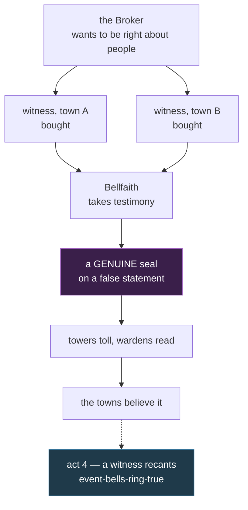

# I-083 — The seal certifies provenance, not truth

**The one-line answer.** Nobody forges the Bellfaith seal because **nobody needs to**. The
seal never claimed the news was true — it claims the Bellfaith *heard someone say it and
wrote it down*. A true seal on a false statement is not a failure of the seal. It is the
seal working exactly as built.

---

## 1. The question, and why it was asked provenance

The Bellfaith seal is load-bearing for the entire corpus. `canon.md:247-250`:

> **The bell-seal certifies.** Inter-town proclamations and news-letters count as true only
> when stamped with the Bellfaith seal — the seal is this world's state news agency and
> notary in one. An unsealed proclamation is just a rumor with good staging.

After I-051, it carries the calendar too: the count of years begins at the **first sealed
record** (`A1-cosmology.md` C5), and `content/story/lore.json`'s `lore-the-first-seal` now
says every lease and every claim measures back to that page.

So the obvious question: **what stops anyone carving a copy of the die and stamping their
own wax?**

**Canon has never answered it.** A grep of `canon.md`, `style.md`, `A1-cosmology.md` and the
story corpus for *forge / counterfeit / tamper* returns nothing about the seal. The world's
most important instrument has no stated security property.

### Why "it's magic" cannot be the answer on its own

`canon.md` §5.3 closes that door from the inside:

> **Rune-craft belongs to everyone.** Every town engraves its own wards, and the craft is
> taught openly. **No town, church, or house holds defense over another.**

A rune-warded seal forces a choice between two failures: either the Bellfaith holds a craft
monopoly (contradicting §5.3 in one sentence), or the craft is open and anybody can reproduce
the ward. §5.1 makes it worse — magic is *cheap and everyday*, so a magical lock is a cheap
lock.

`canon.md` §5.4 adds the iron rule that settles it: **no spell resolves a political knot.**
A magic answer to a political problem is the one shape this world forbids.

---

## 2. What already exists — and a citation defect to fix

`A0-current-world.md:337` (**V16**) is the only place in the entire corpus that gives the seal
a physical property:

> the bells (cast so sound carries unnaturally far; **wax seals crack only when tampered with
> — the text declines to say whether this is faith or magic**), lovers' ink (readable only by
> the addressee), the far-mirrors

Three things follow.

1. **Magic is already on the seal.** This design adds none. It does not need to.
2. **The faith-or-magic ambiguity is deliberate and is kept.** It is also the only posture
   compatible with the 2026-08-05 ruling that **no god exists, only belief**.
3. **Tamper-evidence solves the wrong half.** "Crack when opened" stops someone reading and
   resealing *your* letter. It does nothing about a forger writing a fresh letter and stamping
   it. That gap is what this document closes.

**Defect to fix in the same change set.** V16 cites `canon.md:280-285` for the wax-seal
property. That range is the Gildmark far-mirror paragraph; **the wax-seal sentence does not
appear in `canon.md` at all.** V16 is the sole carrier of a claim it attributes to canon.
Either promote the sentence into `canon.md` §5 or correct V16's citation — per `canon.md` §6
this ships in the same commit, not later.

---

## 3. The design binding

### D1 — The seal certifies provenance, not truth

The Bellfaith seal attests **that a statement was given to the Bellfaith by a named party,
before witnesses, and recorded**. It does not attest that the statement is accurate. This is
what a notary is, and `canon.md:248` already calls the seal "state news agency and notary in
one" — the design makes the notary half literal.

### D2 — Forgery is possible, pointless, and therefore rare

Nothing magical stops a forger. Three ordinary things do, and all are already on the page:

- A stamped page with no bell tolled for it and no bell-rider carrying it is, in
  `canon.md:250`'s own words, **"a rumor with good staging."**
- Each town's tower verifies the seal, tolls assembly, reads aloud, and forwards a copy
  (`canon.md:265`). A forgery must survive that chain in every town it passes.
- Tamper-evidence (V16) closes the easier attack of altering a genuine sealed letter.

So forgery buys nothing that buying a witness does not buy more cheaply and more durably.

### D3 — The seal is only for what crosses town lines

`canon.md:247` already sets the scope and this design keeps it exactly: the seal is for
**inter-town proclamations and news-letters**. Business inside one town — a lease between
neighbours, a local debt, a boundary between two fields — never touches the Bellfaith. The
town settles it the way it always has.

The Bellfaith seals a cross-town statement when **two witnesses from two different towns**
attest to it: one from where the thing happened, one from somewhere else.

**The rule is not stupid — it is obsolete.** The second witness exists so that no single town
can declare something about another town unopposed. In a land with no federation, no common
law and no central court (`A0:335`, **V14**), reaching two towns at once was beyond anybody.
The rule was right for the world it was written for. It is still right for everyone in the
story **except one man.**

### D4 — This is the Bellfaith's named flaw, and it is the last one owed

`A0:336` (**V15**) establishes that **six towns have six named systems of government, each
with its stated exploitable flaw** — Embervale's War Council loophole, Norhollow's
rumour-vulnerable assembly, Gildmark's constitution-that-is-corruption, Millcross's
statelessness, Rooktide's presence-only franchise, Cindervast's vacuum.

`A0:335` (**V14**) then names **only two cross-border institutions: the caravan and the
Bellfaith** — and says the story destroys both. The caravan's destruction is act 1. The
Bellfaith has been carrying an institutional role with **no stated flaw of its own.** D3 is it.

### D5 — What the Broker actually buys

`canon.md:98` states the Broker's drive: **"To be right about people, forever — more than he
wants money."** Buying witnesses is that thesis executed as a method. He does not defeat the
seal; he feeds it. He is the only party in the land who can reach two towns at once, and being
right about which two people will take the coin is the thing he most wants to be right about.

`canon.md:100` says the Bell-Keeper "has sealed false proclamations and burned true ones."
Under D1 this stops being an unexplained betrayal of procedure and becomes **procedure
correctly followed on procured testimony**, plus the omission that is his real crime — which
of the true statements never reach the bell at all. `canon.md:254` already insists his
corruption is "never in the tone or timing of the bell itself."

---

## 4. Consequences for ordinary life

**Ordinary life is barely touched, and that is the point.** D3 keeps the seal on cross-town
news only, so a farmer's lease, a debt between neighbours and a field boundary never involve
the Bellfaith at all. A design whose consequence is *"nothing changes in the village"* is
doing its job — the change belongs where the war is.

Two effects that are real:

**Distance decides what is believed.** Something that happens near a town is known there
within the day. Something that happens far away needs a second town's witness before it can
be proclaimed anywhere — so **the further away an event is, the longer it stays a rumour.**
Towns are best informed about the places they matter least to.

**Reaching two towns at once becomes a form of wealth.** Almost nobody can do it. Whoever can
does not merely spread news faster — he decides which version gets a seal at all. That is the
same advantage `canon.md:152` already grants the Broker in the signal/detail gap, arriving now
by a second road.

**A quiet bonus for the calendar.** The first sealed record is a four-line grain tally
(`A1-cosmology.md` C5). Under D3 the seal is only for what crosses town lines — so the oldest
document in the world is not a village ledger. It is **grain moving between two towns**, with
two strangers vouching for the count. The world's calendar begins at a trade dispute nobody
recorded the outcome of.

---

## 5. Costs and limits

- **The seal cannot be checked by a player or a citizen.** Verification lives in the tower
  chain. Someone holding a sealed page alone can confirm it is genuine, never that it is true.
- **The Bellfaith cannot audit its own witnesses across towns** — it has the relay for signals
  (`canon.md:258-262`) but no cross-town register of who has attested. That absence is the flaw.
- **It fails against a party rich enough to reach two towns.** By construction, that is the
  Broker and, after act 4, potentially the Iron Regent.
- **It is not retroactive.** Nothing in this design lets anyone re-open an already-sealed record.

---

## 6. Known-wrong

| Widely believed | Actually true |
| --- | --- |
| A sealed proclamation is true | It is *attested*. Two people said so and the Bellfaith wrote it down. |
| The seal cannot be forged | It can. Forging it is simply worthless without the tower, the toll and the rider. |
| The Bellfaith's authority rests on holiness | It rests on being the only body that keeps records two towns will both accept. |
| The Bell-Keeper faked documents | He mostly did not. He chose which true things never got heard. |

---

## 7. What this does not change

- **The three layers and two speeds** (`canon.md:234-266`) — untouched. The signal/detail gap
  remains the Broker's core exploit and `canon.md:152` still holds: *"the lie isn't in the
  seal, it's in who arrives first."* This design adds a second method beside it, it does not
  replace it.
- **The magic model** — `canon.md` §5 entire. No new magic, no rune monopoly, no spell
  resolving a political knot. V16's utility magics stay as they are.
- **No god.** The seal's ambiguity between faith and magic is preserved verbatim.
- **The five acts** — every event id, character fate and quest stands. `event-bells-ring-true`
  gains a mechanism (a witness recants) but keeps its place, its act and its meaning.
- **The Widow may not be resolved** (`DR-001-L1-scope.md:190`).
- **`lore-the-first-seal` stays valid as written.** Its line *"every lease and every claim in
  this land measures back to this page"* is about **dating**, not about needing a seal — a
  village lease is still dated from the count while never going near the Bellfaith. D3 narrows
  what gets *sealed*, never what gets *dated*.

---

## 8. Open questions for the plan

1. **Does the sentence promote into `canon.md` §5, or does V16's citation get corrected?**
   §3's defect must be closed either way; which way is a plan decision.
2. **Is the two-witness rule stated in player-facing content, or only in canon?** Under
   *world first, prose later* it can ship as world law with no lore node yet.
3. **Which act-4 witness recants?** The plan should check whether an existing named character
   can carry it before inventing one.

---

## 9. Contradiction rule

Matching `canon.md` §6: any content that contradicts this document is a review finding. Fix
the content, or amend this document deliberately in the same commit — never leave two files
disagreeing.
