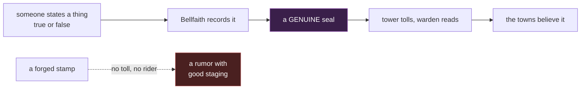

# I-083 — The seal certifies provenance, not truth

**The whole design, in one sentence.** The Bellfaith seal attests that **a statement was given
to the Bellfaith and recorded** — never that the statement is true. Nobody forges it because a
true seal on a false statement is easier to obtain and works better.

Everything below is either the evidence for that sentence or a collision it has to clear.
There is no second rule.

---

## 1. The question unanswered until now

`canon.md:247-250`:

> **The bell-seal certifies.** Inter-town proclamations and news-letters count as true only
> when stamped with the Bellfaith seal — the seal is this world's state news agency and
> notary in one. An unsealed proclamation is just a rumor with good staging.

After I-051 the seal carries the calendar too: the count of years begins at the **first sealed
record** (`A1-cosmology.md` C5).

So: **what stops anyone carving a copy of the die and stamping their own wax?**

**Canon has never said.** Grepping `canon.md`, `style.md`, `A1-cosmology.md` and the story
corpus for *forge / counterfeit / tamper* returns nothing about the seal. The world's most
important instrument has no stated security property.

### Why "it's magic" cannot be the answer

`canon.md` §5.3 shuts that door from the inside: **"Rune-craft belongs to everyone… No town,
church, or house holds defense over another."** A warded seal forces a choice between the
Bellfaith holding a craft monopoly (contradicting §5.3 outright) and the ward being
reproducible by anyone. §5.1 makes it worse — magic is *cheap and everyday*, so a magical lock
is a cheap lock. And §5.4's iron rule settles it: **no spell resolves a political knot.**

---

## 2. What already exists — and one defect to fix

`A0-current-world.md:337` (**V16**) is the only place in the corpus giving the seal a physical
property:

> the bells (cast so sound carries unnaturally far; **wax seals crack only when tampered with
> — the text declines to say whether this is faith or magic**), lovers' ink, the far-mirrors

**Magic is already on the seal; this design adds none.** The faith-or-magic ambiguity is kept —
it is also the only posture compatible with the ruling that no god exists, only belief.

Tamper-evidence stops someone opening and resealing *your* letter. It does nothing about a
forger writing a fresh one. That is the gap §3 closes.

**Defect, ships in the same change set.** V16 cites `canon.md:280-285` for the wax-seal
property. That range is the Gildmark far-mirror paragraph — **the sentence appears nowhere in
`canon.md`.** Either promote it into `canon.md` §5 or fix V16's citation. Per `canon.md` §6
this goes in the same commit, not later.

---

## 3. The design binding

### D1 — The seal certifies provenance, not truth

The seal attests that **a statement was given to the Bellfaith and recorded**. It does not
attest that the statement is accurate. `canon.md:248` already calls the seal "state news agency
and notary in one"; this makes the notary half literal. A notary certifies that a person
signed — never that what they signed is so.

### D2 — Forgery is possible, and worthless

Nothing stops a forger stamping wax. Three things already on the page make it pointless:

- A stamped page with no bell tolled for it and no bell-rider carrying it is, in
  `canon.md:250`'s own words, **"a rumor with good staging."**
- Each town's tower verifies the seal, tolls assembly, reads aloud, forwards a copy
  (`canon.md:265`). A forgery must survive that in every town it passes.
- Tamper-evidence (V16) closes the easier attack of altering a genuine sealed letter.

**No new gate is invented.** The gate is the one canon already has: `canon.md:253-254` says the
Bell-Keeper's crime is choosing *which proclamations get read and sealed* — which only means
anything because nobody can seal a thing on their own.

---

## 4. What it costs, and where it fails

- **Nobody can check a seal alone.** Holding a sealed page proves it is genuine, never that it
  is true. Verification of *truth* does not exist anywhere in this world.
- **The Bellfaith certifies what it cannot verify.** It records testimony; it has no way to go
  and look. That is the institution's flaw — the one `A0:336` (**V15**) gives every other body
  and the Bellfaith never had, even though `A0:335` (**V14**) names it one of only two
  cross-border institutions.
- **It fails against whoever can supply the statement.** `canon.md:98` gives the Broker's
  drive: *"To be right about people, forever."* He does not defeat the seal, he **feeds** it —
  which is that drive executed as a method.
- **The Bell-Keeper's crime gets sharper.** `canon.md:100` says he "sealed false proclamations
  and burned true ones." Under D1 the first half is ordinary procedure on a false statement;
  his real crime is the second half — the true things that never reached the bell.

**Ordinary life is untouched, and that is correct.** A farmer's lease and a debt between
neighbours never involved the Bellfaith; `canon.md:247` scopes the seal to inter-town
proclamations. A design whose village-level consequence is *nothing* is working — the change
belongs where the war is.

---

## 5. Known-wrong

| Widely believed | Actually true |
| --- | --- |
| A sealed proclamation is true | It is *recorded*. Someone said so and the Bellfaith wrote it down. |
| The seal cannot be forged | It can. Forging it is worthless without the tower, the toll and the rider. |
| The Bell-Keeper faked documents | Mostly he did not. He chose which true things were never heard. |

---

## 6. What this does not change

- **The three layers and two speeds** (`canon.md:234-266`). `canon.md:152` still holds — *"the
  lie isn't in the seal, it's in who arrives first."* This adds a second road beside it.
- **The magic model** — `canon.md` §5 entire. No new magic, no monopoly, no spell resolving a
  political knot.
- **No god.** V16's faith-or-magic ambiguity is preserved verbatim.
- **The five acts.** Every event id, character fate and quest stands, `event-bells-ring-true`
  included.
- **`lore-the-first-seal` as written.** Its *"every lease and every claim measures back to this
  page"* is about **dating**, not about needing a seal.
- **The Widow may not be resolved** (`DR-001-L1-scope.md:190`).

---

## 7. Open questions for the plan

1. Does the wax-seal sentence promote into `canon.md` §5, or does V16's citation get corrected?
2. Does D1 get stated in player-facing content, or ship as world law only? Under *world first,
   prose later* it can ship with no lore node.

---

## 8. Contradiction rule

Matching `canon.md` §6: content contradicting this document is a review finding. Fix the
content, or amend this document deliberately in the same commit — never leave two files
disagreeing.
