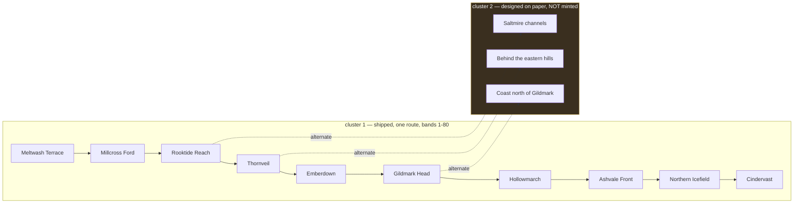

# L2 zone content — the ten grounds

**`A1-geography-cluster1.md` settled where the ten zones are. `A2-ecology-thornveil.md` settled what
lives in one of them. This settles what a player *does* in each of the ten** — what threatens them,
what they can take out, what they will remember seeing, and why they walked in at all.

<div class="callout warn">

**The naming trap this design nearly fell into.** SWF §2 assigns `A3` to **L3** — races, dungeons,
camps, bosses — which is I-063's slot, not this one. I-060 is **L2**, so its artifact is
**`A2-zones-cluster1.md`**, a sibling of `A2-ecology-thornveil.md`. Do not mint an `A3` here.

</div>

---

## 0. Decisions this design executes

Four forks were put to the owner on 2026-08-08. All four are settled; nothing below re-opens them.

| # | Question | Ruling |
| --- | --- | --- |
| **D1** | I-060's title asks for route alternates, but `A1:243-248` routed those to cluster 2 and DR-003 froze `zones` at 10. Which wins? | **Deepen the existing ten. Alternates are designed on paper only** — specified in prose, never minted as zones, never counted by the budget. |
| **D2** | What shape is the deliverable? | **The F-029 pattern** — schema + per-zone JSON + strict gate rules — plus **one** shared derivation doc covering all ten, not ten separate docs. |
| **D3** | The runtime hazard enum cannot express the Ashvale Front's defining hazard. How are hazards typed? | **Fiction vocabulary with an optional runtime binding.** The gate **warns** on an unmapped hazard; it does not fail. |
| **D4** | What bar makes a zone content-complete? | **Floors plus a distinctiveness rule** — ≥2 hazards, ≥2 resources, ≥2 landmarks, a `reasonToGo`, and no two zones sharing a landmark name or an identical resource-kind set. |

<div class="callout danger">

**D1 is a correction to this idea's own title, not a scope cut.** The title and `idea-map.md:68`
both promise *"alternates for the single route cluster 1 currently ships."* `A1-geography-cluster1.md`
§4.4 already ruled on that and named where the alternates go — the Saltmire's channels, the coast
north of Gildmark, the far side of the eastern hills. It calls the single route **a known deficiency
rather than hiding it**, and assigns the fix to cluster 2. Minting alternates now would put `zones`
above its DR-003 target of 10 while every other cluster-1 line is still short.

</div>

---

## 1. Provenance

Derives from **`A1-geography-cluster1.md`** (the ten zones, §4.2; the six towns and their economies,
§6; the route, §4.4; the game-vs-fiction distance rule, §5.3) and **`A2-ecology-thornveil.md`**
(the per-zone artifact pattern, and Thornveil's own landmarks).

Researched against the repo, not against a new dossier: `content/maps/cluster1-geography.json`,
`content/schemas/map.schema.json`, `content/season-1-budget.json`, `scripts/lib/season1.mjs`,
`scripts/check_content.mjs`, and `colyseus-server/src/modules/ZoneEffectManager.ts`.

---

## 2. The gap — measured, not asserted

`content/maps/cluster1-geography.json` gives each of the ten zones exactly eight fields:
`id, name, order, levelBand, terrainKind, town, labelAt, polygon`.

<div class="metric-grid">
<div class="metric-tile"><strong>10</strong><br/>zones defined<br/><em>geometry and level band only</em></div>
<div class="metric-tile alarm"><strong>0</strong><br/>zones with hazards, resources or landmarks as data</div>
<div class="metric-tile alarm"><strong>0</strong><br/><code>zones</code> measure functions in <code>scripts/lib/season1.mjs</code></div>
<div class="metric-tile"><strong>7 / 10</strong><br/>distinct <code>terrainKind</code> values across the ten zones<br/><em>five zones share a label with a neighbour</em></div>
</div>

Three consequences, each verified:

1. **The `zones` budget line cannot be scored.** `content/season-1-budget.json` sets `target: 10` and
   carries a `blockedBy`. `scripts/lib/season1.mjs` exports `mobBases`, `bestiaryDesigns`,
   `actIndependentQuests`, `townArt` and `bestiaryArt` — **and nothing for zones.** Even with the
   blocker lifted there is no function to count anything.
2. **Terrain alone cannot differentiate the ten.** `terrainKind` holds only seven distinct values
   across ten zones: `river-country` covers **Meltwash Terrace, Millcross Ford and Rooktide Reach**;
   `rim` covers **Emberdown and Hollowmarch**. Five of ten zones share a terrain label with a
   neighbour. Content derived from terrain alone produces five near-duplicates.
3. **Hazards have a runtime home; resources and landmarks have none.** `map.schema.json`'s
   `zoneHazards` is a closed enum — `freeze, stun, burn, poison, regen, heal, damage` — consumed by
   `ZoneEffectManager`. There is no schema anywhere in the repo for a harvestable resource or a
   landmark.

---

## 3. Claims — the new facts, numbered and binding

- **C1 · A zone's reason to exist for a player is a separate fact from its reason to exist
  geographically.** A1 §4.2 already answers *why is this ground here* for all ten. It never answers
  *why does someone walk in.* These are different questions and the second one is this artifact's
  spine.
- **C2 · Every zone yields something a person carries out.** Cluster 1 is a post-war land whose towns
  are named for what they extract or move — the ford, the seam, the ore heads, the hull change. A
  zone that yields nothing is a corridor, not a zone.
- **C3 · A hazard may be an absence.** The Ashvale Front's threat is stated by `A1:198` as *no water,
  no cover, easy to dig*. Nothing ticks. This is a hazard the world already has and the engine
  cannot yet express, and the design records it as a hazard regardless.
- **C4 · A landmark is a thing a traveller sees before anything else.** A1 §6 already wrote this
  test for the six towns and answered it for each — the cart queue, the smoke, the tally boards, the
  bar, the birds, the statues. C4 extends the same test to the four town-less zones.
- **C5 · Two zones sharing a terrain kind must not share a resource profile.** This is the load-
  bearing constraint that keeps the three river-country zones distinct, and it is enforced by gate
  rather than by taste.

---

## 4. Causal links — what each claim explains that was already on the page

| Claim | Explains |
| --- | --- |
| C1 | Why `A1:191` can say Meltwash Terrace is *"the only drained flat ground within a morning's walk of the ford"* and still leave a player with no errand there. |
| C2 | Why the six towns' economies in A1 §6 are all extraction or transit, and why Cindervast — which *"does nothing for a living"* — is the land's dead end. |
| C3 | Why the Ashvale Front is the only region with species in all eight bands (`A1:208-216`) yet holds no town: the ground kills by what it lacks, so nobody settles it and everything can live on it. |
| C4 | Why A1 §6 was written silhouette-first for concept art — the same first-sight test that drives an art brief drives a player's memory of a place. |
| C5 | Why the Systems Designer assumes **12 species per zone before repetition is felt** (`role-systems-designer-scale.md:47`): repetition is a content-identity problem, and terrain is too coarse an axis to solve it. |

---

## 5. Consequences — second-order effects on ordinary life

Two per claim, as SWF §3.4 requires.

- **C2 → trade.** If every zone yields, then the trade road's traffic is not just through-traffic;
  each stretch has its own local cargo, and Millcross's refusal to formalise its tolls
  (`A1` §6) becomes a live grievance for nine zones' worth of carters rather than an anecdote.
- **C2 → work.** A burial detail walking north up the Ashvale Front is passing through eight other
  zones' economies. The player role DR-001 defines is the one profession that crosses all of them.
- **C3 → law.** Ground that kills by absence cannot be policed by presence. The Front has grave rows
  and no wardens, which is why it is *"the only ground both towns reach in a day and neither can
  hold"* (`A1:198`).
- **C3 → burial.** An absence-hazard is why the Front is dug rather than settled: the same lack of
  water and cover that makes it lethal makes it easy to dig.
- **C4 → travel.** A traveller navigates cluster 1 by first-sight landmarks, not by distance —
  which is exactly the mechanism A1 §5.3 requires when it bans expressing fictional days as walking
  time and mandates *"a signpost at a waystation, not the player's legs."*
- **C5 → who gets rich.** Distinct resource profiles mean the three river-country zones compete on
  different goods, so no single town can corner the river.

---

## 6. The data shape

New directory `content/zones/`, one file per zone, `zone-<id>.json`, validated by a new
`content/schemas/zone-content.schema.json` with `additionalProperties: false` at every level —
matching `character.schema.json`'s strictness.

```json
{
  "zone": "emberdown",
  "reasonToGo": "The only hillside in the land where the fuel and the food come out of the same ground.",
  "hazards": [
    {
      "id": "seam-damp",
      "name": "Seam damp",
      "description": "Air that has sat in a worked adit overnight...",
      "effect": "poison",
      "note": "optional authoring note; never player-facing"
    }
  ],
  "resources": [
    { "id": "burning-stone", "name": "Burning stone", "kind": "fuel", "description": "..." },
    { "id": "ledge-loam",    "name": "Ledge loam",    "kind": "crop", "description": "..." }
  ],
  "landmarks": [
    {
      "id": "the-adits",
      "name": "The adits",
      "description": "...",
      "source": "docs/worldbuilding/A1-geography-cluster1.md#6"
    }
  ]
}
```

**Field rules:**

- `effect` is **optional**. When present it must be one of the seven `zoneHazards` types, so an
  authored hazard that *is* implementable is machine-identifiable without a second pass.
- `resources[].kind` uses a closed enum drawn from what canon already says cluster 1 lives on:
  **`crop, timber, ore, fuel, stone, water, forage, salvage`**. Nothing here is invented economics —
  each maps to a town economy A1 §6 already wrote, plus `salvage` for Rooktide's *"old plank sewn
  into new"* and Cindervast's intact streets.
- `landmarks[].source` is optional but **strongly conventional**: a landmark should cite the canon
  line it derives from. A landmark with no `source` is a deliberate invention and should be reviewed
  as one.

<div class="callout success">

**The authoring cost is far lower than it looks, because canon already wrote the landmarks.**
Every one of the ten zones already has at least two nameable landmarks on the page — for the six
towns these are A1 §6's explicit first-sight answers; for the four town-less zones they are
landmarks the text names without applying that test. Namely: the
mill-wheel housing and cart queue, the terraced ledges and adits, the tally boards and palisade, the
mirror tower and the bar, the barge-cranes and rook flats, the Giving King statues and fused
shadows, the Stoneguard's oath-gate and crevasse shelf, the grave rows in three ages, Thornveil's
heartwood and crown thickets, and Meltwash Terrace's gravel bars and expedition camp. **The pass is
mostly transcription and derivation, not invention** — which is the correct posture given F-033's
finding that adding specificity is the fastest way to contradict canon.

</div>

---

## 7. The gate — `checkZoneContent()` in `scripts/check_content.mjs`

Named **Z1–Z7** to mirror the G1–G8 convention `checkBestiaryPlacement()` established, and placed
alongside it in the main run.

| rule | enforces | failure mode |
| --- | --- | --- |
| **Z1** | `zone` exists in `cluster1-geography.json#zones` | FAIL |
| **Z2** | **completeness** — each of the ten zones has exactly one record; no duplicates, no orphans | FAIL |
| **Z3** | floors — ≥2 hazards, ≥2 resources, ≥2 landmarks, non-empty `reasonToGo` | FAIL |
| **Z4** | ids kebab-case and unique within their array | FAIL |
| **Z5** | `effect`, when present, is one of the seven runtime types | FAIL on a bad value, **WARN** when absent |
| **Z6** | **distinctiveness** — no landmark `name` appears in two zones; no two zones share an identical resource-`kind` set | FAIL |
| **Z7** | `resources[].kind` is in the enum | FAIL |

**Z2 and Z6 are the pair that carries the design.** Z2 is the direct analogue of F-029's G4 — it is
what lets coverage be proved by gate rather than by eye, and it is why the per-zone cost is bounded:
you cannot half-finish the cluster and pass. Z6 is what makes D4's distinctiveness ruling real
rather than aspirational.

`loadGeographyZones()` already exists in `check_content.mjs` and is reused unchanged for Z1 and Z2 —
no new loader.

<div class="callout danger">

**Z5 warns rather than fails on purpose, and that is a deliberate accepted risk.** It means a zone
can reach content-complete with zero implementable hazards. That is the correct trade under D3 — the
alternative rejects the Ashvale Front's defining hazard — but it means the WARN count is the only
signal of how much of the authored world the engine can actually express. **The implementation must
print that count, not swallow it.**

</div>

---

## 8. The budget measure — and one thing not to overclaim

A new `zones(root)` export in `scripts/lib/season1.mjs` counts zone records passing the Z3 floors,
scored against `target: 10`, wired into `buildRows`.

<div class="callout warn">

**Do not simply delete the `blockedBy`.** It currently reads *"P1 — keyspace unification; A1's ten
zones have no `region-*` ids yet."* This design does not satisfy that sentence — it **sidesteps** it,
by keying zone content on the geography zone id (`emberdown`) rather than on a runtime region id
(`region-emberdown`).

That legitimately makes the line measurable, and the line should be unblocked. But the **X12
keyspace rename remains separately owed** — it is I-056 item 4, still unpromoted. The correct edit
is to **rewrite the line's premise** to state what it now measures, not to silently drop the field
and let a future reader believe the rename happened.

</div>

---

## 9. The alternates, on paper only

`A2-zones-cluster1.md` carries an **§ alternates** section specifying where cluster 2's branches
attach — the three sites A1 §4.4 already named, each given the band it would serve and the zone it
forks from.

**They stay prose. They get no schema, no record, and no budget row.** Gating a record for zones
that do not exist would manufacture a completeness signal for unbuilt content, which is exactly the
failure Z2 exists to prevent elsewhere in this design.



---

## 10. Costs and limits

- **Z5's blind spot**, stated in §7 — content-complete does not imply runtime-expressible.
- **The distinctiveness rule bites hardest where the land is genuinely similar.** The three
  river-country zones share a river. Z6 forces different resource *kinds*, which may push an author
  toward a strained distinction rather than an honest one. The mitigation is that the towns' real
  economies already differ — the ford tolls, the hull change, and a camp with no town at all.
- **`meltwash-terrace` has no bestiary region**, which exempted it from F-029's placement work. It
  is **not** exempt here: it has terrain, a camp and a reason to go, so it owes a full record.
- **This is a fiction-layer artifact.** It does not touch `content/maps/atlas-frontier.md`. Per
  A1 §5.3, that 1000×1000 shelf is a compressed miniature and the decision to rebuild or retire it
  is the Systems Designer's under DR-001 §6.4.2 — explicitly not this role's call.

---

## 11. Known-wrong — what people in the world believe that is false

- **That the Front is empty.** It is the only region with species in all eight bands. The people who
  cross it fastest are the ones most certain nothing lives there.
- **That Cindervast yields nothing.** It *"does nothing for a living"*, which is a statement about
  its inhabitants, not its ground: a bleached, unrubbled city with intact mortar is the largest
  intact salvage field in the land, and the two groups holding it will not say its name.
- **That Thornveil is worthless.** Every road went *around* it, so it stayed nobody's — a judgement
  about routing that the land's own hydrology contradicts.

---

## 12. What this does not change

- `content/maps/cluster1-geography.json` — **not edited.** Zone records reference it; nothing is
  written back.
- `content/maps/atlas-frontier.md` and its `zoneHazards` — untouched.
- `bestiary.json`, `placement-thornveil.json` and F-029's G1–G8 — untouched; Z-rules live in a
  separate function over a separate file class.
- The 152 story nodes, the novel, the 5-act structure, `canon.md` — untouched. Nothing here amends
  narrative.
- The `mob-bases`, `spawn-entries` and `world-state-systems` budget lines and their blockers.

---

## 13. Contradiction rule

Per `canon.md` §6: any collision found while authoring is **named in the artifact and fixed in the
same commit**. The one already known is D1 — I-060's title versus `A1` §4.4 — and it is resolved in
this document's favour of A1, with the idea's own title corrected rather than left to disagree.

---

## 14. Deliverables

| # | Artifact | Kind |
| --- | --- | --- |
| 1 | `content/schemas/zone-content.schema.json` | new schema |
| 2 | `content/zones/zone-<id>.json` × 10 | new data |
| 3 | `checkZoneContent()` in `scripts/check_content.mjs`, wired into the main run | gate |
| 4 | `scripts/tests/zone-content.test.mjs` | tests — one per Z-rule, both polarities |
| 5 | `zones(root)` in `scripts/lib/season1.mjs` + `buildRows` wiring | measure |
| 6 | `content/season-1-budget.json` — `zones` line premise rewritten, blocker lifted | budget |
| 7 | `docs/worldbuilding/A2-zones-cluster1.md` incl. § alternates | world artifact |
| 8 | `.claude/idea_backlog/I-060-*/spec.md` — title corrected per D1 | backlog hygiene |

---

## 15. Gate self-check (SWF §4)

| Gate | Verdict |
| --- | --- |
| **G1 · swap test** | **Pass.** Strip the proper nouns and what remains is a land where one crossing serves everything, a burial ground that kills by absence, and a bleached city nobody will name. That is not generic. |
| **G2 · explains, not appends** | **Pass.** §4 ties all five claims to text already on the page; C1 exists precisely because A1 answered the geographic question and not the player one. |
| **G3 · has a cost** | **Pass.** §10 states the costs, including one accepted blind spot (Z5) rather than hiding it. |
| **G4 · voice** | **Deferred to authoring.** This design contains no player-facing prose. `A2-zones-cluster1.md` must be checked against `style.md` when written — including the banned-word list. |
| **G5 · no contradiction** | **Pass with one named collision** — D1, resolved in §0 and §13. |
| **G6 · ordinary life legible** | **Pass.** §5 states what changes for a carter, a burial detail and a town that cannot corner its own river. |
| **G7 · zero real-world nouns** | **Pass** for this document. **Must be re-grepped** over `A2-zones-cluster1.md` before acceptance. |

**Quality items:** Q2 (specificity) and Q4 (material grounding) are the strengths — every resource
kind maps to a written town economy. **Q3 (inversion) is the weakest** and is worth a deliberate
pass during authoring: §11's Cindervast-as-salvage-field is currently the only turned-over
expectation.

---

## 16. Open questions handed on

1. **Does a zone record need a `dangerBand` distinct from the geography's `levelBand`?** The Ashvale
   Front is a gradient (`A1` §4.3), so one band per zone may be wrong for it specifically. Not
   answered here; the Front's record may need a shape the other nine do not.
2. **Who consumes `effect` at runtime?** Nothing does today. Wiring authored hazards into
   `ZoneEffectManager` is a separate engineering idea and is not filed.
3. **Does I-063 (L3 dungeons) attach to zone records or to geography directly?** I-063 owns that;
   this design deliberately leaves `landmarks` unaware of dungeons.
4. **Should `landmarks[].source` become mandatory once the ten are written?** It is conventional-not-
   required here to avoid blocking deliberate invention. Revisit after the pass.

---

## 17. Verification

```bash
cd scripts && npm install                       # fresh worktrees have no scripts/node_modules
cd scripts && npm test                          # NOT `node --test scripts/tests/` — broken on Node 26
node scripts/check_content.mjs                  # the content gate; Gate 1 does NOT run this
node scripts/report_season1.mjs                 # zones line must read 10/10, not blocked
```

**Acceptance:** the scripts suite green with the new zone-content tests; `check_content.mjs` reporting
ten zone records and zero failures; `report_season1.mjs` scoring `zones 10 10 met`; and the Z5 WARN
count printed rather than swallowed.

**Never write `$?` after a pipe** — it reports the last pipeline element, not the command.
