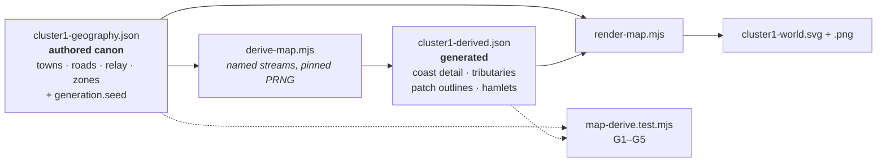

# Seeded map data model — why detail has stalled, and the schema that unstalls it

**The cluster-1 world map is drawn from roughly 150 hand-placed points.** That is not a
criticism of the drafting; it is the ceiling of hand-authoring. Every additional bay, tributary,
copse and hamlet costs an author a coordinate pair, so the map has the density an author can
afford — and it reads as a diagram of rounded blobs rather than as terrain.

This design does **one** thing: it defines where a seed lives, what is authored versus generated,
and how determinism and diffs are enforced. It deliberately contains **no generation algorithm and
no rendering change.**

---

## 0. What was measured

Measured 2026-08-09 against `content/maps/cluster1-geography.json` (v-current, 23 KB) and
`tools/mapforge/render-map.mjs`.

<div class="metric-grid">
<div class="metric-tile alarm"><strong>20</strong><span>coastline points for 190 km of coast — one per ~10 km</span></div>
<div class="metric-tile alarm"><strong>20</strong><span>river points, and <em>zero</em> tributaries</span></div>
<div class="metric-tile alarm"><strong>~70</strong><span>points for all ten zones — each a 6–7 point rounded polygon</span></div>
<div class="metric-tile alarm"><strong>1</strong><span><code>terrainPatches</code> entry, against the six terrain fills A1 §7.1 promises</span></div>
<div class="metric-tile alarm"><strong>0</strong><span>settlements below town rank — 6 towns, 1 camp, nothing else</span></div>
<div class="metric-tile alarm"><strong>0</strong><span>occurrences of "seed" in the map data or the renderer</span></div>
</div>

The map is **100% authored, with no procedural content of any kind.** That is the finding this
design responds to.

<div class="callout info">

**The scope question was asked and settled.** `A1-geography-cluster1.md:61` states the land is
190 × 150 km and calls it *"a province, not a continent"*, sized deliberately to fit canon's
travel times and population table. **The map is not failing to be a world map — no tier above
province exists yet.** Widening the frame is a separate, canon-touching decision (the two exits
are already open: Gildmark's sea-lane and the shut pass behind Cindervast, `A1:246`). This design
does not touch it.

</div>

---

## 1. The constraint that shapes the whole schema

`content/maps/cluster1-geography.json` **is not the renderer's private input.** It is a
cross-cutting source of truth:

- The ecology work validates zone ids against it (gate **G1**) and level bands against
  `zones[].levelBand` (gate **G8**) — see `I-059` spec §"Gates".
- `zone-content` and `check_content` read it.
- `art-manifest.json` records it as the input of `art:map-cluster1`.

<div class="callout danger">

**Therefore the schema change must be purely additive. No existing key moves, is renamed, or
changes type.** A schema change that breaks the ecology gates would cost more than the detail it
buys.

</div>

---

## 2. File layout

```
content/maps/cluster1-geography.json   authored canon — UNCHANGED except one additive key
content/maps/cluster1-derived.json     machine-written, committed, never hand-edited
tools/mapforge/derive-map.mjs          NEW — (authored + seed) → derived
tools/mapforge/render-map.mjs          reads both
scripts/tests/map-derive.test.mjs      NEW — the determinism gate
```



**The seed lives in the authored file**, as a single additive key:

```json
"generation": { "seed": 20260809 }
```

Choosing a seed is a world-authoring decision, so it belongs beside the geography, where changing
it is a one-line reviewable canon diff. The derived file echoes it back so that file is
self-describing.

### 2.1 The derived file's shape

```json
{
  "$generated": "DO NOT EDIT — written by tools/mapforge/derive-map.mjs",
  "source": "content/maps/cluster1-geography.json",
  "seed": 20260809,
  "generatorVersion": 1,
  "sourceHash": "sha256:…",
  "streams": {
    "coastline":   { "subSeed": 2417..., "features": [ … ] },
    "rivers":      { "subSeed": 9931..., "features": [ … ] },
    "terrain":     { "subSeed": 5502..., "features": [ … ] },
    "settlements": { "subSeed": 7148..., "features": [ … ] }
  }
}
```

`sourceHash` makes an authored edit that never got regenerated detectable (gate G2). It covers an
**explicit key list, not "everything"** — `coastline`, `river`, `saltmire`, `iceEdge`,
`terrainPatches`, `zones`, `towns`, `camps`, `roads`, `relay`, `seaLane`, and
`coordinateSystem.extentKm`. Prose-only keys (`about`, `source`, `sheet`, per-feature `note`) are
excluded, so wording edits do not force a pointless regeneration. The list lives as a single
exported constant in `derive-map.mjs`; adding a geography key that should affect generation means
adding it there, and G2 will not notice on its own.

---

## 3. The authored / generated split

One sentence decides every case, present and future:

<div class="callout idea">

**A feature is AUTHORED if any sentence of canon can be wrong about it. Everything else is
GENERATED.**

</div>

| Layer | Authored | Generated |
| --- | --- | --- |
| Coastline | the ~20 control points — where the sea is | subdivision between them: bays, headlands, islets |
| River | reaches, tidal limit, the ford | tributaries, meander |
| Zones | `id`, polygon, `levelBand`, `terrainKind` | boundary crinkle, internal texture |
| Terrain patches | which kind sits where (label + seed polygon) | patch outlines, fill distribution |
| **Towns · roads · relay towers · day-counts** | **all of it** | **never generated** |
| Sub-town settlements | which zones admit them, and how many | their positions |

### 3.1 Generated features must be nameless

The authored file's own `about` field states:

> *"Every proper noun here already exists in the Cartographer's document (A1) or
> `content/story/canon.md` — nothing is invented."*

<div class="callout warn">

**So the generator may never emit a `name` or `label`.** A generated hamlet gets a symbol and no
lettering. The moment a feature needs a name, it is authored by a human, into the canon file, with
a source. This is what stops a procedural pass from quietly manufacturing lore — and it is
enforced mechanically by gate **G5**, not left to discipline.

</div>

---

## 4. Determinism contract

### 4.1 Named streams, hash-derived sub-seeds

Each stream draws from its own PRNG, sub-seeded by hash:

```
subSeed(seed, stream) = fnv1a32(`${seed}:${stream}`)
```

<div class="callout danger">

**Not by addition.** `tools/art-forge/generate/batch-matrix.mjs:61` derives per-cell seeds as
`base + raceIdx * jobLen + jobIdx`. That is sound *inside one matrix*, but the ranges of two
different feature families overlap, so a second consumer of the same scheme collides silently. A
namespaced hash cannot.

</div>

**Why streams matter more than anything else here:** with a single shared RNG, adding hamlets
shifts every subsequent draw and rerolls the coastline you already approved. With named streams,
**detail is addable without disturbing approved work.** Gate G3 exists to prove this property
holds, because it is the property the whole design is for.

### 4.2 The rest of the contract

| Rule | Why |
| --- | --- |
| PRNG is **mulberry32, pinned in-repo** (~8 lines) | Never `Math.random()`; never from a dependency. Determinism a package upgrade can break is not determinism. |
| Seed validated by the house `parseSeed` shape (`charsheet.mjs:142`) | Non-negative integer; a bare `--seed` flag arrives as `true` and must fail loudly at the CLI boundary, not sail through as `1`. |
| `generatorVersion` recorded in the derived file | The seed does not pin output — the algorithm does. A bump is an explicit, reviewable reroll. |
| Coordinates rounded at emit (reuse the renderer's `r2`) | Platform float differences must never surface as a diff. |
| Stable key order on serialize | Byte-stability is what G1 asserts. |

---

## 5. The gate — `scripts/tests/map-derive.test.mjs`

Follows the existing `node --test` convention already used across `scripts/tests/`.

| Gate | Assertion | Catches |
| --- | --- | --- |
| **G1 · determinism** | generating twice from one seed yields identical bytes | hidden nondeterminism (`Math.random`, key order, float drift) |
| **G2 · freshness** | regenerating from the committed authored file equals the committed derived file | "edited the geography, forgot to regenerate" |
| **G3 · stream independence** | draw N and then N+1 values from the `settlements` stream; the `coastline` block is **byte-identical** across both runs | the shared-RNG failure that would make every later addition a full reroll |
| **G4 · canon untouched** | every authored feature id survives unchanged into the output | a generator that mutates or drops canon |
| **G5 · nameless** | no generated feature carries `name` or `label` | procedurally invented lore |

<div class="callout success">

**G3 and G5 encode the design's two real promises.** G1, G2 and G4 are hygiene. A review that
only checks the hygiene gates has not checked this design.

</div>

---

## 6. Diffs

- Derived file is **grouped by stream, one feature per line**, so a rivers reroll touches only the
  rivers block and review stays readable.
- Marked `linguist-generated=true` in the existing `.gitattributes` so it collapses in PR review.
- Opens with the `$generated` banner so a human who opens it directly is told not to edit it.

Committing generated artifacts is already the house style here — `cluster1-world.svg` and `.png`
are both committed outputs of `render-map.mjs`.

---

## 7. Blast radius

| Touched | Change | Risk |
| --- | --- | --- |
| `cluster1-geography.json` | **+1 key** (`generation.seed`). Nothing moves. | Low — additive only |
| Ecology gates G1 / G8 (`I-059`) | none — they read authored zones | None |
| `art-manifest.json` → `art:map-cluster1` | `gen.method` → `"authored-vector+seeded"`, add `gen.seed` | Low — `check_asset_manifest` already validates `seed` as an integer (`check_asset_manifest.test.mjs:213`) |
| `render-map.mjs` | reads two files instead of one | Low |
| `tools/mapforge` | **currently has no tests at all** — this adds the first | Improvement |

---

## 8. Non-goals

Stated explicitly so the next spec does not absorb them by drift:

1. **No generation algorithms.** Coastline subdivision, hydrology / flow accumulation, terrain
   boundaries and settlement placement are all out. This spec defines the container they will
   fill.
2. **No rendering change.** `render-map.mjs` learns to read a second file and nothing else. The
   drawn sheet is expected to be **unchanged** until a later spec adds a generator.
3. **No world tier, no cluster 2.** See §0.
4. **No renaming or restructuring of existing geography keys.** See §1.

---

## 9. Acceptance

This design is done when, on release/1.8:

- `content/maps/cluster1-geography.json` carries `generation.seed` and **no other change**.
- `tools/mapforge/derive-map.mjs` exists, emits `cluster1-derived.json` with all four streams
  present and their sub-seeds recorded, each `features` array **empty** — this spec ships the
  container, not the content.
- `scripts/tests/map-derive.test.mjs` passes G1–G5, and **G3 has been proven red** by temporarily
  collapsing the four streams onto one RNG. G3 exercises the streams directly rather than through
  a generator, since no generator exists yet.
- `render-map.mjs` reads both files and the rendered SVG is **byte-identical to today's**.
