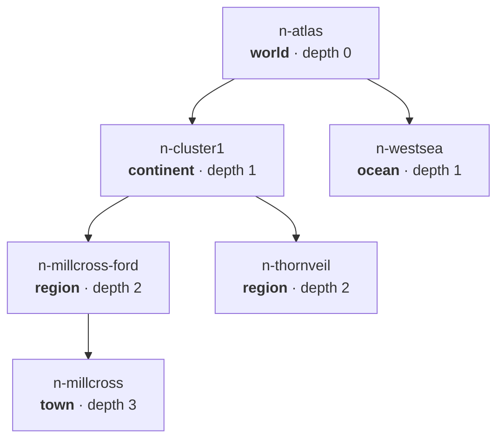

# Tier spine — what the map problem actually looks like

**Where this came from.** The map reads as a region rather than a world. A thirteen-agent design
pass produced a full tier-spine design (**World → Continent → Region → Town**, one recursive node
shape). This page is the picture version of what it found and what building it would mean.

<div class="callout info">
Every number on this page was <strong>recomputed directly from <code>content/maps/cluster1-geography.json</code></strong>
at 1 km raster resolution — not taken from the design document. The drawing below is generated from
the same polygons the shipped map is drawn from.
</div>

---

## 1. The problem, in one picture

Green and blue are the twelve child polygons that exist. **Red is ground no child claims. Amber is
ground two children both claim.**

<div style="max-width:760px;margin:1.2rem auto">
<svg viewBox="0 0 652 854" xmlns="http://www.w3.org/2000/svg" role="img" aria-label="Cluster 1 zone coverage: gaps and overlaps">
<style>
 .sheet{fill:#11151c;stroke:#3a4657;stroke-width:1.5}
 .gap{fill:#c8442e;opacity:.30}
 .over{fill:#f2b134;opacity:.85}
 .zone{fill:#2f6f57;fill-opacity:.42;stroke:#8fd6b4;stroke-width:1.1}
 .aux{fill:#3d5a80;fill-opacity:.45;stroke:#9ec5e8;stroke-width:1.1}
 .town{fill:#f5f0e1;stroke:#11151c;stroke-width:1}
 .lbl{fill:#cfd8e3;font:9px ui-monospace,monospace}
 .ttl{fill:#f5f0e1;font:600 14px ui-sans-serif,system-ui}
</style>
<rect class="sheet" x="26" y="40" width="600" height="760"/>
<g><rect class="gap" x="26.0" y="40.0" width="108.0" height="4"/><rect class="gap" x="250.0" y="40.0" width="20.0" height="4"/><rect class="gap" x="558.0" y="40.0" width="68.0" height="4"/><rect class="gap" x="26.0" y="44.0" width="108.0" height="4"/><rect class="gap" x="250.0" y="44.0" width="20.0" height="4"/><rect class="gap" x="562.0" y="44.0" width="64.0" height="4"/><rect class="gap" x="26.0" y="48.0" width="104.0" height="4"/><rect class="gap" x="254.0" y="48.0" width="16.0" height="4"/><rect class="gap" x="566.0" y="48.0" width="60.0" height="4"/><rect class="gap" x="26.0" y="52.0" width="104.0" height="4"/><rect class="gap" x="254.0" y="52.0" width="20.0" height="4"/><rect class="gap" x="570.0" y="52.0" width="56.0" height="4"/><rect class="gap" x="26.0" y="56.0" width="104.0" height="4"/><rect class="gap" x="254.0" y="56.0" width="20.0" height="4"/><rect class="gap" x="574.0" y="56.0" width="52.0" height="4"/><rect class="gap" x="26.0" y="60.0" width="104.0" height="4"/><rect class="gap" x="254.0" y="60.0" width="20.0" height="4"/><rect class="gap" x="578.0" y="60.0" width="48.0" height="4"/><rect class="gap" x="26.0" y="64.0" width="104.0" height="4"/><rect class="gap" x="254.0" y="64.0" width="20.0" height="4"/><rect class="gap" x="582.0" y="64.0" width="44.0" height="4"/><rect class="gap" x="26.0" y="68.0" width="100.0" height="4"/><rect class="gap" x="258.0" y="68.0" width="16.0" height="4"/><rect class="gap" x="590.0" y="68.0" width="36.0" height="4"/><rect class="gap" x="26.0" y="72.0" width="100.0" height="4"/><rect class="gap" x="258.0" y="72.0" width="20.0" height="4"/><rect class="gap" x="594.0" y="72.0" width="32.0" height="4"/><rect class="gap" x="26.0" y="76.0" width="100.0" height="4"/><rect class="gap" x="258.0" y="76.0" width="20.0" height="4"/><rect class="gap" x="598.0" y="76.0" width="28.0" height="4"/><rect class="gap" x="26.0" y="80.0" width="100.0" height="4"/><rect class="gap" x="258.0" y="80.0" width="20.0" height="4"/><rect class="gap" x="602.0" y="80.0" width="24.0" height="4"/><rect class="gap" x="26.0" y="84.0" width="100.0" height="4"/><rect class="gap" x="258.0" y="84.0" width="20.0" height="4"/><rect class="gap" x="606.0" y="84.0" width="20.0" height="4"/><rect class="gap" x="26.0" y="88.0" width="100.0" height="4"/><rect class="gap" x="262.0" y="88.0" width="16.0" height="4"/><rect class="gap" x="610.0" y="88.0" width="16.0" height="4"/><rect class="gap" x="26.0" y="92.0" width="100.0" height="4"/><rect class="gap" x="262.0" y="92.0" width="20.0" height="4"/><rect class="gap" x="614.0" y="92.0" width="12.0" height="4"/><rect class="gap" x="26.0" y="96.0" width="100.0" height="4"/><rect class="gap" x="262.0" y="96.0" width="20.0" height="4"/><rect class="gap" x="618.0" y="96.0" width="8.0" height="4"/><rect class="gap" x="26.0" y="100.0" width="100.0" height="4"/><rect class="gap" x="262.0" y="100.0" width="20.0" height="4"/><rect class="gap" x="614.0" y="100.0" width="12.0" height="4"/><rect class="gap" x="26.0" y="104.0" width="100.0" height="4"/><rect class="gap" x="258.0" y="104.0" width="24.0" height="4"/><rect class="gap" x="614.0" y="104.0" width="12.0" height="4"/><rect class="gap" x="26.0" y="108.0" width="100.0" height="4"/><rect class="gap" x="258.0" y="108.0" width="24.0" height="4"/><rect class="gap" x="614.0" y="108.0" width="12.0" height="4"/><rect class="gap" x="26.0" y="112.0" width="104.0" height="4"/><rect class="gap" x="258.0" y="112.0" width="28.0" height="4"/><rect class="gap" x="610.0" y="112.0" width="16.0" height="4"/><rect class="gap" x="26.0" y="116.0" width="104.0" height="4"/><rect class="gap" x="254.0" y="116.0" width="32.0" height="4"/><rect class="gap" x="610.0" y="116.0" width="16.0" height="4"/><rect class="gap" x="26.0" y="120.0" width="104.0" height="4"/><rect class="gap" x="254.0" y="120.0" width="36.0" height="4"/><rect class="gap" x="606.0" y="120.0" width="20.0" height="4"/><rect class="gap" x="26.0" y="124.0" width="104.0" height="4"/><rect class="gap" x="254.0" y="124.0" width="40.0" height="4"/><rect class="gap" x="606.0" y="124.0" width="20.0" height="4"/><rect class="gap" x="26.0" y="128.0" width="104.0" height="4"/><rect class="gap" x="250.0" y="128.0" width="52.0" height="4"/><rect class="gap" x="606.0" y="128.0" width="20.0" height="4"/><rect class="gap" x="26.0" y="132.0" width="104.0" height="4"/><rect class="gap" x="250.0" y="132.0" width="56.0" height="4"/><rect class="gap" x="602.0" y="132.0" width="24.0" height="4"/><rect class="gap" x="26.0" y="136.0" width="104.0" height="4"/><rect class="gap" x="250.0" y="136.0" width="64.0" height="4"/><rect class="gap" x="602.0" y="136.0" width="24.0" height="4"/><rect class="gap" x="26.0" y="140.0" width="108.0" height="4"/><rect class="gap" x="250.0" y="140.0" width="68.0" height="4"/><rect class="gap" x="598.0" y="140.0" width="28.0" height="4"/><rect class="gap" x="26.0" y="144.0" width="112.0" height="4"/><rect class="gap" x="246.0" y="144.0" width="76.0" height="4"/><rect class="gap" x="598.0" y="144.0" width="28.0" height="4"/><rect class="gap" x="26.0" y="148.0" width="116.0" height="4"/><rect class="gap" x="246.0" y="148.0" width="84.0" height="4"/><rect class="gap" x="598.0" y="148.0" width="28.0" height="4"/><rect class="gap" x="26.0" y="152.0" width="120.0" height="4"/><rect class="gap" x="246.0" y="152.0" width="88.0" height="4"/><rect class="gap" x="594.0" y="152.0" width="32.0" height="4"/><rect class="gap" x="26.0" y="156.0" width="128.0" height="4"/><rect class="gap" x="242.0" y="156.0" width="100.0" height="4"/><rect class="gap" x="594.0" y="156.0" width="32.0" height="4"/><rect class="gap" x="26.0" y="160.0" width="132.0" height="4"/><rect class="gap" x="242.0" y="160.0" width="104.0" height="4"/><rect class="gap" x="590.0" y="160.0" width="36.0" height="4"/><rect class="gap" x="26.0" y="164.0" width="136.0" height="4"/><rect class="gap" x="238.0" y="164.0" width="116.0" height="4"/><rect class="gap" x="590.0" y="164.0" width="36.0" height="4"/><rect class="gap" x="26.0" y="168.0" width="144.0" height="4"/><rect class="gap" x="226.0" y="168.0" width="132.0" height="4"/><rect class="gap" x="590.0" y="168.0" width="36.0" height="4"/><rect class="gap" x="26.0" y="172.0" width="148.0" height="4"/><rect class="gap" x="214.0" y="172.0" width="156.0" height="4"/><rect class="gap" x="586.0" y="172.0" width="40.0" height="4"/><rect class="gap" x="26.0" y="176.0" width="152.0" height="4"/><rect class="gap" x="202.0" y="176.0" width="184.0" height="4"/><rect class="gap" x="574.0" y="176.0" width="52.0" height="4"/><rect class="gap" x="26.0" y="180.0" width="156.0" height="4"/><rect class="gap" x="190.0" y="180.0" width="216.0" height="4"/><rect class="gap" x="550.0" y="180.0" width="76.0" height="4"/><rect class="gap" x="26.0" y="184.0" width="396.0" height="4"/><rect class="gap" x="526.0" y="184.0" width="100.0" height="4"/><rect class="gap" x="26.0" y="188.0" width="412.0" height="4"/><rect class="gap" x="502.0" y="188.0" width="124.0" height="4"/><rect class="gap" x="26.0" y="192.0" width="432.0" height="4"/><rect class="gap" x="478.0" y="192.0" width="148.0" height="4"/><rect class="gap" x="26.0" y="196.0" width="600.0" height="4"/><rect class="gap" x="26.0" y="200.0" width="600.0" height="4"/><rect class="gap" x="26.0" y="204.0" width="600.0" height="4"/><rect class="gap" x="26.0" y="208.0" width="260.0" height="4"/><rect class="gap" x="314.0" y="208.0" width="312.0" height="4"/><rect class="gap" x="26.0" y="212.0" width="208.0" height="4"/><rect class="gap" x="314.0" y="212.0" width="312.0" height="4"/><rect class="gap" x="26.0" y="216.0" width="184.0" height="4"/><rect class="gap" x="318.0" y="216.0" width="308.0" height="4"/><rect class="gap" x="26.0" y="220.0" width="184.0" height="4"/><rect class="gap" x="318.0" y="220.0" width="308.0" height="4"/><rect class="gap" x="26.0" y="224.0" width="180.0" height="4"/><rect class="gap" x="318.0" y="224.0" width="308.0" height="4"/><rect class="gap" x="26.0" y="228.0" width="180.0" height="4"/><rect class="gap" x="322.0" y="228.0" width="304.0" height="4"/><rect class="gap" x="26.0" y="232.0" width="180.0" height="4"/><rect class="gap" x="322.0" y="232.0" width="304.0" height="4"/><rect class="gap" x="26.0" y="236.0" width="176.0" height="4"/><rect class="gap" x="322.0" y="236.0" width="304.0" height="4"/><rect class="gap" x="26.0" y="240.0" width="176.0" height="4"/><rect class="gap" x="326.0" y="240.0" width="224.0" height="4"/><rect class="gap" x="558.0" y="240.0" width="68.0" height="4"/><rect class="gap" x="26.0" y="244.0" width="176.0" height="4"/><rect class="gap" x="326.0" y="244.0" width="216.0" height="4"/><rect class="gap" x="562.0" y="244.0" width="64.0" height="4"/><rect class="gap" x="26.0" y="248.0" width="176.0" height="4"/><rect class="gap" x="326.0" y="248.0" width="204.0" height="4"/><rect class="gap" x="570.0" y="248.0" width="56.0" height="4"/><rect class="gap" x="26.0" y="252.0" width="172.0" height="4"/><rect class="gap" x="330.0" y="252.0" width="192.0" height="4"/><rect class="gap" x="578.0" y="252.0" width="48.0" height="4"/><rect class="gap" x="26.0" y="256.0" width="172.0" height="4"/><rect class="gap" x="330.0" y="256.0" width="184.0" height="4"/><rect class="gap" x="582.0" y="256.0" width="44.0" height="4"/><rect class="gap" x="26.0" y="260.0" width="172.0" height="4"/><rect class="gap" x="330.0" y="260.0" width="176.0" height="4"/><rect class="gap" x="590.0" y="260.0" width="36.0" height="4"/><rect class="gap" x="26.0" y="264.0" width="168.0" height="4"/><rect class="gap" x="334.0" y="264.0" width="160.0" height="4"/><rect class="gap" x="594.0" y="264.0" width="32.0" height="4"/><rect class="gap" x="26.0" y="268.0" width="168.0" height="4"/><rect class="gap" x="334.0" y="268.0" width="152.0" height="4"/><rect class="gap" x="602.0" y="268.0" width="24.0" height="4"/><rect class="gap" x="26.0" y="272.0" width="168.0" height="4"/><rect class="gap" x="334.0" y="272.0" width="148.0" height="4"/><rect class="gap" x="610.0" y="272.0" width="16.0" height="4"/><rect class="gap" x="26.0" y="276.0" width="168.0" height="4"/><rect class="gap" x="338.0" y="276.0" width="144.0" height="4"/><rect class="gap" x="614.0" y="276.0" width="12.0" height="4"/><rect class="gap" x="26.0" y="280.0" width="168.0" height="4"/><rect class="gap" x="338.0" y="280.0" width="144.0" height="4"/><rect class="gap" x="618.0" y="280.0" width="8.0" height="4"/><rect class="gap" x="26.0" y="284.0" width="168.0" height="4"/><rect class="gap" x="338.0" y="284.0" width="144.0" height="4"/><rect class="gap" x="618.0" y="284.0" width="8.0" height="4"/><rect class="gap" x="26.0" y="288.0" width="168.0" height="4"/><rect class="gap" x="338.0" y="288.0" width="144.0" height="4"/><rect class="gap" x="618.0" y="288.0" width="8.0" height="4"/><rect class="gap" x="26.0" y="292.0" width="168.0" height="4"/><rect class="gap" x="338.0" y="292.0" width="144.0" height="4"/><rect class="gap" x="618.0" y="292.0" width="8.0" height="4"/><rect class="gap" x="26.0" y="296.0" width="168.0" height="4"/><rect class="gap" x="338.0" y="296.0" width="144.0" height="4"/><rect class="gap" x="618.0" y="296.0" width="8.0" height="4"/><rect class="gap" x="26.0" y="300.0" width="168.0" height="4"/><rect class="gap" x="338.0" y="300.0" width="144.0" height="4"/><rect class="gap" x="618.0" y="300.0" width="8.0" height="4"/><rect class="gap" x="26.0" y="304.0" width="168.0" height="4"/><rect class="gap" x="334.0" y="304.0" width="148.0" height="4"/><rect class="gap" x="618.0" y="304.0" width="8.0" height="4"/><rect class="gap" x="26.0" y="308.0" width="168.0" height="4"/><rect class="gap" x="334.0" y="308.0" width="148.0" height="4"/><rect class="gap" x="618.0" y="308.0" width="8.0" height="4"/><rect class="gap" x="26.0" y="312.0" width="168.0" height="4"/><rect class="gap" x="334.0" y="312.0" width="4.0" height="4"/><rect class="gap" x="350.0" y="312.0" width="132.0" height="4"/><rect class="gap" x="618.0" y="312.0" width="8.0" height="4"/><rect class="gap" x="26.0" y="316.0" width="168.0" height="4"/><rect class="gap" x="354.0" y="316.0" width="128.0" height="4"/><rect class="gap" x="618.0" y="316.0" width="8.0" height="4"/><rect class="gap" x="26.0" y="320.0" width="168.0" height="4"/><rect class="gap" x="362.0" y="320.0" width="120.0" height="4"/><rect class="gap" x="618.0" y="320.0" width="8.0" height="4"/><rect class="gap" x="26.0" y="324.0" width="168.0" height="4"/><rect class="gap" x="366.0" y="324.0" width="112.0" height="4"/><rect class="gap" x="618.0" y="324.0" width="8.0" height="4"/><rect class="gap" x="26.0" y="328.0" width="168.0" height="4"/><rect class="gap" x="374.0" y="328.0" width="104.0" height="4"/><rect class="gap" x="618.0" y="328.0" width="8.0" height="4"/><rect class="gap" x="26.0" y="332.0" width="156.0" height="4"/><rect class="gap" x="378.0" y="332.0" width="100.0" height="4"/><rect class="gap" x="618.0" y="332.0" width="8.0" height="4"/><rect class="gap" x="26.0" y="336.0" width="144.0" height="4"/><rect class="gap" x="386.0" y="336.0" width="92.0" height="4"/><rect class="gap" x="618.0" y="336.0" width="8.0" height="4"/><rect class="gap" x="26.0" y="340.0" width="132.0" height="4"/><rect class="gap" x="390.0" y="340.0" width="88.0" height="4"/><rect class="gap" x="618.0" y="340.0" width="8.0" height="4"/><rect class="gap" x="26.0" y="344.0" width="120.0" height="4"/><rect class="gap" x="394.0" y="344.0" width="84.0" height="4"/><rect class="gap" x="618.0" y="344.0" width="8.0" height="4"/><rect class="gap" x="26.0" y="348.0" width="108.0" height="4"/><rect class="gap" x="394.0" y="348.0" width="84.0" height="4"/><rect class="gap" x="618.0" y="348.0" width="8.0" height="4"/><rect class="gap" x="26.0" y="352.0" width="104.0" height="4"/><rect class="gap" x="394.0" y="352.0" width="28.0" height="4"/><rect class="gap" x="430.0" y="352.0" width="48.0" height="4"/><rect class="gap" x="618.0" y="352.0" width="8.0" height="4"/><rect class="gap" x="26.0" y="356.0" width="104.0" height="4"/><rect class="gap" x="394.0" y="356.0" width="20.0" height="4"/><rect class="gap" x="438.0" y="356.0" width="40.0" height="4"/><rect class="gap" x="618.0" y="356.0" width="8.0" height="4"/><rect class="gap" x="26.0" y="360.0" width="100.0" height="4"/><rect class="gap" x="394.0" y="360.0" width="12.0" height="4"/><rect class="gap" x="446.0" y="360.0" width="32.0" height="4"/><rect class="gap" x="618.0" y="360.0" width="8.0" height="4"/><rect class="gap" x="26.0" y="364.0" width="100.0" height="4"/><rect class="gap" x="390.0" y="364.0" width="8.0" height="4"/><rect class="gap" x="454.0" y="364.0" width="24.0" height="4"/><rect class="gap" x="618.0" y="364.0" width="8.0" height="4"/><rect class="gap" x="26.0" y="368.0" width="100.0" height="4"/><rect class="gap" x="462.0" y="368.0" width="16.0" height="4"/><rect class="gap" x="618.0" y="368.0" width="8.0" height="4"/><rect class="gap" x="26.0" y="372.0" width="96.0" height="4"/><rect class="gap" x="470.0" y="372.0" width="8.0" height="4"/><rect class="gap" x="618.0" y="372.0" width="8.0" height="4"/><rect class="gap" x="26.0" y="376.0" width="96.0" height="4"/><rect class="gap" x="474.0" y="376.0" width="4.0" height="4"/><rect class="gap" x="618.0" y="376.0" width="8.0" height="4"/><rect class="gap" x="26.0" y="380.0" width="96.0" height="4"/><rect class="gap" x="474.0" y="380.0" width="8.0" height="4"/><rect class="gap" x="618.0" y="380.0" width="8.0" height="4"/><rect class="gap" x="26.0" y="384.0" width="96.0" height="4"/><rect class="gap" x="474.0" y="384.0" width="12.0" height="4"/><rect class="gap" x="618.0" y="384.0" width="8.0" height="4"/><rect class="gap" x="26.0" y="388.0" width="92.0" height="4"/><rect class="gap" x="474.0" y="388.0" width="12.0" height="4"/><rect class="gap" x="618.0" y="388.0" width="8.0" height="4"/><rect class="gap" x="26.0" y="392.0" width="92.0" height="4"/><rect class="gap" x="478.0" y="392.0" width="12.0" height="4"/><rect class="gap" x="618.0" y="392.0" width="8.0" height="4"/><rect class="gap" x="26.0" y="396.0" width="92.0" height="4"/><rect class="gap" x="478.0" y="396.0" width="16.0" height="4"/><rect class="gap" x="618.0" y="396.0" width="8.0" height="4"/><rect class="gap" x="26.0" y="400.0" width="88.0" height="4"/><rect class="gap" x="478.0" y="400.0" width="16.0" height="4"/><rect class="gap" x="618.0" y="400.0" width="8.0" height="4"/><rect class="gap" x="26.0" y="404.0" width="88.0" height="4"/><rect class="gap" x="478.0" y="404.0" width="20.0" height="4"/><rect class="gap" x="618.0" y="404.0" width="8.0" height="4"/><rect class="gap" x="26.0" y="408.0" width="88.0" height="4"/><rect class="gap" x="478.0" y="408.0" width="24.0" height="4"/><rect class="gap" x="618.0" y="408.0" width="8.0" height="4"/><rect class="gap" x="26.0" y="412.0" width="92.0" height="4"/><rect class="gap" x="478.0" y="412.0" width="28.0" height="4"/><rect class="gap" x="618.0" y="412.0" width="8.0" height="4"/><rect class="gap" x="26.0" y="416.0" width="92.0" height="4"/><rect class="gap" x="478.0" y="416.0" width="28.0" height="4"/><rect class="gap" x="618.0" y="416.0" width="8.0" height="4"/><rect class="gap" x="26.0" y="420.0" width="92.0" height="4"/><rect class="gap" x="246.0" y="420.0" width="28.0" height="4"/><rect class="gap" x="482.0" y="420.0" width="28.0" height="4"/><rect class="gap" x="618.0" y="420.0" width="8.0" height="4"/><rect class="gap" x="26.0" y="424.0" width="96.0" height="4"/><rect class="gap" x="246.0" y="424.0" width="28.0" height="4"/><rect class="gap" x="482.0" y="424.0" width="32.0" height="4"/><rect class="gap" x="614.0" y="424.0" width="12.0" height="4"/><rect class="gap" x="26.0" y="428.0" width="96.0" height="4"/><rect class="gap" x="242.0" y="428.0" width="36.0" height="4"/><rect class="gap" x="482.0" y="428.0" width="32.0" height="4"/><rect class="gap" x="610.0" y="428.0" width="16.0" height="4"/><rect class="gap" x="26.0" y="432.0" width="100.0" height="4"/><rect class="gap" x="242.0" y="432.0" width="36.0" height="4"/><rect class="gap" x="482.0" y="432.0" width="36.0" height="4"/><rect class="gap" x="606.0" y="432.0" width="20.0" height="4"/><rect class="gap" x="26.0" y="436.0" width="100.0" height="4"/><rect class="gap" x="242.0" y="436.0" width="40.0" height="4"/><rect class="gap" x="370.0" y="436.0" width="4.0" height="4"/><rect class="gap" x="478.0" y="436.0" width="44.0" height="4"/><rect class="gap" x="602.0" y="436.0" width="24.0" height="4"/><rect class="gap" x="26.0" y="440.0" width="104.0" height="4"/><rect class="gap" x="242.0" y="440.0" width="44.0" height="4"/><rect class="gap" x="366.0" y="440.0" width="12.0" height="4"/><rect class="gap" x="474.0" y="440.0" width="52.0" height="4"/><rect class="gap" x="598.0" y="440.0" width="28.0" height="4"/><rect class="gap" x="26.0" y="444.0" width="104.0" height="4"/><rect class="gap" x="242.0" y="444.0" width="52.0" height="4"/><rect class="gap" x="358.0" y="444.0" width="20.0" height="4"/><rect class="gap" x="474.0" y="444.0" width="60.0" height="4"/><rect class="gap" x="594.0" y="444.0" width="32.0" height="4"/><rect class="gap" x="26.0" y="448.0" width="104.0" height="4"/><rect class="gap" x="238.0" y="448.0" width="68.0" height="4"/><rect class="gap" x="354.0" y="448.0" width="28.0" height="4"/><rect class="gap" x="470.0" y="448.0" width="76.0" height="4"/><rect class="gap" x="590.0" y="448.0" width="36.0" height="4"/><rect class="gap" x="26.0" y="452.0" width="108.0" height="4"/><rect class="gap" x="234.0" y="452.0" width="80.0" height="4"/><rect class="gap" x="350.0" y="452.0" width="36.0" height="4"/><rect class="gap" x="466.0" y="452.0" width="88.0" height="4"/><rect class="gap" x="586.0" y="452.0" width="40.0" height="4"/><rect class="gap" x="26.0" y="456.0" width="108.0" height="4"/><rect class="gap" x="230.0" y="456.0" width="92.0" height="4"/><rect class="gap" x="346.0" y="456.0" width="40.0" height="4"/><rect class="gap" x="466.0" y="456.0" width="52.0" height="4"/><rect class="gap" x="534.0" y="456.0" width="28.0" height="4"/><rect class="gap" x="582.0" y="456.0" width="44.0" height="4"/><rect class="gap" x="26.0" y="460.0" width="112.0" height="4"/><rect class="gap" x="226.0" y="460.0" width="108.0" height="4"/><rect class="gap" x="342.0" y="460.0" width="48.0" height="4"/><rect class="gap" x="462.0" y="460.0" width="36.0" height="4"/><rect class="gap" x="538.0" y="460.0" width="36.0" height="4"/><rect class="gap" x="578.0" y="460.0" width="48.0" height="4"/><rect class="gap" x="26.0" y="464.0" width="116.0" height="4"/><rect class="gap" x="222.0" y="464.0" width="164.0" height="4"/><rect class="gap" x="458.0" y="464.0" width="16.0" height="4"/><rect class="gap" x="542.0" y="464.0" width="84.0" height="4"/><rect class="gap" x="26.0" y="468.0" width="124.0" height="4"/><rect class="gap" x="214.0" y="468.0" width="152.0" height="4"/><rect class="gap" x="546.0" y="468.0" width="80.0" height="4"/><rect class="gap" x="26.0" y="472.0" width="136.0" height="4"/><rect class="gap" x="210.0" y="472.0" width="140.0" height="4"/><rect class="gap" x="550.0" y="472.0" width="76.0" height="4"/><rect class="gap" x="26.0" y="476.0" width="144.0" height="4"/><rect class="gap" x="206.0" y="476.0" width="124.0" height="4"/><rect class="gap" x="554.0" y="476.0" width="72.0" height="4"/><rect class="gap" x="26.0" y="480.0" width="152.0" height="4"/><rect class="gap" x="202.0" y="480.0" width="120.0" height="4"/><rect class="gap" x="410.0" y="480.0" width="32.0" height="4"/><rect class="gap" x="562.0" y="480.0" width="64.0" height="4"/><rect class="gap" x="26.0" y="484.0" width="164.0" height="4"/><rect class="gap" x="198.0" y="484.0" width="124.0" height="4"/><rect class="gap" x="410.0" y="484.0" width="32.0" height="4"/><rect class="gap" x="566.0" y="484.0" width="60.0" height="4"/><rect class="gap" x="26.0" y="488.0" width="296.0" height="4"/><rect class="gap" x="414.0" y="488.0" width="28.0" height="4"/><rect class="gap" x="570.0" y="488.0" width="56.0" height="4"/><rect class="gap" x="26.0" y="492.0" width="296.0" height="4"/><rect class="gap" x="418.0" y="492.0" width="24.0" height="4"/><rect class="gap" x="574.0" y="492.0" width="52.0" height="4"/><rect class="gap" x="26.0" y="496.0" width="292.0" height="4"/><rect class="gap" x="422.0" y="496.0" width="20.0" height="4"/><rect class="gap" x="578.0" y="496.0" width="48.0" height="4"/><rect class="gap" x="26.0" y="500.0" width="292.0" height="4"/><rect class="gap" x="426.0" y="500.0" width="16.0" height="4"/><rect class="gap" x="582.0" y="500.0" width="44.0" height="4"/><rect class="gap" x="26.0" y="504.0" width="292.0" height="4"/><rect class="gap" x="426.0" y="504.0" width="16.0" height="4"/><rect class="gap" x="586.0" y="504.0" width="40.0" height="4"/><rect class="gap" x="26.0" y="508.0" width="292.0" height="4"/><rect class="gap" x="426.0" y="508.0" width="16.0" height="4"/><rect class="gap" x="586.0" y="508.0" width="40.0" height="4"/><rect class="gap" x="26.0" y="512.0" width="292.0" height="4"/><rect class="gap" x="426.0" y="512.0" width="16.0" height="4"/><rect class="gap" x="586.0" y="512.0" width="40.0" height="4"/><rect class="gap" x="26.0" y="516.0" width="292.0" height="4"/><rect class="gap" x="426.0" y="516.0" width="16.0" height="4"/><rect class="gap" x="586.0" y="516.0" width="40.0" height="4"/><rect class="gap" x="26.0" y="520.0" width="292.0" height="4"/><rect class="gap" x="422.0" y="520.0" width="20.0" height="4"/><rect class="gap" x="586.0" y="520.0" width="40.0" height="4"/><rect class="gap" x="26.0" y="524.0" width="292.0" height="4"/><rect class="gap" x="422.0" y="524.0" width="20.0" height="4"/><rect class="gap" x="586.0" y="524.0" width="40.0" height="4"/><rect class="gap" x="26.0" y="528.0" width="292.0" height="4"/><rect class="gap" x="422.0" y="528.0" width="20.0" height="4"/><rect class="gap" x="590.0" y="528.0" width="36.0" height="4"/><rect class="gap" x="26.0" y="532.0" width="288.0" height="4"/><rect class="gap" x="422.0" y="532.0" width="20.0" height="4"/><rect class="gap" x="590.0" y="532.0" width="36.0" height="4"/><rect class="gap" x="26.0" y="536.0" width="288.0" height="4"/><rect class="gap" x="422.0" y="536.0" width="20.0" height="4"/><rect class="gap" x="590.0" y="536.0" width="36.0" height="4"/><rect class="gap" x="26.0" y="540.0" width="288.0" height="4"/><rect class="gap" x="422.0" y="540.0" width="20.0" height="4"/><rect class="gap" x="590.0" y="540.0" width="36.0" height="4"/><rect class="gap" x="26.0" y="544.0" width="288.0" height="4"/><rect class="gap" x="422.0" y="544.0" width="20.0" height="4"/><rect class="gap" x="590.0" y="544.0" width="36.0" height="4"/><rect class="gap" x="26.0" y="548.0" width="288.0" height="4"/><rect class="gap" x="422.0" y="548.0" width="20.0" height="4"/><rect class="gap" x="590.0" y="548.0" width="36.0" height="4"/><rect class="gap" x="26.0" y="552.0" width="292.0" height="4"/><rect class="gap" x="418.0" y="552.0" width="24.0" height="4"/><rect class="gap" x="590.0" y="552.0" width="36.0" height="4"/><rect class="gap" x="26.0" y="556.0" width="296.0" height="4"/><rect class="gap" x="418.0" y="556.0" width="24.0" height="4"/><rect class="gap" x="590.0" y="556.0" width="36.0" height="4"/><rect class="gap" x="26.0" y="560.0" width="300.0" height="4"/><rect class="gap" x="418.0" y="560.0" width="24.0" height="4"/><rect class="gap" x="590.0" y="560.0" width="36.0" height="4"/><rect class="gap" x="26.0" y="564.0" width="304.0" height="4"/><rect class="gap" x="418.0" y="564.0" width="24.0" height="4"/><rect class="gap" x="590.0" y="564.0" width="36.0" height="4"/><rect class="gap" x="26.0" y="568.0" width="308.0" height="4"/><rect class="gap" x="414.0" y="568.0" width="28.0" height="4"/><rect class="gap" x="590.0" y="568.0" width="36.0" height="4"/><rect class="gap" x="26.0" y="572.0" width="316.0" height="4"/><rect class="gap" x="402.0" y="572.0" width="40.0" height="4"/><rect class="gap" x="590.0" y="572.0" width="36.0" height="4"/><rect class="gap" x="26.0" y="576.0" width="320.0" height="4"/><rect class="gap" x="402.0" y="576.0" width="40.0" height="4"/><rect class="gap" x="594.0" y="576.0" width="32.0" height="4"/><rect class="gap" x="26.0" y="580.0" width="308.0" height="4"/><rect class="gap" x="406.0" y="580.0" width="36.0" height="4"/><rect class="gap" x="594.0" y="580.0" width="32.0" height="4"/><rect class="gap" x="26.0" y="584.0" width="288.0" height="4"/><rect class="gap" x="406.0" y="584.0" width="36.0" height="4"/><rect class="gap" x="594.0" y="584.0" width="32.0" height="4"/><rect class="gap" x="26.0" y="588.0" width="284.0" height="4"/><rect class="gap" x="406.0" y="588.0" width="36.0" height="4"/><rect class="gap" x="594.0" y="588.0" width="32.0" height="4"/><rect class="gap" x="26.0" y="592.0" width="280.0" height="4"/><rect class="gap" x="410.0" y="592.0" width="32.0" height="4"/><rect class="gap" x="594.0" y="592.0" width="32.0" height="4"/><rect class="gap" x="26.0" y="596.0" width="280.0" height="4"/><rect class="gap" x="410.0" y="596.0" width="36.0" height="4"/><rect class="gap" x="594.0" y="596.0" width="32.0" height="4"/><rect class="gap" x="26.0" y="600.0" width="60.0" height="4"/><rect class="gap" x="106.0" y="600.0" width="196.0" height="4"/><rect class="gap" x="414.0" y="600.0" width="32.0" height="4"/><rect class="gap" x="594.0" y="600.0" width="32.0" height="4"/><rect class="gap" x="26.0" y="604.0" width="24.0" height="4"/><rect class="gap" x="110.0" y="604.0" width="192.0" height="4"/><rect class="gap" x="414.0" y="604.0" width="36.0" height="4"/><rect class="gap" x="590.0" y="604.0" width="36.0" height="4"/><rect class="gap" x="26.0" y="608.0" width="8.0" height="4"/><rect class="gap" x="114.0" y="608.0" width="184.0" height="4"/><rect class="gap" x="418.0" y="608.0" width="32.0" height="4"/><rect class="gap" x="586.0" y="608.0" width="40.0" height="4"/><rect class="gap" x="26.0" y="612.0" width="8.0" height="4"/><rect class="gap" x="118.0" y="612.0" width="176.0" height="4"/><rect class="gap" x="418.0" y="612.0" width="32.0" height="4"/><rect class="gap" x="586.0" y="612.0" width="40.0" height="4"/><rect class="gap" x="26.0" y="616.0" width="8.0" height="4"/><rect class="gap" x="122.0" y="616.0" width="172.0" height="4"/><rect class="gap" x="418.0" y="616.0" width="36.0" height="4"/><rect class="gap" x="582.0" y="616.0" width="44.0" height="4"/><rect class="gap" x="26.0" y="620.0" width="8.0" height="4"/><rect class="gap" x="126.0" y="620.0" width="164.0" height="4"/><rect class="gap" x="422.0" y="620.0" width="32.0" height="4"/><rect class="gap" x="578.0" y="620.0" width="48.0" height="4"/><rect class="gap" x="26.0" y="624.0" width="8.0" height="4"/><rect class="gap" x="126.0" y="624.0" width="164.0" height="4"/><rect class="gap" x="422.0" y="624.0" width="36.0" height="4"/><rect class="gap" x="578.0" y="624.0" width="48.0" height="4"/><rect class="gap" x="26.0" y="628.0" width="8.0" height="4"/><rect class="gap" x="130.0" y="628.0" width="160.0" height="4"/><rect class="gap" x="426.0" y="628.0" width="32.0" height="4"/><rect class="gap" x="574.0" y="628.0" width="52.0" height="4"/><rect class="gap" x="26.0" y="632.0" width="8.0" height="4"/><rect class="gap" x="134.0" y="632.0" width="156.0" height="4"/><rect class="gap" x="426.0" y="632.0" width="36.0" height="4"/><rect class="gap" x="570.0" y="632.0" width="56.0" height="4"/><rect class="gap" x="26.0" y="636.0" width="8.0" height="4"/><rect class="gap" x="138.0" y="636.0" width="152.0" height="4"/><rect class="gap" x="426.0" y="636.0" width="36.0" height="4"/><rect class="gap" x="570.0" y="636.0" width="56.0" height="4"/><rect class="gap" x="26.0" y="640.0" width="8.0" height="4"/><rect class="gap" x="142.0" y="640.0" width="148.0" height="4"/><rect class="gap" x="426.0" y="640.0" width="40.0" height="4"/><rect class="gap" x="566.0" y="640.0" width="60.0" height="4"/><rect class="gap" x="26.0" y="644.0" width="8.0" height="4"/><rect class="gap" x="146.0" y="644.0" width="144.0" height="4"/><rect class="gap" x="426.0" y="644.0" width="40.0" height="4"/><rect class="gap" x="562.0" y="644.0" width="64.0" height="4"/><rect class="gap" x="26.0" y="648.0" width="8.0" height="4"/><rect class="gap" x="146.0" y="648.0" width="144.0" height="4"/><rect class="gap" x="422.0" y="648.0" width="44.0" height="4"/><rect class="gap" x="562.0" y="648.0" width="64.0" height="4"/><rect class="gap" x="26.0" y="652.0" width="8.0" height="4"/><rect class="gap" x="146.0" y="652.0" width="144.0" height="4"/><rect class="gap" x="422.0" y="652.0" width="48.0" height="4"/><rect class="gap" x="558.0" y="652.0" width="68.0" height="4"/><rect class="gap" x="26.0" y="656.0" width="8.0" height="4"/><rect class="gap" x="146.0" y="656.0" width="144.0" height="4"/><rect class="gap" x="422.0" y="656.0" width="48.0" height="4"/><rect class="gap" x="554.0" y="656.0" width="72.0" height="4"/><rect class="gap" x="26.0" y="660.0" width="8.0" height="4"/><rect class="gap" x="146.0" y="660.0" width="144.0" height="4"/><rect class="gap" x="422.0" y="660.0" width="52.0" height="4"/><rect class="gap" x="554.0" y="660.0" width="72.0" height="4"/><rect class="gap" x="26.0" y="664.0" width="8.0" height="4"/><rect class="gap" x="142.0" y="664.0" width="148.0" height="4"/><rect class="gap" x="422.0" y="664.0" width="68.0" height="4"/><rect class="gap" x="550.0" y="664.0" width="76.0" height="4"/><rect class="gap" x="26.0" y="668.0" width="8.0" height="4"/><rect class="gap" x="142.0" y="668.0" width="148.0" height="4"/><rect class="gap" x="422.0" y="668.0" width="104.0" height="4"/><rect class="gap" x="546.0" y="668.0" width="80.0" height="4"/><rect class="gap" x="26.0" y="672.0" width="8.0" height="4"/><rect class="gap" x="142.0" y="672.0" width="148.0" height="4"/><rect class="gap" x="422.0" y="672.0" width="204.0" height="4"/><rect class="gap" x="26.0" y="676.0" width="8.0" height="4"/><rect class="gap" x="142.0" y="676.0" width="148.0" height="4"/><rect class="gap" x="422.0" y="676.0" width="204.0" height="4"/><rect class="gap" x="26.0" y="680.0" width="8.0" height="4"/><rect class="gap" x="142.0" y="680.0" width="148.0" height="4"/><rect class="gap" x="422.0" y="680.0" width="204.0" height="4"/><rect class="gap" x="26.0" y="684.0" width="8.0" height="4"/><rect class="gap" x="142.0" y="684.0" width="152.0" height="4"/><rect class="gap" x="418.0" y="684.0" width="208.0" height="4"/><rect class="gap" x="26.0" y="688.0" width="8.0" height="4"/><rect class="gap" x="142.0" y="688.0" width="152.0" height="4"/><rect class="gap" x="418.0" y="688.0" width="208.0" height="4"/><rect class="gap" x="26.0" y="692.0" width="8.0" height="4"/><rect class="gap" x="142.0" y="692.0" width="156.0" height="4"/><rect class="gap" x="418.0" y="692.0" width="208.0" height="4"/><rect class="gap" x="26.0" y="696.0" width="8.0" height="4"/><rect class="gap" x="142.0" y="696.0" width="156.0" height="4"/><rect class="gap" x="418.0" y="696.0" width="208.0" height="4"/><rect class="gap" x="26.0" y="700.0" width="8.0" height="4"/><rect class="gap" x="138.0" y="700.0" width="160.0" height="4"/><rect class="gap" x="418.0" y="700.0" width="208.0" height="4"/><rect class="gap" x="26.0" y="704.0" width="8.0" height="4"/><rect class="gap" x="138.0" y="704.0" width="8.0" height="4"/><rect class="gap" x="174.0" y="704.0" width="84.0" height="4"/><rect class="gap" x="278.0" y="704.0" width="24.0" height="4"/><rect class="gap" x="418.0" y="704.0" width="208.0" height="4"/><rect class="gap" x="26.0" y="708.0" width="8.0" height="4"/><rect class="gap" x="202.0" y="708.0" width="28.0" height="4"/><rect class="gap" x="290.0" y="708.0" width="12.0" height="4"/><rect class="gap" x="414.0" y="708.0" width="212.0" height="4"/><rect class="gap" x="26.0" y="712.0" width="8.0" height="4"/><rect class="gap" x="302.0" y="712.0" width="4.0" height="4"/><rect class="gap" x="410.0" y="712.0" width="216.0" height="4"/><rect class="gap" x="26.0" y="716.0" width="8.0" height="4"/><rect class="gap" x="406.0" y="716.0" width="220.0" height="4"/><rect class="gap" x="26.0" y="720.0" width="8.0" height="4"/><rect class="gap" x="406.0" y="720.0" width="220.0" height="4"/><rect class="gap" x="26.0" y="724.0" width="8.0" height="4"/><rect class="gap" x="402.0" y="724.0" width="224.0" height="4"/><rect class="gap" x="26.0" y="728.0" width="8.0" height="4"/><rect class="gap" x="398.0" y="728.0" width="228.0" height="4"/><rect class="gap" x="26.0" y="732.0" width="8.0" height="4"/><rect class="gap" x="398.0" y="732.0" width="228.0" height="4"/><rect class="gap" x="26.0" y="736.0" width="12.0" height="4"/><rect class="gap" x="394.0" y="736.0" width="232.0" height="4"/><rect class="gap" x="26.0" y="740.0" width="20.0" height="4"/><rect class="gap" x="390.0" y="740.0" width="236.0" height="4"/><rect class="gap" x="26.0" y="744.0" width="28.0" height="4"/><rect class="gap" x="386.0" y="744.0" width="240.0" height="4"/><rect class="gap" x="26.0" y="748.0" width="36.0" height="4"/><rect class="gap" x="386.0" y="748.0" width="240.0" height="4"/><rect class="gap" x="26.0" y="752.0" width="44.0" height="4"/><rect class="gap" x="90.0" y="752.0" width="4.0" height="4"/><rect class="gap" x="382.0" y="752.0" width="244.0" height="4"/><rect class="gap" x="26.0" y="756.0" width="52.0" height="4"/><rect class="gap" x="86.0" y="756.0" width="16.0" height="4"/><rect class="gap" x="378.0" y="756.0" width="248.0" height="4"/><rect class="gap" x="26.0" y="760.0" width="84.0" height="4"/><rect class="gap" x="374.0" y="760.0" width="252.0" height="4"/><rect class="gap" x="26.0" y="764.0" width="92.0" height="4"/><rect class="gap" x="374.0" y="764.0" width="252.0" height="4"/><rect class="gap" x="26.0" y="768.0" width="104.0" height="4"/><rect class="gap" x="374.0" y="768.0" width="252.0" height="4"/><rect class="gap" x="26.0" y="772.0" width="116.0" height="4"/><rect class="gap" x="374.0" y="772.0" width="252.0" height="4"/><rect class="gap" x="26.0" y="776.0" width="132.0" height="4"/><rect class="gap" x="378.0" y="776.0" width="248.0" height="4"/><rect class="gap" x="26.0" y="780.0" width="144.0" height="4"/><rect class="gap" x="378.0" y="780.0" width="248.0" height="4"/><rect class="gap" x="26.0" y="784.0" width="160.0" height="4"/><rect class="gap" x="370.0" y="784.0" width="256.0" height="4"/><rect class="gap" x="26.0" y="788.0" width="180.0" height="4"/><rect class="gap" x="350.0" y="788.0" width="276.0" height="4"/><rect class="gap" x="26.0" y="792.0" width="200.0" height="4"/><rect class="gap" x="334.0" y="792.0" width="292.0" height="4"/><rect class="gap" x="26.0" y="796.0" width="244.0" height="4"/><rect class="gap" x="314.0" y="796.0" width="312.0" height="4"/></g>
<polygon class="zone" points="378.0,376.0 426.0,352.0 474.0,376.0 482.0,432.0 450.0,480.0 402.0,480.0 370.0,432.0"/>
<polygon class="zone" points="322.0,480.0 394.0,464.0 426.0,504.0 418.0,568.0 362.0,592.0 314.0,552.0"/>
<polygon class="zone" points="314.0,584.0 402.0,576.0 426.0,632.0 418.0,704.0 378.0,760.0 322.0,752.0 290.0,680.0 290.0,624.0"/>
<polygon class="zone" points="442.0,472.0 530.0,456.0 586.0,504.0 594.0,600.0 546.0,672.0 474.0,664.0 442.0,592.0"/>
<polygon class="zone" points="130.0,352.0 202.0,328.0 250.0,368.0 242.0,448.0 194.0,488.0 138.0,464.0 114.0,408.0"/>
<polygon class="zone" points="34.0,608.0 106.0,600.0 146.0,648.0 138.0,720.0 82.0,760.0 34.0,736.0"/>
<polygon class="zone" points="274.0,328.0 346.0,312.0 394.0,344.0 386.0,424.0 338.0,464.0 282.0,440.0 258.0,384.0"/>
<polygon class="zone" points="210.0,216.0 314.0,208.0 338.0,280.0 330.0,384.0 290.0,424.0 226.0,416.0 194.0,344.0 194.0,272.0"/>
<polygon class="zone" points="270.0,40.0 410.0,40.0 554.0,40.0 618.0,96.0 586.0,176.0 466.0,196.0 362.0,172.0 286.0,120.0"/>
<polygon class="zone" points="134.0,40.0 250.0,40.0 262.0,96.0 242.0,164.0 186.0,184.0 130.0,140.0 126.0,80.0"/>
<polygon class="aux" points="62.0,728.0 106.0,712.0 162.0,704.0 218.0,712.0 274.0,704.0 322.0,720.0 370.0,744.0 378.0,784.0 306.0,800.0 234.0,796.0 178.0,784.0 122.0,768.0 82.0,748.0"/>
<polygon class="aux" points="482.0,272.0 554.0,240.0 618.0,280.0 618.0,424.0 578.0,464.0 522.0,440.0 478.0,376.0"/>
<g><rect class="over" x="318.0" y="316.0" width="16.0" height="4"/><rect class="over" x="302.0" y="320.0" width="32.0" height="4"/><rect class="over" x="282.0" y="324.0" width="52.0" height="4"/><rect class="over" x="194.0" y="328.0" width="12.0" height="4"/><rect class="over" x="274.0" y="328.0" width="60.0" height="4"/><rect class="over" x="194.0" y="332.0" width="16.0" height="4"/><rect class="over" x="274.0" y="332.0" width="60.0" height="4"/><rect class="over" x="194.0" y="336.0" width="20.0" height="4"/><rect class="over" x="270.0" y="336.0" width="64.0" height="4"/><rect class="over" x="194.0" y="340.0" width="24.0" height="4"/><rect class="over" x="270.0" y="340.0" width="64.0" height="4"/><rect class="over" x="194.0" y="344.0" width="28.0" height="4"/><rect class="over" x="270.0" y="344.0" width="64.0" height="4"/><rect class="over" x="198.0" y="348.0" width="32.0" height="4"/><rect class="over" x="266.0" y="348.0" width="68.0" height="4"/><rect class="over" x="198.0" y="352.0" width="36.0" height="4"/><rect class="over" x="266.0" y="352.0" width="68.0" height="4"/><rect class="over" x="202.0" y="356.0" width="36.0" height="4"/><rect class="over" x="266.0" y="356.0" width="64.0" height="4"/><rect class="over" x="202.0" y="360.0" width="40.0" height="4"/><rect class="over" x="266.0" y="360.0" width="64.0" height="4"/><rect class="over" x="202.0" y="364.0" width="44.0" height="4"/><rect class="over" x="262.0" y="364.0" width="68.0" height="4"/><rect class="over" x="206.0" y="368.0" width="44.0" height="4"/><rect class="over" x="262.0" y="368.0" width="68.0" height="4"/><rect class="over" x="206.0" y="372.0" width="44.0" height="4"/><rect class="over" x="262.0" y="372.0" width="68.0" height="4"/><rect class="over" x="382.0" y="372.0" width="8.0" height="4"/><rect class="over" x="210.0" y="376.0" width="40.0" height="4"/><rect class="over" x="258.0" y="376.0" width="72.0" height="4"/><rect class="over" x="378.0" y="376.0" width="12.0" height="4"/><rect class="over" x="210.0" y="380.0" width="40.0" height="4"/><rect class="over" x="258.0" y="380.0" width="72.0" height="4"/><rect class="over" x="378.0" y="380.0" width="12.0" height="4"/><rect class="over" x="214.0" y="384.0" width="36.0" height="4"/><rect class="over" x="258.0" y="384.0" width="68.0" height="4"/><rect class="over" x="378.0" y="384.0" width="12.0" height="4"/><rect class="over" x="214.0" y="388.0" width="32.0" height="4"/><rect class="over" x="262.0" y="388.0" width="60.0" height="4"/><rect class="over" x="374.0" y="388.0" width="16.0" height="4"/><rect class="over" x="218.0" y="392.0" width="28.0" height="4"/><rect class="over" x="262.0" y="392.0" width="56.0" height="4"/><rect class="over" x="374.0" y="392.0" width="16.0" height="4"/><rect class="over" x="218.0" y="396.0" width="28.0" height="4"/><rect class="over" x="262.0" y="396.0" width="52.0" height="4"/><rect class="over" x="374.0" y="396.0" width="16.0" height="4"/><rect class="over" x="218.0" y="400.0" width="28.0" height="4"/><rect class="over" x="266.0" y="400.0" width="44.0" height="4"/><rect class="over" x="374.0" y="400.0" width="16.0" height="4"/><rect class="over" x="222.0" y="404.0" width="24.0" height="4"/><rect class="over" x="266.0" y="404.0" width="40.0" height="4"/><rect class="over" x="374.0" y="404.0" width="12.0" height="4"/><rect class="over" x="222.0" y="408.0" width="24.0" height="4"/><rect class="over" x="270.0" y="408.0" width="32.0" height="4"/><rect class="over" x="374.0" y="408.0" width="12.0" height="4"/><rect class="over" x="226.0" y="412.0" width="20.0" height="4"/><rect class="over" x="270.0" y="412.0" width="28.0" height="4"/><rect class="over" x="374.0" y="412.0" width="12.0" height="4"/><rect class="over" x="242.0" y="416.0" width="4.0" height="4"/><rect class="over" x="274.0" y="416.0" width="20.0" height="4"/><rect class="over" x="370.0" y="416.0" width="16.0" height="4"/><rect class="over" x="274.0" y="420.0" width="16.0" height="4"/><rect class="over" x="370.0" y="420.0" width="16.0" height="4"/><rect class="over" x="370.0" y="424.0" width="12.0" height="4"/><rect class="over" x="370.0" y="428.0" width="8.0" height="4"/><rect class="over" x="370.0" y="432.0" width="4.0" height="4"/><rect class="over" x="394.0" y="468.0" width="4.0" height="4"/><rect class="over" x="454.0" y="468.0" width="4.0" height="4"/><rect class="over" x="398.0" y="472.0" width="4.0" height="4"/><rect class="over" x="442.0" y="472.0" width="12.0" height="4"/><rect class="over" x="402.0" y="476.0" width="4.0" height="4"/><rect class="over" x="442.0" y="476.0" width="8.0" height="4"/><rect class="over" x="378.0" y="576.0" width="16.0" height="4"/><rect class="over" x="350.0" y="580.0" width="36.0" height="4"/><rect class="over" x="354.0" y="584.0" width="20.0" height="4"/><rect class="over" x="358.0" y="588.0" width="8.0" height="4"/><rect class="over" x="118.0" y="708.0" width="20.0" height="4"/><rect class="over" x="102.0" y="712.0" width="36.0" height="4"/><rect class="over" x="90.0" y="716.0" width="48.0" height="4"/><rect class="over" x="306.0" y="716.0" width="8.0" height="4"/><rect class="over" x="78.0" y="720.0" width="56.0" height="4"/><rect class="over" x="310.0" y="720.0" width="16.0" height="4"/><rect class="over" x="66.0" y="724.0" width="64.0" height="4"/><rect class="over" x="310.0" y="724.0" width="24.0" height="4"/><rect class="over" x="62.0" y="728.0" width="60.0" height="4"/><rect class="over" x="314.0" y="728.0" width="28.0" height="4"/><rect class="over" x="66.0" y="732.0" width="52.0" height="4"/><rect class="over" x="314.0" y="732.0" width="36.0" height="4"/><rect class="over" x="70.0" y="736.0" width="44.0" height="4"/><rect class="over" x="314.0" y="736.0" width="44.0" height="4"/><rect class="over" x="74.0" y="740.0" width="32.0" height="4"/><rect class="over" x="318.0" y="740.0" width="48.0" height="4"/><rect class="over" x="78.0" y="744.0" width="24.0" height="4"/><rect class="over" x="318.0" y="744.0" width="52.0" height="4"/><rect class="over" x="86.0" y="748.0" width="8.0" height="4"/><rect class="over" x="322.0" y="748.0" width="48.0" height="4"/><rect class="over" x="334.0" y="752.0" width="36.0" height="4"/><rect class="over" x="362.0" y="756.0" width="12.0" height="4"/></g>
<circle class="town" cx="370.0" cy="512.0" r="3.2"/><text class="lbl" x="376.4" y="507.2">Millcross</text>
<circle class="town" cx="70.0" cy="668.0" r="3.2"/><text class="lbl" x="76.4" y="663.2">Gildmark</text>
<circle class="town" cx="202.0" cy="416.0" r="3.2"/><text class="lbl" x="208.4" y="411.2">Embervale</text>
<circle class="town" cx="322.0" cy="416.0" r="3.2"/><text class="lbl" x="328.4" y="411.2">Norhollow</text>
<circle class="town" cx="362.0" cy="736.0" r="3.2"/><text class="lbl" x="368.4" y="731.2">Rooktide</text>
<circle class="town" cx="210.0" cy="88.0" r="3.2"/><text class="lbl" x="216.4" y="83.2">Cindervast</text>
<text class="ttl" x="26" y="20">Cluster 1 — what the 12 child polygons actually cover</text>
<text class="lbl" x="26" y="820">red = ground no child claims (49.5%)   ·   amber = two children claim it (2.85%)</text>
<text class="lbl" x="26" y="836">green = zone   ·   blue = saltmire / eastern hills   ·   white dot = town</text>
</svg>
</div>

<div class="metric-grid">
<div class="metric-tile alarm"><strong>49.5%</strong><span>of the sheet belongs to <em>no</em> child polygon</span></div>
<div class="metric-tile alarm"><strong>2.85%</strong><span>is claimed by two children at once</span></div>
<div class="metric-tile alarm"><strong>8</strong><span>overlapping sibling pairs</span></div>
<div class="metric-tile alarm"><strong>12,336</strong><span>km² covered, of a 28,500 km² sheet</span></div>
</div>

This matters because the whole idea of the tier spine is that **a parent's biome mix is the sum of
its children's**. That arithmetic cannot start until the children tile the parent. Half the sheet
currently has no owner, and eight pairs of neighbours are standing on each other.

### The eight overlaps, largest first

| km² | Pair |
|---:|---|
| 363.6 | `ashvale-front` ∩ `hollowmarch` |
| 169.6 | `ashvale-front` ∩ `emberdown` |
| 110.4 | `gildmark-head` ∩ `saltmire` |
| 88.3 | `rooktide-reach` ∩ `saltmire` |
| 50.3 | `hollowmarch` ∩ `meltwash-terrace` |
| 19.3 | `millcross-ford` ∩ `rooktide-reach` |
| 6.4 | `meltwash-terrace` ∩ `thornveil` |
| 3.7 | `meltwash-terrace` ∩ `millcross-ford` |

---

## 2. Why "region" means three different things today

<div class="callout danger">
Four files describe the same world and none of them agree.
</div>

| File | Calls them | Extent | Shape | Count |
|---|---|---|---|---|
| `content/maps/atlas-frontier.md` | "regions" | 1000×1000 game units | axis-aligned rectangles | 3 |
| `content/story/regions.json` | "regions" | — no geometry at all | — | 10 |
| `content/maps/cluster1-geography.json` | "zones" + "towns" | 150 × 190 **km** | polygons | 10 + 6 |
| `content/towns/town-millcross.json` | town plan | 220 × 160 local units | streets, plots | 1 |

In `regions.json` the ten ids mix tiers: `region-icefield` is a zone, `region-millcross` is a town,
and `region-spawn-meadow` exists only at runtime and appears nowhere in the fiction.

---

## 3. The fix, in one diagram

Every place becomes one small file of the same shape. **The tier is a depth number**, so a town can
never again be called a region.



Each file says the same six things whether it is a world or a town:

```jsonc
{
  "id":       "n-millcross-ford",
  "tier":     "region",       // depth 2 — a child must always be parent depth + 1
  "parentId": "n-cluster1",
  "seed":     { "value": "9f2c4a1b77de0351", "epoch": 3, "why": "ford moved north" },
  "placement":   { "shape": "polygon", "points": [[72,106],[100,106]], "anchor": [86,118] },
  "composition": { "bramble": 45, "river-country": 30, "flat": 25 }
}
```

The tree is **not stored** — a script joins the files on `parentId` and rebuilds it every run.

---

## 4. Building it: seven phases, and how each is checked

The backbone check is the same every time: **regenerate the old file from the new data and compare
byte for byte.** If the spine can reproduce today's files exactly, nothing downstream can notice.

```mermaid
flowchart LR
  P0["Phase 0<br/>table exists<br/>✅ self-checking"] --> P1["Phase 1<br/>transcribe<br/>⚠️ hidden rewrite"]
  P1 --> P2["Phase 2<br/>geography generated<br/>✅ byte-compare"]
  P2 --> P3["Phase 3<br/>town frame<br/>✅ two-sided"]
  P3 --> P4["Phase 4<br/>runtime root<br/>⚠️ blind to geometry"]
  P4 --> P5["Phase 5<br/>story links<br/>✅ mechanical"]
  P5 --> P6["Phase 6<br/>gate counter<br/>✅ exact"]
  P6 -.->|not recommended yet| P7["Phase 7<br/>delete old files"]
  style P1 fill:#4a3a20,stroke:#c09050
  style P4 fill:#4a3a20,stroke:#c09050
  style P7 fill:#2a2a2a,stroke:#666
```



| Phase | What it does | How you know it worked | Verdict |
|---|---|---|---|
| **0** | Creates the node files; nothing reads them | 6 structural checks + a snapshot test of the tree printer | ✅ solid |
| **1** | Writes ~24 nodes from the geography | Regenerate the geography from them, byte-compare | ⚠️ solid *for the transcription* — see gap 1 |
| **2** | Geography becomes generated output | Same byte-compare, now in CI | ✅ solid |
| **3** | Town positions join the tree | New check asserts the anchor equation; the existing town test asserts it from the other side | ✅ solid |
| **4** | Runtime map joins the tree | Byte-compare the runtime file + a test on the generated constant | ⚠️ see gap 2 |
| **5** | Story files point at real nodes | Every reference must resolve; 5 named fixtures go red, one field each | ✅ solid |
| **6** | Adds a counter to the gate summary line | ~12 pinned strings updated | ✅ exact |

---

## 5. Three gaps worth knowing before starting

<div class="callout warn">
<strong>Gap 1 — Phase 1 quietly contains a world rewrite, and no test can validate it.</strong>
Closing the 49.5% of unowned ground and the 8 overlaps means <em>redrawing boundaries</em>. The
byte-compare only proves the spine matches the geography <em>after</em> both were changed together.
Whether the redrawn world is still the world you wanted is a judgement call, not a check.
</div>

<div class="callout warn">
<strong>Gap 2 — Phase 4 cannot see geometric drift.</strong> The authored and runtime spawn tables
have described different worlds since an earlier feature shipped, and the check between them
compares <em>ids only</em>, never positions. Phase 4 also widens one spawn rectangle so it has
margin to spare — a real gameplay change.
</div>

<div class="callout danger">
<strong>Gap 3 — the "nothing goes red" labels are predictions, and one was already wrong.</strong>
Phase 1 was originally marked as breaking nothing. The adversarial review recomputed it and found
<strong>all 12 nodes would have failed on the first run</strong>, because a proposed check demanded
a polygon and its bounding box agree on area within 5%. Measured, the real ratios are
<strong>71.6% to 83.7%</strong> — every zone misses by 16 to 28 points. That check has been deleted.
</div>

<div class="callout idea">
<strong>The fix for gap 3:</strong> every new check must be <strong>demonstrated failing</strong>
before it is trusted — break the thing it should catch, watch it go red, put it back. A check only
ever seen passing has not been shown to check anything.
</div>

---

## 6. Honest size

<div class="metric-grid">
<div class="metric-tile"><strong>981</strong><span>lines in the full design</span></div>
<div class="metric-tile"><strong>28</strong><span>automated checks proposed</span></div>
<div class="metric-tile"><strong>43</strong><span>defects the adversarial review found</span></div>
<div class="metric-tile"><strong>8</strong><span>of those were blockers — all closed</span></div>
</div>

The design itself concedes two things worth repeating: a flat table means **there is no single file
you can open to see the shape of the world**, and the promise of one recursive shape at every tier
**holds for four tiers and breaks below the fourth** — a town's interior uses a different geometry
language, so the recursion stops at `town` by fiat.

---

## 7. The decision

| Option | Scope | What you get |
|---|---|---|
| **Phases 0–2 first** | one folder of node files, one join script, one generator | The tree exists, the geography is generated from it, **nothing goes red**. You can see it working before committing further. |
| **All 7 phases** | everything above plus towns, runtime, story links | The full spine, three deliberate red-then-fix steps, and the Phase 1 world rewrite. |
| **Core only (~80 lines)** | tier-as-depth, one id namespace, anchor defined | Kills "region means three things" and nothing else. |
