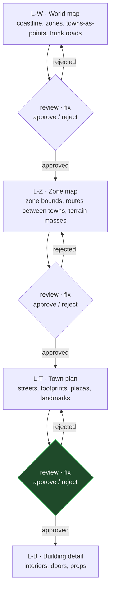

# Town plan view — making a town a place you can walk

**A town in this project is currently a dot.** `content/maps/cluster1-geography.json` gives each of
the six an `at` point, an emblem and a one-line reason. There is no footprint, no street, no
building, and nothing anywhere in the repo that a player could collide with inside a settlement.

This settles the plan-view layer: what a town map contains, how big it is, how it is validated,
and how it becomes physical.

---

## 0. Decisions this design executes

| # | Question | Ruling |
| --- | --- | --- |
| **D1** | How big is a town? | **~200 world units across — ten seconds to cross** at the measured 20 u/s. Buildings 15–25 units wide. |
| **D2** | Whose coordinate space? | **The town's own local space in world units**, anchored to the geography's existing `at` point. |
| **D3** | Does this feature include collision? | **Yes.** Data nothing can collide with is inert. The binder ships with the schema. |
| **D4** | How many towns? | **Millcross only.** The other five follow once the pattern is proven — the F-029 discipline. |

<div class="callout warn">

**D2 deliberately sidesteps an unsettled question.** `A1-geography-cluster1.md` §5.3 calls the
shipped 1000×1000 `atlas-frontier` shelf a *"compressed miniature"* and routes the world-topology
decision to the Systems Designer under DR-001 §6.4.2. A town plan must not wait on that. Local
space + an anchor point means the plan is valid whatever the world does, and placing it is a
one-line transform later.

</div>

---

## 0.5 The level cascade — no level starts until its parent is Final

Maps are produced **top-down, one level at a time**, and each level carries its own
review → fix → approve/reject loop. A level that is not Final does not release its children.
This mirrors the SWF contract the lore pipeline already uses (`L0→L4`, artifact contract plus
blocking gates) and exists for the same reason: a defect at a coarse level multiplies into every
finer artifact derived from it.



**Each gate has two halves, and both must pass:**

| half | what it is |
| --- | --- |
| **machine** | the level's rule set — T1–T7 here, Z1–Z7 for zone content, G1–G8 for ecology. Objective, in the suite, provably fails when a rule is deleted. |
| **human** | approve / reject against the level's written criteria. A machine cannot judge whether a town *reads* as Millcross. |

### Where the cascade actually stands — measured, not assumed

| level | state | honest verdict |
| --- | --- | --- |
| **L-W world** | `cluster1-geography.json` — 10 zones, 6 towns, 8 named roads, coastline, river | **approved as fiction, never reviewed as a map.** It carries no widths, no scale contract, and no walkability claim. |
| **L-Z zone** | F-037 shipped hazards/resources/landmarks per zone | **content only, no geometry.** Zones have `polygon` bounds and nothing inside them. |
| **L-T town** | nothing | this design |
| **L-B building** | nothing | out of scope |

<div class="callout danger">

**This design's own premise is therefore at risk, and the cascade is what exposes it.** L-W was
approved as *worldbuilding*, against `A1`'s fiction criteria — never against spatial criteria like
"is a road wide enough for the things that walk it" or "does this scale survive contact with a
20 u/s player". L-Z has no geometry at all.

**Ruling: L-T proceeds, with one L-W spatial-review task added ahead of it** (§7 deliverable 0).
The review is cheap — the world map is one file — and doing it now prevents authoring six town
plans against a parent that later moves. It is scoped strictly to *spatial* claims; nothing about
the fiction reopens.

</div>

---

## 1. The gap — measured

| fact | value | source |
| --- | --- | --- |
| what a town record holds | `at, emblem, reason, zone, labelAnchor` (+`ruin`/`wallsOnly`) | `cluster1-geography.json` |
| runtime map properties | `world, playerSpawn, regions, zoneHazards, mobSpawnAreas, links` | `content/schemas/map.schema.json` |
| **static collision bodies in the whole game** | **4** — the world boundary walls | `PlanckPhysicsManager.ts` |
| map data converted to collision | **none** | verified: no `regions`/`mapConfig` reference in the physics manager |
| player radius | **1.3**, hard-clamped | `Player.ts` |
| mob radii | **3 – 5** | `config/mobs/definitions/*.ts` |
| player speed | **20 u/s** | `Player.ts` |

Two consequences worth stating plainly:

1. **Mobs are bigger than players** (radius 5 vs 1.3). Any street a mob uses must be sized for the
   mob, and nothing in the project has ever recorded that constraint.
2. **The engine already supports what we need.** Planck static bodies work — the four world walls
   prove it. The capability is present; the authoring and the wiring are absent. This is a content
   and binding problem, not an engine problem.

---

## 2. The artifact — `content/towns/town-<id>.json`

Validated by a new `content/schemas/town-plan.schema.json`, `additionalProperties: false` at every
level, matching the strictness of `character.schema.json` and `zone-content.schema.json`.

```json
{
  "town": "millcross",
  "extent": { "width": 220, "height": 160 },
  "anchor": { "geographyAt": [86, 118] },
  "water": [
    { "id": "the-meltwash", "kind": "river",
      "poly": [[0,52],[220,58],[220,74],[0,68]] }
  ],
  "roads": [
    { "id": "ford-approach", "kind": "cart", "width": 14,
      "points": [[110,160],[108,96],[104,60]] }
  ],
  "footprints": [
    { "id": "mill-house", "kind": "mill", "rect": [96,44,116,60],
      "storeys": 2, "entranceOn": "ford-approach" }
  ],
  "plazas": [
    { "id": "cart-yard", "rect": [88,100,132,126],
      "why": "where the queue waits when the ford is busy" }
  ],
  "landmarks": [
    { "id": "mill-wheel", "at": [118,52], "firstSight": true,
      "source": "docs/worldbuilding/A1-geography-cluster1.md#6" }
  ]
}
```

**Field rules.**

- `roads[].kind` ∈ `cart, foot` — this selects the width floor in §3, so the rule is data-driven
  rather than a magic number in the gate.
- `footprints[].kind` ∈ `mill, dwelling, store, stable, shrine, gate, tent, ruin`.
- `storeys` is a **rendering hint only** — collision is the 2D footprint. Stated explicitly so
  nobody expects vertical physics that does not exist.
- `landmarks[].firstSight` marks the thing `A1` §6 says a traveller sees before anything else.
  **Exactly one per town.**
- `entranceOn` names the road a building opens onto — the gate uses it to prove reachability.

---

## 3. The scale contract

The project's first written spatial numbers, derived from measured radii rather than taste.

| rule | value | derivation |
| --- | --- | --- |
| `kind: "cart"` road width | **≥ 12** | largest mob radius 5 → diameter 10, plus clearance |
| `kind: "foot"` road width | **≥ 4** | player radius 1.3 → diameter 2.6, plus clearance |
| town extent | **150 – 260** | D1's ten-second crossing, with tolerance |
| building footprint | **≥ 6** on its shorter side | a building narrower than a mob reads as a prop |

<div class="callout danger">

**The mob radius is the binding constraint, and it is counter-intuitive.** A street sized for a
player is impassable to a bramble drake. Any road a mob is routed along must clear 12 units, which
is roughly nine player-diameters — towns will feel wider than a human-scale reference like
Mondstadt suggests, and that is correct, not a mistake to tune away.

</div>

---

## 4. The navigability gate — `checkTownPlan()` in `scripts/check_content.mjs`

Named **T1–T7**, following the Z1–Z7 convention F-037 established.

| rule | enforces |
| --- | --- |
| **T1** | `town` exists in `cluster1-geography.json#towns` |
| **T2** | `extent` within 150–260 on both axes (D1) |
| **T3** | every road's `width` clears its `kind`'s floor (§3) |
| **T4** | no footprint overlaps any road's swept area, and no two footprints overlap |
| **T5** | every footprint's `entranceOn` names a real road, and the footprint touches it |
| **T6** | **connectivity** — the walkable area is one connected region by flood fill; no sealed courtyard, no island |
| **T7** | exactly one `firstSight` landmark, and it is reachable from the town edge |

**T6 is the load-bearing rule.** It is the analogue of F-029's G4 and F-037's Z2: the thing that
makes correctness provable by gate rather than by eye. A town that looks fine and cannot be walked
is the failure this whole feature exists to prevent.

---

## 5. The collision binder

`buildTownStatics({ plan, physicsManager, origin })` converts each footprint into a Planck **static**
body at room start, mirroring how the four boundary walls are already created.

- Footprints only. Roads and plazas are **absence of collision**, not surfaces — there is no
  ground plane to author.
- `water[]` is **not** collision in this feature. Whether a river blocks, slows or drowns is a
  gameplay rule nobody has decided; §10 carries it as an open question rather than inventing it.
- The binder is pure with respect to the room: given a plan and an origin it produces bodies, so
  it is unit-testable without standing up a `GameRoom`.

---

## 6. Millcross — derived from canon, not invented

`A1` §6 dictates almost the whole plan already:

> *"A town with **no wall and no plan**, built along **both banks** of a river crossing and spilling
> a quarter-mile up each road out of it… one tall thing, the **mill-wheel housing over the race**…
> First thing a traveller sees: **the cart queue**… the refugee camps on the east bank never came
> down, and the tents have grown plank walls and doorframes."*

Which yields: a river across the middle · a ford where the road crosses · roads converging on it ·
**ribbon sprawl** along those roads rather than a bounded core · **no wall and no gate** · the mill
at the race as the only two-storey mass · a plank-and-tent quarter on the east bank · a cart yard
where the queue waits.

<div class="callout success">

**This is the anti-Mondstadt, and that is the point.** The reference town is walled, planned and
tiered around plazas. Millcross is explicitly none of those. We take the **method** — a spine with
branches, deliberate open space, a first-sight landmark, footprints at true scale — and let the
form be ribbon sprawl round a crossing. Copying the form is how every town ends up looking like a
reskin of the same reference.

</div>

---

## 7. Deliverables

| # | Artifact | Kind |
| --- | --- | --- |
| **0** | **L-W spatial review** — read `cluster1-geography.json` against spatial criteria only (are the 8 roads routed sanely for travel; do the 10 zone polygons tile without gaps or overlaps; is every town's `at` inside its own zone; does the coast/river geometry self-intersect). Findings recorded, fixed or explicitly accepted, **then approved before any town plan is authored.** | gate |
| 1 | `content/schemas/town-plan.schema.json` | schema |
| 2 | `content/towns/town-millcross.json` | data |
| 3 | `checkTownPlan()` (T1–T7) in `scripts/check_content.mjs`, wired into `main()` and `finish()` | gate |
| 4 | `scripts/tests/town-plan.test.mjs` — every rule, both polarities | tests |
| 5 | `buildTownStatics()` in `colyseus-server/src/physics/` + jest tests | binder |
| 6 | `docs/worldbuilding/A3-town-plans.md` — the derivation and the scale contract | world artifact |

---

## 8. Costs and limits

- **2D only.** `storeys` renders; it does not collide. No bridges over roads, no upper floors.
- **Static only.** No doors that open, no destructible walls.
- **One town.** The scale contract is derived from one worked example; the other five may stress it.
- **T4/T6 are geometry**, and geometry gates are where off-by-one errors hide. The tests must
  include a deliberately sealed courtyard and a road-overlapping footprint, or the rules are
  decorative.
- **The binder is untested against a real room** until something spawns a player inside a town.

---

## 9. What this does not change

- `cluster1-geography.json` — read for T1 and the anchor; never written back.
- `content/maps/atlas-frontier.md`, its regions, hazards and spawn areas.
- The four world boundary walls in `PlanckPhysicsManager`.
- F-037's zone content records and Z1–Z7 — a separate file class and a separate checker.
- The art pipeline. Concept art becomes **reference for** the plan view, not a dependency of it.

---

## 10. Open questions

1. **Does water block, slow, or drown?** Not decided; §5 deliberately leaves `water[]` non-physical.
2. **Where does a town plan attach to the runtime map?** Needs the Systems Designer's topology call
   (DR-001 §6.4.2). The `anchor` field is the seam.
3. **Do mobs enter towns?** T3's 12-unit floor assumes yes. If towns are mob-free, `cart` roads
   could be much narrower and towns would tighten considerably.
4. **Interiors?** `entranceOn` implies a door. Whether it leads anywhere is out of scope.

---

## 11. Verification

```bash
npm install --prefix scripts
npm test --prefix scripts                    # town-plan rules, both polarities
node scripts/check_content.mjs               # expect: 1 town plans, 0 failures
( cd colyseus-server && npm test -- buildTownStatics )
```

**Acceptance:** the scripts suite green with T1–T7 each proven to fail when deleted; the content
gate reporting the Millcross plan with zero failures; `buildTownStatics` producing one static body
per footprint at the right world offset; and a flood-fill test that goes red on a deliberately
sealed courtyard.

**Never write `$?` after a pipe.** Redirect to a file, then read it.
