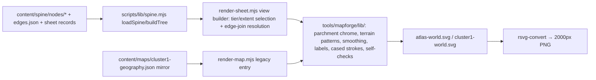

# World Map Render (I-090) — Design

**Date:** 2026-08-12
**Idea:** I-090 — World map render: spine-driven world-scale map
**Status:** Approved design (owner, 2026-08-12) — awaiting plan
**Origin:** Owner complaint recorded in I-089 HANDOFF: *"currently it is like a region map not world map."* F-041 built the tier-spine data model but explicitly deferred all rendering (F-041 spec §6).

## 1. Goal

Render committed, deterministic parchment map sheets **from the F-041 tier spine** (`content/spine/`) instead of the generated mirror, and add the missing **world-scale sheet** so the map set finally shows the world frame, not just the basin.

Scope decisions made with the owner (2026-08-12):

- **Tiered map set** delivered as **static sheets** (SVG + PNG), not an interactive viewer.
- **Two tiers in this feature: world + continent.** Region and town sheets wait until those tiers carry enough authored interior detail (F-029 prove-the-pattern discipline).
- Build approach: **shared drafting library + new spine-driven sheet renderer** (option 1 of 3).

## 2. Deliverables

| Artifact | Path | Notes |
| --- | --- | --- |
| World/atlas sheet | `game-client/assets/art/maps/atlas-world.svg` + `.png` | NEW. 2000×2000 km `n-atlas` frame. |
| Continent/basin sheet | `game-client/assets/art/maps/cluster1-world.svg` + `.png` | Re-rendered from spine truth; visually identical to today. |
| Manifest entry | `art:map-atlas` in `game-client/assets/art/art-manifest.json` | Group `map` already exists in `art-groups.json`; `gen.method: "authored-vector"`, `deterministic: true`. |
| Sheet record | `content/spine/sheet-atlas.json` | NEW presentation record for the world sheet. Existing `content/spine/sheet.json` stays the continent record. |
| Renderer | `tools/mapforge/render-sheet.mjs` + `tools/mapforge/lib/*.mjs` | New entry point + extracted drafting library. |
| CI drift gate | `scripts/check_map_render.mjs` | Re-renders both sheets, byte-compares against committed SVGs. |

## 3. Architecture

### 3.1 Drafting library extraction

Extract from `tools/mapforge/render-map.mjs` (~1,040 lines, zero deps) into `tools/mapforge/lib/`:

- Parchment sheet chrome: title panel, legend, walking table, "not shown" list, north mark, provenance foot.
- The 8 terrain `<pattern>` fills and the `FILL_FOR` terrainKind mapping.
- Catmull-Rom → Bézier smoothing (`smooth()`, incl. the tension-10 zone-outline variant), `r2()` rounding with −0 normalization.
- Label halo styles (`.lbl`/`.zn`), cased road strokes with weight widths `{trunk: 3.2, spur: 2.2, track: 1.5}`.
- Self-checks: town-in-polygon containment, canon-leg distance ±8%, relay sight-line ≤ 10 km, unknown-terrainKind.

**Hard requirement:** after the refactor, the legacy entry `render-map.mjs` (mirror input) must produce **byte-identical** output to the currently committed `cluster1-world.svg`, and its `--check` mode must keep passing — it is wired into `scripts/integration.sh` (Gate 2) as the only town-in-zone enforcement and must not go dark.

### 3.2 render-sheet.mjs (new entry point)

- CLI: `node tools/mapforge/render-sheet.mjs --sheet <atlas|cluster1> [--no-png] [--check]`. Same flag contract as the legacy tool.
- Loads the spine through `scripts/lib/spine.mjs` (`loadSpine`, `buildTree`, `resolveToRoot`) — never re-parses node JSON ad hoc, never reads the mirror.
- **View builder** selects what a sheet draws: nodes by tier/extent, `line`/`point` features on the frame node, edges from `content/spine/edges.json`. It resolves all edge endpoint forms — `{node}`, `{feature}`, and `{edge, atIndex}` joins — into concrete sheet-km coordinates before drawing; drawing code never sees references.
- Draws only the **fiction tree** (`n-atlas` root). The runtime tree (`n-playroot`) is never drawn — that keeps this feature clear of the deferred "two-worlds map" question (DR-004, which mandates no `content/maps/` consequence).
- Determinism contract carried over verbatim: no `Math.random`, no `Date`, byte-identical SVG for identical input.

### 3.3 Continent sheet from spine — parity

`content/maps/cluster1-geography.json` is byte-emitted **from** the spine by `scripts/check_spine_emit.mjs`. The view builder for the `cluster1` sheet reuses that same emit logic to reconstruct the identical intermediate geometry, then draws through the shared lib. Target: the spine-driven continent sheet is **byte-identical** to the mirror-driven render. That equality is the proof the new data path is correct, and it means the committed `cluster1-world.svg`/`.png` do not visually change in this feature.

## 4. The world sheet (atlas-world)

In-fiction Bellfaith style, same ink-on-cream palette and drafting conventions as the basin sheet.

**Drawn:**

- The full 2000×2000 km `n-atlas` frame at a uniform scale (sheet ~2000 px wide; the basin miniature lands at roughly 150×190 px).
- Cluster 1 as a **detailed miniature** in its authored corner ([0..150, 0..190] km): coastline, the Meltwash river as a single smoothed line, the continent outline, and town dots at `placement.anchor` — **no per-town labels** (unreadable at this scale); one label for the basin itself.
- `n-westsea` as the western sea treatment, and the sea-lane leaving the sheet with its season mark.
- A hand note directing the reader to the basin sheet for surveyed detail (exact wording authored in `sheet-atlas.json`, e.g. "surveyed ground: see the basin sheet").

**Withheld (the point of the sheet):** the remaining ~99% of the frame is honest uncharted parchment — no invented continents, no sea monsters, no decorative filler. The existing cartography contract already says "the map does not pretend to know what is past the ice"; the world sheet extends that stance to the whole frame. No scale bar (`noScaleBar` convention); day-counts remain the only distance language.

**`content/spine/sheet-atlas.json`** carries all presentation strings: title, subtitle, hand note, withheld list, north-mark position. The renderer contains no world-sheet prose.

## 5. Verification and gates

1. **Refactor parity (local + CI):** legacy `render-map.mjs` output byte-identical to committed SVG after lib extraction; `--check` still exits 0.
2. **Self-checks carried over:** `render-sheet.mjs --check` runs the same lint set (town-in-zone, leg distances, relay sight-lines) against spine-derived geometry for both sheets.
3. **New CI drift gate:** `scripts/check_map_render.mjs` re-renders both sheets and byte-compares against the committed SVGs (same pattern as `check_spine_emit.mjs --check`), wired into `.github/workflows/ci.yml` and `scripts/integration.sh`. A stale committed map fails CI.
4. **Manifest gate (existing):** `scripts/check_asset_manifest.mjs` validates the new `art:map-atlas` entry (group, title, provenance note, non-LFS file); the reverse coverage scan requires the new PNG to be claimed — it will be.
5. **Raster policy:** PNG via `rsvg-convert` **only**. The ImageMagick fallback suggestion is removed from the tooling text — `magick` without the librsvg delegate silently drops every stroke (F-040 incident, 2026-08-09).

## 6. Constraints and sequencing

- **Branch:** feature branches off `release/1.8` — `content/spine/` does not exist on `main` until 1.8 promotes.
- **Owner ack dependency:** the F-041 Phase-1 boundary redraw (`docs/worldbuilding/spine-migration/boundary-changes.md`) is still un-acked. These sheets bake the redrawn outlines into committed images, so the ack — already required to promote 1.8 — must land before this feature ships. If the owner instead names a boundary to redraw, the spine change lands first and the sheets render from it; the renderer itself is unaffected.
- **Canon neutrality:** the renderer draws what the spine says. Open canon questions (e.g. X4, Cindervast NW vs due north) are resolved in spine data by the Archivist route, never special-cased in the renderer.
- **Magic-number policy:** canon-coupled drawing constants currently inlined in `render-map.mjs` (grave-row x-range, river reach widths, gradient label position) move into the shared lib **unchanged** in this feature; migrating them into data is out of scope.

## 7. Out of scope

- Region-tier and town-tier sheets (wait for authored interior detail).
- Interactive map explorer / zoom viewer.
- Retiring the `cluster1-geography.json` / `atlas-frontier.md` mirrors (F-041 Phase 7 — this feature *enables* it by making the renderer spine-driven, but does not do it).
- Drawing the runtime tree, or any change under `content/maps/`.
- A season-budget line for maps (maps stay outside the funded art classes; F-025 counts only `art:town-` and `art:mob-`).

## 8. Acceptance criteria

1. `node tools/mapforge/render-sheet.mjs --sheet atlas` produces `atlas-world.svg` + `.png`; re-running produces byte-identical files.
2. `node tools/mapforge/render-sheet.mjs --sheet cluster1` produces output byte-identical to the mirror-driven legacy render of the committed `cluster1-world.svg`.
3. Legacy `render-map.mjs` post-refactor: byte-identical output, `--check` green, Gate 2 wiring untouched.
4. `scripts/check_map_render.mjs` fails CI when a committed sheet is stale, passes when regenerated.
5. `art:map-atlas` passes `check_asset_manifest.mjs`; both maps visible in the asset-storybook "Maps" section.
6. World sheet contains no invented geography: every drawn element traces to a spine node, feature, edge, or `sheet-atlas.json` presentation string.
