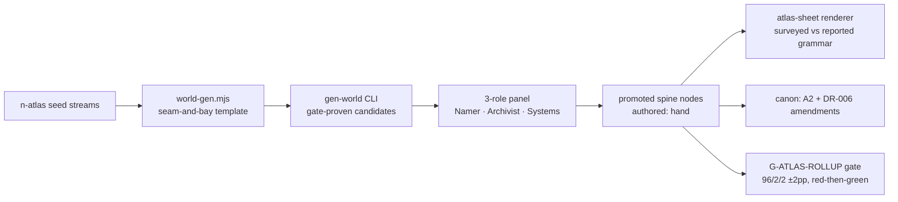

# F-043 — The Wider World: Ship Report

**Date:** 2026-08-15 · **Status:** ✅ SHIPPED to `release/1.8` (Gate 1 13/13 pre- and post-merge) · **Origin:** owner ask — *"I want complete high level map not emptiness."*

<b>15</b> new spine nodes

<b>96.1 / 0.93 / 1.87</b> ocean/rock/ice rollup (target 96/2/2 ±2pp)

<b>13/13 ×2</b> Gate 1, both sides of merge

<b>545/545</b> content-gate test suite

<b>~5 min → 7 s</b> spine gate after perf fix

<b>6/6</b> acceptance criteria met

## What exists now

The atlas world sheet is a **complete compiled mariners' chart**: the Bellfaith's surveyed basin in its corner, and beyond it — charted from masters' logs sworn at Gildmark harbor, hatched because *reported, never vouched*:

- **Coldreach** (west major, ~22,000 km²) — port **Tallowquay**, where Gildmark's once-a-year trade-wind lane finally lands at a real named place; regions the Coldreach Shore, the Peatrun Coast, the Coldreach Interior (unsurveyed); features the Coldreach Spine, the Peatrun.
- **Stonemoor** (east major, ~18,000 km²) — port **Netstead** on a reported foreign coastal lane; the Stonemoor Shore, the Slateflow Coast, the Stonemoor Interior; the Stonemoor Spine, the Slateflow.
- **Driftholt, Reedstrand, Brightfall** — three archipelago chains, main isles charted, outliers unnamed marks (the honest register for hearsay).
- **the Rimewall Cap** — the polar ice along the north edge, continuous with the basin's shelf; "none reports an end to it."
- **The Keelbreak Sea, The Galereach Sea, The Tarnmark Sea** — the named waters partitioning the frame.

## How it was built (the pipeline that ships with it)

Deterministic generator (same seed → byte-identical world) → real-gate-proven candidates → hand-polish panel (names in the Ashen Vigil register, canon collision audit, budget arithmetic — verdict artifact `docs/worldbuilding/F-043-wider-world-panel.md`, all 15 nodes ACCEPT) → promotion → renderer → canon.

## Canon changes (DR-006 option 3, no silent drift)

- <mark>New `docs/worldbuilding/A2-wider-world.md`</mark> — the wider world as citing canon; every claim traces to a node's lore line.
- A1/A0 amended with dated markers; **V8 survives untouched** — Gildmark remains the land's only door to the sea; foreign harbors give the sister towns nothing.
- `core-story.md:26` gained one additive Thai sentence (harbor records hold the compiled chart — *"จดไว้ ไม่ใช่เห็นมาเอง"*); the "nobody in this story has ever seen" clause stands intact.
- `canon.md` §4 gained the wider-world bullets + a §6.2 ruling row; G18 marked PARTIALLY RESOLVED.

## Incidents worth remembering

<b>Citation rot, fourth occurrence.</b> A flat +32 line-offset "repair" under-shifted 19 A0 citations onto blank lines; the seal-provenance gate caught it at final review. The only safe repair is re-locating every citation by quoted text — never arithmetic.

<b>Two gate amendments shipped with the feature</b> (both red-then-green proven): the overlap-rollup perf fix (union scan → pairwise sum, Bonferroni-conservative; 5 min → 7 s) and reported-childless-continents downgraded to WARN under <code>--require-complete</code>. Plus one new hard gate: <b>G-ATLAS-ROLLUP</b> pins the world composition forever.

<b>Reviews crop; owners squint at the whole sheet.</b> Per-label legibility crops passed review while the title block buried Coldreach. The full-map visual pass is now part of the definition of done for any sheet change.

## Deferred (triaged, none block)

| Item | Disposition |
| --- | --- |
| G-ATLAS-ROLLUP union-key hardening (rogue-biome mass today ~1.1pp, bound ≤6pp) | **I-093 filed** |
| Label crowding on the majors at dense clusters | cosmetic, revisit with next sheet change |
| Leftover first-sealane validation block in atlas-sheet.mjs | cleanup candidate |
| **Local deploy skipped** (`--no-deploy`) | run `scripts/deploy-local.sh` from the `_release` worktree when wanted |

## Next

Claim the next feature, or `psrw promote` when release 1.8 is full (F-041 tier spine + F-042 renderer + F-043 world content are all aboard).
