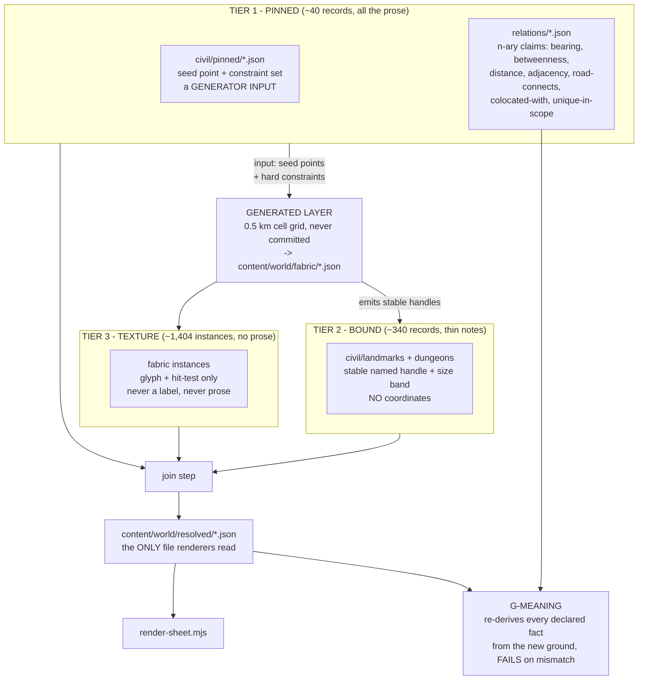
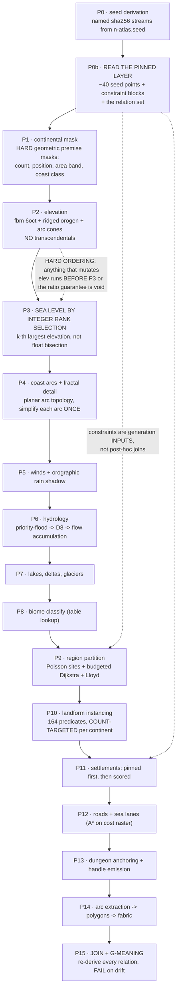
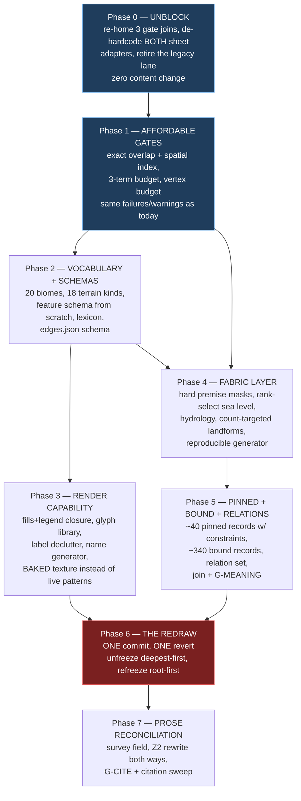

# Filling the world map — generated land, pinned places, bound texture

**Status:** design (brainstorming output). A separate planning step turns this into tasks.
**Date:** 2026-08-16 · **Branch:** `release/1.8` · **Worktree:** `.claude/worktrees/_release`
**Supersedes nothing. Depends on:** F-041 (tier spine), F-042 (world map render), F-043 (world geography), F-045 (world rescale to 400 × 400 km).

---

## Read this first

The world map is almost all water. Today the chart holds **6,243 km² of land in a 160,000 km² frame** — a sea-to-land ratio of about **24.7 to 1**, where the owner wants **1.2–1.8 to 1**. It also holds 7 continents, 18 regions, 7 towns, zero dungeons and zero deserts, volcanoes or caves.

The plan is to **generate the land and author the meaning separately**. A throwaway 0.5 km cell grid produces coastlines, rivers, climate and landforms; sea level is found by **bisection against a land-area target**, so the ratio is right by construction and never by re-rolling seeds. Small hand-written files hold towns, dungeons and named places.

**The one thing that could sink it — and it already did, once.** The original plan was for *every* authored place to name a **slot address** ("the second-largest karst group in region 07") instead of a coordinate, so a re-seed would reprint everything correctly with no human re-reading. That was tested and **it fails**: bearings between slot-addressed places came out essentially random across re-seeds (modal compass direction 17–27% against a 12.5% coin-toss baseline), and **0 of 40 test seeds even produced the 7 named continents the address space assumes**. So the ~40 places that carry hand-written prose become **generator inputs** — pinned seed points with declared constraints — not generator outputs. Slot binding survives only for the ~1,400 unnamed texture instances and the frontier records that carry no prose.

The second thing that could sink it is cost: the geometry gate is **81–92% one polygon-overlap check**, and that check gets **26× more expensive** at the target because land polygons sit inside ocean bounding boxes. It must be replaced before a single new continent exists.

---

<div class="metric-grid">
<div class="metric-tile alarm"><strong>24.7 : 1</strong><br/>sea-to-land today (target 1.5 : 1)</div>
<div class="metric-tile"><strong>6,243 → 64,000 km²</strong><br/>land area, a 10.25× increase</div>
<div class="metric-tile"><strong>44 → 36</strong><br/>spine node files (the trunk <em>shrinks</em>)</div>
<div class="metric-tile"><strong>18 → 160</strong><br/>regions: 40 surveyed + 120 reported frontier</div>
<div class="metric-tile"><strong>7 → 45</strong><br/>settlements (3 capitals, 12 hubs, 30 villages)</div>
<div class="metric-tile"><strong>0 → 60</strong><br/>dungeon complexes / ~190 floors</div>
<div class="metric-tile"><strong>12 → 20</strong><br/>biomes; 7 → 18 terrain kinds; 0 → 164 landform types</div>
<div class="metric-tile alarm"><strong>81–92%</strong><br/>of the content gate is one overlap check</div>
</div>

---

## 1. Goals

| # | Goal | How it is measured |
| --- | --- | --- |
| G1 | **Sea-to-land ratio inside 1.2–1.8 to 1** | `n-atlas.derived.computedComposition.ocean` ∈ [54.5455, 64.2857] pp — the frame-complete rollup, not a node-area ratio |
| G2 | **Many more places**: 13 landmasses, 160 regions, 45 settlements, 60 dungeon complexes, 9 marginal seas | file counts gated against a committed manifest |
| G3 | **100–200 distinct landform types actually drawn**, from the Wikipedia landform glossary | 164 catalogued types, each with ≥1 instance or an explicit `absentBecause` |
| G4 | **A seed-to-finished-map loop fast enough to iterate** | per-stage time budgets, each with a fail threshold (§6.6) — not one aggregate number |
| G5 | **Higher quality**: continents that contrast, coasts that read as coasts, labels that do not collide | premise masks, glyph library, deterministic label declutter |
| G6 | **A re-seed is cheap for texture and honest about prose** | the meaning-drift gate reports exactly which authored claims a re-seed broke |

## 2. Non-goals

<div class="callout danger">
<strong>The game runtime is a non-goal.</strong> No commit in any phase may change a spawn id, a spawn rectangle, a live map id, or a runtime coordinate. This is structural, not a promise: <code>content/spine/roots.json</code> holds exactly two disjoint roots, <code>n-atlas</code> (the chart) and <code>n-playroot</code> (the runtime), and all 11 ids in <code>content/spine/frozen-spawn-ids.json</code> hang under <code>n-playroot</code>. <strong>But "disjoint" is not "uncoupled" — see §3.4; there are three real couplings that reach the runtime tree and one that reaches compiled server code.</strong>
</div>

Also out of scope: the Godot client, combat/stat systems, art generation for new places (art-forge), Nakama meta-systems, and any change to the 400 × 400 km frame (`n-atlas.json` stays `frozen: true`, `rect` 400 × 400, anchor `[200, 200]` — every number in this document is derived from it).

---

## 3. Corrected facts about the current system

Everything here was measured on `release/1.8` in this worktree. Where the original brief was wrong, the correction is stated.

### 3.1 Shape and size

| Fact | Measured | Note |
| --- | --- | --- |
| Spine node files | **44** | tiers: 18 region, 7 town, 7 continent, 4 ocean, 3 site, 2 fixture, 1 world, 1 playspace, 1 playroot |
| `sea` tier | **declared, zero instances** | `scripts/lib/spine.mjs:29-33`, depth 2 |
| Frame | 400 × 400 km = **160,000 km²** | `content/spine/nodes/n-atlas.json`, frozen |
| Land (7 continent nodes) | **6,243.5 km²** | Σ `derived.areaParentUnits2` |
| Ocean (4 ocean nodes) | **134,164.7 km²** | Galereach 29,913.2 · Keelbreak 67,091.8 · Tarnmark 37,078.0 · **West Sea 81.7** |
| Unclaimed frame | **19,591.8 km² (12.245%)** | `n-atlas.derived.unclaimedPct`, declared `interstitial: {ocean: 100}` |
| Spine bytes | **105,255** by summing files; **119,880** by the gate's own printout | see the callout below |
| Load budget | `{maxNodes: 48, maxBytes: 393216}` | the **count** cap binds; the byte cap never has |
| Biomes / terrain kinds | **12 / 7** | `scripts/lib/spine.mjs:47-59`; no desert, volcano or karst |
| Feature schema | **none at all** | `content/schemas/spine-node.schema.json:59` is literally `"features": {"type": "array"}` |
| Features today | **58**, kinds only `{line: 10, point: 48}` | 3 top-level key shapes, 12 distinct `attrs` key-sets |
| Name pool | **12 × 10 = 120** combinations | `tools/mapforge/lib/world-gen.mjs:70-71` |
| Frozen nodes | **14** | `n-atlas`, `n-cluster1`, 6 canon regions, 6 canon towns |
| Edges | **20** (8 road, 2 relay, **7 leg**, 3 sealane) | `content/spine/edges.json`, **no schema exists** |

<div class="callout warn">
<strong>Two different byte numbers, both real.</strong> Summing the 44 node files gives <strong>105,255 bytes (26.8% of the 393,216 cap)</strong>. The gate prints <code>spine-load: 44 nodes, 119880 bytes (budget 48 nodes, 393216 bytes)</code> — <strong>30.5%</strong>. The gate's figure is the authority, because it is what <code>G-LOAD-BUDGET</code> compares. The conclusion is identical either way: <strong>the byte cap has never been the binding constraint; the 48-node count cap is.</strong>
</div>

### 3.2 The ratio, pinned to one definition

The brief's "about 24.7 to 1" is right under one of two definitions and the two must never be confused again:

```
ocean-NODE area / continent-NODE area  = 134,164.7 / 6,243.5 = 21.49 : 1
frame-complete composition rollup      = 96.10627% ocean / 3.89373% land = 24.68 : 1
```

<div class="callout info">
<strong>Pinned:</strong> the ratio is measured on <code>n-atlas.derived.computedComposition.ocean</code>. It is the only definition that cannot be gamed — it already counts interior water inside continent polygons <em>and</em> the 19,592 km² interstitial. A node-area ratio ignores both and would let a designer hit 1.5 : 1 while half the "land" is lake.
</div>

### 3.3 The eleven prior corrections, re-adjudicated

A skeptic re-checked all eleven. **Eight hold, two are wrong as written, one is imprecise.**

| # | Claim | Verdict | What actually holds |
| --- | --- | --- | --- |
| **C1** | The legacy mirror `content/maps/cluster1-geography.json` is the join authority for three gate families, not render-only | ✅ **confirmed** | `check_content.mjs:816` (creature placement), `:955` (zones), `:1192` (towns). Loaders at `:104` and `:123` |
| **C2** | The modern renderer depends on a hard-coded adapter and crashes when the basin is redrawn | ✅ **confirmed and understated** | Executed: dropping `n-saltmire` throws `TypeError: Cannot read properties of undefined (reading 'title')`; dropping `n-cluster1` throws on `'features'`. **A second adapter exists**: `tools/mapforge/lib/atlas-sheet.mjs:41-46` hard-codes `n-atlas`/`n-cluster1`/`n-westsea`, `:57-58` the features `f-west-coast`/`f-the-meltwash`, `:125` an `id !== "n-cluster1" && id !== "n-westsea"` filter. **Both sheets break, not one** |
| **C3** | There are four byte-for-byte comparisons in the map lane | ❌ **wrong — there are six**, and the 47 KB fixture has **three** consumers | `parity.test.mjs:17`, `basin-sheet.test.mjs:17-20`, `render-sheet.test.mjs:14-17` all read `tools/mapforge/tests/fixtures/basin-baseline.svg`; plus `check_spine_emit.mjs --check`, `check_map_render.mjs`, `render-map.mjs --check`. (A fourth fixture reader, `raster.test.mjs:11`, rasterises it) |
| **C4** | A redraw does not reopen runtime coordinates or frozen spawn ids | ⚠️ **narrowly true, broadly false** | Coordinates and spawn ids are safe. But three couplings reach the runtime — see §3.4 |
| **C5** | Town-in-zone containment lives in `basin-sheet.mjs`, and integration.sh's "ONLY enforcement" comment is stale | ✅ **confirmed** | Live check is `basin-sheet.mjs:58-67` and covers towns **and camps** — wider than stated |
| **C6** | Map features have no schema at all | ✅ **confirmed exactly**; the "dozen ad-hoc shapes" is the imprecise half | `spine-node.schema.json:59` is a bare array. Census: 58 features, 3 top-level key sets (`{attrs,id,kind,points}`×10, `{at,attrs,id,kind}`×47, `+offSheet`×1), 12 distinct `attrs` key-sets |
| **C7** | The renderer has 7 biome fills and 6 legend rows; new biomes render as blank parchment **silently** | ❌ **wrong in kind** | `FILL_FOR` (`draft.mjs:36-44`) has 7 entries keyed by **`terrainKind`, not biome** — there are **zero biome fills in the repo**. `patternDefs()` emits **8** patterns + `pReported`. `TERRAIN_LEGEND` has **6** rows, listing `pMire` (unreachable) and omitting `pRock`/`pRiver` (reachable). And the failure is **loud, not silent**: `basin-sheet.mjs:200-202` pushes `no fill for terrainKind` into `problems`, which hard-fails `check_map_render.mjs:36-39`. **The atlas sheet is worse**: `atlas-sheet.mjs:373` is its only `fill="url(...)"` call, choosing between exactly **two** patterns, and the file has **no legend block at all** |
| **C8** | Every point feature draws as an identical small circle | ⚠️ **imprecise, substance stands** | 5 variants across 19 circles in the committed `atlas-world.svg` (r 0.7/0.8/1.1/1.6/2), differing only in radius and ink. There is no shape vocabulary |
| **C9** | Label placement has no decluttering | ✅ **confirmed** | A deterministic `nudgeClearOfLand` exists (`atlas-sheet.mjs:235-252`) but dodges **land**, not other labels; grep for `collision`/`declutter` across `tools/mapforge` returns nothing. Committed `atlas-world.svg` carries **37** `<text>` elements against a 340+ target |
| **C10** | The name pool is 120 combinations against ~600 names needed | ✅ **confirmed** | 12 × 10 at `world-gen.mjs:70-71`. Budget is **626** names — a slack ratio of 0.19, which cannot converge under any rejection filter |
| **C11** | The overlap gate is ~85% of gate runtime, nearly all under one parent | ✅ **confirmed, and it is worse** | Five independent runs: G-OVERLAP is **2.93–3.25 s of a 3.54–3.70 s gate = 81–92%**; `n-atlas` alone is **2.73–3.01 s**. Deriving all 44 nodes: **8.9–12 ms**. Of `n-atlas`'s 55 sibling pairs, **only 14 have overlapping bounding boxes and ZERO actually intersect** — the whole cost is proving disjoint polygons disjoint by lattice sampling |

### 3.4 Nine couplings nobody listed

<div class="callout danger">
<strong>These are the ones that turn a redraw into a simultaneous multi-gate failure.</strong> Each was verified by reading the code, not inferred.
</div>

| # | Coupling | Why it bites |
| --- | --- | --- |
| **X1** | `scripts/check_spine_emit.mjs` emits **47 files**: 44 canonical node files + 3 mirrors. Mirror 2 is `content/maps/atlas-frontier.md` (**the runtime map's frontmatter**); mirror 3 is `colyseus-server/src/config/generated/mapDimensions.ts` — **generated TypeScript inside the server's `tsc` rootDir**, pinned by `colyseus-server/src/tests/mapDimensions.test.ts` in Gate 1 *and* CI | The spine feeds **compiled server code**. "Runtime is a non-goal" must be restated as "**the runtime emitters keep producing byte-identical output**", with the `mapDimensions` jest pin green as an acceptance criterion on every commit |
| **X2** | Two `representsNodeId` pointers run **from the runtime tree into the chart**: `n-site-thornveil` → `n-thornveil`, `n-site-icefield` → `n-northern-icefield`. `scripts/lib/spine.mjs:875-877` hard-fails G-ALIAS if the target vanishes. Traffic also runs back: `content/story/regions.json` maps `region-spawn-meadow` → `n-frontier-shelf` | Deleting or renaming those two chart ids reddens a **runtime-side** gate |
| **X3** | **G-FROZEN is transitive and directional** (`check_content.mjs:1965-1976`): a frozen node under an unfrozen parent fails, *and* an unfrozen node still carrying `absoluteAnchor` fails | Reparenting `n-cluster1` under a new generated continent fails immediately. Forces a strict unfreeze order (deepest-first) the brief did not account for |
| **X4** | The **spine-alias sweep** (`check_content.mjs:1416-1528`) resolves five families against `n-<slug>` nodes: 116 bestiary rows across 9 region slugs, 10 story regions, 6 `art:town-*` manifest keys, 10 zone files, 1 town plan | Directly conflicts with "the spine shrinks to a 36-node trunk". If region and town tiers leave `content/spine/nodes/`, every one of these breaks unless the resolver is re-pointed **in the same commit** |
| **X5** | **Z2 zone completeness** (`check_content.mjs:1042-1045`) iterates *the geography, not the files*: every zone the mirror declares needs exactly one `content/zones/zone-*.json` record. Plus **Z6** (`:1053-1071`): landmark names globally unique across zones, and each zone's resource-**kind set** globally unique against a closed 8-value enum | 40 surveyed regions = 40 full zone records with distinct landmark names and distinct resource sets — a set-packing problem with 255 available sets. This is the largest unlisted **authoring** cost |
| **X6** | **CI is not the gate you think.** `.github/workflows/ci.yml` runs neither `tools/mapforge/render-map.mjs --check` nor `node --test tools/mapforge/tests/*.test.mjs` | Five of the six byte comparisons are **Gate-2-only (local)**. A redraw watched only through CI ships a broken parity fixture |
| **X7** | Map PNGs are **gated assets**: `art-manifest.json:490` `art:map-cluster1`, `:517` `art:map-atlas`, checked by `check_asset_manifest.mjs` in CI including guard (U) thumbnail freshness (`:562-605`), which rehashes source bytes against `game-client/assets/.thumbs/index.json` | Every redraw invalidates the thumb hash and requires re-running `scripts/bake_thumbnails.mjs` (needs `sharp`). New sheets need manifest entries, license rows and thumbs |
| **X8** | `tools/asset-storybook/tests/maps-index.test.mjs:33-61` asserts every mapforge `SHEETS` id appears in `maps-index.json` with byte-matching `outSvg`/`outPng` paths, **both directions**. It **does** run in CI (Gate 1 `storybook_tests`) | Adding a sheet without indexing it reddens Gate 1 |
| **X9** | **G-NET / G-CANON-LEG** over `content/spine/edges.json`: 7 `leg` edges pin canon walking distances (e.g. `e-leg-cindervast-rooktide` `straightKm: 34`, `e-leg-millcross-gildmark` `17`) at **±8% with both endpoints required frozen** (`check_content.mjs:2028-2036`) | A free redraw of the basin breaks most of them at once, surfacing as seven simultaneous errors that look like a gate bug |

<div class="callout warn">
<strong>A live footgun.</strong> <code>tools/mapforge/tests/parity.test.mjs:14-16</code> executes <code>render-map.mjs</code> into the tracked <code>game-client/assets/art/maps/cluster1-world.svg</code>, then runs <code>git checkout -- &lt;that file&gt;</code>. <code>scripts/integration.sh</code> runs <code>map_render_drift</code> <em>before</em> <code>mapforge_tests</code>, so during a redraw the suite <strong>silently reverts a freshly regenerated, uncommitted sheet mid-Gate-2.</strong>
</div>

### 3.5 The generator today

`tools/mapforge/gen-world.mjs` + `lib/world-gen.mjs` are **templated, not procedural**: a `mulberry32` RNG, a `noiseRing` radial jitter, hard-coded `bayDefs` landmass rectangles and chord splits. No voronoi, no Poisson disc, no noise field, no hydrology.

Promotion is **two hand steps, not one**: it writes candidates to the gitignored `content/spine/candidates/` **with `derived` stripped** (`keepDerived: false`), so a human must rename the files *and* separately run `check_spine_emit.mjs --write`. Two hardcodes exist purely to survive a previous promotion — `SYNTHETIC_LOAD_BUDGET` (`:32`) and `PRE_WORLD_ATLAS_CHILDREN = {n-cluster1, n-westsea}` (`:60`) — which is the definition of **non-idempotent**.

---

## 4. What the skeptics changed

Three load-bearing claims were attacked. **All three were refuted.** Two forced real amputations; one forced an algorithm replacement and a rasterisation redesign.

| Claim attacked | Verdict | What the design now does instead |
| --- | --- | --- |
| "Authored records bind to slot addresses and role ranks; a re-seed reprints them correctly with no human re-reading" | **REFUTED (high confidence)** | **Three-tier binding** (§5.1). ~40 prose places become **pinned generator inputs**; a new **relation layer** carries the n-ary claims; a **meaning-drift gate** reports what a re-seed broke instead of resolving quietly |
| "This scales — the cell grid makes overlap zero by construction, gates stay fast, the loop is 25–30 s" | **REFUTED (high confidence)** | Overlap **algorithm replaced** before any content (§7.2); **vertex budget** gated; land/sea classification made an **integer rank selection**, not a float bisection, to kill a 1-ULP topology flip; **rasterisation redesigned** and taken out of the review loop (§6.6) |
| "The 11 corrections are accurate and complete; the runtime is genuinely unaffected" | **REFUTED (high confidence)** | C3 and C7 rewritten, C8 softened (§3.3); **nine new couplings** promoted to first-class design constraints (§3.4); the runtime non-goal restated as an *emitter* guarantee |

### 4.1 The amputation, stated plainly

<div class="callout danger">
<strong>"Bound places" does not work for places that carry prose. That half of the architecture is cut.</strong>
<br/><br/>
Evidence, in order of force:
<br/><br/>
<strong>1. The repo already failed this test under strictly easier conditions.</strong> F-045 was a <em>uniform 5× rescale</em> — it preserved every topological relation, every bearing, every rank, every betweenness. Slot binding would have resolved 100% unchanged. It still stranded <strong>33 prose claims across 10 content files</strong>, each stamped <code>AMENDED-PENDING (I-095): distances now hour-scale on the 400 km world — prose re-voice deferred</code> (7 in <code>cluster1-geography.json</code>, 7 in <code>A1-geography-cluster1.md</code>, 5 in <code>edges.json</code>, 5 in <code>canon.md</code>, 3 in <code>A0-current-world.md</code>, and the rest). <strong>The repo's own answer to a pure scale change was "defer a human re-voice."</strong> A re-seed changes topology, bearings, adjacency, counts and ranks — everything a rescale did not touch.
<br/><br/>
<strong>2. Bearings are a coin toss.</strong> Simulated over 30 seeds with the continent shape <em>pinned by a premise mask</em> (the architecture's best case): the compass bearing region-01 → region-03 took all 8 directions, modal direction 20%. region-03 → region-07: modal 27%. region-01 → region-07: 20%. Uniform baseline is 12.5%. <code>canon.md:185</code> asserts "Thornveil's bramble forest lies <strong>east</strong> of Millcross"; <code>:221</code> "Rooktide sits inland, <strong>south</strong> of Millcross"; <code>:226</code> Cindervast "lies beyond Ashvale Front to the <strong>north-west</strong>". Every one resolves after a re-seed and every one is false about four times in five.
<br/><br/>
<strong>3. The slot vocabulary itself does not survive.</strong> Over 40 seeds (4-octave noise, continentality falloff, sea level bisected to 40% land), landmasses ≥1,000 km² came out {1:9, 2:13, 3:11, 4:6, 5:1}. The target needs <strong>7</strong> named continents. Seeds reaching 7: <strong>0 of 40</strong>. The address space <code>continent-02..continent-07</code> has no ground at all in most re-seeds — the failure is not a tie-break, it is <strong>total absence</strong>. At the real Millcross anchor <code>[17.2, 23.6]</code>, the ground was land in only <strong>3 of 40</strong> seeds.
<br/><br/>
<strong>4. Resolution success is not coherence.</strong> With the continent mask pinned, the largest karst group ranged from <strong>892 to 15,645 cells across 20 seeds — a 17.5× swing</strong>. A record bound to "the largest karst group" resolves in both. Prose written for a plateau you cross in a morning now describes something seventeen times larger.
</div>

**The root cause, stated once:** slot addresses and role ranks are **unary** — they name one place. Every load-bearing coherence claim in the authored prose is **n-ary**. Mechanical count across the 8 authored story files (`content/story/{canon.md,lore.json,quests.json,dialogue.json,events.json,arcs.json,regions.json,bible.md}`):

| Claim class | Tokens | Example |
| --- | ---: | --- |
| Network topology (road/route/lane/spur/crossroads/ford/port/harbour/gate) | **194** | `canon.md:230-236` — the Stoneguard "are holding both ends of the same road" |
| Superlative / uniqueness (only/sole/nearest/largest/first/last) | **185** | `canon.md:214` — Gildmark's harbour "is the **only** deepwater port on this coast" |
| Compass bearing | **32** | `canon.md:185` — Thornveil "east of Millcross" |
| Travel distance | **11** | the 7 `leg` edges |
| Co-location ("beneath it", "at the mouth", "borders the") | **7** | |
| Betweenness | **6** | `canon.md:183` — "Millcross is the literal hub — every road elsewhere passes through or near it" |

The uniqueness class is the sharpest: `canon.md:266` — "Gildmark remains the only deepwater port on this coast and the land's only door to the sea … whoever controls the door still controls the price of the whole land." That is a **global negative constraint over the entire generated coastline**. A re-seed producing one more natural deepwater inlet silently voids Gildmark's monopoly, its economy, its news-network rationale and the act-5 plot — while the binding resolves cleanly.

**And there is no machinery to build on.** `grep -ri constraint` across `scripts/*.mjs` and `tools/mapforge/lib/*.mjs` returns exactly **one** hit, and it is a comment (`check_content.mjs:937`). The n-ary layer has to be written from zero.

### 4.2 What survives the attack — say it, because it is the whole payoff

<div class="callout success">
<strong>1. The bisection genuinely works.</strong> Simulated over 12 seeds: land = 64,000 km² and sea:land = 1.50 on <strong>12 of 12</strong>. The ratio <em>is</em> correct by construction, never by re-rolling toward it.
<br/><br/>
<strong>2. Pure existence bindings survive.</strong> Cave-capable uplands were never zero in 20/20 pinned-mask seeds (range 2–13). A dungeon needing only "some cave-capable upland somewhere on continent-02" reprints safely.
<br/><br/>
<strong>3. Tie-breaking is a non-problem.</strong> 0 of 20 pinned-mask seeds had the top two karst groups within 10% of each other; only 4 of 57 adjacent rank pairs (7.0%) in the unpinned run. A deterministic tie-break closes it. The claim fails on <strong>absence</strong>, <strong>count drift</strong> and <strong>n-ary coherence</strong> — not on ties.
<br/><br/>
<strong>4. Generation itself is cheap.</strong> A full 640,000-cell pass measured <strong>351 ms</strong> (noise 105 ms, bisection 41 ms over 19 iterations, D8 + flow accumulation 205 ms) at 23–34 MB heap. Generation is not the problem. The gate and the rasteriser are.
</div>

---

## 5. Design area 1 — the content model and the three-tier binding contract

### 5.1 Three tiers, not two

The generated layer produces shapes; the authored layer produces meaning. **Between them sit three different join strengths**, chosen by how much prose a record carries.



<div class="callout idea">
<strong>The seam is now bidirectional.</strong> The original design had generation blind to authored meaning, with the join as the first moment a contradiction could be detected — by which point it is too late to fix without a human re-read. Tier 1 makes the ~40 prose places <strong>constraints the generator must honour</strong>, so a contradiction is impossible rather than merely detectable.
</div>

| Tier | Count | Binds by | Survives a re-seed? | Gate |
| --- | ---: | --- | --- | --- |
| **1 Pinned** | ~40 | a committed seed point + a constraint block the generator must satisfy | **by construction** — the generator is not free to move them | `G-PIN-SAT`, `G-MEANING` |
| **2 Bound** | ~340 | a **stable named handle** the generator emits and commits, plus a declared **size band** | yes, or the gate says which ones drifted | `G-BIND`, `G-HANDLE-BAND` |
| **3 Texture** | ~1,404 | nothing — regenerated wholesale | trivially | `G-LANDFORM` |

### 5.2 Tier 1 — a pinned record

A pinned record is what a town, a capital or a canon landmark now is. It carries **the constraints its prose depends on**, and the generator honours them before it settles a coastline.

```json
{
  "id": "c-town-gildmark",
  "kind": "town",
  "tier": "pinned",
  "title": "Gildmark",
  "settlementRank": "capital",
  "pin": {
    "at": [31.4, 44.8],
    "toleranceKm": 1.5,
    "why": "canon: the only deepwater port on this coast; act-5 plot depends on the monopoly"
  },
  "requires": {
    "landform": "coastal-drowned-valley",
    "water": { "kind": "sea", "shelterFetchKmMax": 15, "minDepthM": 12 },
    "slopeMax": 0.06,
    "freshWaterWithinKm": 4
  },
  "plan": "content/towns/town-gildmark.json",
  "prose": "authored",
  "provenance": { "authored": "hand", "generator": null },
  "resolution": null
}
```

<div class="callout warn">
<strong>The archetype that proves this is necessary:</strong> <code>content/towns/town-millcross.json</code> is 100% coordinates and its meaning is <em>hydrology-derived</em>. It carries <code>water[the-meltwash: river, the-race: race]</code>, 7 coordinate roads and 3 landmarks (<code>the-ford</code> at [110,80], <code>mill-wheel</code> at [86,41], <code>cart-queue</code> at [24,88]). <strong>Four of seven roads and all three landmarks are river-derived</strong>, and the node composition is <code>{meadow:63, built:28, river:9}</code>. The town's <em>name</em> is a river fact — mill + crossing, with a child node <code>n-millcross-ford</code>. A slot address cannot say "a river must cross this slot north-south and a mill race must tap it." If a re-seed gives the slot no river, the plan's mill, race, ford and four roads describe absent ground and the name is a lie. <strong>The first town alone refutes the unary seam.</strong>
</div>

### 5.3 The relation layer — the n-ary claims

New file family `content/world/relations/*.json`. Each record is one machine-checkable assertion, authored **alongside the prose that depends on it**, and cited back to its source line.

```json
[
  { "rel": "bearing",         "from": "c-town-millcross", "to": "n-thornveil", "dir": "E", "toleranceDeg": 30,
    "cite": "canon.md §4 \"The bramble road\"" },
  { "rel": "unique_in_scope", "subject": "c-town-gildmark", "property": "deepwater-port", "scope": "coast:wealdmarch-west",
    "cite": "canon.md §5 \"The only door to the sea\"" },
  { "rel": "connected_by_road","a": "c-town-cindervast", "b": "c-lm-northern-icefield-watch",
    "cite": "canon.md §4 \"holding both ends of the same road\"" },
  { "rel": "betweenness",     "hub": "c-town-millcross", "minDegree": 4,
    "cite": "canon.md §4 \"the literal hub\"" },
  { "rel": "not_connected_by_road", "a": "c-town-rooktide", "b": "road:war-road",
    "cite": "canon.md §5 \"off the direct war road entirely\"" },
  { "rel": "distance",        "a": "c-town-millcross", "b": "c-town-gildmark", "km": 17, "tolerancePct": 8,
    "cite": "content/spine/edges.json e-leg-millcross-gildmark" }
]
```

The vocabulary is exactly what the existing prose asserts and nothing more: `bearing`, `betweenness`, `distance`, `adjacency`, `connected_by_road`, `not_connected_by_road`, `colocated_with`, `unique_in_scope`.

<div class="callout action">
<strong>G-MEANING — the gate that changes the failure mode.</strong> After every join, re-derive each relation from the <em>new</em> ground and <strong>fail</strong> on mismatch, naming the relation, the citation, and the drifted value. The 33 <code>AMENDED-PENDING</code> markers exist precisely because no such gate ran during F-045. A re-seed is accepted only when G-MEANING reports zero unresolved drifts; otherwise the flagged records are queued for human re-voicing <em>before</em> promote.
</div>

### 5.4 Tier 2 — stable handles, not ordinal ranks

Ordinal role ranks (`second-largest`) are replaced by **handles the generator emits and commits**, plus a **size band the record asserts**.

```json
{
  "id": "c-lm-the-drowned-stair",
  "kind": "landmark",
  "tier": "bound",
  "title": "The Drowned Stair",
  "bind": { "handle": "c03/karst/h-0f42", "expect": { "type": "karst-cenote", "sizeKm": [0.1, 0.8] } },
  "networkAnchor": true,
  "prose": "frontier",
  "lore": { "note": "Cut steps run down the shaft wall and stop three fathoms under water.",
            "labelAnchor": "north", "source": "mariners' report, sworn at Gildmark harbour" },
  "resolution": null
}
```

`G-HANDLE-BAND` fails when the resolved feature leaves its declared band. **That is the check that catches the 17.5× karst swing an ordinal rank resolves silently.**

### 5.5 The landform lexicon

`content/world/lexicon/landforms.json` — one flat array (group is a column, so a query never walks two levels). Schema `content/schemas/landform-type.schema.json`.

```json
{
  "id": "karst-cenote", "group": "karst", "geometry": "point",
  "biomes": ["karst", "forest"], "sizeKm": [0.05, 0.6],
  "dungeonCapable": true, "glyph": "g-cenote", "rarity": "uncommon",
  "requires": { "rock": "carbonate", "precipDecileMin": 4 },
  "gloss": "A collapsed limestone shaft flooded to the water table."
}
```

<div class="callout info">
<strong>The census, reconciled.</strong> Three different numbers were in circulation: the headline "~160 types", the per-group breakdown summing to <strong>172</strong> (20+13+16+21+12+9+19+13+17+14+8+10), and a target line saying <strong>164</strong>. Adopted: <strong>164 distinct types across 172 group memberships, with 8 types dual-listed</strong> — sea cave (coastal ∩ karst), glacier cave, moulin, cenote (karst ∩ lakes), fjord (glacial ∩ coastal), tombolo, atoll, delta. Nothing is dropped; the type id is the primary key and group membership is a many-to-many tag.
</div>

`requires` is load-bearing and new: it is a predicate over fabric cell attributes, so a landform can **only appear where the model produced its substrate**. That is what stops a landform quota from deadlocking against terrain (§10, R2).

**Dungeon-capable types (18):** cave, cenote, sinkhole, foiba, karst fenster, ponor, lava tube, fumarole vent, caldera floor, glacier cave, moulin, nunatak shelter, sea cave, sea arch, blowhole, gorge, plunge-pool undercut, slot canyon, hoodoo hollow, rift fissure, tectonic cave, yardang hollow, sub-lacustrine vent (the ten most dungeon-shaped are the karst and volcanic families).

### 5.6 The feature / instance schema, written from scratch

Instances are **not** node features. They live in fabric files under `content/schemas/landform-instance.schema.json`, with `additionalProperties: false` — the layer is machine-written, so every unexpected key is a bug.

```json
{
  "id": "lf-c03-r07-0142", "type": "karst-cenote",
  "geometry": { "shape": "point", "at": [212.4, 88.9] },
  "sizeKm": 0.31, "cell": [425, 178],
  "handle": "c03/karst/h-0f42", "region": "c03/r07",
  "named": false, "glyph": "g-cenote", "dungeonCapable": true,
  "provenance": { "authored": "generated",
                  "generator": { "pass": "karst", "seedStream": "landform", "epoch": 0 },
                  "fabric": "fabric/continent-03" }
}
```

Three geometry shapes — `point`, `line`, **`area`** (new). Area rings obey the same G-POLY discipline as node placements: open ring, ≥3 points, **strictly positive** signed shoelace (`scripts/lib/spine.mjs:74`; `abs()` appears nowhere).

**Trunk `features[]` stays exactly as it is.** `gSpineNet` (`check_content.mjs:1986-1999`) resolves road endpoints against `node.features`, and G-CONTAIN's feature half (`:1850-1870`) checks them against the owning ring. Migrating the 58 features would rewrite both gate families for no benefit. **Trunk features are the network; fabric instances are the texture.** The bare array in `spine-node.schema.json:59` gains a typed item that every existing feature validates against unchanged, plus a nullable `type` citing a lexicon id.

### 5.7 The expanded vocabulary and the ink gate

**Biomes 12 → 20.** Added: `tundra`, `lake`, `scree`, `karst`, `badland`, `desert`, `lava`, `reef`. `lava` and `ash` are deliberately split — ash is a walkable depositional plain (the Cindervast reading), lava is an impassable flow field; splitting them is what lets a volcanic arc read as an arc rather than a smudge.

**Terrain kinds 7 → 18.** Added: `tundra-steppe`, `sand-sea`, `badlands`, `karst-plateau`, `volcanic-arc`, `lava-field`, `cloud-forest`, `reef-shelf`, `fjordland`, `lake-country`, plus `tidal-mire` — which is marked **wired, not new**: the `pMire` pattern already exists and already has a legend row, but no `terrainKind` reaches it.

<div class="callout danger">
<strong>G-BIOME-INK must close three loops, not one, and it goes red on today's content.</strong> For every id in <code>BIOMES</code> there must be a <code>BIOME_FILL</code> entry; for every id in <code>TERRAIN_KINDS</code> a <code>FILL_FOR</code> entry; every referenced pattern must be emitted by <code>patternDefs()</code>; and every reachable pattern must have exactly one <code>LEGEND</code> row. A pattern emitted but unreachable, or legended but unreachable, is <strong>also</strong> a failure.
<br/><br/>
Today's three inconsistencies, in three different directions: <code>pMire</code> is legended but unreachable; <code>pRock</code> and <code>pRiver</code> are reachable but unlegended; there are <strong>zero biome fills at all</strong>. And the atlas sheet has <strong>two fills and no legend block</strong>. Reconciling this changes rendered legend output and <strong>will</strong> break <code>basin-baseline.svg</code> — which is fine, because that fixture is being retired anyway (§7.5).
</div>

### 5.8 Dungeons — a file family, never a tier

Making a dungeon a spine node would drag its area into the composition rollup and into the per-parent quadratic overlap check. The town plan (`content/towns/town-millcross.json`, joined by `spineId`) is the working precedent and dungeons copy it exactly.

```
content/dungeons/
  families/family-{necropolis,catacomb,lavatube}.json   # 3 shared templates, 8 members each
  dungeon-<id>.json                                      # 60 files: 24 family members + 36 bespoke
```

A family file holds the floor-graph template, hazard set, room-count curve and a band function `levelBand(index) = [18 + 3·index, 24 + 3·index]`. A member that overrides nothing is ~700 bytes; a bespoke dungeon ~3 KB. Floor arithmetic: 3 × 8 × 3 = 72 template floors + 36 bespoke averaging 3.3 = 118 → **190 floors across 60 complexes**, inside the Ragnarok 2–5 typical band with 3 mega-dungeons at 7–12 carrying the tail.

**`G-DUNGEON-REACH`** — two cheap assertions: (1) the bound entrance resolves to a landform whose lexicon row is `dungeonCapable: true`; (2) BFS over the **region adjacency graph** (derived from shared cell boundaries in the fabric, precomputed into the ledger, ~160 nodes) finds a settlement within **2 hops**. It also *reports without failing* the per-region dungeon density, so the Ragnarok ratio (1 town : 5 fields : 6 dungeon floors) stays visible during authoring.

### 5.9 File and byte accounting

| Family | Files | Bytes (est.) | Counts against |
| --- | ---: | ---: | --- |
| Lexicon | 1 | 65 KB | nothing |
| Fabric instances | 13 | 450 KB | `content/world/budgets.json` |
| Handle ledgers | 13 | 90 KB | budgets.json |
| Civil pinned | ~40 | 60 KB | budgets.json |
| Civil bound (landmarks) | 336 | 300 KB | budgets.json |
| Relations | ~13 | 40 KB | budgets.json |
| Dungeon families + records | 63 | 140 KB | budgets.json |
| Resolved join | 13 | 520 KB | budgets.json |
| **Spine trunk nodes** | **36** | **~130 KB** | **`G-LOAD-BUDGET`** |

<div class="callout success">
The trunk <strong>shrinks</strong> from 44 files to 36 while the world grows 10.25×, and everything that grew tenfold sits outside the budgeted directory by construction. The brief's "roughly 440 small files under <code>content/world/civil/</code>" double-counted: the correct split is <strong>~376 civil + 63 dungeon + 13 relations</strong>.
</div>

---

## 6. Design area 2 — world composition, geography and the ratio arithmetic

### 6.1 The world manifest

`content/world/manifest.json` sits **above** both content layers and is the single numeric authority: the generated layer reads it to know what to bisect toward, the authored layer to know what addresses exist, the gates to know what to check. It is 100% authored targets, every one checkable against generated output, and it deliberately does **not** live under `content/spine/` (those bytes are budgeted).

```jsonc
{
  "version": 1, "seed": "7c9e4a2f8b1d6e03",
  "frame": { "units": "km", "w": 400, "h": 400, "areaKm2": 160000 },
  "ratio": { "measure": "atlas.derived.computedComposition.ocean",
             "target": 1.5, "min": 1.2, "max": 1.8,
             "oceanPctTarget": 60.0, "oceanPctMin": 54.5455, "oceanPctMax": 64.2857 },
  "budget": { "netLandKm2": 64000, "waterKm2": 96000, "grossLandPolygonKm2": 65600,
              "interiorWaterKm2": 1600, "oceanPolygonKm2": 91200,
              "interstitialKm2": 3200, "interstitialComposition": { "ocean": 100 } },
  "regions": { "surveyed": { "count": 40, "nominalKm2": 160, "tolerancePct": 25,
                             "acrossKm": 12.65, "walkHours": 1.15 },
               "reported": { "count": 120, "nominalKm2": 480, "tolerancePct": 20 } },
  "landformCatalogue": { "distinctTypes": 164, "groupMemberships": 172, "dualListed": 8,
                         "instances": { "total": 1740 }, "named": { "total": 336 } },
  "names": { "targetDistinct": 626, "reservedFile": "content/world/names/reserved.json" },
  "quotas": { "settlements": { "capital": 3, "hub": 12, "village": 30, "total": 45 },
              "townPlans": 8,
              "dungeons": { "complexes": 60, "floors": 190, "families": 3, "familySize": 8, "bespoke": 36 } }
}
```

### 6.2 The arithmetic, checked twice

**Forward from the ratio.** With frame `A = 160,000` and `r = W/L`:

```
r = 1.2  →  L = 72,727.27   W =  87,272.73   (ocean 54.5455%)
r = 1.5  →  L = 64,000.00   W =  96,000.00   (ocean 60.0000%)   ← target
r = 1.8  →  L = 57,142.86   W = 102,857.14   (ocean 64.2857%)
```

**Land split** — cap 6,000 + 4 major × 11,000 + 3 minor × 3,000 + 5 chains × 1,000 = **64,000 ✓**

**Interior water** — only three landmasses enclose water, and only because their premise demands it: Wealdmarch 1,100 (the inland sea), Stonemoor 300 (flooded dolines and a polje lake), Reedstrand 200 (delta lagoons) = **1,600 km² = 1.00 pp of the frame**. Gross land polygons = 65,600.

**Closure** — `65,600 gross land + 91,200 ocean polygons + 3,200 interstitial = 160,000` exactly, zero residue. Water = 91,200 + 1,600 + 3,200 = **96,000**; land = 65,600 − 1,600 = **64,000**; ratio **1.500 ✓**

**Second check, via the composition rollup the gate actually reads:**

```
ocean-tier nodes   91,200/160,000 × 100.0%  = 57.00 pp
Wealdmarch         12,100/160,000 ×   9.09% =  0.6875 pp
Stonemoor          11,300/160,000 ×   2.65% =  0.1875 pp
Reedstrand          3,200/160,000 ×   6.25% =  0.1250 pp
interstitial        3,200/160,000 × 100.0%  =  2.00 pp
                                              ─────────
                                world ocean =  60.00 pp  ✓   land 40.00  ratio 1.500 ✓
```

<div class="callout warn">
<strong>Correction to the brief.</strong> The ocean split 44,000 / 32,000 / 20,000 = 96,000 cannot be <em>polygon</em> areas: 96,000 water + 64,000 land = 160,000 leaves zero for interior water and zero for the interstitial, but <code>check_content.mjs:2161</code> <strong>requires</strong> an interstitial once unclaimed area exceeds 0.5%. Those are the <strong>attributed water budget per basin</strong>. Polygons are 41,800 / 30,400 / 19,000 = 91,200, and distributing the 4,800 residual 44:32:20 (50 × 44 = 2,200, etc.) recovers 44,000 / 32,000 / 20,000 exactly.
<br/><br/>
The 2.00% interstitial is chosen to sit <strong>well clear of the 0.5% threshold on both sides</strong> — above 0.5% an interstitial is required, at or below it is forbidden. A 2.00% margin cannot cross either edge from coastline jitter.
</div>

<div class="callout info">
<strong>The ratio gate is not the binding constraint.</strong> <code>G-ATLAS-ROLLUP</code> already enforces ±2 pp on the world node (<code>check_content.mjs:1690-1707</code>). At a 60.0 pp ocean target that means 58.0–62.0 pp — a ratio of <strong>1.381 to 1.632</strong>, strictly inside the owner's band. <code>G-SEALAND</code> states the intent; the numeric teeth are the rollup gate that already exists. Do not tune one without the other.
</div>

### 6.3 Thirteen landmasses, three oceans, nine seas

`docs/worldbuilding/A2-wider-world.md` is committed prose sworn to the spine nodes it cites. **A geometric redraw does not require a naming redraw.** Kept verbatim: Coldreach, Stonemoor, Rimewall Cap, Driftholt, Reedstrand, Brightfall, Galereach, Keelbreak, Tarnmark, the West Sea, and the two charted foreign ports Tallowquay and Netstead.

Three role changes, each of which the premises make better:

- **Stonemoor becomes the karst continent.** "Stone" + "moor" is literally what limestone pavement country is called; its committed river the Slateflow becomes a sinking river, and "nothing sworn beyond the shore" (A2 §3) is exactly how a drowned plateau reads from a deck.
- **`n-westsea` is demoted from ocean to sea.** It is an **81.68 km²** Phase-0 strip — 0.06% of the ocean-node total — and its own lore says so. Demoting it gives the world exactly three oceans and is the **first real use of the declared-but-empty `sea` tier**.
- **Driftholt and Reedstrand are promoted to minor continent** — their premises are already in committed prose and their 159.6 km² / 139.7 km² polygons cannot supply the land. *(Open decision D6: amend the "chain" prose, or leave them chains and use two new minor continents.)*

| # | Name | Class | Net km² | Interior water | Register | Structural idea the climate model must satisfy | Band |
| --- | --- | --- | ---: | ---: | --- | --- | --- |
| 1 | **Rimewall Cap** | cap | 6,000 | 0 | north-log | one ice divide shedding outlet glaciers to every quarter; no rivers | 58–80 |
| 2 | **Wealdmarch** *(new)* | major | 11,000 | 1,100 | basin-anglic | **an inland sea** fed by the Meltwash with no ocean outlet — hosts the redrawn basin | 1–40 |
| 3 | **Coldreach** | major | 11,000 | 0 | north-log | **one unbroken spine ridge** end to end, casting a hard rain shadow that dries the lee third | 24–64 |
| 4 | **Stonemoor** | major | 11,000 | 300 | moorstone | **a drowned karst plateau** — sea level cuts *through* a pavement, so the coast is fenster, cenote and sinking river | 32–70 |
| 5 | **Thirstwold** *(new)* | major | 11,000 | 0 | sandtongue | **a rain-shadow erg behind a coastal range** — one wet strip, then 9,000 km² of cheap reported sand | 40–80 |
| 6 | **Reedstrand** | minor | 3,000 | 200 | reedspeech | **a bird's-foot delta with no bedrock** — every region is a lobe | 16–48 |
| 7 | **Driftholt** | minor | 3,000 | 0 | reedspeech | **fog forest on a windward slope** — the wettest ground in the world | 10–36 |
| 8 | **Wracklow** *(new)* | minor | 3,000 | 0 | reedspeech | **an entirely erosional coast** — stacks, arches, geos, blowholes; no river reaches the sea intact | 20–52 |
| 9 | **Brightfall** | chain | 1,000 | 0 | reedspeech | cliff-hung waterfalls straight into the sea | 30–56 |
| 10 | **Ashen Spar** *(new)* | chain | 1,000 | 0 | sandtongue | **the volcanic arc** — a strung line of cones, calderas, lava tubes | 55–80 |
| 11 | **Quillreef** *(new)* | chain | 1,000 | 0 | reedspeech | an atoll ring — every settlement a port, no interior | 12–30 |
| 12 | **Skerryfast** *(new)* | chain | 1,000 | 0 | north-log | drowned glacial valleys — fjord, skerry, roche moutonnée | 44–68 |
| 13 | **Loamspit** *(new)* | chain | 1,000 | 0 | reedspeech | migrating sandbars and mangrove — the chart is redrawn every decade | 8–24 |

**Contrast coverage:** snow (1, 3, 12) · desert (5) · volcanic (10) · karst (4) · forest (2, 7) · marsh (6, 13) · archipelago (8, 9, 11, 12, 13).

| Ocean | Polygon km² | Attributed water | Nested seas (km²) |
| --- | ---: | ---: | --- |
| **Galereach** | 41,800 | 44,000 | West Sea 3,000 · Gildmark Roads 1,200 · Peatrun Shallows 2,400 |
| **Keelbreak** | 30,400 | 32,000 | Wreckwater 2,800 · Netstead Bight 1,600 · Drowned Pavement 3,600 |
| **Tarnmark** | 19,000 | 20,000 | Fumewater 2,200 · Reed Shallows 1,800 · Rimewall Margin 2,000 |

Six of the nine sea names re-use committed place names, knitting new water into existing lore for free. **Sea polygons are subsets of their ocean polygon** (G-CONTAIN), so their 20,600 km² is already inside the 91,200 and must never be added again.

### 6.4 Surveyed vs reported regions

```
 40 surveyed × 160 km² =  6,400
120 reported × 480 km² = 57,600
                        ───────
                         64,000  = net land, exactly ✓
```

Surveyed ground is **10.0% of land area** but carries **100% of settlements, 100% of town plans and 41.4% of named landforms**. That asymmetry *is* the honest-frontier policy made numeric.

At the canonical **11 km/h** walk pace (`2026-08-15-world-rescale-design.md:11`): √160 = **12.649 km across**, edge crossing **1.15 h**, diagonal **1.63 h** — inside Aion's 10–20 km / sub-hour band, and a sub-two-hour diagonal makes a region a session-sized unit. 40 surveyed regions over 4 settled majors ≈ **7.5 per major**, against Lineage 2's ~10 field zones per territory and Ragnarok's 7–12 fields per town.

<div class="callout warn">
<strong>Correction the brief omitted: surveyed regions grow ~3.5×.</strong> Cluster 1's twelve region children total <strong>555.4 km², mean 46.3</strong> (<code>n-hollowmarch</code> 14.4 at the small end, <code>n-northern-icefield</code> 106.2 at the large). The redrawn basin becomes Wealdmarch's 8 surveyed regions = 1,280 km² against <code>n-cluster1</code>'s current 1,040.7 — a 23% enlargement of the playable continent-equivalent, and <strong>every existing region boundary moves.</strong>
</div>

Per-landmass distribution (surveyed / reported): Cap 0/12 · Wealdmarch 8/20 · Coldreach 8/20 · Stonemoor 7/21 · Thirstwold 7/21 · Reedstrand 3/5 · Driftholt 3/5 · Wracklow 2/6 · Brightfall 1/2 · Ashen Spar 1/2 · Quillreef 0/2 · Skerryfast 0/2 · Loamspit 0/2. Checks: **40 ✓ / 120 ✓**; per-reported area spans 420.00–504.00 km², all inside `G-REGION-SIZE`'s 480 ± 20% = [384, 576] ✓. **The polar cap and three chains carry zero surveyed ground** — honest frontier end to end, which is what lets the world be ten times larger without ten times the prose.

**How reported regions are drawn.** The hatch already ships: `draft.mjs:172` `patternDefs({includeReported})`, `:233-243` `pReported` (7 × 7 diagonal, 0.45 stroke, 0.5 opacity, "lighter than any of the six surveyed fills"), one caller at `atlas-sheet.mjs:287`. Three extensions:

1. **Three hatch densities keyed to provenance** — `sworn` (a master's log, 7 px pitch), `hearsay` (wharf-talk, 11 px), `inferred` (the generator's own fill, 15 px, 0.3 opacity). An epistemic gradient, not a binary — the register `A2-wider-world.md` §1 already commits to.
2. **No interior detail inside a reported region** — no settlement dot, no road, no terrain fill, at most one named landform. **This is the single strongest defence against ink soup**: 120 of 160 regions contribute at most 60 labels between them.
3. **No `terrainKind`.** Already true in the committed corpus — all six reported region nodes have it absent, all twelve surveyed Cluster-1 regions that carry one have it set. Codify: `reported ⇒ terrainKind === null`.

<div class="callout danger">
<strong>But hatching is a full-canvas pattern layer, and pattern fills are 100% of the rasteriser's cost (§6.6).</strong> 120 hatched regions covering 57,600 km² — 90% of the land — is the single worst thing you can hand <code>rsvg-convert</code>. The frontier treatment must be re-costed as an <strong>edge treatment or a baked low-resolution tint</strong>, not a live SVG pattern, or every sheet build blows its budget.
</div>

### 6.5 Settlements

**Hard vetoes first, then a weighted score** — the brief's "river AND coast AND low slope AND resource" is only correct as a veto on the hard half.

```
water cell · biome ∈ {ice, lava} · localSlope > 0.08 · elevation > treeline
· cell in a reported region · freshWater(c) < 0.20   →  S = 0
```

```
S = 0.30·river + 0.25·coast + 0.25·slope + 0.20·resource
```

`coast` = 1.0 within 2 km of the sea-level contour **when adjacent water has fetch < 15 km** (bay, fjord, estuary), 0.4 on exposed coast, 0 beyond 6 km inland. **The shelter test is the term that does the real work** — it is why ports land in bays rather than on cliffs, and why Wracklow ends up with a single settlement despite 3,000 km² of land.

Placement is greedy with tiered minimum separation: capitals `r_min` 60 km (candidates restricted to **port-eligible cells before pass 1**, not rejected afterwards), hubs 24 km, villages 9 km. Ties break on the node's existing `settlements` seed stream. A 9 km separation admits **at most 2 settlements per 160 km² surveyed region**, which is exactly the per-region cap.

| | Capital | Hub | Village | Total |
| --- | ---: | ---: | ---: | ---: |
| Wealdmarch | 1 | 3 | 7 | 11 |
| Coldreach | 1 | 3 | 6 | 10 |
| Stonemoor | 1 | 2 | 5 | 8 |
| Thirstwold | 0 | 2 | 5 | 7 |
| Reedstrand / Driftholt | 0 | 1 each | 2 each | 3 each |
| Wracklow / Brightfall / Ashen Spar | 0 | 0 | 1 each | 1 each |
| **Total** | **3 ✓** | **12 ✓** | **30 ✓** | **45 ✓** |

**The three capitals are the three charted ports:** Gildmark (Wealdmarch), **Tallowquay** (Coldreach), **Netstead** (Stonemoor) — both foreign names already committed in `A2-wider-world.md` §2 as the two lane termini, so the capital tier costs **zero new canon**. **The 8 town plans** = 3 capitals + 5 hubs, and **Millcross keeps its plan** (`content/towns/town-millcross.json`, `spineId: n-millcross`, extent 220 × 160 u) as a Wealdmarch hub.

**Level bands rise with distance from the starter capital** — 40 km rings from Gildmark, 9 rings covering 0–360 km: `[1,10] [8,20] [16,30] [24,40] [32,50] [40,58] [46,64] [52,70] [58,80]`. Lower and upper bounds are both strictly increasing and **adjacent rings overlap by 2 levels so no ring is a wall**. The ceiling of 80 matches the committed corpus exactly (`n-cindervast` is `[65,80]`, `n-meltwash-terrace` is `[1,10]`), so the ring model reproduces both endpoints without moving them. The 60 km capital separation is deliberately 1.5 rings, guaranteeing a capital is always a difficulty landmark.

### 6.6 Landform instances and names

| Tier | Nodes | Instances each | Instances | Named |
| --- | ---: | ---: | ---: | ---: |
| Surveyed region | 40 | 18 | 720 | 240 |
| Reported region | 120 | 8 | 960 | 60 |
| Ocean + sea | 12 | 5 | 60 | 36 |
| **Total** | **172** | | **1,740 ✓** | **336 ✓** |

"0.5 named per reported region" means exactly **60 of 120 carry one named landform and 60 carry none** — a coin the `names` seed stream flips deterministically, and the honest register `A2-wider-world.md` §1 already commits to ("Unnamed marks stay unnamed"). **The 1,404 unnamed instances are texture, not content**: a glyph and a hit-test, never a label and never prose.

By group: Coastal 300 · Fluvial 260 · Mountain 200 · Glacial 190 · Karst 160 · Erosional 140 · Desert 130 · Volcanic 110 · Wetland 90 · Lakes 70 · Island 55 · Oceanic 35 = **1,740 ✓**. Lowest group mean is 2.9, so `G-LANDFORM` (every type ≥ 1 instance) has real headroom. The 270 karst + volcanic instances comfortably supply all 60 dungeon doors.

**Names: 626 required against a pool of 120.** `336 landforms + 45 settlements + 60 dungeons + 160 regions + 13 landmasses + 3 oceans + 9 seas = 626` — **5.2× the entire pool's capacity**, a slack ratio of 0.19 that cannot converge under any rejection filter. The generator is **replaced**, not de-duplicated.

Uniqueness alone is insufficient — the current generator is already 100% unique and its output is still unusable. Four failures, four gates:

| Failure | Gate |
| --- | --- |
| **Register collapse** — every committed name is a two-syllable Germanic trochee; Coldreach/Galereach/Keelbreak cannot be separated by ear | `G-NAME-REGISTER`: onset and rime must come from the landmass's register tables; cross-register leakage fails |
| **Sound confusability** — Rooktide/Reedstrand/Rimewall share an R- onset in the same quest log | `G-NAME-SOUND`: within one landmass, pairwise Levenshtein ≥ 3 on a **phoneme** normalisation, and no two names share both initial phoneme and syllable count when lengths differ by ≤ 1 |
| **No semantic hook** — "Driftholt" tells you nothing about what the place *is* | **Classifier rule**: every landform and dungeon name ends in a classifier from its type's set (Ford, Scar, Deep, Fenster, Spar, Geo, Sink, Cleft, Shoal…) |
| **Prosodic monotony** — thirty two-syllable first-stressed names read as one name repeated | `G-NAME-PROSODY`: ≤ 60% share a syllable count, ≥ 15% are 3+ syllables, ≥ 10% take the "X of Y" form |

Five registers (`basin-anglic`, `north-log`, `moorstone`, `sandtongue`, `reedspeech`), each with onsets (16), rimes (12), links (6) and classifiers (~30), and four name forms. **Island chains inherit the nearest continent's register** — realistic and it keeps the count at five. Capacity per register: 192 monosyllabic stems, **2.2 million disyllabic** before filtering, against ~125 names needed. A pinned `content/world/names/reserved.json` lists every hand-authored canon name as a **hard exclusion set**, so a re-seed can never re-mint a canon name onto a different place.

---

## 7. Design area 3 — the generator and the seed-to-map loop

### 7.1 The cell grid

One 800 × 800 grid over the 400 × 400 km frame. Cell edge **0.5 km**, cell area 0.25 km², **640,000 cells**. Structure-of-arrays, one typed array per field, never an array of objects: `elev`/`moist`/`temp`/`flowAcc` `Float32Array` (2.56 MB each), `flowDir` `Int8Array`, `owner` `Int16Array` (region index or −1), `plate` `Int8Array`, `biome` `Uint8Array`, `flags` `Uint16Array` (sea, lake, river, delta, glacier, volcanic-arc, carbonate, sand, cliff). **≈14.7 MB resident**, built, consumed and dropped inside one process. Never committed.

<div class="callout danger">
<strong>"Exactly one owner per cell" does NOT make the gate fast — the two are independent, and conflating them was the second refuted claim.</strong>
<code>scripts/lib/spine.mjs:160</code> <code>gridIntersectionArea</code> has exactly one early-out: bounding-box rejection. There is no disjointness test, no clipping, no spatial index. It then walks every lattice cell calling <code>placementContains</code> twice. Today it burns <strong>~2.9 s to discover ZERO overlaps.</strong> A cell partition changes the <em>verdict</em> from "maybe overlapping" to "never overlapping"; it changes the <em>runtime</em> by zero cells.
</div>

### 7.2 The overlap fix, which must land before any content

**The cost driver is bounding-box intersection area × polygon vertex count — not node count.** Measured today across `n-atlas`'s 55 sibling pairs: **2.837 × 10⁶ sampled cells = 7,092 km² of bbox overlap**, small only because land is 6,243 km² and sits outside the ocean bounding boxes. At the target, the 16 direct children of `n-atlas` are 3 oceans + 13 landmasses with **every land bbox nested inside an ocean bbox**: laying the agreed areas into the frame gives **182,233 km² of bbox intersection = 7.29 × 10⁷ sampled cells — a 26× increase from a 10× increase in content.**

Per-cell cost is **linear in vertex count at ~20 ns per vertex per cell** (measured: V=12 → 245 ns/cell, V=27 → 611, V=200 → 4,021, V=1000 → 18,277, V=4000 → 71,995). Today's hand-authored polygons carry 12–27 points; a continent traced from a 0.5 km grid carries hundreds to thousands.

| Projected G-OVERLAP at target | Lower bound | × 2.7 realism factor* |
| --- | ---: | ---: |
| V = 27 (impossible for generated coasts; an absolute floor) | 39 s | 105 s |
| V = 200 | 292 s | **13 min** |
| V = 500 | 729 s | **33 min** |
| V = 2000 | 2,916 s | **2.2 h** |

<sub>*the real corpus runs at 970 ns/cell against a predicted ~360, because `lattice()` (`spine.mjs:150`) re-allocates a fresh x-coordinate Array on every scanline.</sub>

**The replacement — three stages, cheapest first.** Replace `gridIntersectionArea` with `exactIntersectionArea({a, b})`; the call site at `check_content.mjs:2134` changes by one identifier.

1. **Bounding-box reject** — already present at `spine.mjs:161-164`, keep verbatim. Eliminates 105 of 133 pairs today for free.
2. **Exact disjointness pre-filter** — edge-pair segment intersection (including collinear overlap) plus one containment test each way. If nothing crosses and neither contains, the area is **exactly 0**. Measured: **11.4 ms for all 133 pairs, eliminating 122 of 133 (92%)**.
3. **Exact clipped area for survivors** — ear-clip each simple CCW ring (G-POLY already guarantees simple, open, strictly-CCW, so ear clipping is well-defined and needs no orientation fix-up), then Sutherland–Hodgman convex-on-convex clipping and `|shoelace|`. **Convex Sutherland–Hodgman is exact and degenerate-safe, which Greiner–Hormann is not — and the dominant case at 160 tiled regions is shared-edge touching**, precisely the degenerate case. That is the reason not to reach for a general clipping library: the hard case here is coincident edges, not islands and holes.

Add an **R-tree or uniform-grid spatial index** so the world root does not do 120 all-pairs tests at all.

| Measured on the current 133 pairs | |
| --- | ---: |
| Grid sampling (today, warm) | 888–3,150 ms |
| Exact clipping (stages 1+3) | **12.4–12.6 ms** |
| Speed-up | **72–89× warm, ~250× cold** |

Scaling with ring detail on continent-sized intersections: 16 pts → 0.17 ms/pair · 40 → 0.37 · 80 → 0.98 · **120 → 1.76** · 200 → 1.85. Grid sampling on that same pair would cost **~2.2 s**, i.e. ~5 minutes for 135 pairs.

<div class="callout success">
<strong>Swapping the algorithm cannot move a single committed number, and that is checkable.</strong> <code>gridIntersectionArea</code> has exactly one production consumer (<code>check_content.mjs:2134</code>); <code>gridUnionArea</code> has <strong>none</strong> — F-043 already replaced it with the inclusion-exclusion <code>pairSum</code> identity at <code>:2141-2151</code>. Every committed <code>derived</code> number comes from <code>placementArea()</code> (exact shoelace, <code>spine.mjs:127-132</code>). <strong>So G-DERIVED-DRIFT staying byte-green across the swap is itself the proof.</strong> Land it in a standalone commit before any geometry changes.
</div>

**Equivalence evidence already gathered:** verdict-identical on all 133 pairs under both algorithms; max numeric deviation **0.0027 km²** (on `n-ashvale-front ∩ n-emberdown`), two orders of magnitude below tolerance. Note the exact algorithm is **strictly more sensitive** — it reports a real 0.0014 km² sliver that grid sampling rounds to 0. Sub-cell slivers becoming visible is the correct direction of change, but it means the pre-flight run happens **before** the swap lands, not after. The two red fixtures at `spine-gates.test.mjs:403,410` assert on literal strings (`G-OVERLAP n-r ∩ n-r2: 400.0 over limit 2.0`) over cell-aligned rectangles where exact clipping also yields exactly 400.0 — but they are pinned literals and must be **re-run, not assumed**.

### 7.3 The ordered passes



**P0 — seeds.** No new machinery. `n-atlas.json` already carries `derived.resolvedSeedStreams` with four streams (`terrain: d9a0051d32afab59`, `settlements`, `vegetation`, `names`) minted by `streamSeed` (`spine.mjs:493`). Each pass takes a child stream via `mintSeed({parentStream, name}) = sha256(parent + ":" + name).slice(0,16)`. Streams are **named, not sequential**, so adding a pass never perturbs an earlier one.

**P1 — hard premise masks.** This is the change the first refutation forced.

<div class="callout danger">
<strong>Premises are promoted from "a palette + a landform kit + one structural idea" to HARD GEOMETRIC MASKS.</strong> Each <code>content/world/premises/continent-NN.json</code> pins <strong>continent count, footprint centre, area band and coastline class</strong>. Slot addresses above the region tier become generator <em>inputs</em>, not outputs. This is not optional polish: <strong>0 of 40 free seeds produced the 7 named continents the address space assumes</strong>, and 9 of 40 produced a single landmass. Without hard masks, <code>continent-05</code> is not guaranteed to exist and every record bound there dangles.
</div>

The mask is a signed distance to the footprint ellipse through a smoothstep, domain-warped by two fbm octaves (warp amplitude 12 km) so it stops reading as an ellipse. Structural ideas are additional signed-distance terms — `inland-sea` subtracts a lobe, `rift-valley` a linear trench, `volcanic-spine` adds a ridge line. `plate[i]` = argmax over masks. **The premise is a hard mask, not a hint**: P5's moisture and P8's biome table are evaluated normally, then clamped to the premise palette's legal set. That is what makes continents contrast instead of gradient.

**P3 — sea level by integer rank selection.** Land fraction is monotonically non-increasing in sea level, which is what makes the search correct. The original design bisected a float; **that is now rejected**, because of a measured determinism failure:

<div class="callout danger">
<strong>Determinism is broken by one unit in the last place — measured, not argued.</strong> The proposed pipeline was built at exact scale (800 × 800, 4-octave noise → bisection → D8 → flow accumulation) and run twice, the second time with every one of the 640,000 elevations nudged by exactly <strong>1 ULP</strong> (the size of a <code>Math.cos</code> difference between V8 versions). Result: land cell count 256,000 → 256,001; <strong>1 cell flipped land↔sea; 1 D8 flow direction changed; 1 accumulation value changed by 2,400%.</strong>
<br/><br/>
<strong>One flipped coastal cell reds every byte-comparison gate.</strong> <code>deriveNode</code> (<code>spine.mjs:459-486</code>) computes <code>areaParentUnits2</code> by raw shoelace with <strong>no rounding</strong>, <code>JSON.stringify</code>s the body and sha256s it into the committed <code>derived</code> block, which G-DERIVED-DRIFT byte-compares. ECMA-262 leaves <code>Math.sin/cos/exp/log/pow</code> implementation-approximated and V8 has changed them between versions, so <strong>a Node upgrade with zero content change can red the whole map lane.</strong> The current guard <code>r1 = n => Math.round(n*10)/10</code> protects vertex <em>positions</em> but cannot absorb a <em>topology</em> change — a flipped cell adds or removes a coastline vertex, or splits an island.
</div>

The fix is threefold and all three are required:

1. **Select the k-th largest elevation by integer rank**, not by bisecting a float threshold. The classification becomes an integer comparison against an integer-indexed value, which removes the flip entirely.
2. **No transcendentals on any path reaching a committed byte.** Noise uses integer hashing (xor-shift + `Math.imul`, both exact) and polynomial smoothstep `t·t·(3−2t)`. Directions come from a committed literal table of unit vectors, not `Math.cos(θ)`. Falloffs are rational approximations, not `exp`. `Math.sqrt` stays (correctly rounded); `Math.hypot` is banned in favour of `Math.sqrt(dx*dx + dy*dy)`. ECMAScript pins `+ − × / %` and `Math.sqrt` to correctly-rounded IEEE-754, so anything built from those alone is bit-identical on every conforming engine.
3. **Quantise before serialising.** Every committed number passes one `q()` helper (`Math.round(v*100)/100` for km), and every derived area is rounded to a fixed precision **before** `JSON.stringify` + sha256. Grid-corner vertices survive unchanged because 0.5 is exactly representable in binary.

<div class="callout warn">
<strong>Determinism is a version-pinned contract, not a portability claim.</strong> Pin the Node major version in <code>.release.json</code> and CI, add a gate that regenerates the fabric and byte-compares against committed output, and document a one-command "accept the regeneration" path for when the pin moves. Today's <code>gen-world.test.mjs</code> runs both generations on the same V8 and therefore <strong>cannot detect a cross-platform divergence at all</strong>. Never claim cross-platform byte identity for transcendental output.
</div>

Target land fraction 0.40 → **256,000 of 640,000 cells**; legal band 228,572–290,908 cells. The achieved area is within one cell (0.25 km²) of the closest attainable value — five orders of magnitude inside the legal band. Measured: 0.93 ms per full 640k count. The generator emits `seaLevel`, `landCells`, `landKm2`, `seaToLandRatio` into the run manifest and **fails hard** outside the band, which given rank selection can only mean the premise footprints sum to less than 40% of the frame — a premise bug, and it should read as one.

**P4 — coast arcs, and why simplification cannot create slivers.** Tracing each region's boundary and simplifying independently produces slivers: two neighbours simplify their shared edge differently and the boundary splits. A new `tools/mapforge/lib/arcs.mjs` builds a **planar arc topology** — sweep once emitting a unit edge wherever `owner[i] !== owner[right/down]` (measured: 6 ms over 640,000 cells, 23,556 segments); detect nodes where ≥3 owners meet; chain edges into arcs each shared by exactly two owners; **simplify each arc ONCE** (Douglas–Peucker, ε = 0.35 km, measured 109 ms for 200 rings × 4,000 points, mean 115 vertices kept); assemble rings, reversing where the canonical direction runs against this owner; fix winding by `shoelaceArea < 0` and run the existing `validRing` checks.

Every kept vertex is a grid corner — an exact multiple of 0.5 km, exactly representable — so a shared vertex is **bit-identical** in both neighbours' polygons. Fractal coastline detail (3 levels, ≤ 0.25 km amplitude, halving) is applied **to the arc, not the ring**, so land and sea move together; on a self-intersection failure the amplitude halves and retries, max 4 attempts.

**P9 — region partition with two different quotas.** Plain Lloyd relaxation produces equal-*ish* areas under uniform density and cannot hit two quotas. The method is **budgeted multi-source Dijkstra** (capacity-constrained Voronoi, integral and deterministic): Bridson Poisson-disc siting (r = 11 km surveyed, biased toward coast and river confluences; 19 km reported), one global binary heap keyed `(cost, cellIndex)` — **the cell-index tiebreak is what makes the result independent of insertion order** — each site stopping at its quota, then 4 smoothing passes of centroid-move-and-regrow. The residual (a few hundred cells) is distributed to reported regions in ascending id order; **hard-coding 256,000 would make the partition fail on any seed landing one cell off.**

**P10 — count-targeted landform instancing.** A landform is never sprinkled: it is a **query over cell fields**, so it can only appear where the model produced it (fjord = sea adjacent to >25 m/km land slope with glacier within 8 km and a pre-flood seaward `flowDir` — a drowned *glaciated* valley, never a drowned river valley; cenote = carbonate, moisture ≥ decile 4, **no local flowAcc maximum** because drainage has gone underground).

<div class="callout warn">
<strong>Counts must be bisected too, not just sea level.</strong> With the continent already pinned, karst groups came out {2,3,4,5,6,7}, cave-capable uplands {2…13} (a 6.5× spread), interior lakes {3…11} (3.7×). Pinning the continent moves the instability down one level; it does not remove it. So the landform pass <strong>bisects its classification threshold against a declared per-continent count</strong>, exactly as sea level is selected against land fraction — and bindings may never name a rank above a guaranteed floor.
</div>

**P11 — pinned settlements first.** The ~40 pinned records are placed at their committed seed points before scoring begins; the constraint block is checked against the fabric (`G-PIN-SAT`) and a violation is a **generation failure**, not a join failure. Only then does the greedy scored placement fill the remaining slots around them.

### 7.4 The review surface

Draft folder `build/mapforge/<runId>/`, gitignored, `runId = <seed8>-<generatorVersion>` — so two runs of one seed are diffable in place and two seeds sit side by side. It holds `manifest.json` (seed, version, seaLevel, landKm2, ratio, owner histogram, per-continent areas, landform census, per-stage timings, sha256 of every file), `baseline/` (polygons copied from the live content root at run start), `fabric/`, `civil-resolved.json`, `spine/`, `sheets/`, and `report.md`. `content/spine/candidates/` is retired — it holds only nodes, has no manifest, and its promotion story is the hand-rename this design exists to kill.

**Sheets.** Registering a sheet in `SHEETS` is not cosmetic: `check_map_render.mjs:29` iterates `Object.entries(SHEETS)` ("adding a sheet to the registry is enough to cover it here"), and `tools/asset-storybook/maps-index.json` declares one row per entry with a parity test (X8). The **overlay sheet** draws the `baseline/` coastline ghosted at 20% opacity under the new coastline at full ink, plus a per-continent area-delta table — read from the draft folder, **not from git**, so it works in a dirty worktree.

**The glyph library** (`tools/mapforge/lib/glyphs.mjs`): a pure `(x, y, size, seed) → svgPathString` per type. **~40 glyph families cover the 164 types** — all dune types share the dune family, all cave mouths share the cave family. `G-GLYPH`: every catalogued type with ≥1 **named** instance needs a family; every glyph id must resolve to an emitted `<symbol>`; **no two landform *groups* may share a glyph** (within a group, sharing is intended — 20 glacial forms do not need 20 icons). The 1,404 unnamed instances are **deliberately exempt**: giving them glyphs is how you get 1,400 identical dots by a different route.

**Label decluttering** (`tools/mapforge/lib/labels.mjs`) replaces the greedy vertical stack at `atlas-sheet.mjs:370-420`. Priority ranks 0–9 (world title → ocean → continent → sea → region → capital → hub → dungeon → named landform → village). **Zoom tiers** are the single largest lever on ink density: each sheet declares `maxLabelRank` (world 3, continent 8, region 10) and a label above the tier is not drawn and not counted. Collision resolution is deterministic in three parts: **text metrics from a committed per-character advance-width table** (never a browser measurement — non-deterministic and unavailable in Node), a fixed 8-candidate search in the classic Imhof order (NE, NW, SE, SW, N, S, E, W) against a bounding-box index, and a fallback ladder of leader-line-to-margin then **drop-and-report**. A dropped label is reported, never silently absent. Placement order is priority-then-id, so output is a function of the data alone.

### 7.5 Rasterisation — redesigned, and out of the review loop

<div class="callout danger">
<strong>Pattern fills are 100% of the rasteriser's cost, and the design was about to add pattern layers.</strong>
<br/><br/>
Measured: <code>rsvg-convert -w 2000</code> on the committed <code>cluster1-world.svg</code> (only 47 KB, 297 paths, 100 texts) takes <strong>10.92–11.59 s</strong>. Replacing every <code>url(#...)</code> with a flat colour drops it to <strong>0.52 s — a 21× collapse.</strong> Cost scales with pattern-covered <em>pixel area</em>, not pattern count (8/20/40 distinct patterns on one canvas: 2.76/2.62/2.58 s) and roughly with output area (1.07 / 3.29 / 11.35 / 24.06 s at 500 / 1000 / 2000 / 3000 px).
<br/><br/>
A synthetic sheet built at the <em>agreed target density</em> — 8 pattern-filled parcels at 600 vertices, 12 hatched frontier regions, 1,740 glyphs, 340 labels, 254 KB — took <strong>18.16 s and produced an 8.2 MB PNG.</strong> Fifteen sheets = <strong>272 s (4.5 min) and 123 MB of PNG per redraw.</strong>
</div>

Four consequences, all binding:

1. **Bake the texture, don't tile it.** Pre-rasterise each biome texture once to a small PNG referenced via `<image>` with a clip-path, or bake the whole pattern layer to a single raster underlay and overlay only vector ink.
2. **The frontier hatch becomes an edge treatment or a baked low-resolution tint**, not a live full-canvas pattern over 90% of the land.
3. **PNGs leave the review loop.** Commit SVG only; generate PNGs at ship time. `.gitattributes:29` puts `game-client/assets/**/*.png` in LFS but **not** `*.svg`, so each redraw pushes ~123 MB of LFS blobs with no cross-version dedup — twenty review iterations is **~2.5 GB**. `tools/mapforge/tests/raster.test.mjs` costs **12.13 s** today for the same reason and must be re-pointed at a small fixture (1.07 s at 500 px).
4. **A committed per-sheet budget**: ≤ 2 s/sheet at 2000 px, measured in CI, as an acceptance criterion.

### 7.6 The loop, budgeted per stage

<div class="callout warn">
<strong>The "25–30 second loop" claim was today's loop, measured, at two sheets.</strong> Timed: <code>check_content</code> 3.62 s + two <code>render-sheet --check</code> 0.51 s + two <code>rsvg-convert</code> 11.46 s + <code>node --test tools/mapforge/tests/*</code> 12.91 s = <strong>28.5 s</strong>. The claim restated the status quo and called it the target. It is replaced by a stage table with fail thresholds, because without them the loop time is unfalsifiable and will silently drift to minutes.
</div>

| Stage | Budget | Fail at | Basis |
| --- | ---: | ---: | --- |
| Generate (all 15 passes, 640k cells) | 4 s | 8 s | measured: the full noise + rank-select + D8 + flow-accumulation pass is **351 ms**; the remaining passes are modelled from adjacent measurements (arc extraction 130 ms measured, DP 109 ms measured, 12 wind sweeps 60 ms measured, naive Lloyd 1,535 ms measured → heap grow ~800 ms) |
| Join + `G-MEANING` | 2 s | 4 s | hash joins over ≤2,400 records |
| Spine + world gates | 15 s | 20 s | §8.6 |
| SVG sheet build (all sheets) | 5 s | 8 s | measured 30 ms/sheet excluding boot, **before** the density increase |
| Rasterise (ship-time only, not in the loop) | 30 s | 60 s | requires the §7.5 redesign; today's target-density sheet alone is 18.16 s |
| Commit + lock | 10 s | 15 s | |

**Inner loop (generate + join + gates + SVG, `--no-png`): ≈ 26 s target.** Every one of these numbers is a lower bound until the overlap fix and the rasteriser redesign both land.

### 7.7 Idempotent promotion

The generator stops merging onto the live root and **builds a complete content root from scratch**, reading exactly four things: `n-atlas.json` (the frozen frame and seed streams), `content/world/premises/*.json`, `content/world/{civil,relations}/**`, and **the runtime subtree copied verbatim** (`n-playroot` and every descendant, identified by root membership from `roots.json`, never by a pinned id list).

All three hardcodes then dissolve: `SYNTHETIC_LOAD_BUDGET` goes because the output *is* the whole tree so the real budget file can be read; `PRE_WORLD_ATLAS_CHILDREN` goes because there is no previous output to subtract; `PRE_WORLD_SEALANE_ID` goes because runtime edges are identified by root membership.

`tools/mapforge/promote-world.mjs --from build/mapforge/<runId> [--dry-run]` does six steps as **one command**: verify the draft against its manifest hashes → **reconcile, don't append** (delete every `n-atlas`-descendant node absent from the draft, write every draft node, replace fabric and resolved wholesale, rewrite edges preserving runtime edges) → derive through the one writer (`check_spine_emit.mjs --write`, which also emits the three mirrors including `mapDimensions.ts`) → render → gate → report. **Step 2 is a set reconciliation, so running it twice is a no-op**, and steps 3–4 are already byte-idempotent emitters.

`G-REPRO` asserts **three** properties, where today's test asserts only the first: (1) same seed, two scratch dirs, byte-identical; (2) **promotion does not change what the generator produces** — promote into a copied content root, regenerate, compare; (3) **promotion is a fixpoint** — promote twice, hash the tree, compare.

---

## 8. Design area 4 — gates, budgets and diff hygiene

### 8.1 Where gates run — three harnesses, and they are not the same set

| Harness | File | Content lane | Measured |
| --- | --- | --- | ---: |
| **Gate 1** (per-feature ship) | `scripts/precheck.sh` | `check_content.mjs --only=spine`, storybook tests, server jest | **3.59–3.63 s** for the spine part |
| **Gate 2** (release promote) | `scripts/integration.sh` | full `--require-complete`, story graph, `check_spine_emit --check`, `render-map --check`, `check_map_render`, `node --test tools/mapforge/tests/*`, `npm test --prefix scripts`, story-explorer, art-forge | **~125–128 s** |
| **CI** (every PR) | `.github/workflows/ci.yml` | as Gate 2 **minus** mapforge tests and `render-map --check` | ~115 s |

<div class="callout danger">
Three facts that are easy to get wrong:
<br/><br/>
<strong>1. <code>--only=spine</code> is not a reduced gate set.</strong> It calls the same <code>checkSpine()</code> (<code>check_content.mjs:184-191</code>) and only skips the story/character/zone/town sweeps. <strong>Every new spine gate lands in Gate 1 automatically</strong>, so Gate 1's ~4 s budget is a hard constraint on the whole new gate set.
<br/><br/>
<strong>2. CI runs neither the mapforge tests nor <code>render-map.mjs --check</code></strong> (X6) — five of six byte comparisons are local-only.
<br/><br/>
<strong>3. The heaviest thing in the content lane is not a gate; it is the gate's own test suite.</strong> <code>npm test --prefix scripts</code> = <strong>107.8 s</strong>, of which <code>scripts/tests/spine-gates.test.mjs</code> alone is <strong>93.9 s</strong>. It spawns <code>check_content.mjs</code> as a child process ~14 times, and <strong>~7 of those spawns run against the real committed spine</strong> (lines 156, 189, 198, 354, 561, 591, 896), each paying the full overlap cost. <strong>The O(n²) fix pays out seven more times in the test suite than in the gate itself.</strong>
</div>

### 8.2 Verdict on the existing gates

**Survive unchanged:** G-ID, G-PARENT, G-TREE, G-SEED, G-CONTAIN, G-ANCHOR, G-FRAME, G-SCALE, G-NET, G-CANON-LEG, G-RUNTIME, G-SPAWN-FIT, G-SPAWN-ID-STABLE, G-ALIAS, G-COMP-ROLLUP, G-ATLAS-ROLLUP (**tolerance held at ±2 pp — if the generated world cannot roll up within it, the generator is wrong, not the gate**), G-COMP-REPORT, G-TOWN-FRAME, G-TOWN-COMP.

**Modified:**

| Gate | Change |
| --- | --- |
| **G-OVERLAP** | algorithm replaced (§7.2). Intent, tolerances (0.5% pairwise, 0.5% of parent for double-count) and messages survive verbatim |
| **G-DEPTH** | `TIER_DEPTH` gains a real depth for `sea`. Note `sea` is depth 2 and **both** `continent` and `ocean` are depth 1, so a sea whose parent is a *continent* is already legal — inland seas as spine nodes are an available option, not a schema change |
| **G-POLY** | keep all four rules, **add a ring-vertex ceiling** (§8.4) |
| **G-COMP-SUM** | rule unchanged; vocabulary grows 12 → 20 biomes |
| **G-PROVENANCE** | must additionally pin `generator.fabric` — the fabric file a trunk polygon was generated from — or the polygon and the fabric can silently disagree |
| **G-FROZEN** | survives **and is the runtime firewall**; see the unfreeze order in §9.3 |
| **G-DERIVED-DRIFT** | becomes one whole-file comparison once `derived` is hoisted (§8.5) |
| **G-LOAD-BUDGET** | three-term budget (§8.4) |
| **G-TERRAINKIND** | `TERRAIN_IMPLIES` grows with the kind vocabulary; mechanically unchanged |
| **G-SPINE-COMPLETE** | `TRUNK_TIERS` becomes `{world, playroot, continent, ocean, sea, playspace}`; regions are no longer nodes, so left as-is it would emit 36 meaningless warnings |

**Retired — but only in the order in §9.2:** `G-EMIT-DRIFT` and the mirror it guards, `render-map.mjs --check`, `parity.test.mjs`, and the 47 KB fixture with its three consumers.

### 8.3 New gates

Placement rule: anything needing only spine + fabric + civil goes in `checkSpine()` (Gate 1 + 2 + CI); anything needing a built sheet goes into the sheet builder's `problems[]` array — **the `basin-sheet.mjs:58-67` pattern, which both `check_map_render.mjs:36-39` and the renderer hard-fail on**; anything needing two generator runs is a mapforge test (Gate 2 only, **and must be added to CI**).

| Gate | Asserts | Harness | Budget |
| --- | --- | --- | ---: |
| **G-SEALAND** | ratio ∈ [1.20, 1.80] measured on the **fabric cell census**; and `land + sea === 160,000 ± 1 km²` — a shortfall means unowned cells | 1+2+CI | 0.30 s |
| **G-TRUNK-AREA** | `|placementArea(node) − fabricCellArea(node.id)| ≤ 3%`. **The gate the two-layer architecture creates** — without it, G-SEALAND and G-ATLAS-ROLLUP measure two different worlds and both can be green while the chart is wrong | 1+2+CI | 0.20 s |
| **G-VERTEX-BUDGET** | world-tier children ≤ 800 vertices, regions ≤ 200, landforms ≤ 40. **Every cost in this design is linear or worse in vertex count and nothing constrains it today** | 1+2+CI | 0.02 s |
| **G-PIN-SAT** | every pinned record's `requires` block is satisfied by the fabric at its seed point | 1+2+CI | 0.05 s |
| **G-MEANING** | every relation re-derived from the new ground matches its declared value; a mismatch names the relation, the citation and the drift | 1+2+CI | 0.15 s |
| **G-BIND** | every bound record resolves to exactly one handle; no two records share a handle; **no authored record contains any coordinate key** (`at`, `points`, `rect`, `anchor`) outside the pinned tier | 1+2+CI | 0.06 s |
| **G-HANDLE-BAND** | the resolved feature stays inside the record's declared size band | 1+2+CI | 0.03 s |
| **G-ORDER** | handle orderings are total (`(−area, contentHash)`, never insertion order) with a committed `orderDigest`; no two members within 1e-6 km² | 1+2+CI | 0.06 s |
| **G-POI** | surveyed region 12–30 points of interest; reported region exactly 0 | 1+2+CI | 0.02 s |
| **G-LANDFORM** | every feature's `landform` ∈ catalogue, `kind` matches catalogue geometry, every group has ≥1 instance, catalogue holds 100–200 types | 1+2+CI | 0.03 s |
| **G-BAND** | `levelBand[0]` non-decreasing in distance from the starter capital, 1 band of slack; bands contiguous with no gaps; every dungeon band overlaps its host region's | 1+2+CI | 0.02 s |
| **G-DUNGEON-REACH** | entrance on a `dungeonCapable` landform; settlement within 2 region hops; never a spine node | 1+2+CI | 0.02 s |
| **G-BIOME-INK** | the three-loop closure of §5.7 | sheet build | in-build |
| **G-GLYPH** | glyph coverage for named point/line types; one glyph per group | sheet build | in-build |
| **G-LABEL** | zero overlapping label boxes at every declared zoom tier, after priority-ranked declutter | sheet build | 0.40 s |
| **G-CITE** | no `canon.md:<digits>` line citations survive; every `canon.md §n "heading"` resolves | 2 + CI | 0.05 s |
| **G-REPRO** | the three idempotence properties of §7.7 | 2 (**add to CI**) | 15 s |

Representative failure messages, because a gate that does not name the remedy teaches nobody:

```
G-SEALAND: world sea/land is 24.68 (land 6243.5 km², sea 154090.9 km²) — band is 1.20–1.80
           (land 57143–72727 km²); re-run the sea-level rank selection, do not reroll toward the target
G-TRUNK-AREA: n-continent-03: trunk polygon 12604.0 km² vs fabric census 11048.0 km² (+14.1%,
           tolerance ±3%) — re-simplify the outline from the fabric, do not hand-edit the ring
G-MEANING: relation bearing(c-town-millcross → n-thornveil) declared E ±30°, resolved NNW (338°)
           — cited at canon.md §4 "The bramble road"; re-voice the prose or re-pin the place
G-BIOME-INK: terrain kind "karst-plateau" is used by 7 regions but has no entry in FILL_FOR
           (tools/mapforge/lib/draft.mjs:36) — it will render as blank parchment
G-BIND: civil/town-netstead.json carries key "at" — bound records hold meaning, never coordinates
G-LOAD-BUDGET: n-atlas has 27 children > budget 24 — the pairwise overlap check is quadratic in
           siblings (351 pairs); introduce an intermediate node rather than raising the cap
```

### 8.4 Budget restructure — price the real cost driver

A global node count is the wrong proxy, and the mis-pricing is large in **both** directions: 96 nodes with ≤3 siblings each cost **~30 pairs**; 48 nodes all under one parent cost **1,128 pairs** — 37× more, while passing `maxNodes: 48`. The quadratic term is `Σ_parents C(children, 2)`, and after §7.2 the per-pair constant is dominated by **ring vertex count**.

```json
{ "maxNodes": 96, "maxChildrenPerParent": 24, "maxRingPoints": 160, "maxBytes": 786432 }
```

| Term | Value | Why |
| --- | --- | --- |
| `maxNodes` | 96 | loader sanity only; the trunk is 36, so 2.7× headroom for the runtime tree to grow |
| `maxChildrenPerParent` | **24** | the real governor. `n-atlas` holds 16 → 120 pairs; at the 24 ceiling the worst case is 276 pairs × 1.76 ms = **0.49 s** |
| `maxRingPoints` | **160** | the second quadratic driver, and the one generated coastlines have no natural bound on. Measured 120 pts → 1.76 ms/pair, 200 → 1.85; 160 is where the curve flattens and a ring is still reviewable as text |
| `maxBytes` | 786,432 | double today's; with `derived` hoisted the 36 trunk nodes land near 150 KB |

**The fabric and civil layers get their own budget** (`content/world/budgets.json`): fabric ≤ 20 files / 256 KB each / 4 MB total, civil ≤ 600 files / 8 KB each, landforms ≤ 2,400 instances / ≤ 500 named / 100–200 types, sheets ≤ 16 / 512 KB SVG. `G-WORLD-BUDGET` **prints its measurements on every run** exactly as `G-LOAD-BUDGET` and `G-COMP-REPORT` do today, so drift is visible before it is a failure. `cellKm: 0.5` appears in the budget as a **pinned constant**, the same discipline `KM_TO_U = 100` and `SPINE_CELL_KM = 0.05` already have. `maxBytesPerFile: 8192` on civil is the real guard — it keeps "a small file with no coordinates" from quietly becoming a second geometry layer.

<div class="callout danger">
<strong>A coverage regression the design must state, not hide.</strong> With a 36-node trunk, the 160 regions and 1,740 landform instances <strong>cannot be spine nodes</strong>. G-OVERLAP and G-CONTAIN only walk <code>tree.byId.values()</code>. If regions and landforms live in <code>content/world/fabric/</code>, <strong>nothing checks their overlap or containment</strong> — and "overlap zero by construction" becomes unfalsifiable, true because nothing measures it, while the coarse spine polygons the gate <em>does</em> check are no longer the shapes that get drawn.
<br/><br/>
<strong>Resolution:</strong> the new gates read <code>content/world/fabric/</code> directly. G-TRUNK-AREA closes the trunk↔fabric seam; the cell-owner histogram identity (<code>Σ ownerHistogram + unownedCells === 640,000</code>) is emitted by the generator and <strong>re-checked at promotion</strong>, which is a real integer proof of non-overlap at the region level. That makes the §7.2 performance fix <strong>mandatory, not optional</strong>. (Honest counter-evidence: G-CONTAIN is <em>not</em> the bottleneck — at 160 regions of 500 vertices under 3,000-vertex continents it is ~4.8 × 10⁸ inner steps, roughly 5 s, an order of magnitude below G-OVERLAP. Fixing G-CONTAIN instead would be fixing the wrong gate.)
</div>

### 8.5 Diff hygiene

**Replace file-by-file byte comparison with a checksum lock.** `basin-baseline.svg` is 47,020 bytes / 426 lines — a **byte-identical duplicate** of the committed `cluster1-world.svg`, read by three tests and rasterised by a fourth. At 2 sheets that is one redundant copy; at 9 sheets it is nine, and every redraw touches 18 files where 9 changed.

```json
{ "version": 2, "generator": { "name": "mapforge", "version": "3.0.0" },
  "artifacts": { "game-client/assets/art/maps/atlas-world.svg": "sha256:4f1c…",
                 "content/world/fabric/continent-03.json": "sha256:c740…" } }
```

`G-RENDER-LOCK` (replacing G-MAP-DRIFT and absorbing four other comparison points) iterates `SHEETS`, builds in memory, hashes, compares — one gate, one file, **one changed line per changed artifact**. The honest cost is that a checksum says *that* something changed, not *what*; the mitigation ships in the same commit — `render-sheet.mjs --check` already holds both strings in memory, so on mismatch it prints a unified diff of the first 40 differing lines. Net: −47,020 bytes, −1 file, and N lock lines instead of 2N files.

**Hoist the `derived` block** to `content/spine/derived.json` keyed by node id. Measured: `derived` is **21,381 of 105,255 node bytes (20.3%) and 925 of 4,488 committed lines (20.6%)**, and fully half of it (`resolvedSeedStreams` + `digest`) is content no human has ever read in review. A redraw's node diff becomes **pure intent** — rings, seeds, composition, premise. Against, stated plainly: a reviewer checking a boundary redraw wants `coveragePct 61 → 94` next to the ring that changed; the mitigation is that `checkSpine()` already prints its rollup report every run and that report grows a per-continent delta line.

<div class="callout success">
<strong>The migration is self-enforcing and cheap.</strong> <code>content/schemas/spine-node.schema.json</code> currently has root <code>additionalProperties: true</code>. It enumerates 24 properties and <strong>zero keys across all 44 committed node files fall outside that set</strong>, so flipping it to <code>false</code> in the same commit that removes <code>derived</code> makes a leftover inline block a schema failure — and is a real hardening in its own right, since today a typo'd field name is accepted silently.
</div>

**What a redraw commit looks like.** Comparables from F-045, the closest thing to a redraw in the history: `9826339` (44 nodes + fixtures) = 60 files, +3,643/−1,169; `a2131d9` (re-render both sheets) = 4 files, +126/−144.

| Change | Files | Lines |
| --- | ---: | ---: |
| **Civil-only** — rename a town, add a dungeon, write a landmark note | 1–2 | **~20 — zero geometry churn.** This is the seam paying off, and it is the number to quote |
| **One continent re-seeded** | ~10 | ~4,500 (of which the reviewable part is a 2-line seed/premise edit) |
| **Full redraw** | ~70 | **~60,000** |

<div class="callout action">
<strong>The acceptance criterion is not "small diff" — it is "small INTENT diff", with three named review surfaces:</strong> (1) the 13 premise files, ~40 lines each — palette, landform kit, structural idea; (2) the seed and epoch table, 13 lines each with a mandatory <code>why</code> that G-SEED already enforces; (3) the printed gate report — ratio, per-continent land area, region census, POI density, landform coverage, label collision count — printed on every run so it appears in the CI log of the redraw commit itself.
<br/><br/>
<strong>Rule to write down: a redraw commit may not contain a hand edit.</strong> If a ring needs adjusting, adjust the premise or the seed and regenerate. G-PROVENANCE's new <code>generator.fabric</code> pin and G-TRUNK-AREA together make a hand edit detectable.
</div>

### 8.6 Projected gate runtime

| | Today (44 nodes) | Projected (36 trunk + fabric + civil, ~10× world) |
| --- | ---: | ---: |
| Gate 1 content (spine) | 3.59–3.63 s | **≈ 1.7–2.5 s** — faster at ten times the world |
| Gate 2 content lane | ~128 s | **≈ 70 s** |
| CI content lane | ~115 s | **≈ 50 s** |

Three notes carry the projection:

- **G-OVERLAP 3.15 s → 0.25 s** (135 pairs × 1.76 ms at the 160-point ring cap). Everything else is downstream of this one change.
- **The gate test suite needs a structural fix, not just the overlap swap.** A synthetic-fixture spawn costs 0.38 s (essentially all node startup + ajv compile); a real-spine spawn costs 3.63 s. Removing ~7 real-spine spawns saves ~22 s outright; the remaining ~70 s only comes down by calling `checkSpine()` **in process** with an injected `fail`/`warn` collector — the function is already parameterised that way. **Budget 45 s and treat any regression above 60 s as a gate failure of its own**, because ~17 new gates each bring 2–3 red fixtures.
- **Never put PNG rasterisation in a gate** (§7.5). Nine sheets at 2000 px would be ~104 s in a gate step.

**Two additions worth making while the lane is open:** run `node --test tools/mapforge/tests/*.test.mjs` **in CI**, and add `render-sheet --check`. Today the map lane's determinism gates do not run on a single pull request — the wrong place for them once the map lane is the feature under active development.

---

## 9. Design area 5 — migration and phasing

### 9.1 The migration invariant

The redraw is **one commit**. Everything before it is scaffolding that must not change a drawn pixel; everything after is reconciliation.

<div class="callout info">
<strong>The invariant:</strong> for every commit in Phase 0 through Phase 5, all six byte-comparisons stay green <strong>without being re-baselined</strong>. If a scaffolding commit needs a re-baseline, it is not scaffolding — it has changed the world, and it belongs in the redraw phase.
</div>



**Phases 3 and 4 have no dependency on each other** and can run as parallel lanes in separate worktrees, at the cost of a merge touching `tools/mapforge/lib/`. **Phases 0 and 1 cannot be parallelised with anything.** Recommended release split: Phases 0–3 in one release (the world is unchanged; every deliverable is capability), Phases 4–7 in the next (the world changes exactly once, in the middle of it).

**Each phase ends with the standard five steps and does not advance until they pass:** implement → verify with the command and its pasted output → **independent adversarial review of that phase's diff** → refactor → re-verify. Phases 1, 4, 5 and 6 get a full per-phase review because they touch gate semantics, generated geometry or the join.

### 9.2 The hard ordering that prevents a four-family simultaneous red

<div class="callout action">
These steps must land <strong>in this order</strong> or three gate families and the surviving renderer go red at once:
<br/><br/>
<strong>1.</strong> Write <code>resolveWorld({fabric, civil})</code> returning the shape <code>emitGeography()</code> returns today (<code>{zones, towns, camps, roads, …}</code>), built in memory.
<br/>
<strong>2.</strong> Add <code>scripts/lib/places.mjs</code> with a fallback branch, and re-point <strong>all four</strong> consumers: <code>check_content.mjs:816</code>, <code>:955</code>, <code>:1192</code>, and <code>tools/mapforge/render-sheet.mjs:25</code>.
<br/>
<strong>3.</strong> Replace <strong>both</strong> hard-coded adapters — <code>check_spine_emit.mjs:104-132</code> <em>and</em> <code>atlas-sheet.mjs:41-58,125</code> — driven by a descriptor in the existing <code>content/spine/sheet.json</code> / <code>sheet-atlas.json</code> files. Missing subject or feature becomes <code>problems.push(...)</code>, <strong>never <code>throw</code></strong>, so the redraw gets a diagnosable red instead of a raw <code>TypeError</code>.
<br/>
<strong>4.</strong> Re-point the <strong>spine-alias sweep</strong> (X4) at the resolved world — 116 bestiary rows, 10 story regions, 6 <code>art:town-*</code> keys, 10 zone files, 1 town plan.
<br/>
<strong>5.</strong> Prove green: full Gate 2 with the mirror still committed and unread.
<br/>
<strong>6.</strong> Only then delete the mirror, <code>check_spine_emit.mjs</code>'s geography half, <code>render-map.mjs</code>, <code>parity.test.mjs</code>, the fixture, and the two <code>integration.sh</code> sections. <strong>Fix <code>parity.test.mjs</code>'s <code>git checkout --</code> self-revert first or delete the test — it silently discards a regenerated uncommitted sheet mid-Gate-2.</strong>
</div>

### 9.3 Unfreezing, and what replaces the freeze

14 nodes carry `frozen: true` — exactly the `n-atlas` → `n-cluster1` chain plus its 6 canon regions and 6 canon towns. G-FROZEN is **transitive and directional**, so the order is forced:

- **Unfreeze deepest-first:** towns → regions → `n-cluster1` → `n-atlas`, dropping `absoluteAnchor` at each step. Reversing this reds the gate at every intermediate commit and invites someone to "just disable the gate for now".
- **Refreeze root-first** after the redraw, recomputing each anchor from the new geometry.

**What the freeze bought** was that a coordinate change becomes a loud reviewable byte diff. Under generated land, coordinates are generated, so pinning individual anchors is both wrong and useless. **Three layers replace it:** (1) `derived.digest`, already on every node, already guarded; (2) a new `content/spine/world-digest.json` holding the sha256 of the concatenated canonical bytes of fabric + resolved + trunk — a deliberate regeneration updates one line, an accidental one reddens the gate; (3) a **shrunken freeze** of ~10 nodes — the 8 town-plan settlements and the canon-leg endpoints — each with a written reason.

### 9.4 The canon-leg constraint

`content/spine/edges.json` carries **7 `leg` edges** pinning canon walking distances (`e-leg-cindervast-rooktide` 34 km, `e-leg-millcross-gildmark` 17 km), enforced at ±8% with **both endpoints required frozen**.

<div class="callout warn">
<strong>Strongly preferred: treat the six canon towns as fixed constraints on the generator</strong> — six points, seven distances, a solvable constraint — and let the fabric grow around them. This falls out of the pinned tier for free, since those six towns are already Tier 1. The alternative, rewriting the seven distances in canon, touches <code>docs/worldbuilding/A1-cosmology.md</code> and <code>content/story/canon.md</code> and reopens the citation-rot surface for a fifth time.
</div>

### 9.5 The honest-frontier policy

The completeness gate **already** exempts frontier ground — twice, by accident. `check_spine_emit.mjs:111` filters `n.lore?.order != null`, silently dropping six regions under the reported continents; `:132` hard-codes a two-element exclusion `["n-saltmire","n-eastern-hills"]`. 12 regions under `n-cluster1` minus 2 = the 10 zones the gate demands. **Scaling a null-check and a literal array to 160 regions is how a region disappears from the world without anyone noticing.**

One schema-validated field replaces both:

| `survey` | Count | Prose required | Drawn as | Gate |
| --- | ---: | --- | --- | --- |
| `surveyed` | 40 | one `content/zones/zone-*.json` record, **hard-required** | full ink | Z2 fails on a missing record |
| `reported` | 120 | none | hatched, no interior detail | Z2 skips; G-SPINE-COMPLETE warns |

The `lore.reported === true` precedent already exists and is already honoured (`spine.mjs:899-905` downgrades a childless reported node to a documented warning; 15 nodes use it). Phase 7 promotes it from free-form `lore` to a first-class field.

<div class="callout danger">
<strong>Z2 must fail in BOTH directions or the policy erodes.</strong> A zone record on a <code>reported</code> region is a <strong>failure</strong>, not a warning — "writing prose for unwalked ground is exactly the dishonesty the hatching is there to prevent." Without that second rule, "40 written, 120 hatched" degrades into 160 thin stubs and the frontier stops meaning anything.
</div>

Prose budget: **40 zone records + 8 town plans ≈ 48 hand-written places** against 160 regions and 45 settlements — the owner's ~40 assumption with a small margin. Remember X5: those 40 records need **globally unique landmark names and globally unique resource-kind sets** from a closed 8-value enum.

### 9.6 Citation rot, for the fifth time

Citations of the form `content/story/canon.md:465-471` appear across `A0-current-world.md`, `A1-cosmology.md`, `F-043-wider-world-panel.md`, `DR-003-season-1-budget.md` and four spec files. **No gate validates any of them** — grep for `citation|canonRef` across `check_content.mjs` returns nothing. `canon.md` is 522 lines; one insertion in §1 rots every citation below it.

`canon.md` already has a stable named section structure (`## 1. World chronology` … `## 6. Contradiction rule`, with named `###` subsections). **Ban the line form**, rewrite ~30 sites to `canon.md §4 "How news travels"`, and add **G-CITE** failing on any surviving `canon.md:<digits>` with the message *"line citations rot on insert — cite the section"*. Cost: one file read and a regex sweep, under 50 ms. **Do it in Phase 7 before any new lore is written**, so new prose is born citing correctly.

### 9.7 Rollback

**Mode 1 — structural revert (the world is broken).** Every phase lands as one squash-merge; `git revert -m 1 <merge-sha>` restores the previous green state. The redraw is deliberately a **single** commit touching spine, both content layers, both sheets, the storybook index, the art manifest and the fixtures, so one revert restores the world *and* the renderings atomically.

**Mode 2 — seed bump (the world is ugly, not broken).** A structurally-green world that reads badly is **not** a revert: bump `seed.epoch` with a `why` and re-run. **This only exists if the pipeline is reproducible from committed inputs alone, which today's is not** — so making Mode 2 real is a Phase 4 acceptance criterion, not a nice-to-have.

<div class="callout warn">
<strong>Mode 2 now carries a human-review budget.</strong> Per §5.3, a re-seed is accepted only when <code>G-MEANING</code> reports zero unresolved drifts; otherwise the N flagged records are queued for human re-voicing before promote. <strong>"No human re-read needed" is not a design assumption we are allowed to carry</strong> — it is empirically false at 5× uniform rescale, let alone at re-seed.
</div>

### 9.8 Effort

| Phase | Days | Long pole |
| --- | ---: | --- |
| 0 Unblock | 3–4 | proving the re-homed Map shapes are identical, not merely similar; **two** adapters, not one |
| 1 Affordable gates | 2–3 | exact intersection + degenerate/touching/contained unit tests; spatial index |
| 2 Vocabulary + schemas | 3–4 | the feature schema from scratch against 12 ad-hoc `attrs` shapes; the edges.json schema |
| 3 Render capability | 7–9 | ~40 distinguishable glyph families; label declutter; **the baked-texture rasteriser redesign** |
| 4 Fabric layer | 8–10 | hydrology on 640,000 cells; hard premise masks; count-targeted landforms; reproducibility |
| 5 Pinned + bound + relations | 8–10 | ~380 records **plus the relation set and G-MEANING**, which did not exist in the original estimate |
| 6 The redraw | 3–4 | canon-leg constraint solve + the ordered re-baseline |
| 7 Prose reconciliation | 5–7 | 40 zone records is genuine writing, not tooling; plus G-CITE |
| **Total** | **39–51** | |

---

## 10. Risks, in priority order

| # | Risk | Why it is ranked here | Mitigation |
| --- | --- | --- | --- |
| **R1** | **The prose does not survive a re-seed** | Proven, not hypothesised: 33 `AMENDED-PENDING` markers from a strictly easier transform; bearings modal 17–27% vs a 12.5% baseline | The three-tier binding of §5.1: pinned places as generator inputs, the relation layer, and G-MEANING as an accept/reject gate on every re-seed |
| **R2** | **The overlap gate blows up 26×** | Measured: 7.29 × 10⁷ sampled cells at target vs 2.84 × 10⁶ today, at ~20 ns per vertex per cell; 13 min to 2.2 h depending on ring detail | §7.2 exact clipping + spatial index + `maxRingPoints` + `maxChildrenPerParent`, **landed before a single new node exists**, with G-DERIVED-DRIFT green as the proof nothing moved |
| **R3** | **Silent region-ordering failure — already live** | `check_spine_emit.mjs:111` silently drops any region without `lore.order`, and Z2 iterates the geography not the files, so **a region ceases to exist with every gate green**. Duplicate orders are equally invisible (stable sort) | Delete `lore.order` as a sort key, sort by content hash, add **G-ORDER** requiring a dense permutation, and make the emitter iterate all children and **fail rather than filter** |
| **R4** | **Rasterisation and LFS make the review loop the most expensive thing in the repo** | Measured 18.16 s and 8.2 MB for one target-density sheet; 15 sheets = 272 s and 123 MB per redraw; 20 iterations ≈ 2.5 GB of LFS | §7.5: bake textures, edge-treat the frontier, PNGs out of the loop, per-sheet 2 s budget in CI |
| **R5** | **One ULP flips a cell and reds every byte gate** | Measured: 1 ULP → 1 cell flip → 1 flow-direction change → digest change. A Node upgrade with zero content change can red the map lane | Integer rank selection, no transcendentals on committed paths, quantise before hashing, **pin the Node major and gate the regeneration** |
| **R6** | **A redraw reds four gate families at once** (C1, C2, X4) | Both sheet adapters throw raw `TypeError`s; three joins and the alias sweep read the mirror or `n-<slug>` ids | The hard ordering of §9.2; `problems.push` instead of `throw` |
| **R7** | **Regions and landforms fall outside every geometry gate** | A 36-node trunk moves 160 regions and 1,740 instances out of `tree.byId` | New gates read `content/world/fabric/` directly; owner-histogram integer identity re-checked at promotion; G-TRUNK-AREA closes the seam |
| **R8** | **Manifest-vs-terrain deadlock** — a karst quota in a region with no carbonate | Deadlocks *late*, after the fabric is committed | Fabric first, always; every type carries a `requires` predicate; unsatisfiable demand **degrades to the nearest legal type in the same group and records the substitution**; `G-LANDFORM` *scores* coverage (`types placed: 148 / 164`) and fails only below a floor — the always-exit-0-report discipline `scripts/report_season1.mjs` already proves |
| **R9** | **Canon-leg breakage** — 7 simultaneous G-CANON-LEG errors that look like a gate bug | ±8% with both endpoints frozen | The six canon towns are Tier 1 pinned; a Phase 4 pre-flight runs the seven distance checks against candidate positions and refuses to proceed |
| **R10** | **Ink soup** — 340+ labels, 1,740 instances, 164 types against 7 fills, 6 legend rows, 5 circle variants and a three-attempt hand-tune for **one** collision | | Phase 3 precedes the redraw for exactly this reason: build the fills, glyphs, priority declutter and zoom tiers against **today's small chart** where a regression is visible. Acceptance: the atlas sheet renders 300 synthetic labels with zero collisions and no hand-tuning |
| **R11** | **Frozen-anchor cascade** (X3) | A wrong-order unfreeze reds every intermediate commit | §9.3's explicit order, each step its own commit |
| **R12** | **Byte-comparison whiplash** — the redraw legitimately reds six comparisons; a seventh, illegitimate failure hides in the noise | | Re-baseline in a strict order **within** the commit, each verified alone: spine canonicalisation → geography emit → sheets → fixtures → storybook index → art manifest + thumbs. Any failure surviving a completed step is a real defect |
| **R13** | **Prose debt disguised as content** | "40 written / 120 hatched" erodes into 160 thin stubs | Z2's second rule (§9.5) — enforced in both directions or it is not a policy |
| **R14** | **Citation rot, 5th occurrence** | ~30 line citations, zero gates | G-CITE (§9.6), before any new lore is written |
| **R15** | **Concurrent-session collision in the `_release` worktree** | A prior incident landed a subagent's fix commit on a detached HEAD, unreachable from any ref — the merge would have shipped a tree the review had rejected | Each phase in its own claimed feature worktree; every phase report ends with `git branch --show-current` and `git log --oneline -1`; never `git commit --amend` |

---

## 11. Open decisions for the owner

<div class="callout action">
The top five are ordered by how much downstream work they block. Everything below them has a stated default that will be taken if no answer comes.
</div>

| # | Decision | Why it blocks | Default if unanswered |
| --- | --- | --- | --- |
| **D1** | **How far may the playable basin actually move?** Option (a) re-fit the existing basin polygons onto the new grid by snapping, keeping every id and join key stable; option (b) truly redraw and re-point the zone, creature-placement, town and alias gate families. "FULL REDRAW including Cluster1" is locked, but it does not say which of these it meant *for the basin's ids* | Decides Phase 0's size, whether 116 bestiary rows and 10 zone records survive, and whether the 7 canon legs are a constraint or a rewrite | **(a) re-fit** — far cheaper, and it keeps `n-thornveil` / `n-northern-icefield` stable for the two cross-tree pointers |
| **D2** | **Who writes the ~40 zone prose records and the 8 town plans, and in which release?** At today's rate — 10 zone records and 1 town plan across releases 1.4–1.8 — this is the single largest schedule risk, and it is not an engineering task | Phase 7 cannot start without an author; X5's globally-unique landmark names and resource-kind sets make it harder than it looks | 3 capitals' plans now, 5 deferred; zone records staged one continent per release |
| **D3** | **Is the meaning-drift review budget acceptable?** A re-seed is accepted only when G-MEANING reports zero drifts; otherwise N records queue for human re-voicing. That is the price of killing the "no human re-read" assumption | Decides whether re-seeding is a minutes operation or a days operation, i.e. whether Mode 2 rollback is real | Accept: G-MEANING blocks promote, drifts queue |
| **D4** | **Do the ~40 pinned places get hand-placed coordinates, or a solver?** Hand-placing 40 seed points is a day's work and fully controllable; a constraint solver over the 7 canon legs plus 32 bearings plus 6 betweenness claims is a week and may be infeasible | Decides Phase 5's shape and whether the relation set is checked-only or also solved-for | **Hand-place, solver-check** — the relation layer verifies, it does not optimise |
| **D5** | **Is `content/world/resolved/*.json` committed (~520 KB) or rebuilt in memory?** Committing enables the `G-SLOT-STABLE` byte-compare — the gate that actually catches a silent rebinding — and gives the Godot client a non-Node-readable artifact. Rebuilding halves the diff noise | Decides the strongest available gate and whether a non-Node consumer can read the world | **Commit it** — the repo precedent (the mirror guarded by G-EMIT-DRIFT) argues for it, and the anti-silent-rebinding gate is worth the bytes |

**Lower-stakes decisions with defaults already taken** (say so if any is wrong):

| Decision | Default taken |
| --- | --- |
| Landform census: 164 admitted / 8 rejected, or 164 distinct / 172 memberships / 8 dual-listed? | **Dual-listed** — nothing is dropped, and nobody has to sign off on which 8 die |
| Do island chains get their own `cNN` namespace? | **Yes** — 13 landmasses, `c01..c13`, no fourth grammar level |
| Do the 120 reported regions get ledger rows and fingerprints? | **Yes** — a total ledger makes G-ORDER total; freezing 120 unlooked-at shapes is acceptable because nothing binds to them |
| Inland water: fabric holes, or `sea`-tier spine nodes under a continent? | **Fabric holes** — simpler, and `sea` under `continent` is legal but adds gate-visible pairs for no benefit |
| Is Gildmark the starter capital? | **Yes** — the level-ring model anchors on it; moving it later re-bands all 160 regions |
| Do Driftholt and Reedstrand get promoted to minor continents (amending A2 prose), or do two new minors take their place? | **Promote and amend** — the premises are already in the committed prose |
| Glyph library: its own lane, or inside the content-model lane? | **Inside Phase 3**, with G-GLYPH as its acceptance criterion |
| How many sheets does `SHEETS` grow to? | **≤ 16** (1 atlas + 13 continents + 1 basin + 1 overlay); every sheet costs a lock line, a storybook row, an art-manifest entry and a thumbnail |
| Does the legend get a second column, page, or zoom-tiered subset? | **Zoom-tiered subset** — 20 biomes and 18 terrain kinds will not fit the existing right-hand panel |
| Should `maxRingPoints: 160` apply to fabric contours too? | **No** — fabric contours carry no quadratic cost, but they get their own per-file byte cap in `budgets.json` |
| Does `bind.spineId` exist at all? | **No** — two binding paths means two ways for a record to move |
| Does the trunk continent polygon get generated or hand-drawn? | **Generated**, simplified from the fabric contour. G-TRUNK-AREA's ±3% only makes sense under that reading |
| Is G-LABEL a gate or a warning at the world tier? | **Gate**, with a hard label budget of ≤ 40 at zoom tier 1 and everything else deferred to continent sheets |
| Does G-BAND survive three starter capitals? | Distance from the **single** starter capital (Gildmark), not nearest-capital — nearest-capital permits a high-band region between two low-band ones, a materially weaker guarantee |
| What happens to `content/maps/cluster1-geography.json` after the redraw? | **Deleted**, once §9.2 step 5 is green. Its header prose moves into the resolved file's schema documentation |

---

## 12. Rejected alternatives

| Alternative | Why rejected |
| --- | --- |
| **Continent briefs** — hand-write a brief per continent and scaffold it into nodes | Does not solve the ratio (it is still hand-authored area, so 1.5 : 1 is hit by iteration, not construction), does not produce 1,740 landform instances, and does not reduce the per-node authoring cost at all. It scales the *writing*, which is the scarce resource |
| **One recipe, one redraw** — delete the duplication, single recipe, one big redraw | Keeps the coupling that makes a redraw dangerous (the mirror, both adapters, the alias sweep) and produces exactly one world with no cheap way to iterate. Every re-seed would be a full manual redraw |
| **Slot binding for every authored record** (the original "bound places") | **Refuted with measurement** — §4.1. Bearings are a coin toss, 0 of 40 seeds produce the required continent count, and the repo already deferred a human re-voice after a strictly easier transform |
| **Ordinal role ranks (`second-largest karst group`)** | Resolve cleanly while the resolved feature swings 17.5× in size. Replaced by stable named handles plus a declared size band (`G-HANDLE-BAND`) |
| **Bisecting a float sea-level threshold** | One ULP of elevation flips a cell, changes a shoelace, changes a digest, and reds every byte gate on a Node upgrade with zero content change. Replaced by integer k-th-largest rank selection |
| **Making dungeons a spine tier** | Drags their area into the composition rollup and into the quadratic overlap check, and consumes the node budget. The `town-millcross.json`-joined-by-`spineId` precedent costs 60 files and **zero pairs** |
| **Making the 40 surveyed regions spine nodes** (36 + 40 = 76, affordable under a 96 ceiling) | Re-introduces per-continent quadratic sibling checks (10 children = 45 pairs) and drags region area into the rollup, for no gate coverage the fabric gates cannot provide |
| **Raising `maxNodes` without fixing the overlap kernel** | Prices the wrong thing in both directions — 96 nodes with ≤3 siblings each cost ~30 pairs; 48 under one parent cost 1,128 while passing the cap. Replaced by a three-term budget |
| **Greiner–Hormann general polygon clipping** | The dominant case at 160 tiled regions is **shared-edge touching**, exactly where Greiner–Hormann is degenerate-unsafe. Convex-on-convex Sutherland–Hodgman after ear-clipping is exact and safe there |
| **Keeping `basin-baseline.svg` as a golden master** | 47,020 bytes byte-identical to a file already in the repo, read by three tests and rasterised by a fourth, and about to be invalidated by construction. Replaced by a checksum lock plus a unified-diff-on-mismatch affordance |
| **Live SVG pattern hatching for the 120 frontier regions** | Pattern fills are 100% of the rasteriser's cost and this is a full-canvas pattern layer over 90% of the land. Replaced by a baked tint or edge treatment |
| **Keeping PNGs in the review loop** | 123 MB of LFS per redraw with no cross-version dedup; ~2.5 GB over twenty iterations. PNGs move to ship time |
| **Sorting regions by `lore.order`** | Silently drops any region missing the field and silently reorders duplicates. Replaced by content-hash ordering plus G-ORDER's dense-permutation check |
| **Line citations into `canon.md`** | Fifth occurrence of rot-on-insert. Replaced by section citations plus G-CITE |
