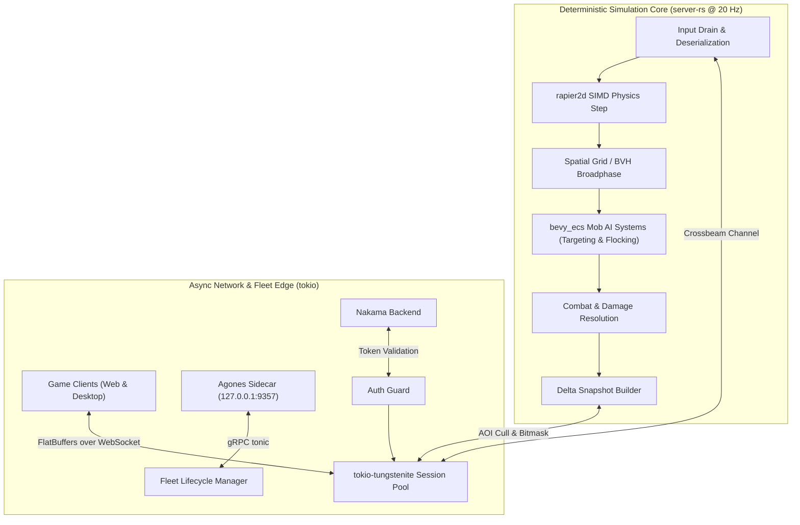

# Design Specification: E-001 High-Density Rust Game Server Migration

**Epic ID:** E-001  
**Target Runtime:** `server-rs` (Rust 1.98+, `bevy_ecs`, `rapier2d`, `tokio`, `flatbuffers`)  
**Previous Runtime:** `colyseus-server` (Node.js TypeScript, Planck.js Box2D)  
**Authors:** Atlas World Architecture Team  
**Status:** In Progress (Wave 1: Slices 1–5)  

---

## 1. Problem & Context

Atlas World's single-threaded Node.js Colyseus game server faced severe tick budget overruns under dense combat simulations. Profiling revealed:
1. **$O(N^2)$ Separation and Targeting:** Mob steering and target acquisition executed $> 3.3\text{M}$ unindexed Euclidean distance calculations per tick at 300 players $\times$ 1,000 mobs, pushing tick times to 383.5 ms (7.6× over the 50 ms budget).
2. **Garbage Collection Stop-The-World Spikes:** Under sustained load, Node.js V8 heap garbage collection introduced periodic 20–60 ms pauses.
3. **Scaling Ceiling:** The TypeScript architecture cannot scale to $\ge 10,000\text{--}20,000$ active entities per zone without extreme room partitioning.

### Strategic Selection: Why Rust?
- **Zero GC Pauses:** 100% deterministic memory management.
- **Cache-Locality via SoA:** `bevy_ecs` archetypes store component data contiguously, maximizing L1/L2 cache line hits.
- **SIMD Vectorization:** Math and physics natively compiled with AVX2/NEON instructions.
- **Physics Core:** Native `rapier2d` multithreaded SIMD physics replaces JavaScript `planck-js`.

---

## 2. Decoupled Architectural Flow

---

## 3. Slice Breakdown & Acceptance Assertions

| Slice | Focus | Target Metrics | Acceptance Assertion |
| :--- | :--- | :--- | :--- |
| **Slice 1 (I-126)** | TS Baseline & Golden Trace | p95 $< 50\text{ ms}$ @ 300p $\times$ 1000m | 1,000-tick golden trace recorded with seeded PRNG & `SimClock` |
| **Slice 2 (I-127)** | Headless `server-rs` Simulation Core | p95 $\le 1.0\text{ ms}$ @ 10k entities | Parity comparator matches TS golden trace ($\epsilon \le 0.05$) |
| **Slice 3 (I-128)** | FlatBuffers Binary Delta Sync | $< 5\text{ KB/s}$ per-client wire payload | TypeScript web client parses binary deltas with zero dropped frames |
| **Slice 4 (I-129)** | Agones & Nakama Infrastructure | $< 35\text{ MB}$ Docker image, $< 50\text{ ms}$ boot | Passes Agones health-check loop & rejects invalid Nakama JWTs |
| **Slice 5 (I-130)** | Platform Decorators & Release Cutover | Live playtest ready | `node-server-decorator` upstream support verified, full client cutover |

---

## 4. Verification Evidence & Quality Gates

Each slice must satisfy the **Phased Quality Gate**:
$$\text{Implement} \longrightarrow \text{Verify} \longrightarrow \text{Adversarial Review} \longrightarrow \text{Refactor} \longrightarrow \text{Re-verify}$$
Zero unverifiable claims. All performance metrics backed by empirical benchmark logs.
