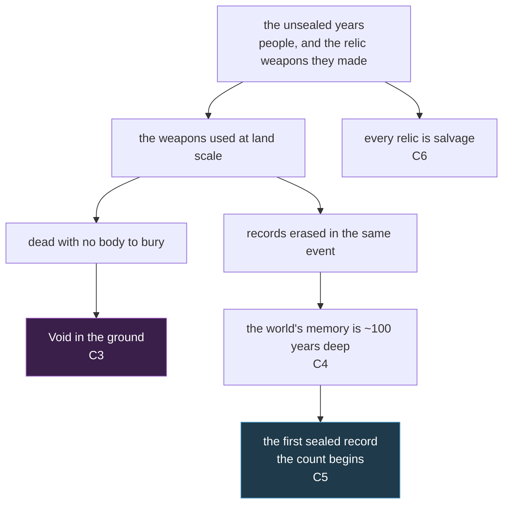

# A1 — Cosmology: the unsealed years

**There is no god in this world, and this document does not add one.**

What it adds is a **history** and a **belief layer over it**. People in this land believe a great
many things about where Void came from and what the ruins mean. Almost all of it is wrong. None of
it is divine.

This is the second half of L1. `A1-geography-cluster1.md` settled where the world is. This settles
**how old it is**, **what Void is**, and **what people believe that is false**.

---

## 1. Provenance where this comes from

**Derives from:** `A0-current-world.md` — its §1.1 (*"there is no cosmology in this world … a total
absence across every content file"*), gap **G2** (no deep time), and gap **G13** (no origin for
Void, magic stones or the relic weapons). Also `A1-geography-cluster1.md` and `canon.md` §1 and §5.

**Researched against:** `docs/research/2026-08-01-dossier-death-relics-forbidden.md` — death rites
and the cost of burying properly, relic authentication and fraud, how prohibitions on knowledge
actually work — and `docs/research/2026-08-01-dossier-bells-and-news.md` — bells as legal
instrument, institutional control of information, folk belief against institutional belief.

**Known limitation.** The synthesis contract describes a parked `cosmology-draft-zero.md`, kept as
the "no research" baseline to compare a researched version against. **That file does not exist** —
not on disk and not in any commit on any branch. This artifact therefore has no baseline it was
scored against, and no claim of superiority over one is made here.

---

## 2. Claims binding

Seven facts. Everything authored after this document treats them as true.

| # | Claim |
| --- | --- |
| **C1** | There were people here before the present count. They were capable enough to make the relic weapons. |
| **C2** | Their age ended in the use of erasing weapons **at the scale of the whole land**. |
| **C3** | **Void is the residue of dead who left no body to bury**, at that scale. It is a consequence of what people did — not a force, not a curse, and not a will. |
| **C4** | Their records did not burn and did not rot. **They were erased**, by the same weapons, in the same event. |
| **C5** | The present count of time begins at the **first sealed record** — the first document the Bellfaith vouched for. Everything before it is *the unsealed years*. |
| **C6** | **No one alive can make a relic.** Every relic in the world is salvage. There is no forge, no school, no supply. |
| **C7** | **Magic stones are not of that age.** They remain ordinary minerals, mined in many towns and sold like any other good. |

**Why C7 exists.** One era explaining relics *and* Void *and* magic stones *and* the elements would
be the oldest cliché in the trade — the ancient civilisation that did everything. Magic stones stay
mundane and unexplained on purpose. The unsealed years answer two questions, not four.

---

## 3. Causal links what each claim explains

A claim that explains nothing already on the page is decoration. Each of these was a loose end
before this document existed.

| Claim | The existing fact it explains |
| --- | --- |
| **C1** | The Last King took an **ancient weapon** from the palace vault (`core-story.md:40`). Ancient *to whom*, and made *by whom*, had no answer. Now it does. |
| **C2** | Why exactly one class of weapon like this exists, with no rival, no second example and no industry around it. |
| **C3** | `canon.md:354` — *"War-scar monsters are Void-line"* — and `A0:278`, where void is the most-used element in the whole corpus and is **concentrated on the war ground**. Void was already behaving like a by-product of battle. This names the mechanism it was already obeying. |
| **C4** | `A0` **G2** — the world's memory is about a hundred years deep and nothing older is mentioned anywhere. The shallowness stops being an oversight and becomes the scar. |
| **C5** | `canon.md` §4 — the Bellfaith owns the news, the proclamation and the seal. Its authority now has a **history**: it did not become powerful by being holy. It became powerful by being first to write things down and vouch for them. |
| **C6** | Act 4's entire stake. The relic sale is the most consequential transaction in the world because supply is fixed at whatever survived — `event-relic-deal-struck`, `event-relic-sale-stopped`. |
| **C7** | `canon.md:301` — magic is cheap, ordinary, no shortage, no black market. Left exactly as it was. |

---

## 4. Consequences ordinary life

**Which claims carry consequences, and which do not.** The contract asks for at least two
second-order effects per claim. **C3, C5 and C6 carry them** and are worked through below.

**C1, C2 and C4 are structural** — they say who existed, what they did, and why no record of it
survives. Nothing in a miller's week changes because of them; their ordinary-life effects reach
daily life *through* C3 (the Void they left), C5 (the count that started after) and C6 (the
salvage they left behind), which is where those effects are stated. **C7 mints none by design** —
it exists to keep magic stones exactly as they were.

Stating this rather than manufacturing thin consequences for C1, C2 and C4 is the honest reading
of the rule.

<strong>burial</strong> a defence budget <em>not a rite</em>

<strong>the seal</strong> the oldest thing in the world <em>and it is a grain tally</em>

<strong>relics</strong> a market with no producers <em>so the business is proof</em>

### From C3 — burial is infrastructure

**A town's burial budget is a defence budget.** Burying the dead is pest control with a liturgy on
top of it. A town that cannot afford to bury will find things in its fields the following season.
This is a line item, and it is argued over in council alongside the walls.

**A caravan guard is paid to bring bodies back.** Not out of sentiment — out of arithmetic. What
he leaves on the road is what he fights next year. Gravedigging is a paid trade with a wartime
surge price, and the first thing a town short of coin tries to cut.

**Ashvale Front is the one thing the two towns cooperate on.** `canon.md:188-189` already says
*"neither town claims it, both bury their dead in it."* That was read as a truce gesture. It is
not. It is <mark>both towns paying into the same defence</mark>, and neither has ever said so out
loud.

### From C5 — the count is a filing decision

**An unsealed document is worth nothing**, and the Bellfaith charges to seal. It is a notary with a
monopoly, and a founding story that happens to be true.

**Forging a seal is the highest-value crime available in this world** — which is precisely the
Bell-Keeper's crime (`canon.md` §3). His motive stops being personal weakness alone and becomes
the obvious exploit of the most valuable instrument anyone owns.

**A miller dates his lease from the count**, because there is nothing else to date it from.
"Before the seal" is how ordinary people say *so long ago that it does not bear on this*.

### From C6 — a market with no producers

**Authentication is the whole business.** The Cindered each carry one relic token
(`lore-what-the-prophet-carries`). Who certifies a token, and for what fee, is a trade with no
regulator and no way to be sure.

**Cindervast is the richest ruin in the world and nobody will go in.** The Stoneguard are keeping
something valuable and do not know it — they think they are keeping a habit.

---

## 5. Costs and limits what it costs, who cannot have it

- **The erasing weapons cannot be made, counted or studied.** Using one destroys the record of its
  own use, including any record of how many were made. Nobody can prove how many remain. This is
  the standing threat, and it is **unresolvable by design**.
- **Void cannot be cured, only answered.** Holy counters it (`canon.md:382`); burial prevents it.
  Neither undoes it. Ground that has held unburied dead stays Void-line, and stays that way.
- **The Bellfaith's authority has an expiry it cannot admit.** The count began when somebody chose
  to start writing. It is arbitrary. The tower knows the first sealed record is not the first
  event — only the first one anyone signed for.
- **Nothing here gives anyone a new power.** This document mints no ability, no item, no stat, and
  no advantage. It explains what was already happening.

---

## 6. Known-wrong what people believe that is false

In the manner of `canon.md` §3's who-knows-what matrix.

| Widely believed | Actually true |
| --- | --- |
| Void is a punishment, a curse, or the breath of something that wants in | It is the arithmetic of unburied dead. Nothing wants anything. |
| The world is about as old as the count | The count is a filing decision. The world is much older. |
| Relics are **found** | Relics are **inherited**. Someone made them, and that someone died in what they made. |
| The unsealed years were a golden age — or a savage one | Both are guesses. No record survives to support either, which is exactly why both persist. |
| The Bellfaith's authority is sacred in origin | It is clerical in origin. It wrote first. |

**The Ash Prophet is the most fervently wrong, and stays wrong.**

He already *"holds the vacuum as a religion"* (`A0:113`, glossing `core-story.md:55`) and shows
his relic token as a sermon — *"I made mine a sermon"* (`lore-what-the-prophet-carries`). Under
**C3** he is preaching the meaning of an erasure.

**This document does not correct him, and no content authored after it may.** He is the
load-bearing proof that in this world belief runs well ahead of fact — and he is not a fool for it.
His reading is the one that lets a survivor keep standing.

---

## 7. What this does not change

Everything listed here stays valid, unamended.

- **The magic model** — `canon.md` §5 entire: magic is cheap and everyday, runes are the real
  limit, rune-craft belongs to everyone, High-Tier is the ceiling.
- **The six elements and the resistance table**, including Holy ⇄ Void as the only mutual pair.
- **Magic stones** — mined, sold, unexplained (**C7**).
- **Classes and races** — all sixty-four pairings, every lean, and the rule that none of it exists
  in game state yet.
- **The five-act epic** — every event id, character fate and quest is untouched. **One wording
  change did land inside the act-4/5 spine**: the Iron Regent's stated ambition, reworded from
  *"the second king"* to *"the only power left"* when the king theme was removed. No event, no
  fate and no quest changed with it. See the design's §9.3 for the full site list.
- **The 116-design bestiary**, the Thornveil placement file, and every mob type.
- **The Last King of Cindervast** — the three-layer villainy, the seventy hanged, the relic weapon,
  the erased city, the standing statues, the Cindered, the Stoneguard. Whole.

---

## 8. What must stay unanswered

These are not gaps to be filled later. **Content that answers any of them contradicts this
document.**

1. **What the age was called.** No record survived, so it has no true name. *The unsealed years* is
   what this generation calls it — not what it called itself.
2. **Who those people were** — whether they were like us, what they wanted, how they were governed.
3. **How the weapons work.**
4. **Why they were used.**

**Why this is load-bearing.** Answer all four and §6 collapses — there is nothing left for anyone
to be wrong about, and the belief layer that makes this world feel inhabited goes with it. The
silence is the design.

---

## 9. Contradiction rule

Matching `canon.md` §6. Content authored after this document that contradicts it is a review
finding: **fix the content, not this file.** Where this document contradicts existing content, the
collision is named and its fix ships in the same commit — the king-theme removal recorded in
`docs/superpowers/specs/2026-08-06-l1-cosmology-design.md` §9.3 is the worked example.

Scope of what may be amended at all is governed by `DR-006-swf-scope.md`.

---

## 10. Open questions handed to L2 and L3

1. **Where does physical evidence surface, and how often?** The Northern Icefield is the one place
   named here as giving things back. Whether any other zone does is unanswered.
2. **Does any relic besides Cindervast's exist on the map?** **C6** implies a fixed surviving supply
   but deliberately does not count it. Counting it would cap the sequel.
3. **What does the first sealed record actually say?** Named here as a grain tally and nothing more.
   It is a strong hook and should be spent deliberately, not in passing.
4. **Do the other nine zones get cosmology detail of their own**, in the way `A2` gave Thornveil an
   ecology — or is this the whole layer?
