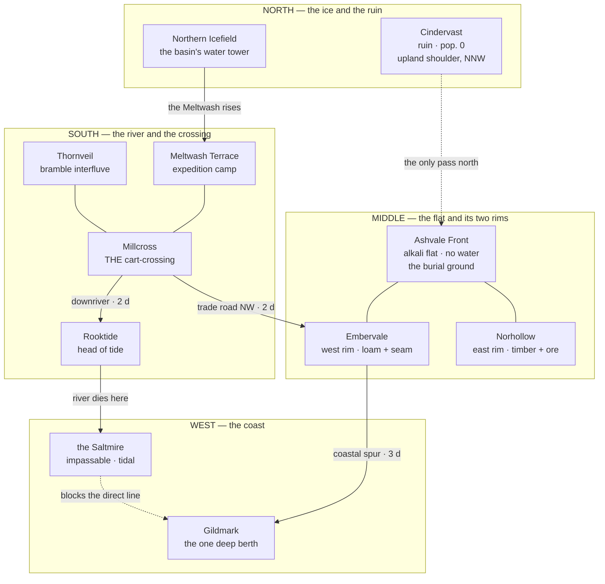

# A1 — Geography of cluster 1

**Level:** L1 · **Role:** Cartographer (charter §2.1) · **Date:** 2026-08-01
**Veto held:** geography that ignores water, terrain, trade routes or travel time
**Builds inside:** `docs/worldbuilding/DR-001-L1-scope.md` — the Undertow is completed history; the playable world is set after act 5; cluster 1 ships at ~9–10 zones and the world grows by region-cluster.

**Read in full before writing:** the roles charter §1/§2.1/§2.4 · DR-001 in full · `A0-current-world.md` (44 commitments, 23 gaps, 14 contradictions) · `content/story/canon.md` §4 · `content/maps/atlas-frontier.md` · `role-systems-designer-scale.md` §1.
**Measured from the repository at this commit:** the bestiary's region × level-band cross-tabulation (§4.3), and `regions.json`'s ten region ids.

<strong>Scope of this document.</strong> Landmass, water, terrain, roads, travel time, settlement
logic, and the ten zones of cluster 1. Nothing else. No gods, no legend, no history before record —
those belong to the Theologian and the Deep-Time Historian. Where a geographic fact would settle
something another role owns, it is <em>flagged and routed</em>, never decided here (§8).

<strong>Names are provisional pending the Namer.</strong> Six new proper nouns appear here —
<strong>the Meltwash</strong>, <strong>the Saltmire</strong>, <strong>Meltwash Terrace</strong>,
<strong>Emberdown</strong>, <strong>Hollowmarch</strong>, <strong>Gildmark Head</strong>. Each is
built to <code>style.md</code> §2's Ashen Vigil morphology (terse two-word compound, plain nouns) and
each is G7-clean — no real-world place, people or institution, and no near-homophone. The Namer
ratifies or replaces them; the <em>geography</em> they describe is what this document commits to.

---

## 1. The landmass in one line

<strong>A west-facing river basin:</strong> one great river, the <strong>Meltwash</strong>, is born
under the northern ice, cuts south through the middle of the land, turns west, and dies in a tidal
mud basin — <strong>the Saltmire</strong> — that silts the whole coast except one rock headland.
Every town in the world sits on that river, on the one road that crosses it, or on the one rock the
mud did not reach.

That single sentence is doing all the work in this document, so it is worth naming what it buys:

| Existing canon commitment                                                              | What the basin makes it a **consequence** of, rather than an assertion                                                                                                                                                                      |
| -------------------------------------------------------------------------------------- | ------------------------------------------------------------------------------------------------------------------------------------------------------------------------------------------------------------------------------------------- |
| **V8 — Gildmark is the coast's only deepwater port**                                   | A river draining a whole basin builds a bar across its own bay. The coast is mudflat and shifting sand for its entire length; **Gildmark Head is the one place the sea floor drops away next to standing rock.**                            |
| **Millcross is the hub every road passes through** (`canon.md` §4)                     | The Meltwash splits the land in half. There is exactly **one crossing a loaded cart can take**, and Millcross is the mill and the cross at that crossing — its own name says so.                                                            |
| **Millcross → Gildmark is 2.5 h, and Embervale → Gildmark is 1.5 h** (`canon.md` §4)   | The Saltmire blocks the straight western line out of Millcross. The trade road must swing **north-west around the mire's head**, through Embervale, before it can turn for the coast (§5.2).                                                |
| **Rooktide is inland, 1 h south, "off the war road entirely"** (`canon.md` §4)     | Rooktide sits at the **head of tide** — the furthest point upriver the sea reaches. Barge traffic transfers there and nothing military has a reason to. Its emblem is already "a rook in flight over a rising tideline" (`style.md` §3).    |
| **Ashvale Front is lethal, and neither town claims it** (`canon.md` §4)                | The plain is a **dry alkali flat with no water on it**. Nobody can garrison ground that cannot drink; both towns can reach it in under an hour; there is no cover anywhere on it (§4.2, zone 8).                                                |
| **Embervale is both a farm town and a mining town** (contradiction **X1**, unresolved) | The west rim is where hill loam meets a shallow **burning-stone seam**. A town there farms _and_ digs, which is exactly why two sources describe it differently. **Proposed** resolution, routed to the Archivist (§8) — not asserted here. |

<strong>The veto standard I am holding myself to.</strong> A settlement exists because of water, a
crossing, a landing, a seam or a defensible rock — or it does not exist. Every one of the six towns
above now has one. So does every zone in §4. If a later level adds a settlement with no such reason,
that is the thing this role blocks.

---

## 2. The frame — where everything is

North is toward the ice. The sea is the entire western edge. The land is roughly **190 km north-south
and 150 km east-west** (§5.1 shows the arithmetic), which is a **province, not a continent** — and
that is deliberate: it is the size canon's own travel times, army sizes and population table were
written for (A0 §5.1, §5.4).

**The fork at Millcross.** North of the ford the road splits, and that fork is the town's whole
reason to exist: **north-west onto the Ashvale flat** (the war towns, and Cindervast beyond them) or
**north-east up the river terrace** (the expedition camp, Thornveil's edge, and the ice at the head
of the water). South from the ford, one track follows the river down to Rooktide. This preserves
`canon.md` §4 exactly — the icefield is "further north past Millcross's expedition camp," Thornveil
is "east of Millcross," and the sister towns are across the plain from each other.

**Coordinate convention** is inherited unchanged from `content/maps/atlas-frontier.md`: **north is
smaller `y`, east is larger `x`.** Cluster 1 extends that frame outward; it does not re-orient it.

### 2.1 Two contradictions this frame touches

Reported, per the Archivist's method — **not resolved here**.

- **X4 — where Cindervast lies.** `canon.md` says "beyond Ashvale Front to the **north-west**"; the
  shipped SVG map (V10, very costly) draws it **due north**. The basin places it on the upland's
  **west-facing shoulder above the north end of the Ashvale flat** — which reads as north-north-west,
  satisfying both sources to within the precision either one actually claims. This is a geometric
  accommodation, not a ruling. Routed to the Archivist.
- **X8 — where the Stoneguard are.** They are placed on the Northern Icefield (`factions.json`, an
  oath-tablet "half-buried in the shelf ice") _and_ at the dead gate of Cindervast (`canon.md`). The basin
  makes both true without either moving: **the icefield's southern lip and Cindervast's upland
  shoulder are the same high ground**, close together along the shelf. A guard company holding a
  gate on the ruin's north side is standing on the ice. Routed to the Archivist as an accommodation.

---

## 3. Water, terrain and why anyone lives here

### 3.1 The water

One river system, four states along its length. This is the spine of the whole map.

| Reach                  | Where                                  | Character                                                                                                                                                          |
| ---------------------- | -------------------------------------- | ------------------------------------------------------------------------------------------------------------------------------------------------------------------ |
| **The heads**          | under the icefield's south lip         | Meltwater from beneath the shelf, cold, milk-grey with rock flour, braided across gravel. Runs hard in thaw, near-dry in deep cold — the land's one seasonal clock |
| **The upper Meltwash** | down the eastern terrace past the camp | Gravel-bedded, fordable in a dozen places on foot, in **exactly one** by cart — that place is Millcross                                                            |
| **The tidal reach**    | Millcross south to Rooktide            | Slows, widens, silts. The sea pushes up it twice a day as far as Rooktide's landing and no further. Brackish, reed-fringed, barge water                            |
| **The Saltmire**       | west and south-west, to the bay        | The river stops being a river. A tidal basin of channels, mud, salt scrub and moving sandbars — **no road crosses it, and no keel drafts it**                      |

**Why the Ashvale flat has no water at all**: it lies west of the river's line and above the tidal
reach, on old lake silt with no catchment of its own. Rain sinks and goes alkaline. That is the
single fact that makes it a killing ground and a burial ground rather than farmland or a garrison.

### 3.2 The terrain, in five kinds

1. **Ice shelf and gravel head** (north) — old ice over stone, meltwater braids, no soil.
2. **Upland shoulder** (north-north-west) — the only defensible rock above the flat. Cindervast was
   built on it; the pass north out of the basin runs behind it.
3. **The alkali flat** (middle) — pale, level, treeless, windblown. Dusts everything grey. Easy to
   dig, which is why the dead go in it, and offers no cover for a full day's crossing.
4. **Rim country** (both sides of the flat) — where the silt meets real ground. **West rim:** hill
   loam over a shallow burning-stone seam (Embervale). **East rim:** old timber running up to ore
   heads in the eastern hills (Norhollow).
5. **River country and bramble interfluve** (south and east) — terraces, reed flats and, between the
   Meltwash and the eastern hills, a **stony bramble upland no road ever crossed** (Thornveil).

### 3.3 Why people are where they are — the one-line test

| Town           | The reason, in one line                                                                   |
| -------------- | ----------------------------------------------------------------------------------------- |
| **Millcross**  | The only cart-crossing of the river that splits the land, and the fork of the north road  |
| **Gildmark**   | The only rock on a silted coast, next to the only water deep enough for a sea keel        |
| **Embervale**  | Hill loam over a burning-stone seam, at the junction of the trade road and the coast spur |
| **Norhollow**  | Where the timber line and the ore heads both begin, at the flat's eastern edge            |
| **Rooktide**   | The head of tide — sea barges stop, river barges start, and cargo has to change hulls     |
| **Cindervast** | The upland shoulder: the land's other defensible rock, guarding the only pass north       |

<strong>Note what this does to the political map.</strong> Five of the six towns exist because of a
<em>transfer point</em> — a ford, a berth, a road junction, a hull change, a pass. That is why a land
with no federation, no common law and no central court (V14) still has six towns that cannot ignore
each other: <strong>they are not neighbours by choice, they are links in one chain of cargo.</strong>
The Brotherhood Caravan (V9) was not sentiment. It was the chain, run once a year, by agreement.

---

## 4. Cluster 1 — the ten zones

### 4.1 The rule I am applying

**A town is not a zone. A town sits inside one.** Cluster 1 is ten _grounds_; six of them hold a
town. This keeps the Systems Designer's hub-zone budget honest (four hub-heavy zones on a 32-zone
continent, not six city instances in a ten-zone cluster) and it means every zone has wild ground,
creatures and work in it — including the ones with a gate and a bell tower.

### 4.2 The ten

| #      | Zone                  | Terrain                                                      | Band                        | Town       | Why it exists geographically                                                                                                   |
| ------ | --------------------- | ------------------------------------------------------------ | --------------------------- | ---------- | ------------------------------------------------------------------------------------------------------------------------------ |
| **1**  | **Meltwash Terrace**  | River terrace: cropped grass, the gravel bars, willow scrub  | **1–10**                    | — (camp)   | The only drained flat ground within a morning's walk of the ford. Stock, tents and anyone waiting for the crossing go here     |
| **2**  | **Millcross Ford**    | Mill-race, cart-ramp, mud, refugee sprawl on both banks      | **1–15**                    | Millcross  | The one place a loaded cart crosses the Meltwash, and the fork where the north road splits                                     |
| **3**  | **Rooktide Reach**    | Tidal river, reed flats, stepped terraces, barge landings    | **10–20**                   | Rooktide   | The head of tide. Sea barges can come this far and no further; cargo changes hulls or it does not move                         |
| **4**  | **Thornveil**         | Stony bramble upland, dense sightlines, no through-track     | **15–28**                   | —          | The interfluve between the river and the eastern hills — the ground every road went **around**, so it stayed nobody's          |
| **5**  | **Emberdown**         | Hill loam, terraced fields, the adits into a burning-stone seam | **25–35**                | Embervale  | Where farmable loam sits directly on shallow fuel — and where the trade road meets the coastal spur                            |
| **6**  | **Gildmark Head**     | Rock headland, deep berth, harbour terraces, the mire's bar  | **30–45**                   | Gildmark   | The single point on a silted coast where standing rock meets water deep enough for a sea keel                                  |
| **7**  | **Hollowmarch**       | Old timber running up to ore heads; the palisade line at the rim | **35–48**                   | Norhollow  | The flat's east edge, where the timber line and the ore both start                                                             |
| **8**  | **Ashvale Front**     | Level alkali flat, no water, no cover, the grave rows        | **10–80 · gradient (§4.3)** | —          | The only ground both towns reach in under an hour and neither can hold: nothing to drink, nothing to hide behind, easy to dig, scored by the abandoned cut lines neither side ever filled back in |
| **9**  | **Northern Icefield** | Old ice over stone, meltwater braids, the crevasse shelf     | **55–70**                   | —          | The basin's water tower — every river in cluster 1 starts under this shelf; the Stoneguard hold the oath-gate in its south lip |
| **10** | **Cindervast**        | Burnt city on an upland shoulder, ash streets, standing rock | **65–80**                   | — (pop. 0) | The land's other defensible rock, sitting on the only pass out of the basin to the north — which is what made it worth killing |

### 4.3 The Ashvale Front is not a band — it is a gradient, and the bestiary already says so

DR-001 §10 hands L2 an open question: _"P1 puts the Ashvale Front — 26 of 116 designs — at the centre
of the game, which forces a decision about where on the level curve the corpus's most distinctive
ground sits."_ Geography answers it, and the answer is already in the data.

Cross-tabulating `content/bestiary/bestiary.json` by region and level band, **Ashvale Front is the
only region of the nine with species in all eight bands**:

<strong>26</strong> Ashvale Front species

<strong>8 / 8</strong> bands covered — unique in the corpus

<strong>1–10 → 71–80</strong> 1 · 3 · 4 · 4 · 4 · 4 · 3 · 3

<strong>0</strong> other regions covering all 8

The Front is not a place. It is a **strip roughly 30 km long**, and its two ends are different
ground:

- **The southern lip** — nearest Emberdown and the ford. The **old** burials, from the war's first
  seasons: settled, marked, grassed over, worked for years by every burial detail before this one.
  Quiet ground. **Bands 10–25.**
- **The middle** — the seasons in between. Rows still legible, some subsidence, Void-scar thinning
  but not gone. **Bands 25–50.**
- **The northern deep** — under Cindervast's shoulder, where the last season's dead lie where they
  fell and nobody has ever come back for them. **Bands 55–80.**

<strong>This is the burial detail's career, drawn as a map.</strong> A player under the Bell School
starts at the southern lip re-marking graves that were dug properly twenty years ago, and ends their
levelling walking north into ground that has never been buried at all. The level curve <em>is</em>
the distance from the last living town. Nothing has to be invented for that; the bestiary's own
band distribution has been describing it since it was written.

### 4.4 The route, and what cluster 1 does not have

**The spine, in walking order:** Meltwash Terrace → Millcross Ford → Rooktide Reach → Thornveil →
Emberdown → Gildmark Head → Hollowmarch → Ashvale Front (northward) → Northern Icefield →
Cindervast. Ten zones, bands 1–80, **one route.**

The Systems Designer's own model calls for **three zones per ten-level band** — one main route plus
two alternates — which is 24 levelling zones, not ten. **Cluster 1 therefore ships a single route
with no alternates, and I state that as a known deficiency rather than hiding it.** The alternates
are the first thing cluster 2 owes, and the map already knows where they go: the Saltmire's channels
(a whole zone of tidal ground currently folded into the edges of zones 3 and 6), the coast north of
Gildmark, and the far side of the eastern hills behind Thornveil.

**Two doors lead out of cluster 1**, and both are already open in the corpus at zero cost:

1. **Gildmark's sea-lane** — merchantmen arrive once a year on the trade wind from lands nobody in
   this story has seen (`core-story.md:26`, A0 §5.2). A sea cluster needs no new justification.
2. **The pass behind Cindervast** — the only land route out of the basin, and the reason the city was
   built on that shoulder in the first place. It has been shut by a dead city for a generation.

**AMENDED 2026-08-15 (F-043, DR-006 option 3).** Both doors now point at named places: the
sea-lane's far end is charted to the port of Tallowquay on Coldreach (`A2-wider-world.md`;
`e-lane-coldreach`, `n-coldreach`), and the pass stays shut.

---

## 5. Distances and travel

### 5.1 The reconciliation canon's numbers actually force

Canon states six distances in hours (`canon.md` §4, post-F-045). The reconciliation is a **road
pace**, and once that is fixed everything else is arithmetic rather than assertion.

**Pace: 11 km/h.** This is deliberately slow — laden carts and bell-riders make roughly
the same time here, which is precisely what `canon.md` §4 asserts when it says the sealed
proclamation "travels by bell-rider or message-bird along the trade roads, **at the same pace as any
other road traffic**." A road where a courier cannot beat a cart by much is a bad road: fords,
mud, mire edge, tolls, and no relay stables outside the Broker's own (which is the entire point of
his edge).

| Leg                                | Canon        | Road km  | Straight-line km | Why the road is longer                                           |
| ---------------------------------- | ------------ | -------- | ---------------- | ---------------------------------------------------------------- |
| Embervale ↔ Norhollow              | 0.5 h        | **6**    | 7.1               | Straight across the flat — the road _is_ the straight line       |
| Millcross ↔ Rooktide               | 1 h          | **12**   | 10.9              | Follows the river's south bank                                   |
| Millcross ↔ Embervale              | 1 h          | **11**   | 9.7               | North-west off the ford, around the mire's head                  |
| **Embervale ↔ Gildmark**           | **1.5 h** (spur) | **17** | 14.1            | The coastal spur; already past the mire when it starts           |
| **Millcross ↔ Gildmark**           | **2.5 h** (road) | **28** | 17                | **1.6× the straight line** — the Saltmire blocks the direct west |
| Norhollow ↔ Gildmark               | 1.5 h        | **19**   | 18.6              | East-rim track joins the spur near Emberdown                     |
| Cindervast ↔ Rooktide (whole land) | 3.5 h        | **38**   | 34                | The longest committed leg (A0 §5.1 item 5)                       |

<strong>Nothing in canon had to move.</strong> Millcross → Gildmark at 2.5 h and Embervale →
Gildmark at 1.5 h look inconsistent for a land where "every road passes through or near Millcross"
— the hub appears to be <em>further</em> from the port than a town on its own spur. The Saltmire
explains it exactly: the hub sits on the wrong side of an impassable basin, and canon already calls
Embervale's route a <strong>spur</strong> — a side road, not the trunk. Millcross keeps the hub role
because it owns the crossing everything else must use; it simply does not own the shortest line to
the sea. That single fact is also the Broker's leverage, expressed as terrain.

### 5.2 The bell relay, given no towers to count

A0 §5.3 flagged that a relay chain "reaching six towns in hours" would need a tower count, a
maintenance cost and an owner if the world grew — and the redraw answered that question by removing
the towers rather than counting them: the drawn world carries **zero tower nodes** (down from an
earlier 27-tower chain). `canon.md` §4 now routes the fast signal through **each town's own bell**,
relayed to the next town along the road, which needs no standing infrastructure between towns at all.

- The longest committed leg is Cindervast–Rooktide at **3.5 h** (§5.1's table), so a code passed town
  to town along the roads crosses the whole cluster in **at most 3.5 h** end to end. ✔ matches
  `canon.md` §4's "within hours."
- The sealed detail behind it moves at the same road pace: **0.5 h to 3.5 h** depending on the leg —
  the same numbers, because the fast signal and the slow detail now travel the same roads. `canon.md`
  §4's exploit is therefore a gap in DETAIL (a bell's bare category vs. a bell-rider's full
  proclamation), not a gap in raw speed the way the old hours-versus-days framing had it, back when
  towers made the fast signal near-instant; **the widest gap in raw travel time is the
  Cindervast–Rooktide leg (3.5 h)**, and the widest gap on a road the Broker actually controls is the
  Millcross–Gildmark trunk (2.5 h) through Gildmark's trade contracts.
- **The far-mirrors** still need line of sight and elevation, so they still follow the same
  ridgelines the trade roads climb — a **private line on public road ground**, which is a sharper
  description of Gildmark's monopoly than "they have mirrors." They do not need the retired towers to
  make that claim.

### 5.3 Game distance versus fiction distance — stated, not discovered

This is the part every world map gets wrong by leaving it implicit, so it is stated here as a rule.

Measured: a player moves **20 world units/s** (`Player.ts:23`). The Systems Designer's zone geometry
gives **~1.8 × 10⁷ u² per zone**, a square ~4,240 u on a side, ~3.5 min to cross on foot. Ten zones is
**~1.8 × 10⁸ u²**, a square ~13,400 u on a side, **~11 minutes** end to end on foot.

The same land is **~38 km** in fiction and takes **3.5 hours** to cross.

<strong>The rule: the playable map preserves topology, adjacency, ordering and terrain. It does not
preserve metric distance.</strong> The compression is roughly <strong>2.8 metres of fictional ground
per world unit</strong>, and it must be <strong>uniform</strong> — uneven compression is what makes a
game map feel wrong even when players cannot say why. Canon's hour-counts stay canon and are never
restated as walking times. Where the game has to express "a leg's full travel time," it does it with a
<strong>signpost at a waystation</strong>, not with the player's legs.

**Consequence for `content/maps/atlas-frontier.md` (commitment C17, gate-bound).** Today's shipped
1000×1000 shelf holds three regions — meadow, icefield, thornveil — that this document places in
three _different_ zones, tens of kilometres apart. The shelf is therefore a **compressed miniature**,
not a scale sample. It is not this role's call whether it is rebuilt as the Meltwash Terrace zone or
retired; it is gate-bound content and the Systems Designer owns the topology decision (DR-001 §6.4.2).
**Routed, with the note that the meadow's own placement — "north-east of the ford, one morning's walk"
— is the only part of it this document depends on.**

---

## 6. The six towns, after the war

Written to drive concept art: silhouette first, then material, then colour, then the thing a
traveller sees before anything else, then what the place does for a living. Palettes, emblems and
costume motifs are taken unchanged from `style.md` §3 (commitment C7) — they are not re-invented here.

**Millcross.** A walled crossing town built along both banks of a river crossing, its roads
spilling a quarter-mile out of the gates. Inside the timber-and-earth wall — thrown up after the
war, when the raids came down the roads — a high street of timber-framed houses on stone footings
runs from the west gate to the ford: the guild hall and the inn rise a second storey, a bakehouse,
a provisioner, a herbalist and a weapon-smithy front the street, and the cart yard waits by the
water. The silhouette stays horizontal and low: the mill-wheel housing over the race is taller
than the wall, and nothing else competes with it. Material is local where it can be — mill timber, river stone, valley clay-and-lime whitewash;
slate and fired brick arrive as barge ballast landed at the ford — and the palette is ash-grey,
rope-brown and tallow-yellow, the colour of unpainted wood and cheap light. **First thing a traveller sees: the cart queue.** It starts before the town
does, sometimes a mile out, because one crossing serves an entire land. Millcross lives on the
ford — the wall guards the crossing, and the town still refuses to formalise the tolls; stabling,
ferrying at high water, and feeding whoever is waiting pay for the wall's upkeep. Beyond the gates
the roads keep spilling: the east bank's terrace rows never stopped growing, and the displaced
still arrive — those on the road camp under canvas at the crossroads and move on. Its emblem,
crossed roads over an empty bowl, is chalked on awnings, not carved.

**Embervale.** A hill town on the west rim, stacked up the terraced ledges — six or seven of them — above its own
fields, so the silhouette is a stair of slate roofs with smoke standing off each ledge. Material is
warm: fired brick, red pantile, and a black volcanic-looking clinker from the seam used for every
wall footing. Palette is iron-red, banner-black and hearth-orange — the ember-red banner on every
frontage is a mourning colour here, not a war one. **First thing a traveller sees: the smoke.**
Not one plume but forty, low and level, from the burning-stone hearths that never go out. Embervale
farms the loam on the ledges and digs the seam under them, which is why one source calls it a farm
town and another a mining town. After the war the mourning cloth stayed on; the town wears banded
black over old militia colours as ordinary dress, and there are more banded coats than there are
people who lost someone, which is the point.

**Norhollow.** A palisade town in a wooded hollow on the east rim, and the palisade is the
silhouette — a continuous line of sharpened trunks with the town's roofs sitting below the top of
it, so from the flat you see a wall and some smoke and nothing else. Material is timber, everywhere,
and the only stone is the ore-head machinery. Palette is hollow-green, frost-white and weathered oak.
**First thing a traveller sees: the tally boards at the gate** — planed boards, waist high, covered
edge to edge in knife-cut marks, one per name, replaced when full and never erased. Norhollow cuts
timber and works the ore heads behind it. After the war the palisade was not taken down, though
nothing has come out of the flat in a year; the gate is open all day and shut every night by a vote
that is retaken every season and has never once failed.

**Gildmark.** The only vertical town in the world. Built on a rock headland with the deep berth on
its seaward face, it stacks warehouses, counting-houses and stairs up the cliff in five terraces, and
the silhouette ends in one clean landmark — **the mirror tower**, a slim square shaft with a glazed
cap that catches sun at a strange hour. Material is dressed stone at the bottom, timber and rendered
plaster higher up, and every seaward face is tarred black against the salt. Palette is tarnished
gold, wax-seal crimson and harbour-fog grey. **First thing a traveller sees: the bar.** For the last
half-day of the coast road there is nothing but mudflat, wrecked hulls, sandbar and gulls — and then
one rock with a town on it and deep green water at its foot. Gildmark lives on being the door: dues,
tariffs, warehousing, insurance, and the far-mirrors. After the war it is richer, tidier and quieter
about it, and the wax-seal rings are worn a little less openly.

**Rooktide.** A low river town on stepped terraces above a tidal landing, so the silhouette is a
staircase of long, shallow-roofed sheds with the pilings and the barge-cranes below them and, twice a
day, either water or mud where the boats sit. Material is deliberately mismatched — every building
has old plank sewn into new, salvaged from the years the town was nearly empty, and nobody hides the
join. Palette is rook-blue, tide-grey and new-thatch gold. **First thing a traveller sees: the
birds.** Thousands of rooks working the rook flats at low water, lifting all at once when the tide turns.
Rooktide lives on the hull change: everything moving between sea barge and river barge is handled,
warehoused and taxed here. After the war it is the least changed town in the land — which is its
whole identity, and slightly resented.

**Cindervast.** Not a town any more; a silhouette of a town. A walled upland city on a rock
shoulder, roofless, its street grid completely legible from below because nothing has grown to cover
it. Material is stone that was never burnt so much as **bleached** — the relic did not char the city,
it took it, so the walls stand clean and the mortar is intact and there is no rubble in the streets.
Palette is cinder-black, bone-white and a relic-violet afterglow that shows at dusk on the north
faces. **First thing a traveller sees, as the city comes into view: the Giving King statues.** In
every square, the Giving King holding a child, upright and undamaged among the fused shadows of the
people the weapon took. Cindervast does nothing for a living. Its only population is the Stoneguard holding a gate
with nothing behind it, and the Ash Prophet's people in the outer districts, and neither will say
the city's name.

---

## 7. The map's own legend

A world map is an artifact made by someone, for a purpose. **This one is a Bellfaith road map** —
drawn by the institution whose bells relay along it town to town, maintained because the roads must
be maintained, and copied for anyone who asks. That single choice decides both lists below, and it
means the map's omissions are _in character_ rather than convenient.

### 7.1 What the map shows

| Layer                 | Content                                                                                                                                                    |
| --------------------- | ---------------------------------------------------------------------------------------------------------------------------------------------------------- |
| **Water**             | The Meltwash from the ice to the mire, its tidal limit marked at Rooktide, the Saltmire's outline (channels **not** drawn — they move)                     |
| **Roads**             | The trade road as a solid line, the coastal spur and the east-rim track as thinner solids, the Cindervast approach as a dashed line (it is not maintained) |
| **The crossing**      | Millcross's ford marked as a road symbol, not a town symbol — because on this map it is infrastructure                                                     |
| **Towns**             | Six, each with its emblem from `style.md` §3, sized by nothing (the map does not rank them)                                                                |
| **Town bells**        | Each of the six towns' own belfry, marked at the town — the relay runs town to town along the roads already drawn, no free-standing tower between them    |
| **Travel times**      | Hour-counts written **on the road legs**, not a distance scale. The map has no scale bar; it has a walking table                                           |
| **The Ashvale Front** | Its outline and its grave rows as a hatched band, with the northern deep left as open hatch and no rows drawn                                              |
| **Terrain**           | Ice, upland, flat, rim, bramble, mire — six fills, no elevation contours                                                                                   |

### 7.2 What the map deliberately withholds

<strong>Withheld because the mapmaker would not draw it</strong> — every omission is the Bellfaith's
own reticence, not a UI decision.

- **The far-mirror stations.** They sit on the same ridgelines the roads climb and are the one
  channel outside the Bellfaith's relay. A map that showed them would publish a Gildmark monopoly the
  Bellfaith cannot regulate and does not acknowledge.
- **Which ground is buried and which is not.** The Ashvale Front's northern deep is drawn as an
  empty hatch. The Bell School does not publish an inventory of its own unfinished work — and this is
  also the world state DR-001 makes player-generated, so a static map <em>must not</em> pre-empt it.
- **Cindervast's interior.** The walls and the gate; nothing inside. No street grid, no squares, no
  statues. The Bellfaith has no tower there and will not draw a city it does not ring.
- **The icefield beyond the shelf lip.** The map ends where the ice starts moving. There is a
  north edge to the parchment and it is not a coastline. **AMENDED 2026-08-15 (F-043, DR-006
  option 3).** This sheet is the basin survey, unchanged; the atlas sheet (`A2-wider-world.md`)
  reports the cap's <em>seaward</em> margin from mariners' logs (`n-rimewall-cap`) — a reported
  ice edge, never a coastline.
- **The pass behind Cindervast.** Known, unmarked. It leads out of the basin and the map is a map of
  the basin.
- **The sea beyond a day's sail**, and everything the annual merchantmen come from. One arrow off
  the west edge with the trade wind's season written on it, and nothing else. **AMENDED
  2026-08-15 (F-043, DR-006 option 3).** This sheet is the basin survey, unchanged; the wider
  chart — the named far coasts, seas and lanes — is the atlas sheet (`A2-wider-world.md`).
- **Villages.** There are none named anywhere in the corpus (gap G17), and the map does not invent
  them — but it does draw **waystations** on the road legs, because the hour-counts need somewhere
  to end.

---

## 8. Routed elsewhere — not decided by this role

| To                      | Item                                                                                                                                                                                                                                                                                    |
| ----------------------- | --------------------------------------------------------------------------------------------------------------------------------------------------------------------------------------------------------------------------------------------------------------------------------------- |
| **Archivist (G5)**      | **X1** — the proposed farm-_and_-seam reading of Embervale. **X4** — the north/north-west accommodation for Cindervast. **X8** — the icefield-lip / Cindervast-shoulder accommodation for the Stoneguard. All three are geometric accommodations offered for adjudication, not rulings. |
| **Namer**               | Six provisional names: the Meltwash, the Saltmire, Meltwash Terrace, Emberdown, Hollowmarch, Gildmark Head. Note that **Hollowmarch** intentionally echoes Norhollow — same hollow, named twice.                                                                                        |
| **Systems Designer**    | Cluster 1 ships **one route, no alternates** (§4.4) — a known deficiency against the three-zones-per-band model. Also: `atlas-frontier.md`'s three regions land in three different zones under this frame (§5.3); the C17 topology decision is theirs.                                  |
| **Naturalist (L2)**     | Climate, biome and ecology for six terrain kinds; the thaw/deep-cold seasonal clock on the meltwater heads is the only climate signal this document commits to.                                                                                                                         |
| **Theologian**          | The town belfries are Bellfaith property and the map in §7 is a Bellfaith artifact. What the institution believes it is doing by maintaining the relay is not geography.                                                                                                                |
| **Deep-Time Historian** | Why the alkali flat is a dry lake bed, and what the upland pass behind Cindervast used to carry, are both deep-time questions. This document states only that the flat is dry and the pass exists.                                                                                      |

---

## 9. Art briefs

Seven illustrations: one world map, six towns. Each brief leads with the concrete subject.

**A1-ART-01 · The world map.** A single-sheet Bellfaith road map of a west-facing river basin,
drawn as a working document rather than a decorative one: ink on cream parchment, one accent colour
(bell-bronze) reserved entirely for the roads and the six towns' own belfries. A river runs from an ice
shelf across the top edge, south down the right-of-centre, then turns west and dissolves into a
hatched tidal mire in the lower-left quadrant. A rock headland with a town sits at the mire's
seaward mouth on the left edge, with open sea beyond and one arrow off-sheet marked with a season.
Six town emblems mark six towns; a pale alkali flat occupies the upper middle with a hatched grave
band across it, its northern end left as bare hatch. Roads are drawn as solid lines with hour-counts
lettered along them, and one dashed line runs north to a walled outline with no interior. No scale
bar, no compass rose beyond a small north mark, no decorative sea monsters. The parchment ends at a
hard edge along the top — the map does not pretend to know what is past the ice. **AMENDED
2026-08-15 (F-043, DR-006 option 3).** This brief describes the basin survey and is unchanged —
the hard edge stays; the wider chart is a separate artifact, the atlas sheet (`A2-wider-world.md`).

**A1-ART-02 · Millcross.** A small walled crossing town on both banks of a grey river,
viewed from the road at cart height, late afternoon. One mill-wheel housing is the only structure
above one storey — a heavy, plain mass of dark weathered timber on stone footings, read as one
solid block rather than a framed building, its great wheel turning in the open race beside it;
everything else is a single storey, solidly built — timber frames on stone
footings, whitewashed plaster walls, steep slate roofs, brick chimney stacks and brick plinths
(the slate and fired brick come down from upstream quarries and kilns as barge ballast, landed at
the ford and carted into the town) — strung with no plan along the roads. **AMENDED 2026-09-01
(F-039, owner option b, verdicts #15–#17).** The materials register (slate roofs, brick stacks and
plinths) and the mill housing register are canon as measured: three render paths and two seeds
could not produce fine timber articulation on the housing at the measured operating point, so
canon asserts the mass and the wheel, not the joinery. A queue of
loaded carts and led animals stretches from the foreground toward the ford, longer than the town is
wide. Palette ash-grey, rope-brown, tallow-yellow, with chalked crossed-roads-over-an-empty-bowl
marks on the leading awnings.

**A1-ART-03 · Embervale.** A terraced hill town of six stacked ledges seen from the fields below at
dusk, each ledge a row of slate roofs above a retaining wall of black clinker. Forty low, level
smoke plumes stand off the hearths, none of them rising far. Warm materials — fired brick and red
pantile against the black footings; palette iron-red, banner-black, hearth-orange. Ember-red banners
hang on frontages along every ledge, and the figures on the terrace stairs wear banded black mourning
cloth over faded militia colours as everyday dress. A caravan-wheel emblem wreathed in ember-red
thread appears on the largest banner. Adit mouths open directly into the hillside between ledges.

**A1-ART-04 · Norhollow.** A wooded hollow behind a continuous palisade of sharpened trunks, seen
from the open flat at eye level in flat morning light, so that the wall reads as the town's entire
silhouette with only roof-peaks and smoke above it. Everything is timber; the only worked stone is
ore-head machinery visible on the slope behind. Palette hollow-green, frost-white, weathered oak.
The open gate is the focal point, and beside it stand waist-high planed tally boards covered edge to
edge in knife-cut marks. A hollow-bell-over-crossed-stakes emblem is cut into the gate lintel.
Figures wear layered furs over palisade-guard leathers with knotted cords at the belt.

**A1-ART-05 · Gildmark.** A vertical port town stacked in five terraces up a rock headland, seen from
the water at the end of the coastal road, low sun. Dressed stone at the base, rendered plaster and
timber above, every seaward face tarred black against the salt. One slim square tower with a glazed
cap crowns the silhouette and throws a hard reflection. Deep green water at the rock's foot;
immediately beside it, mudflat, sandbar and the ribs of wrecked hulls stretching away into fog.
Palette tarnished gold, wax-seal crimson, harbour-fog grey. A harbour-scale emblem with one pan
sitting slightly lower is mounted over the counting-house door on the second terrace.

**A1-ART-06 · Rooktide.** A low river town on stepped terraces above a tidal landing at slack low
water, so the barges sit in mud on their pilings and the channel is a thin bright line. Long,
shallow-roofed sheds step up the bank; every building visibly has old salvaged plank sewn into newer
timber, the joins unhidden and differently weathered. Thousands of rooks work the exposed flats,
with part of the flock lifting at once. Palette rook-blue, tide-grey, new-thatch gold. Barge cranes
and hull-change gear dominate the foreground. A rook-in-flight-over-a-rising-tideline emblem is
painted on the largest shed's gable.

**A1-ART-07 · Cindervast.** A roofless walled city on an upland rock shoulder, seen from below at
dusk. The street grid is completely legible because nothing has grown over it and there is
no rubble — the stone is bleached rather than charred, walls standing clean with mortar intact. On
the north-facing walls, a faint violet afterglow. In the visible squares, undamaged statues of a
crowned man holding a child stand upright among human-shaped shadows fused flat into the stone
around them. Palette cinder-black, bone-white, relic-violet. A broken-crown-over-ash device is
carved above a closed gate at which a handful of figures in cracked ceremonial plate are still
standing post. No smoke anywhere.

---

**Status:** delivered for L1 synthesis. Geography and settlement only. Three contradiction
accommodations, six routings and one stated deficiency are recorded above rather than smoothed over.
